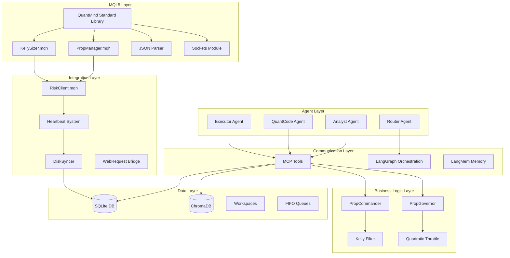
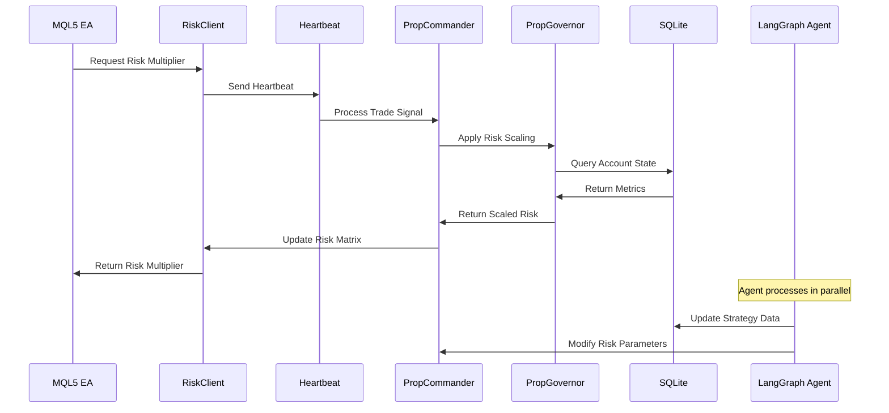
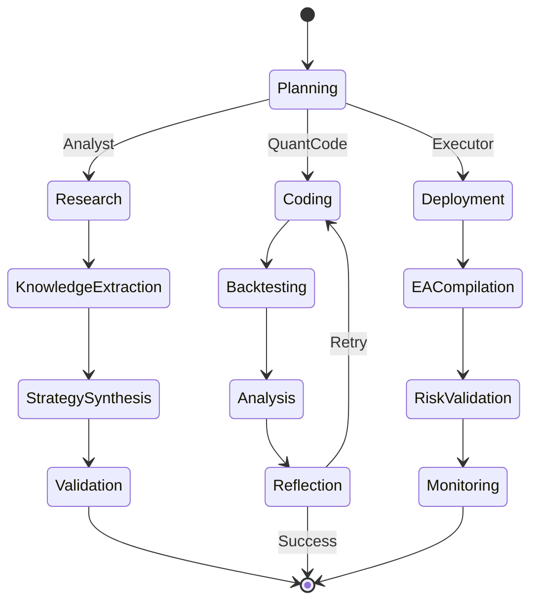
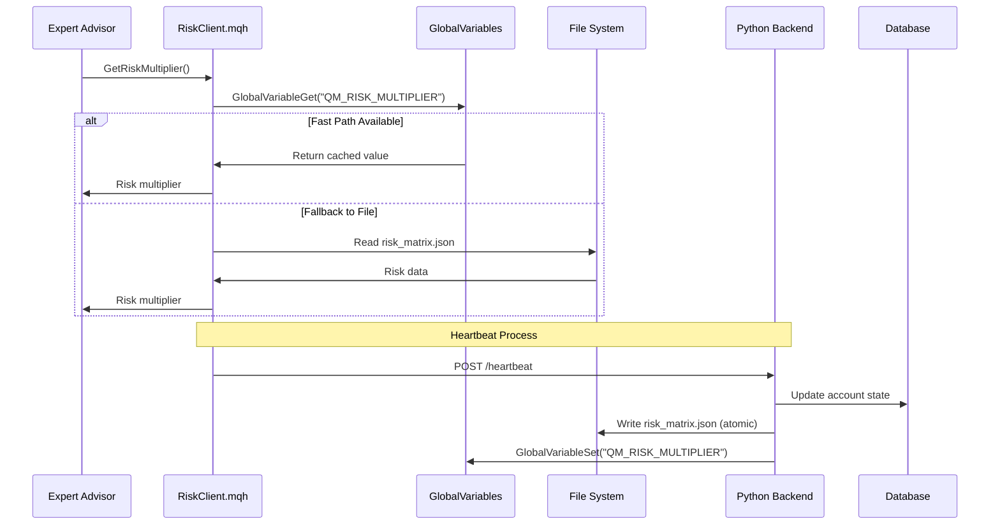

# Design Document: QuantMindX Unified Backend Implementation

## Overview

The QuantMindX Unified Backend Implementation represents a comprehensive migration from a monolithic trading system architecture to a modern, modular, AI-agent-driven platform. This design implements the v7 "Hybrid Core" specification, introducing agent workspaces, local-first database persistence, modular MQL5 components, and sophisticated AI agent orchestration using LangGraph.

The system architecture follows a multi-layered approach:
- **Agent Layer**: LangGraph-based AI agents (Analyst, QuantCode, Executor) with state management
- **Communication Layer**: MCP tools and standardized agent coordination patterns
- **Business Logic Layer**: PropFirm risk management with Kelly Filter and Quadratic Throttle
- **Data Layer**: SQLite + ChromaDB for structured and vector data storage
- **Integration Layer**: MQL5-Python bridge with heartbeat monitoring
- **Infrastructure Layer**: Workspace isolation and FIFO task queues

The design prioritizes local-first operation, backward compatibility during migration, and robust error handling across all system boundaries.

## Architecture

### System Architecture Diagram



### Component Interaction Flow



## Components and Interfaces

### Agent Workspace System

The workspace system provides isolated environments for each agent type with standardized directory structures and task queue management.

#### Workspace Structure
```
workspaces/
├── analyst/
│   ├── specs/          # TRD documents and requirements
│   ├── logs/           # Analysis logs and reports
│   └── inputs/         # Research inputs and data
├── quant/
│   ├── strategies/     # Python strategy implementations
│   └── backtests/      # Backtest results and artifacts
└── executor/
    ├── deployment/     # EA deployment manifests
    └── heartbeat/      # Live system status logs
```

#### Task Queue Interface
```python
class TaskQueue:
    def __init__(self, queue_type: str):
        self.queue_file = f"data/queues/{queue_type}_tasks.json"
        self.lock_file = f"{self.queue_file}.lock"
    
    def enqueue(self, task: Dict[str, Any]) -> None:
        """Add task to FIFO queue with atomic write"""
        
    def dequeue(self) -> Optional[Dict[str, Any]]:
        """Remove and return next task from queue"""
        
    def peek(self) -> Optional[Dict[str, Any]]:
        """View next task without removing"""
        
    def size(self) -> int:
        """Return current queue size"""
```

### Database Layer Architecture

#### SQLite Schema Design

```sql
-- PropFirm Accounts Management
CREATE TABLE PropFirmAccounts (
    id INTEGER PRIMARY KEY AUTOINCREMENT,
    firm_name TEXT NOT NULL,
    account_number TEXT UNIQUE NOT NULL,
    daily_loss_limit REAL NOT NULL,
    max_drawdown REAL NOT NULL,
    created_at TIMESTAMP DEFAULT CURRENT_TIMESTAMP,
    updated_at TIMESTAMP DEFAULT CURRENT_TIMESTAMP
);

-- Daily Trading Snapshots
CREATE TABLE DailySnapshots (
    id INTEGER PRIMARY KEY AUTOINCREMENT,
    account_id INTEGER NOT NULL,
    trade_date DATE NOT NULL,
    high_water_mark REAL NOT NULL,
    current_equity REAL NOT NULL,
    daily_pnl REAL NOT NULL,
    drawdown_percent REAL NOT NULL,
    trades_count INTEGER DEFAULT 0,
    created_at TIMESTAMP DEFAULT CURRENT_TIMESTAMP,
    FOREIGN KEY (account_id) REFERENCES PropFirmAccounts(id),
    UNIQUE(account_id, trade_date)
);

-- Agent Task History
CREATE TABLE AgentTasks (
    id INTEGER PRIMARY KEY AUTOINCREMENT,
    agent_type TEXT NOT NULL,
    task_type TEXT NOT NULL,
    task_data JSON NOT NULL,
    status TEXT DEFAULT 'pending',
    created_at TIMESTAMP DEFAULT CURRENT_TIMESTAMP,
    completed_at TIMESTAMP NULL
);

-- Strategy Performance Tracking
CREATE TABLE StrategyPerformance (
    id INTEGER PRIMARY KEY AUTOINCREMENT,
    strategy_name TEXT NOT NULL,
    backtest_results JSON NOT NULL,
    kelly_score REAL NOT NULL,
    sharpe_ratio REAL NOT NULL,
    max_drawdown REAL NOT NULL,
    created_at TIMESTAMP DEFAULT CURRENT_TIMESTAMP
);
```

#### ChromaDB Collections Design

```python
# Vector Database Collections
COLLECTIONS = {
    "strategy_dna": {
        "description": "Strategy patterns and DNA for semantic search",
        "metadata_fields": ["strategy_type", "timeframe", "asset_class", "kelly_score"]
    },
    "market_research": {
        "description": "Research articles and market analysis",
        "metadata_fields": ["source", "date", "asset", "sentiment"]
    },
    "agent_memory": {
        "description": "Agent episodic and semantic memories",
        "metadata_fields": ["agent_type", "memory_type", "context", "importance"]
    }
}
```

### QuantMind Standard Library (QSL) Architecture

The QSL represents a complete refactoring of the monolithic QuantMind_Risk.mqh into modular, reusable components.

#### Module Organization
```
src/mql5/Include/QuantMind/
├── Core/
│   ├── BaseAgent.mqh      # Base agent functionality
│   ├── Constants.mqh      # System constants
│   └── Types.mqh          # Custom data types
├── Risk/
│   ├── PropManager.mqh    # PropFirm risk management
│   ├── RiskClient.mqh     # Python bridge client
│   └── KellySizer.mqh     # Position sizing logic
├── Signals/
│   ├── Indicators/        # Technical indicators
│   └── Patterns/          # Pattern recognition
└── Utils/
    ├── JSON.mqh           # JSON parsing utilities
    ├── Sockets.mqh        # WebSocket communication
    └── RingBuffer.mqh     # CRiBuff implementation
```

#### PropManager Interface
```cpp
class CPropManager {
private:
    double m_dailyLossLimit;
    double m_currentDrawdown;
    bool m_newsGuardActive;
    
public:
    // Core functionality
    bool InitializePropFirm(string firmName, double lossLimit);
    double GetRiskMultiplier();
    bool CheckDailyDrawdownLock();
    void ActivateNewsGuard(bool active);
    
    // Risk calculations
    double CalculateQuadraticThrottle();
    bool ValidateKellyScore(double kellyScore);
    double GetMaxPositionSize(string symbol);
};
```

#### RiskClient Interface
```cpp
class CRiskClient {
private:
    string m_riskMatrixPath;
    datetime m_lastUpdate;
    double m_cachedRiskMultiplier;
    
public:
    // Communication methods
    bool SendHeartbeat(string eaName, string symbol, int magic);
    double GetRiskMultiplier();
    bool UpdateRiskMatrix();
    
    // File monitoring
    bool WatchRiskMatrix();
    bool ValidateRiskData();
};
```

### PropFirm Risk Management System

#### PropCommander Implementation
```python
class PropCommander(BaseCommander):
    """Offensive Brain - Kelly Filter and Trade Selection"""
    
    def __init__(self, config: PropConfig):
        super().__init__(config)
        self.kelly_threshold = 0.8
        self.preservation_mode = False
        self.min_days_ticker = None
    
    def evaluate_trade_proposal(self, proposal: TradeProposal) -> TradeDecision:
        """Apply Kelly Filter to trade proposals"""
        kelly_score = self.calculate_kelly_score(proposal)
        
        if self.preservation_mode and kelly_score < self.kelly_threshold:
            return TradeDecision.REJECT
        
        if self.needs_minimum_days():
            return self.activate_coin_flip_bot()
        
        return TradeDecision.APPROVE if kelly_score >= self.kelly_threshold else TradeDecision.REJECT
    
    def calculate_kelly_score(self, proposal: TradeProposal) -> float:
        """Calculate Kelly Criterion score for trade proposal"""
        win_rate = proposal.historical_win_rate
        avg_win = proposal.average_win
        avg_loss = proposal.average_loss
        
        if avg_loss == 0:
            return 0.0
        
        kelly_fraction = (win_rate * avg_win - (1 - win_rate) * avg_loss) / avg_win
        return max(0.0, min(1.0, kelly_fraction))
```

#### PropGovernor Implementation
```python
class PropGovernor(BaseGovernor):
    """Defensive Brain - Quadratic Throttle and Risk Scaling"""
    
    def __init__(self, config: PropConfig):
        super().__init__(config)
        self.hard_stop_threshold = 0.045  # 4.5%
        self.buffer_threshold = 0.01      # 1% buffer
    
    def calculate_risk_multiplier(self, account_id: int) -> float:
        """Apply Quadratic Throttle based on current drawdown"""
        account_state = self.get_account_state(account_id)
        
        if account_state.is_kill_zone:
            return 0.0  # Hard stop during news events
        
        current_loss = account_state.daily_pnl
        max_loss = account_state.daily_loss_limit
        
        if abs(current_loss) >= (max_loss * self.hard_stop_threshold):
            return 0.0  # Hard stop reached
        
        # Quadratic Throttle Formula
        remaining_capacity = (max_loss - abs(current_loss)) / max_loss
        multiplier = remaining_capacity ** 2
        
        return max(0.0, min(1.0, multiplier))
    
    def get_account_state(self, account_id: int) -> AccountState:
        """Retrieve current account state from database"""
        with self.db_session() as session:
            account = session.query(PropFirmAccount).get(account_id)
            snapshot = session.query(DailySnapshot).filter_by(
                account_id=account_id,
                trade_date=date.today()
            ).first()
            
            return AccountState(
                account=account,
                snapshot=snapshot,
                is_kill_zone=self.check_news_events()
            )
```

## Data Models

### Core Data Structures

#### Agent State Management
```python
from typing import TypedDict, Annotated, List
from langgraph.graph.message import add_messages

class AgentState(TypedDict):
    """LangGraph agent state with message accumulation"""
    messages: Annotated[List[BaseMessage], add_messages]
    current_task: Optional[str]
    workspace_path: str
    context: Dict[str, Any]
    memory_namespace: Tuple[str, ...]
```

#### PropFirm Data Models
```python
from sqlalchemy import Column, Integer, String, Float, DateTime, JSON, ForeignKey
from sqlalchemy.ext.declarative import declarative_base
from sqlalchemy.orm import relationship

Base = declarative_base()

class PropFirmAccount(Base):
    __tablename__ = 'propfirm_accounts'
    
    id = Column(Integer, primary_key=True)
    firm_name = Column(String(100), nullable=False)
    account_number = Column(String(50), unique=True, nullable=False)
    daily_loss_limit = Column(Float, nullable=False)
    max_drawdown = Column(Float, nullable=False)
    created_at = Column(DateTime, default=datetime.utcnow)
    
    # Relationships
    snapshots = relationship("DailySnapshot", back_populates="account")

class DailySnapshot(Base):
    __tablename__ = 'daily_snapshots'
    
    id = Column(Integer, primary_key=True)
    account_id = Column(Integer, ForeignKey('propfirm_accounts.id'))
    trade_date = Column(DateTime, nullable=False)
    high_water_mark = Column(Float, nullable=False)
    current_equity = Column(Float, nullable=False)
    daily_pnl = Column(Float, nullable=False)
    drawdown_percent = Column(Float, nullable=False)
    trades_count = Column(Integer, default=0)
    
    # Relationships
    account = relationship("PropFirmAccount", back_populates="snapshots")
```

#### LangMem Memory Models
```python
from langmem import Triple, Episode, Instruction

class SemanticMemory:
    """Stores facts and relationships"""
    def __init__(self, namespace: Tuple[str, ...]):
        self.namespace = namespace
    
    def store_triple(self, subject: str, predicate: str, obj: str, context: str):
        """Store semantic triple"""
        triple = Triple(
            subject=subject,
            predicate=predicate,
            object=obj,
            context=context
        )
        return self.memory_client.store(triple, namespace=self.namespace)

class EpisodicMemory:
    """Stores agent experiences and learning"""
    def __init__(self, namespace: Tuple[str, ...]):
        self.namespace = namespace
    
    def store_episode(self, observation: str, thoughts: str, action: str, result: str):
        """Store agent episode"""
        episode = Episode(
            observation=observation,
            thoughts=thoughts,
            action=action,
            result=result,
            timestamp=datetime.utcnow()
        )
        return self.memory_client.store(episode, namespace=self.namespace)
```

Now I need to use the prework tool to analyze the acceptance criteria before writing the Correctness Properties section.

<function_calls>
<invoke name="prework">
<parameter name="featureName">quantmindx-unified-backend
### LangGraph Agent Workflows

#### Agent State Transitions



#### LangGraph Implementation Pattern
```python
from langgraph.graph import StateGraph, START, END
from langgraph.checkpoint.memory import MemorySaver

def create_analyst_graph() -> StateGraph:
    """Create Analyst agent workflow graph"""
    graph = StateGraph(AgentState)
    
    # Add nodes
    graph.add_node("research_planning", research_planning_node)
    graph.add_node("knowledge_extraction", knowledge_extraction_node)
    graph.add_node("strategy_synthesis", strategy_synthesis_node)
    graph.add_node("validation", validation_node)
    
    # Add edges
    graph.add_edge(START, "research_planning")
    graph.add_edge("research_planning", "knowledge_extraction")
    graph.add_edge("knowledge_extraction", "strategy_synthesis")
    graph.add_edge("strategy_synthesis", "validation")
    graph.add_edge("validation", END)
    
    # Compile with checkpointing
    memory = MemorySaver()
    return graph.compile(checkpointer=memory)
```

### MCP Tool Integration

#### Tool Registration Pattern
```python
from mcp import FastMCP
from pydantic import BaseModel, Field

mcp = FastMCP("QuantMindX Backend")

class DatabaseQueryRequest(BaseModel):
    query: str = Field(description="SQL query to execute")
    params: Dict[str, Any] = Field(default={}, description="Query parameters")

@mcp.tool()
def query_database(request: DatabaseQueryRequest) -> Dict[str, Any]:
    """Execute database query with proper validation and error handling"""
    try:
        with get_db_session() as session:
            result = session.execute(text(request.query), request.params)
            return {"success": True, "data": result.fetchall()}
    except Exception as e:
        return {"success": False, "error": str(e)}

class MemorySearchRequest(BaseModel):
    query: str = Field(description="Search query for memory retrieval")
    memory_type: str = Field(description="Type of memory: semantic, episodic, procedural")
    namespace: List[str] = Field(description="Memory namespace hierarchy")

@mcp.tool()
def search_memory(request: MemorySearchRequest) -> Dict[str, Any]:
    """Search agent memory using LangMem"""
    try:
        memory_client = get_memory_client()
        results = memory_client.search(
            query=request.query,
            memory_type=request.memory_type,
            namespace=tuple(request.namespace)
        )
        return {"success": True, "results": results}
    except Exception as e:
        return {"success": False, "error": str(e)}
```

### Integration Patterns

#### MQL5-Python Bridge Architecture



#### Atomic File Operations
```python
class DiskSyncer:
    """Atomic file operations for MQL5 bridge"""
    
    def __init__(self, mql5_files_path: str):
        self.mql5_path = Path(mql5_files_path)
        self.risk_matrix_path = self.mql5_path / "risk_matrix.json"
    
    def write_risk_matrix(self, risk_data: Dict[str, Any]) -> bool:
        """Write risk matrix atomically using temp file + rename"""
        temp_path = self.risk_matrix_path.with_suffix('.tmp')
        
        try:
            # Write to temporary file
            with open(temp_path, 'w') as f:
                json.dump(risk_data, f, indent=2)
            
            # Atomic rename
            temp_path.rename(self.risk_matrix_path)
            
            # Update global variable for fast path
            self.update_global_variable(risk_data.get('risk_multiplier', 1.0))
            
            return True
        except Exception as e:
            logger.error(f"Failed to write risk matrix: {e}")
            if temp_path.exists():
                temp_path.unlink()
            return False
    
    def update_global_variable(self, risk_multiplier: float):
        """Update MQL5 global variable via MT5 connection"""
        try:
            import MetaTrader5 as mt5
            if mt5.initialize():
                mt5.global_variable_set("QM_RISK_MULTIPLIER", risk_multiplier)
                mt5.shutdown()
        except ImportError:
            logger.warning("MT5 not available for global variable update")
```

## Correctness Properties

*A property is a characteristic or behavior that should hold true across all valid executions of a system—essentially, a formal statement about what the system should do. Properties serve as the bridge between human-readable specifications and machine-verifiable correctness guarantees.*

### Property Reflection

After analyzing all acceptance criteria, I identified several areas where properties can be consolidated:

**Redundancy Analysis:**
- Directory structure properties (1.1-1.4, 3.1, 8.3-8.4) can be combined into workspace initialization properties
- Database connectivity properties (2.1-2.2, 2.6, 8.6) can be consolidated into database initialization properties  
- Agent execution patterns (7.6, 7.10, 11.10, 14.6) are redundant and can be combined
- Documentation properties (9.1-9.7, 9.9) can be consolidated into comprehensive documentation properties
- API endpoint properties (16.1-16.9) can be combined into API availability properties

**Consolidated Properties:**

### Core System Properties

**Property 1: Workspace Initialization Completeness**
*For any* system initialization, all required workspace directories (analyst/, quant/, executor/ with their subdirectories) and queue files SHALL be created with proper structure
**Validates: Requirements 1.1, 1.2, 1.3, 1.4, 1.6, 8.3, 8.4**

**Property 2: Task Queue FIFO Ordering**
*For any* sequence of task submissions to agent queues, tasks SHALL be processed in first-in-first-out order without reordering
**Validates: Requirements 1.5**

**Property 3: Concurrent Workspace Isolation**
*For any* concurrent agent operations on workspaces, file conflicts SHALL be prevented through proper isolation mechanisms
**Validates: Requirements 1.7**

**Property 4: Database Initialization Completeness**
*For any* system startup, SQLite database and ChromaDB SHALL be initialized with correct schema and connection validation
**Validates: Requirements 2.1, 2.2, 2.3, 2.4, 2.6, 8.6**

**Property 5: Database Reconnection Resilience**
*For any* database connection failure, the system SHALL automatically reconnect with proper error handling and retry mechanisms
**Validates: Requirements 2.7, 6.7**

### Risk Management Properties

**Property 6: Quadratic Throttle Formula Accuracy**
*For any* account state with current loss and maximum loss values, the Quadratic Throttle multiplier SHALL equal ((MaxLoss - CurrentLoss) / MaxLoss)²
**Validates: Requirements 4.4**

**Property 7: Kelly Filter Threshold Enforcement**
*For any* trade proposal in preservation mode, proposals with KellyScore < 0.8 SHALL be rejected
**Validates: Requirements 4.1, 4.2**

**Property 8: Hard Stop Activation**
*For any* account reaching 4.5% daily loss or news event (KILL_ZONE), the system SHALL set allocation_scalar to 0.0
**Validates: Requirements 3.2, 4.5, 4.7**

**Property 9: PropState Database Retrieval**
*For any* account metrics request, data SHALL be retrieved from database storage rather than in-memory storage
**Validates: Requirements 4.6**

### Integration and Communication Properties

**Property 10: Heartbeat Payload Completeness**
*For any* heartbeat transmission, the JSON payload SHALL contain ea_name, symbol, magic_number, risk_multiplier, and timestamp fields
**Validates: Requirements 6.2**

**Property 11: Risk Retrieval Fallback Chain**
*For any* risk multiplier request, the system SHALL attempt GlobalVariable retrieval first, then fallback to risk_matrix.json file reading
**Validates: Requirements 6.3, 6.4**

**Property 12: Atomic File Write Operations**
*For any* risk_matrix.json update, the write operation SHALL use temporary file creation followed by atomic rename
**Validates: Requirements 6.5**

**Property 13: File Change Detection**
*For any* modification to risk_matrix.json, the recursive file watcher SHALL detect and process the change
**Validates: Requirements 3.3, 6.6**

### Agent and Memory Properties

**Property 14: Agent Execution Mode Support**
*For any* agent invocation, both synchronous (invoke) and asynchronous (ainvoke/stream) execution modes SHALL be supported
**Validates: Requirements 7.6, 7.10, 11.10, 14.6**

**Property 15: MCP Tool Schema Validation**
*For any* MCP tool invocation, input parameters SHALL be validated against Pydantic schemas with proper error messages
**Validates: Requirements 7.2, 7.8, 12.2, 12.8**

**Property 16: Agent State Persistence**
*For any* multi-turn conversation, agent state SHALL persist across conversation turns using proper checkpointing
**Validates: Requirements 7.7, 15.5**

**Property 17: Memory Namespace Hierarchy**
*For any* memory operation, the hierarchical namespace pattern ("memories", "user_id"/"team_id"/"project_id") SHALL be enforced
**Validates: Requirements 13.6**

**Property 18: Memory Consolidation Timing**
*For any* memory processing operation, consolidation SHALL wait minimum 30 minutes before processing to capture complete context
**Validates: Requirements 13.8**

### QSL Module Properties

**Property 19: QSL Module Self-Containment**
*For any* QSL module import, the module SHALL be self-contained with minimal cross-dependencies
**Validates: Requirements 3.8**

**Property 20: Kelly Criterion Calculation Accuracy**
*For any* position sizing request with win rate, average win, and average loss inputs, the Kelly calculation SHALL produce mathematically correct results
**Validates: Requirements 3.4**

**Property 21: JSON Parsing Robustness**
*For any* valid JSON input to the CJAVal parser, parsing SHALL succeed and produce correct data structures
**Validates: Requirements 3.5**

**Property 22: Ring Buffer Performance**
*For any* indicator calculation using CRiBuff, memory operations SHALL maintain O(1) time complexity
**Validates: Requirements 3.7**

### Migration and Compatibility Properties

**Property 23: Legacy Compatibility Preservation**
*For any* existing EA using QuantMind_Risk.mqh, functionality SHALL remain intact with deprecation warnings during migration period
**Validates: Requirements 5.1, 5.5, 5.7**

**Property 24: Migration Reversibility**
*For any* migration operation followed by rollback, the system SHALL return to original state without data loss
**Validates: Requirements 5.6, 5.8**

### Verification Properties

**Property 25: Coin Flip Bot Activation**
*For any* account not meeting minimum trading days requirement, the PropCommander SHALL activate Coin Flip Bot with MIN_DAYS_TICKER strategy
**Validates: Requirements 4.3**

**Property 26: ChromaDB Semantic Search**
*For any* embedding storage and retrieval operation, ChromaDB SHALL provide accurate semantic search capabilities for articles and strategy DNA
**Validates: Requirements 2.8**

**Property 27: Agent Coordination Handoffs**
*For any* agent coordination requirement, the system SHALL use LangGraph's subagent pattern for proper delegation and handoffs
**Validates: Requirements 11.8, 14.1**

**Property 28: Audit Trail Completeness**
*For any* inter-agent communication, the system SHALL maintain complete audit trails for all communications
**Validates: Requirements 14.10**

**Property 29: Performance Monitoring Coverage**
*For any* agent execution, the system SHALL monitor and log execution times and resource usage
**Validates: Requirements 15.9**

**Property 30: Documentation Synchronization**
*For any* QSL module or database schema change, documentation SHALL be automatically updated to reflect the changes
**Validates: Requirements 9.10**

## Error Handling

### Error Classification and Response Strategies

#### Database Errors
```python
class DatabaseErrorHandler:
    """Centralized database error handling with retry logic"""
    
    def __init__(self, max_retries: int = 3, backoff_factor: float = 2.0):
        self.max_retries = max_retries
        self.backoff_factor = backoff_factor
    
    def handle_connection_error(self, operation: Callable, *args, **kwargs):
        """Handle database connection errors with exponential backoff"""
        for attempt in range(self.max_retries):
            try:
                return operation(*args, **kwargs)
            except (ConnectionError, OperationalError) as e:
                if attempt == self.max_retries - 1:
                    logger.error(f"Database operation failed after {self.max_retries} attempts: {e}")
                    raise
                
                wait_time = self.backoff_factor ** attempt
                logger.warning(f"Database connection failed, retrying in {wait_time}s: {e}")
                time.sleep(wait_time)
```

#### MQL5 Integration Errors
```python
class MQL5BridgeErrorHandler:
    """Handle MQL5-Python integration errors"""
    
    @staticmethod
    def handle_heartbeat_failure(ea_name: str, error: Exception):
        """Handle heartbeat communication failures"""
        logger.error(f"Heartbeat failed for EA {ea_name}: {error}")
        
        # Fallback to file-based communication
        try:
            risk_data = {"risk_multiplier": 0.5, "status": "degraded"}
            DiskSyncer().write_risk_matrix(risk_data)
            return True
        except Exception as fallback_error:
            logger.critical(f"Fallback communication failed: {fallback_error}")
            return False
    
    @staticmethod
    def handle_global_variable_error(variable_name: str, error: Exception):
        """Handle GlobalVariable access errors"""
        logger.warning(f"GlobalVariable {variable_name} access failed: {error}")
        # Graceful degradation to file-based approach
        return None
```

#### Agent Execution Errors
```python
class AgentErrorHandler:
    """Handle LangGraph agent execution errors"""
    
    @staticmethod
    def handle_tool_error(tool_name: str, error: Exception, context: Dict[str, Any]):
        """Handle MCP tool execution errors"""
        error_message = f"Tool '{tool_name}' failed: {str(error)}"
        
        # Provide actionable error information
        if isinstance(error, ValidationError):
            error_message += f"\nValidation errors: {error.errors()}"
        elif isinstance(error, ConnectionError):
            error_message += "\nCheck database/service connectivity"
        
        logger.error(error_message, extra={"context": context})
        return {"error": error_message, "recoverable": True}
    
    @staticmethod
    def handle_state_transition_error(from_state: str, to_state: str, error: Exception):
        """Handle agent state transition errors"""
        logger.error(f"State transition failed: {from_state} -> {to_state}: {error}")
        
        # Attempt state recovery
        try:
            # Reset to safe state
            return {"state": "error_recovery", "previous_state": from_state}
        except Exception as recovery_error:
            logger.critical(f"State recovery failed: {recovery_error}")
            raise
```

### Circuit Breaker Pattern
```python
class CircuitBreaker:
    """Circuit breaker for external service calls"""
    
    def __init__(self, failure_threshold: int = 5, timeout: int = 60):
        self.failure_threshold = failure_threshold
        self.timeout = timeout
        self.failure_count = 0
        self.last_failure_time = None
        self.state = "CLOSED"  # CLOSED, OPEN, HALF_OPEN
    
    def call(self, func: Callable, *args, **kwargs):
        """Execute function with circuit breaker protection"""
        if self.state == "OPEN":
            if time.time() - self.last_failure_time > self.timeout:
                self.state = "HALF_OPEN"
            else:
                raise CircuitBreakerOpenError("Circuit breaker is OPEN")
        
        try:
            result = func(*args, **kwargs)
            self.on_success()
            return result
        except Exception as e:
            self.on_failure()
            raise
    
    def on_success(self):
        """Reset circuit breaker on successful call"""
        self.failure_count = 0
        self.state = "CLOSED"
    
    def on_failure(self):
        """Handle failure and potentially open circuit"""
        self.failure_count += 1
        self.last_failure_time = time.time()
        
        if self.failure_count >= self.failure_threshold:
            self.state = "OPEN"
```

## Testing Strategy

### Dual Testing Approach

The QuantMindX system requires both unit testing and property-based testing to ensure comprehensive coverage:

**Unit Tests** focus on:
- Specific examples and edge cases
- Integration points between components  
- Error conditions and boundary cases
- Database schema validation
- MQL5-Python bridge functionality

**Property Tests** focus on:
- Universal properties across all inputs
- Mathematical correctness (Kelly Criterion, Quadratic Throttle)
- State management and persistence
- Concurrent access patterns
- Memory management operations

### Property-Based Testing Configuration

**Framework Selection**: Use Hypothesis for Python property-based testing
**Test Configuration**: Minimum 100 iterations per property test
**Tagging Format**: Each test tagged with **Feature: quantmindx-unified-backend, Property {number}: {property_text}**

#### Example Property Test Implementation
```python
from hypothesis import given, strategies as st
import pytest

class TestRiskManagementProperties:
    
    @given(
        max_loss=st.floats(min_value=1000, max_value=100000),
        current_loss=st.floats(min_value=0, max_value=50000)
    )
    def test_quadratic_throttle_formula_accuracy(self, max_loss, current_loss):
        """
        Feature: quantmindx-unified-backend, Property 6: Quadratic Throttle Formula Accuracy
        For any account state with current loss and maximum loss values, 
        the Quadratic Throttle multiplier SHALL equal ((MaxLoss - CurrentLoss) / MaxLoss)²
        """
        # Ensure current_loss doesn't exceed max_loss
        current_loss = min(current_loss, max_loss * 0.9)
        
        governor = PropGovernor(test_config)
        multiplier = governor.calculate_quadratic_throttle(max_loss, current_loss)
        
        expected = ((max_loss - current_loss) / max_loss) ** 2
        assert abs(multiplier - expected) < 1e-10
        assert 0.0 <= multiplier <= 1.0
    
    @given(
        kelly_score=st.floats(min_value=0.0, max_value=1.0),
        preservation_mode=st.booleans()
    )
    def test_kelly_filter_threshold_enforcement(self, kelly_score, preservation_mode):
        """
        Feature: quantmindx-unified-backend, Property 7: Kelly Filter Threshold Enforcement
        For any trade proposal in preservation mode, proposals with KellyScore < 0.8 SHALL be rejected
        """
        commander = PropCommander(test_config)
        commander.preservation_mode = preservation_mode
        
        proposal = create_test_proposal(kelly_score=kelly_score)
        decision = commander.evaluate_trade_proposal(proposal)
        
        if preservation_mode and kelly_score < 0.8:
            assert decision == TradeDecision.REJECT
        elif kelly_score >= 0.8:
            assert decision == TradeDecision.APPROVE
```

#### Unit Test Examples
```python
class TestWorkspaceInitialization:
    
    def test_workspace_directory_creation(self):
        """Test specific workspace directory structure creation"""
        workspace_manager = WorkspaceManager()
        workspace_manager.initialize_workspaces()
        
        # Verify analyst workspace
        analyst_path = Path("workspaces/analyst")
        assert analyst_path.exists()
        assert (analyst_path / "specs").exists()
        assert (analyst_path / "logs").exists()
        assert (analyst_path / "inputs").exists()
        
        # Verify quant workspace
        quant_path = Path("workspaces/quant")
        assert quant_path.exists()
        assert (quant_path / "strategies").exists()
        assert (quant_path / "backtests").exists()
    
    def test_database_schema_creation(self):
        """Test database schema initialization"""
        db_manager = DatabaseManager()
        db_manager.initialize_database()
        
        # Verify tables exist
        with db_manager.get_session() as session:
            inspector = inspect(session.bind)
            tables = inspector.get_table_names()
            
            assert "propfirm_accounts" in tables
            assert "daily_snapshots" in tables
            assert "agent_tasks" in tables
            assert "strategy_performance" in tables
```

### Integration Testing Strategy

**MQL5-Python Bridge Testing**:
- Mock MQL5 environment for testing
- Simulate heartbeat failures and recovery
- Test file watcher functionality
- Validate atomic file operations

**Agent Workflow Testing**:
- Test complete LangGraph workflows
- Validate state transitions
- Test agent coordination patterns
- Verify memory persistence

**Database Integration Testing**:
- Test SQLite and ChromaDB integration
- Validate concurrent access patterns
- Test backup and recovery procedures
- Verify migration scripts

### Performance Testing

**Load Testing Scenarios**:
- Multiple concurrent EA connections
- High-frequency heartbeat processing
- Large-scale memory operations
- Bulk database operations

**Performance Benchmarks**:
- Heartbeat response time < 100ms
- Risk multiplier retrieval < 50ms
- Database query response < 200ms
- Agent workflow completion < 30s

This comprehensive testing strategy ensures both functional correctness through property-based testing and practical reliability through targeted unit and integration tests.