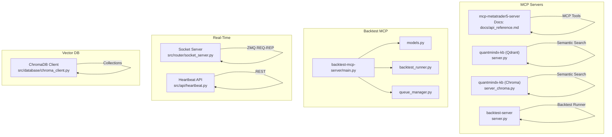
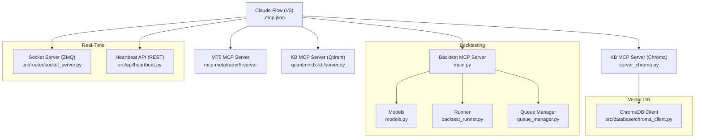
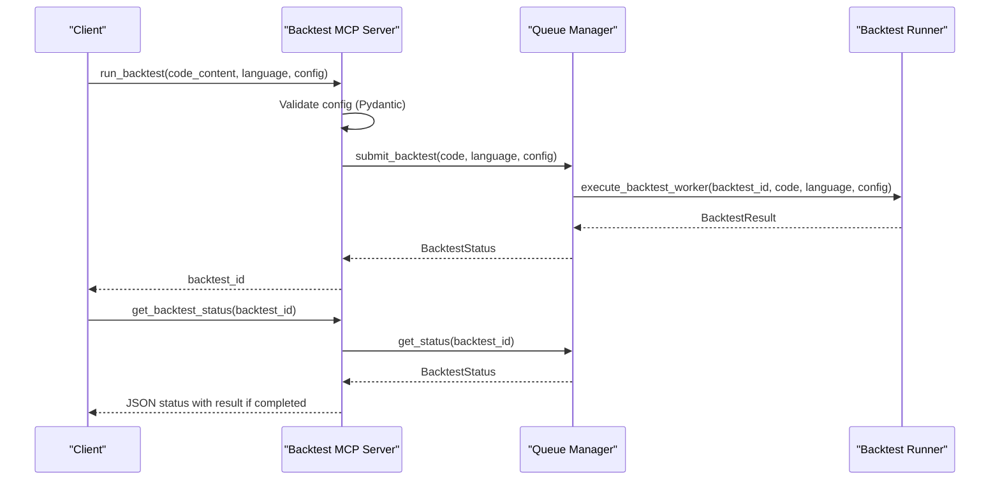
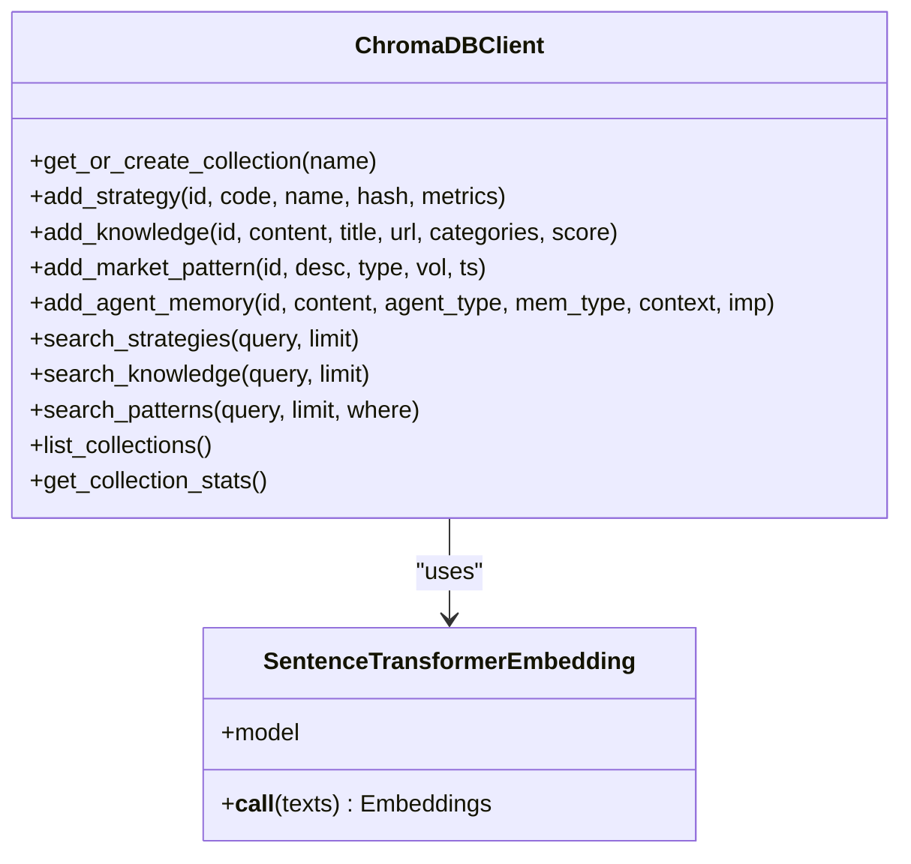
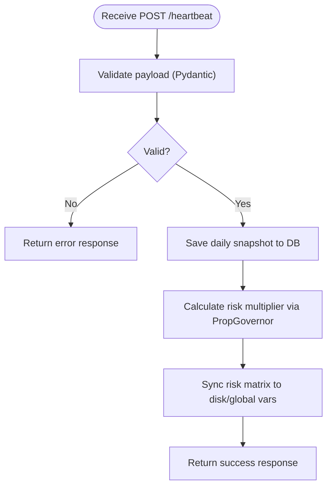
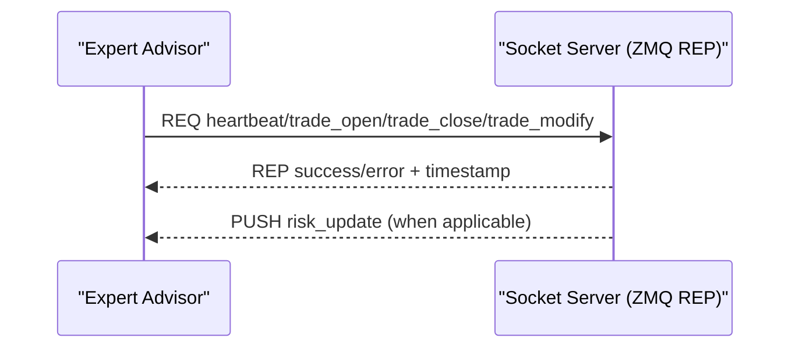
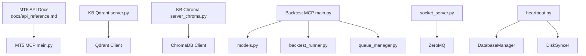

# API Reference

<cite>
**Referenced Files in This Document**
- [README.md](file://README.md)
- [CLAUDE.md](file://CLAUDE.md)
- [mcp-metatrader5-server/README.md](file://mcp-metatrader5-server/README.md)
- [mcp-metatrader5-server/docs/api_reference.md](file://mcp-metatrader5-server/docs/api_reference.md)
- [mcp-servers/backtest-mcp-server/main.py](file://mcp-servers/backtest-mcp-server/main.py)
- [mcp-servers/backtest-mcp-server/models.py](file://mcp-servers/backtest-mcp-server/models.py)
- [mcp-servers/backtest-mcp-server/backtest_runner.py](file://mcp-servers/backtest-mcp-server/backtest_runner.py)
- [mcp-servers/backtest-mcp-server/queue_manager.py](file://mcp-servers/backtest-mcp-server/queue_manager.py)
- [mcp-servers/backtest-server/server.py](file://mcp-servers/backtest-server/server.py)
- [mcp-servers/quantmindx-kb/server.py](file://mcp-servers/quantmindx-kb/server.py)
- [mcp-servers/quantmindx-kb/server_chroma.py](file://mcp-servers/quantmindx-kb/server_chroma.py)
- [mcp-servers/quantmindx-kb/server_simple.py](file://mcp-servers/quantmindx-kb/server_simple.py)
- [src/router/socket_server.py](file://src/router/socket_server.py)
- [src/api/heartbeat.py](file://src/api/heartbeat.py)
- [src/database/chroma_client.py](file://src/database/chroma_client.py)
- [docs/v8/api_reference.md](file://docs/v8/api_reference.md)
- [.mcp.json](file://.mcp.json)
</cite>

## Table of Contents
1. [Introduction](#introduction)
2. [Project Structure](#project-structure)
3. [Core Components](#core-components)
4. [Architecture Overview](#architecture-overview)
5. [Detailed Component Analysis](#detailed-component-analysis)
6. [Dependency Analysis](#dependency-analysis)
7. [Performance Considerations](#performance-considerations)
8. [Troubleshooting Guide](#troubleshooting-guide)
9. [Conclusion](#conclusion)
10. [Appendices](#appendices)

## Introduction
This document provides comprehensive API documentation for QUANTMIND-X, focusing on the MCP (Model Context Protocol) server APIs, backtest server APIs, knowledge base APIs, REST API endpoints, WebSocket connections, and ZeroMQ socket protocols. It consolidates the documented endpoints, schemas, authentication, error handling, and integration patterns across the repository’s MCP servers, backtesting infrastructure, vector database clients, and real-time communication channels.

## Project Structure
The QUANTMIND-X repository organizes APIs across several domains:
- MCP servers for MetaTrader 5 integration and knowledge base search
- Backtest MCP server and legacy backtest server
- Vector database clients and MCP servers for semantic search
- REST and ZeroMQ socket servers for real-time trading operations
- Claude Flow integration via MCP configuration

**Diagram sources**
- [mcp-metatrader5-server/docs/api_reference.md](file://mcp-metatrader5-server/docs/api_reference.md#L1-L398)
- [mcp-servers/quantmindx-kb/server.py](file://mcp-servers/quantmindx-kb/server.py#L1-L189)
- [mcp-servers/quantmindx-kb/server_chroma.py](file://mcp-servers/quantmindx-kb/server_chroma.py#L1-L800)
- [mcp-servers/backtest-server/server.py](file://mcp-servers/backtest-server/server.py#L1-L58)
- [mcp-servers/backtest-mcp-server/main.py](file://mcp-servers/backtest-mcp-server/main.py#L1-L362)
- [mcp-servers/backtest-mcp-server/models.py](file://mcp-servers/backtest-mcp-server/models.py#L1-L273)
- [mcp-servers/backtest-mcp-server/backtest_runner.py](file://mcp-servers/backtest-mcp-server/backtest_runner.py#L1-L603)
- [mcp-servers/backtest-mcp-server/queue_manager.py](file://mcp-servers/backtest-mcp-server/queue_manager.py#L1-L354)
- [src/router/socket_server.py](file://src/router/socket_server.py#L1-L435)
- [src/api/heartbeat.py](file://src/api/heartbeat.py#L1-L227)
- [src/database/chroma_client.py](file://src/database/chroma_client.py#L1-L477)

**Section sources**
- [README.md](file://README.md#L1-L200)
- [CLAUDE.md](file://CLAUDE.md#L1-L250)

## Core Components
- MCP servers expose tools and resources for MetaTrader 5 integration and knowledge base search.
- Backtest MCP server orchestrates strategy backtests with configuration validation, queue management, and result caching.
- Vector database clients and MCP servers enable semantic search over MQL5 articles.
- REST and ZeroMQ servers provide real-time trading operations and event-driven messaging.

**Section sources**
- [mcp-metatrader5-server/README.md](file://mcp-metatrader5-server/README.md#L1-L311)
- [mcp-metatrader5-server/docs/api_reference.md](file://mcp-metatrader5-server/docs/api_reference.md#L1-L398)
- [mcp-servers/backtest-mcp-server/main.py](file://mcp-servers/backtest-mcp-server/main.py#L1-L362)
- [mcp-servers/quantmindx-kb/server.py](file://mcp-servers/quantmindx-kb/server.py#L1-L189)
- [mcp-servers/quantmindx-kb/server_chroma.py](file://mcp-servers/quantmindx-kb/server_chroma.py#L1-L800)
- [src/router/socket_server.py](file://src/router/socket_server.py#L1-L435)
- [src/api/heartbeat.py](file://src/api/heartbeat.py#L1-L227)
- [src/database/chroma_client.py](file://src/database/chroma_client.py#L1-L477)

## Architecture Overview
The system integrates MCP-based AI assistants with trading infrastructure and knowledge bases. Claude Flow is configured to coordinate agents and MCP servers.

**Diagram sources**
- [.mcp.json](file://.mcp.json#L1-L20)
- [mcp-metatrader5-server/docs/api_reference.md](file://mcp-metatrader5-server/docs/api_reference.md#L1-L398)
- [mcp-servers/quantmindx-kb/server.py](file://mcp-servers/quantmindx-kb/server.py#L1-L189)
- [mcp-servers/quantmindx-kb/server_chroma.py](file://mcp-servers/quantmindx-kb/server_chroma.py#L1-L800)
- [mcp-servers/backtest-mcp-server/main.py](file://mcp-servers/backtest-mcp-server/main.py#L1-L362)
- [mcp-servers/backtest-mcp-server/models.py](file://mcp-servers/backtest-mcp-server/models.py#L1-L273)
- [mcp-servers/backtest-mcp-server/backtest_runner.py](file://mcp-servers/backtest-mcp-server/backtest_runner.py#L1-L603)
- [mcp-servers/backtest-mcp-server/queue_manager.py](file://mcp-servers/backtest-mcp-server/queue_manager.py#L1-L354)
- [src/router/socket_server.py](file://src/router/socket_server.py#L1-L435)
- [src/api/heartbeat.py](file://src/api/heartbeat.py#L1-L227)
- [src/database/chroma_client.py](file://src/database/chroma_client.py#L1-L477)

## Detailed Component Analysis

### MCP (Model Context Protocol) Server APIs

#### MetaTrader 5 MCP Server
- Purpose: Provide AI assistants with tools to connect to MetaTrader 5, access market data, place and manage trades, and analyze trading history.
- Transport: stdio (default) or HTTP (development).
- Tools include connection management, market data retrieval, and trading operations.

Key endpoints and tools:
- Connection Management: initialize, login, shutdown, get_account_info, get_terminal_info, get_version
- Market Data: get_symbols, get_symbols_by_group, get_symbol_info, get_symbol_info_tick, copy_rates_from_pos, copy_rates_from_date, copy_rates_range, copy_ticks_from_pos, copy_ticks_from_date, copy_ticks_range
- Trading: order_send, order_check, positions_get, positions_get_by_ticket, orders_get, history_orders_get, history_deals_get

Request/response schemas and examples are documented in the MCP server documentation.

**Section sources**
- [mcp-metatrader5-server/README.md](file://mcp-metatrader5-server/README.md#L1-L311)
- [mcp-metatrader5-server/docs/api_reference.md](file://mcp-metatrader5-server/docs/api_reference.md#L1-L398)

#### Knowledge Base MCP Servers

##### Qdrant-based KB MCP Server
- Tools: search_knowledge_base, get_article_content, kb_stats
- Transport: stdio (default) with security check to run only from project root.
- Embedding: sentence-transformers all-MiniLM-L6-v2; collection: mql5_knowledge.

**Section sources**
- [mcp-servers/quantmindx-kb/server.py](file://mcp-servers/quantmindx-kb/server.py#L1-L189)

##### ChromaDB-based KB MCP Server
- Tools: search_knowledge_base, get_article_content, list_skills, get_skill, list_templates, get_template, get_algorithm_template, get_coding_standards, get_bad_patterns, kb_stats, list_categories
- Transport: stdio with caching, connection pooling, and health checks.
- Collections: mql5_knowledge, algorithm_templates, agentic_skills, coding_standards, bad_patterns_graveyard.

**Section sources**
- [mcp-servers/quantmindx-kb/server_chroma.py](file://mcp-servers/quantmindx-kb/server_chroma.py#L1-L800)

##### Simple Qdrant MCP Server
- Tools: kb_stats, list_collections
- Transport: stdio.

**Section sources**
- [mcp-servers/quantmindx-kb/server_simple.py](file://mcp-servers/quantmindx-kb/server_simple.py#L1-L98)

#### Claude Flow Integration
- Configuration enables hierarchical-mesh topology, agent swarms, and hybrid memory backend.
- MCP server registration for Claude Flow.

**Section sources**
- [.mcp.json](file://.mcp.json#L1-L20)
- [CLAUDE.md](file://CLAUDE.md#L250-L475)

### Backtest Server APIs

#### Backtest MCP Server (FastMCP)
- Tools:
  - run_backtest(code_content: str, language: Literal["python","mq5"], config: dict[str,Any]) -> str
  - get_backtest_status(backtest_id: str) -> str
- Resources:
  - backtest://config and resources/backtest-config for configuration schema documentation
- Configuration schema includes required fields (symbol, timeframe, start_date, end_date) and optional fields (initial_capital, commission, slippage, position_size) with validation rules and error classifications.

**Diagram sources**
- [mcp-servers/backtest-mcp-server/main.py](file://mcp-servers/backtest-mcp-server/main.py#L85-L256)
- [mcp-servers/backtest-mcp-server/models.py](file://mcp-servers/backtest-mcp-server/models.py#L16-L147)
- [mcp-servers/backtest-mcp-server/backtest_runner.py](file://mcp-servers/backtest-mcp-server/backtest_runner.py#L47-L223)
- [mcp-servers/backtest-mcp-server/queue_manager.py](file://mcp-servers/backtest-mcp-server/queue_manager.py#L142-L272)

**Section sources**
- [mcp-servers/backtest-mcp-server/main.py](file://mcp-servers/backtest-mcp-server/main.py#L1-L362)
- [mcp-servers/backtest-mcp-server/models.py](file://mcp-servers/backtest-mcp-server/models.py#L1-L273)
- [mcp-servers/backtest-mcp-server/backtest_runner.py](file://mcp-servers/backtest-mcp-server/backtest_runner.py#L1-L603)
- [mcp-servers/backtest-mcp-server/queue_manager.py](file://mcp-servers/backtest-mcp-server/queue_manager.py#L1-L354)

#### Legacy Backtest Server (FastMCP)
- Tool: run_backtest(code_content: str, symbol: str = "EURUSD", timeframe: str = "H1") -> str
- Generates mock OHLCV data for MVP testing.

**Section sources**
- [mcp-servers/backtest-server/server.py](file://mcp-servers/backtest-server/server.py#L1-L58)

### Knowledge Base APIs

#### ChromaDB Client
- Collections: strategy_dna, market_research, agent_memory
- Embedding: sentence-transformers all-MiniLM-L6-v2 (384-dim, cosine similarity)
- Methods: add_strategy, add_knowledge, add_market_pattern, add_agent_memory, search_* queries, list_collections, get_collection_stats

**Diagram sources**
- [src/database/chroma_client.py](file://src/database/chroma_client.py#L76-L477)

**Section sources**
- [src/database/chroma_client.py](file://src/database/chroma_client.py#L1-L477)

#### KB MCP Server Tools
- search_knowledge_base(query: str, limit: int, category_filter: Optional[str]) -> results
- get_article_content(file_path: str) -> content
- kb_stats() -> collection stats
- list_skills(), get_skill(skill_name: str) -> skill definition
- list_templates(), get_template(template_name: str) -> template content
- get_algorithm_template(category: str, language: str, complexity: str, include_indicators: bool) -> structured template
- get_coding_standards(project_name: str) -> standards
- get_bad_patterns(severity: Optional[str], limit: int) -> patterns
- list_categories() -> categories

**Section sources**
- [mcp-servers/quantmindx-kb/server_chroma.py](file://mcp-servers/quantmindx-kb/server_chroma.py#L386-L566)

### REST API Endpoints

#### Heartbeat API
- Endpoint: POST /heartbeat (example FastAPI endpoint)
- Payload schema validated with Pydantic:
  - ea_name, symbol, magic_number, account_id, current_equity, current_balance, risk_multiplier, timestamp (+ optional open_positions, daily_pnl)
- Response schema: success, message, risk_multiplier, timestamp
- Responsibilities: validate payload, update database snapshots, calculate and sync risk multiplier, sync risk matrix to disk/global variables

**Diagram sources**
- [src/api/heartbeat.py](file://src/api/heartbeat.py#L95-L208)

**Section sources**
- [src/api/heartbeat.py](file://src/api/heartbeat.py#L1-L227)

### WebSocket Connections

#### Binance WebSocket (Crypto Trading API)
- Base endpoints: testnet and production URLs for REST and WebSocket streams
- Authentication: HMAC SHA256 signature required for authenticated endpoints
- Endpoints:
  - GET /api/v8/crypto/balance (broker_id)
  - POST /api/v8/crypto/order (broker_id, symbol, side, type, quantity, price, stop_loss, take_profit)

**Section sources**
- [docs/v8/api_reference.md](file://docs/v8/api_reference.md#L633-L800)

### ZeroMQ Socket Protocols

#### Socket Server API (V8)
- Protocol: ZMQ REQ-REP
- Address: tcp://localhost:5555 (development); tcp://your-server-ip:5555 (production)
- Message types:
  - heartbeat (ea_name, symbol, magic, timestamp)
  - trade_open (ea_name, symbol, volume, direction, magic, ticket, open_price, stop_loss, take_profit, current_balance, timestamp)
  - trade_close (ea_name, symbol, ticket, close_price, profit, timestamp)
  - trade_modify (ea_name, ticket, new_stop_loss, new_take_profit, timestamp)
  - risk_update (ea_name, risk_multiplier, risk_tier, reason, timestamp)
- Connection statistics: message_count, average_latency_ms, active_connections, per-connection details

**Diagram sources**
- [src/router/socket_server.py](file://src/router/socket_server.py#L150-L325)
- [docs/v8/api_reference.md](file://docs/v8/api_reference.md#L331-L595)

**Section sources**
- [src/router/socket_server.py](file://src/router/socket_server.py#L1-L435)
- [docs/v8/api_reference.md](file://docs/v8/api_reference.md#L331-L595)

## Dependency Analysis

**Diagram sources**
- [mcp-metatrader5-server/docs/api_reference.md](file://mcp-metatrader5-server/docs/api_reference.md#L1-L398)
- [mcp-servers/quantmindx-kb/server.py](file://mcp-servers/quantmindx-kb/server.py#L1-L189)
- [mcp-servers/quantmindx-kb/server_chroma.py](file://mcp-servers/quantmindx-kb/server_chroma.py#L1-L800)
- [mcp-servers/backtest-mcp-server/main.py](file://mcp-servers/backtest-mcp-server/main.py#L1-L362)
- [mcp-servers/backtest-mcp-server/models.py](file://mcp-servers/backtest-mcp-server/models.py#L1-L273)
- [mcp-servers/backtest-mcp-server/backtest_runner.py](file://mcp-servers/backtest-mcp-server/backtest_runner.py#L1-L603)
- [mcp-servers/backtest-mcp-server/queue_manager.py](file://mcp-servers/backtest-mcp-server/queue_manager.py#L1-L354)
- [src/router/socket_server.py](file://src/router/socket_server.py#L1-L435)
- [src/api/heartbeat.py](file://src/api/heartbeat.py#L1-L227)
- [src/database/chroma_client.py](file://src/database/chroma_client.py#L1-L477)

**Section sources**
- [mcp-metatrader5-server/docs/api_reference.md](file://mcp-metatrader5-server/docs/api_reference.md#L1-L398)
- [mcp-servers/quantmindx-kb/server_chroma.py](file://mcp-servers/quantmindx-kb/server_chroma.py#L1-L800)
- [mcp-servers/backtest-mcp-server/main.py](file://mcp-servers/backtest-mcp-server/main.py#L1-L362)
- [src/router/socket_server.py](file://src/router/socket_server.py#L1-L435)
- [src/api/heartbeat.py](file://src/api/heartbeat.py#L1-L227)
- [src/database/chroma_client.py](file://src/database/chroma_client.py#L1-L477)

## Performance Considerations
- Backtest MCP server:
  - Up to 10 simultaneous backtests with CPU-aware worker allocation
  - Data caching and vectorized metrics calculation for performance
  - Result caching for identical configurations
- Socket server:
  - Sub-5ms latency target for heartbeat and trade events
  - Async event processing with asyncio and ZMQ REP socket
- KB MCP servers:
  - Query result caching with TTL, connection pooling, and health checks (Chroma variant)
  - HNSW index optimization for cosine similarity

**Section sources**
- [mcp-servers/backtest-mcp-server/main.py](file://mcp-servers/backtest-mcp-server/main.py#L42-L79)
- [mcp-servers/backtest-mcp-server/backtest_runner.py](file://mcp-servers/backtest-mcp-server/backtest_runner.py#L47-L83)
- [mcp-servers/backtest-mcp-server/queue_manager.py](file://mcp-servers/backtest-mcp-server/queue_manager.py#L100-L141)
- [src/router/socket_server.py](file://src/router/socket_server.py#L37-L47)
- [mcp-servers/quantmindx-kb/server_chroma.py](file://mcp-servers/quantmindx-kb/server_chroma.py#L84-L141)

## Troubleshooting Guide
- Authentication:
  - REST API: X-API-Key header required in production; optional in development
  - Socket authentication: API key validation on first message with client_id
- Error handling:
  - Backtest MCP server raises ValueError for invalid configuration, language, or execution errors; categorizes errors into syntax, data, runtime, and timeout
  - KB MCP servers return user-friendly error responses with suggestions
  - Socket server logs high-latency messages (>5ms) and fatal errors
- Rate limits:
  - Not explicitly defined in the provided files; implement at gateway or client-side as needed
- Common issues:
  - KB MCP server must run from project root (security check)
  - ChromaDB health checks and automatic recovery
  - MT5 MCP server requires proper transport configuration (stdio or HTTP)

**Section sources**
- [docs/v8/api_reference.md](file://docs/v8/api_reference.md#L55-L86)
- [mcp-servers/backtest-mcp-server/main.py](file://mcp-servers/backtest-mcp-server/main.py#L175-L181)
- [mcp-servers/quantmindx-kb/server_chroma.py](file://mcp-servers/quantmindx-kb/server_chroma.py#L601-L618)
- [src/router/socket_server.py](file://src/router/socket_server.py#L94-L107)
- [mcp-servers/quantmindx-kb/server.py](file://mcp-servers/quantmindx-kb/server.py#L14-L21)

## Conclusion
QUANTMIND-X provides a comprehensive set of APIs enabling AI-assisted trading through MCP servers, backtesting orchestration, semantic knowledge search, REST endpoints, and ZeroMQ-based real-time communication. The documented schemas, authentication, error handling, and performance characteristics facilitate reliable integration and deployment across trading workflows.

## Appendices

### Authentication Methods
- REST API: X-API-Key header
- Socket Server: First message must include type="auth" with api_key and client_id
- Crypto Trading API: HMAC SHA256 signature for authenticated endpoints

**Section sources**
- [docs/v8/api_reference.md](file://docs/v8/api_reference.md#L55-L86)
- [docs/v8/api_reference.md](file://docs/v8/api_reference.md#L651-L686)

### Rate Limiting
- Not specified in the provided files; implement at application or gateway level as required.

**Section sources**
- [docs/v8/api_reference.md](file://docs/v8/api_reference.md#L800-L800)

### Practical Examples and Integration Patterns
- MCP server configuration for Claude Flow with hierarchical-mesh topology and hybrid memory
- KB MCP server usage for semantic search and article retrieval
- Backtest MCP server workflow for submitting and polling backtests
- Socket server integration for heartbeat and trade event messaging
- REST heartbeat endpoint for MT5 EA synchronization

**Section sources**
- [.mcp.json](file://.mcp.json#L1-L20)
- [CLAUDE.md](file://CLAUDE.md#L250-L475)
- [mcp-servers/quantmindx-kb/server.py](file://mcp-servers/quantmindx-kb/server.py#L101-L174)
- [mcp-servers/backtest-mcp-server/main.py](file://mcp-servers/backtest-mcp-server/main.py#L85-L256)
- [src/router/socket_server.py](file://src/router/socket_server.py#L160-L325)
- [src/api/heartbeat.py](file://src/api/heartbeat.py#L210-L227)