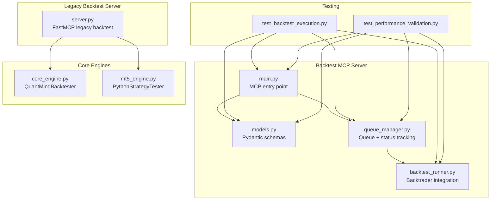
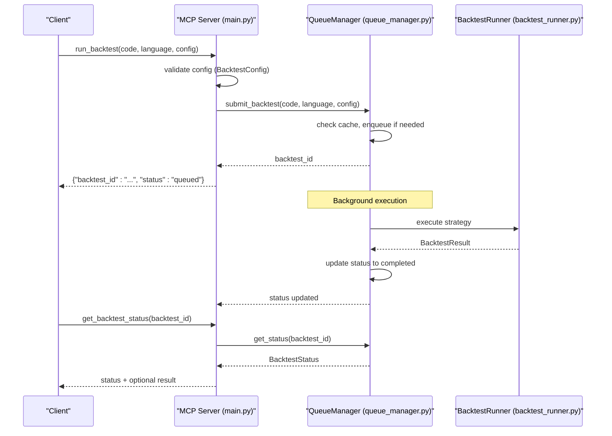
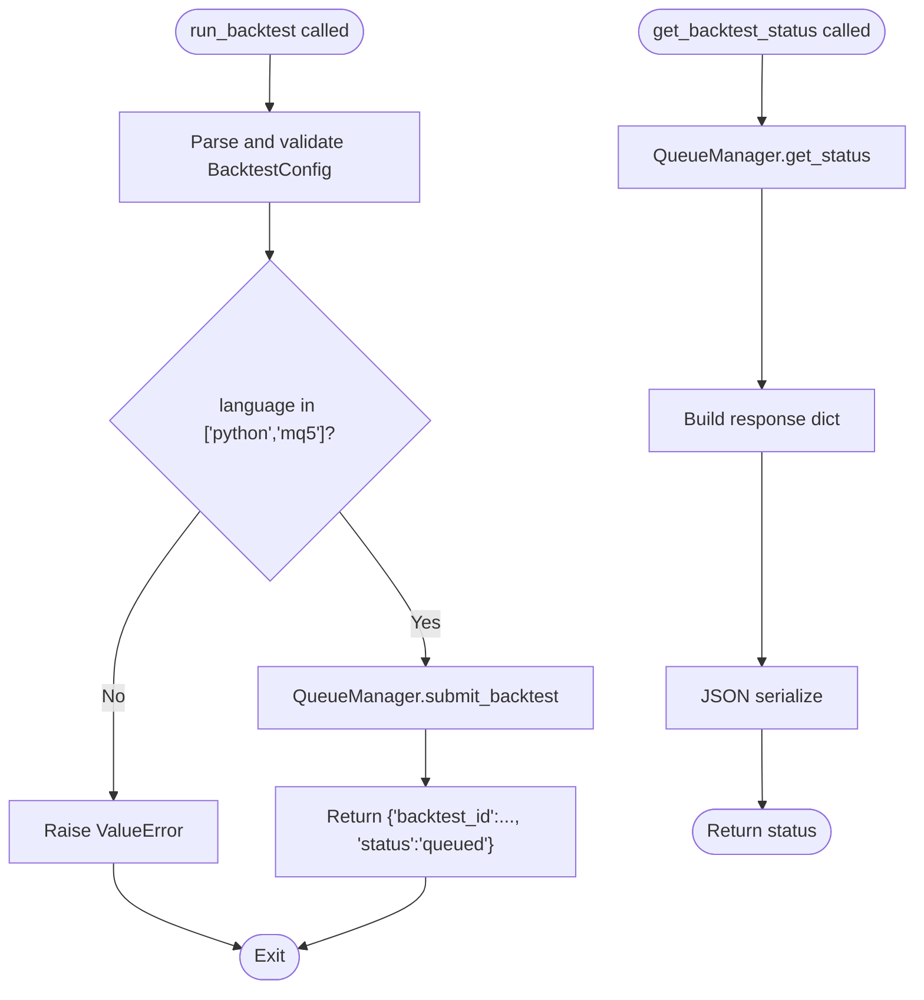
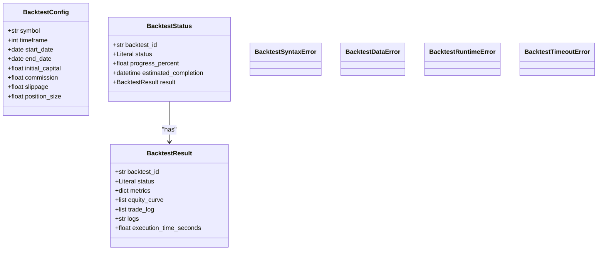
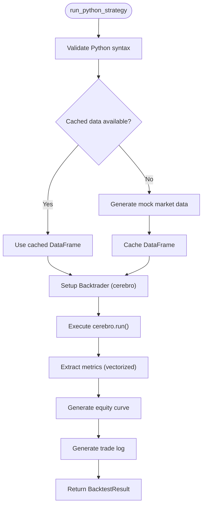
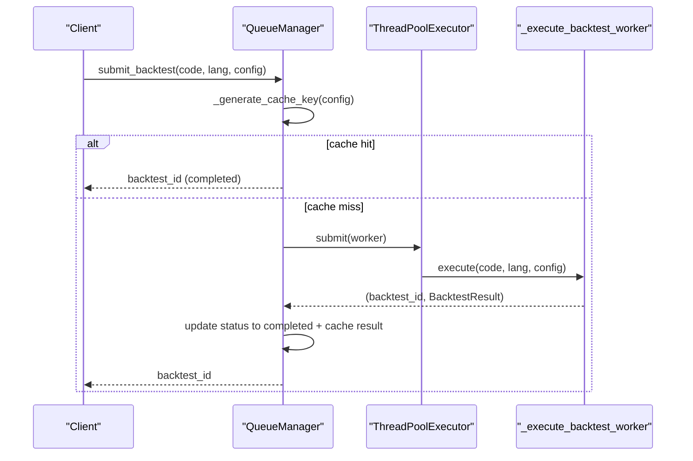
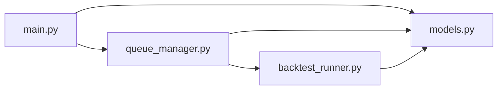

# Backtest Server APIs

<cite>
**Referenced Files in This Document**
- [main.py](file://mcp-servers/backtest-mcp-server/main.py)
- [models.py](file://mcp-servers/backtest-mcp-server/models.py)
- [backtest_runner.py](file://mcp-servers/backtest-mcp-server/backtest_runner.py)
- [queue_manager.py](file://mcp-servers/backtest-mcp-server/queue_manager.py)
- [tasks.md](file://mcp-servers/backtest-mcp-server/tasks.md)
- [test_backtest_execution.py](file://mcp-servers/backtest-mcp-server/tests/test_backtest_execution.py)
- [test_performance_validation.py](file://mcp-servers/backtest-mcp-server/tests/test_performance_validation.py)
- [server.py](file://mcp-servers/backtest-server/server.py)
- [core_engine.py](file://src/backtesting/core_engine.py)
- [mt5_engine.py](file://src/backtesting/mt5_engine.py)
</cite>

## Table of Contents
1. [Introduction](#introduction)
2. [Project Structure](#project-structure)
3. [Core Components](#core-components)
4. [Architecture Overview](#architecture-overview)
5. [Detailed Component Analysis](#detailed-component-analysis)
6. [Dependency Analysis](#dependency-analysis)
7. [Performance Considerations](#performance-considerations)
8. [Troubleshooting Guide](#troubleshooting-guide)
9. [Conclusion](#conclusion)
10. [Appendices](#appendices)

## Introduction
This document describes the Backtest MCP Server APIs for QUANTMIND-X strategy testing infrastructure. It covers the MCP server implementation for backtesting workflows, request/response schemas, status tracking, task queue management, result storage, and performance metrics collection. It also provides client implementation guidelines for automated strategy testing and batch processing.

## Project Structure
The backtest server is implemented as an MCP (Model Context Protocol) service with:
- An MCP entry point exposing tools for submitting backtests and checking status
- Pydantic models defining request/response schemas
- A backtest runner integrating Backtrader for Python strategies
- A queue manager orchestrating parallel execution with caching and status tracking
- Tests validating performance and execution correctness

**Diagram sources**
- [main.py](file://mcp-servers/backtest-mcp-server/main.py#L43-L79)
- [models.py](file://mcp-servers/backtest-mcp-server/models.py#L16-L147)
- [backtest_runner.py](file://mcp-servers/backtest-mcp-server/backtest_runner.py#L47-L254)
- [queue_manager.py](file://mcp-servers/backtest-mcp-server/queue_manager.py#L100-L354)
- [test_backtest_execution.py](file://mcp-servers/backtest-mcp-server/tests/test_backtest_execution.py#L1-L254)
- [test_performance_validation.py](file://mcp-servers/backtest-mcp-server/tests/test_performance_validation.py#L1-L263)
- [server.py](file://mcp-servers/backtest-server/server.py#L1-L58)
- [core_engine.py](file://src/backtesting/core_engine.py#L1-L83)
- [mt5_engine.py](file://src/backtesting/mt5_engine.py#L1-L991)

**Section sources**
- [main.py](file://mcp-servers/backtest-mcp-server/main.py#L1-L362)
- [models.py](file://mcp-servers/backtest-mcp-server/models.py#L1-L273)
- [backtest_runner.py](file://mcp-servers/backtest-mcp-server/backtest_runner.py#L1-L603)
- [queue_manager.py](file://mcp-servers/backtest-mcp-server/queue_manager.py#L1-L354)
- [tasks.md](file://mcp-servers/backtest-mcp-server/tasks.md#L1-L246)
- [test_backtest_execution.py](file://mcp-servers/backtest-mcp-server/tests/test_backtest_execution.py#L1-L254)
- [test_performance_validation.py](file://mcp-servers/backtest-mcp-server/tests/test_performance_validation.py#L1-L263)
- [server.py](file://mcp-servers/backtest-server/server.py#L1-L58)
- [core_engine.py](file://src/backtesting/core_engine.py#L1-L83)
- [mt5_engine.py](file://src/backtesting/mt5_engine.py#L1-L991)

## Core Components
- MCP Tools
  - run_backtest: Submits a strategy for backtesting with configuration and returns a backtest_id
  - get_backtest_status: Retrieves status and result for a given backtest_id
- Pydantic Models
  - BacktestConfig: Request schema for backtest configuration
  - BacktestResult: Result schema with metrics, logs, and timing
  - BacktestStatus: Status schema with progress and optional result
  - Error classes: BacktestSyntaxError, BacktestDataError, BacktestRuntimeError, BacktestTimeoutError
- Backtest Runner
  - BacktestRunner: Executes Python strategies via Backtrader, generates metrics and logs
- Queue Manager
  - BacktestQueueManager: Manages parallel execution, status tracking, and result caching

**Section sources**
- [main.py](file://mcp-servers/backtest-mcp-server/main.py#L85-L256)
- [models.py](file://mcp-servers/backtest-mcp-server/models.py#L16-L147)
- [backtest_runner.py](file://mcp-servers/backtest-mcp-server/backtest_runner.py#L47-L254)
- [queue_manager.py](file://mcp-servers/backtest-mcp-server/queue_manager.py#L100-L354)

## Architecture Overview
The MCP backtest server exposes two primary tools:
- run_backtest(code_content, language, config) -> backtest_id
- get_backtest_status(backtest_id) -> status + optional result

The queue manager validates configuration, caches identical runs, and schedules execution. The runner compiles and executes strategies, computes metrics, and returns structured results.

**Diagram sources**
- [main.py](file://mcp-servers/backtest-mcp-server/main.py#L85-L256)
- [queue_manager.py](file://mcp-servers/backtest-mcp-server/queue_manager.py#L142-L272)
- [backtest_runner.py](file://mcp-servers/backtest-mcp-server/backtest_runner.py#L84-L223)

## Detailed Component Analysis

### MCP Tools: run_backtest and get_backtest_status
- run_backtest
  - Validates config using BacktestConfig
  - Accepts language "python" or "mq5"
  - Submits to queue manager and returns backtest_id
  - Raises ValueError for invalid configs or errors
- get_backtest_status
  - Returns current status, progress, optional estimated completion, and result
  - Converts result to dict for JSON serialization

**Diagram sources**
- [main.py](file://mcp-servers/backtest-mcp-server/main.py#L85-L256)
- [queue_manager.py](file://mcp-servers/backtest-mcp-server/queue_manager.py#L203-L224)

**Section sources**
- [main.py](file://mcp-servers/backtest-mcp-server/main.py#L85-L256)

### Pydantic Models: BacktestConfig, BacktestResult, BacktestStatus
- BacktestConfig
  - Required: symbol, timeframe, start_date, end_date
  - Optional: initial_capital, commission, slippage, position_size
  - Validators enforce symbol format, timeframe validity, date ordering, position size bounds
- BacktestResult
  - Includes backtest_id, status, metrics, equity_curve, trade_log, logs, execution_time_seconds
- BacktestStatus
  - Tracks backtest_id, status, progress_percent, estimated_completion, optional result
- Error Classes
  - BacktestSyntaxError, BacktestDataError, BacktestRuntimeError, BacktestTimeoutError
  - Each carries classification codes and contextual attributes

**Diagram sources**
- [models.py](file://mcp-servers/backtest-mcp-server/models.py#L16-L147)

**Section sources**
- [models.py](file://mcp-servers/backtest-mcp-server/models.py#L16-L147)

### Backtest Runner: BacktestRunner
- run_python_strategy
  - Validates Python syntax
  - Generates or caches market data
  - Creates strategy class from code
  - Sets up Backtrader engine, analyzers, and parameters
  - Runs backtest and extracts metrics using vectorized operations
  - Produces BacktestResult with equity_curve and trade_log summaries
- run_mql5_strategy
  - Placeholder returning error result (future integration)
- Vectorized metrics extraction improves performance

**Diagram sources**
- [backtest_runner.py](file://mcp-servers/backtest-mcp-server/backtest_runner.py#L84-L223)
- [backtest_runner.py](file://mcp-servers/backtest-mcp-server/backtest_runner.py#L449-L560)

**Section sources**
- [backtest_runner.py](file://mcp-servers/backtest-mcp-server/backtest_runner.py#L47-L254)

### Queue Manager: BacktestQueueManager
- submit_backtest
  - Checks cache for identical configuration
  - Creates initial BacktestStatus ("queued")
  - Submits to ThreadPoolExecutor
  - Adds completion callback to update status and cache results
- get_status
  - Returns BacktestStatus for a given backtest_id
- Result caching
  - Stores successful results keyed by backtest_id
- Parallel execution
  - Limits workers to min(CPU count, max_workers, 10)

**Diagram sources**
- [queue_manager.py](file://mcp-servers/backtest-mcp-server/queue_manager.py#L142-L272)

**Section sources**
- [queue_manager.py](file://mcp-servers/backtest-mcp-server/queue_manager.py#L100-L354)

### MCP Resource Endpoint: Backtest Configuration Schema
- Two endpoints expose the configuration schema:
  - backtest://config
  - resources/backtest-config
- Documents required/optional fields, valid timeframes, validation rules, error classification, and performance targets

**Section sources**
- [main.py](file://mcp-servers/backtest-mcp-server/main.py#L258-L352)

### Legacy Backtest Server (Alternative Implementation)
- A separate FastMCP server exists for a simplified backtest flow
- Uses a core engine to execute strategies and returns structured results
- Demonstrates an alternate approach to backtesting orchestration

**Section sources**
- [server.py](file://mcp-servers/backtest-server/server.py#L1-L58)
- [core_engine.py](file://src/backtesting/core_engine.py#L1-L83)
- [mt5_engine.py](file://src/backtesting/mt5_engine.py#L1-L991)

## Dependency Analysis
Key dependencies and relationships:
- main.py depends on models.py and queue_manager.py
- queue_manager.py depends on models.py and backtest_runner.py
- backtest_runner.py depends on models.py and external libraries (backtrader, numpy, pandas)
- Tests depend on models, runner, and queue manager

**Diagram sources**
- [main.py](file://mcp-servers/backtest-mcp-server/main.py#L17-L38)
- [queue_manager.py](file://mcp-servers/backtest-mcp-server/queue_manager.py#L20-L35)
- [backtest_runner.py](file://mcp-servers/backtest-mcp-server/backtest_runner.py#L24-L43)

**Section sources**
- [main.py](file://mcp-servers/backtest-mcp-server/main.py#L17-L38)
- [queue_manager.py](file://mcp-servers/backtest-mcp-server/queue_manager.py#L20-L35)
- [backtest_runner.py](file://mcp-servers/backtest-mcp-server/backtest_runner.py#L24-L43)

## Performance Considerations
- Data caching: Reduces repeated data generation to near O(1) on cache hits
- Vectorized metrics: NumPy-based computations improve metric extraction speed
- Parallel execution: Up to 10 workers with CPU-aware limits
- Timeouts: Configurable per backtest to prevent runaway executions
- Validation: Early config validation reduces wasted compute

Evidence from Task Group 6:
- Simple backtest under 2 minutes
- 10 parallel backtests without resource exhaustion
- Data loading optimized (< 1s for cached)
- Vectorized metrics 2–10x faster

**Section sources**
- [tasks.md](file://mcp-servers/backtest-mcp-server/tasks.md#L178-L196)
- [tasks.md](file://mcp-servers/backtest-mcp-server/tasks.md#L45-L67)
- [test_performance_validation.py](file://mcp-servers/backtest-mcp-server/tests/test_performance_validation.py#L56-L118)

## Troubleshooting Guide
Common issues and resolutions:
- Invalid configuration
  - Symptoms: ValueError with field-specific messages
  - Causes: Invalid symbol, unsupported timeframe, incorrect date range, out-of-bounds position size
  - Resolution: Fix according to validation rules and examples
- Syntax errors in strategy code
  - Symptoms: BacktestResult.status == "error" with logs mentioning syntax issues
  - Resolution: Correct Python syntax; see error codes for specifics
- Data errors
  - Symptoms: Insufficient data points or invalid symbol/date range
  - Resolution: Adjust date range or symbol; ensure sufficient historical data availability
- Runtime errors
  - Symptoms: Exceptions during strategy execution
  - Resolution: Review strategy logic and external dependencies
- Timeouts
  - Symptoms: Long-running strategies exceeding timeout
  - Resolution: Optimize strategy or increase timeout; consider vectorization

**Section sources**
- [main.py](file://mcp-servers/backtest-mcp-server/main.py#L145-L181)
- [models.py](file://mcp-servers/backtest-mcp-server/models.py#L152-L273)
- [backtest_runner.py](file://mcp-servers/backtest-mcp-server/backtest_runner.py#L193-L223)

## Conclusion
The Backtest MCP Server provides a robust, validated, and performant framework for strategy backtesting. It offers clear request/response schemas, comprehensive error classification, parallel execution, caching, and structured metrics. Clients can automate strategy testing and batch processing with reliable status tracking and result retrieval.

## Appendices

### API Reference

- Tool: run_backtest
  - Inputs
    - code_content: Strategy source code (Python or MQL5)
    - language: "python" or "mq5"
    - config: Flat dictionary with BacktestConfig fields
  - Output
    - JSON string with backtest_id and queued status
  - Errors
    - ValueError for invalid config or execution errors

- Tool: get_backtest_status
  - Inputs
    - backtest_id: UUID returned by run_backtest
  - Output
    - JSON string with status, progress_percent, optional estimated_completion, and optional result

- Resource: Backtest Configuration Schema
  - Endpoints
    - backtest://config
    - resources/backtest-config
  - Content
    - Required/optional fields, validation rules, error classification, performance targets, usage examples

**Section sources**
- [main.py](file://mcp-servers/backtest-mcp-server/main.py#L85-L256)
- [main.py](file://mcp-servers/backtest-mcp-server/main.py#L258-L352)

### Request/Response Examples

- Minimal Python backtest configuration
  - Example fields: symbol, timeframe, start_date, end_date
  - Defaults: initial_capital, commission, slippage, position_size applied if omitted

- Full Python backtest configuration
  - Example fields: symbol, timeframe, start_date, end_date, initial_capital, commission, slippage, position_size

- Status response (completed)
  - Fields: backtest_id, status, progress_percent, result (BacktestResult)

- Status response (running)
  - Fields: backtest_id, status, progress_percent, estimated_completion

**Section sources**
- [main.py](file://mcp-servers/backtest-mcp-server/main.py#L118-L144)
- [main.py](file://mcp-servers/backtest-mcp-server/main.py#L199-L233)

### Parameter Validation Rules
- Symbol: Non-empty, alphanumeric with underscore allowed
- Timeframe: One of supported MT5 timeframes
- Date range: end_date after start_date
- Position size: Between 0.01 and 100 lots
- Numeric fields: Positive or zero (commission/slippage may be zero)

**Section sources**
- [models.py](file://mcp-servers/backtest-mcp-server/models.py#L40-L99)

### Result Parsing Guidelines
- Parse JSON responses from run_backtest and get_backtest_status
- For completed status, access result.metrics for performance metrics
- For equity_curve and trade_log, expect lists of dictionaries with timestamp/value or summary entries respectively
- Use execution_time_seconds for timing analysis

**Section sources**
- [models.py](file://mcp-servers/backtest-mcp-server/models.py#L102-L127)
- [backtest_runner.py](file://mcp-servers/backtest-mcp-server/backtest_runner.py#L562-L595)

### Client Implementation Guidelines
- Automated strategy testing
  - Submit strategies via run_backtest with minimal config
  - Poll get_backtest_status until completion
  - Parse result.metrics for evaluation
- Batch processing
  - Submit multiple backtests concurrently
  - Use queue stats to monitor throughput
  - Leverage caching for identical configurations
- Error handling
  - Catch ValueError for invalid inputs
  - Inspect result.status and logs for execution issues
  - Implement retries for transient failures

**Section sources**
- [queue_manager.py](file://mcp-servers/backtest-mcp-server/queue_manager.py#L334-L354)
- [test_backtest_execution.py](file://mcp-servers/backtest-mcp-server/tests/test_backtest_execution.py#L196-L223)