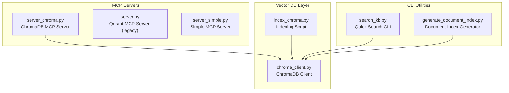
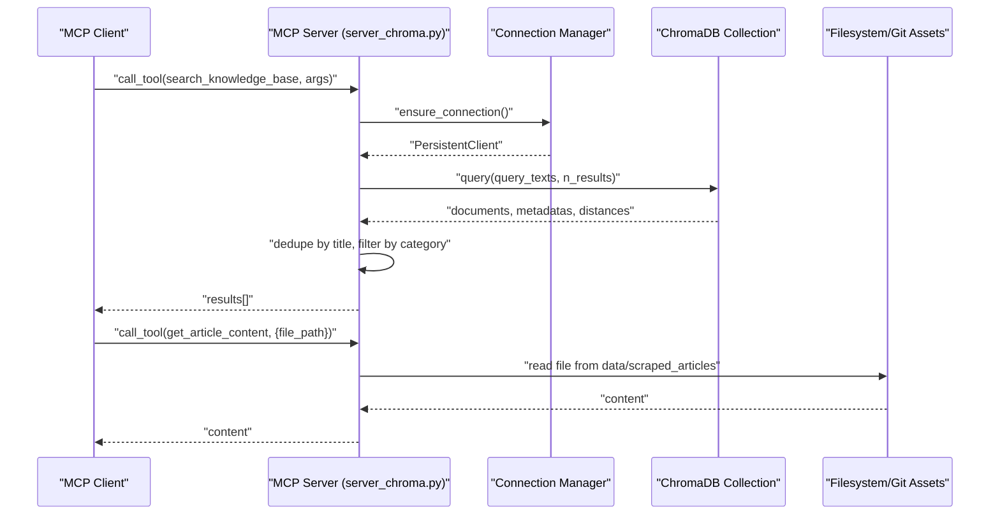
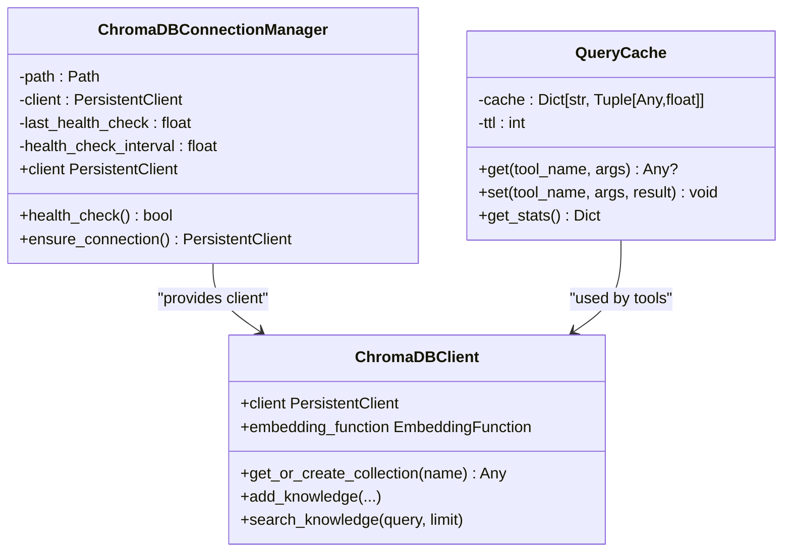
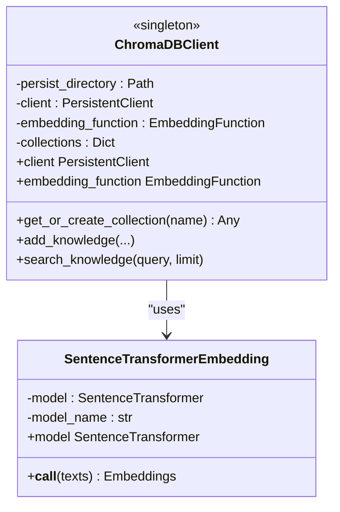
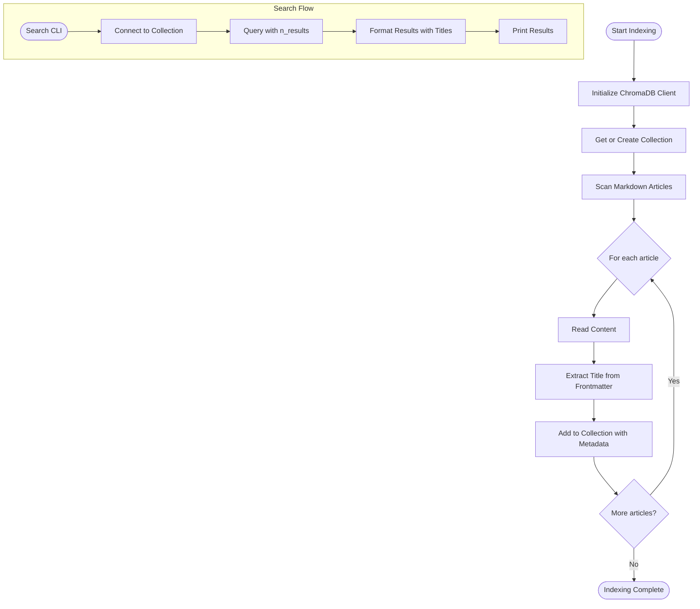
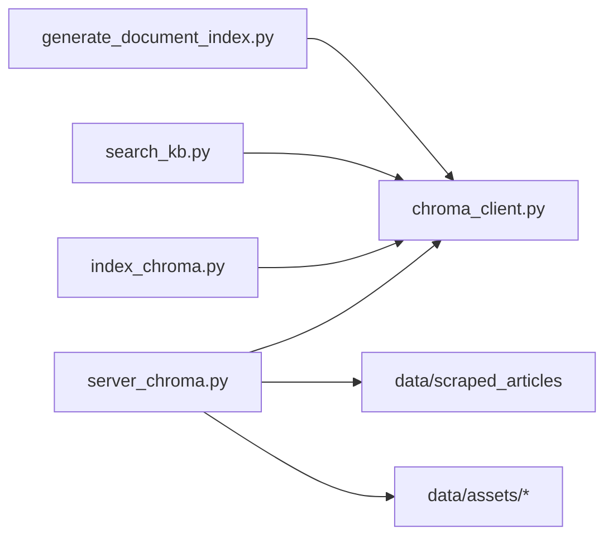

# Knowledge Base APIs

<cite>
**Referenced Files in This Document**
- [server_chroma.py](file://mcp-servers/quantmindx-kb/server_chroma.py)
- [server.py](file://mcp-servers/quantmindx-kb/server.py)
- [server_simple.py](file://mcp-servers/quantmindx-kb/server_simple.py)
- [chroma_client.py](file://src/database/chroma_client.py)
- [index_chroma.py](file://scripts/index_chroma.py)
- [search_kb.py](file://scripts/search_kb.py)
- [generate_document_index.py](file://scripts/generate_document_index.py)
</cite>

## Table of Contents
1. [Introduction](#introduction)
2. [Project Structure](#project-structure)
3. [Core Components](#core-components)
4. [Architecture Overview](#architecture-overview)
5. [Detailed Component Analysis](#detailed-component-analysis)
6. [Dependency Analysis](#dependency-analysis)
7. [Performance Considerations](#performance-considerations)
8. [Troubleshooting Guide](#troubleshooting-guide)
9. [Conclusion](#conclusion)
10. [Appendices](#appendices)

## Introduction
This document describes the QUANTMIND-X semantic search and article retrieval system centered around ChromaDB-backed knowledge base APIs. It covers:
- ChromaDB client APIs for vector database operations and index management
- MCP-based knowledge base servers exposing semantic search, content retrieval, and asset hub tools
- Request/response schemas for search operations, vector embedding endpoints, and database indexing APIs
- Examples of semantic queries, result interpretation, and knowledge base maintenance operations
- Integration with the article processing pipeline and web scraping workflows

The system supports:
- Semantic search over MQL5 articles with optional category filtering
- Retrieval of full article content by file path
- Listing and loading of templates, skills, and coding standards
- Knowledge base statistics and category enumeration
- Built-in query result caching and connection health checks for performance

## Project Structure
The knowledge base functionality spans three primary areas:
- MCP servers that expose tools over the MCP protocol
- A ChromaDB client library for vector operations and collection management
- Scripts for indexing, searching, and generating document summaries

**Diagram sources**
- [server_chroma.py](file://mcp-servers/quantmindx-kb/server_chroma.py#L387-L566)
- [chroma_client.py](file://src/database/chroma_client.py#L76-L156)
- [index_chroma.py](file://scripts/index_chroma.py#L23-L32)
- [search_kb.py](file://scripts/search_kb.py#L12-L20)
- [generate_document_index.py](file://scripts/generate_document_index.py#L107-L141)

**Section sources**
- [server_chroma.py](file://mcp-servers/quantmindx-kb/server_chroma.py#L1-L120)
- [chroma_client.py](file://src/database/chroma_client.py#L1-L60)

## Core Components
- ChromaDB MCP Server: Provides semantic search, content retrieval, asset hub tools, and statistics via MCP protocol. Implements connection pooling, query caching, and structured result schemas.
- ChromaDB Client Library: Encapsulates vector operations, collection lifecycle, and embedding generation using sentence-transformers.
- Indexing and Search Scripts: Index articles into ChromaDB and provide quick CLI search utilities.
- Legacy Qdrant MCP Server: Alternative MCP server using Qdrant for comparison and migration scenarios.

Key capabilities:
- Semantic search with optional category filtering and deduplication by title
- Retrieval of article content from filesystem paths
- Asset hub tools for templates, skills, and coding standards
- Statistics and category enumeration
- Built-in caching and health checks for reliability

**Section sources**
- [server_chroma.py](file://mcp-servers/quantmindx-kb/server_chroma.py#L387-L566)
- [chroma_client.py](file://src/database/chroma_client.py#L76-L156)
- [index_chroma.py](file://scripts/index_chroma.py#L23-L32)
- [search_kb.py](file://scripts/search_kb.py#L12-L20)
- [server.py](file://mcp-servers/quantmindx-kb/server.py#L48-L99)

## Architecture Overview
The system architecture integrates MCP servers with ChromaDB for vector search and with filesystem/git repositories for static assets. The ChromaDB client library centralizes embedding and collection management.

**Diagram sources**
- [server_chroma.py](file://mcp-servers/quantmindx-kb/server_chroma.py#L636-L710)
- [server_chroma.py](file://mcp-servers/quantmindx-kb/server_chroma.py#L712-L721)

## Detailed Component Analysis

### ChromaDB MCP Server (server_chroma.py)
The ChromaDB MCP server exposes a suite of tools for knowledge base operations:
- search_knowledge_base: Semantic search with optional category filter and deduplication
- get_article_content: Retrieve full article content by relative file path
- list_skills/get_skill: Load skill definitions from data/assets/skills
- list_templates/get_template: Load code templates from data/assets/templates
- get_algorithm_template/get_coding_standards/get_bad_patterns/load_skill: Structured asset retrieval tools
- kb_stats: Collection statistics including cache metrics
- list_categories: Enumerate unique categories from metadata

Implementation highlights:
- Connection pooling with periodic health checks
- Query result caching with TTL and hit-rate metrics
- Decorator-based tool call wrapper for timing and error logging
- HNSW index configuration optimized for cosine similarity
- Extraction of titles from markdown frontmatter for display

**Diagram sources**
- [server_chroma.py](file://mcp-servers/quantmindx-kb/server_chroma.py#L87-L136)
- [server_chroma.py](file://mcp-servers/quantmindx-kb/server_chroma.py#L147-L214)
- [chroma_client.py](file://src/database/chroma_client.py#L76-L156)

**Section sources**
- [server_chroma.py](file://mcp-servers/quantmindx-kb/server_chroma.py#L387-L566)
- [server_chroma.py](file://mcp-servers/quantmindx-kb/server_chroma.py#L636-L762)
- [server_chroma.py](file://mcp-servers/quantmindx-kb/server_chroma.py#L87-L136)
- [server_chroma.py](file://mcp-servers/quantmindx-kb/server_chroma.py#L147-L214)

### ChromaDB Client Library (chroma_client.py)
The ChromaDB client library encapsulates:
- Custom embedding function using sentence-transformers with normalized cosine embeddings
- Collection management for strategies, knowledge, and patterns
- Vector insertion and semantic search for each collection
- Singleton access and lazy client initialization
- HNSW configuration tuned for cosine similarity

**Diagram sources**
- [chroma_client.py](file://src/database/chroma_client.py#L32-L74)
- [chroma_client.py](file://src/database/chroma_client.py#L76-L156)

**Section sources**
- [chroma_client.py](file://src/database/chroma_client.py#L32-L74)
- [chroma_client.py](file://src/database/chroma_client.py#L122-L141)
- [chroma_client.py](file://src/database/chroma_client.py#L192-L224)
- [chroma_client.py](file://src/database/chroma_client.py#L327-L353)

### Indexing and Search Scripts
- index_chroma.py: Indexes Markdown articles into a ChromaDB collection with metadata and cosine similarity configuration.
- search_kb.py: Quick CLI to search the knowledge base and print formatted results.
- generate_document_index.py: Generates a summary index of articles for downstream AI analysis.

**Diagram sources**
- [index_chroma.py](file://scripts/index_chroma.py#L23-L64)
- [search_kb.py](file://scripts/search_kb.py#L12-L47)

**Section sources**
- [index_chroma.py](file://scripts/index_chroma.py#L23-L64)
- [search_kb.py](file://scripts/search_kb.py#L12-L47)
- [generate_document_index.py](file://scripts/generate_document_index.py#L80-L105)

### Legacy Qdrant MCP Server (server.py)
A legacy MCP server using Qdrant for semantic search and article retrieval. Useful for migration and compatibility testing.

**Section sources**
- [server.py](file://mcp-servers/quantmindx-kb/server.py#L48-L99)
- [server.py](file://mcp-servers/quantmindx-kb/server.py#L101-L174)

## Dependency Analysis
The MCP servers depend on the ChromaDB client library for vector operations and on filesystem/git assets for static content. The indexing scripts depend on ChromaDB for persistence.

**Diagram sources**
- [server_chroma.py](file://mcp-servers/quantmindx-kb/server_chroma.py#L387-L566)
- [chroma_client.py](file://src/database/chroma_client.py#L76-L156)
- [index_chroma.py](file://scripts/index_chroma.py#L23-L32)
- [search_kb.py](file://scripts/search_kb.py#L12-L20)
- [generate_document_index.py](file://scripts/generate_document_index.py#L107-L141)

**Section sources**
- [server_chroma.py](file://mcp-servers/quantmindx-kb/server_chroma.py#L387-L566)
- [chroma_client.py](file://src/database/chroma_client.py#L76-L156)
- [index_chroma.py](file://scripts/index_chroma.py#L23-L32)

## Performance Considerations
- Query result caching: In-memory cache with TTL reduces repeated search latency and improves throughput.
- Connection health checks: Periodic verification of ChromaDB connectivity prevents stale connections and enables automatic recovery.
- HNSW index tuning: Optimized parameters for cosine similarity balance recall and search speed.
- Deduplication and preview generation: Reduce noise and improve result readability by deduplicating by title and truncating previews.
- Async execution: MCP server uses async handlers to handle concurrent tool calls efficiently.

[No sources needed since this section provides general guidance]

## Troubleshooting Guide
Common issues and resolutions:
- Connection failures: Verify ChromaDB is running and accessible; the server attempts recovery and retries after health checks.
- Collection not found: Ensure the collection exists and the indexing script has been run.
- File path errors: Confirm file paths are relative and within allowed directories to prevent traversal attacks.
- Validation errors: Review input parameters against tool schemas; the server returns helpful suggestions for common mistakes.

Operational tips:
- Monitor cache hit rates to assess query reuse patterns.
- Use kb_stats to confirm collection counts and cache statistics.
- Validate category filters and deduplication logic if results appear unexpected.

**Section sources**
- [server_chroma.py](file://mcp-servers/quantmindx-kb/server_chroma.py#L620-L633)
- [server_chroma.py](file://mcp-servers/quantmindx-kb/server_chroma.py#L722-L741)
- [server_chroma.py](file://mcp-servers/quantmindx-kb/server_chroma.py#L772-L782)

## Conclusion
The QUANTMIND-X knowledge base system provides a robust, scalable foundation for semantic search and article retrieval. The ChromaDB MCP server offers a comprehensive set of tools for search, content retrieval, and asset hub operations, backed by efficient caching, health checks, and structured schemas. The ChromaDB client library and supporting scripts streamline indexing and maintenance, while integration with the article processing pipeline ensures a continuous flow of curated content.

[No sources needed since this section summarizes without analyzing specific files]

## Appendices

### API Reference: MCP Tools (server_chroma.py)
- search_knowledge_base
  - Inputs:
    - query: string (required)
    - limit: integer (default 5)
    - category_filter: string (optional)
  - Outputs: results array with fields title, file_path, categories, relevance_score, preview; original query preserved
- get_article_content
  - Inputs:
    - file_path: string (required)
  - Outputs: article content as text
- list_skills/get_skill
  - list_skills: returns available skill filenames
  - get_skill: returns skill definition content
- list_templates/get_template
  - list_templates: returns available template filenames
  - get_template: returns template content
- get_algorithm_template/get_coding_standards/get_bad_patterns/load_skill
  - Structured retrieval tools with typed schemas for algorithm templates, coding standards, anti-patterns, and skill loading
- kb_stats
  - Outputs: collection name, total articles, storage path, embedding function, cache statistics
- list_categories
  - Outputs: sorted list of unique categories present in metadata

**Section sources**
- [server_chroma.py](file://mcp-servers/quantmindx-kb/server_chroma.py#L394-L565)

### Vector Embedding and Indexing APIs
- ChromaDB Client
  - Embedding function: sentence-transformers all-MiniLM-L6-v2 (384-dim, cosine similarity)
  - Collections: strategy_dna, market_research, agent_memory
  - Operations: add_knowledge, search_knowledge, get_collection_stats
- Indexing Script
  - Adds documents with metadata (title, file_path, categories)
  - Creates collection with HNSW cosine similarity configuration

**Section sources**
- [chroma_client.py](file://src/database/chroma_client.py#L32-L74)
- [chroma_client.py](file://src/database/chroma_client.py#L192-L224)
- [chroma_client.py](file://src/database/chroma_client.py#L327-L353)
- [index_chroma.py](file://scripts/index_chroma.py#L23-L64)

### Example Workflows
- Semantic search
  - Query: "RSI divergence trading"
  - Behavior: Embed query, search collection, deduplicate by title, apply category filter if provided, return top N results with previews
- Content retrieval
  - Query: get_article_content with a valid relative file path
  - Behavior: Read from data/scraped_articles and return content
- Knowledge base maintenance
  - Index new articles: run index_chroma.py
  - Generate summaries: run generate_document_index.py
  - Quick search: run search_kb.py with a query

**Section sources**
- [server_chroma.py](file://mcp-servers/quantmindx-kb/server_chroma.py#L639-L710)
- [server_chroma.py](file://mcp-servers/quantmindx-kb/server_chroma.py#L712-L721)
- [index_chroma.py](file://scripts/index_chroma.py#L23-L64)
- [search_kb.py](file://scripts/search_kb.py#L12-L47)
- [generate_document_index.py](file://scripts/generate_document_index.py#L107-L141)