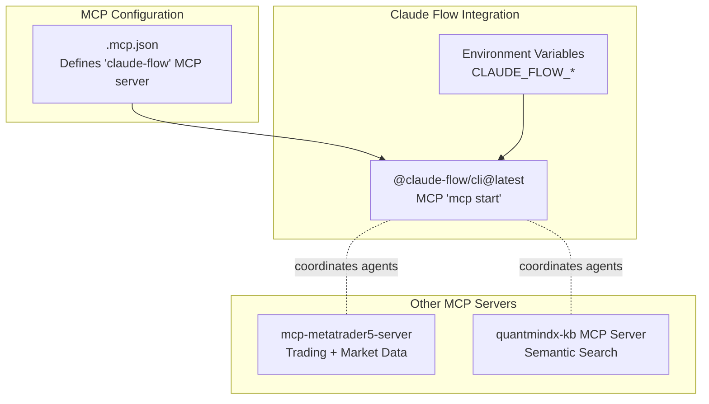
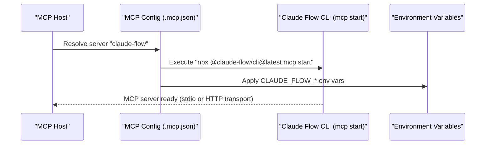
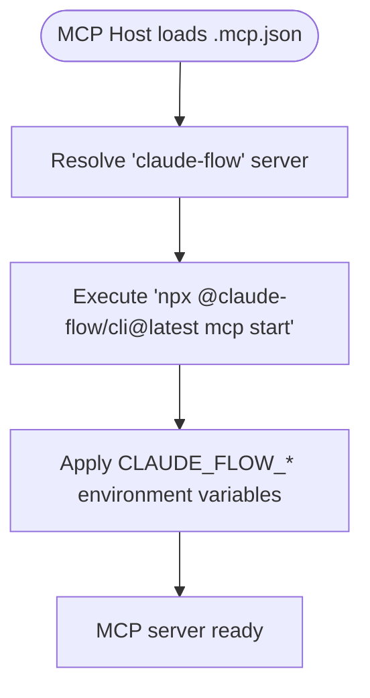
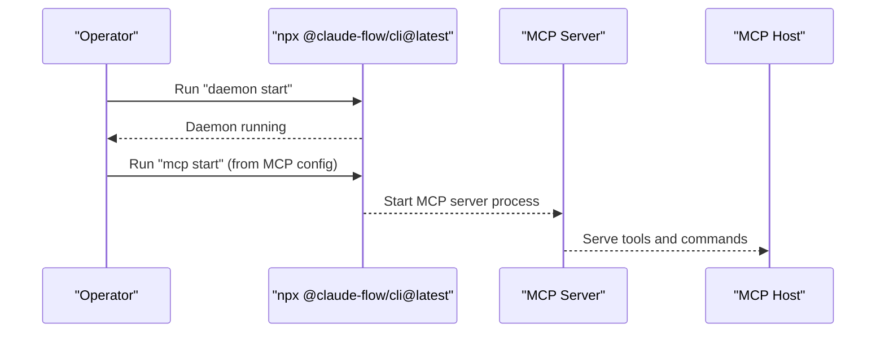
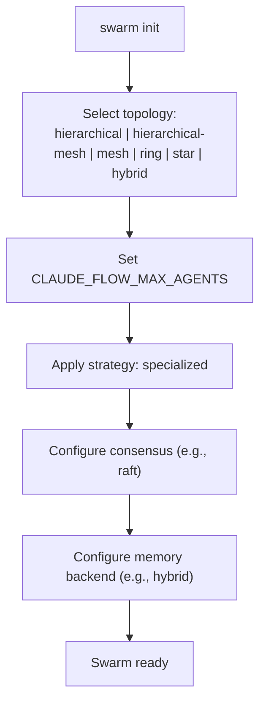
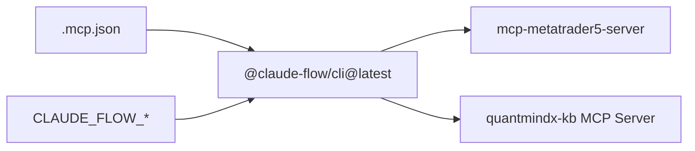

# Claude Flow Integration

<cite>
**Referenced Files in This Document**
- [.mcp.json](file://.mcp.json)
- [CLAUDE.md](file://CLAUDE.md)
- [mcp-metatrader5-server/README.md](file://mcp-metatrader5-server/README.md)
- [mcp-metatrader5-server/src/mcp_mt5/main.py](file://mcp-metatrader5-server/src/mcp_mt5/main.py)
- [mcp-servers/quantmindx-kb/README.md](file://mcp-servers/quantmindx-kb/README.md)
- [mcp-servers/quantmindx-kb/server.py](file://mcp-servers/quantmindx-kb/server.py)
- [mcp-servers/quantmindx-kb/start.sh](file://mcp-servers/quantmindx-kb/start.sh)
</cite>

## Table of Contents
1. [Introduction](#introduction)
2. [Project Structure](#project-structure)
3. [Core Components](#core-components)
4. [Architecture Overview](#architecture-overview)
5. [Detailed Component Analysis](#detailed-component-analysis)
6. [Dependency Analysis](#dependency-analysis)
7. [Performance Considerations](#performance-considerations)
8. [Troubleshooting Guide](#troubleshooting-guide)
9. [Conclusion](#conclusion)
10. [Appendices](#appendices)

## Introduction
This document explains how the QUANTMIND-X repository integrates the Claude Flow MCP server configuration and how it orchestrates multi-agent swarms, memory backends, and topology strategies. It focuses on the MCP configuration that launches the Claude Flow CLI as an MCP server, the environment variables controlling its behavior (including CLAUDE_FLOW_MODE, CLAUDE_FLOW_HOOKS_ENABLED, CLAUDE_FLOW_TOPOLOGY, CLAUDE_FLOW_MAX_AGENTS, and CLAUDE_FLOW_MEMORY_BACKEND), and the auto-start behavior. It also covers practical startup procedures, environment variable overrides, and integration patterns with the Claude Flow ecosystem. Finally, it provides debugging approaches, error handling strategies, and performance optimization techniques tailored to Claude Flow MCP server operations.

## Project Structure
The Claude Flow integration centers around an MCP configuration that launches the Claude Flow CLI as an MCP server. The repository also includes:
- A dedicated MCP server for MetaTrader 5 operations
- A knowledge-base MCP server for semantic search over MQL5 articles
- Supporting documentation and shell launchers for MCP servers

**Diagram sources**
- [.mcp.json](file://.mcp.json#L1-L20)
- [CLAUDE.md](file://CLAUDE.md#L817-L866)
- [mcp-metatrader5-server/README.md](file://mcp-metatrader5-server/README.md#L1-L311)
- [mcp-servers/quantmindx-kb/README.md](file://mcp-servers/quantmindx-kb/README.md#L1-L69)

**Section sources**
- [.mcp.json](file://.mcp.json#L1-L20)
- [CLAUDE.md](file://CLAUDE.md#L817-L866)
- [mcp-metatrader5-server/README.md](file://mcp-metatrader5-server/README.md#L1-L311)
- [mcp-servers/quantmindx-kb/README.md](file://mcp-servers/quantmindx-kb/README.md#L1-L69)

## Core Components
- Claude Flow MCP server definition: The MCP configuration registers a server named “claude-flow” that invokes the Claude Flow CLI with the MCP subcommand to start the server. It sets environment variables for mode, hooks, topology, agent cap, and memory backend, and disables auto-start by default.
- Environment variables for Claude Flow: The documentation enumerates CLAUDE_FLOW_MODE, CLAUDE_FLOW_HOOKS_ENABLED, CLAUDE_FLOW_TOPOLOGY, CLAUDE_FLOW_MAX_AGENTS, CLAUDE_FLOW_MEMORY_BACKEND, and other related variables for transport, logging, and memory paths.
- Agent management and topology: The documentation describes topologies (hierarchical, hierarchical-mesh, mesh, ring, star, hybrid) and recommends hierarchical-mesh for larger swarms. It also documents anti-drift configurations and specialized strategies.
- Auto-start and command execution: The MCP configuration sets autoStart to false, meaning the server is not started automatically by the MCP host; operators must explicitly start the daemon or use the provided commands.
- Integration patterns: The documentation outlines how to add the MCP server to Claude clients and how to start the daemon and run health checks.

**Section sources**
- [.mcp.json](file://.mcp.json#L1-L20)
- [CLAUDE.md](file://CLAUDE.md#L817-L866)
- [CLAUDE.md](file://CLAUDE.md#L301-L321)
- [CLAUDE.md](file://CLAUDE.md#L330-L374)
- [CLAUDE.md](file://CLAUDE.md#L853-L866)

## Architecture Overview
The Claude Flow integration uses the MCP configuration to launch the Claude Flow CLI as an MCP server. The CLI manages:
- Swarm orchestration with configurable topologies
- Agent pools and concurrency limits
- Memory backends and persistence
- Hooks for self-learning and worker automation

**Diagram sources**
- [.mcp.json](file://.mcp.json#L1-L20)
- [CLAUDE.md](file://CLAUDE.md#L853-L866)

## Detailed Component Analysis

### MCP Configuration for Claude Flow
- Command and args: Launches the Claude Flow CLI with the MCP subcommand to start the server.
- Environment variables: Sets CLAUDE_FLOW_MODE, CLAUDE_FLOW_HOOKS_ENABLED, CLAUDE_FLOW_TOPOLOGY, CLAUDE_FLOW_MAX_AGENTS, and CLAUDE_FLOW_MEMORY_BACKEND.
- Auto-start: Disabled by default, requiring explicit daemon or command invocation.

**Diagram sources**
- [.mcp.json](file://.mcp.json#L1-L20)

**Section sources**
- [.mcp.json](file://.mcp.json#L1-L20)

### Environment Variable Configuration
Key environment variables for Claude Flow MCP server:
- CLAUDE_FLOW_MODE: Selects the operational mode (e.g., v3).
- CLAUDE_FLOW_HOOKS_ENABLED: Enables or disables the hooks system.
- CLAUDE_FLOW_TOPOLOGY: Selects the swarm topology (e.g., hierarchical-mesh).
- CLAUDE_FLOW_MAX_AGENTS: Caps the maximum number of concurrent agents.
- CLAUDE_FLOW_MEMORY_BACKEND: Selects the memory backend (e.g., hybrid).
- CLAUDE_FLOW_MCP_PORT, CLAUDE_FLOW_MCP_HOST, CLAUDE_FLOW_MCP_TRANSPORT: Controls MCP transport and binding.
- CLAUDE_FLOW_MEMORY_PATH: Defines the memory storage path.

Practical override patterns:
- Override at runtime by exporting variables before invoking the MCP server or by adjusting the MCP configuration environment block.
- For development, adjust transport and port via CLAUDE_FLOW_MCP_TRANSPORT and CLAUDE_FLOW_MCP_PORT.

**Section sources**
- [CLAUDE.md](file://CLAUDE.md#L817-L837)
- [CLAUDE.md](file://CLAUDE.md#L829-L832)
- [CLAUDE.md](file://CLAUDE.md#L834-L836)
- [CLAUDE.md](file://CLAUDE.md#L853-L866)

### Auto-Start Functionality and Command Execution
- Auto-start disabled: The MCP configuration sets autoStart to false, ensuring the server is not launched automatically.
- Command execution: The MCP server is started via the Claude Flow CLI command. The documentation provides quick setup steps to add the MCP server and start the daemon.
- Background execution: The documentation outlines patterns for spawning agents in the background and waiting for completion, emphasizing concurrency and file organization rules.

**Diagram sources**
- [CLAUDE.md](file://CLAUDE.md#L853-L866)
- [.mcp.json](file://.mcp.json#L1-L20)

**Section sources**
- [.mcp.json](file://.mcp.json#L17-L18)
- [CLAUDE.md](file://CLAUDE.md#L853-L866)
- [CLAUDE.md](file://CLAUDE.md#L330-L374)

### Agent Management Configuration
- Topology selection: The documentation lists valid topologies and recommends hierarchical-mesh for larger teams to enable V3 queen + peer communication.
- Max agents: CLAUDE_FLOW_MAX_AGENTS controls concurrency and anti-drift behavior; smaller teams benefit from lower caps.
- Strategy: Specialized roles reduce overlap and drift.
- Consensus and memory: The documentation references consensus strategies and memory backends as part of the broader configuration.

**Diagram sources**
- [CLAUDE.md](file://CLAUDE.md#L301-L321)
- [CLAUDE.md](file://CLAUDE.md#L330-L374)

**Section sources**
- [CLAUDE.md](file://CLAUDE.md#L301-L321)
- [CLAUDE.md](file://CLAUDE.md#L330-L374)

### Memory Backend Options
- Hybrid memory backend: The MCP configuration sets CLAUDE_FLOW_MEMORY_BACKEND to hybrid, enabling efficient pattern recall and learning.
- Memory path: CLAUDE_FLOW_MEMORY_PATH defines where memory data is persisted.
- Memory commands: The documentation includes examples for storing, searching, and listing memory entries.

**Section sources**
- [.mcp.json](file://.mcp.json#L10-L16)
- [CLAUDE.md](file://CLAUDE.md#L834-L836)
- [CLAUDE.md](file://CLAUDE.md#L888-L911)

### Integration Patterns with Claude Flow Ecosystem
- Adding MCP servers: The documentation shows how to add the Claude Flow MCP server and optional companion servers to Claude clients.
- Daemon management: The CLI supports starting and managing a background daemon for continuous operation.
- Hooks and workers: The documentation enumerates hooks and background workers for self-learning and automation.

**Section sources**
- [CLAUDE.md](file://CLAUDE.md#L853-L866)
- [CLAUDE.md](file://CLAUDE.md#L630-L713)

### Practical Examples: Server Startup and Overrides
- Start daemon and MCP server: Use the documented commands to add the server and start the daemon, then start the MCP server.
- Environment variable overrides: Export variables before launching or adjust the MCP configuration environment block.
- Transport overrides: For development, set CLAUDE_FLOW_MCP_TRANSPORT and CLAUDE_FLOW_MCP_PORT to HTTP and a desired host/port.

**Section sources**
- [CLAUDE.md](file://CLAUDE.md#L853-L866)
- [CLAUDE.md](file://CLAUDE.md#L829-L832)
- [CLAUDE.md](file://CLAUDE.md#L834-L836)

## Dependency Analysis
The Claude Flow MCP server depends on:
- The MCP configuration to define the command, arguments, and environment variables
- The Claude Flow CLI for orchestration, topology management, and memory
- Optional integration with other MCP servers (e.g., MT5 and KB) for extended workflows

**Diagram sources**
- [.mcp.json](file://.mcp.json#L1-L20)
- [CLAUDE.md](file://CLAUDE.md#L853-L866)
- [mcp-metatrader5-server/README.md](file://mcp-metatrader5-server/README.md#L1-L311)
- [mcp-servers/quantmindx-kb/README.md](file://mcp-servers/quantmindx-kb/README.md#L1-L69)

**Section sources**
- [.mcp.json](file://.mcp.json#L1-L20)
- [CLAUDE.md](file://CLAUDE.md#L853-L866)
- [mcp-metatrader5-server/README.md](file://mcp-metatrader5-server/README.md#L1-L311)
- [mcp-servers/quantmindx-kb/README.md](file://mcp-servers/quantmindx-kb/README.md#L1-L69)

## Performance Considerations
- Topology choice: Use hierarchical-mesh for larger swarms to improve communication and reduce drift.
- Concurrency control: Tune CLAUDE_FLOW_MAX_AGENTS to balance throughput and stability.
- Memory backend: Hybrid memory improves recall and reduces latency for repeated tasks.
- Transport: For development, HTTP transport can simplify debugging; for production, stdio transport integrates better with Claude clients.
- Metrics and profiling: Use the documented hooks and performance commands to track and optimize performance.

[No sources needed since this section provides general guidance]

## Troubleshooting Guide
Common issues and strategies:
- MCP server not starting: Verify the MCP configuration and ensure autoStart is handled externally. Confirm the CLI command and environment variables are correct.
- Transport problems: Check CLAUDE_FLOW_MCP_TRANSPORT and port bindings. For HTTP, confirm host and port settings.
- Memory errors: Validate CLAUDE_FLOW_MEMORY_PATH and permissions. Use memory commands to inspect stored entries.
- Doctor checks: Run the documented doctor command to diagnose Node.js, npm, Git, config, daemon, memory, API keys, MCP servers, disk space, and TypeScript installations.
- Environment overrides: If defaults do not apply, export variables before starting the server or update the MCP configuration environment block.

**Section sources**
- [CLAUDE.md](file://CLAUDE.md#L839-L851)
- [CLAUDE.md](file://CLAUDE.md#L853-L866)
- [CLAUDE.md](file://CLAUDE.md#L888-L911)

## Conclusion
The QUANTMIND-X repository integrates the Claude Flow MCP server through a focused MCP configuration that launches the Claude Flow CLI with environment-controlled behavior. The configuration enables precise control over topology, agent concurrency, memory backends, and transport modes. Operators can start the server manually, override environment variables as needed, and integrate with other MCP servers for trading and knowledge-base operations. The documentation provides practical startup procedures, debugging steps, and performance guidance tailored to Claude Flow MCP server operations.

[No sources needed since this section summarizes without analyzing specific files]

## Appendices

### Appendix A: MCP Configuration Reference
- Server name: claude-flow
- Command: npx
- Args: @claude-flow/cli@latest mcp start
- Environment variables: CLAUDE_FLOW_MODE, CLAUDE_FLOW_HOOKS_ENABLED, CLAUDE_FLOW_TOPOLOGY, CLAUDE_FLOW_MAX_AGENTS, CLAUDE_FLOW_MEMORY_BACKEND
- Auto-start: false

**Section sources**
- [.mcp.json](file://.mcp.json#L1-L20)

### Appendix B: Environment Variables Reference
- CLAUDE_FLOW_MODE: Operational mode selector
- CLAUDE_FLOW_HOOKS_ENABLED: Enable/disable hooks system
- CLAUDE_FLOW_TOPOLOGY: Swarm topology (hierarchical, hierarchical-mesh, mesh, ring, star, hybrid)
- CLAUDE_FLOW_MAX_AGENTS: Maximum concurrent agents
- CLAUDE_FLOW_MEMORY_BACKEND: Memory backend (e.g., hybrid)
- CLAUDE_FLOW_MCP_PORT, CLAUDE_FLOW_MCP_HOST, CLAUDE_FLOW_MCP_TRANSPORT: MCP transport settings
- CLAUDE_FLOW_MEMORY_PATH: Memory storage path

**Section sources**
- [CLAUDE.md](file://CLAUDE.md#L817-L837)
- [CLAUDE.md](file://CLAUDE.md#L829-L832)
- [CLAUDE.md](file://CLAUDE.md#L834-L836)

### Appendix C: Related MCP Servers
- MetaTrader 5 MCP server: Provides trading and market data tools; supports stdio and HTTP transports.
- QuantMindX knowledge-base MCP server: Provides semantic search over MQL5 articles; includes a launcher script and ChromaDB variant.

**Section sources**
- [mcp-metatrader5-server/README.md](file://mcp-metatrader5-server/README.md#L1-L311)
- [mcp-servers/quantmindx-kb/README.md](file://mcp-servers/quantmindx-kb/README.md#L1-L69)
- [mcp-servers/quantmindx-kb/start.sh](file://mcp-servers/quantmindx-kb/start.sh#L1-L29)