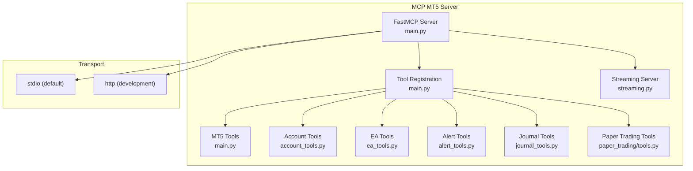
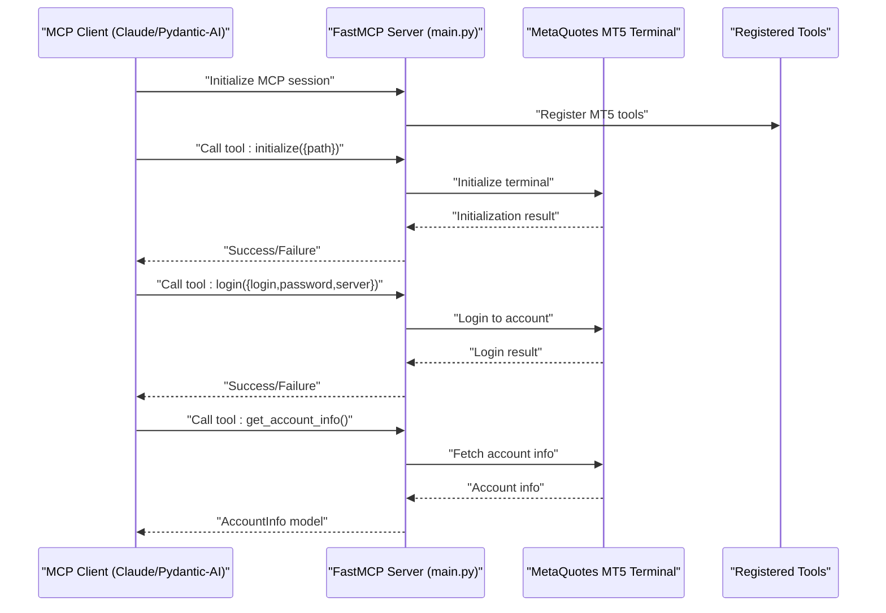
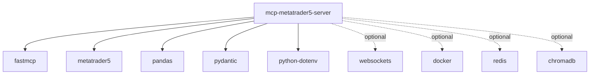

# MCP Server APIs

<cite>
**Referenced Files in This Document**
- [README.md](file://mcp-metatrader5-server/README.md)
- [main.py](file://mcp-metatrader5-server/src/mcp_mt5/main.py)
- [__init__.py](file://mcp-metatrader5-server/src/mcp_mt5/__init__.py)
- [pyproject.toml](file://mcp-metatrader5-server/pyproject.toml)
- [fastmcp.json](file://mcp-metatrader5-server/fastmcp.json)
- [.env.example](file://mcp-metatrader5-server/.env.example)
- [account_tools.py](file://mcp-metatrader5-server/src/mcp_mt5/account_tools.py)
- [ea_tools.py](file://mcp-metatrader5-server/src/mcp_mt5/ea_tools.py)
- [alert_tools.py](file://mcp-metatrader5-server/src/mcp_mt5/alert_tools.py)
- [journal_tools.py](file://mcp-metatrader5-server/src/mcp_mt5/journal_tools.py)
- [paper_trading/tools.py](file://mcp-metatrader5-server/src/mcp_mt5/paper_trading/tools.py)
- [streaming.py](file://mcp-metatrader5-server/src/mcp_mt5/streaming.py)
- [test_client.py](file://mcp-metatrader5-server/src/mcp_mt5/test_client.py)
- [example_ai_trader_agent.py](file://mcp-metatrader5-server/examples/example_ai_trader_agent.py)
</cite>

## Table of Contents
1. [Introduction](#introduction)
2. [Project Structure](#project-structure)
3. [Core Components](#core-components)
4. [Architecture Overview](#architecture-overview)
5. [Detailed Component Analysis](#detailed-component-analysis)
6. [Dependency Analysis](#dependency-analysis)
7. [Performance Considerations](#performance-considerations)
8. [Troubleshooting Guide](#troubleshooting-guide)
9. [Conclusion](#conclusion)
10. [Appendices](#appendices)

## Introduction
This document provides comprehensive API documentation for the MCP (Model Context Protocol) server integrated with MetaTrader 5 (MT5) within the QUANTMIND-X project. It covers server configuration, command execution patterns, and integration with Claude Flow and other MCP clients. It also documents the MT5 MCP server endpoints for market data, trading, account management, alerts, trade journaling, and paper trading deployment. Request/response schemas, authentication via environment variables, error handling strategies, and practical client implementation examples are included. Finally, it outlines server lifecycle, auto-start configurations, and debugging approaches.

## Project Structure
The MCP server for MT5 is implemented as a FastMCP-based Python package with modular tool registration and optional real-time streaming capabilities. The primary entry point initializes the FastMCP server and registers tools for MT5 operations, account management, alerts, journaling, and paper trading. The server supports stdio transport for MCP clients like Claude Desktop and HTTP transport for development/testing.

**Diagram sources**
- [main.py](file://mcp-metatrader5-server/src/mcp_mt5/main.py#L12-L72)
- [account_tools.py](file://mcp-metatrader5-server/src/mcp_mt5/account_tools.py#L16-L279)
- [ea_tools.py](file://mcp-metatrader5-server/src/mcp_mt5/ea_tools.py#L20-L321)
- [alert_tools.py](file://mcp-metatrader5-server/src/mcp_mt5/alert_tools.py#L17-L226)
- [journal_tools.py](file://mcp-metatrader5-server/src/mcp_mt5/journal_tools.py#L17-L186)
- [paper_trading/tools.py](file://mcp-metatrader5-server/src/mcp_mt5/paper_trading/tools.py#L56-L496)
- [streaming.py](file://mcp-metatrader5-server/src/mcp_mt5/streaming.py#L155-L198)

**Section sources**
- [README.md](file://mcp-metatrader5-server/README.md#L1-L311)
- [main.py](file://mcp-metatrader5-server/src/mcp_mt5/main.py#L12-L72)
- [__init__.py](file://mcp-metatrader5-server/src/mcp_mt5/__init__.py#L26-L48)

## Core Components
- FastMCP Server: Initializes the MCP server with instructions and registers tools for MT5 operations, account management, alerts, journaling, and paper trading.
- Tool Registry: Centralized registration of tools for MT5 operations, including connection management, market data retrieval, trading functions, and auxiliary services.
- Transport Modes: Supports stdio transport for MCP clients (default) and HTTP transport for development/testing.
- Streaming Server: Optional WebSocket-based real-time tick streaming for subscribed symbols.

Key server lifecycle and configuration:
- Entry point: The module exposes a main entry point that loads environment variables and starts the MCP server in stdio or HTTP mode based on configuration.
- Environment variables: Transport mode, host, port, and MT5 credentials are configured via environment variables.

**Section sources**
- [main.py](file://mcp-metatrader5-server/src/mcp_mt5/main.py#L12-L72)
- [__init__.py](file://mcp-metatrader5-server/src/mcp_mt5/__init__.py#L26-L48)
- [.env.example](file://mcp-metatrader5-server/.env.example#L1-L16)

## Architecture Overview
The MCP server architecture integrates FastMCP with MT5 operations and optional streaming. Tools are decorated with FastMCP decorators and registered centrally. The server can be invoked via stdio for MCP clients or HTTP for development.

**Diagram sources**
- [main.py](file://mcp-metatrader5-server/src/mcp_mt5/main.py#L413-L487)
- [main.py](file://mcp-metatrader5-server/src/mcp_mt5/main.py#L490-L527)

**Section sources**
- [main.py](file://mcp-metatrader5-server/src/mcp_mt5/main.py#L12-L72)
- [README.md](file://mcp-metatrader5-server/README.md#L43-L70)

## Detailed Component Analysis

### MCP Server Entry and Transport Configuration
- Entry point: The module defines a main entry point that loads environment variables and starts the MCP server in stdio or HTTP mode.
- Transport modes:
  - stdio: Default for MCP clients like Claude Desktop.
  - http: Development/testing mode with configurable host and port.
- Environment variables:
  - MT5_MCP_TRANSPORT: "stdio" or "http".
  - MT5_MCP_HOST: Server host for HTTP mode.
  - MT5_MCP_PORT: Server port for HTTP mode.
  - MT5_PATH, MT5_LOGIN, MT5_PASSWORD, MT5_SERVER: Optional MT5 credentials.

Practical startup procedures:
- Stdio mode (default): Run the script directly to start the MCP server for Claude Desktop.
- HTTP mode: Set environment variables and run the script to start an HTTP server for testing.

**Section sources**
- [__init__.py](file://mcp-metatrader5-server/src/mcp_mt5/__init__.py#L26-L48)
- [.env.example](file://mcp-metatrader5-server/.env.example#L1-L16)
- [README.md](file://mcp-metatrader5-server/README.md#L53-L70)

### Connection Management Tools
- initialize(path): Initializes the MT5 terminal with the specified executable path.
- login(login, password, server): Logs into a trading account.
- shutdown(): Shuts down the MT5 connection.

Usage patterns:
- Always call initialize() before other tools.
- Call login() after initialize() if programmatic login is required.
- Call shutdown() to release resources.

**Section sources**
- [main.py](file://mcp-metatrader5-server/src/mcp_mt5/main.py#L413-L441)
- [main.py](file://mcp-metatrader5-server/src/mcp_mt5/main.py#L458-L487)
- [main.py](file://mcp-metatrader5-server/src/mcp_mt5/main.py#L444-L455)

### Market Data Tools
- get_symbols(): Lists available symbols.
- get_symbols_by_group(group): Filters symbols by group/pattern.
- get_symbol_info(symbol): Returns detailed symbol information.
- get_symbol_info_tick(symbol): Returns latest tick data.
- symbol_select(symbol, visible): Adds/removes symbol from Market Watch.
- copy_rates_from_pos(symbol, timeframe, start_pos, count): Retrieves historical bars from position.
- copy_rates_from_date(symbol, timeframe, date_from, count): Retrieves bars from a specific date.
- copy_rates_range(symbol, timeframe, date_from, date_to): Retrieves bars within a date range.

Timeframe mapping:
- Integer timeframe values map to MT5 constants (e.g., 1 for M1, 60 for H1, 1440 for D1).

Timestamp handling:
- Timestamps are converted to ISO 8601 UTC format for JSON serialization.

**Section sources**
- [main.py](file://mcp-metatrader5-server/src/mcp_mt5/main.py#L565-L599)
- [main.py](file://mcp-metatrader5-server/src/mcp_mt5/main.py#L602-L656)
- [main.py](file://mcp-metatrader5-server/src/mcp_mt5/main.py#L659-L686)
- [main.py](file://mcp-metatrader5-server/src/mcp_mt5/main.py#L689-L793)
- [main.py](file://mcp-metatrader5-server/src/mcp_mt5/main.py#L363-L410)
- [main.py](file://mcp-metatrader5-server/src/mcp_mt5/main.py#L335-L362)

### Trading Tools
- order_send(request): Submits an order using an OrderRequest model.
- order_check(request): Validates an order request.
- positions_get(symbol, group): Retrieves open positions.
- positions_get_by_ticket(ticket): Retrieves a position by ticket.
- orders_get(symbol, group): Retrieves active orders.
- orders_get_by_ticket(ticket): Retrieves an order by ticket.
- history_orders_get(symbol, group, ticket, position, from_date, to_date): Retrieves historical orders.
- history_deals_get(symbol, group, ticket, position, from_date, to_date): Retrieves historical deals.

OrderRequest schema:
- action: Integer trade action constant.
- symbol: Instrument name.
- volume: Trade volume in lots.
- type: Integer order type constant.
- price: Price for the order.
- sl/tp: Stop loss and take profit prices.
- deviation: Maximum price deviation in points.
- magic: EA magic number.
- comment: Order comment (<= 31 characters).
- type_time: Order expiration type.
- type_filling: Integer order filling type.

Validation:
- Volume must be positive.
- Comment length must be <= 31.
- Action must be one of allowed constants.

**Section sources**
- [main.py](file://mcp-metatrader5-server/src/mcp_mt5/main.py#L163-L243)
- [main.py](file://mcp-metatrader5-server/src/mcp_mt5/main.py#L17-L283)

### Account Management Tools
- unlock_vault(master_password, config_path): Decrypts and loads the credential vault.
- lock_vault(): Locks the vault and clears sensitive data.
- list_accounts(): Lists configured MT5 accounts (without passwords).
- add_account(login, password, server, broker, account_type, nickname, terminal_path): Adds a new account to the vault.
- remove_account(login): Removes an account from the vault.
- switch_account(login): Switches to a different MT5 account.
- get_connection_status(): Returns current connection status and account info.
- disconnect_account(): Disconnects from the current MT5 account.

Security note:
- The vault must be unlocked before using account operations.

**Section sources**
- [account_tools.py](file://mcp-metatrader5-server/src/mcp_mt5/account_tools.py#L16-L279)

### EA Management Tools
- list_installed_eas(): Lists installed Expert Advisors.
- get_ea_info(ea_name): Returns detailed EA information.
- get_ea_status(magic_number, days): Checks EA activity by magic number.
- get_ea_performance(magic_number, days): Computes performance metrics.
- create_ea_template(ea_name, symbol, timeframe, magic_number, inputs): Creates a chart template file.
- stop_ea_by_magic(magic_number): Closes positions and cancels orders for an EA.
- get_daily_pnl(days): Returns daily P&L summary.

**Section sources**
- [ea_tools.py](file://mcp-metatrader5-server/src/mcp_mt5/ea_tools.py#L20-L321)

### Alert Tools
- configure_email_alerts(smtp_server, smtp_port, username, password, to_addresses): Configures email alerts.
- test_email_alert(): Sends a test email.
- send_trading_alert(title, message, severity, category, data): Sends a trading alert.
- get_alert_history(limit, severity, category): Returns recent alert history.
- get_alert_config(): Returns current alert configuration.

**Section sources**
- [alert_tools.py](file://mcp-metatrader5-server/src/mcp_mt5/alert_tools.py#L17-L226)

### Trade Journal Tools
- sync_journal_with_mt5(days): Syncs trades from MT5 history to the local journal.
- annotate_trade(ticket, notes, setup_type, rating, tags, lessons): Adds annotations to a trade.
- get_journal_stats(days): Returns performance statistics.
- search_journal(symbol, setup_type, status, limit): Searches journal entries.
- export_journal(format, days, filename): Exports journal to CSV or JSON.

**Section sources**
- [journal_tools.py](file://mcp-metatrader5-server/src/mcp_mt5/journal_tools.py#L17-L186)

### Paper Trading Tools
- deploy_paper_agent(strategy_name, strategy_code, config, mt5_credentials, magic_number, ...): Deploys a paper trading agent as a Docker container.
- list_paper_agents(include_stopped): Lists all paper trading agents.
- get_paper_agent(agent_id): Returns status of a specific agent.
- stop_paper_agent(agent_id, timeout, force): Stops an agent gracefully.
- remove_paper_agent(agent_id, force): Stops and removes an agent.
- get_agent_logs(agent_id, tail_lines): Retrieves agent logs.
- get_agent_performance(agent_id): Calculates performance metrics.
- get_agent_health(agent_id): Returns health status.
- restart_agent(agent_id, timeout): Restarts an agent.

**Section sources**
- [paper_trading/tools.py](file://mcp-metatrader5-server/src/mcp_mt5/paper_trading/tools.py#L56-L496)

### Streaming Server (Optional)
- Real-time tick streaming via WebSocket with multi-symbol subscription, automatic reconnection, and heartbeat.
- Client protocol supports subscribe/unsubscribe/get_symbols/ping.
- Server messages include tick, subscribed, unsubscribed, symbols, pong, error, and heartbeat.

**Section sources**
- [streaming.py](file://mcp-metatrader5-server/src/mcp_mt5/streaming.py#L155-L198)
- [streaming.py](file://mcp-metatrader5-server/src/mcp_mt5/streaming.py#L213-L275)
- [streaming.py](file://mcp-metatrader5-server/src/mcp_mt5/streaming.py#L276-L328)
- [streaming.py](file://mcp-metatrader5-server/src/mcp_mt5/streaming.py#L329-L391)

### Request/Response Schemas
Common Pydantic models used across tools:
- SymbolInfo: Comprehensive symbol metadata and market data fields.
- AccountInfo: Trading account information including balance, equity, margin, and leverage.
- OrderRequest: Parameters for placing trades with validation.
- OrderResult: Execution result of an order submission.
- Position: Open position details.
- HistoryOrder: Historical order information.
- Deal: Deal information.

Timestamp handling:
- Timestamps are converted to ISO 8601 UTC format for JSON serialization.

**Section sources**
- [main.py](file://mcp-metatrader5-server/src/mcp_mt5/main.py#L74-L333)
- [main.py](file://mcp-metatrader5-server/src/mcp_mt5/main.py#L335-L362)

### Authentication Mechanisms
- Environment variables:
  - MT5_MCP_TRANSPORT: "stdio" or "http".
  - MT5_MCP_HOST/MT5_MCP_PORT: HTTP transport settings.
  - MT5_PATH, MT5_LOGIN, MT5_PASSWORD, MT5_SERVER: Optional MT5 credentials.
- Credential vault:
  - unlock_vault() decrypts and loads credentials.
  - lock_vault() locks the vault and clears sensitive data.

**Section sources**
- [.env.example](file://mcp-metatrader5-server/.env.example#L1-L16)
- [account_tools.py](file://mcp-metatrader5-server/src/mcp_mt5/account_tools.py#L25-L83)

### Error Handling Strategies
- MT5-specific errors:
  - Initialization failures, login failures, and missing symbols/ticks are logged and surfaced with detailed error messages.
- Validation errors:
  - Pydantic validators enforce constraints on OrderRequest fields (e.g., volume > 0, comment length <= 31).
- Streaming errors:
  - Unknown message types and invalid JSON are handled with error responses.
- General guidance:
  - Ensure MT5 terminal is running and API access is enabled.
  - Verify symbol selection in Market Watch before requesting ticks.
  - Check credentials and broker connectivity.

**Section sources**
- [main.py](file://mcp-metatrader5-server/src/mcp_mt5/main.py#L435-L437)
- [main.py](file://mcp-metatrader5-server/src/mcp_mt5/main.py#L514-L522)
- [main.py](file://mcp-metatrader5-server/src/mcp_mt5/main.py#L644-L652)
- [streaming.py](file://mcp-metatrader5-server/src/mcp_mt5/streaming.py#L270-L275)

### Practical Examples of Client Implementation
- Claude Desktop integration:
  - Use uvx to run the MCP server directly from the package.
  - Configure MCP servers in Claude Desktop configuration to point to the mt5mcp command.
- Pydantic-AI integration:
  - Use MCPServerStdio to wrap the MCP server and run autonomous trading decisions.
- HTTP development client:
  - Start the server in HTTP mode and use the test client to call tools programmatically.

**Section sources**
- [README.md](file://mcp-metatrader5-server/README.md#L71-L152)
- [example_ai_trader_agent.py](file://mcp-metatrader5-server/examples/example_ai_trader_agent.py#L80-L132)
- [test_client.py](file://mcp-metatrader5-server/src/mcp_mt5/test_client.py#L16-L24)

### Server Lifecycle and Auto-start Configurations
- Lifecycle:
  - Initialize MT5 terminal.
  - Optionally log in to an account.
  - Use tools for market data, trading, and management.
  - Shutdown MT5 connection when finished.
- Auto-start:
  - Stdio mode is suitable for MCP clients like Claude Desktop.
  - HTTP mode is intended for development/testing and can be integrated into CI or local scripts.

**Section sources**
- [main.py](file://mcp-metatrader5-server/src/mcp_mt5/main.py#L413-L487)
- [__init__.py](file://mcp-metatrader5-server/src/mcp_mt5/__init__.py#L26-L48)

### Debugging Approaches
- Enable logging to capture MT5 errors and tool execution details.
- Use the test client to reproduce issues with HTTP mode.
- Verify environment variables and MT5 terminal configuration.
- Check symbol selection and availability in Market Watch.

**Section sources**
- [test_client.py](file://mcp-metatrader5-server/src/mcp_mt5/test_client.py#L185-L212)

## Dependency Analysis
The MCP MT5 server depends on FastMCP for the MCP protocol, MetaQuotes MT5 Python API for terminal interactions, pandas for data formatting, pydantic for request/response schemas, and python-dotenv for environment configuration. Optional dependencies include websockets for real-time streaming and Docker/Redis/ChromaDB for paper trading deployment.

**Diagram sources**
- [pyproject.toml](file://mcp-metatrader5-server/pyproject.toml#L22-L32)

**Section sources**
- [pyproject.toml](file://mcp-metatrader5-server/pyproject.toml#L22-L32)

## Performance Considerations
- Timeframe mapping: Use supported timeframe integers to avoid conversion errors.
- Batch operations: Prefer bulk requests where possible to reduce MT5 round trips.
- Streaming: Tune poll intervals and client limits for real-time tick streaming.
- Resource limits: For paper trading deployments, configure container resource limits appropriately.

## Troubleshooting Guide
Common issues and resolutions:
- MT5 initialization failure: Ensure the terminal executable path is correct and API access is enabled.
- Login failures: Verify credentials and broker server name.
- Missing symbol ticks: Confirm the symbol is selected in Market Watch.
- HTTP server startup: Check host/port configuration and firewall settings.
- Streaming errors: Validate client messages and symbol availability.

**Section sources**
- [main.py](file://mcp-metatrader5-server/src/mcp_mt5/main.py#L435-L437)
- [main.py](file://mcp-metatrader5-server/src/mcp_mt5/main.py#L644-L652)
- [streaming.py](file://mcp-metatrader5-server/src/mcp_mt5/streaming.py#L217-L223)

## Conclusion
The MCP MT5 server provides a robust, extensible interface for integrating AI assistants with MetaTrader 5. It supports connection management, market data retrieval, trading operations, account management, alerts, journaling, and paper trading deployment. With flexible transport modes, strong validation, and comprehensive error handling, it enables reliable automation and analysis workflows within the QUANTMIND-X ecosystem.

## Appendices
- Installation and usage instructions are available in the repository README.
- Example configurations for Claude Desktop and Pydantic-AI are provided in the repository.

**Section sources**
- [README.md](file://mcp-metatrader5-server/README.md#L19-L152)