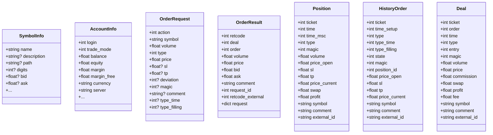

# MT5 MCP Server

<cite>
**Referenced Files in This Document**
- [README.md](file://mcp-metatrader5-server/README.md)
- [pyproject.toml](file://mcp-metatrader5-server/pyproject.toml)
- [fastmcp.json](file://mcp-metatrader5-server/fastmcp.json)
- [__init__.py](file://mcp-metatrader5-server/src/mcp_mt5/__init__.py)
- [main.py](file://mcp-metatrader5-server/src/mcp_mt5/main.py)
- [streaming.py](file://mcp-metatrader5-server/src/mcp_mt5/streaming.py)
- [account_manager.py](file://mcp-metatrader5-server/src/mcp_mt5/account_manager.py)
- [account_tools.py](file://mcp-metatrader5-server/src/mcp_mt5/account_tools.py)
- [ea_manager.py](file://mcp-metatrader5-server/src/mcp_mt5/ea_manager.py)
- [ea_tools.py](file://mcp-metatrader5-server/src/mcp_mt5/ea_tools.py)
- [alert_service.py](file://mcp-metatrader5-server/src/mcp_mt5/alert_service.py)
- [alert_tools.py](file://mcp-metatrader5-server/src/mcp_mt5/alert_tools.py)
- [journal.py](file://mcp-metatrader5-server/src/mcp_mt5/journal.py)
- [journal_tools.py](file://mcp-metatrader5-server/src/mcp_mt5/journal_tools.py)
</cite>

## Table of Contents
1. [Introduction](#introduction)
2. [Project Structure](#project-structure)
3. [Core Components](#core-components)
4. [Architecture Overview](#architecture-overview)
5. [Detailed Component Analysis](#detailed-component-analysis)
6. [Dependency Analysis](#dependency-analysis)
7. [Performance Considerations](#performance-considerations)
8. [Troubleshooting Guide](#troubleshooting-guide)
9. [Conclusion](#conclusion)
10. [Appendices](#appendices)

## Introduction
This document describes the MT5 MCP Server implementation in QUANTMIND-X, focusing on the Model Context Protocol (MCP) server that integrates MetaTrader 5 (MT5) for trading operations, market data retrieval, and expert advisor (EA) management. It explains the MCP server endpoints, request/response schemas, authentication and security mechanisms, real-time streaming, and operational lifecycle. Practical guidance is provided for client configuration, server startup, and integration with the trading infrastructure.

## Project Structure
The MCP server is implemented as a Python package with modular components:
- FastMCP server entry and tool registration
- Market data and trading endpoints
- Real-time tick streaming via WebSocket
- Multi-account management with secure credential storage
- EA management tools
- Alert service and trade journal tools

**Diagram sources**
- [main.py](file://mcp-metatrader5-server/src/mcp_mt5/main.py#L12-L71)
- [account_tools.py](file://mcp-metatrader5-server/src/mcp_mt5/account_tools.py#L16-L279)
- [ea_tools.py](file://mcp-metatrader5-server/src/mcp_mt5/ea_tools.py#L20-L321)
- [alert_tools.py](file://mcp-metatrader5-server/src/mcp_mt5/alert_tools.py#L17-L226)
- [journal_tools.py](file://mcp-metatrader5-server/src/mcp_mt5/journal_tools.py#L17-L186)
- [streaming.py](file://mcp-metatrader5-server/src/mcp_mt5/streaming.py#L123-L404)

**Section sources**
- [README.md](file://mcp-metatrader5-server/README.md#L1-L311)
- [pyproject.toml](file://mcp-metatrader5-server/pyproject.toml#L1-L86)
- [fastmcp.json](file://mcp-metatrader5-server/fastmcp.json#L1-L17)

## Core Components
- FastMCP server with tool registration and resource endpoints
- Pydantic models for request/response schemas
- Market data retrieval functions (rates, ticks)
- Trading functions (send/check orders, positions, orders, history)
- Real-time tick streaming via WebSocket
- Multi-account management with encrypted vault
- EA management tools (list, info, status, performance, templates, emergency stop)
- Alert service for email notifications
- Trade journal tools for synchronization, annotations, stats, search, export

**Section sources**
- [main.py](file://mcp-metatrader5-server/src/mcp_mt5/main.py#L74-L333)
- [streaming.py](file://mcp-metatrader5-server/src/mcp_mt5/streaming.py#L123-L404)
- [account_manager.py](file://mcp-metatrader5-server/src/mcp_mt5/account_manager.py#L162-L552)
- [ea_manager.py](file://mcp-metatrader5-server/src/mcp_mt5/ea_manager.py#L85-L471)
- [alert_service.py](file://mcp-metatrader5-server/src/mcp_mt5/alert_service.py#L1-L200)
- [journal.py](file://mcp-metatrader5-server/src/mcp_mt5/journal.py#L1-L200)

## Architecture Overview
The MCP server exposes tools and resources to AI clients. Tools are decorated with FastMCP and backed by MT5 Python API calls. Data flows from MT5 into Pydantic models for standardized responses. Optional real-time streaming augments batch data retrieval.

**Diagram sources**
- [main.py](file://mcp-metatrader5-server/src/mcp_mt5/main.py#L564-L578)
- [main.py](file://mcp-metatrader5-server/src/mcp_mt5/main.py#L718-L728)

## Detailed Component Analysis

### MCP Server Lifecycle and Transport
- Entry point resolves environment variables for transport mode (stdio or HTTP).
- HTTP mode supports configurable host/port via environment variables.
- stdio mode is default for MCP clients like Claude Desktop.

**Diagram sources**
- [__init__.py](file://mcp-metatrader5-server/src/mcp_mt5/__init__.py#L26-L48)

**Section sources**
- [__init__.py](file://mcp-metatrader5-server/src/mcp_mt5/__init__.py#L26-L48)
- [README.md](file://mcp-metatrader5-server/README.md#L53-L69)

### Authentication and Security
- Multi-account management uses an encrypted vault with a master password.
- Credentials are stored encrypted at rest; runtime memory cleared when locked.
- Email alert configuration supports secure SMTP credentials.

**Diagram sources**
- [account_tools.py](file://mcp-metatrader5-server/src/mcp_mt5/account_tools.py#L24-L83)
- [account_manager.py](file://mcp-metatrader5-server/src/mcp_mt5/account_manager.py#L224-L280)
- [account_manager.py](file://mcp-metatrader5-server/src/mcp_mt5/account_manager.py#L397-L504)

**Section sources**
- [account_tools.py](file://mcp-metatrader5-server/src/mcp_mt5/account_tools.py#L24-L83)
- [account_manager.py](file://mcp-metatrader5-server/src/mcp_mt5/account_manager.py#L107-L156)
- [account_manager.py](file://mcp-metatrader5-server/src/mcp_mt5/account_manager.py#L224-L280)

### Request/Response Schemas
Core schemas define typed inputs and outputs for trading and market data operations.

**Diagram sources**
- [main.py](file://mcp-metatrader5-server/src/mcp_mt5/main.py#L74-L333)

**Section sources**
- [main.py](file://mcp-metatrader5-server/src/mcp_mt5/main.py#L74-L333)

### Market Data Retrieval
- Symbols: list all symbols or filter by group.
- Symbol info: detailed instrument properties.
- Ticks: latest tick data and historical ticks.
- Rates: historical OHLCV bars by timeframe and position/date/range.

**Diagram sources**
- [main.py](file://mcp-metatrader5-server/src/mcp_mt5/main.py#L688-L729)
- [main.py](file://mcp-metatrader5-server/src/mcp_mt5/main.py#L335-L361)

**Section sources**
- [main.py](file://mcp-metatrader5-server/src/mcp_mt5/main.py#L564-L598)
- [main.py](file://mcp-metatrader5-server/src/mcp_mt5/main.py#L601-L655)
- [main.py](file://mcp-metatrader5-server/src/mcp_mt5/main.py#L688-L792)
- [main.py](file://mcp-metatrader5-server/src/mcp_mt5/main.py#L800-L889)

### Trading Operations
- Order placement and checks use validated OrderRequest objects.
- Positions and orders retrieval with filtering by symbol/group/ticket.
- Historical orders and deals retrieval with flexible date ranges.

**Diagram sources**
- [main.py](file://mcp-metatrader5-server/src/mcp_mt5/main.py#L1148-L1211)
- [main.py](file://mcp-metatrader5-server/src/mcp_mt5/main.py#L983-L1145)

**Section sources**
- [main.py](file://mcp-metatrader5-server/src/mcp_mt5/main.py#L983-L1145)
- [main.py](file://mcp-metatrader5-server/src/mcp_mt5/main.py#L1214-L1321)
- [main.py](file://mcp-metatrader5-server/src/mcp_mt5/main.py#L1323-L1434)

### Real-Time Tick Streaming
- WebSocket server streams tick data for subscribed symbols.
- Supports subscribe/unsubscribe, symbol discovery, ping/pong, and heartbeats.
- Polling loop batches broadcasts and rate-limits per client.

**Diagram sources**
- [streaming.py](file://mcp-metatrader5-server/src/mcp_mt5/streaming.py#L123-L404)

**Section sources**
- [streaming.py](file://mcp-metatrader5-server/src/mcp_mt5/streaming.py#L123-L404)

### Expert Advisor Management
- Lists installed EAs, retrieves metadata, and determines EA status by magic number.
- Computes performance metrics and generates chart templates for deployment.
- Provides emergency stop to close positions and cancel orders by magic number.

**Diagram sources**
- [ea_manager.py](file://mcp-metatrader5-server/src/mcp_mt5/ea_manager.py#L114-L149)
- [ea_manager.py](file://mcp-metatrader5-server/src/mcp_mt5/ea_manager.py#L167-L220)
- [ea_manager.py](file://mcp-metatrader5-server/src/mcp_mt5/ea_manager.py#L222-L308)
- [ea_manager.py](file://mcp-metatrader5-server/src/mcp_mt5/ea_manager.py#L310-L380)
- [ea_manager.py](file://mcp-metatrader5-server/src/mcp_mt5/ea_manager.py#L382-L455)

**Section sources**
- [ea_tools.py](file://mcp-metatrader5-server/src/mcp_mt5/ea_tools.py#L28-L103)
- [ea_tools.py](file://mcp-metatrader5-server/src/mcp_mt5/ea_tools.py#L105-L142)
- [ea_tools.py](file://mcp-metatrader5-server/src/mcp_mt5/ea_tools.py#L144-L211)
- [ea_tools.py](file://mcp-metatrader5-server/src/mcp_mt5/ea_tools.py#L213-L246)
- [ea_tools.py](file://mcp-metatrader5-server/src/mcp_mt5/ea_tools.py#L248-L321)
- [ea_manager.py](file://mcp-metatrader5-server/src/mcp_mt5/ea_manager.py#L114-L149)
- [ea_manager.py](file://mcp-metatrader5-server/src/mcp_mt5/ea_manager.py#L167-L220)
- [ea_manager.py](file://mcp-metatrader5-server/src/mcp_mt5/ea_manager.py#L222-L308)
- [ea_manager.py](file://mcp-metatrader5-server/src/mcp_mt5/ea_manager.py#L310-L380)
- [ea_manager.py](file://mcp-metatrader5-server/src/mcp_mt5/ea_manager.py#L382-L455)

### Alert Service
- Configures SMTP settings for email alerts.
- Sends alerts with severity and category, with rate limiting and quiet hours.
- Retrieves alert history and current configuration.

**Diagram sources**
- [alert_tools.py](file://mcp-metatrader5-server/src/mcp_mt5/alert_tools.py#L25-L73)
- [alert_tools.py](file://mcp-metatrader5-server/src/mcp_mt5/alert_tools.py#L92-L167)
- [alert_tools.py](file://mcp-metatrader5-server/src/mcp_mt5/alert_tools.py#L169-L225)

**Section sources**
- [alert_tools.py](file://mcp-metatrader5-server/src/mcp_mt5/alert_tools.py#L25-L73)
- [alert_tools.py](file://mcp-metatrader5-server/src/mcp_mt5/alert_tools.py#L92-L167)
- [alert_tools.py](file://mcp-metatrader5-server/src/mcp_mt5/alert_tools.py#L169-L225)

### Trade Journal
- Synchronizes MT5 history to a local SQLite journal.
- Adds annotations (notes, setup, rating, tags, lessons).
- Computes performance stats, searches trades, and exports to CSV/JSON.

**Diagram sources**
- [journal_tools.py](file://mcp-metatrader5-server/src/mcp_mt5/journal_tools.py#L25-L45)
- [journal_tools.py](file://mcp-metatrader5-server/src/mcp_mt5/journal_tools.py#L47-L82)
- [journal_tools.py](file://mcp-metatrader5-server/src/mcp_mt5/journal_tools.py#L84-L107)
- [journal_tools.py](file://mcp-metatrader5-server/src/mcp_mt5/journal_tools.py#L109-L137)
- [journal_tools.py](file://mcp-metatrader5-server/src/mcp_mt5/journal_tools.py#L139-L185)

**Section sources**
- [journal_tools.py](file://mcp-metatrader5-server/src/mcp_mt5/journal_tools.py#L25-L45)
- [journal_tools.py](file://mcp-metatrader5-server/src/mcp_mt5/journal_tools.py#L47-L82)
- [journal_tools.py](file://mcp-metatrader5-server/src/mcp_mt5/journal_tools.py#L84-L107)
- [journal_tools.py](file://mcp-metatrader5-server/src/mcp_mt5/journal_tools.py#L109-L137)
- [journal_tools.py](file://mcp-metatrader5-server/src/mcp_mt5/journal_tools.py#L139-L185)

## Dependency Analysis
External dependencies include FastMCP, MetaTrader5, pandas, pydantic, python-dotenv, and optional websockets for streaming.

**Diagram sources**
- [pyproject.toml](file://mcp-metatrader5-server/pyproject.toml#L22-L32)

**Section sources**
- [pyproject.toml](file://mcp-metatrader5-server/pyproject.toml#L22-L32)

## Performance Considerations
- Prefer batch retrieval for rates and ticks to minimize MT5 round trips.
- Use symbol selection sparingly; keep frequently used symbols selected.
- Validate order parameters with order_check before order_send to reduce failures.
- For streaming, tune poll intervals and client limits to balance latency and throughput.
- Encrypt credentials at rest; avoid logging sensitive data.

## Troubleshooting Guide
Common issues and resolutions:
- MT5 initialization/login failures: verify terminal path and credentials; check last error details.
- Symbol not selected: call symbol_select(symbol, visible=True) before tick/retrieve operations.
- Order failures: review retcode mapping and adjust price/volume/SL/TP; ensure auto-trading enabled.
- Streaming connectivity: confirm websockets availability and server host/port configuration.
- Account vault: ensure unlock_vault() is called before account operations.

**Section sources**
- [main.py](file://mcp-metatrader5-server/src/mcp_mt5/main.py#L435-L440)
- [main.py](file://mcp-metatrader5-server/src/mcp_mt5/main.py#L481-L486)
- [main.py](file://mcp-metatrader5-server/src/mcp_mt5/main.py#L642-L652)
- [main.py](file://mcp-metatrader5-server/src/mcp_mt5/main.py#L1074-L1088)
- [streaming.py](file://mcp-metatrader5-server/src/mcp_mt5/streaming.py#L162-L167)
- [account_tools.py](file://mcp-metatrader5-server/src/mcp_mt5/account_tools.py#L47-L65)

## Conclusion
The MT5 MCP Server provides a robust, secure, and extensible bridge between AI clients and the MetaTrader 5 platform. It offers standardized tools for market data, trading, real-time streaming, multi-account management, EA orchestration, alerts, and journaling. By leveraging Pydantic schemas, FastMCP, and secure credential handling, it enables reliable automation and integration within trading workflows.

## Appendices

### MCP Server Startup Procedures
- Development mode with HTTP transport:
  - Set environment variables for host/port.
  - Run the server entry point.
- Production/stdio mode:
  - Use stdio transport for MCP clients like Claude Desktop.

**Section sources**
- [README.md](file://mcp-metatrader5-server/README.md#L53-L69)
- [__init__.py](file://mcp-metatrader5-server/src/mcp_mt5/__init__.py#L35-L48)

### Client Implementation Guidance
- Use FastMCP installers to register the server with your MCP client.
- Construct OrderRequest objects with integer constants for action/type/filling.
- For streaming, connect to the WebSocket endpoint and subscribe to desired symbols.

**Section sources**
- [README.md](file://mcp-metatrader5-server/README.md#L71-L132)
- [main.py](file://mcp-metatrader5-server/src/mcp_mt5/main.py#L163-L244)
- [streaming.py](file://mcp-metatrader5-server/src/mcp_mt5/streaming.py#L123-L198)