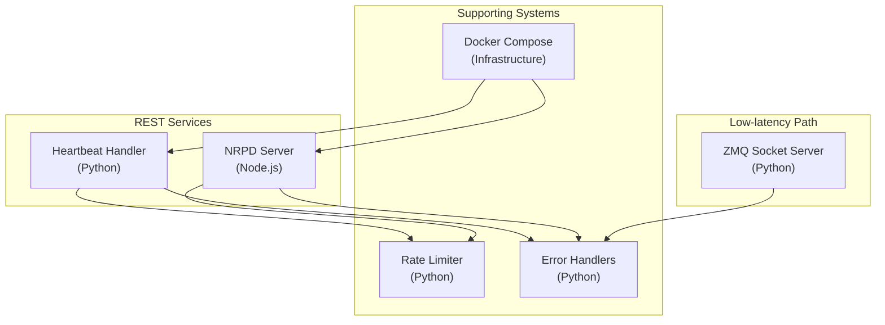
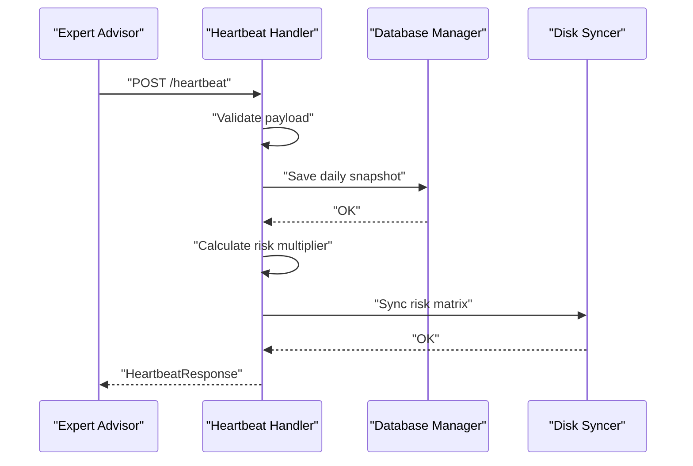
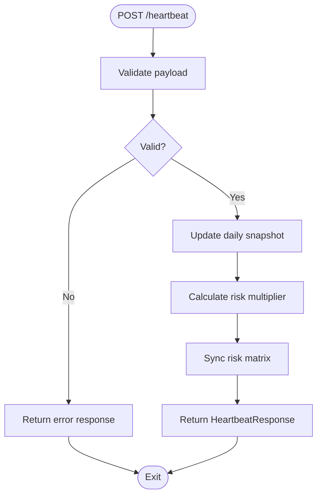
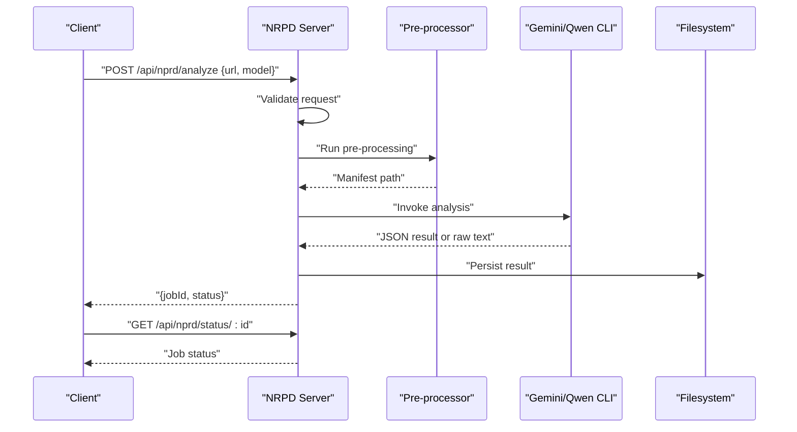
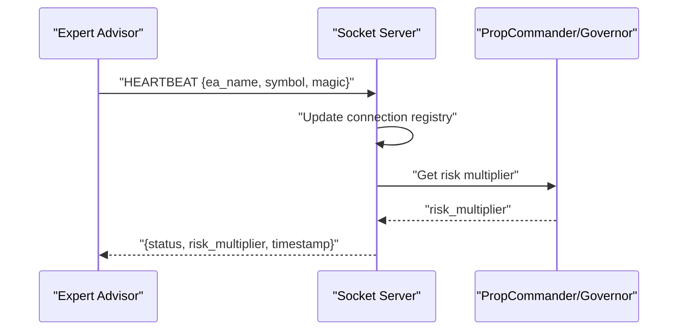
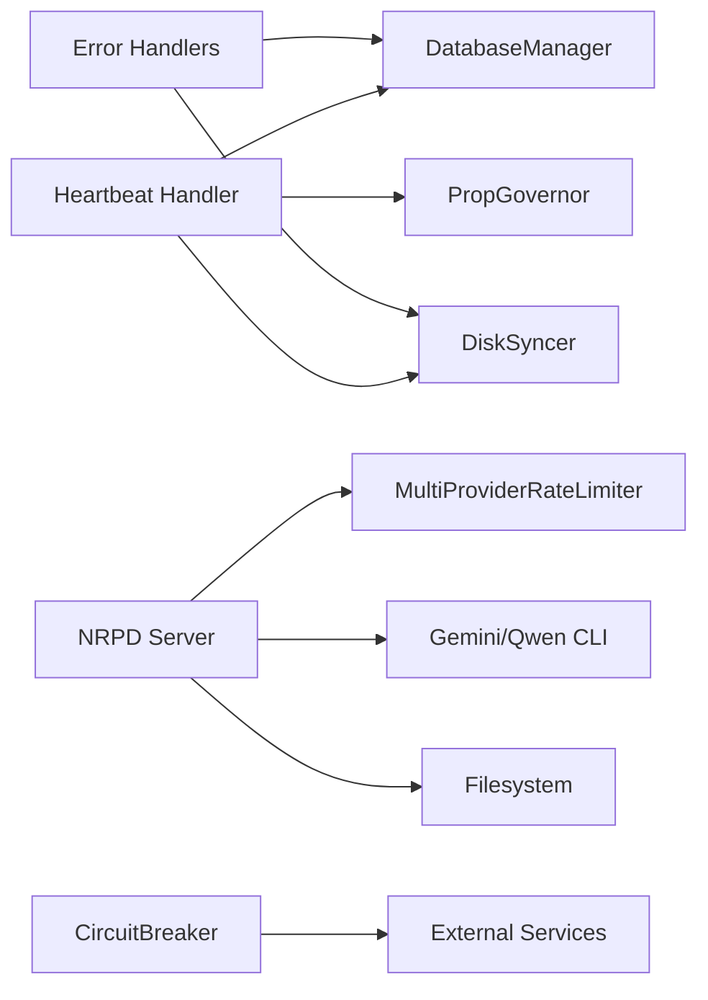

# REST API Endpoints

<cite>
**Referenced Files in This Document**
- [heartbeat.py](file://src/api/heartbeat.py)
- [nprd_server.js](file://server/nprd_server.js)
- [socket_server.py](file://src/router/socket_server.py)
- [rate_limiter.py](file://src/nprd/rate_limiter.py)
- [error_handlers.py](file://src/error_handlers.py)
- [docker-compose.yml](file://docker-compose.yml)
</cite>

## Table of Contents
1. [Introduction](#introduction)
2. [Project Structure](#project-structure)
3. [Core Components](#core-components)
4. [Architecture Overview](#architecture-overview)
5. [Detailed Component Analysis](#detailed-component-analysis)
6. [Dependency Analysis](#dependency-analysis)
7. [Performance Considerations](#performance-considerations)
8. [Troubleshooting Guide](#troubleshooting-guide)
9. [Conclusion](#conclusion)
10. [Appendices](#appendices)

## Introduction
This document describes the REST API endpoints for QUANTMIND-X core services with a focus on:
- Heartbeat monitoring for Expert Advisors
- Neural Pattern Recognition Data (NRPD) analysis orchestration
- System health and operational controls

It covers HTTP methods, URL patterns, request/response schemas, authentication requirements, error response codes, rate limiting policies, and security considerations. It also provides practical examples of client implementation, response parsing, and integration patterns with external systems.

## Project Structure
The REST APIs are implemented across Python and Node.js services:
- Heartbeat API: Python FastAPI-compatible handler
- NRPD Analysis API: Node.js Express service
- Low-latency socket path: ZMQ-based socket server for HFT-grade event delivery
- Supporting infrastructure: Rate limiting, error handling, and container orchestration

**Diagram sources**
- [heartbeat.py](file://src/api/heartbeat.py#L1-L227)
- [nprd_server.js](file://server/nprd_server.js#L1-L255)
- [socket_server.py](file://src/router/socket_server.py#L1-L435)
- [rate_limiter.py](file://src/nprd/rate_limiter.py#L1-L385)
- [error_handlers.py](file://src/error_handlers.py#L1-L389)
- [docker-compose.yml](file://docker-compose.yml#L1-L27)

**Section sources**
- [heartbeat.py](file://src/api/heartbeat.py#L1-L227)
- [nprd_server.js](file://server/nprd_server.js#L1-L255)
- [socket_server.py](file://src/router/socket_server.py#L1-L435)
- [rate_limiter.py](file://src/nprd/rate_limiter.py#L1-L385)
- [error_handlers.py](file://src/error_handlers.py#L1-L389)
- [docker-compose.yml](file://docker-compose.yml#L1-L27)

## Core Components
- Heartbeat API: Accepts periodic heartbeats from Expert Advisors, validates payload, updates internal state, calculates risk multiplier, and returns a response.
- NRPD Analysis API: Orchestrates video analysis jobs, exposes job status polling, and persists results.
- Socket Server: Provides sub-5ms latency event delivery for live trading events and heartbeats.
- Rate Limiting: Enforces per-provider quotas with automatic fallback.
- Error Handling: Centralized retry, fallback, and circuit breaker patterns.

**Section sources**
- [heartbeat.py](file://src/api/heartbeat.py#L1-L227)
- [nprd_server.js](file://server/nprd_server.js#L1-L255)
- [socket_server.py](file://src/router/socket_server.py#L1-L435)
- [rate_limiter.py](file://src/nprd/rate_limiter.py#L1-L385)
- [error_handlers.py](file://src/error_handlers.py#L1-L389)

## Architecture Overview
The system supports two complementary paths:
- REST path for integrations and batch operations
- Socket path for high-frequency, low-latency event streaming

**Diagram sources**
- [heartbeat.py](file://src/api/heartbeat.py#L95-L138)

## Detailed Component Analysis

### Heartbeat API
- Purpose: Receive periodic heartbeats from Expert Advisors, validate inputs, update state, and return a risk multiplier.
- Authentication: Not specified in the handler; clients should secure endpoints via reverse proxy or middleware.
- URL Pattern: POST /heartbeat
- Request Schema (HeartbeatPayload):
  - Required fields: ea_name, symbol, magic_number, account_id, current_equity, current_balance, timestamp
  - Optional fields: open_positions, daily_pnl
  - Constraints: numeric bounds, symbol normalization, recent timestamp validation
- Response Schema (HeartbeatResponse):
  - Fields: success, message, risk_multiplier, timestamp
- Error Handling:
  - Validation errors return structured error response
  - Database and sync failures are logged and do not fail the heartbeat
- Rate Limiting: Not enforced at the endpoint level; apply upstream if needed.

**Diagram sources**
- [heartbeat.py](file://src/api/heartbeat.py#L95-L138)

**Section sources**
- [heartbeat.py](file://src/api/heartbeat.py#L16-L138)

### NRPD Analysis API
- Purpose: Submit video URLs for neutral processing and reality documentation (NPRD) analysis, poll job status, and retrieve results.
- Authentication: Not specified; deploy behind a gateway with authentication.
- URL Patterns:
  - POST /api/nprd/analyze: Start analysis job
  - GET /api/nprd/status/:id: Poll job status
- Request Schema (POST /api/nprd/analyze):
  - url: string (required)
  - model: string (optional, default: gemini)
- Response Schemas:
  - Job initiation: { jobId, status }
  - Status polling: { id, status, progress, logs[], result?, createdAt, updatedAt }
  - Completion result: Saved file metadata and parsed JSON data
- Error Handling:
  - Missing body or missing url: 400
  - Job not found: 404
  - CLI errors and parsing failures: 500 with error details
- Rate Limiting:
  - Implemented via MultiProviderRateLimiter supporting per-provider quotas and fallback
  - Providers configured with priority and window-based limits
- Security Considerations:
  - Requires external CLI (gemini) and environment credentials
  - Output stored under controlled directory; ensure filesystem permissions and secrets management

**Diagram sources**
- [nprd_server.js](file://server/nprd_server.js#L111-L191)
- [nprd_server.js](file://server/nprd_server.js#L246-L250)

**Section sources**
- [nprd_server.js](file://server/nprd_server.js#L111-L191)
- [nprd_server.js](file://server/nprd_server.js#L246-L250)
- [rate_limiter.py](file://src/nprd/rate_limiter.py#L179-L336)

### Socket Server (Low-latency)
- Purpose: Provide sub-5ms latency event delivery for live trading events and heartbeats via ZMQ.
- Message Types: TRADE_OPEN, TRADE_CLOSE, TRADE_MODIFY, HEARTBEAT, RISK_UPDATE
- Bind Address: tcp://*:5555 (default)
- Behavior:
  - Maintains connection registry keyed by ea_name and magic
  - Returns risk_multiplier for HEARTBEAT messages
  - Asynchronous trade event logging
- Use Cases:
  - Preferred for high-frequency trading scenarios
  - Complements REST endpoints for monitoring and control

**Diagram sources**
- [socket_server.py](file://src/router/socket_server.py#L269-L302)

**Section sources**
- [socket_server.py](file://src/router/socket_server.py#L1-L435)

### Administrative and System Control Endpoints
- Heartbeat endpoint (REST): POST /heartbeat
- NRPD job status endpoint: GET /api/nprd/status/:id
- Socket server: ZMQ endpoint at tcp://*:5555 (not HTTP)
- System health:
  - Socket server exposes statistics via internal methods; no public HTTP health endpoint is defined in the referenced files
  - Container orchestration via docker-compose for dependent services (e.g., Qdrant)

Note: No explicit administrative control endpoints (e.g., kill-switch, emergency mode) are present in the referenced files.

**Section sources**
- [heartbeat.py](file://src/api/heartbeat.py#L210-L226)
- [nprd_server.js](file://server/nprd_server.js#L246-L250)
- [socket_server.py](file://src/router/socket_server.py#L405-L420)
- [docker-compose.yml](file://docker-compose.yml#L1-L27)

## Dependency Analysis
- Heartbeat API depends on:
  - DatabaseManager for snapshots
  - DiskSyncer for risk matrix persistence
  - PropGovernor for risk multiplier calculation
- NRPD API depends on:
  - Rate limiter for provider quotas
  - External CLI invocations (gemini, qwen)
  - Filesystem for result persistence
- Error handling:
  - DatabaseErrorHandler for retry and backoff
  - MQL5BridgeErrorHandler for fallback to file-based communication
  - CircuitBreaker for protecting external service calls

**Diagram sources**
- [heartbeat.py](file://src/api/heartbeat.py#L83-L94)
- [nprd_server.js](file://server/nprd_server.js#L193-L233)
- [rate_limiter.py](file://src/nprd/rate_limiter.py#L179-L336)
- [error_handlers.py](file://src/error_handlers.py#L1-L389)

**Section sources**
- [heartbeat.py](file://src/api/heartbeat.py#L83-L94)
- [nprd_server.js](file://server/nprd_server.js#L193-L233)
- [rate_limiter.py](file://src/nprd/rate_limiter.py#L179-L336)
- [error_handlers.py](file://src/error_handlers.py#L1-L389)

## Performance Considerations
- REST Heartbeat latency:
  - Benchmark baseline indicates typical V7 REST heartbeat latency around 45ms; prefer socket path for sub-5ms requirements.
- Socket Server:
  - Designed for <5ms latency with persistent connections and event-driven processing.
- Rate Limiting:
  - Token bucket with sliding window and provider fallback reduce throttling impact.
- Recommendations:
  - Use socket path for high-frequency trading events
  - Apply upstream rate limiting and caching for REST endpoints
  - Monitor average latency and high-water marks

**Section sources**
- [socket_server.py](file://src/router/socket_server.py#L94-L96)
- [rate_limiter.py](file://src/nprd/rate_limiter.py#L20-L130)

## Troubleshooting Guide
- Heartbeat API
  - Validation failures: Inspect payload fields and constraints; ensure symbol normalization and timestamp freshness.
  - Database or sync failures: Logs indicate non-fatal failures; verify storage and permissions.
- NRPD API
  - 400 errors: Missing request body or url field.
  - 404 errors: Job ID not found; confirm job initiation and ID correctness.
  - 500 errors: CLI invocation or JSON parsing failures; check logs and environment credentials.
- Socket Server
  - High latency warnings: Indicates potential network or processing bottlenecks.
  - Connection registry: Verify ea_name and magic pairing.
- Error Handling
  - Database reconnection resilience: Exponential backoff retry on connection errors.
  - MQL5 bridge fallback: Degraded mode writes conservative risk data to disk.
  - Circuit breaker: Protects external services from cascading failures.

**Section sources**
- [heartbeat.py](file://src/api/heartbeat.py#L131-L138)
- [nprd_server.js](file://server/nprd_server.js#L111-L117)
- [nprd_server.js](file://server/nprd_server.js#L246-L249)
- [socket_server.py](file://src/router/socket_server.py#L94-L103)
- [error_handlers.py](file://src/error_handlers.py#L42-L86)
- [error_handlers.py](file://src/error_handlers.py#L116-L165)
- [error_handlers.py](file://src/error_handlers.py#L293-L367)

## Conclusion
QUANTMIND-X provides a dual-path architecture for system monitoring and control:
- REST endpoints for integration-friendly workflows (heartbeat, NRPD job status)
- ZMQ socket server for ultra-low-latency trading events

Robust error handling, rate limiting, and fallback mechanisms ensure resilient operations. For production deployments, secure endpoints, enforce rate limits, and monitor latency to meet SLAs.

## Appendices

### API Reference Summary

- Heartbeat API
  - Method: POST
  - URL: /heartbeat
  - Request: HeartbeatPayload
  - Response: HeartbeatResponse
  - Errors: 400 on validation failure; internal errors return error response with safe defaults

- NRPD Analysis API
  - POST /api/nprd/analyze
    - Request: { url, model }
    - Response: { jobId, status }
  - GET /api/nprd/status/:id
    - Response: Job status object
    - Errors: 400 missing body/url; 404 job not found; 500 on processing errors

- Socket Server
  - Protocol: ZMQ REP
  - Address: tcp://*:5555
  - Messages: HEARTBEAT, TRADE_OPEN, TRADE_CLOSE, TRADE_MODIFY, RISK_UPDATE
  - Response: Risk multiplier for HEARTBEAT

**Section sources**
- [heartbeat.py](file://src/api/heartbeat.py#L210-L226)
- [nprd_server.js](file://server/nprd_server.js#L111-L191)
- [nprd_server.js](file://server/nprd_server.js#L246-L250)
- [socket_server.py](file://src/router/socket_server.py#L269-L302)

### Practical Client Implementation Patterns
- REST Client
  - Use a JSON HTTP client to POST /heartbeat with validated payload
  - Parse HeartbeatResponse fields for risk_multiplier and timestamp
- NRPD Client
  - POST /api/nprd/analyze with url and optional model
  - Poll /api/nprd/status/:id until completion
  - Retrieve persisted results from configured output directory
- Socket Client
  - Connect to tcp://*:5555
  - Send HEARTBEAT message; expect risk_multiplier in response
- Error Handling
  - Retry on transient errors with exponential backoff
  - Fallback to file-based risk retrieval if MQL5 bridge fails
  - Respect rate limits and implement provider fallback

**Section sources**
- [heartbeat.py](file://src/api/heartbeat.py#L95-L138)
- [nprd_server.js](file://server/nprd_server.js#L111-L191)
- [socket_server.py](file://src/router/socket_server.py#L269-L302)
- [error_handlers.py](file://src/error_handlers.py#L116-L165)
- [rate_limiter.py](file://src/nprd/rate_limiter.py#L261-L302)