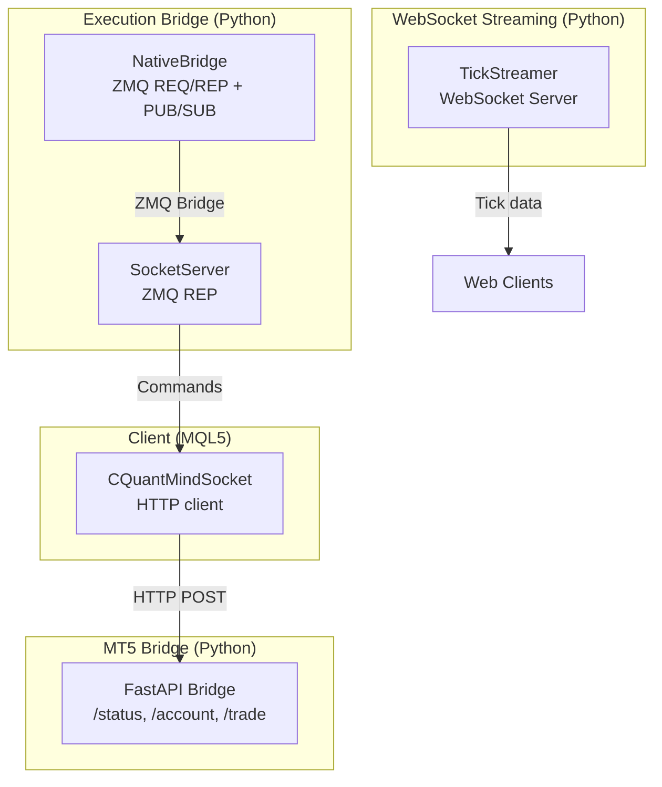
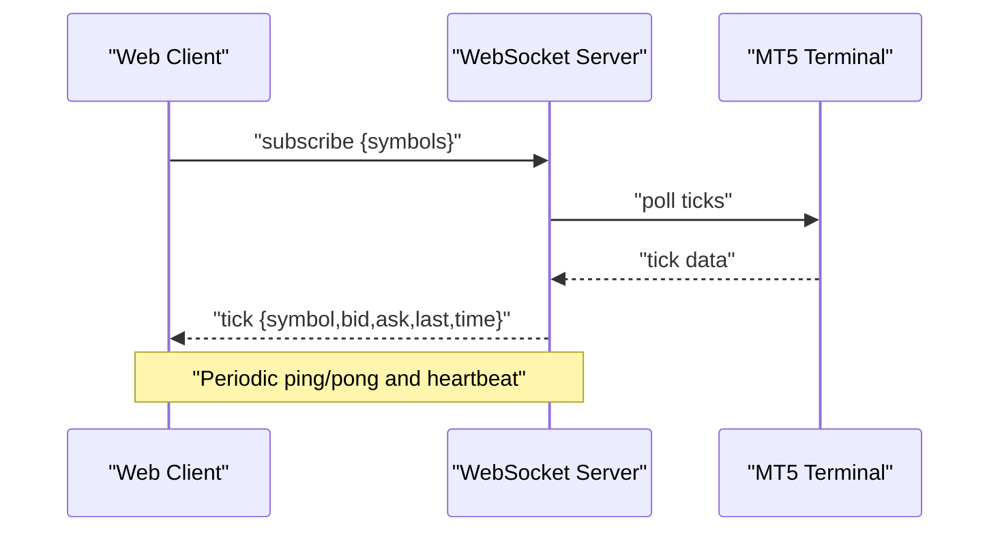
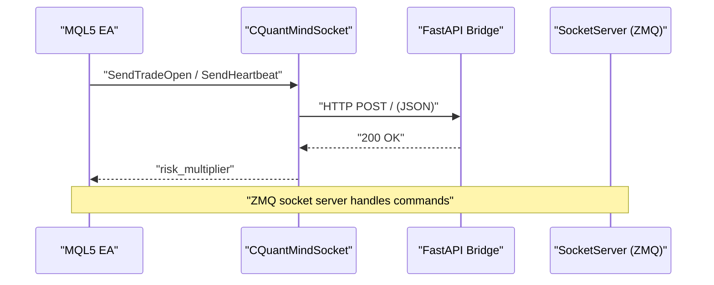
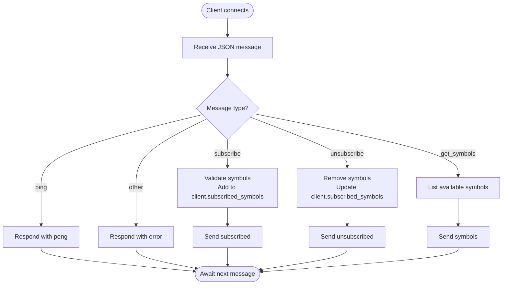
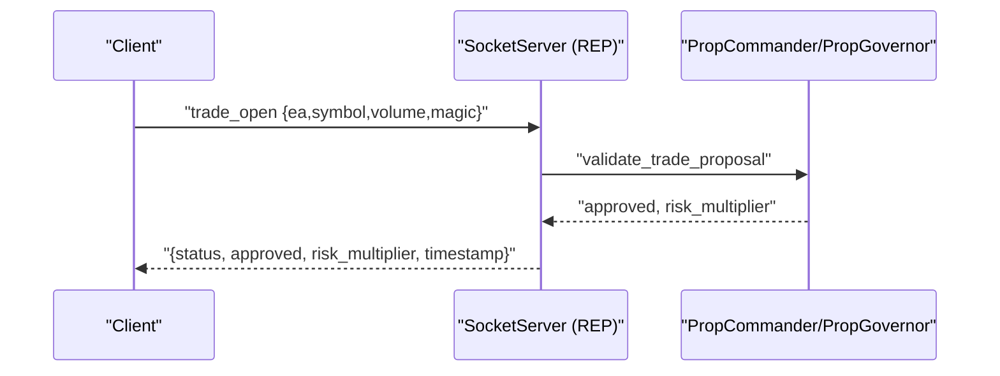
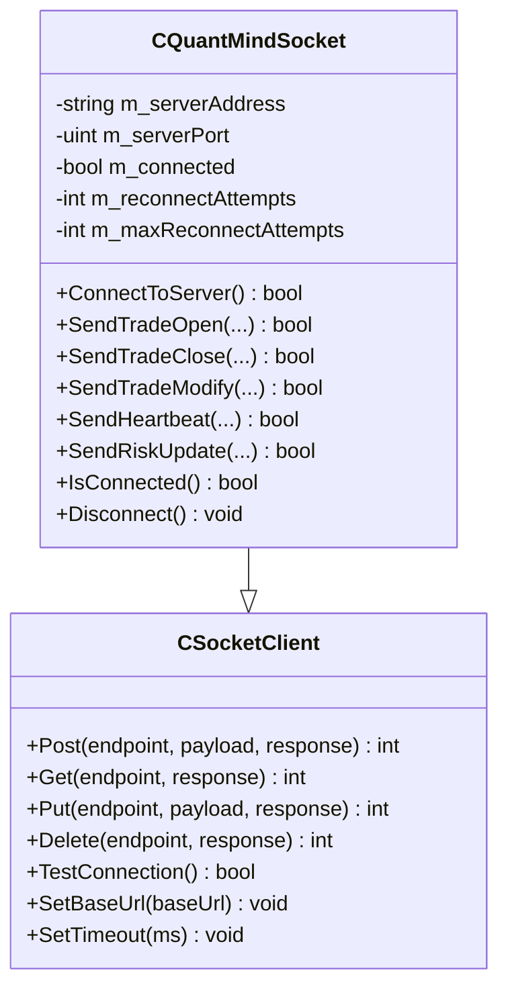
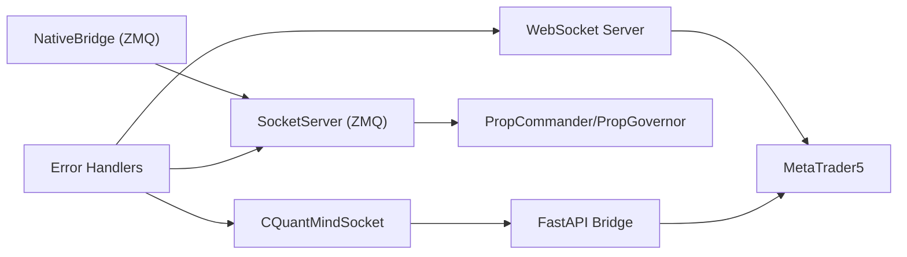

# WebSocket Protocols

<cite>
**Referenced Files in This Document**
- [socket_server.py](file://src/router/socket_server.py)
- [Sockets.mqh](file://src/mql5/Include/QuantMind/Utils/Sockets.mqh)
- [streaming.py](file://mcp-metatrader5-server/src/mcp_mt5/streaming.py)
- [interface.py](file://src/router/interface.py)
- [server.py](file://mt5-bridge/server.py)
- [state.py](file://src/router/state.py)
- [error_handlers.py](file://src/error_handlers.py)
- [test_websocket_stream_stability.py](file://tests/load/test_websocket_stream_stability.py)
- [deployment_guide.md](file://docs/v8/deployment_guide.md)
- [brokers.yaml](file://config/brokers.yaml)
</cite>

## Table of Contents
1. [Introduction](#introduction)
2. [Project Structure](#project-structure)
3. [Core Components](#core-components)
4. [Architecture Overview](#architecture-overview)
5. [Detailed Component Analysis](#detailed-component-analysis)
6. [Dependency Analysis](#dependency-analysis)
7. [Performance Considerations](#performance-considerations)
8. [Troubleshooting Guide](#troubleshooting-guide)
9. [Conclusion](#conclusion)
10. [Appendices](#appendices)

## Introduction
This document specifies the WebSocket protocols and real-time communication infrastructure for QUANTMIND-X. It covers:
- Connection establishment and lifecycle for WebSocket-based market data streaming
- Message framing and event-driven interaction patterns for high-frequency trading data
- Socket server implementation for ZeroMQ bridge communication and execution command protocols
- Message format specifications, binary data handling, and state management for persistent connections
- Client-side WebSocket implementation, connection handling, and real-time data processing patterns
- Error recovery mechanisms, connection resilience, and performance optimization techniques

The system integrates:
- A WebSocket-based tick streaming service for live market data
- A ZeroMQ-based socket server for sub-5ms execution command latency
- An MQL5 socket client for sub-5ms latency communication with the Python ZMQ socket server
- A FastAPI bridge for MT5 REST endpoints

## Project Structure
The WebSocket and real-time communication stack spans several modules:
- WebSocket tick streaming service (Python)
- ZeroMQ socket server (Python) for execution commands
- MQL5 socket client (MQL5) for execution commands
- FastAPI bridge (Python) for MT5 REST operations
- Shared state and error handling utilities

**Diagram sources**
- [streaming.py](file://mcp-metatrader5-server/src/mcp_mt5/streaming.py#L123-L197)
- [socket_server.py](file://src/router/socket_server.py#L37-L110)
- [interface.py](file://src/router/interface.py#L18-L41)
- [Sockets.mqh](file://src/mql5/Include/QuantMind/Utils/Sockets.mqh#L427-L497)
- [server.py](file://mt5-bridge/server.py#L1-L96)

**Section sources**
- [streaming.py](file://mcp-metatrader5-server/src/mcp_mt5/streaming.py#L1-L120)
- [socket_server.py](file://src/router/socket_server.py#L1-L65)
- [Sockets.mqh](file://src/mql5/Include/QuantMind/Utils/Sockets.mqh#L420-L497)
- [server.py](file://mt5-bridge/server.py#L1-L30)
- [deployment_guide.md](file://docs/v8/deployment_guide.md#L266-L294)

## Core Components
- WebSocket TickStreamer: Asynchronous WebSocket server broadcasting live tick data with subscription management, heartbeat, and rate limiting.
- SocketServer (ZMQ): Request-reply socket server handling execution commands (trade open/close/modify), heartbeat, and risk update events with sub-5ms latency targets.
- CQuantMindSocket (MQL5): Optimized HTTP client for execution commands and heartbeat with connection persistence and retry logic.
- NativeBridge (ZMQ): Low-latency bridge between Python and MT5 using REQ/REP for commands and PUB/SUB for tick ingestion.
- FastAPI MT5 Bridge: REST endpoints for MT5 status, account info, and trade execution.
- RouterState: Shared state container for regime, bots, risk mandate, and last tick time.
- Error handlers: Circuit breaker, retry, and fallback mechanisms for resilience.

**Section sources**
- [streaming.py](file://mcp-metatrader5-server/src/mcp_mt5/streaming.py#L123-L212)
- [socket_server.py](file://src/router/socket_server.py#L37-L121)
- [Sockets.mqh](file://src/mql5/Include/QuantMind/Utils/Sockets.mqh#L427-L497)
- [interface.py](file://src/router/interface.py#L18-L80)
- [server.py](file://mt5-bridge/server.py#L1-L96)
- [state.py](file://src/router/state.py#L8-L34)
- [error_handlers.py](file://src/error_handlers.py#L284-L383)

## Architecture Overview
The WebSocket and execution infrastructure supports:
- Real-time tick streaming via WebSocket with multi-symbol subscriptions and heartbeats
- Sub-5ms execution command latency via ZMQ REP socket server
- Persistent HTTP-based client for execution commands with retry and fallback
- Optional MT5 REST bridge for operational controls

**Diagram sources**
- [streaming.py](file://mcp-metatrader5-server/src/mcp_mt5/streaming.py#L213-L275)
- [streaming.py](file://mcp-metatrader5-server/src/mcp_mt5/streaming.py#L329-L391)

**Diagram sources**
- [Sockets.mqh](file://src/mql5/Include/QuantMind/Utils/Sockets.mqh#L509-L642)
- [server.py](file://mt5-bridge/server.py#L57-L90)
- [socket_server.py](file://src/router/socket_server.py#L160-L184)

## Detailed Component Analysis

### WebSocket Tick Streaming Protocol
- Protocol: JSON over WebSocket
- Roles:
  - Client: subscribes/unsubscribes to symbols, requests symbols list, pings
  - Server: broadcasts ticks, confirms subscriptions, sends heartbeats, reports errors
- Message Types:
  - Client -> Server: subscribe, unsubscribe, get_symbols, ping
  - Server -> Client: tick, subscribed, unsubscribed, symbols, pong, error, heartbeat
- Framing: Text frames containing JSON objects
- State Management:
  - Per-client subscription sets
  - Connection timestamps and message counts
  - Heartbeat loop and rate limiting
- Resilience:
  - Max clients enforcement
  - ConnectionClosed handling
  - Graceful degradation on errors

**Diagram sources**
- [streaming.py](file://mcp-metatrader5-server/src/mcp_mt5/streaming.py#L240-L275)
- [streaming.py](file://mcp-metatrader5-server/src/mcp_mt5/streaming.py#L276-L327)

**Section sources**
- [streaming.py](file://mcp-metatrader5-server/src/mcp_mt5/streaming.py#L123-L212)
- [streaming.py](file://mcp-metatrader5-server/src/mcp_mt5/streaming.py#L213-L275)
- [streaming.py](file://mcp-metatrader5-server/src/mcp_mt5/streaming.py#L329-L391)

### ZeroMQ Socket Server for Execution Commands
- Protocol: JSON over ZMQ REP socket
- Roles:
  - Clients: send trade open/close/modify, heartbeat, risk update
  - Server: validates proposals, responds with approval and risk multiplier, logs events
- Message Types:
  - trade_open, trade_close, trade_modify, heartbeat, risk_update
- Framing: Text frames containing UTF-8 JSON
- State Management:
  - Connection registry keyed by EA name and magic
  - Message counters and latency tracking
- Resilience:
  - Non-blocking receive with timeouts
  - Error logging and graceful degradation

**Diagram sources**
- [socket_server.py](file://src/router/socket_server.py#L150-L184)
- [socket_server.py](file://src/router/socket_server.py#L186-L223)

**Section sources**
- [socket_server.py](file://src/router/socket_server.py#L28-L65)
- [socket_server.py](file://src/router/socket_server.py#L150-L184)
- [socket_server.py](file://src/router/socket_server.py#L186-L325)

### MQL5 Execution Client (HTTP-based)
- Protocol: HTTP POST to FastAPI bridge for trade operations; JSON payloads for execution commands
- Roles:
  - Client: Connects, sends trade events, heartbeats, parses risk multiplier
  - Server: Validates token, executes orders via MT5
- Message Types:
  - trade_open, trade_close, trade_modify, heartbeat, risk_update (via HTTP)
- Framing: JSON in HTTP body
- State Management:
  - Connection state, reconnect attempts, base URL configuration
- Resilience:
  - Connection testing, error parsing, fallbacks

**Diagram sources**
- [Sockets.mqh](file://src/mql5/Include/QuantMind/Utils/Sockets.mqh#L36-L340)
- [Sockets.mqh](file://src/mql5/Include/QuantMind/Utils/Sockets.mqh#L427-L742)

**Section sources**
- [Sockets.mqh](file://src/mql5/Include/QuantMind/Utils/Sockets.mqh#L427-L497)
- [Sockets.mqh](file://src/mql5/Include/QuantMind/Utils/Sockets.mqh#L509-L642)
- [Sockets.mqh](file://src/mql5/Include/QuantMind/Utils/Sockets.mqh#L644-L742)

### MT5 Bridge (FastAPI)
- Protocol: REST over HTTP
- Endpoints:
  - GET /status: Terminal status and connectivity
  - GET /account: Account info
  - POST /trade: Execute buy/sell orders
- Authentication: X-Token header
- Resilience:
  - Startup MT5 initialization
  - Error handling with HTTP exceptions

**Section sources**
- [server.py](file://mt5-bridge/server.py#L21-L25)
- [server.py](file://mt5-bridge/server.py#L37-L56)
- [server.py](file://mt5-bridge/server.py#L57-L90)

### ZeroMQ Bridge (NativeBridge)
- Protocol: ZMQ REQ/REP for commands, ZMQ PUB/SUB for data
- Ports:
  - Command port (default 5555)
  - Data port (default 5556)
- Operations:
  - send_command: Non-blocking JSON dispatch
  - get_latest_tick: Non-blocking poll for latest tick
- Simulation Mode:
  - Operates without pyzmq installed

**Section sources**
- [interface.py](file://src/router/interface.py#L18-L41)
- [interface.py](file://src/router/interface.py#L43-L72)

### Router State Management
- Purpose: Central shared state for regime, active bots, risk mandate, last tick time
- Implementation: In-memory dictionary (future Redis integration)

**Section sources**
- [state.py](file://src/router/state.py#L8-L34)

## Dependency Analysis
- WebSocket streaming depends on websockets and MetaTrader5 for tick retrieval
- Socket server depends on pyzmq for low-latency command handling
- MQL5 client depends on FastAPI bridge for trade execution
- NativeBridge depends on pyzmq for MT5 integration
- Error handlers provide cross-cutting resilience across components

**Diagram sources**
- [streaming.py](file://mcp-metatrader5-server/src/mcp_mt5/streaming.py#L32-L32)
- [socket_server.py](file://src/router/socket_server.py#L357-L392)
- [Sockets.mqh](file://src/mql5/Include/QuantMind/Utils/Sockets.mqh#L509-L642)
- [server.py](file://mt5-bridge/server.py#L57-L90)
- [interface.py](file://src/router/interface.py#L18-L41)
- [error_handlers.py](file://src/error_handlers.py#L284-L383)

**Section sources**
- [streaming.py](file://mcp-metatrader5-server/src/mcp_mt5/streaming.py#L1-L35)
- [socket_server.py](file://src/router/socket_server.py#L14-L25)
- [Sockets.mqh](file://src/mql5/Include/QuantMind/Utils/Sockets.mqh#L11-L14)
- [server.py](file://mt5-bridge/server.py#L1-L6)
- [interface.py](file://src/router/interface.py#L11-L14)
- [error_handlers.py](file://src/error_handlers.py#L284-L383)

## Performance Considerations
- WebSocket tick streaming:
  - Poll interval configurable (default 100 ms)
  - Heartbeat interval configurable (default 30 sec)
  - Max clients and symbols per client limits
  - Tick change deduplication to reduce bandwidth
- Socket server:
  - Asynchronous processing with asyncio
  - Non-blocking ZMQ operations
  - Latency tracking and warnings for high latency (>5 ms)
- MQL5 client:
  - Optimized JSON formatting and persistent connection patterns
  - Retry attempts with backoff
- MT5 bridge:
  - Token-authenticated endpoints
  - Immediate feedback on order submission

[No sources needed since this section provides general guidance]

## Troubleshooting Guide
- WebSocket streaming:
  - Max clients reached: server rejects new connections
  - Unknown message type: server responds with error
  - Invalid JSON: server responds with error
- Socket server:
  - Missing message type or invalid type: error response
  - High latency warnings: review processing logic and resource utilization
- MQL5 client:
  - URL not allowed: configure allowed URLs in MT5 options
  - WebRequest function denied: enable in Expert Advisor settings
  - Connection failures: retry attempts with max configured
- MT5 bridge:
  - Invalid token: 401 Unauthorized
  - Symbol not found: 404 Not Found
  - Order failed: 400 Bad Request with comment
- Resilience:
  - Circuit breaker opens after repeated failures
  - Database error handler with exponential backoff
  - MQL5 bridge fallback to degraded mode

**Section sources**
- [streaming.py](file://mcp-metatrader5-server/src/mcp_mt5/streaming.py#L213-L275)
- [socket_server.py](file://src/router/socket_server.py#L150-L184)
- [Sockets.mqh](file://src/mql5/Include/QuantMind/Utils/Sockets.mqh#L319-L339)
- [server.py](file://mt5-bridge/server.py#L22-L25)
- [server.py](file://mt5-bridge/server.py#L63-L89)
- [error_handlers.py](file://src/error_handlers.py#L284-L383)
- [error_handlers.py](file://src/error_handlers.py#L16-L86)

## Conclusion
QUANTMIND-X provides a robust, event-driven real-time communication infrastructure:
- WebSocket streaming delivers multi-symbol tick data with subscription management and heartbeats
- ZMQ-based execution commands achieve sub-5ms latency for trade operations
- MQL5 HTTP client ensures resilient execution with retry and fallback
- Shared state and error handling utilities enhance reliability and observability
- The FastAPI bridge enables operational controls for MT5 terminals

[No sources needed since this section summarizes without analyzing specific files]

## Appendices

### Message Format Specifications
- WebSocket (Text frames):
  - Client -> Server: subscribe, unsubscribe, get_symbols, ping
  - Server -> Client: tick, subscribed, unsubscribed, symbols, pong, error, heartbeat
- ZMQ (Text frames, UTF-8 JSON):
  - trade_open, trade_close, trade_modify, heartbeat, risk_update
- HTTP (JSON body):
  - POST /trade: symbol, action_type, volume, stop_loss, take_profit

**Section sources**
- [streaming.py](file://mcp-metatrader5-server/src/mcp_mt5/streaming.py#L54-L71)
- [socket_server.py](file://src/router/socket_server.py#L28-L35)
- [server.py](file://mt5-bridge/server.py#L14-L20)

### Binary Data Handling
- WebSocket: JSON text frames; no binary frames used in the referenced code
- ZMQ: UTF-8 JSON text frames
- MQL5 HTTP: JSON string payloads

**Section sources**
- [streaming.py](file://mcp-metatrader5-server/src/mcp_mt5/streaming.py#L363-L366)
- [socket_server.py](file://src/router/socket_server.py#L132-L146)
- [Sockets.mqh](file://src/mql5/Include/QuantMind/Utils/Sockets.mqh#L517-L520)

### Client-Side Implementation Examples
- WebSocket client: subscribe to symbols, handle tick messages, ping/pong, and errors
- MQL5 client: connect, send trade events, parse risk multiplier, disconnect gracefully
- Load tests demonstrate stability, reconnection, and cache freshness under load

**Section sources**
- [streaming.py](file://mcp-metatrader5-server/src/mcp_mt5/streaming.py#L240-L275)
- [Sockets.mqh](file://src/mql5/Include/QuantMind/Utils/Sockets.mqh#L509-L642)
- [test_websocket_stream_stability.py](file://tests/load/test_websocket_stream_stability.py#L96-L224)

### Broker Configuration
- Broker types: mt5_mock, mt5_socket, binance_spot, binance_futures
- Socket bridge configuration for MT5 accounts via VPS
- Environment variable substitution for sensitive values

**Section sources**
- [brokers.yaml](file://config/brokers.yaml#L8-L116)