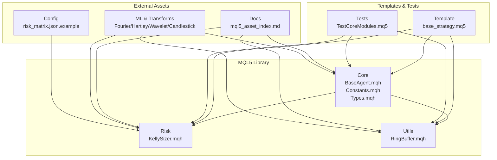
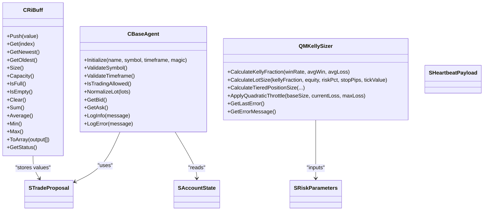
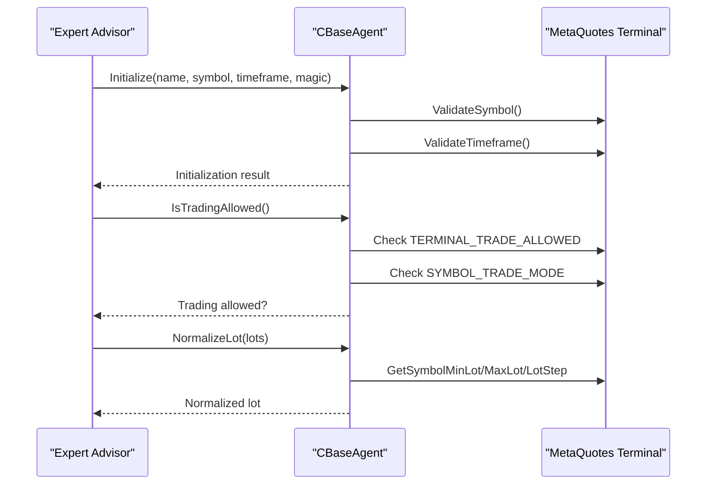
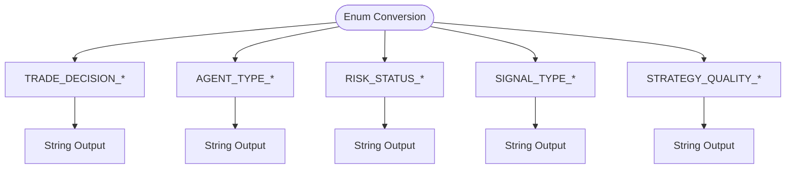
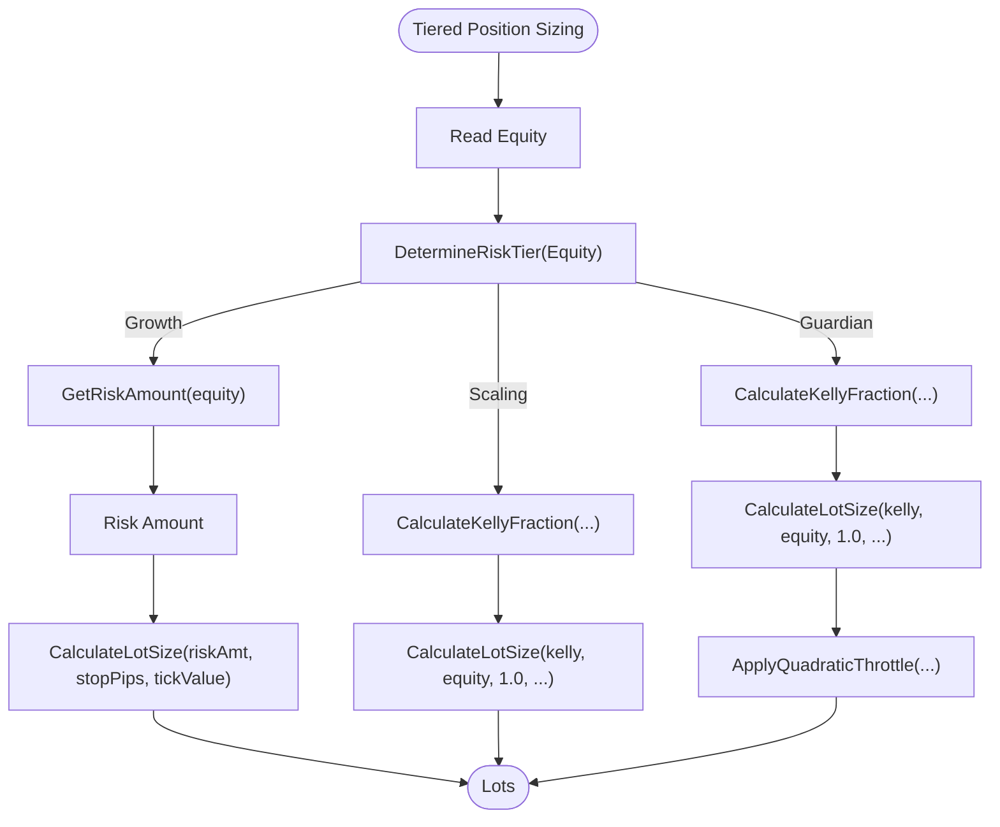
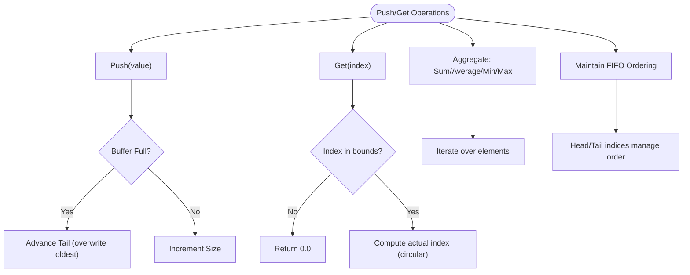
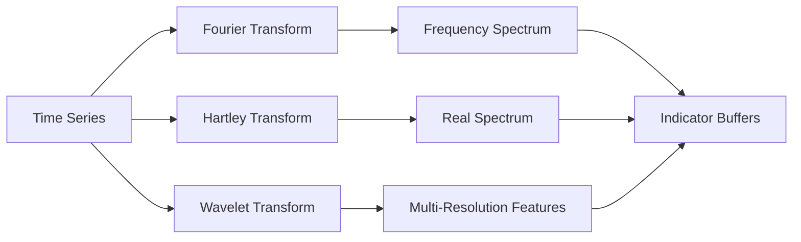
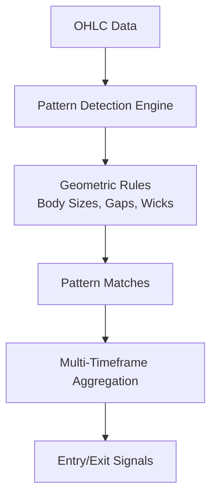
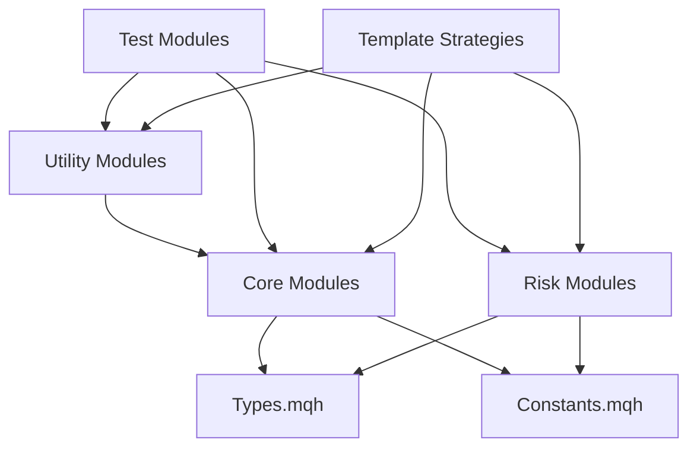

# Advanced Indicator Development

<cite>
**Referenced Files in This Document**
- [mql5_asset_index.md](file://docs/knowledge/mql5_asset_index.md)
- [BaseAgent.mqh](file://src/mql5/Include/QuantMind/Core/BaseAgent.mqh)
- [Types.mqh](file://src/mql5/Include/QuantMind/Core/Types.mqh)
- [Constants.mqh](file://src/mql5/Include/QuantMind/Core/Constants.mqh)
- [KellySizer.mqh](file://src/mql5/Include/QuantMind/Risk/KellySizer.mqh)
- [RingBuffer.mqh](file://src/mql5/Include/QuantMind/Utils/RingBuffer.mqh)
- [TestCoreModules.mq5](file://src/mql5/Experts/TestCoreModules.mq5)
- [base_strategy.mq5](file://data/assets/templates/base_strategy.mq5)
- [risk_matrix.json.example](file://extensions/mql5_library/risk_matrix.json.example)
- [mql5_wizard_fourier_transform.md](file://data/scraped_articles/expert_advisors/mql5_wizard_techniques_you_should_know__part_06___fourier_transform.md)
- [discrete_hartley_transform.md](file://data/scraped_articles/trading/discrete_hartley_transform.md)
- [neural_networks_in_trading_wavelet_attention.md](file://data/scraped_articles/trading_systems/neural_networks_in_trading__models_using_wavelet_transform_and_multi-task_attention.md)
- [candlestick_programming.md](file://data/scraped_articles/trading/from_novice_to_expert__programming_candlesticks.md)
- [pattern_analyzer_updates.md](file://data/scraped_articles/trading_systems/studying_candlestick_analysis_techniques__part_iv___updates_and_additions_to_pattern_analyzer.md)
- [python_candlestick_engine.md](file://data/scraped_articles/integration/price_action_analysis_toolkit_development__part_31___python_candlestick_recognition_engine__i____man.md)
- [ml_activation_functions.md](file://data/scraped_articles/trading/creating_an_ea_that_works_automatically__part_14___automation__vi.md)
</cite>

## Table of Contents
1. [Introduction](#introduction)
2. [Project Structure](#project-structure)
3. [Core Components](#core-components)
4. [Architecture Overview](#architecture-overview)
5. [Detailed Component Analysis](#detailed-component-analysis)
6. [Dependency Analysis](#dependency-analysis)
7. [Performance Considerations](#performance-considerations)
8. [Troubleshooting Guide](#troubleshooting-guide)
9. [Conclusion](#conclusion)
10. [Appendices](#appendices)

## Introduction
This document provides advanced guidance for indicator development in MQL5 within the QuantMindX ecosystem. It covers:
- The MQL5 asset index system and modular architecture
- Building custom indicators and technical analysis libraries
- Advanced optimization techniques for indicators
- Mathematical transforms, pattern recognition, and machine learning integration
- Asset management for strategies, indicators, and libraries
- Advanced GUI development using CCanvas-like primitives and interactive chart elements
- Performance optimization, memory management, and multi-timeframe analysis
- Architectural patterns for reusable, modular, and extensible quantitative applications

## Project Structure
The repository organizes MQL5 components into a modular library with clear separation of concerns:
- Core modules for base agent functionality, constants, and shared types
- Risk modules for position sizing and risk management
- Utilities for high-performance data structures and communication
- Templates and tests for rapid prototyping and validation
- Extensive documentation and knowledge assets for advanced techniques

**Diagram sources**
- [mql5_asset_index.md](file://docs/knowledge/mql5_asset_index.md#L27-L43)
- [BaseAgent.mqh](file://src/mql5/Include/QuantMind/Core/BaseAgent.mqh#L27-L444)
- [Types.mqh](file://src/mql5/Include/QuantMind/Core/Types.mqh#L18-L362)
- [Constants.mqh](file://src/mql5/Include/QuantMind/Core/Constants.mqh#L115-L151)
- [KellySizer.mqh](file://src/mql5/Include/QuantMind/Risk/KellySizer.mqh#L71-L533)
- [RingBuffer.mqh](file://src/mql5/Include/QuantMind/Utils/RingBuffer.mqh#L35-L347)
- [base_strategy.mq5](file://data/assets/templates/base_strategy.mq5#L1-L45)
- [TestCoreModules.mq5](file://src/mql5/Experts/TestCoreModules.mq5#L15-L186)
- [risk_matrix.json.example](file://extensions/mql5_library/risk_matrix.json.example#L1-L23)

**Section sources**
- [mql5_asset_index.md](file://docs/knowledge/mql5_asset_index.md#L27-L43)
- [base_strategy.mq5](file://data/assets/templates/base_strategy.mq5#L1-L45)
- [TestCoreModules.mq5](file://src/mql5/Experts/TestCoreModules.mq5#L35-L186)

## Core Components
This section documents the foundational modules that enable advanced indicator development and asset management.

- BaseAgent.mqh
  - Provides initialization, validation, logging, and common utilities for agents
  - Supports symbol/timeframe management, trading permission checks, and lot normalization
  - Enables structured logging with rate limiting and standardized error reporting
  - Path: [BaseAgent.mqh](file://src/mql5/Include/QuantMind/Core/BaseAgent.mqh#L27-L444)

- Types.mqh
  - Defines shared enumerations and structures for trade proposals, account states, risk parameters, positions, orders, heartbeats, performance metrics, tasks, market conditions, news events, ring buffer elements, and JSON parse results
  - Includes conversion utilities for enums to strings and strategy quality mapping
  - Path: [Types.mqh](file://src/mql5/Include/QuantMind/Core/Types.mqh#L18-L362)

- Constants.mqh
  - Centralizes system-wide constants for risk management, magic number ranges, communication, and performance thresholds
  - Used across modules for consistent behavior and configuration
  - Path: [Constants.mqh](file://src/mql5/Include/QuantMind/Core/Constants.mqh#L115-L151)

- KellySizer.mqh
  - Implements Kelly criterion position sizing with a three-tier risk engine (Growth/Scaling/Guardian)
  - Provides tier determination, dynamic risk calculation, and quadratic throttle for Guardian tier
  - Path: [KellySizer.mqh](file://src/mql5/Include/QuantMind/Risk/KellySizer.mqh#L71-L533)

- RingBuffer.mqh
  - Offers O(1) circular buffer for efficient time-series data and indicator computations
  - Supports push/get, aggregation operations, and deterministic memory allocation
  - Path: [RingBuffer.mqh](file://src/mql5/Include/QuantMind/Utils/RingBuffer.mqh#L35-L347)

- TestCoreModules.mq5
  - Demonstrates compilation and runtime validation of core modules
  - Exercises structures, enums, conversions, and utility macros
  - Path: [TestCoreModules.mq5](file://src/mql5/Experts/TestCoreModules.mq5#L35-L186)

- Template Strategy (base_strategy.mq5)
  - Minimal template for expert advisors with input parameters and lifecycle hooks
  - Serves as a starting point for building custom indicators and strategies
  - Path: [base_strategy.mq5](file://data/assets/templates/base_strategy.mq5#L1-L45)

- Risk Matrix (risk_matrix.json.example)
  - Example JSON structure for risk multipliers per symbol
  - Used by risk clients to synchronize risk parameters
  - Path: [risk_matrix.json.example](file://extensions/mql5_library/risk_matrix.json.example#L1-L23)

**Section sources**
- [BaseAgent.mqh](file://src/mql5/Include/QuantMind/Core/BaseAgent.mqh#L27-L444)
- [Types.mqh](file://src/mql5/Include/QuantMind/Core/Types.mqh#L18-L362)
- [Constants.mqh](file://src/mql5/Include/QuantMind/Core/Constants.mqh#L115-L151)
- [KellySizer.mqh](file://src/mql5/Include/QuantMind/Risk/KellySizer.mqh#L71-L533)
- [RingBuffer.mqh](file://src/mql5/Include/QuantMind/Utils/RingBuffer.mqh#L35-L347)
- [TestCoreModules.mq5](file://src/mql5/Experts/TestCoreModules.mq5#L35-L186)
- [base_strategy.mq5](file://data/assets/templates/base_strategy.mq5#L1-L45)
- [risk_matrix.json.example](file://extensions/mql5_library/risk_matrix.json.example#L1-L23)

## Architecture Overview
The QuantMind Standard Library (QSL) follows a modular, component-based architecture:
- Each module encapsulates a single responsibility and communicates via well-defined interfaces
- The EA strategy coordinates modules without tight coupling
- Utilities like RingBuffer and JSON helpers provide high-performance primitives
- Risk management integrates with external Python services via heartbeat and risk matrix synchronization

**Diagram sources**
- [BaseAgent.mqh](file://src/mql5/Include/QuantMind/Core/BaseAgent.mqh#L27-L444)
- [KellySizer.mqh](file://src/mql5/Include/QuantMind/Risk/KellySizer.mqh#L71-L533)
- [RingBuffer.mqh](file://src/mql5/Include/QuantMind/Utils/RingBuffer.mqh#L35-L347)
- [Types.mqh](file://src/mql5/Include/QuantMind/Core/Types.mqh#L86-L220)

## Detailed Component Analysis

### BaseAgent: Foundation for Modular EAs
- Responsibilities: initialization, validation, logging, symbol/timeframe management, trading permissions, lot normalization, market data access
- Best practices: centralize logging with rate limiting, validate inputs early, normalize quantities before trading
- Integration points: used by all strategies and modules to ensure consistent behavior

**Diagram sources**
- [BaseAgent.mqh](file://src/mql5/Include/QuantMind/Core/BaseAgent.mqh#L70-L444)

**Section sources**
- [BaseAgent.mqh](file://src/mql5/Include/QuantMind/Core/BaseAgent.mqh#L27-L444)

### Types: Shared Data Contracts
- Enumerations: trade decisions, agent types, risk/account statuses, signal types, strategy quality
- Structures: trade proposals, account states, risk parameters, positions/orders, heartbeats, performance metrics, tasks, market conditions, news events, ring buffer elements, JSON parse results
- Utilities: enum-to-string converters and strategy quality mapping

**Diagram sources**
- [Types.mqh](file://src/mql5/Include/QuantMind/Core/Types.mqh#L22-L80)
- [Types.mqh](file://src/mql5/Include/QuantMind/Core/Types.mqh#L278-L362)

**Section sources**
- [Types.mqh](file://src/mql5/Include/QuantMind/Core/Types.mqh#L18-L362)

### Constants: System-Wide Configuration
- Risk management constants (daily limits, thresholds, max risk per trade)
- Magic number ranges for agent families
- Communication constants (host, port, heartbeat intervals)
- Performance thresholds (latency caps)
- Ring buffer sizes and utility macros

**Section sources**
- [Constants.mqh](file://src/mql5/Include/QuantMind/Core/Constants.mqh#L115-L151)

### KellySizer: Adaptive Position Sizing
- Three-tier risk engine:
  - Growth: dynamic aggressive risk with hard floor
  - Scaling: Kelly percentage-based sizing
  - Guardian: Kelly + quadratic throttle for drawdown protection
- Inputs: equity, stop loss in pips, tick value, current loss/max loss, win rate, average win/loss
- Outputs: optimized lot size with safety caps

**Diagram sources**
- [KellySizer.mqh](file://src/mql5/Include/QuantMind/Risk/KellySizer.mqh#L149-L472)

**Section sources**
- [KellySizer.mqh](file://src/mql5/Include/QuantMind/Risk/KellySizer.mqh#L71-L533)

### RingBuffer: High-Performance Time-Series
- O(1) push/get operations with circular buffer mechanics
- Supports aggregation (sum, average, min, max) and deterministic memory allocation
- Ideal for moving averages, volatility measures, and indicator pipelines

**Diagram sources**
- [RingBuffer.mqh](file://src/mql5/Include/QuantMind/Utils/RingBuffer.mqh#L77-L347)

**Section sources**
- [RingBuffer.mqh](file://src/mql5/Include/QuantMind/Utils/RingBuffer.mqh#L35-L347)

### Template Strategy: Minimal EA Skeleton
- Demonstrates input parameters, lifecycle hooks, and basic conditional logic
- Serves as a foundation for integrating custom indicators and strategies

**Section sources**
- [base_strategy.mq5](file://data/assets/templates/base_strategy.mq5#L1-L45)

### Risk Matrix: External Risk Synchronization
- JSON-based risk multipliers per symbol
- Used by risk clients to fetch and validate risk parameters
- Supports fallback mechanisms and freshness checks

**Section sources**
- [risk_matrix.json.example](file://extensions/mql5_library/risk_matrix.json.example#L1-L23)

### Advanced Indicator Techniques and Integration

#### Mathematical Transforms
- Fourier Transform: decompose time series into frequency components for spectral analysis
- Hartley Transform: real-valued transform alternative to Fourier
- Wavelet Transform: multi-resolution analysis suitable for non-stationary signals
- Integration guidance: leverage convolutional layers and static wavelets for feature extraction

**Diagram sources**
- [mql5_wizard_fourier_transform.md](file://data/scraped_articles/expert_advisors/mql5_wizard_techniques_you_should_know__part_06___fourier_transform.md#L1-L22)
- [discrete_hartley_transform.md](file://data/scraped_articles/trading/discrete_hartley_transform.md#L1-L23)
- [neural_networks_in_trading_wavelet_attention.md](file://data/scraped_articles/trading_systems/neural_networks_in_trading__models_using_wavelet_transform_and_multi-task_attention.md#L48-L48)

**Section sources**
- [mql5_wizard_fourier_transform.md](file://data/scraped_articles/expert_advisors/mql5_wizard_techniques_you_should_know__part_06___fourier_transform.md#L1-L22)
- [discrete_hartley_transform.md](file://data/scraped_articles/trading/discrete_hartley_transform.md#L1-L23)
- [neural_networks_in_trading_wavelet_attention.md](file://data/scraped_articles/trading_systems/neural_networks_in_trading__models_using_wavelet_transform_and_multi-task_attention.md#L48-L48)

#### Pattern Recognition and Candlestick Programming
- Programmatic detection of candlestick patterns with precise geometric rules
- Multi-timeframe pattern scanning and result aggregation
- Integration with Python engines for enhanced recognition and backtesting

**Diagram sources**
- [candlestick_programming.md](file://data/scraped_articles/trading/from_novice_to_expert__programming_candlesticks.md#L22-L32)
- [pattern_analyzer_updates.md](file://data/scraped_articles/trading_systems/studying_candlestick_analysis_techniques__part_iv___updates_and_additions_to_pattern_analyzer.md#L1205-L1222)
- [python_candlestick_engine.md](file://data/scraped_articles/integration/price_action_analysis_toolkit_development__part_31___python_candlestick_recognition_engine__i____man.md#L183-L203)

**Section sources**
- [candlestick_programming.md](file://data/scraped_articles/trading/from_novice_to_expert__programming_candlesticks.md#L22-L32)
- [pattern_analyzer_updates.md](file://data/scraped_articles/trading_systems/studying_candlestick_analysis_techniques__part_iv___updates_and_additions_to_pattern_analyzer.md#L1205-L1222)
- [python_candlestick_engine.md](file://data/scraped_articles/integration/price_action_analysis_toolkit_development__part_31___python_candlestick_recognition_engine__i____man.md#L183-L203)

#### Machine Learning Integration
- Activation functions and neural network fundamentals
- Multi-layer perceptrons and backpropagation training
- Integration with Strategy Tester for optimization workflows

**Section sources**
- [ml_activation_functions.md](file://data/scraped_articles/trading/creating_an_ea_that_works_automatically__part_14___automation__vi.md#L465-L469)

## Dependency Analysis
The modular design minimizes coupling and maximizes cohesion:
- Core depends on Types and Constants
- Risk depends on Types and Constants
- Utilities depend on Core for shared constants
- Templates and tests import all modules to validate compilation and runtime behavior

**Diagram sources**
- [mql5_asset_index.md](file://docs/knowledge/mql5_asset_index.md#L27-L43)
- [BaseAgent.mqh](file://src/mql5/Include/QuantMind/Core/BaseAgent.mqh#L27-L444)
- [Types.mqh](file://src/mql5/Include/QuantMind/Core/Types.mqh#L18-L362)
- [Constants.mqh](file://src/mql5/Include/QuantMind/Core/Constants.mqh#L115-L151)
- [KellySizer.mqh](file://src/mql5/Include/QuantMind/Risk/KellySizer.mqh#L71-L533)
- [RingBuffer.mqh](file://src/mql5/Include/QuantMind/Utils/RingBuffer.mqh#L35-L347)
- [TestCoreModules.mq5](file://src/mql5/Experts/TestCoreModules.mq5#L15-L186)
- [base_strategy.mq5](file://data/assets/templates/base_strategy.mq5#L1-L45)

**Section sources**
- [mql5_asset_index.md](file://docs/knowledge/mql5_asset_index.md#L27-L43)
- [TestCoreModules.mq5](file://src/mql5/Experts/TestCoreModules.mq5#L35-L186)

## Performance Considerations
- Prefer O(1) operations for real-time workloads (RingBuffer)
- Cache frequently accessed values (symbol info, account state)
- Minimize file I/O; use GlobalVariables or lightweight JSON for risk synchronization
- Use rate-limited logging to reduce overhead
- Clamp and normalize inputs to avoid invalid states
- Leverage multi-timeframe analysis with ring buffers for moving averages and volatility measures

[No sources needed since this section provides general guidance]

## Troubleshooting Guide
- Initialization failures: verify symbol/timeframe validation and trading permissions
- Risk-related issues: check risk multipliers and heartbeat synchronization
- Position sizing anomalies: inspect Kelly fraction inputs and tier boundaries
- Buffer overflows: ensure capacity sizing and FIFO semantics
- Logging and error codes: use BaseAgent logging and KellySizer error getters

**Section sources**
- [BaseAgent.mqh](file://src/mql5/Include/QuantMind/Core/BaseAgent.mqh#L70-L444)
- [KellySizer.mqh](file://src/mql5/Include/QuantMind/Risk/KellySizer.mqh#L481-L510)
- [RingBuffer.mqh](file://src/mql5/Include/QuantMind/Utils/RingBuffer.mqh#L315-L331)

## Conclusion
The QuantMindX MQL5 asset index system provides a robust, modular foundation for advanced indicator development. By leveraging the BaseAgent, Types, Constants, KellySizer, and RingBuffer modules, developers can build sophisticated technical analysis libraries, integrate mathematical transforms and pattern recognition, and implement machine learning workflows. The architecture emphasizes performance, maintainability, and scalability, enabling reusable components and multi-timeframe analysis essential for modern quantitative trading.

[No sources needed since this section summarizes without analyzing specific files]

## Appendices

### Best Practices Checklist
- Use BaseAgent for initialization and validation
- Define clear structures via Types for inter-module contracts
- Configure Constants centrally for risk and performance
- Implement position sizing with KellySizer tiers
- Employ RingBuffer for efficient indicator computations
- Keep templates minimal and extensible
- Synchronize risk via risk_matrix.json.example patterns

**Section sources**
- [BaseAgent.mqh](file://src/mql5/Include/QuantMind/Core/BaseAgent.mqh#L27-L444)
- [Types.mqh](file://src/mql5/Include/QuantMind/Core/Types.mqh#L18-L362)
- [Constants.mqh](file://src/mql5/Include/QuantMind/Core/Constants.mqh#L115-L151)
- [KellySizer.mqh](file://src/mql5/Include/QuantMind/Risk/KellySizer.mqh#L71-L533)
- [RingBuffer.mqh](file://src/mql5/Include/QuantMind/Utils/RingBuffer.mqh#L35-L347)
- [base_strategy.mq5](file://data/assets/templates/base_strategy.mq5#L1-L45)
- [risk_matrix.json.example](file://extensions/mql5_library/risk_matrix.json.example#L1-L23)