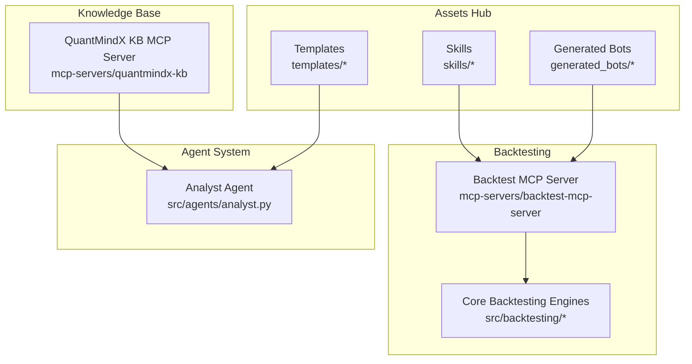
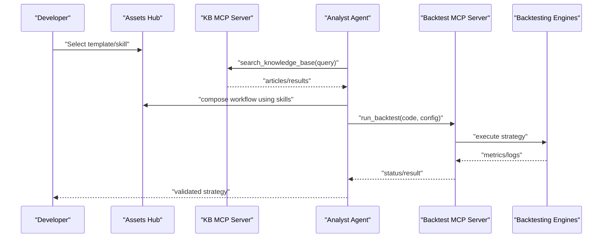
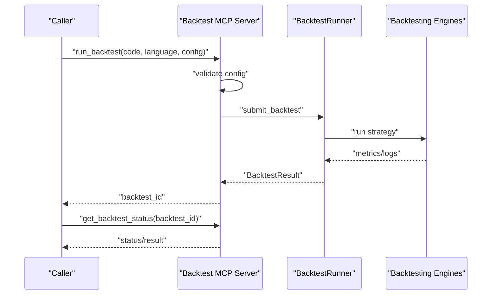
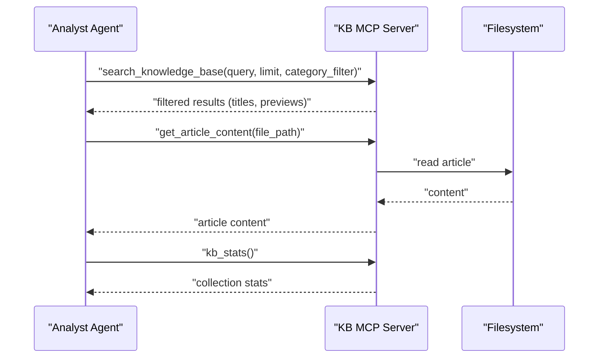
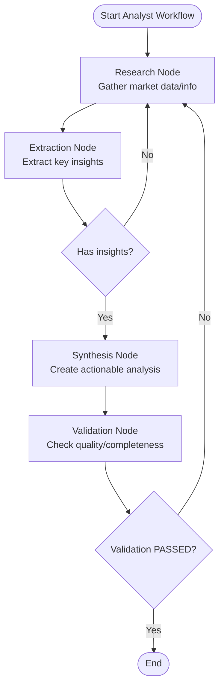
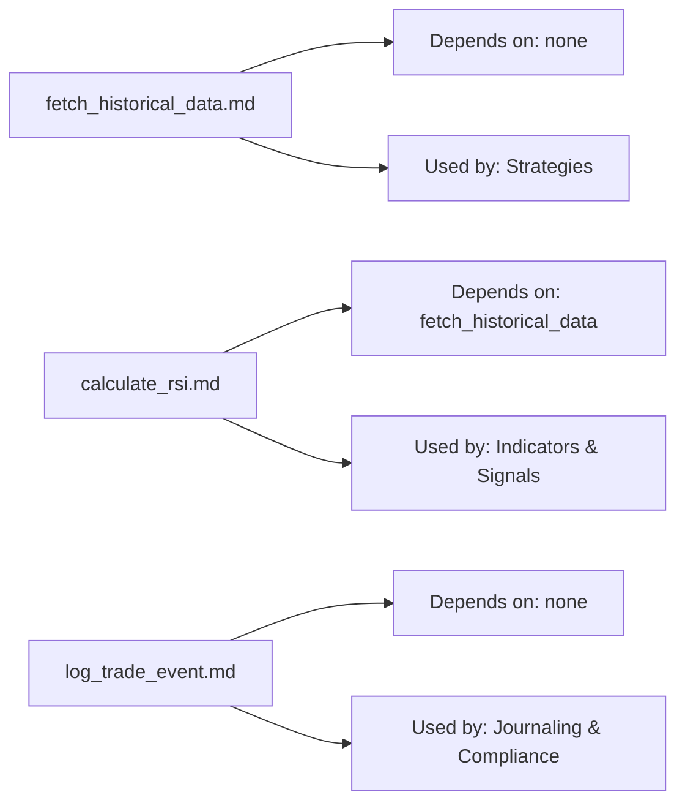
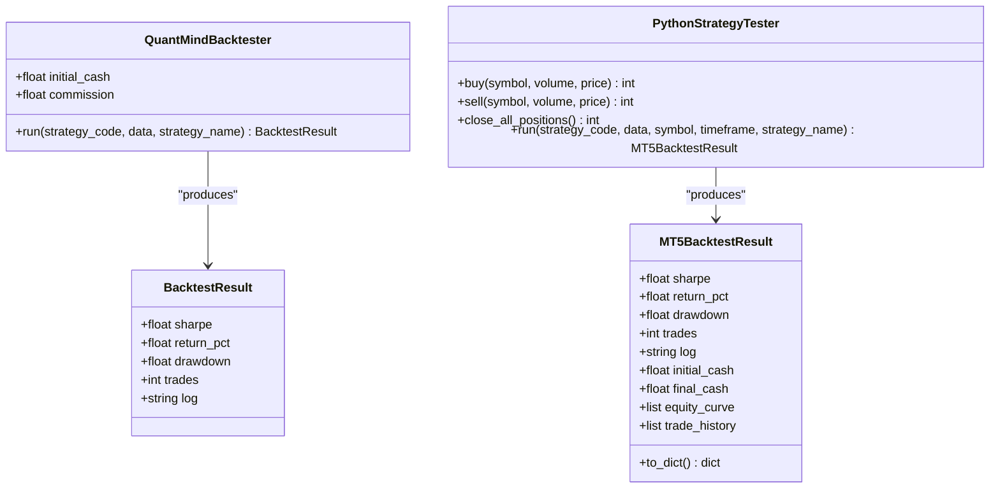
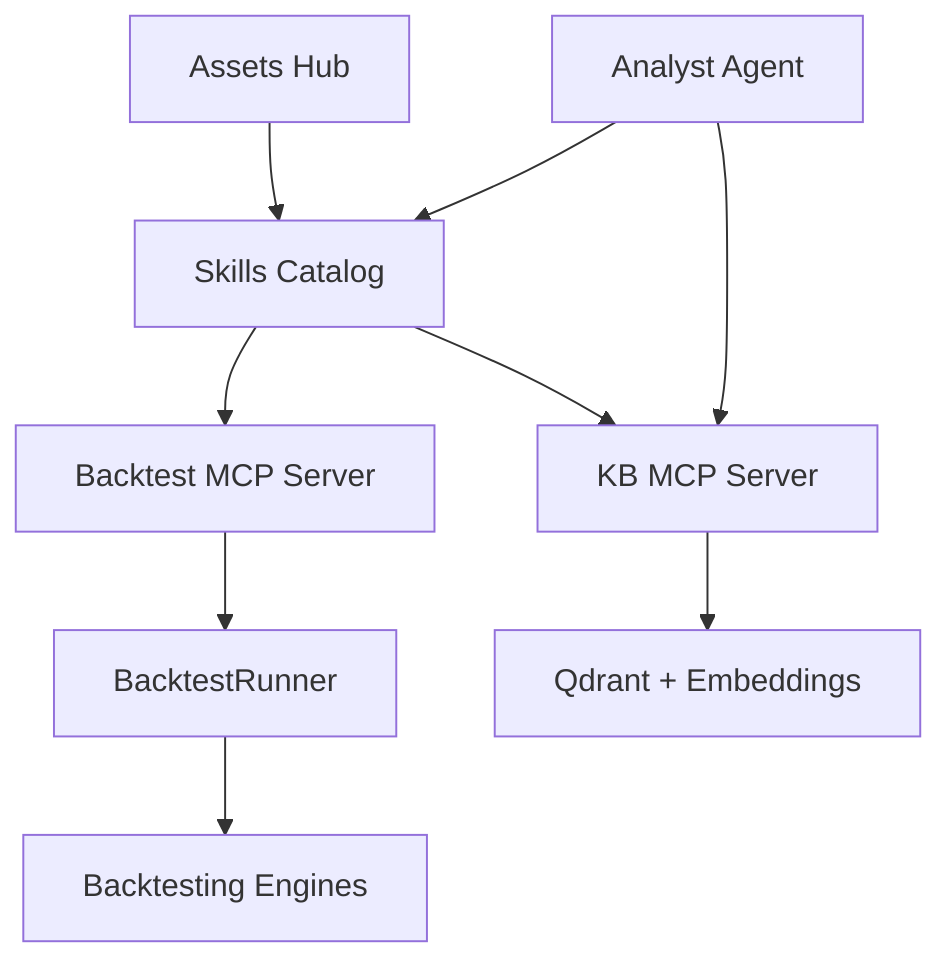

# Asset Lifecycle Management

<cite>
**Referenced Files in This Document**
- [run_backtest.yaml](file://data/assets/skills/run_backtest.yaml)
- [README.md](file://data/git/assets-hub/README.md)
- [main.py](file://mcp-servers/backtest-mcp-server/main.py)
- [backtest_runner.py](file://mcp-servers/backtest-mcp-server/backtest_runner.py)
- [server.py](file://mcp-servers/quantmindx-kb/server.py)
- [core_engine.py](file://src/backtesting/core_engine.py)
- [mt5_engine.py](file://src/backtesting/mt5_engine.py)
- [analyst.py](file://src/agents/analyst.py)
- [calculate_rsi.md](file://data/git/assets-hub/skills/trading_skills/calculate_rsi.md)
- [log_trade_event.md](file://data/git/assets-hub/skills/system_skills/log_trade_event.md)
- [fetch_historical_data.md](file://data/git/assets-hub/skills/data_skills/fetch_historical_data.md)
</cite>

## Table of Contents
1. [Introduction](#introduction)
2. [Project Structure](#project-structure)
3. [Core Components](#core-components)
4. [Architecture Overview](#architecture-overview)
5. [Detailed Component Analysis](#detailed-component-analysis)
6. [Dependency Analysis](#dependency-analysis)
7. [Performance Considerations](#performance-considerations)
8. [Troubleshooting Guide](#troubleshooting-guide)
9. [Conclusion](#conclusion)
10. [Appendices](#appendices)

## Introduction
This document describes the complete asset lifecycle management process within QuantMind. It covers the stages from initial asset creation through testing, validation, deployment, and maintenance. It explains the backtest execution system using run_backtest.yaml configurations, how assets are validated before deployment, and how the knowledge base integrates with the asset ecosystem for discovery and retrieval. It also documents workflows for asset modification, version control, and backward compatibility, and outlines the relationship between the asset lifecycle and the AI agent system, including how assets are selected and utilized during strategy development and execution phases. Finally, it details quality assurance processes and automated testing procedures that ensure asset reliability.

## Project Structure
QuantMind organizes assets and skills in a Git-backed hub, with dedicated MCP servers for backtesting and knowledge base access. Backtesting engines reside in the core application, while agents orchestrate strategy development and execution. The knowledge base provides semantic search over MQL5 articles and related content.

**Diagram sources**
- [README.md](file://data/git/assets-hub/README.md#L1-L42)
- [main.py](file://mcp-servers/backtest-mcp-server/main.py#L1-L362)
- [backtest_runner.py](file://mcp-servers/backtest-mcp-server/backtest_runner.py#L1-L603)
- [server.py](file://mcp-servers/quantmindx-kb/server.py#L1-L189)
- [core_engine.py](file://src/backtesting/core_engine.py#L1-L83)
- [mt5_engine.py](file://src/backtesting/mt5_engine.py#L1-L991)
- [analyst.py](file://src/agents/analyst.py#L1-L288)

**Section sources**
- [README.md](file://data/git/assets-hub/README.md#L1-L42)
- [main.py](file://mcp-servers/backtest-mcp-server/main.py#L1-L362)
- [server.py](file://mcp-servers/quantmindx-kb/server.py#L1-L189)
- [core_engine.py](file://src/backtesting/core_engine.py#L1-L83)
- [mt5_engine.py](file://src/backtesting/mt5_engine.py#L1-L991)
- [analyst.py](file://src/agents/analyst.py#L1-L288)

## Core Components
- Assets Hub: Stores templates and skills, with commit-driven versioning and standardized commit messages for backtest results.
- Backtest MCP Server: Exposes run_backtest and get_backtest_status tools with configuration validation and status tracking.
- Backtest Engines: Core and MT5 engines for Python strategy execution and MQL5-style simulation.
- Knowledge Base MCP Server: Provides semantic search over MQL5 articles and content retrieval.
- Agent System: Analyst agent orchestrating research, extraction, synthesis, and validation for strategy development.

**Section sources**
- [README.md](file://data/git/assets-hub/README.md#L1-L42)
- [main.py](file://mcp-servers/backtest-mcp-server/main.py#L1-L362)
- [backtest_runner.py](file://mcp-servers/backtest-mcp-server/backtest_runner.py#L1-L603)
- [server.py](file://mcp-servers/quantmindx-kb/server.py#L1-L189)
- [core_engine.py](file://src/backtesting/core_engine.py#L1-L83)
- [mt5_engine.py](file://src/backtesting/mt5_engine.py#L1-L991)
- [analyst.py](file://src/agents/analyst.py#L1-L288)

## Architecture Overview
The asset lifecycle integrates skills and templates from the Assets Hub with backtesting and knowledge base services. Agents leverage the knowledge base to discover relevant content, then use skills to compute indicators and fetch data. Backtests validate strategies, and results inform deployment and maintenance.

**Diagram sources**
- [README.md](file://data/git/assets-hub/README.md#L1-L42)
- [server.py](file://mcp-servers/quantmindx-kb/server.py#L1-L189)
- [analyst.py](file://src/agents/analyst.py#L1-L288)
- [main.py](file://mcp-servers/backtest-mcp-server/main.py#L1-L362)
- [backtest_runner.py](file://mcp-servers/backtest-mcp-server/backtest_runner.py#L1-L603)
- [core_engine.py](file://src/backtesting/core_engine.py#L1-L83)
- [mt5_engine.py](file://src/backtesting/mt5_engine.py#L1-L991)

## Detailed Component Analysis

### Backtest Execution System (run_backtest.yaml)
The run_backtest.yaml defines a skill for executing backtests. It specifies inputs (strategy code, symbol, timeframe) and outputs (performance metrics and logs). The Backtest MCP Server exposes run_backtest and get_backtest_status, validating configuration and returning structured results.

**Diagram sources**
- [run_backtest.yaml](file://data/assets/skills/run_backtest.yaml#L1-L18)
- [main.py](file://mcp-servers/backtest-mcp-server/main.py#L85-L256)
- [backtest_runner.py](file://mcp-servers/backtest-mcp-server/backtest_runner.py#L84-L223)
- [core_engine.py](file://src/backtesting/core_engine.py#L18-L83)
- [mt5_engine.py](file://src/backtesting/mt5_engine.py#L695-L782)

**Section sources**
- [run_backtest.yaml](file://data/assets/skills/run_backtest.yaml#L1-L18)
- [main.py](file://mcp-servers/backtest-mcp-server/main.py#L85-L256)
- [backtest_runner.py](file://mcp-servers/backtest-mcp-server/backtest_runner.py#L84-L223)
- [core_engine.py](file://src/backtesting/core_engine.py#L18-L83)
- [mt5_engine.py](file://src/backtesting/mt5_engine.py#L695-L782)

### Knowledge Base Integration (Asset Discovery and Retrieval)
The KB MCP Server provides semantic search over MQL5 articles, enabling agents to discover relevant content for strategy development. It supports querying, filtering by category, retrieving article content, and reporting statistics.

**Diagram sources**
- [server.py](file://mcp-servers/quantmindx-kb/server.py#L101-L174)

**Section sources**
- [server.py](file://mcp-servers/quantmindx-kb/server.py#L101-L174)

### Agent-Driven Strategy Development and Selection
The Analyst agent orchestrates a research-extraction-synthesis-validation workflow. It leverages the knowledge base for discovery and uses skills (e.g., fetch_historical_data, calculate_rsi, log_trade_event) to construct and validate strategies.

**Diagram sources**
- [analyst.py](file://src/agents/analyst.py#L24-L136)

**Section sources**
- [analyst.py](file://src/agents/analyst.py#L24-L136)

### Skills Catalog and Backward Compatibility
Skills define reusable capabilities with explicit schemas and dependencies. The Assets Hub README documents structure and commit message formats, supporting version control and traceability. Skills like fetch_historical_data, calculate_rsi, and log_trade_event enable modular composition and backward-compatible evolution.

**Diagram sources**
- [README.md](file://data/git/assets-hub/README.md#L1-L42)
- [fetch_historical_data.md](file://data/git/assets-hub/skills/data_skills/fetch_historical_data.md#L1-L206)
- [calculate_rsi.md](file://data/git/assets-hub/skills/trading_skills/calculate_rsi.md#L1-L141)
- [log_trade_event.md](file://data/git/assets-hub/skills/system_skills/log_trade_event.md#L1-L161)

**Section sources**
- [README.md](file://data/git/assets-hub/README.md#L1-L42)
- [fetch_historical_data.md](file://data/git/assets-hub/skills/data_skills/fetch_historical_data.md#L1-L206)
- [calculate_rsi.md](file://data/git/assets-hub/skills/trading_skills/calculate_rsi.md#L1-L141)
- [log_trade_event.md](file://data/git/assets-hub/skills/system_skills/log_trade_event.md#L1-L161)

### Backtesting Engines and Validation
Two engines coexist:
- Core engine: Dynamic strategy execution with analyzers for Sharpe, drawdown, returns, and trades.
- MT5 engine: Python-based tester simulating MQL5 built-ins, integrating with MT5 data where available, and calculating metrics.

Both enforce validation via configuration parsing and runtime checks, and both produce structured results suitable for deployment decisions.

**Diagram sources**
- [core_engine.py](file://src/backtesting/core_engine.py#L8-L83)
- [mt5_engine.py](file://src/backtesting/mt5_engine.py#L89-L118)
- [mt5_engine.py](file://src/backtesting/mt5_engine.py#L320-L782)

**Section sources**
- [core_engine.py](file://src/backtesting/core_engine.py#L1-L83)
- [mt5_engine.py](file://src/backtesting/mt5_engine.py#L1-L991)

## Dependency Analysis
- Assets Hub depends on Git for versioning and standardized commit messages.
- Backtest MCP Server depends on BacktestRunner and configuration models; it validates inputs and routes to queue/runner.
- Backtest Engines depend on external libraries (Backtrader, NumPy, Pandas) and optionally MT5.
- KB MCP Server depends on Qdrant and sentence transformers for embeddings and search.
- Agent System depends on LangGraph for workflow orchestration and integrates with KB and skills.

**Diagram sources**
- [README.md](file://data/git/assets-hub/README.md#L1-L42)
- [main.py](file://mcp-servers/backtest-mcp-server/main.py#L1-L362)
- [backtest_runner.py](file://mcp-servers/backtest-mcp-server/backtest_runner.py#L1-L603)
- [server.py](file://mcp-servers/quantmindx-kb/server.py#L1-L189)
- [analyst.py](file://src/agents/analyst.py#L1-L288)

**Section sources**
- [README.md](file://data/git/assets-hub/README.md#L1-L42)
- [main.py](file://mcp-servers/backtest-mcp-server/main.py#L1-L362)
- [backtest_runner.py](file://mcp-servers/backtest-mcp-server/backtest_runner.py#L1-L603)
- [server.py](file://mcp-servers/quantmindx-kb/server.py#L1-L189)
- [analyst.py](file://src/agents/analyst.py#L1-L288)

## Performance Considerations
- Backtest MCP Server enforces configuration validation and categorizes errors for faster diagnosis.
- BacktestRunner caches data and uses vectorized operations for metric extraction to improve throughput.
- KB MCP Server filters duplicates and limits results to optimize latency.
- Engines support parallel execution targets and optimized data loading.

[No sources needed since this section provides general guidance]

## Troubleshooting Guide
Common issues and resolutions:
- Backtest configuration errors: Validate symbol, timeframe, date range, and numeric bounds; ensure language is supported.
- Syntax/runtime errors: Catch and classify errors; return structured messages with logs for debugging.
- Data availability: Verify sufficient historical data points; handle insufficient data gracefully.
- KB search failures: Confirm embedding model installation and collection existence; check file paths for content retrieval.

**Section sources**
- [main.py](file://mcp-servers/backtest-mcp-server/main.py#L138-L181)
- [backtest_runner.py](file://mcp-servers/backtest-mcp-server/backtest_runner.py#L123-L206)
- [server.py](file://mcp-servers/quantmindx-kb/server.py#L105-L174)

## Conclusion
QuantMind’s asset lifecycle integrates a Git-backed Assets Hub, MCP-based backtesting and knowledge services, and an agent-driven development workflow. Assets are versioned, validated, and tested rigorously before deployment, with the knowledge base enabling informed selection and reuse of skills. Engines provide reliable, structured results, while agents orchestrate discovery and validation to maintain quality and backward compatibility.

[No sources needed since this section summarizes without analyzing specific files]

## Appendices

### Asset Lifecycle Stages
- Creation: Templates and skills authored in the Assets Hub.
- Composition: Agents assemble skills and knowledge for strategy construction.
- Testing: Backtests executed via run_backtest with validated configuration.
- Validation: Results evaluated for metrics and logs; errors classified and surfaced.
- Deployment: Strategies deployed after passing validation and QA gates.
- Maintenance: Iterative updates with version control and retesting; backward compatibility maintained through schema and dependency management.

**Section sources**
- [README.md](file://data/git/assets-hub/README.md#L1-L42)
- [run_backtest.yaml](file://data/assets/skills/run_backtest.yaml#L1-L18)
- [main.py](file://mcp-servers/backtest-mcp-server/main.py#L85-L256)
- [backtest_runner.py](file://mcp-servers/backtest-mcp-server/backtest_runner.py#L84-L223)
- [analyst.py](file://src/agents/analyst.py#L1-L288)