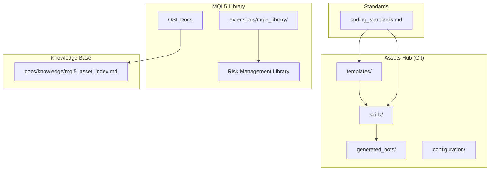
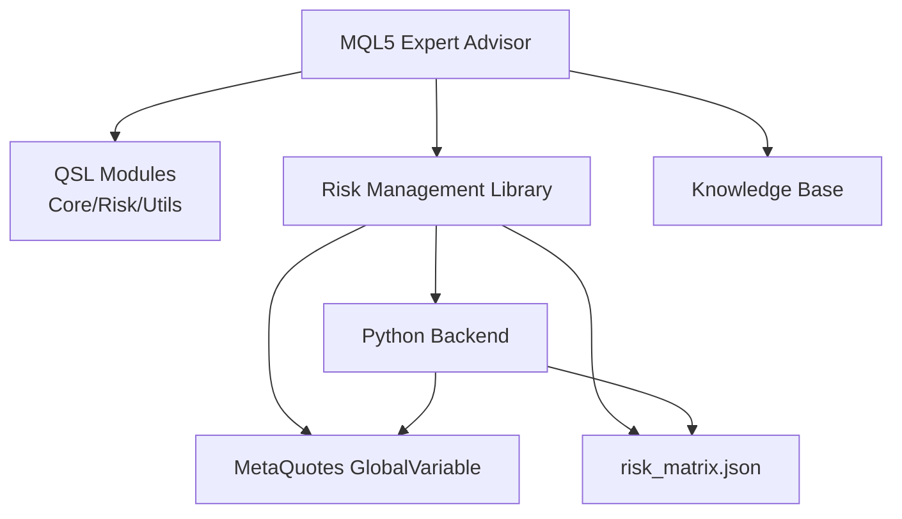
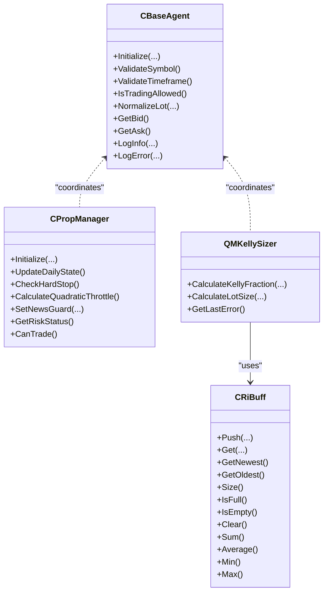
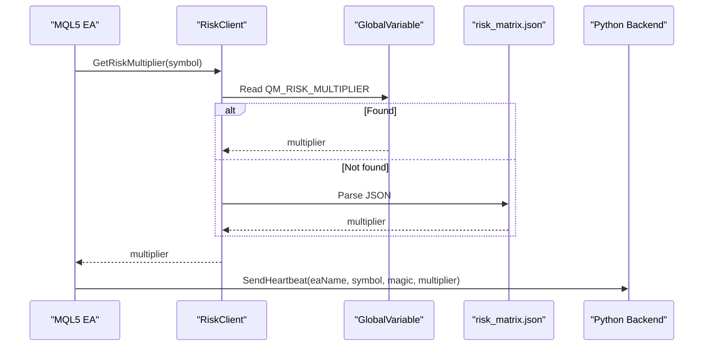
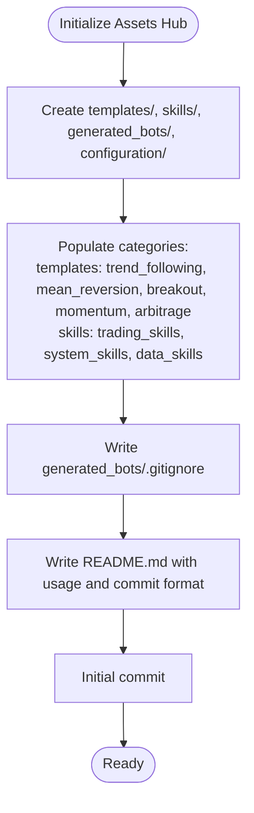
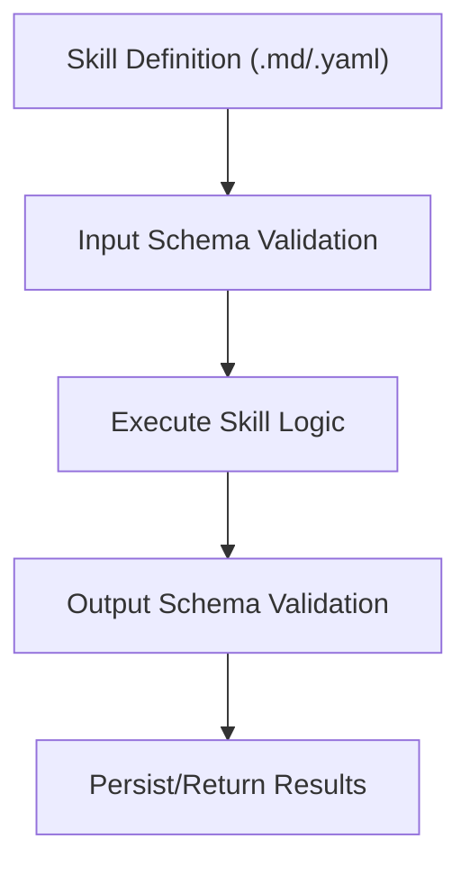
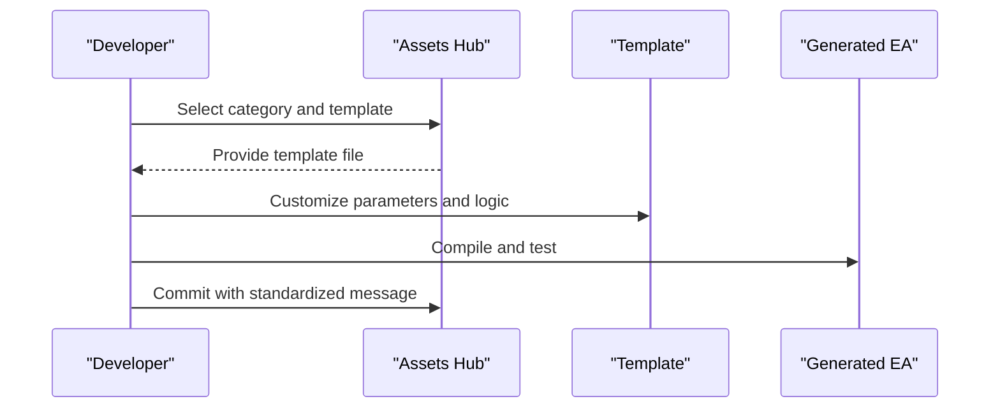
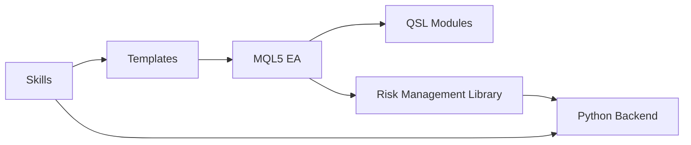

# Asset Management System

<cite>
**Referenced Files in This Document**
- [coding_standards.md](file://data/assets/coding_standards.md)
- [base_strategy.mq5](file://data/assets/templates/base_strategy.mq5)
- [run_backtest.yaml](file://data/assets/skills/run_backtest.yaml)
- [README.md](file://extensions/mql5_library/README.md)
- [mql5_asset_index.md](file://docs/knowledge/mql5_asset_index.md)
- [init_git_assets_hub.py](file://scripts/init_git_assets_hub.py)
- [assets-hub README.md](file://data/git/assets-hub/README.md)
- [calculate_position_size.md](file://data/git/assets-hub/skills/trading_skills/calculate_position_size.md)
- [log_trade_event.md](file://data/git/assets-hub/skills/system_skills/log_trade_event.md)
- [fetch_historical_data.md](file://data/git/assets-hub/skills/data_skills/fetch_historical_data.md)
</cite>

## Table of Contents
1. [Introduction](#introduction)
2. [Project Structure](#project-structure)
3. [Core Components](#core-components)
4. [Architecture Overview](#architecture-overview)
5. [Detailed Component Analysis](#detailed-component-analysis)
6. [Dependency Analysis](#dependency-analysis)
7. [Performance Considerations](#performance-considerations)
8. [Troubleshooting Guide](#troubleshooting-guide)
9. [Conclusion](#conclusion)
10. [Appendices](#appendices)

## Introduction
This document describes the MQL5 asset management system within QuantMind. It covers the asset index structure for strategies, indicators, and reusable components; the skill-based asset system for organizing trading strategies, technical indicators, and custom libraries; the template management system for base strategies, expert advisors, and indicator frameworks; coding standards and best practices; examples of asset creation, modification, and deployment; and the integration of assets with the broader QuantMind ecosystem, including the knowledge base and AI agents. It also documents the asset lifecycle from development to production deployment, including testing, validation, and distribution mechanisms.

## Project Structure
The asset management system spans several areas:
- MQL5 Standard Library (QSL) assets under the knowledge base documentation
- MQL5 library extension with risk management and integration utilities
- Git-backed Assets Hub for templates and skills
- Coding standards for MQL5 and Python assets
- Skill definitions for backtesting, indicators, and operational tasks

**Diagram sources**
- [assets-hub README.md](file://data/git/assets-hub/README.md#L1-L42)
- [README.md](file://extensions/mql5_library/README.md#L1-L297)
- [mql5_asset_index.md](file://docs/knowledge/mql5_asset_index.md#L1-L800)
- [coding_standards.md](file://data/assets/coding_standards.md#L1-L16)

**Section sources**
- [assets-hub README.md](file://data/git/assets-hub/README.md#L1-L42)
- [README.md](file://extensions/mql5_library/README.md#L1-L297)
- [mql5_asset_index.md](file://docs/knowledge/mql5_asset_index.md#L1-L800)
- [coding_standards.md](file://data/assets/coding_standards.md#L1-L16)

## Core Components
- MQL5 Standard Library (QSL) asset index: A modular, production-ready MQL5 library with core, risk, and utility modules. It defines constants, types, and reusable components for building Expert Advisors.
- Risk Management Library: Bridges Python risk governance with MQL5 execution via GlobalVariable fast-path and JSON file fallback, plus heartbeat monitoring.
- Assets Hub: Git-managed repository for templates and skills, with categories for strategies, system operations, and data processing.
- Coding Standards: Enforces strict compilation, risk management, input parameters, and Python backtesting guidelines.

**Section sources**
- [mql5_asset_index.md](file://docs/knowledge/mql5_asset_index.md#L27-L44)
- [README.md](file://extensions/mql5_library/README.md#L84-L143)
- [coding_standards.md](file://data/assets/coding_standards.md#L8-L16)
- [assets-hub README.md](file://data/git/assets-hub/README.md#L1-L42)

## Architecture Overview
The asset management system integrates MQL5 Expert Advisors with Python-based risk governance and skills. The MQL5 library reads risk multipliers from GlobalVariable (fast path) or a JSON file (fallback), sends heartbeats to the Python backend, and coordinates with the QSL modules for risk, position sizing, and utilities.

**Diagram sources**
- [README.md](file://extensions/mql5_library/README.md#L84-L143)
- [mql5_asset_index.md](file://docs/knowledge/mql5_asset_index.md#L666-L709)

## Detailed Component Analysis

### MQL5 Standard Library (QSL) Asset Index
The QSL organizes trading logic into modular components:
- Core: BaseAgent, Constants, Types
- Risk: PropManager, RiskClient, KellySizer
- Utils: JSON, Sockets, RingBuffer

**Diagram sources**
- [mql5_asset_index.md](file://docs/knowledge/mql5_asset_index.md#L47-L271)

**Section sources**
- [mql5_asset_index.md](file://docs/knowledge/mql5_asset_index.md#L47-L271)

### Risk Management Library
The Risk Management Library synchronizes risk multipliers between Python and MQL5:
- Fast path: GlobalVariable set by Python agent
- Fallback path: risk_matrix.json in MQL5 Files directory
- Heartbeat: REST or persistent socket to Python backend
- Freshness: 1-hour staleness threshold

**Diagram sources**
- [README.md](file://extensions/mql5_library/README.md#L86-L127)
- [README.md](file://extensions/mql5_library/README.md#L179-L213)

**Section sources**
- [README.md](file://extensions/mql5_library/README.md#L84-L178)
- [README.md](file://extensions/mql5_library/README.md#L179-L292)

### Assets Hub: Templates and Skills
The Assets Hub provides:
- Templates: categorized by strategy families (e.g., trend_following, mean_reversion)
- Skills: trading, system, and data skills with structured YAML definitions and Python implementations
- Git client integration: script initializes repository structure and enforces commit message conventions

**Diagram sources**
- [init_git_assets_hub.py](file://scripts/init_git_assets_hub.py#L23-L169)
- [assets-hub README.md](file://data/git/assets-hub/README.md#L1-L42)

**Section sources**
- [init_git_assets_hub.py](file://scripts/init_git_assets_hub.py#L23-L169)
- [assets-hub README.md](file://data/git/assets-hub/README.md#L1-L42)

### Skill Definitions: Backtesting, Indicators, and Operations
Skills are defined with structured metadata, input/output schemas, and executable code:
- run_backtest.yaml: orchestrates backtesting with strategy code, symbol, and timeframe, returning performance metrics
- calculate_position_size.md: computes position size and risk exposure
- log_trade_event.md: records trade events to the journal
- fetch_historical_data.md: retrieves OHLCV data for backtesting

**Diagram sources**
- [run_backtest.yaml](file://data/assets/skills/run_backtest.yaml#L1-L18)
- [calculate_position_size.md](file://data/git/assets-hub/skills/trading_skills/calculate_position_size.md#L13-L65)
- [log_trade_event.md](file://data/git/assets-hub/skills/system_skills/log_trade_event.md#L13-L73)
- [fetch_historical_data.md](file://data/git/assets-hub/skills/data_skills/fetch_historical_data.md#L13-L83)

**Section sources**
- [run_backtest.yaml](file://data/assets/skills/run_backtest.yaml#L1-L18)
- [calculate_position_size.md](file://data/git/assets-hub/skills/trading_skills/calculate_position_size.md#L1-L126)
- [log_trade_event.md](file://data/git/assets-hub/skills/system_skills/log_trade_event.md#L1-L161)
- [fetch_historical_data.md](file://data/git/assets-hub/skills/data_skills/fetch_historical_data.md#L1-L206)

### Template Management System
Templates serve as scaffolding for strategies and indicators:
- base_strategy.mq5: minimal Expert Advisor with input parameters, trade object, and basic lifecycle hooks
- Assets Hub templates: organized by strategy families for reuse and versioning

**Diagram sources**
- [base_strategy.mq5](file://data/assets/templates/base_strategy.mq5#L1-L45)
- [assets-hub README.md](file://data/git/assets-hub/README.md#L31-L36)

**Section sources**
- [base_strategy.mq5](file://data/assets/templates/base_strategy.mq5#L1-L45)
- [assets-hub README.md](file://data/git/assets-hub/README.md#L7-L12)

### Coding Standards and Best Practices
- MQL5: strict compilation, mandatory SL/TP, input parameters only
- Python: type hints, docstrings, Backtrader for strategy logic, flexible data feeds
- Safety: no filesystem IO outside allowed directories, no external network calls except via MCP

**Section sources**
- [coding_standards.md](file://data/assets/coding_standards.md#L3-L16)

### Examples: Asset Creation, Modification, Deployment
- Creating a template: select category, copy base_strategy.mq5, customize inputs and logic, compile, test
- Modifying a skill: update YAML/Markdown definition, adjust Python implementation, validate schemas, commit with descriptive message
- Deploying assets: commit to Assets Hub, trigger backtesting via run_backtest skill, validate metrics, promote to production

**Section sources**
- [base_strategy.mq5](file://data/assets/templates/base_strategy.mq5#L11-L25)
- [run_backtest.yaml](file://data/assets/skills/run_backtest.yaml#L1-L18)
- [assets-hub README.md](file://data/git/assets-hub/README.md#L31-L41)

### Integration with the QuantMind Ecosystem
- Knowledge base: QSL documentation and indices inform EA design and module usage
- AI agents: skills encapsulate reusable operations (backtesting, data fetching, logging) for agent orchestration
- Risk governance: Python backend sets GlobalVariable or writes JSON for MQL5 consumption

**Section sources**
- [mql5_asset_index.md](file://docs/knowledge/mql5_asset_index.md#L666-L709)
- [README.md](file://extensions/mql5_library/README.md#L179-L213)

### Asset Lifecycle: Development to Production
- Development: create/edit templates and skills, adhere to coding standards
- Testing: unit tests for QSL modules, property-based tests for performance-critical components
- Validation: run_backtest skill to compute Sharpe, drawdown, and logs
- Distribution: commit to Assets Hub with standardized messages, publish artifacts

**Section sources**
- [mql5_asset_index.md](file://docs/knowledge/mql5_asset_index.md#L711-L737)
- [run_backtest.yaml](file://data/assets/skills/run_backtest.yaml#L13-L18)

## Dependency Analysis
The system exhibits layered dependencies:
- MQL5 EA depends on QSL modules and Risk Management Library
- Risk Management Library depends on Python backend for risk multipliers and heartbeat
- Assets Hub depends on Git client for repository management
- Skills depend on input/output schemas and Python implementations

**Diagram sources**
- [mql5_asset_index.md](file://docs/knowledge/mql5_asset_index.md#L666-L709)
- [README.md](file://extensions/mql5_library/README.md#L179-L213)
- [assets-hub README.md](file://data/git/assets-hub/README.md#L24-L29)

**Section sources**
- [mql5_asset_index.md](file://docs/knowledge/mql5_asset_index.md#L666-L709)
- [README.md](file://extensions/mql5_library/README.md#L179-L213)
- [assets-hub README.md](file://data/git/assets-hub/README.md#L24-L29)

## Performance Considerations
- Prefer O(1) operations (e.g., RingBuffer) for real-time trading
- Cache frequently accessed values (risk multipliers, normalized lot sizes)
- Minimize file I/O; use GlobalVariables for fast-path updates
- Validate data freshness thresholds to avoid stale configurations

**Section sources**
- [mql5_asset_index.md](file://docs/knowledge/mql5_asset_index.md#L756-L778)
- [README.md](file://extensions/mql5_library/README.md#L173-L178)

## Troubleshooting Guide
- Heartbeat failures: ensure Python backend is running and URL is whitelisted for WebRequest
- File not found: verify risk_matrix.json location and permissions
- Stale data warnings: update timestamps and confirm Python governor writes fresh data
- Compilation errors: enforce zero-warning builds and review input parameter declarations

**Section sources**
- [README.md](file://extensions/mql5_library/README.md#L264-L284)
- [coding_standards.md](file://data/assets/coding_standards.md#L9-L11)

## Conclusion
The MQL5 asset management system in QuantMind combines a modular QSL library, a Git-backed Assets Hub, and a skill-based framework to streamline strategy and indicator development. Adhering to coding standards, leveraging the Risk Management Library for governance, and integrating with the knowledge base and AI agents ensures robust, reproducible, and scalable trading systems.

## Appendices
- Example skill usage and schemas are documented in the respective skill files under the Assets Hub.