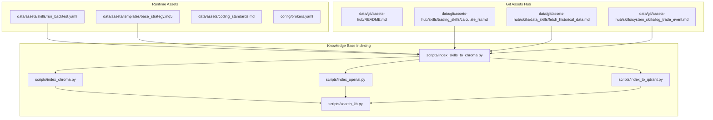
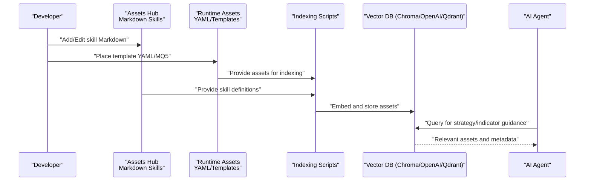
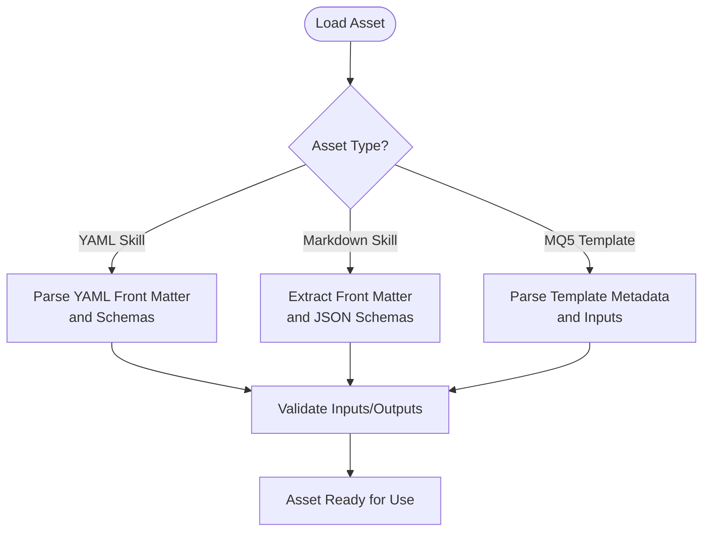
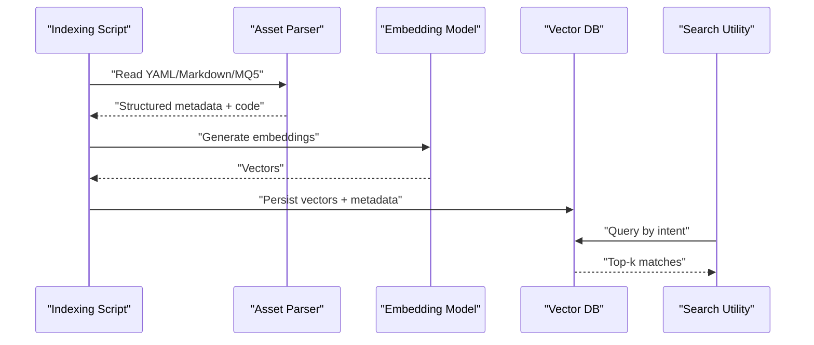
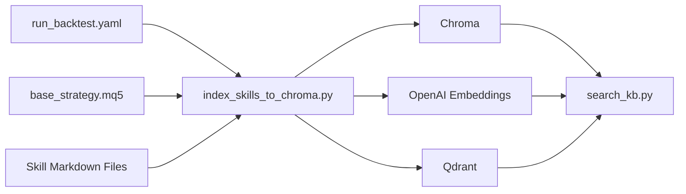

# Asset Storage and Organization

<cite>
**Referenced Files in This Document**
- [run_backtest.yaml](file://data/assets/skills/run_backtest.yaml)
- [base_strategy.mq5](file://data/assets/templates/base_strategy.mq5)
- [coding_standards.md](file://data/assets/coding_standards.md)
- [brokers.yaml](file://config/brokers.yaml)
- [README.md](file://data/git/assets-hub/README.md)
- [calculate_rsi.md](file://data/git/assets-hub/skills/trading_skills/calculate_rsi.md)
- [fetch_historical_data.md](file://data/git/assets-hub/skills/data_skills/fetch_historical_data.md)
- [log_trade_event.md](file://data/git/assets-hub/skills/system_skills/log_trade_event.md)
- [index_skills_to_chroma.py](file://scripts/index_skills_to_chroma.py)
- [index_chroma.py](file://scripts/index_chroma.py)
- [index_openai.py](file://scripts/index_openai.py)
- [index_to_qdrant.py](file://scripts/index_to_qdrant.py)
- [search_kb.py](file://scripts/search_kb.py)
</cite>

## Table of Contents
1. [Introduction](#introduction)
2. [Project Structure](#project-structure)
3. [Core Components](#core-components)
4. [Architecture Overview](#architecture-overview)
5. [Detailed Component Analysis](#detailed-component-analysis)
6. [Dependency Analysis](#dependency-analysis)
7. [Performance Considerations](#performance-considerations)
8. [Troubleshooting Guide](#troubleshooting-guide)
9. [Conclusion](#conclusion)

## Introduction
This document explains the asset storage and organization system used across the QuantMindX platform. It covers the hierarchical structure of the assets directory, the YAML-based configuration system for strategies and skills, file naming conventions, and how assets are categorized by function (skills, templates, indicators). It also describes how assets integrate with the knowledge base for AI agent use cases, including indexing and retrieval mechanisms.

## Project Structure
The asset system centers around two primary locations:
- data/assets: Stores runtime-ready assets such as templates and backtest configuration.
- data/git/assets-hub: Stores Git-managed assets (skills, templates, and generated artifacts) organized by functional categories.

Key directories and files:
- data/assets/skills/run_backtest.yaml: Backtest execution configuration.
- data/assets/templates/base_strategy.mq5: MQL5 template for strategies.
- data/assets/coding_standards.md: Coding standards applied to assets.
- config/brokers.yaml: Broker configuration used by backtesting and live trading.
- data/git/assets-hub/README.md: Describes the Git-based assets hub structure.
- data/git/assets-hub/skills/: Functional skill definitions (trading, system, data).
- scripts/index_*.py: Indexing utilities for knowledge base integration.
- scripts/search_kb.py: Retrieval utility for knowledge base queries.

**Diagram sources**
- [run_backtest.yaml](file://data/assets/skills/run_backtest.yaml#L1-L18)
- [base_strategy.mq5](file://data/assets/templates/base_strategy.mq5#L1-L45)
- [coding_standards.md](file://data/assets/coding_standards.md#L1-L16)
- [brokers.yaml](file://config/brokers.yaml#L1-L116)
- [README.md](file://data/git/assets-hub/README.md#L1-L42)
- [calculate_rsi.md](file://data/git/assets-hub/skills/trading_skills/calculate_rsi.md#L1-L141)
- [fetch_historical_data.md](file://data/git/assets-hub/skills/data_skills/fetch_historical_data.md#L1-L206)
- [log_trade_event.md](file://data/git/assets-hub/skills/system_skills/log_trade_event.md#L1-L161)
- [index_skills_to_chroma.py](file://scripts/index_skills_to_chroma.py#L1-L200)
- [index_chroma.py](file://scripts/index_chroma.py#L1-L200)
- [index_openai.py](file://scripts/index_openai.py#L1-L200)
- [index_to_qdrant.py](file://scripts/index_to_qdrant.py#L1-L200)
- [search_kb.py](file://scripts/search_kb.py#L1-L200)

**Section sources**
- [README.md](file://data/git/assets-hub/README.md#L1-L42)
- [run_backtest.yaml](file://data/assets/skills/run_backtest.yaml#L1-L18)
- [base_strategy.mq5](file://data/assets/templates/base_strategy.mq5#L1-L45)
- [coding_standards.md](file://data/assets/coding_standards.md#L1-L16)
- [brokers.yaml](file://config/brokers.yaml#L1-L116)

## Core Components
- Runtime assets directory (data/assets): Contains YAML-based backtest configurations and MQL5 templates used directly by the system.
- Git assets hub (data/git/assets-hub): Stores Markdown-based skill definitions and templates organized by functional categories.
- Coding standards (data/assets/coding_standards.md): Enforces consistent quality and safety rules for assets.
- Broker configuration (config/brokers.yaml): Provides environment-aware broker settings for backtesting and live trading.

Organizational principles:
- Function-based categorization: skills grouped by domain (trading, system, data).
- YAML front matter and JSON schemas for structured metadata and input/output contracts.
- Template-first approach: reusable MQL5 templates standardized for consistent strategy scaffolding.

**Section sources**
- [README.md](file://data/git/assets-hub/README.md#L14-L17)
- [calculate_rsi.md](file://data/git/assets-hub/skills/trading_skills/calculate_rsi.md#L1-L7)
- [fetch_historical_data.md](file://data/git/assets-hub/skills/data_skills/fetch_historical_data.md#L1-L6)
- [log_trade_event.md](file://data/git/assets-hub/skills/system_skills/log_trade_event.md#L1-L6)
- [run_backtest.yaml](file://data/assets/skills/run_backtest.yaml#L1-L18)
- [base_strategy.mq5](file://data/assets/templates/base_strategy.mq5#L1-L45)
- [coding_standards.md](file://data/assets/coding_standards.md#L1-L16)
- [brokers.yaml](file://config/brokers.yaml#L1-L116)

## Architecture Overview
The asset system integrates three layers:
- Asset storage: YAML and Markdown assets define skills and templates; MQL5 templates provide executable scaffolding.
- Indexing pipeline: Scripts convert assets into embeddings and persist them in vector databases (Chroma, OpenAI, Qdrant).
- Retrieval layer: Search utilities query the knowledge base to support AI agents and workflows.

**Diagram sources**
- [README.md](file://data/git/assets-hub/README.md#L1-L42)
- [run_backtest.yaml](file://data/assets/skills/run_backtest.yaml#L1-L18)
- [base_strategy.mq5](file://data/assets/templates/base_strategy.mq5#L1-L45)
- [calculate_rsi.md](file://data/git/assets-hub/skills/trading_skills/calculate_rsi.md#L1-L141)
- [index_skills_to_chroma.py](file://scripts/index_skills_to_chroma.py#L1-L200)
- [index_chroma.py](file://scripts/index_chroma.py#L1-L200)
- [index_openai.py](file://scripts/index_openai.py#L1-L200)
- [index_to_qdrant.py](file://scripts/index_to_qdrant.py#L1-L200)
- [search_kb.py](file://scripts/search_kb.py#L1-L200)

## Detailed Component Analysis

### Assets Directory Structure and Naming Conventions
- data/assets/skills/run_backtest.yaml: Defines a skill named run_backtest with inputs (strategy_code, symbol, timeframe) and outputs (sharpe_ratio, total_return, drawdown, logs). This enables standardized backtesting orchestration.
- data/assets/templates/base_strategy.mq5: A canonical MQL5 template with property declarations, input parameters, and skeleton functions (OnInit, OnDeinit, OnTick), ensuring consistent strategy scaffolding.
- data/assets/coding_standards.md: Establishes safety, compilation, and documentation guidelines for assets.

Naming and organization:
- YAML front matter in Markdown skills (name, category, version, dependencies) ensures machine-readable metadata.
- JSON schemas embedded in Markdown documents define strict input and output contracts for skills.
- Templates use descriptive filenames (e.g., base_strategy.mq5) to indicate purpose.

**Section sources**
- [run_backtest.yaml](file://data/assets/skills/run_backtest.yaml#L1-L18)
- [base_strategy.mq5](file://data/assets/templates/base_strategy.mq5#L1-L45)
- [coding_standards.md](file://data/assets/coding_standards.md#L1-L16)

### Git Assets Hub: Functional Categories and Metadata
The assets hub organizes assets by function:
- data/git/assets-hub/skills/trading_skills/: Trading-focused skills such as indicator calculations and risk management helpers.
- data/git/assets-hub/skills/data_skills/: Data fetching and preprocessing skills.
- data/git/assets-hub/skills/system_skills/: System-level skills for logging and operational tasks.

Each skill is a Markdown file with:
- YAML front matter: name, category, version, dependencies.
- JSON schemas: input and output contracts.
- Embedded code: runnable implementation.

Examples:
- calculate_rsi.md: Defines RSI calculation with input schema (symbol, period, prices) and output schema (rsi_value, signal).
- fetch_historical_data.md: Defines historical data fetching with timeframe and bars_count constraints.
- log_trade_event.md: Defines trade event logging with event_type, symbol, action, price, lots, strategy_name, and optional PnL.

**Section sources**
- [README.md](file://data/git/assets-hub/README.md#L14-L17)
- [calculate_rsi.md](file://data/git/assets-hub/skills/trading_skills/calculate_rsi.md#L1-L141)
- [fetch_historical_data.md](file://data/git/assets-hub/skills/data_skills/fetch_historical_data.md#L1-L206)
- [log_trade_event.md](file://data/git/assets-hub/skills/system_skills/log_trade_event.md#L1-L161)

### YAML-Based Configuration System
- Backtest configuration: run_backtest.yaml specifies inputs and outputs for backtesting, enabling uniform execution across Python and MQL5 strategies.
- Broker configuration: brokers.yaml centralizes broker credentials and connection parameters, supporting multiple broker types (MT5 mock/socket, Binance Spot/Futures) with environment variable substitution.

**Diagram sources**
- [run_backtest.yaml](file://data/assets/skills/run_backtest.yaml#L1-L18)
- [base_strategy.mq5](file://data/assets/templates/base_strategy.mq5#L1-L45)
- [calculate_rsi.md](file://data/git/assets-hub/skills/trading_skills/calculate_rsi.md#L1-L59)
- [fetch_historical_data.md](file://data/git/assets-hub/skills/data_skills/fetch_historical_data.md#L1-L83)

**Section sources**
- [run_backtest.yaml](file://data/assets/skills/run_backtest.yaml#L1-L18)
- [brokers.yaml](file://config/brokers.yaml#L1-L116)

### Knowledge Base Integration and AI Agent Use Cases
Assets are indexed and retrievable for AI agents:
- index_skills_to_chroma.py: Converts Markdown skills and runtime assets into embeddings and stores them in Chroma.
- index_chroma.py, index_openai.py, index_to_qdrant.py: Alternative indexing pipelines targeting different vector databases.
- search_kb.py: Retrieves relevant assets based on queries, enabling agents to discover strategies, indicators, and system utilities.

**Diagram sources**
- [index_skills_to_chroma.py](file://scripts/index_skills_to_chroma.py#L1-L200)
- [index_chroma.py](file://scripts/index_chroma.py#L1-L200)
- [index_openai.py](file://scripts/index_openai.py#L1-L200)
- [index_to_qdrant.py](file://scripts/index_to_qdrant.py#L1-L200)
- [search_kb.py](file://scripts/search_kb.py#L1-L200)

**Section sources**
- [index_skills_to_chroma.py](file://scripts/index_skills_to_chroma.py#L1-L200)
- [index_chroma.py](file://scripts/index_chroma.py#L1-L200)
- [index_openai.py](file://scripts/index_openai.py#L1-L200)
- [index_to_qdrant.py](file://scripts/index_to_qdrant.py#L1-L200)
- [search_kb.py](file://scripts/search_kb.py#L1-L200)

## Dependency Analysis
- Asset-to-indexing dependencies:
  - YAML and MQ5 assets feed into index_skills_to_chroma.py.
  - Markdown skill files (with front matter and schemas) are parsed by indexing scripts.
- Indexing-to-storage dependencies:
  - index_skills_to_chroma.py writes to Chroma; alternatives target OpenAI and Qdrant.
- Retrieval-to-indexing dependencies:
  - search_kb.py queries the vector database populated by indexing scripts.

**Diagram sources**
- [run_backtest.yaml](file://data/assets/skills/run_backtest.yaml#L1-L18)
- [base_strategy.mq5](file://data/assets/templates/base_strategy.mq5#L1-L45)
- [calculate_rsi.md](file://data/git/assets-hub/skills/trading_skills/calculate_rsi.md#L1-L141)
- [index_skills_to_chroma.py](file://scripts/index_skills_to_chroma.py#L1-L200)
- [index_chroma.py](file://scripts/index_chroma.py#L1-L200)
- [index_openai.py](file://scripts/index_openai.py#L1-L200)
- [index_to_qdrant.py](file://scripts/index_to_qdrant.py#L1-L200)
- [search_kb.py](file://scripts/search_kb.py#L1-L200)

**Section sources**
- [README.md](file://data/git/assets-hub/README.md#L1-L42)
- [run_backtest.yaml](file://data/assets/skills/run_backtest.yaml#L1-L18)
- [base_strategy.mq5](file://data/assets/templates/base_strategy.mq5#L1-L45)
- [calculate_rsi.md](file://data/git/assets-hub/skills/trading_skills/calculate_rsi.md#L1-L141)
- [index_skills_to_chroma.py](file://scripts/index_skills_to_chroma.py#L1-L200)
- [search_kb.py](file://scripts/search_kb.py#L1-L200)

## Performance Considerations
- Prefer concise YAML front matter and minimal Markdown overhead to reduce parsing time.
- Use chunking and metadata filtering during indexing to keep retrieval latency low.
- Cache frequently accessed broker configurations and templates to minimize IO overhead.
- Ensure embedding models are optimized for batch processing to accelerate indexing.

## Troubleshooting Guide
Common issues and resolutions:
- YAML parsing errors: Verify front matter syntax and schema alignment in skill Markdown files.
- Missing environment variables: Ensure broker configuration environment variables are set before loading brokers.yaml.
- Indexing failures: Confirm vector database connectivity and embedding model availability.
- Retrieval accuracy: Adjust query phrasing and verify that assets include clear descriptions and schemas.

**Section sources**
- [brokers.yaml](file://config/brokers.yaml#L90-L116)
- [index_skills_to_chroma.py](file://scripts/index_skills_to_chroma.py#L1-L200)
- [search_kb.py](file://scripts/search_kb.py#L1-L200)

## Conclusion
The asset storage and organization system in QuantMindX combines structured YAML and Markdown assets with a Git-based hub to create a scalable, searchable knowledge base. By enforcing function-based categorization, metadata-driven schemas, and standardized templates, the system supports reproducible backtesting, consistent strategy development, and effective AI agent assistance through retrieval-augmented workflows.