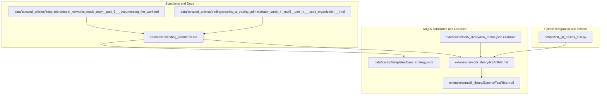
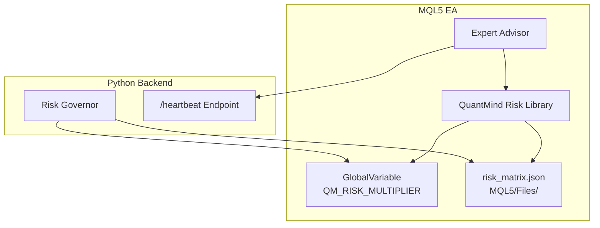
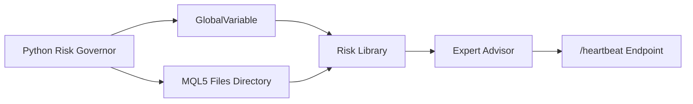

# Coding Standards and Guidelines

<cite>
**Referenced Files in This Document**
- [coding_standards.md](file://data/assets/coding_standards.md)
- [base_strategy.mq5](file://data/assets/templates/base_strategy.mq5)
- [README.md](file://extensions/mql5_library/README.md)
- [risk_matrix.json.example](file://extensions/mql5_library/risk_matrix.json.example)
- [TestRisk.mq5](file://extensions/mql5_library/Experts/TestRisk.mq5)
- [TestCoreModules.mq5](file://src/mql5/Experts/TestCoreModules.mq5)
- [TestRiskModules.mq5](file://src/mql5/Experts/TestRiskModules.mq5)
- [init_git_assets_hub.py](file://scripts/init_git_assets_hub.py)
- [expert_advisor_sample.md](file://data/scraped_articles/expert_advisors/expert_advisor_sample.md)
- [neural_networks_made_easy__part_9___documenting_the_work.md](file://data/scraped_articles/integration/neural_networks_made_easy__part_9___documenting_the_work.md)
- [understanding_programming_paradigms__part_2___an_object-oriented_approach_to_developing_a_price_acti.md](file://data/scraped_articles/trading_systems/understanding_programming_paradigms__part_2___an_object-oriented_approach_to_developing_a_price_acti.md)
- [moving_to_mql5_algo_forge__part_4___working_with_versions_and_releases.md](file://data/scraped_articles/integration/moving_to_mql5_algo_forge__part_4___working_with_versions_and_releases.md)
- [moving_to_mql5_algo_forge__part_2___working_with_multiple_repositories.md](file://data/scraped_articles/integration/moving_to_mql5_algo_forge__part_2___working_with_multiple_repositories.md)
- [creating_a_trading_administrator_panel_in_mql5__part_ix___code_organization__i.md](file://data/scraped_articles/trading/creating_a_trading_administrator_panel_in_mql5__part_ix___code_organization__i.md)
- [library_for_easy_and_quick_development_of_metatrader_programs__part_xii___account_object_class_and_c.md](file://data/scraped_articles/trading_systems/library_for_easy_and_quick_development_of_metatrader_programs__part_xii___account_object_class_and_c.md)
</cite>

## Table of Contents
1. [Introduction](#introduction)
2. [Project Structure](#project-structure)
3. [Core Components](#core-components)
4. [Architecture Overview](#architecture-overview)
5. [Detailed Component Analysis](#detailed-component-analysis)
6. [Dependency Analysis](#dependency-analysis)
7. [Performance Considerations](#performance-considerations)
8. [Troubleshooting Guide](#troubleshooting-guide)
9. [Conclusion](#conclusion)
10. [Appendices](#appendices)

## Introduction
This document defines the QuantMindX coding standards and guidelines for asset development across MQL5 Expert Advisors, Python backtesting, and collaborative workflows. It consolidates official standards, template conventions, library usage, and repository practices to ensure consistency, safety, readability, and compatibility with the broader QuantMind platform.

## Project Structure
QuantMindX organizes assets and standards across three primary areas:
- MQL5 templates and libraries under data and src/mql5
- Python-based risk management and integration under extensions and scripts
- Documentation and standards under data/assets and docs

**Diagram sources**
- [coding_standards.md](file://data/assets/coding_standards.md#L1-L16)
- [base_strategy.mq5](file://data/assets/templates/base_strategy.mq5#L1-L45)
- [README.md](file://extensions/mql5_library/README.md#L1-L297)
- [risk_matrix.json.example](file://extensions/mql5_library/risk_matrix.json.example#L1-L23)
- [TestRisk.mq5](file://extensions/mql5_library/Experts/TestRisk.mq5#L1-L340)
- [init_git_assets_hub.py](file://scripts/init_git_assets_hub.py#L1-L194)
- [neural_networks_made_easy__part_9___documenting_the_work.md](file://data/scraped_articles/integration/neural_networks_made_easy__part_9___documenting_the_work.md#L57-L84)
- [creating_a_trading_administrator_panel_in_mql5__part_ix___code_organization__i.md](file://data/scraped_articles/trading/creating_a_trading_administrator_panel_in_mql5__part_ix___code_organization__i.md#L60-L1054)

**Section sources**
- [coding_standards.md](file://data/assets/coding_standards.md#L1-L16)
- [base_strategy.mq5](file://data/assets/templates/base_strategy.mq5#L1-L45)
- [README.md](file://extensions/mql5_library/README.md#L1-L297)
- [risk_matrix.json.example](file://extensions/mql5_library/risk_matrix.json.example#L1-L23)
- [TestRisk.mq5](file://extensions/mql5_library/Experts/TestRisk.mq5#L1-L340)
- [init_git_assets_hub.py](file://scripts/init_git_assets_hub.py#L1-L194)
- [neural_networks_made_easy__part_9___documenting_the_work.md](file://data/scraped_articles/integration/neural_networks_made_easy__part_9___documenting_the_work.md#L57-L84)
- [creating_a_trading_administrator_panel_in_mql5__part_ix___code_organization__i.md](file://data/scraped_articles/trading/creating_a_trading_administrator_panel_in_mql5__part_ix___code_organization__i.md#L60-L1054)

## Core Components
- Official coding standards for MQL5 and Python
- MQL5 template with input-driven design and minimal logic
- Risk management library with dual-path risk data retrieval and heartbeat integration
- Test harnesses validating library paths and risk calculations
- Git-based assets hub with standardized structure and commit messaging

Key enforcement points:
- MQL5: strict compilation, risk parameters via inputs, SL/TP on orders
- Python: typing, docstrings, Backtrader usage for strategy logic
- Safety: no filesystem IO outside allowed directories; no external network calls except via MCP

**Section sources**
- [coding_standards.md](file://data/assets/coding_standards.md#L1-L16)
- [base_strategy.mq5](file://data/assets/templates/base_strategy.mq5#L1-L45)
- [README.md](file://extensions/mql5_library/README.md#L84-L142)
- [TestRisk.mq5](file://extensions/mql5_library/Experts/TestRisk.mq5#L115-L236)
- [TestCoreModules.mq5](file://src/mql5/Experts/TestCoreModules.mq5#L1-L266)
- [TestRiskModules.mq5](file://src/mql5/Experts/TestRiskModules.mq5#L1-L303)

## Architecture Overview
The MQL5 risk management architecture integrates with Python governance via two paths:
- Fast path: GlobalVariable set by Python
- Fallback path: JSON file in MQL5 Files directory
Heartbeat sends runtime metrics to the Python backend for monitoring.

**Diagram sources**
- [README.md](file://extensions/mql5_library/README.md#L84-L177)
- [TestRisk.mq5](file://extensions/mql5_library/Experts/TestRisk.mq5#L115-L236)
- [risk_matrix.json.example](file://extensions/mql5_library/risk_matrix.json.example#L1-L23)

**Section sources**
- [README.md](file://extensions/mql5_library/README.md#L84-L177)
- [TestRisk.mq5](file://extensions/mql5_library/Experts/TestRisk.mq5#L115-L236)
- [risk_matrix.json.example](file://extensions/mql5_library/risk_matrix.json.example#L1-L23)

## Detailed Component Analysis

### MQL5 Coding Conventions and Template
- Strict compilation enforced via property declarations
- Input-driven parameterization for all strategy settings
- Minimal OnTick logic; entry checks gated behind position checks
- Trade object initialization in OnInit with magic number assignment

Recommended patterns:
- Use input variables for all tunable parameters
- Always initialize trade objects in OnInit
- Encapsulate order logic with SL/TP and risk checks
- Keep OnTick lightweight; delegate heavy logic to scheduled ticks or events

**Section sources**
- [base_strategy.mq5](file://data/assets/templates/base_strategy.mq5#L1-L45)
- [coding_standards.md](file://data/assets/coding_standards.md#L8-L12)

### Risk Management Library (MQL5)
Core capabilities:
- Dual-path risk retrieval: GlobalVariable fast path and JSON fallback
- Heartbeat to Python backend for monitoring
- Stale data detection with configurable freshness window
- Example risk matrix format and timestamp validation

Best practices:
- Always call RiskInit in OnInit and RiskDeinit in OnDeinit
- Cache GetRiskMultiplier per tick to avoid repeated reads
- Validate risk multiplier range and handle defaults
- Monitor heartbeat failures and backend connectivity

**Section sources**
- [README.md](file://extensions/mql5_library/README.md#L84-L177)
- [TestRisk.mq5](file://extensions/mql5_library/Experts/TestRisk.mq5#L115-L236)
- [risk_matrix.json.example](file://extensions/mql5_library/risk_matrix.json.example#L1-L23)

### Test Harnesses for Library Validation
- TestRisk.mq5 validates fast path, fallback path, heartbeat, JSON parsing, and stale data rejection
- TestCoreModules.mq5 verifies compilation and functionality of core QSL modules
- TestRiskModules.mq5 validates PropManager, KellySizer, and heartbeat integration

These EAs serve as:
- Regression tests for library paths
- Examples of proper initialization and logging
- Demonstrations of risk calculations and status reporting

**Section sources**
- [TestRisk.mq5](file://extensions/mql5_library/Experts/TestRisk.mq5#L1-L340)
- [TestCoreModules.mq5](file://src/mql5/Experts/TestCoreModules.mq5#L1-L266)
- [TestRiskModules.mq5](file://src/mql5/Experts/TestRiskModules.mq5#L1-L303)

### Documentation Standards and Comment Formatting
- Prefer MQL5 documentation comment styles for inline and block documentation
- Use brief and detailed comment blocks to separate summaries from details
- Employ special commands to structure documentation content

**Section sources**
- [neural_networks_made_easy__part_9___documenting_the_work.md](file://data/scraped_articles/integration/neural_networks_made_easy__part_9___documenting_the_work.md#L57-L84)

### Code Readability and Organization
- Favor descriptive naming over abbreviations
- Separate UI logic from business logic
- Modularize code into focused functions and classes
- Maintain consistent formatting and indentation

**Section sources**
- [creating_a_trading_administrator_panel_in_mql5__part_ix___code_organization__i.md](file://data/scraped_articles/trading/creating_a_trading_administrator_panel_in_mql5__part_ix___code_organization__i.md#L60-L1054)

### Object-Oriented Design in MQL5
- Apply encapsulation, abstraction, inheritance, and polymorphism
- Use class naming conventions (prefix with C) to distinguish classes
- Promote modularity and reusability through well-defined classes and objects

**Section sources**
- [understanding_programming_paradigms__part_2___an_object-oriented_approach_to_developing_a_price_acti.md](file://data/scraped_articles/trading_systems/understanding_programming_paradigms__part_2___an_object-oriented_approach_to_developing_a_price_acti.md#L538-L555)

### Version Control Integration and Branching Strategies
- Use branches to isolate feature work; merge via pull requests even in solo projects
- Preserve commit history; delete feature branches after successful merges
- Adopt descriptive commit messages aligned with repository conventions

**Section sources**
- [moving_to_mql5_algo_forge__part_4___working_with_versions_and_releases.md](file://data/scraped_articles/integration/moving_to_mql5_algo_forge__part_4___working_with_versions_and_releases.md#L28-L34)
- [moving_to_mql5_algo_forge__part_2___working_with_multiple_repositories.md](file://data/scraped_articles/integration/moving_to_mql5_algo_forge__part_2___working_with_multiple_repositories.md#L239-L251)

### Assets Hub Repository Structure and Workflows
- Standardized categories for templates and skills
- Dedicated directory for generated bot artifacts with .gitignore
- Descriptive README and commit message conventions for templates

**Section sources**
- [init_git_assets_hub.py](file://scripts/init_git_assets_hub.py#L1-L194)

## Dependency Analysis
The MQL5 risk library depends on:
- GlobalVariable API for fast-path updates
- File I/O for JSON fallback
- Heartbeat endpoint for monitoring

**Diagram sources**
- [README.md](file://extensions/mql5_library/README.md#L84-L177)
- [TestRisk.mq5](file://extensions/mql5_library/Experts/TestRisk.mq5#L115-L236)

**Section sources**
- [README.md](file://extensions/mql5_library/README.md#L84-L177)
- [TestRisk.mq5](file://extensions/mql5_library/Experts/TestRisk.mq5#L115-L236)

## Performance Considerations
- Cache risk multiplier per tick to minimize file and API calls
- Validate data freshness to avoid stale computations
- Keep OnTick logic minimal; offload heavy operations to scheduled intervals
- Use efficient JSON parsing helpers and avoid redundant string operations

[No sources needed since this section provides general guidance]

## Troubleshooting Guide
Common issues and resolutions:
- WebRequest errors for heartbeat: ensure backend is running and URL is whitelisted
- Missing risk_matrix.json: verify file location and permissions
- Stale data warnings: update timestamps and confirm system time synchronization
- Compilation warnings: enforce strict compilation and eliminate warnings

**Section sources**
- [README.md](file://extensions/mql5_library/README.md#L264-L284)
- [TestRisk.mq5](file://extensions/mql5_library/Experts/TestRisk.mq5#L300-L337)

## Conclusion
QuantMindX standards emphasize safety-first practices, strict MQL5 compilation, input-driven parameterization, and robust risk management. The risk library’s dual-path design and heartbeat integration enable seamless collaboration between Python governance and MQL5 execution. Adhering to documented conventions, leveraging test harnesses, and following disciplined version control practices ensures consistency and compatibility across the asset library and the broader platform.

[No sources needed since this section summarizes without analyzing specific files]

## Appendices

### Well-Structured Asset Examples
- Base MQL5 template demonstrating input-driven design and minimal OnTick logic
- Risk library README with API reference, configuration, and examples
- Test harnesses validating library paths and risk calculations

**Section sources**
- [base_strategy.mq5](file://data/assets/templates/base_strategy.mq5#L1-L45)
- [README.md](file://extensions/mql5_library/README.md#L84-L177)
- [TestRisk.mq5](file://extensions/mql5_library/Experts/TestRisk.mq5#L115-L236)
- [TestCoreModules.mq5](file://src/mql5/Experts/TestCoreModules.mq5#L1-L266)
- [TestRiskModules.mq5](file://src/mql5/Experts/TestRiskModules.mq5#L1-L303)