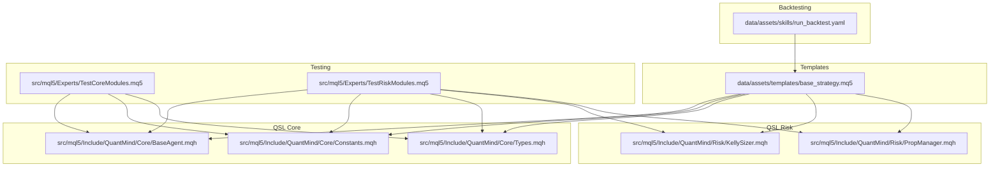
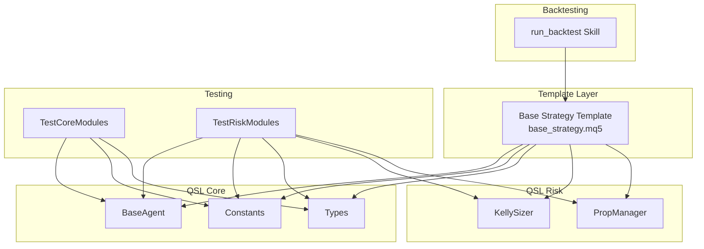
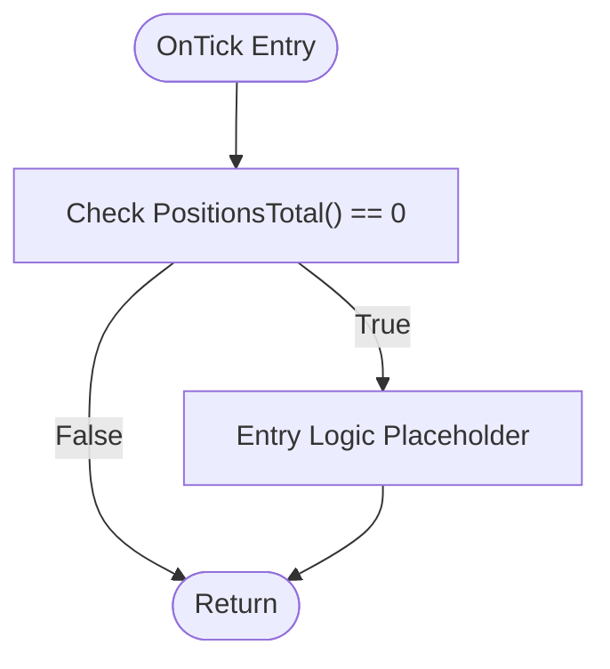
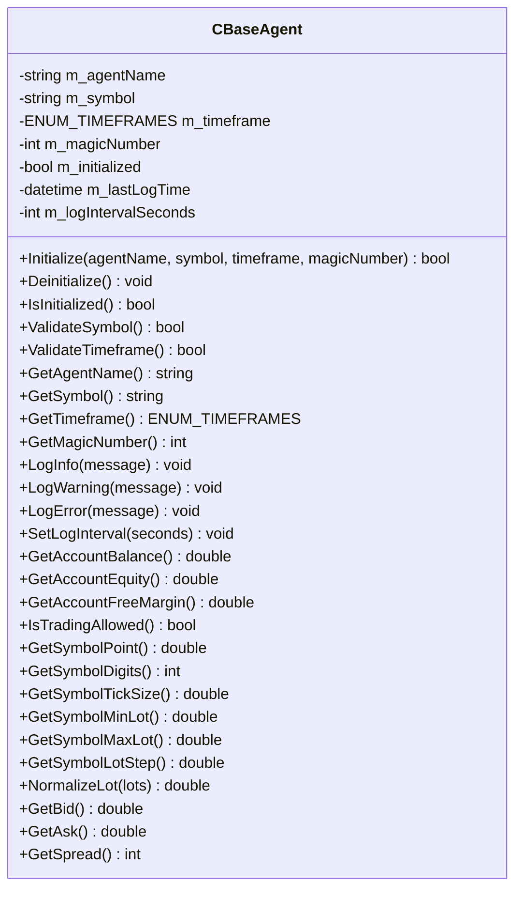
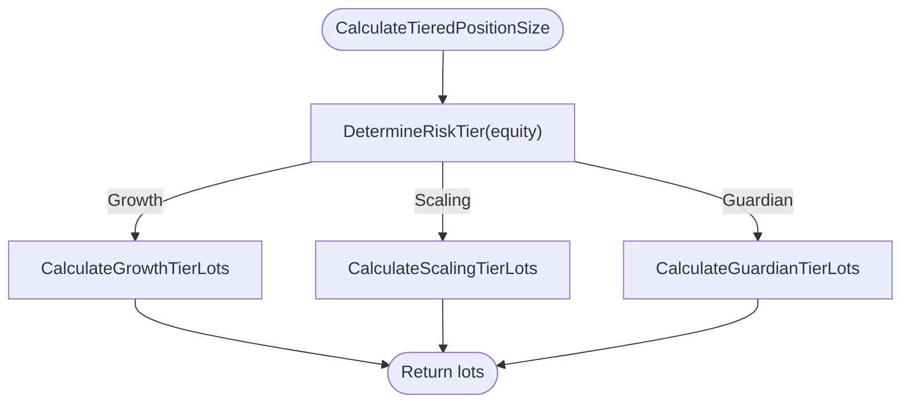
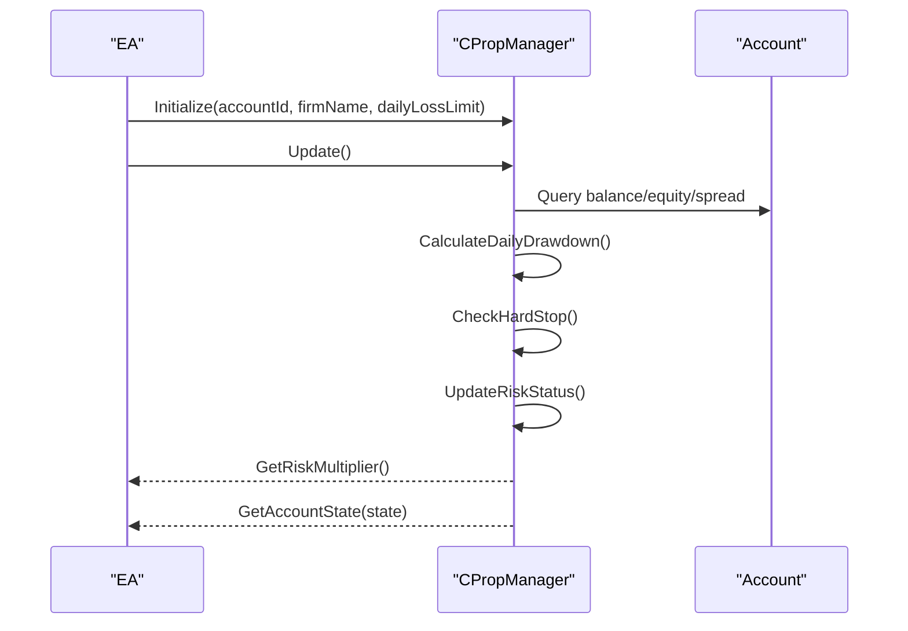
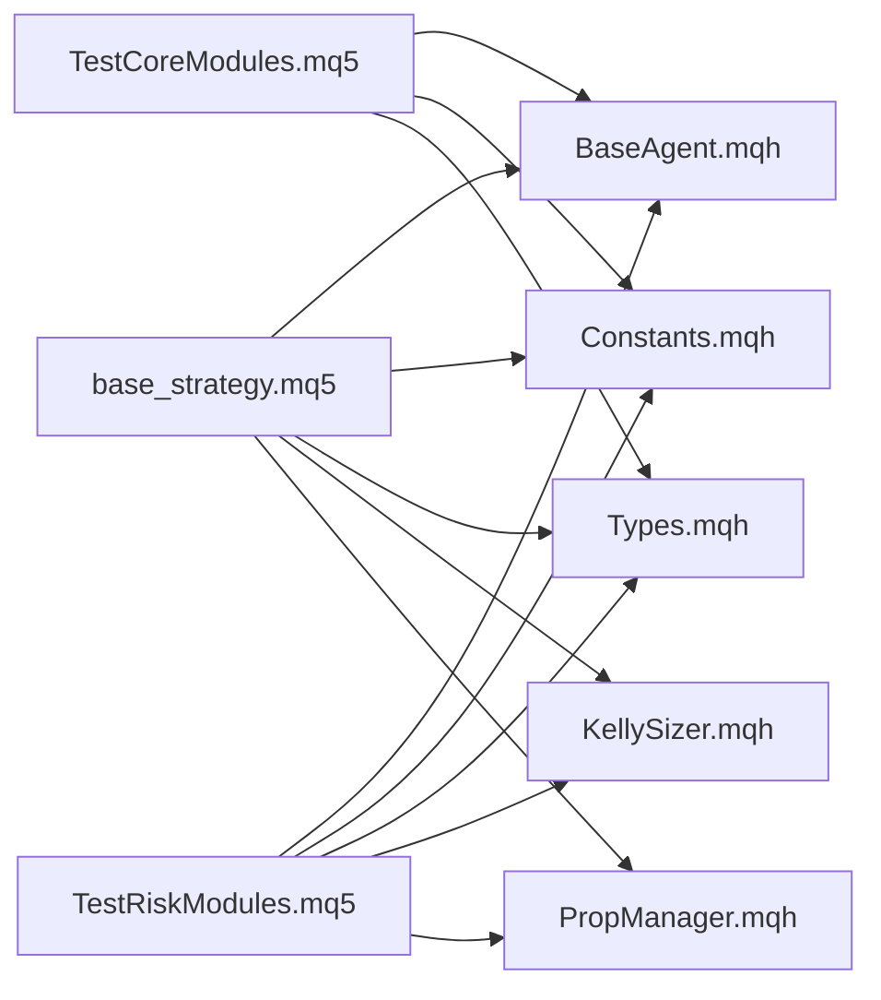

# Template Management System

<cite>
**Referenced Files in This Document**
- [base_strategy.mq5](file://data/assets/templates/base_strategy.mq5)
- [coding_standards.md](file://data/assets/coding_standards.md)
- [run_backtest.yaml](file://data/assets/skills/run_backtest.yaml)
- [BaseAgent.mqh](file://src/mql5/Include/QuantMind/Core/BaseAgent.mqh)
- [Constants.mqh](file://src/mql5/Include/QuantMind/Core/Constants.mqh)
- [Types.mqh](file://src/mql5/Include/QuantMind/Core/Types.mqh)
- [KellySizer.mqh](file://src/mql5/Include/QuantMind/Risk/KellySizer.mqh)
- [PropManager.mqh](file://src/mql5/Include/QuantMind/Risk/PropManager.mqh)
- [TestCoreModules.mq5](file://src/mql5/Experts/TestCoreModules.mq5)
- [TestRiskModules.mq5](file://src/mql5/Experts/TestRiskModules.mq5)
</cite>

## Table of Contents
1. [Introduction](#introduction)
2. [Project Structure](#project-structure)
3. [Core Components](#core-components)
4. [Architecture Overview](#architecture-overview)
5. [Detailed Component Analysis](#detailed-component-analysis)
6. [Dependency Analysis](#dependency-analysis)
7. [Performance Considerations](#performance-considerations)
8. [Troubleshooting Guide](#troubleshooting-guide)
9. [Conclusion](#conclusion)
10. [Appendices](#appendices)

## Introduction
This document describes the template management system within QuantMind, focusing on the base strategy template and the QuantMind Standard Library (QSL) that underpins all Expert Advisors. It explains the base strategy structure, MQL5 template class organization, parameterization, inheritance patterns, and customization mechanisms. It also covers risk management integration, testing procedures, and deployment workflows aligned with the repository’s standards and modules.

## Project Structure
The template management system centers around:
- A base MQL5 strategy template located under data assets
- A reusable QSL library under src/mql5/Include/QuantMind
- Test EAs under src/mql5/Experts to validate module compilation and runtime behavior
- Backtesting skill definition under data/assets/skills

**Diagram sources**
- [base_strategy.mq5](file://data/assets/templates/base_strategy.mq5#L1-L45)
- [BaseAgent.mqh](file://src/mql5/Include/QuantMind/Core/BaseAgent.mqh#L1-L444)
- [Constants.mqh](file://src/mql5/Include/QuantMind/Core/Constants.mqh#L1-L270)
- [Types.mqh](file://src/mql5/Include/QuantMind/Core/Types.mqh#L1-L362)
- [KellySizer.mqh](file://src/mql5/Include/QuantMind/Risk/KellySizer.mqh#L1-L533)
- [PropManager.mqh](file://src/mql5/Include/QuantMind/Risk/PropManager.mqh#L1-L449)
- [TestCoreModules.mq5](file://src/mql5/Experts/TestCoreModules.mq5#L1-L266)
- [TestRiskModules.mq5](file://src/mql5/Experts/TestRiskModules.mq5#L1-L303)
- [run_backtest.yaml](file://data/assets/skills/run_backtest.yaml#L1-L18)

**Section sources**
- [base_strategy.mq5](file://data/assets/templates/base_strategy.mq5#L1-L45)
- [TestCoreModules.mq5](file://src/mql5/Experts/TestCoreModules.mq5#L1-L266)
- [TestRiskModules.mq5](file://src/mql5/Experts/TestRiskModules.mq5#L1-L303)
- [run_backtest.yaml](file://data/assets/skills/run_backtest.yaml#L1-L18)

## Core Components
- Base Strategy Template: A minimal MQL5 EA that demonstrates the standard structure, input parameters, and event handlers.
- QSL Core: Shared utilities for initialization, logging, symbol/timeframe validation, and common data types.
- QSL Risk: Risk management modules including Kelly sizing, prop firm risk controls, and risk client integration.
- Test EAs: Validation suites ensuring QSL modules compile and function as expected.

Key characteristics:
- Strict compilation policy enforced by property strict
- Centralized constants and enums for system-wide consistency
- Structured data models for trade proposals, account states, and risk parameters
- Risk-aware position sizing and daily drawdown tracking

**Section sources**
- [base_strategy.mq5](file://data/assets/templates/base_strategy.mq5#L1-L45)
- [BaseAgent.mqh](file://src/mql5/Include/QuantMind/Core/BaseAgent.mqh#L1-L444)
- [Constants.mqh](file://src/mql5/Include/QuantMind/Core/Constants.mqh#L1-L270)
- [Types.mqh](file://src/mql5/Include/QuantMind/Core/Types.mqh#L1-L362)
- [KellySizer.mqh](file://src/mql5/Include/QuantMind/Risk/KellySizer.mqh#L1-L533)
- [PropManager.mqh](file://src/mql5/Include/QuantMind/Risk/PropManager.mqh#L1-L449)

## Architecture Overview
The template architecture follows a layered pattern:
- Template Layer: Base EA defines structure and parameters
- QSL Core Layer: BaseAgent, Constants, Types
- QSL Risk Layer: KellySizer, PropManager
- Testing Layer: TestCoreModules and TestRiskModules
- Backtesting Layer: run_backtest skill specification

**Diagram sources**
- [base_strategy.mq5](file://data/assets/templates/base_strategy.mq5#L1-L45)
- [BaseAgent.mqh](file://src/mql5/Include/QuantMind/Core/BaseAgent.mqh#L1-L444)
- [Constants.mqh](file://src/mql5/Include/QuantMind/Core/Constants.mqh#L1-L270)
- [Types.mqh](file://src/mql5/Include/QuantMind/Core/Types.mqh#L1-L362)
- [KellySizer.mqh](file://src/mql5/Include/QuantMind/Risk/KellySizer.mqh#L1-L533)
- [PropManager.mqh](file://src/mql5/Include/QuantMind/Risk/PropManager.mqh#L1-L449)
- [TestCoreModules.mq5](file://src/mql5/Experts/TestCoreModules.mq5#L1-L266)
- [TestRiskModules.mq5](file://src/mql5/Experts/TestRiskModules.mq5#L1-L303)
- [run_backtest.yaml](file://data/assets/skills/run_backtest.yaml#L1-L18)

## Detailed Component Analysis

### Base Strategy Template
The base template establishes:
- Property declarations and includes
- Input parameters for risk and magic number
- Standard MQL5 event handlers: OnInit, OnDeinit, OnTick
- Placeholder entry logic area for custom strategies

Customization mechanisms:
- Modify input parameters to tune risk and identification
- Extend OnTick with entry/exit logic
- Integrate with QSL modules for logging, validation, and risk management

**Diagram sources**
- [base_strategy.mq5](file://data/assets/templates/base_strategy.mq5#L37-L44)

**Section sources**
- [base_strategy.mq5](file://data/assets/templates/base_strategy.mq5#L1-L45)

### QSL Core: BaseAgent
BaseAgent provides foundational capabilities:
- Initialization and validation for symbol and timeframe
- Logging with rate limiting
- Account state helpers and symbol metadata access
- Lot normalization and trading permission checks

**Diagram sources**
- [BaseAgent.mqh](file://src/mql5/Include/QuantMind/Core/BaseAgent.mqh#L27-L444)

**Section sources**
- [BaseAgent.mqh](file://src/mql5/Include/QuantMind/Core/BaseAgent.mqh#L1-L444)

### QSL Core: Constants
Centralized constants define:
- System version and identifiers
- Risk parameters and thresholds
- Magic number ranges for agent types
- Timeframe multipliers and communication settings
- Indicator defaults and error codes
- Logging levels and performance thresholds

Best practices:
- Reference constants for consistent configuration across EAs
- Use magic number ranges to avoid conflicts

**Section sources**
- [Constants.mqh](file://src/mql5/Include/QuantMind/Core/Constants.mqh#L1-L270)

### QSL Core: Types
Defines shared data structures and enums:
- Trade decision, agent type, risk status, account status, signal type, strategy quality
- Structures: STradeProposal, SAccountState, SRiskParameters, SPositionInfo, SOrderInfo, SHeartbeatPayload, SStrategyPerformance, SAgentTask, SMarketCondition, SNewsEvent, SRingBufferElement, SJsonParseResult
- Utility conversion functions and strategy quality mapping

Usage:
- Use STradeProposal to pass signals and risk parameters
- Populate SAccountState for reporting and heartbeats
- Map Kelly scores to strategy quality ratings

**Section sources**
- [Types.mqh](file://src/mql5/Include/QuantMind/Core/Types.mqh#L1-L362)

### QSL Risk: KellySizer
Implements position sizing using the Kelly criterion:
- Tiered risk engine: Growth, Scaling, Guardian tiers
- Dynamic risk with floor and quadratic throttle for higher equity
- Error handling for invalid inputs and negative expected value
- Utilities to convert Kelly fraction to lot size

**Diagram sources**
- [KellySizer.mqh](file://src/mql5/Include/QuantMind/Risk/KellySizer.mqh#L318-L347)

**Section sources**
- [KellySizer.mqh](file://src/mql5/Include/QuantMind/Risk/KellySizer.mqh#L1-L533)

### QSL Risk: PropManager
Manages prop firm risk controls:
- Daily drawdown tracking with high water mark
- Hard stop activation and news guard (kill zone)
- Quadratic throttle calculation based on remaining capacity
- Risk status updates and account state retrieval

**Diagram sources**
- [PropManager.mqh](file://src/mql5/Include/QuantMind/Risk/PropManager.mqh#L112-L141)
- [PropManager.mqh](file://src/mql5/Include/QuantMind/Risk/PropManager.mqh#L338-L356)

**Section sources**
- [PropManager.mqh](file://src/mql5/Include/QuantMind/Risk/PropManager.mqh#L1-L449)

### Test EAs: Validation and Integration
- TestCoreModules validates compilation and runtime of Core modules and Types
- TestRiskModules validates PropManager, KellySizer, and risk client integration

These tests ensure:
- All modules compile without warnings
- Core utilities and risk calculations behave as expected
- Enums and structures are accessible and convertible

**Section sources**
- [TestCoreModules.mq5](file://src/mql5/Experts/TestCoreModules.mq5#L1-L266)
- [TestRiskModules.mq5](file://src/mql5/Experts/TestRiskModules.mq5#L1-L303)

## Dependency Analysis
The template depends on QSL modules for consistent behavior and risk management. The dependency graph highlights imports and relationships.

**Diagram sources**
- [base_strategy.mq5](file://data/assets/templates/base_strategy.mq5#L1-L45)
- [BaseAgent.mqh](file://src/mql5/Include/QuantMind/Core/BaseAgent.mqh#L1-L444)
- [Constants.mqh](file://src/mql5/Include/QuantMind/Core/Constants.mqh#L1-L270)
- [Types.mqh](file://src/mql5/Include/QuantMind/Core/Types.mqh#L1-L362)
- [KellySizer.mqh](file://src/mql5/Include/QuantMind/Risk/KellySizer.mqh#L1-L533)
- [PropManager.mqh](file://src/mql5/Include/QuantMind/Risk/PropManager.mqh#L1-L449)
- [TestCoreModules.mq5](file://src/mql5/Experts/TestCoreModules.mq5#L1-L266)
- [TestRiskModules.mq5](file://src/mql5/Experts/TestRiskModules.mq5#L1-L303)

**Section sources**
- [base_strategy.mq5](file://data/assets/templates/base_strategy.mq5#L1-L45)
- [TestCoreModules.mq5](file://src/mql5/Experts/TestCoreModules.mq5#L1-L266)
- [TestRiskModules.mq5](file://src/mql5/Experts/TestRiskModules.mq5#L1-L303)

## Performance Considerations
- Logging rate limiting prevents excessive Print calls
- Strict compilation enforces code quality and reduces runtime overhead
- Use of constants centralizes tuning and improves maintainability
- Risk calculations are lightweight and designed for tick-frequency updates

## Troubleshooting Guide
Common issues and resolutions:
- Compilation failures: Ensure property strict is respected and all includes resolve
- Invalid symbol or timeframe: Validate via BaseAgent methods before trading
- Risk multiplier anomalies: Confirm daily drawdown and hard stop logic in PropManager
- Position sizing errors: Verify Kelly inputs and ensure positive win rate/averages

Validation resources:
- TestCoreModules and TestRiskModules provide baseline verification
- Use Types conversion utilities to debug enum/string mismatches

**Section sources**
- [BaseAgent.mqh](file://src/mql5/Include/QuantMind/Core/BaseAgent.mqh#L216-L245)
- [PropManager.mqh](file://src/mql5/Include/QuantMind/Risk/PropManager.mqh#L186-L200)
- [KellySizer.mqh](file://src/mql5/Include/QuantMind/Risk/KellySizer.mqh#L175-L229)
- [TestCoreModules.mq5](file://src/mql5/Experts/TestCoreModules.mq5#L1-L266)
- [TestRiskModules.mq5](file://src/mql5/Experts/TestRiskModules.mq5#L1-L303)

## Conclusion
The QuantMind template management system provides a robust, standardized foundation for Expert Advisor development. The base strategy template integrates with QSL modules to enforce safety, consistency, and risk-aware behavior. The testing suite ensures reliability, while the backtesting skill enables evaluation. Adhering to the repository’s coding standards and leveraging the QSL modules accelerates development and maintenance of custom expert advisors.

## Appendices

### Best Practices for Template Creation and Maintenance
- Follow the base template structure and include QSL modules
- Use input parameters for all tunable settings
- Implement strict compilation and avoid warnings
- Leverage BaseAgent for initialization, validation, and logging
- Integrate PropManager for daily drawdown and risk controls
- Use KellySizer for risk-aware position sizing
- Validate with TestCoreModules and TestRiskModules before deployment
- Use run_backtest skill for performance evaluation

**Section sources**
- [coding_standards.md](file://data/assets/coding_standards.md#L1-L16)
- [base_strategy.mq5](file://data/assets/templates/base_strategy.mq5#L1-L45)
- [BaseAgent.mqh](file://src/mql5/Include/QuantMind/Core/BaseAgent.mqh#L1-L444)
- [PropManager.mqh](file://src/mql5/Include/QuantMind/Risk/PropManager.mqh#L1-L449)
- [KellySizer.mqh](file://src/mql5/Include/QuantMind/Risk/KellySizer.mqh#L1-L533)
- [run_backtest.yaml](file://data/assets/skills/run_backtest.yaml#L1-L18)