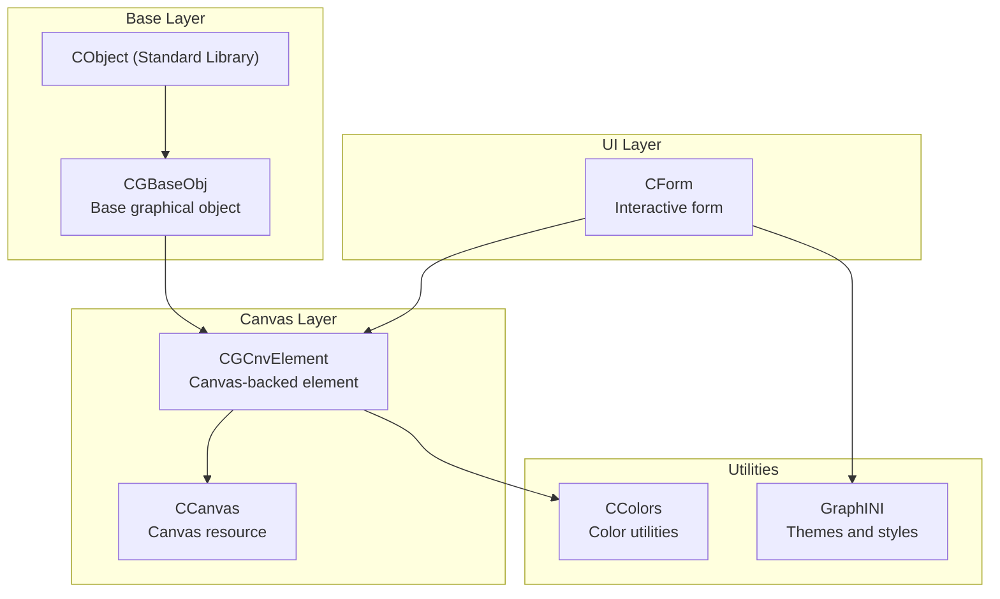
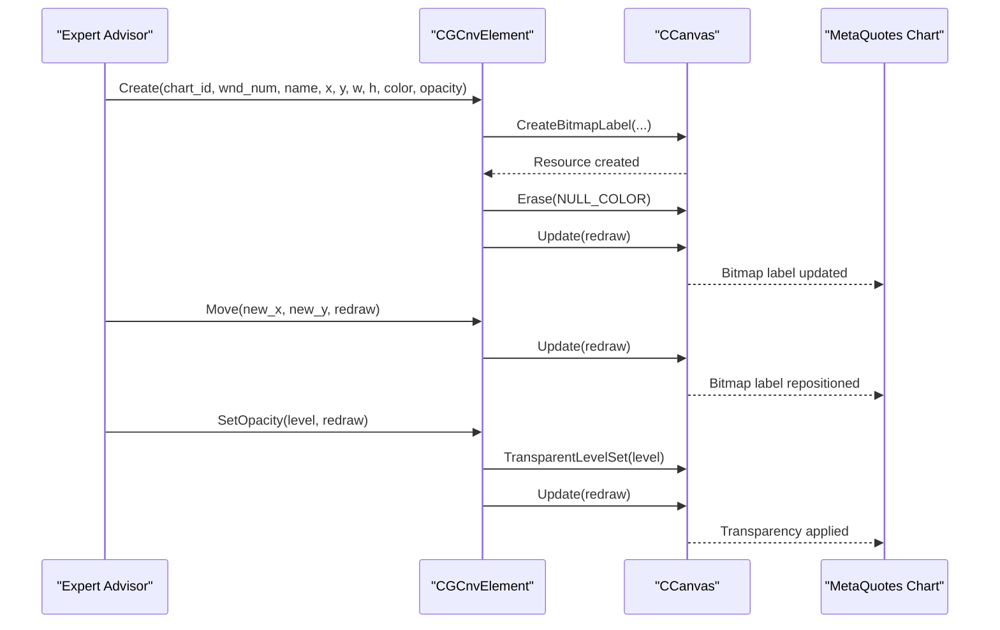
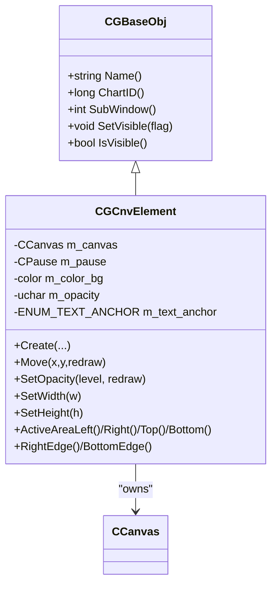
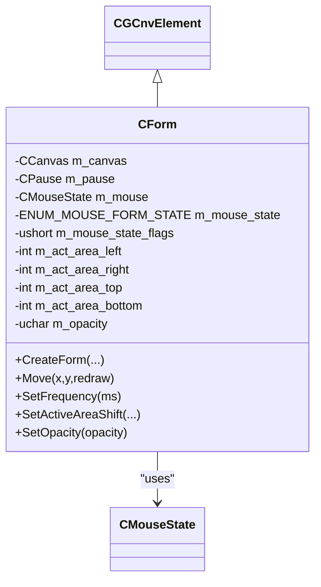
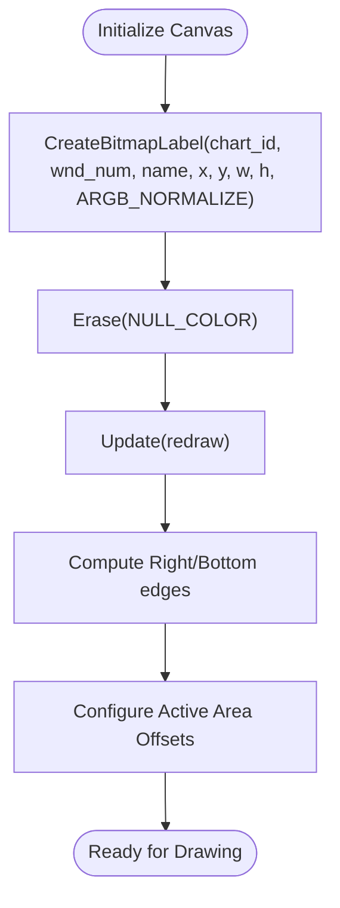
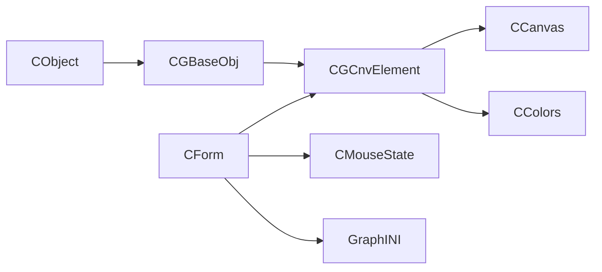

# CCanvas Drawing System

<cite>
**Referenced Files in This Document**
- [graphics_in_doeasy_library__part_73___form_object_of_a_graphical_element.md](file://data/scraped_articles/expert_advisors/graphics_in_doeasy_library__part_73___form_object_of_a_graphical_element.md)
- [graphics_in_doeasy_library__part_74___basic_graphical_element_powered_by_the_ccanvas_class.md](file://data/scraped_articles/expert_advisors/graphics_in_doeasy_library__part_74___basic_graphical_element_powered_by_the_ccanvas_class.md)
- [graphics_in_doeasy_library__part_75___methods_of_handling_primitives_and_text_in_the_basic_graphical.md](file://data/scraped_articles/expert_advisors/graphics_in_doeasy_library__part_75___methods_of_handling_primitives_and_text_in_the_basic_graphical.md)
- [graphics_in_doeasy_library__part_76___form_object_and_predefined_color_themes.md](file://data/scraped_articles/expert_advisors/graphics_in_doeasy_library__part_76___form_object_and_predefined_color_themes.md)
</cite>

## Table of Contents
1. [Introduction](#introduction)
2. [Project Structure](#project-structure)
3. [Core Components](#core-components)
4. [Architecture Overview](#architecture-overview)
5. [Detailed Component Analysis](#detailed-component-analysis)
6. [Dependency Analysis](#dependency-analysis)
7. [Performance Considerations](#performance-considerations)
8. [Troubleshooting Guide](#troubleshooting-guide)
9. [Conclusion](#conclusion)

## Introduction
This document explains the CCanvas drawing system in MQL5 as implemented in the DoEasy library. It covers the canvas-based approach to custom graphics, primitive drawing operations, text rendering, and the form object system for reusable graphical components. It also documents canvas initialization, coordinate systems, drawing context management, and performance considerations for real-time chart updates. Finally, it outlines the relationship between canvas operations and MetaQuotes chart objects.

## Project Structure
The CCanvas system is implemented as part of a layered graphics framework:
- Base object hierarchy for all library graphical objects
- Canvas-backed graphical element with property management
- Form object that extends the element with interactivity and layout
- Color utilities and predefined themes for consistent visuals
- Primitives and text rendering helpers

**Diagram sources**
- [graphics_in_doeasy_library__part_73___form_object_of_a_graphical_element.md](file://data/scraped_articles/expert_advisors/graphics_in_doeasy_library__part_73___form_object_of_a_graphical_element.md#L612-L733)
- [graphics_in_doeasy_library__part_74___basic_graphical_element_powered_by_the_ccanvas_class.md](file://data/scraped_articles/expert_advisors/graphics_in_doeasy_library__part_74___basic_graphical_element_powered_by_the_ccanvas_class.md#L322-L468)
- [graphics_in_doeasy_library__part_75___methods_of_handling_primitives_and_text_in_the_basic_graphical.md](file://data/scraped_articles/expert_advisors/graphics_in_doeasy_library__part_75___methods_of_handling_primitives_and_text_in_the_basic_graphical.md#L189-L237)
- [graphics_in_doeasy_library__part_76___form_object_and_predefined_color_themes.md](file://data/scraped_articles/expert_advisors/graphics_in_doeasy_library__part_76___form_object_and_predefined_color_themes.md#L755-L800)

**Section sources**
- [graphics_in_doeasy_library__part_73___form_object_of_a_graphical_element.md](file://data/scraped_articles/expert_advisors/graphics_in_doeasy_library__part_73___form_object_of_a_graphical_element.md#L583-L733)
- [graphics_in_doeasy_library__part_74___basic_graphical_element_powered_by_the_ccanvas_class.md](file://data/scraped_articles/expert_advisors/graphics_in_doeasy_library__part_74___basic_graphical_element_powered_by_the_ccanvas_class.md#L297-L468)
- [graphics_in_doeasy_library__part_75___methods_of_handling_primitives_and_text_in_the_basic_graphical.md](file://data/scraped_articles/expert_advisors/graphics_in_doeasy_library__part_75___methods_of_handling_primitives_and_text_in_the_basic_graphical.md#L189-L237)
- [graphics_in_doeasy_library__part_76___form_object_and_predefined_color_themes.md](file://data/scraped_articles/expert_advisors/graphics_in_doeasy_library__part_76___form_object_and_predefined_color_themes.md#L755-L800)

## Core Components
- CGBaseObj: Base class for all library graphical objects, holding program-specific naming, chart context, and visibility control.
- CGCnvElement: Canvas-backed element with property arrays, canvas resource, and drawing helpers. Manages coordinates, sizing, opacity, and active areas.
- CForm: Interactive form built on CGCnvElement, adding mouse state handling, moveability, and layout controls.
- CCanvas: Canvas resource for bitmap label creation, erase, resize, and update operations.
- CColors: Static color utilities for conversions and blending.
- GraphINI: Theme and style definitions for consistent visuals.

**Section sources**
- [graphics_in_doeasy_library__part_74___basic_graphical_element_powered_by_the_ccanvas_class.md](file://data/scraped_articles/expert_advisors/graphics_in_doeasy_library__part_74___basic_graphical_element_powered_by_the_ccanvas_class.md#L322-L468)
- [graphics_in_doeasy_library__part_73___form_object_of_a_graphical_element.md](file://data/scraped_articles/expert_advisors/graphics_in_doeasy_library__part_73___form_object_of_a_graphical_element.md#L612-L733)
- [graphics_in_doeasy_library__part_75___methods_of_handling_primitives_and_text_in_the_basic_graphical.md](file://data/scraped_articles/expert_advisors/graphics_in_doeasy_library__part_75___methods_of_handling_primitives_and_text_in_the_basic_graphical.md#L189-L237)
- [graphics_in_doeasy_library__part_76___form_object_and_predefined_color_themes.md](file://data/scraped_articles/expert_advisors/graphics_in_doeasy_library__part_76___form_object_and_predefined_color_themes.md#L755-L800)

## Architecture Overview
The system uses a canvas-first design:
- CGCnvElement creates and manages a CCanvas resource bound to a chart object.
- Drawing operations are performed on the canvas and committed via Update().
- Property arrays and variables track geometry, opacity, colors, and active areas.
- CForm extends the element with mouse interaction and layout management.

**Diagram sources**
- [graphics_in_doeasy_library__part_74___basic_graphical_element_powered_by_the_ccanvas_class.md](file://data/scraped_articles/expert_advisors/graphics_in_doeasy_library__part_74___basic_graphical_element_powered_by_the_ccanvas_class.md#L625-L651)
- [graphics_in_doeasy_library__part_74___basic_graphical_element_powered_by_the_ccanvas_class.md](file://data/scraped_articles/expert_advisors/graphics_in_doeasy_library__part_74___basic_graphical_element_powered_by_the_ccanvas_class.md#L693-L706)
- [graphics_in_doeasy_library__part_74___basic_graphical_element_powered_by_the_ccanvas_class.md](file://data/scraped_articles/expert_advisors/graphics_in_doeasy_library__part_74___basic_graphical_element_powered_by_the_ccanvas_class.md#L699-L704)

## Detailed Component Analysis

### CGCnvElement: Canvas-backed Element
Responsibilities:
- Initialize and manage a CCanvas resource with CreateBitmapLabel.
- Provide property arrays and simplified accessors for coordinates, sizes, opacity, and active areas.
- Support resizing via Resize and transparency via TransparentLevelSet.
- Manage visibility and bring-to-top behavior through the base object.

Key behaviors:
- Create(): Creates the canvas resource, clears with NULL_COLOR, and updates the chart.
- Move(): Updates OBJPROP_XDISTANCE/OBJPROP_YDISTANCE and properties; optionally redraws the chart.
- SetOpacity(): Applies transparency to the canvas and updates.

**Diagram sources**
- [graphics_in_doeasy_library__part_74___basic_graphical_element_powered_by_the_ccanvas_class.md](file://data/scraped_articles/expert_advisors/graphics_in_doeasy_library__part_74___basic_graphical_element_powered_by_the_ccanvas_class.md#L322-L468)

**Section sources**
- [graphics_in_doeasy_library__part_74___basic_graphical_element_powered_by_the_ccanvas_class.md](file://data/scraped_articles/expert_advisors/graphics_in_doeasy_library__part_74___basic_graphical_element_powered_by_the_ccanvas_class.md#L322-L468)
- [graphics_in_doeasy_library__part_74___basic_graphical_element_powered_by_the_ccanvas_class.md](file://data/scraped_articles/expert_advisors/graphics_in_doeasy_library__part_74___basic_graphical_element_powered_by_the_ccanvas_class.md#L625-L651)
- [graphics_in_doeasy_library__part_74___basic_graphical_element_powered_by_the_ccanvas_class.md](file://data/scraped_articles/expert_advisors/graphics_in_doeasy_library__part_74___basic_graphical_element_powered_by_the_ccanvas_class.md#L693-L706)

### CForm: Interactive Form Object
Responsibilities:
- Extend CGCnvElement with mouse state handling and interactive behaviors.
- Manage active area offsets and opacity.
- Provide Move() with redraw control and BringToTop() to elevate the form.

Implementation highlights:
- Stores CMouseState and CPause for input and timing.
- Uses a 16 ms update cadence to balance responsiveness and performance.
- Supports moving within the chart and adjusting active area insets.

**Diagram sources**
- [graphics_in_doeasy_library__part_73___form_object_of_a_graphical_element.md](file://data/scraped_articles/expert_advisors/graphics_in_doeasy_library__part_73___form_object_of_a_graphical_element.md#L612-L733)

**Section sources**
- [graphics_in_doeasy_library__part_73___form_object_of_a_graphical_element.md](file://data/scraped_articles/expert_advisors/graphics_in_doeasy_library__part_73___form_object_of_a_graphical_element.md#L56-L57)
- [graphics_in_doeasy_library__part_73___form_object_of_a_graphical_element.md](file://data/scraped_articles/expert_advisors/graphics_in_doeasy_library__part_73___form_object_of_a_graphical_element.md#L612-L733)

### Primitives and Text Rendering
Capabilities:
- Drawing primitives and text via CCanvas methods.
- Text alignment anchors via ENUM_TEXT_ANCHOR flags.
- Erase with NULL_COLOR to preserve alpha channel during redraws.
- Color manipulation using CColors for blending and lightness adjustments.

Practical usage patterns:
- Clear canvas with Erase(NULL_COLOR) before drawing.
- Use TextOut with anchor flags for precise text placement.
- Blend colors using CColors::BlendColors for overlays.

**Section sources**
- [graphics_in_doeasy_library__part_75___methods_of_handling_primitives_and_text_in_the_basic_graphical.md](file://data/scraped_articles/expert_advisors/graphics_in_doeasy_library__part_75___methods_of_handling_primitives_and_text_in_the_basic_graphical.md#L47-L67)
- [graphics_in_doeasy_library__part_75___methods_of_handling_primitives_and_text_in_the_basic_graphical.md](file://data/scraped_articles/expert_advisors/graphics_in_doeasy_library__part_75___methods_of_handling_primitives_and_text_in_the_basic_graphical.md#L89-L156)
- [graphics_in_doeasy_library__part_75___methods_of_handling_primitives_and_text_in_the_basic_graphical.md](file://data/scraped_articles/expert_advisors/graphics_in_doeasy_library__part_75___methods_of_handling_primitives_and_text_in_the_basic_graphical.md#L189-L237)

### Coordinate Systems and Canvas Initialization
- Canvas origin and bounds: width/height from the canvas resource; right/bottom edges computed from coordinates.
- Active area: configurable offsets from each edge to define interactive regions.
- Initialization: CreateBitmapLabel with COLOR_FORMAT_ARGB_NORMALIZE; Erase with NULL_COLOR; Update to commit.

**Diagram sources**
- [graphics_in_doeasy_library__part_74___basic_graphical_element_powered_by_the_ccanvas_class.md](file://data/scraped_articles/expert_advisors/graphics_in_doeasy_library__part_74___basic_graphical_element_powered_by_the_ccanvas_class.md#L625-L651)

**Section sources**
- [graphics_in_doeasy_library__part_74___basic_graphical_element_powered_by_the_ccanvas_class.md](file://data/scraped_articles/expert_advisors/graphics_in_doeasy_library__part_74___basic_graphical_element_powered_by_the_ccanvas_class.md#L450-L453)
- [graphics_in_doeasy_library__part_74___basic_graphical_element_powered_by_the_ccanvas_class.md](file://data/scraped_articles/expert_advisors/graphics_in_doeasy_library__part_74___basic_graphical_element_powered_by_the_ccanvas_class.md#L440-L459)

### Relationship to MetaQuotes Chart Objects
- The canvas resource is bound to a chart object via CreateBitmapLabel.
- Positioning is managed by setting OBJPROP_XDISTANCE/OBJPROP_YDISTANCE.
- Visibility is controlled via OBJPROP_TIMEFRAMES (OBJ_ALL_PERIODS vs hidden).
- Bringing to top is achieved by toggling visibility.

**Section sources**
- [graphics_in_doeasy_library__part_74___basic_graphical_element_powered_by_the_ccanvas_class.md](file://data/scraped_articles/expert_advisors/graphics_in_doeasy_library__part_74___basic_graphical_element_powered_by_the_ccanvas_class.md#L718-L764)
- [graphics_in_doeasy_library__part_76___form_object_and_predefined_color_themes.md](file://data/scraped_articles/expert_advisors/graphics_in_doeasy_library__part_76___form_object_and_predefined_color_themes.md#L232-L244)

## Dependency Analysis
The system exhibits clear layering:
- CGBaseObj depends on standard library CObject and chart APIs.
- CGCnvElement depends on CCanvas and property management.
- CForm depends on CGCnvElement, CMouseState, and CPause.
- Utilities (CColors, GraphINI) support color and theme consistency.

**Diagram sources**
- [graphics_in_doeasy_library__part_73___form_object_of_a_graphical_element.md](file://data/scraped_articles/expert_advisors/graphics_in_doeasy_library__part_73___form_object_of_a_graphical_element.md#L612-L733)
- [graphics_in_doeasy_library__part_74___basic_graphical_element_powered_by_the_ccanvas_class.md](file://data/scraped_articles/expert_advisors/graphics_in_doeasy_library__part_74___basic_graphical_element_powered_by_the_ccanvas_class.md#L322-L468)
- [graphics_in_doeasy_library__part_75___methods_of_handling_primitives_and_text_in_the_basic_graphical.md](file://data/scraped_articles/expert_advisors/graphics_in_doeasy_library__part_75___methods_of_handling_primitives_and_text_in_the_basic_graphical.md#L189-L237)
- [graphics_in_doeasy_library__part_76___form_object_and_predefined_color_themes.md](file://data/scraped_articles/expert_advisors/graphics_in_doeasy_library__part_76___form_object_and_predefined_color_themes.md#L755-L800)

**Section sources**
- [graphics_in_doeasy_library__part_73___form_object_of_a_graphical_element.md](file://data/scraped_articles/expert_advisors/graphics_in_doeasy_library__part_73___form_object_of_a_graphical_element.md#L612-L733)
- [graphics_in_doeasy_library__part_74___basic_graphical_element_powered_by_the_ccanvas_class.md](file://data/scraped_articles/expert_advisors/graphics_in_doeasy_library__part_74___basic_graphical_element_powered_by_the_ccanvas_class.md#L322-L468)
- [graphics_in_doeasy_library__part_75___methods_of_handling_primitives_and_text_in_the_basic_graphical.md](file://data/scraped_articles/expert_advisors/graphics_in_doeasy_library__part_75___methods_of_handling_primitives_and_text_in_the_basic_graphical.md#L189-L237)
- [graphics_in_doeasy_library__part_76___form_object_and_predefined_color_themes.md](file://data/scraped_articles/expert_advisors/graphics_in_doeasy_library__part_76___form_object_and_predefined_color_themes.md#L755-L800)

## Performance Considerations
- Update throttling: Canvas updates are limited to approximately 60 FPS (16 ms interval) to reduce unnecessary redraw overhead while maintaining smoothness.
- Batch updates: Composite forms should delay ChartRedraw until all child elements are updated to minimize chart refreshes.
- Alpha preservation: Use NULL_COLOR for Erase to maintain transparency channels and avoid artifacts during redraws.
- Opacity control: Apply TransparentLevelSet on the canvas to adjust element opacity efficiently.

**Section sources**
- [graphics_in_doeasy_library__part_73___form_object_of_a_graphical_element.md](file://data/scraped_articles/expert_advisors/graphics_in_doeasy_library__part_73___form_object_of_a_graphical_element.md#L56-L57)
- [graphics_in_doeasy_library__part_75___methods_of_handling_primitives_and_text_in_the_basic_graphical.md](file://data/scraped_articles/expert_advisors/graphics_in_doeasy_library__part_75___methods_of_handling_primitives_and_text_in_the_basic_graphical.md#L47-L67)
- [graphics_in_doeasy_library__part_74___basic_graphical_element_powered_by_the_ccanvas_class.md](file://data/scraped_articles/expert_advisors/graphics_in_doeasy_library__part_74___basic_graphical_element_powered_by_the_ccanvas_class.md#L699-L704)

## Troubleshooting Guide
Common issues and remedies:
- Canvas not visible: Ensure OBJPROP_TIMEFRAMES is set to OBJ_ALL_PERIODS; toggle visibility to bring to front.
- Incorrect transparency: Use Erase(NULL_COLOR) to clear the canvas preserving alpha.
- Positioning drift: Verify OBJPROP_XDISTANCE/OBJPROP_YDISTANCE values and use Move() to synchronize properties.
- Overdraw artifacts: Limit redraw frequency and batch updates to reduce flicker.

**Section sources**
- [graphics_in_doeasy_library__part_76___form_object_and_predefined_color_themes.md](file://data/scraped_articles/expert_advisors/graphics_in_doeasy_library__part_76___form_object_and_predefined_color_themes.md#L232-L244)
- [graphics_in_doeasy_library__part_75___methods_of_handling_primitives_and_text_in_the_basic_graphical.md](file://data/scraped_articles/expert_advisors/graphics_in_doeasy_library__part_75___methods_of_handling_primitives_and_text_in_the_basic_graphical.md#L47-L67)
- [graphics_in_doeasy_library__part_74___basic_graphical_element_powered_by_the_ccanvas_class.md](file://data/scraped_articles/expert_advisors/graphics_in_doeasy_library__part_74___basic_graphical_element_powered_by_the_ccanvas_class.md#L718-L764)

## Conclusion
The CCanvas drawing system in MQL5, as implemented in the DoEasy library, provides a robust, layered approach to custom graphics:
- Canvas-backed elements encapsulate drawing resources and properties.
- Forms add interactivity and layout controls with efficient update strategies.
- Primitives and text rendering are supported with precise alignment and color utilities.
- Performance is optimized through update throttling, alpha-aware clearing, and batched chart updates.
- Integration with MetaQuotes chart objects ensures seamless positioning, visibility, and z-order management.