# Chart Objects Management

<cite>
**Referenced Files in This Document**
- [TestCoreModules.mq5](file://src/mql5/Experts/TestCoreModules.mq5)
- [TestRiskModules.mq5](file://src/mql5/Experts/TestRiskModules.mq5)
- [other_classes_in_doeasy_library__part_67___chart_object_class.md](file://data/scraped_articles/expert_advisors/other_classes_in_doeasy_library__part_67___chart_object_class.md)
- [other_classes_in_doeasy_library__part_68___chart_window_object_class_and_indicator_object_classes_in.md](file://data/scraped_articles/expert_advisors/other_classes_in_doeasy_library__part_68___chart_window_object_class_and_indicator_object_classes_in.md)
- [other_classes_in_doeasy_library__part_69___chart_object_collection_class.md](file://data/scraped_articles/expert_advisors/other_classes_in_doeasy_library__part_69___chart_object_collection_class.md)
- [other_classes_in_doeasy_library__part_71___chart_object_collection_events.md](file://data/scraped_articles/expert_advisors/other_classes_in_doeasy_library__part_71___chart_object_collection_events.md)
- [other_classes_in_doeasy_library__part_72___tracking_and_recording_chart_object_parameters_in_the_col.md](file://data/scraped_articles/expert_advisors/other_classes_in_doeasy_library__part_72___tracking_and_recording_chart_object_parameters_in_the_col.md)
- [building_interactive_semi-automatic_drag-and-drop_expert_advisor_based_on_predefined_risk_and_r_r_ra.md](file://data/scraped_articles/expert_advisors/building_interactive_semi-automatic_drag-and-drop_expert_advisor_based_on_predefined_risk_and_r_r_ra.md)
- [introduction_to_mql5__part_24___building_an_ea_that_trades_with_chart_objects.md](file://data/scraped_articles/trading/introduction_to_mql5__part_24___building_an_ea_that_trades_with_chart_objects.md)
- [introduction_to_mql5__part_25___building_an_ea_that_trades_with_chart_objects__ii.md](file://data/scraped_articles/trading_systems/introduction_to_mql5__part_25___building_an_ea_that_trades_with_chart_objects__ii.md)
</cite>

## Table of Contents
1. [Introduction](#introduction)
2. [Project Structure](#project-structure)
3. [Core Components](#core-components)
4. [Architecture Overview](#architecture-overview)
5. [Detailed Component Analysis](#detailed-component-analysis)
6. [Dependency Analysis](#dependency-analysis)
7. [Performance Considerations](#performance-considerations)
8. [Troubleshooting Guide](#troubleshooting-guide)
9. [Conclusion](#conclusion)
10. [Appendices](#appendices)

## Introduction
This document explains how to manage Metatrader 5 chart objects using the MQL5 standard library and related patterns. It covers the lifecycle of chart objects (creation, modification, visibility, persistence, and cleanup), the class hierarchy for chart objects and collections, window-specific handling, integration with indicators, event-driven updates, and best practices for performance and memory when rendering many objects on charts.

Where applicable, this guide references authoritative MQL5 documentation and community-derived materials that describe chart object classes, collections, and event handling.

## Project Structure
The repository includes MQL5 Expert Advisors under development and a set of MQL5-related articles that document chart object usage patterns. While the core chart object classes are part of the MQL5 standard library, the repository’s articles provide practical examples and patterns for managing chart objects in trading panels and interactive overlays.

**Diagram sources**
- [TestCoreModules.mq5](file://src/mql5/Experts/TestCoreModules.mq5#L1-L266)
- [TestRiskModules.mq5](file://src/mql5/Experts/TestRiskModules.mq5#L1-L303)
- [other_classes_in_doeasy_library__part_67___chart_object_class.md](file://data/scraped_articles/expert_advisors/other_classes_in_doeasy_library__part_67___chart_object_class.md)
- [other_classes_in_doeasy_library__part_68___chart_window_object_class_and_indicator_object_classes_in.md](file://data/scraped_articles/expert_advisors/other_classes_in_doeasy_library__part_68___chart_window_object_class_and_indicator_object_classes_in.md)
- [other_classes_in_doeasy_library__part_69___chart_object_collection_class.md](file://data/scraped_articles/expert_advisors/other_classes_in_doeasy_library__part_69___chart_object_collection_class.md)
- [other_classes_in_doeasy_library__part_71___chart_object_collection_events.md](file://data/scraped_articles/expert_advisors/other_classes_in_doeasy_library__part_71___chart_object_collection_events.md)
- [other_classes_in_doeasy_library__part_72___tracking_and_recording_chart_object_parameters_in_the_col.md](file://data/scraped_articles/expert_advisors/other_classes_in_doeasy_library__part_72___tracking_and_recording_chart_object_parameters_in_the_col.md)
- [building_interactive_semi-automatic_drag-and-drop_expert_advisor_based_on_predefined_risk_and_r_r_ra.md](file://data/scraped_articles/expert_advisors/building_interactive_semi-automatic_drag-and-drop_expert_advisor_based_on_predefined_risk_and_r_r_ra.md)
- [introduction_to_mql5__part_24___building_an_ea_that_trades_with_chart_objects.md](file://data/scraped_articles/trading/introduction_to_mql5__part_24___building_an_ea_that_trades_with_chart_objects.md)
- [introduction_to_mql5__part_25___building_an_ea_that_trades_with_chart_objects__ii.md](file://data/scraped_articles/trading_systems/introduction_to_mql5__part_25___building_an_ea_that_trades_with_chart_objects__ii.md)

**Section sources**
- [TestCoreModules.mq5](file://src/mql5/Experts/TestCoreModules.mq5#L1-L266)
- [TestRiskModules.mq5](file://src/mql5/Experts/TestRiskModules.mq5#L1-L303)

## Core Components
- Chart object classes: The MQL5 standard library provides a family of chart object classes for drawing shapes, labels, buttons, edits, bitmaps, and panels on a chart. These include, for example, CChartObjectLabel, CChartObjectEdit, CChartObjectButton, CChartObjectRectangle, CChartObjectBitmap, and CChartObjectBmpLabel. See:
  - [other_classes_in_doeasy_library__part_67___chart_object_class.md](file://data/scraped_articles/expert_advisors/other_classes_in_doeasy_library__part_67___chart_object_class.md)
  - [building_interactive_semi-automatic_drag-and-drop_expert_advisor_based_on_predefined_risk_and_r_r_ra.md](file://data/scraped_articles/expert_advisors/building_interactive_semi-automatic_drag-and-drop_expert_advisor_based_on_predefined_risk_and_r_r_ra.md)
- Chart object collections: Collections help manage groups of chart objects, enumerate them, and synchronize with chart windows. See:
  - [other_classes_in_doeasy_library__part_69___chart_object_collection_class.md](file://data/scraped_articles/expert_advisors/other_classes_in_doeasy_library__part_69___chart_object_collection_class.md)
- Events and collection events: Collection-level events enable reacting to object additions/removals and state changes. See:
  - [other_classes_in_doeasy_library__part_71___chart_object_collection_events.md](file://data/scraped_articles/expert_advisors/other_classes_in_doeasy_library__part_71___chart_object_collection_events.md)
- Tracking and recording parameters: Persisting and replaying object parameters supports dynamic UI updates and state restoration. See:
  - [other_classes_in_doeasy_library__part_72___tracking_and_recording_chart_object_parameters_in_the_col.md](file://data/scraped_articles/expert_advisors/other_classes_in_doeasy_library__part_72___tracking_and_recording_chart_object_parameters_in_the_col.md)
- Window-specific handling and indicator integration: Managing objects per chart window and integrating with indicator buffers is supported via collection and window APIs. See:
  - [other_classes_in_doeasy_library__part_68___chart_window_object_class_and_indicator_object_classes_in.md](file://data/scraped_articles/expert_advisors/other_classes_in_doeasy_library__part_68___chart_window_object_class_and_indicator_object_classes_in.md)

**Section sources**
- [other_classes_in_doeasy_library__part_67___chart_object_class.md](file://data/scraped_articles/expert_advisors/other_classes_in_doeasy_library__part_67___chart_object_class.md)
- [other_classes_in_doeasy_library__part_68___chart_window_object_class_and_indicator_object_classes_in.md](file://data/scraped_articles/expert_advisors/other_classes_in_doeasy_library__part_68___chart_window_object_class_and_indicator_object_classes_in.md)
- [other_classes_in_doeasy_library__part_69___chart_object_collection_class.md](file://data/scraped_articles/expert_advisors/other_classes_in_doeasy_library__part_69___chart_object_collection_class.md)
- [other_classes_in_doeasy_library__part_71___chart_object_collection_events.md](file://data/scraped_articles/expert_advisors/other_classes_in_doeasy_library__part_71___chart_object_collection_events.md)
- [other_classes_in_doeasy_library__part_72___tracking_and_recording_chart_object_parameters_in_the_col.md](file://data/scraped_articles/expert_advisors/other_classes_in_doeasy_library__part_72___tracking_and_recording_chart_object_parameters_in_the_col.md)
- [building_interactive_semi-automatic_drag-and-drop_expert_advisor_based_on_predefined_risk_and_r_r_ra.md](file://data/scraped_articles/expert_advisors/building_interactive_semi-automatic_drag-and-drop_expert_advisor_based_on_predefined_risk_and_r_r_ra.md)

## Architecture Overview
The recommended architecture for chart object management centers around:
- A collection that owns and orchestrates chart objects per chart window.
- Event handlers that react to object lifecycle changes and user interactions.
- Indicator-aware logic that positions and updates objects based on indicator buffers.
- Persistence layer to record and restore object parameters for dynamic UIs.

**Diagram sources**
- [other_classes_in_doeasy_library__part_69___chart_object_collection_class.md](file://data/scraped_articles/expert_advisors/other_classes_in_doeasy_library__part_69___chart_object_collection_class.md)
- [other_classes_in_doeasy_library__part_71___chart_object_collection_events.md](file://data/scraped_articles/expert_advisors/other_classes_in_doeasy_library__part_71___chart_object_collection_events.md)
- [other_classes_in_doeasy_library__part_72___tracking_and_recording_chart_object_parameters_in_the_col.md](file://data/scraped_articles/expert_advisors/other_classes_in_doeasy_library__part_72___tracking_and_recording_chart_object_parameters_in_the_col.md)
- [other_classes_in_doeasy_library__part_68___chart_window_object_class_and_indicator_object_classes_in.md](file://data/scraped_articles/expert_advisors/other_classes_in_doeasy_library__part_68___chart_window_object_class_and_indicator_object_classes_in.md)

## Detailed Component Analysis

### Chart Object Lifecycle
- Creation: Instantiate a specific chart object class (e.g., label, edit, button, rectangle, bitmap) and attach it to a chart window. Set initial properties such as coordinates, color, font, and value.
- Modification: Update properties dynamically (position, text, visibility, colors) in response to price changes, user input, or indicator updates.
- Visibility: Toggle visibility per object or per group to reduce clutter and improve performance.
- Persistence: Record object parameters (positions, values, styles) to support restoration after reinitialization or chart switches.
- Cleanup: Remove objects from the collection and destroy them when no longer needed to free resources.

**Diagram sources**
- [other_classes_in_doeasy_library__part_67___chart_object_class.md](file://data/scraped_articles/expert_advisors/other_classes_in_doeasy_library__part_67___chart_object_class.md)
- [other_classes_in_doeasy_library__part_72___tracking_and_recording_chart_object_parameters_in_the_col.md](file://data/scraped_articles/expert_advisors/other_classes_in_doeasy_library__part_72___tracking_and_recording_chart_object_parameters_in_the_col.md)

**Section sources**
- [other_classes_in_doeasy_library__part_67___chart_object_class.md](file://data/scraped_articles/expert_advisors/other_classes_in_doeasy_library__part_67___chart_object_class.md)
- [other_classes_in_doeasy_library__part_72___tracking_and_recording_chart_object_parameters_in_the_col.md](file://data/scraped_articles/expert_advisors/other_classes_in_doeasy_library__part_72___tracking_and_recording_chart_object_parameters_in_the_col.md)

### Chart Object Class Hierarchy and Responsibilities
- CChartObjectLabel: Static or dynamic text labels on the chart.
- CChartObjectEdit: Editable fields for user input.
- CChartObjectButton: Interactive buttons for actions.
- CChartObjectRectangle: Filled or framed rectangles for highlighting areas.
- CChartObjectBitmap: Bitmap images for backgrounds or icons.
- CChartObjectBmpLabel: Background image with overlaid labels.

**Diagram sources**
- [building_interactive_semi-automatic_drag-and-drop_expert_advisor_based_on_predefined_risk_and_r_r_ra.md](file://data/scraped_articles/expert_advisors/building_interactive_semi-automatic_drag-and-drop_expert_advisor_based_on_predefined_risk_and_r_r_ra.md)
- [other_classes_in_doeasy_library__part_67___chart_object_class.md](file://data/scraped_articles/expert_advisors/other_classes_in_doeasy_library__part_67___chart_object_class.md)

**Section sources**
- [building_interactive_semi-automatic_drag-and-drop_expert_advisor_based_on_predefined_risk_and_r_r_ra.md](file://data/scraped_articles/expert_advisors/building_interactive_semi-automatic_drag-and-drop_expert_advisor_based_on_predefined_risk_and_r_r_ra.md)
- [other_classes_in_doeasy_library__part_67___chart_object_class.md](file://data/scraped_articles/expert_advisors/other_classes_in_doeasy_library__part_67___chart_object_class.md)

### Chart Object Collection Management
- Collection creation and population: Build a collection per chart window, adding objects as needed.
- Enumeration and synchronization: Iterate over objects to update positions or styles based on price/time/index.
- Event-driven updates: Subscribe to collection events to react to object changes automatically.
- Persistence: Record parameters for each object so they can be restored later.

**Diagram sources**
- [other_classes_in_doeasy_library__part_69___chart_object_collection_class.md](file://data/scraped_articles/expert_advisors/other_classes_in_doeasy_library__part_69___chart_object_collection_class.md)
- [other_classes_in_doeasy_library__part_71___chart_object_collection_events.md](file://data/scraped_articles/expert_advisors/other_classes_in_doeasy_library__part_71___chart_object_collection_events.md)
- [other_classes_in_doeasy_library__part_72___tracking_and_recording_chart_object_parameters_in_the_col.md](file://data/scraped_articles/expert_advisors/other_classes_in_doeasy_library__part_72___tracking_and_recording_chart_object_parameters_in_the_col.md)

**Section sources**
- [other_classes_in_doeasy_library__part_69___chart_object_collection_class.md](file://data/scraped_articles/expert_advisors/other_classes_in_doeasy_library__part_69___chart_object_collection_class.md)
- [other_classes_in_doeasy_library__part_71___chart_object_collection_events.md](file://data/scraped_articles/expert_advisors/other_classes_in_doeasy_library__part_71___chart_object_collection_events.md)
- [other_classes_in_doeasy_library__part_72___tracking_and_recording_chart_object_parameters_in_the_col.md](file://data/scraped_articles/expert_advisors/other_classes_in_doeasy_library__part_72___tracking_and_recording_chart_object_parameters_in_the_col.md)

### Window-Specific Object Handling and Indicator Integration
- Per-window management: Maintain separate collections for each chart window to avoid cross-contamination of UI elements.
- Indicator-aware positioning: Use indicator buffer values to position overlays (e.g., horizontal lines at support/resistance derived from indicator values).
- Dynamic updates: Recalculate object coordinates and redraw when the chart is scrolled or resized.

```mermaid
flowchart TD
WStart["Window Opened"] --> CreateCol["Create Collection for Window"]
CreateCol --> BindInd["Bind to Indicator Buffers"]
BindInd --> Position["Compute Positions from Buffers"]
Position --> Draw["Draw/Update Objects"]
Draw --> Resize{"Chart Resized/Scrolled?"}
Resize --> |Yes| Recompute["Recompute Positions"]
Recompute --> Draw
Resize --> |No| Wait["Wait for Events"]
Wait --> Destroy["Window Closed"]
Destroy --> Cleanup["Delete Objects and Collection"]
```

**Diagram sources**
- [other_classes_in_doeasy_library__part_68___chart_window_object_class_and_indicator_object_classes_in.md](file://data/scraped_articles/expert_advisors/other_classes_in_doeasy_library__part_68___chart_window_object_class_and_indicator_object_classes_in.md)

**Section sources**
- [other_classes_in_doeasy_library__part_68___chart_window_object_class_and_indicator_object_classes_in.md](file://data/scraped_articles/expert_advisors/other_classes_in_doeasy_library__part_68___chart_window_object_class_and_indicator_object_classes_in.md)

### Event Handling Mechanisms
- Collection events: Listen for object addition, removal, and property changes to trigger UI updates or persistence routines.
- User interaction events: Buttons and edits emit events when clicked or edited; route these to handler logic.
- Indicator updates: Subscribe to indicator recalculation signals to refresh overlay positions.

**Diagram sources**
- [other_classes_in_doeasy_library__part_71___chart_object_collection_events.md](file://data/scraped_articles/expert_advisors/other_classes_in_doeasy_library__part_71___chart_object_collection_events.md)
- [other_classes_in_doeasy_library__part_68___chart_window_object_class_and_indicator_object_classes_in.md](file://data/scraped_articles/expert_advisors/other_classes_in_doeasy_library__part_68___chart_window_object_class_and_indicator_object_classes_in.md)

**Section sources**
- [other_classes_in_doeasy_library__part_71___chart_object_collection_events.md](file://data/scraped_articles/expert_advisors/other_classes_in_doeasy_library__part_71___chart_object_collection_events.md)
- [other_classes_in_doeasy_library__part_68___chart_window_object_class_and_indicator_object_classes_in.md](file://data/scraped_articles/expert_advisors/other_classes_in_doeasy_library__part_68___chart_window_object_class_and_indicator_object_classes_in.md)

### Examples of Dynamic Object Creation
- Trading panels: Create a background bitmap, labels for prices and computed metrics, editable fields for inputs, and buttons for actions. See:
  - [building_interactive_semi-automatic_drag-and-drop_expert_advisor_based_on_predefined_risk_and_r_r_ra.md](file://data/scraped_articles/expert_advisors/building_interactive_semi-automatic_drag-and-drop_expert_advisor_based_on_predefined_risk_and_r_r_ra.md)
- Real-time data visualization: Draw overlays aligned to indicator buffers (e.g., bands, thresholds) and update them on each tick.
  - [introduction_to_mql5__part_24___building_an_ea_that_trades_with_chart_objects.md](file://data/scraped_articles/trading/introduction_to_mql5__part_24___building_an_ea_that_trades_with_chart_objects.md)
  - [introduction_to_mql5__part_25___building_an_ea_that_trades_with_chart_objects__ii.md](file://data/scraped_articles/trading_systems/introduction_to_mql5__part_25___building_an_ea_that_trades_with_chart_objects__ii.md)
- Interactive chart overlays: Use draggable pointers or selection regions to capture user-defined zones and compute derived metrics.

**Section sources**
- [building_interactive_semi-automatic_drag-and-drop_expert_advisor_based_on_predefined_risk_and_r_r_ra.md](file://data/scraped_articles/expert_advisors/building_interactive_semi-automatic_drag-and-drop_expert_advisor_based_on_predefined_risk_and_r_r_ra.md)
- [introduction_to_mql5__part_24___building_an_ea_that_trades_with_chart_objects.md](file://data/scraped_articles/trading/introduction_to_mql5__part_24___building_an_ea_that_trades_with_chart_objects.md)
- [introduction_to_mql5__part_25___building_an_ea_that_trades_with_chart_objects__ii.md](file://data/scraped_articles/trading_systems/introduction_to_mql5__part_25___building_an_ea_that_trades_with_chart_objects__ii.md)

## Dependency Analysis
- The Expert Advisors in this repository demonstrate module usage and can serve as integration anchors for chart object logic.
- Chart object management depends on:
  - MQL5 standard library classes (CChartObject*).
  - Collection APIs for enumeration and synchronization.
  - Event systems for reactive updates.
  - Indicator buffer access for dynamic positioning.

**Diagram sources**
- [TestCoreModules.mq5](file://src/mql5/Experts/TestCoreModules.mq5#L1-L266)
- [TestRiskModules.mq5](file://src/mql5/Experts/TestRiskModules.mq5#L1-L303)
- [other_classes_in_doeasy_library__part_69___chart_object_collection_class.md](file://data/scraped_articles/expert_advisors/other_classes_in_doeasy_library__part_69___chart_object_collection_class.md)
- [other_classes_in_doeasy_library__part_71___chart_object_collection_events.md](file://data/scraped_articles/expert_advisors/other_classes_in_doeasy_library__part_71___chart_object_collection_events.md)
- [other_classes_in_doeasy_library__part_68___chart_window_object_class_and_indicator_object_classes_in.md](file://data/scraped_articles/expert_advisors/other_classes_in_doeasy_library__part_68___chart_window_object_class_and_indicator_object_classes_in.md)

**Section sources**
- [TestCoreModules.mq5](file://src/mql5/Experts/TestCoreModules.mq5#L1-L266)
- [TestRiskModules.mq5](file://src/mql5/Experts/TestRiskModules.mq5#L1-L303)

## Performance Considerations
- Minimize redraws: Batch property updates and defer rendering until a stable state is reached.
- Use visibility toggles: Hide off-screen or inactive objects to reduce rendering overhead.
- Prefer lightweight primitives: Use simple shapes and minimal fonts to keep updates fast.
- Limit object count: Keep the number of live objects reasonable; remove stale ones promptly.
- Efficient enumeration: Iterate over visible or modified objects only when updating.
- Indicator-driven updates: Update only when indicator buffers change to avoid unnecessary work.

[No sources needed since this section provides general guidance]

## Troubleshooting Guide
- Objects not appearing:
  - Verify attachment to the correct chart ID and ensure the object is visible.
  - Confirm that the collection is populated and synchronized with the current chart.
- Positioning drift:
  - Recompute positions on chart resize or scroll events.
  - Align with indicator buffers rather than absolute pixel coordinates.
- Event handlers not firing:
  - Ensure subscription to collection events is active.
  - Check that object property changes are detected by the event system.
- Memory leaks or performance degradation:
  - Delete objects explicitly when removing them from the collection.
  - Avoid creating new objects repeatedly; reuse existing ones when possible.

**Section sources**
- [other_classes_in_doeasy_library__part_69___chart_object_collection_class.md](file://data/scraped_articles/expert_advisors/other_classes_in_doeasy_library__part_69___chart_object_collection_class.md)
- [other_classes_in_doeasy_library__part_71___chart_object_collection_events.md](file://data/scraped_articles/expert_advisors/other_classes_in_doeasy_library__part_71___chart_object_collection_events.md)
- [other_classes_in_doeasy_library__part_72___tracking_and_recording_chart_object_parameters_in_the_col.md](file://data/scraped_articles/expert_advisors/other_classes_in_doeasy_library__part_72___tracking_and_recording_chart_object_parameters_in_the_col.md)

## Conclusion
Managing chart objects effectively in MQL5 involves a clear lifecycle, a robust collection abstraction, event-driven updates, and careful window and indicator integration. By applying the patterns and best practices outlined here—such as batching updates, toggling visibility, persisting parameters, and cleaning up resources—you can build responsive, interactive, and performant chart overlays for trading panels and real-time visualizations.

[No sources needed since this section summarizes without analyzing specific files]

## Appendices
- Practical references for chart object classes and collections:
  - [other_classes_in_doeasy_library__part_67___chart_object_class.md](file://data/scraped_articles/expert_advisors/other_classes_in_doeasy_library__part_67___chart_object_class.md)
  - [other_classes_in_doeasy_library__part_68___chart_window_object_class_and_indicator_object_classes_in.md](file://data/scraped_articles/expert_advisors/other_classes_in_doeasy_library__part_68___chart_window_object_class_and_indicator_object_classes_in.md)
  - [other_classes_in_doeasy_library__part_69___chart_object_collection_class.md](file://data/scraped_articles/expert_advisors/other_classes_in_doeasy_library__part_69___chart_object_collection_class.md)
  - [other_classes_in_doeasy_library__part_71___chart_object_collection_events.md](file://data/scraped_articles/expert_advisors/other_classes_in_doeasy_library__part_71___chart_object_collection_events.md)
  - [other_classes_in_doeasy_library__part_72___tracking_and_recording_chart_object_parameters_in_the_col.md](file://data/scraped_articles/expert_advisors/other_classes_in_doeasy_library__part_72___tracking_and_recording_chart_object_parameters_in_the_col.md)
- Example-driven materials:
  - [building_interactive_semi-automatic_drag-and-drop_expert_advisor_based_on_predefined_risk_and_r_r_ra.md](file://data/scraped_articles/expert_advisors/building_interactive_semi-automatic_drag-and-drop_expert_advisor_based_on_predefined_r_r_ra.md)
  - [introduction_to_mql5__part_24___building_an_ea_that_trades_with_chart_objects.md](file://data/scraped_articles/trading/introduction_to_mql5__part_24___building_an_ea_that_trades_with_chart_objects.md)
  - [introduction_to_mql5__part_25___building_an_ea_that_trades_with_chart_objects__ii.md](file://data/scraped_articles/trading_systems/introduction_to_mql5__part_25___building_an_ea_that_trades_with_chart_objects__ii.md)