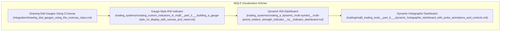
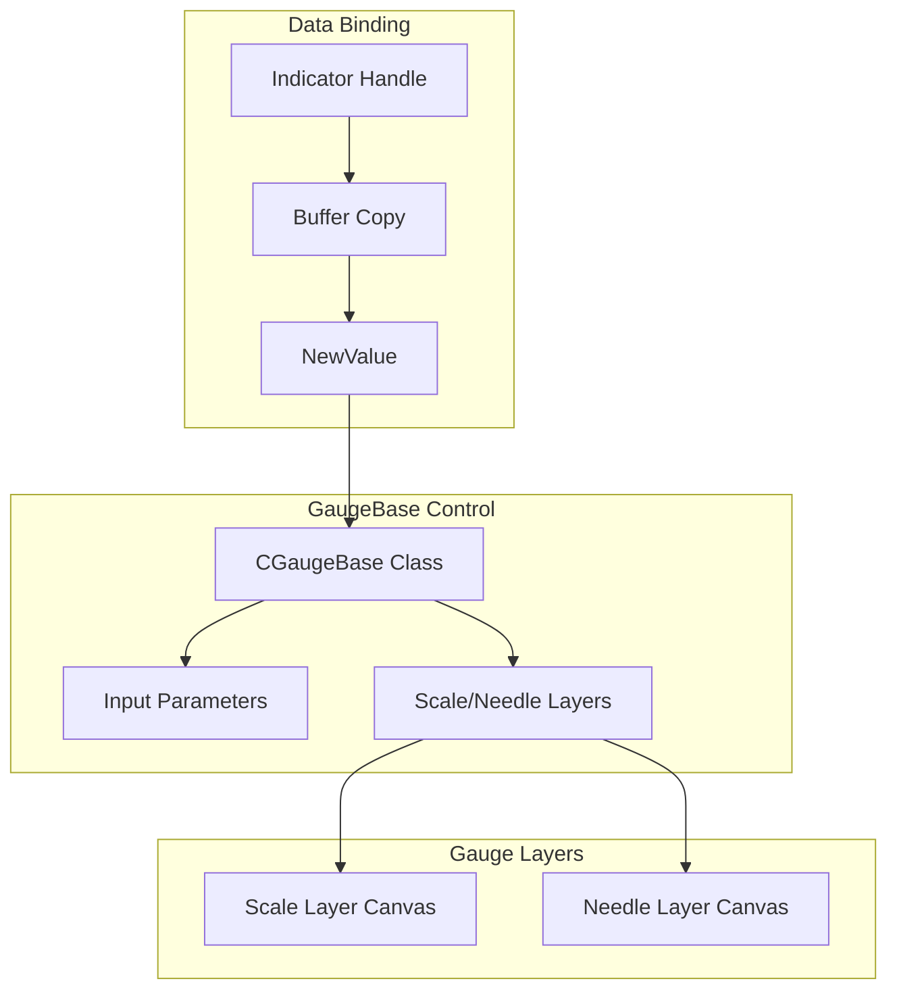
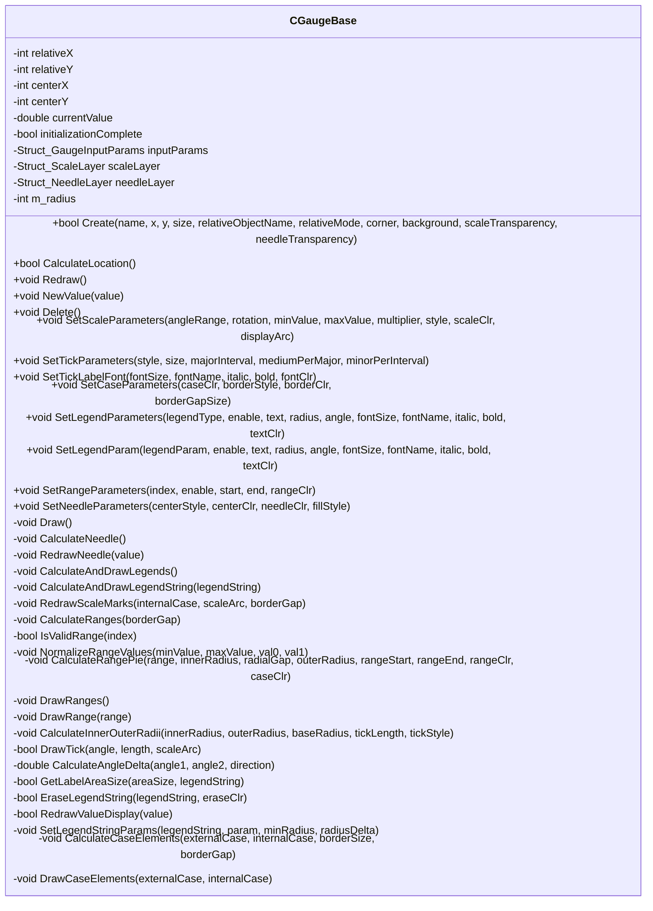
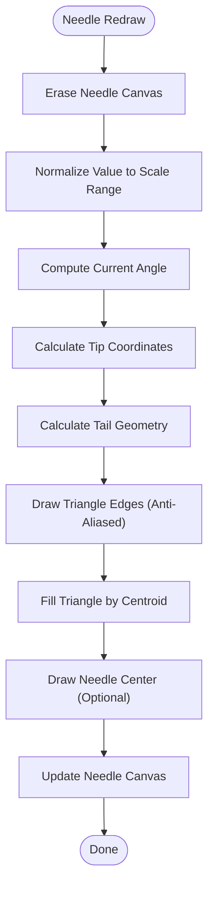
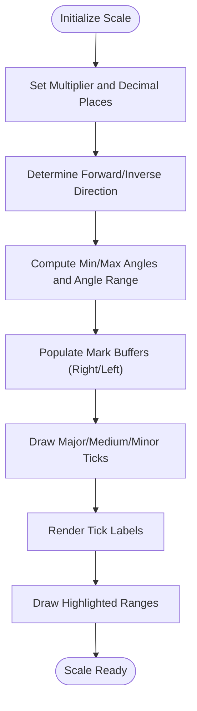
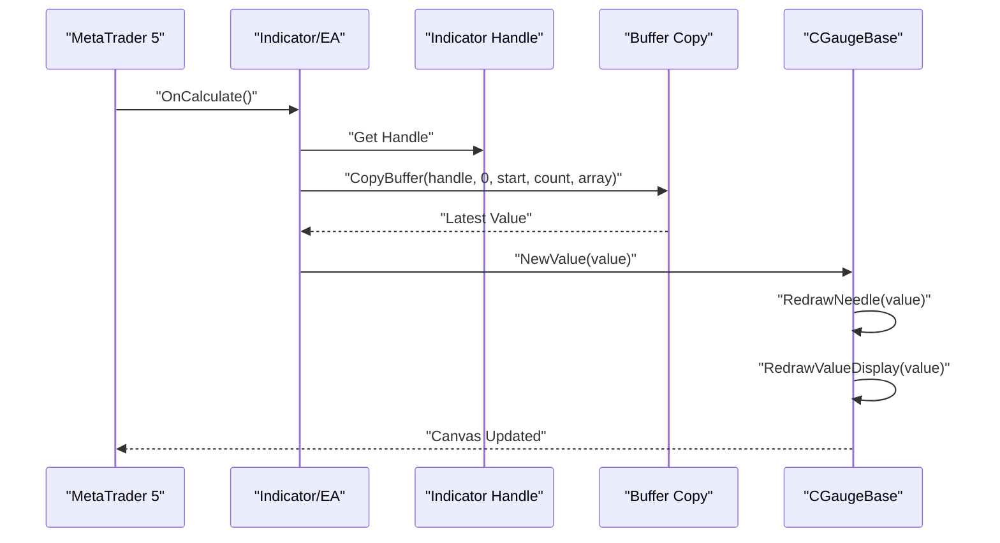
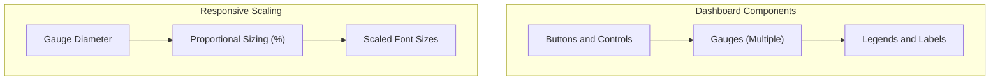
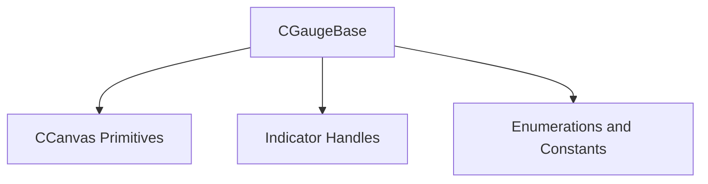

# Dial Gauges and Visualization Components

<cite>
**Referenced Files in This Document**
- [drawing_dial_gauges_using_the_ccanvas_class.md](file://data/scraped_articles/integration/drawing_dial_gauges_using_the_ccanvas_class.md)
- [creating_custom_indicators_in_mql5__part_2___building_a_gauge-style_rsi_display_with_canvas_and_need.md](file://data/scraped_articles/trading_systems/creating_custom_indicators_in_mql5__part_2___building_a_gauge-style_rsi_display_with_canvas_and_need.md)
- [creating_a_dynamic_multi-symbol__multi-period_relative_strength_indicator__rsi__indicator_dashboard.md](file://data/scraped_articles/trading_systems/creating_a_dynamic_multi-symbol__multi-period_relative_strength_indicator__rsi__indicator_dashboard.md)
- [mql5_trading_tools__part_6___dynamic_holographic_dashboard_with_pulse_animations_and_controls.md](file://data/scraped_articles/trading/mql5_trading_tools__part_6___dynamic_holographic_dashboard_with_pulse_animations_and_controls.md)
</cite>

## Table of Contents
1. [Introduction](#introduction)
2. [Project Structure](#project-structure)
3. [Core Components](#core-components)
4. [Architecture Overview](#architecture-overview)
5. [Detailed Component Analysis](#detailed-component-analysis)
6. [Dependency Analysis](#dependency-analysis)
7. [Performance Considerations](#performance-considerations)
8. [Troubleshooting Guide](#troubleshooting-guide)
9. [Conclusion](#conclusion)
10. [Appendices](#appendices)

## Introduction
This document provides comprehensive guidance for implementing dial gauge visualization components in MQL5. It covers the creation of custom dial gauges using CCanvas primitives, including needle rendering, scale drawing, and value display. It also explains color theme management, visual styling options, real-time data binding, animation techniques, and responsive scaling. The document includes practical examples for financial indicators visualization, risk metrics display, and trading dashboard components, with performance optimization strategies for smooth gauge animations and integration with real-time market data streams.

## Project Structure
The repository contains several MQL5-related articles and dashboards that demonstrate dial gauge construction and visualization techniques:
- A detailed article on drawing dial gauges using the CCanvas class, including coordinate systems, relative positioning, and function APIs.
- A gauge-style RSI indicator implementation that showcases needle mechanics, scale drawing, and real-time updates.
- A dynamic multi-symbol, multi-period RSI dashboard that demonstrates real-time data binding and responsive UI updates.
- A dynamic holographic dashboard article that introduces pulse animations and control interactions.

**Diagram sources**
- [drawing_dial_gauges_using_the_ccanvas_class.md](file://data/scraped_articles/integration/drawing_dial_gauges_using_the_ccanvas_class.md#L1-L120)
- [creating_custom_indicators_in_mql5__part_2___building_a_gauge-style_rsi_display_with_canvas_and_need.md](file://data/scraped_articles/trading_systems/creating_custom_indicators_in_mql5__part_2___building_a_gauge-style_rsi_display_with_canvas_and_need.md#L1-L120)
- [creating_a_dynamic_multi-symbol__multi-period_relative_strength_indicator__rsi__indicator_dashboard.md](file://data/scraped_articles/trading_systems/creating_a_dynamic_multi-symbol__multi-period_relative_strength_indicator__rsi__indicator_dashboard.md#L1-L120)
- [mql5_trading_tools__part_6___dynamic_holographic_dashboard_with_pulse_animations_and_controls.md](file://data/scraped_articles/trading/mql5_trading_tools__part_6___dynamic_holographic_dashboard_with_pulse_animations_and_controls.md#L1-L120)

**Section sources**
- [drawing_dial_gauges_using_the_ccanvas_class.md](file://data/scraped_articles/integration/drawing_dial_gauges_using_the_ccanvas_class.md#L1-L120)
- [creating_custom_indicators_in_mql5__part_2___building_a_gauge-style_rsi_display_with_canvas_and_need.md](file://data/scraped_articles/trading_systems/creating_custom_indicators_in_mql5__part_2___building_a_gauge-style_rsi_display_with_canvas_and_need.md#L1-L120)
- [creating_a_dynamic_multi-symbol__multi-period_relative_strength_indicator__rsi__indicator_dashboard.md](file://data/scraped_articles/trading_systems/creating_a_dynamic_multi-symbol__multi-period_relative_strength_indicator__rsi__indicator_dashboard.md#L1-L120)
- [mql5_trading_tools__part_6___dynamic_holographic_dashboard_with_pulse_animations_and_controls.md](file://data/scraped_articles/trading/mql5_trading_tools__part_6___dynamic_holographic_dashboard_with_pulse_animations_and_controls.md#L1-L120)

## Core Components
This section outlines the fundamental building blocks for dial gauge visualization in MQL5:
- Gauge creation and positioning: Absolute and relative positioning, anchor corners, and gauge sizing.
- Scale layer: Contains border, scale graduation marks, legends, and highlighted ranges.
- Needle layer: Contains the needle and needle center, with configurable fill styles.
- Data binding: Real-time updates via indicator handles and buffer copying.
- Animation and responsiveness: Smooth needle transitions and responsive scaling based on gauge diameter.

Key implementation references:
- Gauge creation and positioning APIs, including relative positioning and relocation.
- Scale parameters: range, rotation, min/max values, multiplier, style, and arc display.
- Tick parameters: style, size, major/medium/minor intervals, and font settings.
- Legend parameters: description, units, multiplier, and value with radius/angle positioning.
- Needle parameters: center style, center color, needle color, and fill style.
- Real-time updates: OnCalculate-driven updates and NewValue-driven needle redraws.

**Section sources**
- [drawing_dial_gauges_using_the_ccanvas_class.md](file://data/scraped_articles/integration/drawing_dial_gauges_using_the_ccanvas_class.md#L293-L773)
- [creating_custom_indicators_in_mql5__part_2___building_a_gauge-style_rsi_display_with_canvas_and_need.md](file://data/scraped_articles/trading_systems/creating_custom_indicators_in_mql5__part_2___building_a_gauge-style_rsi_display_with_canvas_and_need.md#L507-L552)
- [creating_custom_indicators_in_mql5__part_2___building_a_gauge-style_rsi_display_with_canvas_and_need.md](file://data/scraped_articles/trading_systems/creating_custom_indicators_in_mql5__part_2___building_a_gauge-style_rsi_display_with_canvas_and_need.md#L1171-L1181)

## Architecture Overview
The dial gauge architecture comprises two layered canvases (scale and needle) sharing the same coordinates, with the needle layer rendered above the scale layer. The CGaugeBase class orchestrates creation, parameter setting, and redrawing, while real-time data binding updates the needle position and value display.

**Diagram sources**
- [creating_custom_indicators_in_mql5__part_2___building_a_gauge-style_rsi_display_with_canvas_and_need.md](file://data/scraped_articles/trading_systems/creating_custom_indicators_in_mql5__part_2___building_a_gauge-style_rsi_display_with_canvas_and_need.md#L445-L494)
- [creating_custom_indicators_in_mql5__part_2___building_a_gauge-style_rsi_display_with_canvas_and_need.md](file://data/scraped_articles/trading_systems/creating_custom_indicators_in_mql5__part_2___building_a_gauge-style_rsi_display_with_canvas_and_need.md#L1236-L1299)

**Section sources**
- [creating_custom_indicators_in_mql5__part_2___building_a_gauge-style_rsi_display_with_canvas_and_need.md](file://data/scraped_articles/trading_systems/creating_custom_indicators_in_mql5__part_2___building_a_gauge-style_rsi_display_with_canvas_and_need.md#L445-L494)
- [creating_custom_indicators_in_mql5__part_2___building_a_gauge-style_rsi_display_with_canvas_and_need.md](file://data/scraped_articles/trading_systems/creating_custom_indicators_in_mql5__part_2___building_a_gauge-style_rsi_display_with_canvas_and_need.md#L1236-L1299)

## Detailed Component Analysis

### CGaugeBase Class and Rendering Pipeline
The CGaugeBase class encapsulates all logic for creating, configuring, and rendering dial gauges. It manages:
- Creation and location calculation with absolute and relative positioning.
- Scale layer rendering: border, arcs, ticks, labels, and range sectors.
- Needle rendering: triangle-based needle with configurable fill and center.
- Legends: description, units, multiplier, and value with dynamic font sizing and positioning.
- Real-time updates: NewValue triggers needle redraw and value display update.

**Diagram sources**
- [creating_custom_indicators_in_mql5__part_2___building_a_gauge-style_rsi_display_with_canvas_and_need.md](file://data/scraped_articles/trading_systems/creating_custom_indicators_in_mql5__part_2___building_a_gauge-style_rsi_display_with_canvas_and_need.md#L445-L494)
- [creating_custom_indicators_in_mql5__part_2___building_a_gauge-style_rsi_display_with_canvas_and_need.md](file://data/scraped_articles/trading_systems/creating_custom_indicators_in_mql5__part_2___building_a_gauge-style_rsi_display_with_canvas_and_need.md#L718-L776)
- [creating_custom_indicators_in_mql5__part_2___building_a_gauge-style_rsi_display_with_canvas_and_need.md](file://data/scraped_articles/trading_systems/creating_custom_indicators_in_mql5__part_2___building_a_gauge-style_rsi_display_with_canvas_and_need.md#L826-L972)

**Section sources**
- [creating_custom_indicators_in_mql5__part_2___building_a_gauge-style_rsi_display_with_canvas_and_need.md](file://data/scraped_articles/trading_systems/creating_custom_indicators_in_mql5__part_2___building_a_gauge-style_rsi_display_with_canvas_and_need.md#L445-L494)
- [creating_custom_indicators_in_mql5__part_2___building_a_gauge-style_rsi_display_with_canvas_and_need.md](file://data/scraped_articles/trading_systems/creating_custom_indicators_in_mql5__part_2___building_a_gauge-style_rsi_display_with_canvas_and_need.md#L718-L776)
- [creating_custom_indicators_in_mql5__part_2___building_a_gauge-style_rsi_display_with_canvas_and_need.md](file://data/scraped_articles/trading_systems/creating_custom_indicators_in_mql5__part_2___building_a_gauge-style_rsi_display_with_canvas_and_need.md#L826-L972)

### Needle Rendering and Animation
Needle rendering uses a triangular geometry with configurable tip and tail radii, color, and fill style. The needle is redrawn on each data update, with anti-aliased lines and centroid-based fill for smooth appearance. The needle center is optionally drawn as a filled circle.

**Diagram sources**
- [creating_custom_indicators_in_mql5__part_2___building_a_gauge-style_rsi_display_with_canvas_and_need.md](file://data/scraped_articles/trading_systems/creating_custom_indicators_in_mql5__part_2___building_a_gauge-style_rsi_display_with_canvas_and_need.md#L735-L776)

**Section sources**
- [creating_custom_indicators_in_mql5__part_2___building_a_gauge-style_rsi_display_with_canvas_and_need.md](file://data/scraped_articles/trading_systems/creating_custom_indicators_in_mql5__part_2___building_a_gauge-style_rsi_display_with_canvas_and_need.md#L735-L776)

### Scale Drawing and Tick Management
Scale drawing involves calculating inner and outer radii, generating major/medium/minor tick marks, and rendering labels with proportional font sizing. The scale supports forward and inverse value ranges, with angle normalization and wrap-around handling.

**Diagram sources**
- [creating_custom_indicators_in_mql5__part_2___building_a_gauge-style_rsi_display_with_canvas_and_need.md](file://data/scraped_articles/trading_systems/creating_custom_indicators_in_mql5__part_2___building_a_gauge-style_rsi_display_with_canvas_and_need.md#L829-L972)

**Section sources**
- [creating_custom_indicators_in_mql5__part_2___building_a_gauge-style_rsi_display_with_canvas_and_need.md](file://data/scraped_articles/trading_systems/creating_custom_indicators_in_mql5__part_2___building_a_gauge-style_rsi_display_with_canvas_and_need.md#L829-L972)

### Real-Time Data Binding and Updates
Real-time updates are performed via indicator handles and buffer copying. The OnCalculate handler checks for new bars or ticks and updates the gauge via NewValue, which triggers needle and value display redraws.

**Diagram sources**
- [creating_custom_indicators_in_mql5__part_2___building_a_gauge-style_rsi_display_with_canvas_and_need.md](file://data/scraped_articles/trading_systems/creating_custom_indicators_in_mql5__part_2___building_a_gauge-style_rsi_display_with_canvas_and_need.md#L1341-L1356)

**Section sources**
- [creating_custom_indicators_in_mql5__part_2___building_a_gauge-style_rsi_display_with_canvas_and_need.md](file://data/scraped_articles/trading_systems/creating_custom_indicators_in_mql5__part_2___building_a_gauge-style_rsi_display_with_canvas_and_need.md#L1341-L1356)

### Dashboard Integration and Responsive Scaling
Dashboards integrate multiple gauges and controls, with responsive scaling based on gauge diameter and proportional font sizing. Buttons and legends are positioned using radius/angle coordinates relative to the gauge center.

**Diagram sources**
- [creating_a_dynamic_multi-symbol__multi-period_relative_strength_indicator__rsi__indicator_dashboard.md](file://data/scraped_articles/trading_systems/creating_a_dynamic_multi-symbol__multi-period_relative_strength_indicator__rsi__indicator_dashboard.md#L623-L782)
- [mql5_trading_tools__part_6___dynamic_holographic_dashboard_with_pulse_animations_and_controls.md](file://data/scraped_articles/trading/mql5_trading_tools__part_6___dynamic_holographic_dashboard_with_pulse_animations_and_controls.md#L23-L754)

**Section sources**
- [creating_a_dynamic_multi-symbol__multi-period_relative_strength_indicator__rsi__indicator_dashboard.md](file://data/scraped_articles/trading_systems/creating_a_dynamic_multi-symbol__multi-period_relative_strength_indicator__rsi__indicator_dashboard.md#L623-L782)
- [mql5_trading_tools__part_6___dynamic_holographic_dashboard_with_pulse_animations_and_controls.md](file://data/scraped_articles/trading/mql5_trading_tools__part_6___dynamic_holographic_dashboard_with_pulse_animations_and_controls.md#L23-L754)

## Dependency Analysis
The dial gauge implementation relies on the CCanvas class for custom drawing and the MQL5 indicator framework for real-time data binding. The CGaugeBase class encapsulates dependencies on:
- CCanvas primitives for arcs, lines, triangles, circles, and text rendering.
- Indicator handles and buffer copying for real-time updates.
- Enumerations and constants for positioning, styling, and animation.

**Diagram sources**
- [drawing_dial_gauges_using_the_ccanvas_class.md](file://data/scraped_articles/integration/drawing_dial_gauges_using_the_ccanvas_class.md#L293-L773)
- [creating_custom_indicators_in_mql5__part_2___building_a_gauge-style_rsi_display_with_canvas_and_need.md](file://data/scraped_articles/trading_systems/creating_custom_indicators_in_mql5__part_2___building_a_gauge-style_rsi_display_with_canvas_and_need.md#L445-L494)

**Section sources**
- [drawing_dial_gauges_using_the_ccanvas_class.md](file://data/scraped_articles/integration/drawing_dial_gauges_using_the_ccanvas_class.md#L293-L773)
- [creating_custom_indicators_in_mql5__part_2___building_a_gauge-style_rsi_display_with_canvas_and_need.md](file://data/scraped_articles/trading_systems/creating_custom_indicators_in_mql5__part_2___building_a_gauge-style_rsi_display_with_canvas_and_need.md#L445-L494)

## Performance Considerations
- Canvas updates: Use Update(true) on both scale and needle canvases to minimize redraw overhead.
- Anti-aliasing: Prefer efficient anti-aliased line drawing and centroid-based fills for smooth needle rendering.
- Conditional rendering: Only draw scale arcs and ticks when enabled to reduce computation.
- Proportional scaling: Derive sizes from diameter percentages to avoid recalculating absolute values on every update.
- Event-driven updates: Update gauges on new bars or ticks to limit frequency and improve responsiveness.

[No sources needed since this section provides general guidance]

## Troubleshooting Guide
Common issues and resolutions:
- Gauge not appearing: Verify Create() returns true and ObjectCreate succeeds; ensure anchor corner and relative positioning are set correctly.
- Needle not moving: Confirm NewValue(value) is called with valid values and that BarsCalculated > 0 before copying buffers.
- Incorrect scale range: Check min/max values and multiplier settings; ensure angle range is within supported bounds (30–320 degrees).
- Legend misalignment: Validate radius/angle parameters and font scaling; ensure TextOut alignment flags are set correctly.
- Performance drops: Limit redraw frequency, disable unused elements (e.g., scale arc), and use proportional scaling.

**Section sources**
- [drawing_dial_gauges_using_the_ccanvas_class.md](file://data/scraped_articles/integration/drawing_dial_gauges_using_the_ccanvas_class.md#L722-L737)
- [creating_custom_indicators_in_mql5__part_2___building_a_gauge-style_rsi_display_with_canvas_and_need.md](file://data/scraped_articles/trading_systems/creating_custom_indicators_in_mql5__part_2___building_a_gauge-style_rsi_display_with_canvas_and_need.md#L1341-L1356)

## Conclusion
Dial gauges in MQL5 can be implemented efficiently using the CCanvas class and a structured approach centered on the CGaugeBase class. By separating concerns into scale and needle layers, managing real-time data binding, and leveraging proportional scaling and anti-aliased rendering, developers can create responsive, visually appealing gauges suitable for financial indicators, risk metrics, and trading dashboards. The provided examples and patterns offer a solid foundation for building production-ready visualization components.

[No sources needed since this section summarizes without analyzing specific files]

## Appendices
- API and function references for gauge creation, parameter setting, and real-time updates.
- Enumeration lists for case styles, mark styles, needle fill modes, and relative positioning.
- Practical examples for multi-symbol, multi-period dashboards and dynamic control interactions.

**Section sources**
- [drawing_dial_gauges_using_the_ccanvas_class.md](file://data/scraped_articles/integration/drawing_dial_gauges_using_the_ccanvas_class.md#L293-L773)
- [creating_a_dynamic_multi-symbol__multi-period_relative_strength_indicator__rsi__indicator_dashboard.md](file://data/scraped_articles/trading_systems/creating_a_dynamic_multi-symbol__multi-period_relative_strength_indicator__rsi__indicator_dashboard.md#L623-L782)
- [mql5_trading_tools__part_6___dynamic_holographic_dashboard_with_pulse_animations_and_controls.md](file://data/scraped_articles/trading/mql5_trading_tools__part_6___dynamic_holographic_dashboard_with_pulse_animations_and_controls.md#L23-L754)