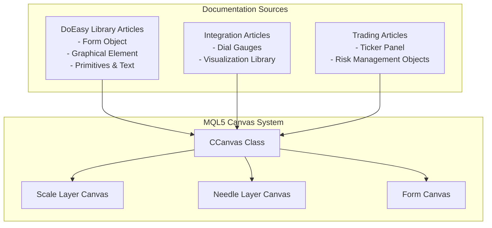
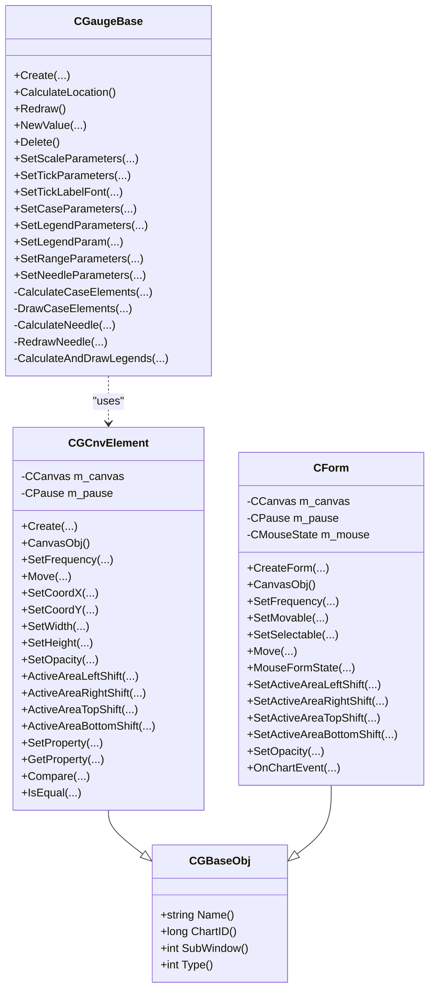
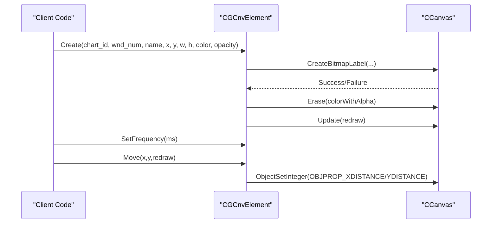
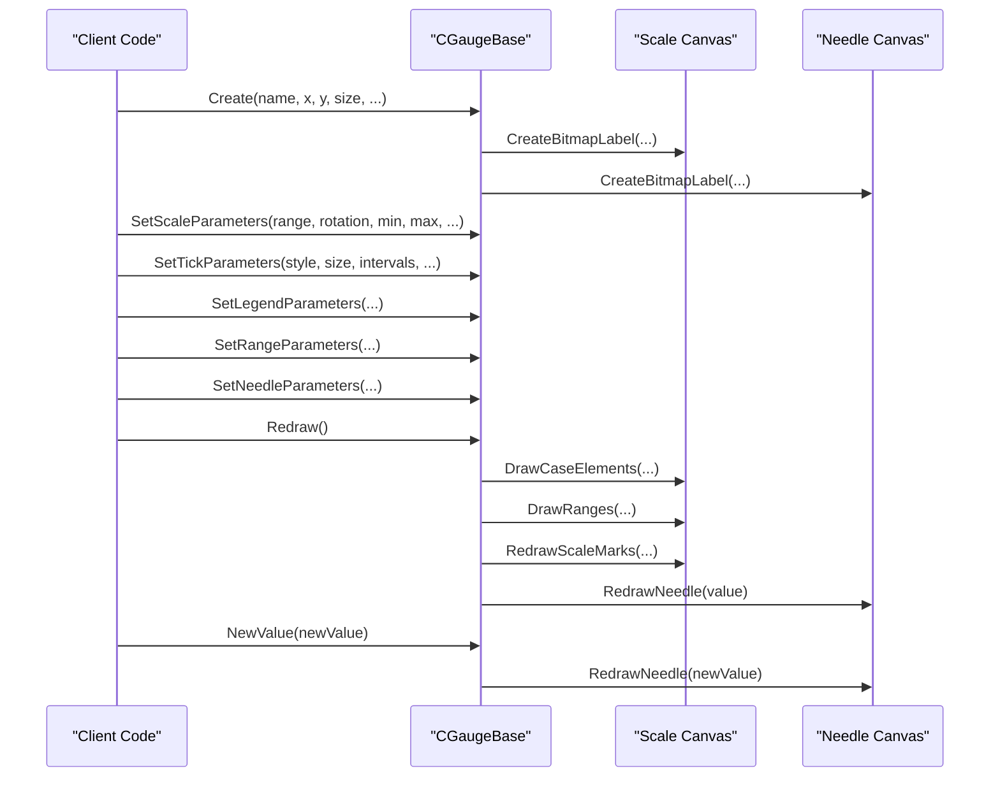
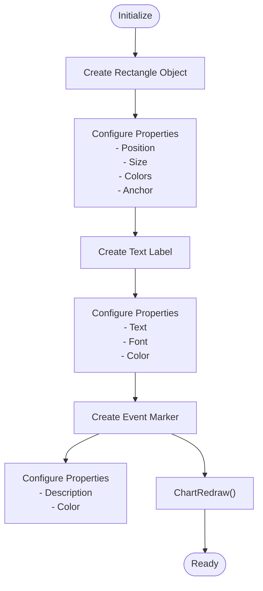
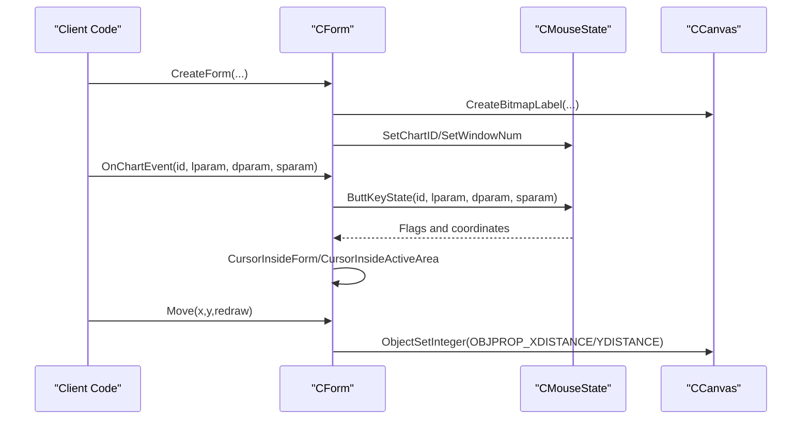
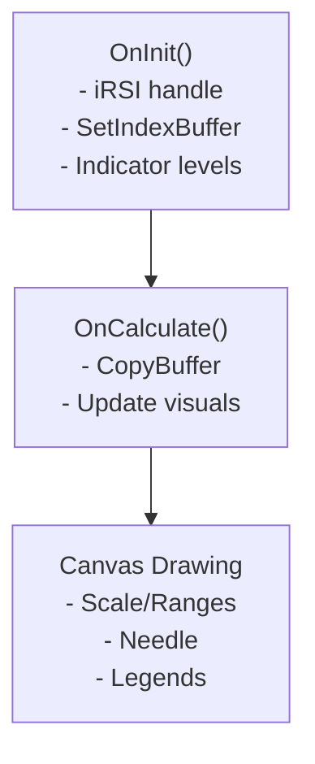
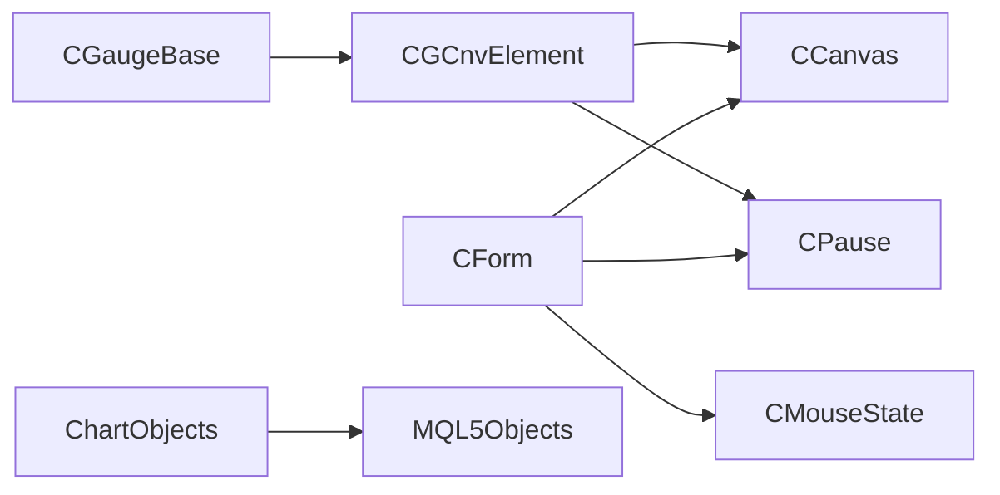

# GUI and Chart Development

<cite>
**Referenced Files in This Document**
- [graphics_in_doeasy_library__part_74___basic_graphical_element_powered_by_the_ccanvas_class.md](file://data/scraped_articles/expert_advisors/graphics_in_doeasy_library__part_74___basic_graphical_element_powered_by_the_ccanvas_class.md)
- [graphics_in_doeasy_library__part_73___form_object_of_a_graphical_element.md](file://data/scraped_articles/expert_advisors/graphics_in_doeasy_library__part_73___form_object_of_a_graphical_element.md)
- [graphics_in_doeasy_library__part_75___methods_of_handling_primitives_and_text_in_the_basic_graphical.md](file://data/scraped_articles/expert_advisors/graphics_in_doeasy_library__part_75___methods_of_handling_primitives_and_text_in_the_basic_graphical.md)
- [drawing_dial_gauges_using_the_ccanvas_class.md](file://data/scraped_articles/integration/drawing_dial_gauges_using_the_ccanvas_class.md)
- [creating_custom_indicators_in_mql5__part_2___building_a_gauge-style_rsi_display_with_canvas_and_need.md](file://data/scraped_articles/trading_systems/creating_custom_indicators_in_mql5__part_2___building_a_gauge-style_rsi_display_with_canvas_and_need.md)
- [visualize_this__mql5_graphics_library_similar_to__plot__of_r_language.md](file://data/scraped_articles/integration/visualize_this__mql5_graphics_library_similar_to__plot__of_r_language.md)
- [creating_a_ticker_tape_panel__basic_version.md](file://data/scraped_articles/trading/creating_a_ticker_tape_panel__basic_version.md)
- [news_trading_made_easy__part_2___risk_management.md](file://data/scraped_articles/trading_systems/news_trading_made_easy__part_2___risk_management.md)
</cite>

## Table of Contents
1. [Introduction](#introduction)
2. [Project Structure](#project-structure)
3. [Core Components](#core-components)
4. [Architecture Overview](#architecture-overview)
5. [Detailed Component Analysis](#detailed-component-analysis)
6. [Dependency Analysis](#dependency-analysis)
7. [Performance Considerations](#performance-considerations)
8. [Troubleshooting Guide](#troubleshooting-guide)
9. [Conclusion](#conclusion)
10. [Appendices](#appendices)

## Introduction
This document provides comprehensive guidance for advanced GUI and chart development in MQL5, focusing on the CCanvas class system for custom drawing primitives, graphical elements, and interactive chart components. It covers dial gauges, custom indicators, real-time visualization, chart object lifecycle management, advanced GUI patterns for trading panels and dashboards, color management, responsive layouts, performance optimization, and integration with trading logic.

## Project Structure
The repository includes extensive MQL5 documentation and examples that demonstrate:
- CCanvas-based drawing primitives and layered canvases for gauges and forms
- Custom indicator creation with canvas-backed visuals
- Chart object management for rectangles, labels, and events
- Real-time panel updates and interactivity

**Diagram sources**
- [graphics_in_doeasy_library__part_74___basic_graphical_element_powered_by_the_ccanvas_class.md](file://data/scraped_articles/expert_advisors/graphics_in_doeasy_library__part_74___basic_graphical_element_powered_by_the_ccanvas_class.md#L322-L470)
- [drawing_dial_gauges_using_the_ccanvas_class.md](file://data/scraped_articles/integration/drawing_dial_gauges_using_the_ccanvas_class.md#L105-L143)
- [graphics_in_doeasy_library__part_73___form_object_of_a_graphical_element.md](file://data/scraped_articles/expert_advisors/graphics_in_doeasy_library__part_73___form_object_of_a_graphical_element.md#L583-L615)

**Section sources**
- [graphics_in_doeasy_library__part_74___basic_graphical_element_powered_by_the_ccanvas_class.md](file://data/scraped_articles/expert_advisors/graphics_in_doeasy_library__part_74___basic_graphical_element_powered_by_the_ccanvas_class.md#L1-L120)
- [drawing_dial_gauges_using_the_ccanvas_class.md](file://data/scraped_articles/integration/drawing_dial_gauges_using_the_ccanvas_class.md#L1-L120)

## Core Components
- CCanvas class: Provides bitmap-backed drawing resources and primitives for custom visuals on charts.
- CGCnvElement: Base element class inheriting from the library’s base object, embedding a CCanvas and offering property management, movement, and update scheduling.
- CGaugeBase: A reusable gauge framework integrating scale and needle layers with configurable ranges, legends, and multipliers.
- CForm: A form abstraction combining canvas, mouse state, and interaction support for building interactive panels.
- Chart Object Management: Utilities for creating, updating, and deleting chart objects (rectangles, labels, events) with proper lifecycle handling.

Key implementation references:
- CCanvas-based element creation and property management
- Gauge creation, parameter setting, and redrawing
- Mouse state handling and interaction flags
- Chart object lifecycle and cleanup

**Section sources**
- [graphics_in_doeasy_library__part_74___basic_graphical_element_powered_by_the_ccanvas_class.md](file://data/scraped_articles/expert_advisors/graphics_in_doeasy_library__part_74___basic_graphical_element_powered_by_the_ccanvas_class.md#L322-L470)
- [creating_custom_indicators_in_mql5__part_2___building_a_gauge-style_rsi_display_with_canvas_and_need.md](file://data/scraped_articles/trading_systems/creating_custom_indicators_in_mql5__part_2___building_a_gauge-style_rsi_display_with_canvas_and_need.md#L441-L495)
- [graphics_in_doeasy_library__part_73___form_object_of_a_graphical_element.md](file://data/scraped_articles/expert_advisors/graphics_in_doeasy_library__part_73___form_object_of_a_graphical_element.md#L583-L735)
- [news_trading_made_easy__part_2___risk_management.md](file://data/scraped_articles/trading_systems/news_trading_made_easy__part_2___risk_management.md#L2296-L2335)

## Architecture Overview
The architecture centers on layered canvases and reusable components:
- Scale layer canvas renders gauge elements (case, ranges, marks, labels).
- Needle layer canvas renders the dynamic needle and center cap.
- Form canvas supports interactive panels with mouse state and active areas.
- Chart objects provide persistent UI overlays (labels, rectangles, events).

**Diagram sources**
- [graphics_in_doeasy_library__part_74___basic_graphical_element_powered_by_the_ccanvas_class.md](file://data/scraped_articles/expert_advisors/graphics_in_doeasy_library__part_74___basic_graphical_element_powered_by_the_ccanvas_class.md#L322-L470)
- [graphics_in_doeasy_library__part_73___form_object_of_a_graphical_element.md](file://data/scraped_articles/expert_advisors/graphics_in_doeasy_library__part_73___form_object_of_a_graphical_element.md#L583-L735)
- [creating_custom_indicators_in_mql5__part_2___building_a_gauge-style_rsi_display_with_canvas_and_need.md](file://data/scraped_articles/trading_systems/creating_custom_indicators_in_mql5__part_2___building_a_gauge-style_rsi_display_with_canvas_and_need.md#L441-L495)

## Detailed Component Analysis

### CCanvas System and CGCnvElement
- Canvas creation and update: Bitmap label creation with ARGB normalization, erase and update cycles.
- Property management: Centralized integer, real, and string property arrays with setters/getters and comparison utilities.
- Movement and layout: Coordinate updates, width/height resizing, and opacity adjustments.
- Interaction: Cursor position detection relative to element and active area.

**Diagram sources**
- [graphics_in_doeasy_library__part_74___basic_graphical_element_powered_by_the_ccanvas_class.md](file://data/scraped_articles/expert_advisors/graphics_in_doeasy_library__part_74___basic_graphical_element_powered_by_the_ccanvas_class.md#L625-L653)

**Section sources**
- [graphics_in_doeasy_library__part_74___basic_graphical_element_powered_by_the_ccanvas_class.md](file://data/scraped_articles/expert_advisors/graphics_in_doeasy_library__part_74___basic_graphical_element_powered_by_the_ccanvas_class.md#L322-L470)

### Dial Gauge Framework (CGaugeBase)
- Layered rendering: Separate scale and needle canvases with shared center and size.
- Parameterization: Scale range/rotation, tick styles, labels, legends, ranges, needle center and fill.
- Dynamic updates: Needle redraw on new values with clamping and angle computation.
- Redraw orchestration: Full redraw after parameter changes.

**Diagram sources**
- [creating_custom_indicators_in_mql5__part_2___building_a_gauge-style_rsi_display_with_canvas_and_need.md](file://data/scraped_articles/trading_systems/creating_custom_indicators_in_mql5__part_2___building_a_gauge-style_rsi_display_with_canvas_and_need.md#L503-L553)
- [drawing_dial_gauges_using_the_ccanvas_class.md](file://data/scraped_articles/integration/drawing_dial_gauges_using_the_ccanvas_class.md#L293-L362)

**Section sources**
- [creating_custom_indicators_in_mql5__part_2___building_a_gauge-style_rsi_display_with_canvas_and_need.md](file://data/scraped_articles/trading_systems/creating_custom_indicators_in_mql5__part_2___building_a_gauge-style_rsi_display_with_canvas_and_need.md#L441-L800)
- [drawing_dial_gauges_using_the_ccanvas_class.md](file://data/scraped_articles/integration/drawing_dial_gauges_using_the_ccanvas_class.md#L293-L773)

### Chart Object Management
- Creation: Rectangle labels, text labels, and event markers with configurable properties.
- Update: Modify positions, sizes, fonts, colors, and visibility.
- Cleanup: Delete objects on deinitialization to prevent orphaned resources.

**Diagram sources**
- [news_trading_made_easy__part_2___risk_management.md](file://data/scraped_articles/trading_systems/news_trading_made_easy__part_2___risk_management.md#L2317-L2419)

**Section sources**
- [news_trading_made_easy__part_2___risk_management.md](file://data/scraped_articles/trading_systems/news_trading_made_easy__part_2___risk_management.md#L2296-L2487)

### Interactive Panels and Forms (CForm)
- Mouse state capture: Coordinates, wheel delta, and button/key flags.
- Active area: Configurable margins for interaction boundaries.
- Movement and redraw: Controlled updates with pause-based throttling.

**Diagram sources**
- [graphics_in_doeasy_library__part_73___form_object_of_a_graphical_element.md](file://data/scraped_articles/expert_advisors/graphics_in_doeasy_library__part_73___form_object_of_a_graphical_element.md#L612-L735)

**Section sources**
- [graphics_in_doeasy_library__part_73___form_object_of_a_graphical_element.md](file://data/scraped_articles/expert_advisors/graphics_in_doeasy_library__part_73___form_object_of_a_graphical_element.md#L583-L735)

### Custom Indicators with Canvas
- Indicator buffers and plots configured via standard MQL5 properties.
- Canvas-backed overlay for additional visuals (e.g., gauge-style RSI).
- Integration with standard indicator lifecycle (OnInit/OnCalculate).

**Diagram sources**
- [creating_custom_indicators_in_mql5__part_2___building_a_gauge-style_rsi_display_with_canvas_and_need.md](file://data/scraped_articles/trading_systems/creating_custom_indicators_in_mql5__part_2___building_a_gauge-style_rsi_display_with_canvas_and_need.md#L334-L373)

**Section sources**
- [creating_custom_indicators_in_mql5__part_2___building_a_gauge-style_rsi_display_with_canvas_and_need.md](file://data/scraped_articles/trading_systems/creating_custom_indicators_in_mql5__part_2___building_a_gauge-style_rsi_display_with_canvas_and_need.md#L334-L383)

### Advanced GUI Patterns
- Trading panels: Ticker tape panels with dynamic symbol lists and chart redraws on object events.
- Real-time dashboards: Composite canvases with layered updates and throttled redraws.
- Interactive controls: Forms with active areas, mouse state handling, and controlled movement.

**Section sources**
- [creating_a_ticker_tape_panel__basic_version.md](file://data/scraped_articles/trading/creating_a_ticker_tape_panel__basic_version.md#L511-L519)

## Dependency Analysis
- CGCnvElement depends on CCanvas for drawing and CPause for throttling.
- CGaugeBase composes scale and needle layers via CCanvas instances.
- CForm aggregates CCanvas, CPause, and CMouseState for interaction.
- Chart object utilities depend on standard MQL5 object APIs.

**Diagram sources**
- [graphics_in_doeasy_library__part_74___basic_graphical_element_powered_by_the_ccanvas_class.md](file://data/scraped_articles/expert_advisors/graphics_in_doeasy_library__part_74___basic_graphical_element_powered_by_the_ccanvas_class.md#L322-L470)
- [graphics_in_doeasy_library__part_73___form_object_of_a_graphical_element.md](file://data/scraped_articles/expert_advisors/graphics_in_doeasy_library__part_73___form_object_of_a_graphical_element.md#L612-L735)

**Section sources**
- [graphics_in_doeasy_library__part_74___basic_graphical_element_powered_by_the_ccanvas_class.md](file://data/scraped_articles/expert_advisors/graphics_in_doeasy_library__part_74___basic_graphical_element_powered_by_the_ccanvas_class.md#L322-L470)
- [graphics_in_doeasy_library__part_73___form_object_of_a_graphical_element.md](file://data/scraped_articles/expert_advisors/graphics_in_doeasy_library__part_73___form_object_of_a_graphical_element.md#L612-L735)

## Performance Considerations
- Throttled updates: Use pause-based waiting (e.g., 16 ms) to limit redraw frequency.
- Batch updates: Defer ChartRedraw until after composing multiple element changes.
- Efficient primitives: Prefer vectorized drawing and minimal fills; use antialiasing selectively.
- Memory management: Destroy canvases and delete chart objects on cleanup to avoid leaks.
- Real-time responsiveness: Separate heavy computations from drawing; cache computed metrics.

[No sources needed since this section provides general guidance]

## Troubleshooting Guide
- Canvas creation failures: Verify chart ID, subwindow index, and object naming conventions.
- Incorrect transparency: Use ARGB with alpha channel; avoid zero clears for alpha-enabled canvases.
- Mouse state anomalies: Ensure OnChartEvent handlers update mouse state consistently and reset flags appropriately.
- Object persistence: Always delete chart objects in deinitialization handlers to prevent orphaned resources.
- Gauge misalignment: Recalculate locations when using relative positioning; apply GaugeRelocation after GaugeCalcLocation returns true.

**Section sources**
- [graphics_in_doeasy_library__part_75___methods_of_handling_primitives_and_text_in_the_basic_graphical.md](file://data/scraped_articles/expert_advisors/graphics_in_doeasy_library__part_75___methods_of_handling_primitives_and_text_in_the_basic_graphical.md#L47-L67)
- [news_trading_made_easy__part_2___risk_management.md](file://data/scraped_articles/trading_systems/news_trading_made_easy__part_2___risk_management.md#L2327-L2335)

## Conclusion
The CCanvas-centric architecture enables powerful, modular GUI and chart development in MQL5. By leveraging layered canvases, property-driven configuration, and controlled interaction patterns, developers can build responsive trading panels, real-time dashboards, and sophisticated visualizations such as dial gauges. Proper lifecycle management, performance-aware updates, and robust error handling ensure reliable operation in live trading environments.

[No sources needed since this section summarizes without analyzing specific files]

## Appendices

### Practical Recipes
- Create a gauge: Initialize scale and needle canvases, set parameters, and call redraw; update needle on new values.
- Build a form panel: Compose canvas with mouse state, define active areas, and handle movement with throttling.
- Manage chart objects: Create, configure, and delete objects; redraw chart after batch updates.

**Section sources**
- [drawing_dial_gauges_using_the_ccanvas_class.md](file://data/scraped_articles/integration/drawing_dial_gauges_using_the_ccanvas_class.md#L293-L773)
- [graphics_in_doeasy_library__part_73___form_object_of_a_graphical_element.md](file://data/scraped_articles/expert_advisors/graphics_in_doeasy_library__part_73___form_object_of_a_graphical_element.md#L612-L735)
- [news_trading_made_easy__part_2___risk_management.md](file://data/scraped_articles/trading_systems/news_trading_made_easy__part_2___risk_management.md#L2317-L2419)