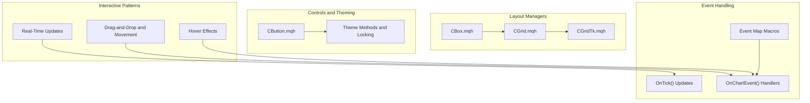
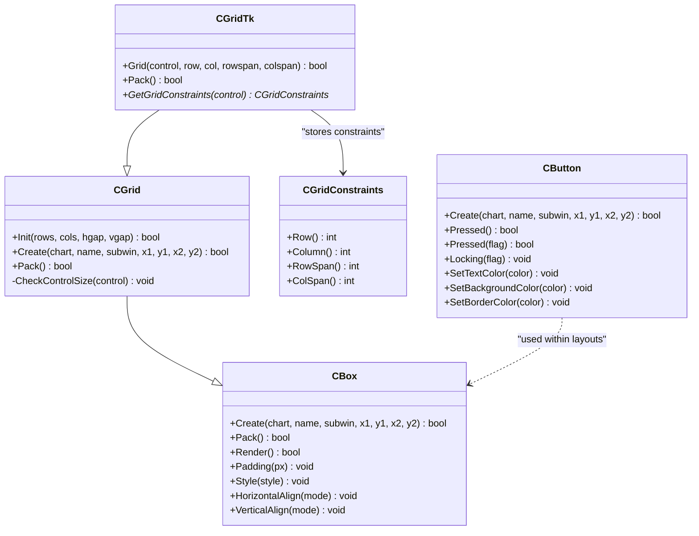
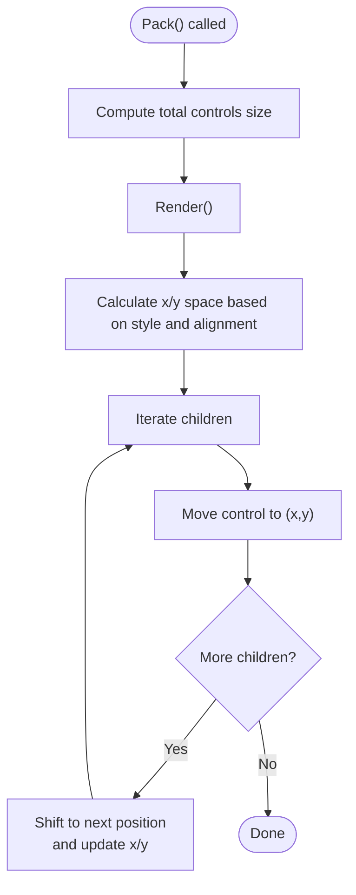
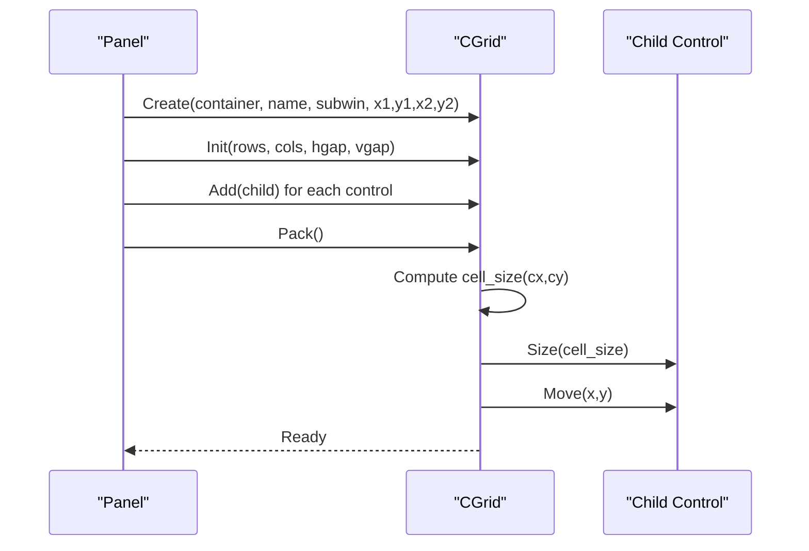
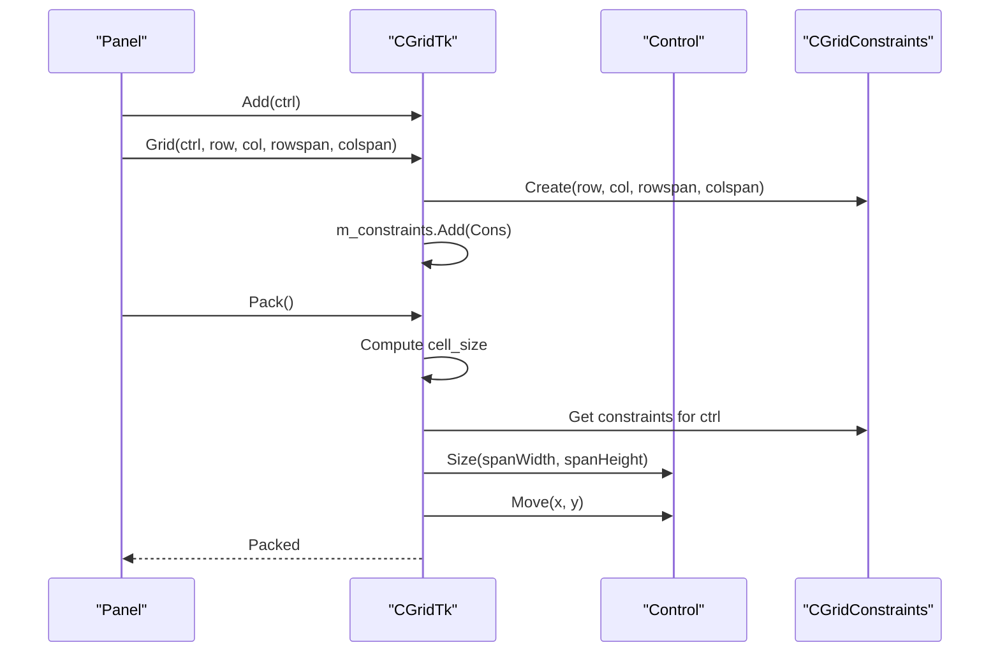
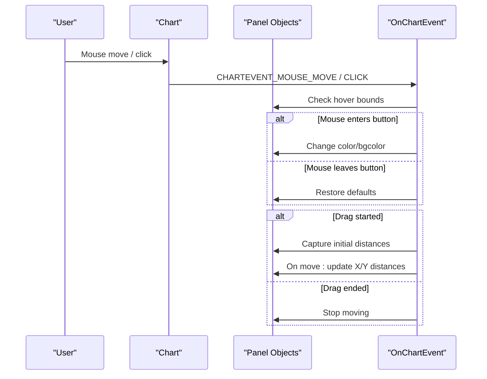
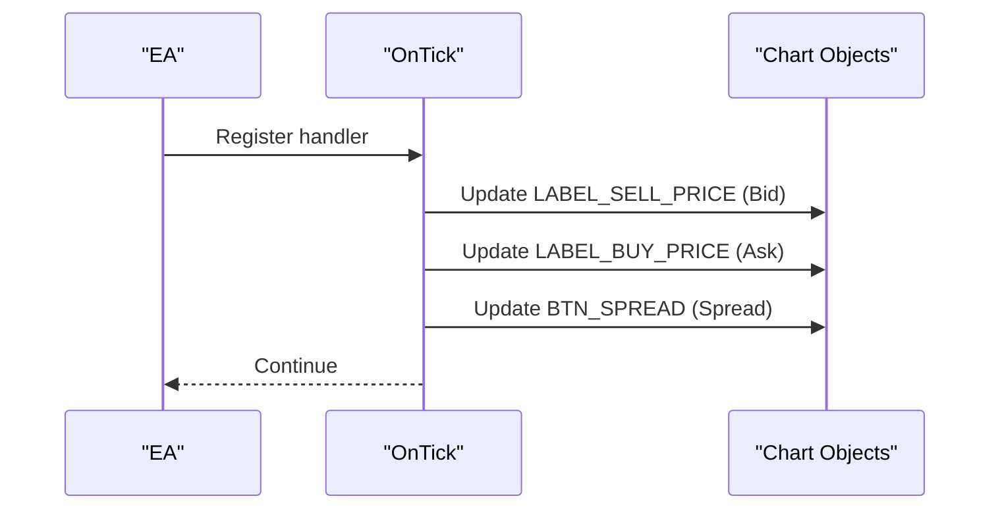
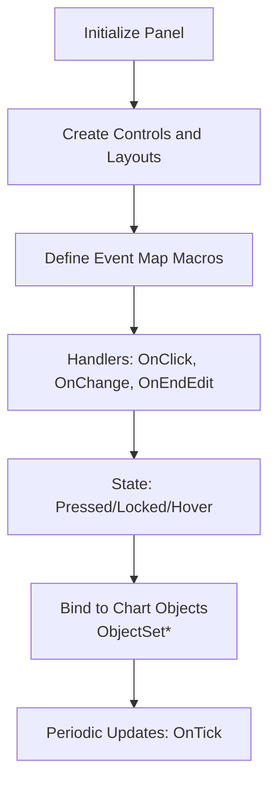
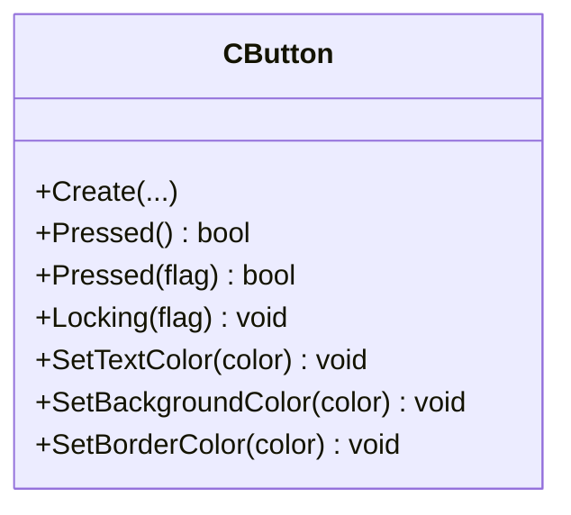
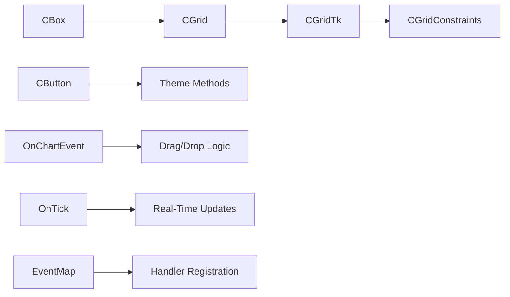

# Interactive Controls and Panels

<cite>
**Referenced Files in This Document**
- [using_layouts_and_containers_for_gui_controls__the_cbox_class.md](file://data/scraped_articles/integration/using_layouts_and_containers_for_gui_controls__the_cbox_class.md)
- [using_layouts_and_containers_for_gui_controls__the_cgrid_class.md](file://data/scraped_articles/integration/using_layouts_and_containers_for_gui_controls__the_cgrid_class.md)
- [creating_an_interactive_graphical_user_interface_in_mql5__part_2___adding_controls_and_responsivenes.md](file://data/scraped_articles/trading/creating_an_interactive_graphical_user_interface_in_mql5__part_2___adding_controls_and_responsivenes.md)
- [expert_advisor_featuring_gui__creating_the_panel__part_i.md](file://data/scraped_articles/expert_advisors/expert_advisor_featuring_gui__creating_the_panel__part_i.md)
- [mql_as_a_markup_tool_for_the_graphical_interface_of_mql_programs__part_3___form_designer.md](file://data/scraped_articles/integration/mql_as_a_markup_tool_for_the_graphical_interface_of_mql_programs__part_3___form_designer.md)
- [creating_a_trading_administrator_panel_in_mql5__part_iii___extending_built-in_classes_for_theme_mana.md](file://data/scraped_articles/trading_systems/creating_a_trading_administrator_panel_in_mql5__part_iii___extending_built-in_classes_for_theme_mana.md)
- [CButton.mqh](file://data/scraped_articles/trading_systems/creating_a_trading_administrator_panel_in_mql5__part_iii___extending_built-in_classes_for_theme_mana.md)
- [CGridTk.mqh](file://data/scraped_articles/integration/using_layouts_and_containers_for_gui_controls__the_cgrid_class.md)
- [CGrid.mqh](file://data/scraped_articles/integration/using_layouts_and_containers_for_gui_controls__the_cgrid_class.md)
- [CBox.mqh](file://data/scraped_articles/integration/using_layouts_and_containers_for_gui_controls__the_cbox_class.md)
</cite>

## Table of Contents
1. [Introduction](#introduction)
2. [Project Structure](#project-structure)
3. [Core Components](#core-components)
4. [Architecture Overview](#architecture-overview)
5. [Detailed Component Analysis](#detailed-component-analysis)
6. [Dependency Analysis](#dependency-analysis)
7. [Performance Considerations](#performance-considerations)
8. [Troubleshooting Guide](#troubleshooting-guide)
9. [Conclusion](#conclusion)
10. [Appendices](#appendices)

## Introduction
This document explains interactive GUI controls and panel systems in MQL5 with a focus on layout managers and container-based control organization. It documents the CBox and CGrid classes for automatic layout and container nesting, and demonstrates how to build movable GUI systems, implement drag-and-drop interactions, and manage user interactions. It also covers event handling, state management, and data binding patterns, and provides guidance on responsive layouts, dynamic control creation, and panel customization. Practical examples include trading parameter panels, real-time dashboards, and configurable chart overlays, with attention to user experience, accessibility, and cross-platform considerations.

## Project Structure
The repository includes MQL5 GUI-related content across several articles and example files. The most relevant sources for this document are:
- Layout managers: CBox and CGrid classes with examples and advanced variants (CGridTk)
- Interactive GUI patterns: drag-and-drop, hover effects, and real-time updates
- Built-in control extensions and themes
- Event-driven UI composition and dynamic form injection

**Diagram sources**
- [CBox.mqh](file://data/scraped_articles/integration/using_layouts_and_containers_for_gui_controls__the_cbox_class.md)
- [CGrid.mqh](file://data/scraped_articles/integration/using_layouts_and_containers_for_gui_controls__the_cgrid_class.md)
- [CGridTk.mqh](file://data/scraped_articles/integration/using_layouts_and_containers_for_gui_controls__the_cgrid_class.md)
- [CButton.mqh](file://data/scraped_articles/trading_systems/creating_a_trading_administrator_panel_in_mql5__part_iii___extending_built-in_classes_for_theme_mana.md)
- [creating_an_interactive_graphical_user_interface_in_mql5__part_2___adding_controls_and_responsivenes.md](file://data/scraped_articles/trading/creating_an_interactive_graphical_user_interface_in_mql5__part_2___adding_controls_and_responsivenes.md)
- [mql_as_a_markup_tool_for_the_graphical_interface_of_mql_programs__part_3___form_designer.md](file://data/scraped_articles/integration/mql_as_a_markup_tool_for_the_graphical_interface_of_mql_programs__part_3___form_designer.md)

**Section sources**
- [using_layouts_and_containers_for_gui_controls__the_cbox_class.md](file://data/scraped_articles/integration/using_layouts_and_containers_for_gui_controls__the_cbox_class.md)
- [using_layouts_and_containers_for_gui_controls__the_cgrid_class.md](file://data/scraped_articles/integration/using_layouts_and_containers_for_gui_controls__the_cgrid_class.md)
- [creating_an_interactive_graphical_user_interface_in_mql5__part_2___adding_controls_and_responsivenes.md](file://data/scraped_articles/trading/creating_an_interactive_graphical_user_interface_in_mql5__part_2___adding_controls_and_responsivenes.md)
- [expert_advisor_featuring_gui__creating_the_panel__part_i.md](file://data/scraped_articles/expert_advisors/expert_advisor_featuring_gui__creating_the_panel__part_i.md)
- [mql_as_a_markup_tool_for_the_graphical_interface_of_mql_programs__part_3___form_designer.md](file://data/scraped_articles/integration/mql_as_a_markup_tool_for_the_graphical_interface_of_mql_programs__part_3___form_designer.md)
- [creating_a_trading_administrator_panel_in_mql5__part_iii___extending_built-in_classes_for_theme_mana.md](file://data/scraped_articles/trading_systems/creating_a_trading_administrator_panel_in_mql5__part_iii___extending_built-in_classes_for_theme_mana.md)

## Core Components
- CBox: A container that arranges child controls in horizontal or vertical stacks, with alignment and padding support. It computes spacing automatically and supports recursive rendering for nested containers.
- CGrid: A grid-based container that places controls in a uniform grid, resizing each control to cell size and supporting gaps between cells.
- CGridTk: An enhanced grid variant that supports custom row/column spans and per-control constraints, enabling flexible positioning and sizing within the grid unit system.
- Interactive GUI patterns: Drag-and-drop movement, hover feedback, and real-time updates driven by OnTick and OnChartEvent handlers.
- Built-in control extensions: CButton with theme setters and locking semantics for persistent states.

Key responsibilities:
- Automatic layout computation and rendering
- Recursive container traversal for nested layouts
- Event-driven updates and user interaction handling
- Responsive behavior via relative positioning and dynamic updates

**Section sources**
- [CBox.mqh](file://data/scraped_articles/integration/using_layouts_and_containers_for_gui_controls__the_cbox_class.md)
- [CGrid.mqh](file://data/scraped_articles/integration/using_layouts_and_containers_for_gui_controls__the_cgrid_class.md)
- [CGridTk.mqh](file://data/scraped_articles/integration/using_layouts_and_containers_for_gui_controls__the_cgrid_class.md)
- [CButton.mqh](file://data/scraped_articles/trading_systems/creating_a_trading_administrator_panel_in_mql5__part_iii___extending_built-in_classes_for_theme_mana.md)

## Architecture Overview
The GUI architecture centers on layout managers (CBox/CGrid/CGridTk) that encapsulate control positioning and alignment. Interactive behaviors are layered on top using event handlers and chart object manipulation. The following diagram maps the primary components and their relationships.

**Diagram sources**
- [CBox.mqh](file://data/scraped_articles/integration/using_layouts_and_containers_for_gui_controls__the_cbox_class.md)
- [CGrid.mqh](file://data/scraped_articles/integration/using_layouts_and_containers_for_gui_controls__the_cgrid_class.md)
- [CGridTk.mqh](file://data/scraped_articles/integration/using_layouts_and_containers_for_gui_controls__the_cgrid_class.md)
- [CButton.mqh](file://data/scraped_articles/trading_systems/creating_a_trading_administrator_panel_in_mql5__part_iii___extending_built-in_classes_for_theme_mana.md)

## Detailed Component Analysis

### CBox: Container-Based Layout Manager
CBox organizes child controls in a single direction (horizontal or vertical) with automatic spacing and alignment. It computes available space, applies padding, and positions controls accordingly. Recursive rendering ensures nested containers are packed properly.

Key behaviors:
- Layout styles: horizontal vs vertical
- Alignment modes: left/center/right and top/center/bottom
- Padding and min control size management
- Recursive Pack() traversal for nested containers

**Diagram sources**
- [CBox.mqh](file://data/scraped_articles/integration/using_layouts_and_containers_for_gui_controls__the_cbox_class.md)

**Section sources**
- [CBox.mqh](file://data/scraped_articles/integration/using_layouts_and_containers_for_gui_controls__the_cbox_class.md)

### CGrid: Uniform Grid Layout
CGrid arranges controls in a grid with uniform cell sizes. It computes cell dimensions based on container size and gaps, then resizes and positions each control to fill its cell. Default placement is row-by-row.

Key behaviors:
- Init(rows, cols, hgap, vgap)
- Cell size calculation and control resizing
- Default stacking behavior for controls added via Add()

**Diagram sources**
- [CGrid.mqh](file://data/scraped_articles/integration/using_layouts_and_containers_for_gui_controls__the_cgrid_class.md)

**Section sources**
- [CGrid.mqh](file://data/scraped_articles/integration/using_layouts_and_containers_for_gui_controls__the_cgrid_class.md)

### CGridTk: Advanced Grid with Constraints
CGridTk extends CGrid to support custom spans and constraints. Each control can occupy multiple grid cells, enabling flexible layouts within the grid unit system. Constraints are stored and applied during Pack().

Key behaviors:
- Grid(control, row, col, rowspan, colspan)
- Constraint storage and retrieval
- Per-control resizing and movement based on spans

**Diagram sources**
- [CGridTk.mqh](file://data/scraped_articles/integration/using_layouts_and_containers_for_gui_controls__the_cgrid_class.md)

**Section sources**
- [CGridTk.mqh](file://data/scraped_articles/integration/using_layouts_and_containers_for_gui_controls__the_cgrid_class.md)

### Interactive GUI: Drag-and-Drop and Movement
The interactive GUI pattern enables dragging a panel or icon and moving related components together. It captures mouse state and updates object distances accordingly, with hover effects toggled on mouse enter/leave.

**Diagram sources**
- [creating_an_interactive_graphical_user_interface_in_mql5__part_2___adding_controls_and_responsivenes.md](file://data/scraped_articles/trading/creating_an_interactive_graphical_user_interface_in_mql5__part_2___adding_controls_and_responsivenes.md)

**Section sources**
- [creating_an_interactive_graphical_user_interface_in_mql5__part_2___adding_controls_and_responsivenes.md](file://data/scraped_articles/trading/creating_an_interactive_graphical_user_interface_in_mql5__part_2___adding_controls_and_responsivenes.md)

### Real-Time Dashboards and Parameter Panels
Real-time updates are driven by OnTick, which refreshes labels with Bid/Ask prices and spread. Panels can be composed using layout managers and extended with controls like buttons, edits, and lists.

**Diagram sources**
- [creating_an_interactive_graphical_user_interface_in_mql5__part_2___adding_controls_and_responsivenes.md](file://data/scraped_articles/trading/creating_an_interactive_graphical_user_interface_in_mql5__part_2___adding_controls_and_responsivenes.md)

**Section sources**
- [creating_an_interactive_graphical_user_interface_in_mql5__part_2___adding_controls_and_responsivenes.md](file://data/scraped_articles/trading/creating_an_interactive_graphical_user_interface_in_mql5__part_2___adding_controls_and_responsivenes.md)
- [expert_advisor_featuring_gui__creating_the_panel__part_i.md](file://data/scraped_articles/expert_advisors/expert_advisor_featuring_gui__creating_the_panel__part_i.md)

### Event Handling, State Management, and Data Binding
Event handling leverages OnChartEvent for object clicks and mouse interactions, and OnTick for periodic updates. Event maps streamline handler registration. State management includes button locking and hover visuals. Data binding is achieved by updating object properties in response to events or ticks.

**Diagram sources**
- [mql_as_a_markup_tool_for_the_graphical_interface_of_mql_programs__part_3___form_designer.md](file://data/scraped_articles/integration/mql_as_a_markup_tool_for_the_graphical_interface_of_mql_programs__part_3___form_designer.md)
- [creating_an_interactive_graphical_user_interface_in_mql5__part_2___adding_controls_and_responsivenes.md](file://data/scraped_articles/trading/creating_an_interactive_graphical_user_interface_in_mql5__part_2___adding_controls_and_responsivenes.md)

**Section sources**
- [mql_as_a_markup_tool_for_the_graphical_interface_of_mql_programs__part_3___form_designer.md](file://data/scraped_articles/integration/mql_as_a_markup_tool_for_the_graphical_interface_of_mql_programs__part_3___form_designer.md)
- [creating_an_interactive_graphical_user_interface_in_mql5__part_2___adding_controls_and_responsivenes.md](file://data/scraped_articles/trading/creating_an_interactive_graphical_user_interface_in_mql5__part_2___adding_controls_and_responsivenes.md)

### Control Extensions and Theming
CButton demonstrates extending built-in controls with theme setters and locking semantics. This pattern can be replicated for other controls to unify appearance and behavior across panels.

**Diagram sources**
- [CButton.mqh](file://data/scraped_articles/trading_systems/creating_a_trading_administrator_panel_in_mql5__part_iii___extending_built-in_classes_for_theme_mana.md)

**Section sources**
- [CButton.mqh](file://data/scraped_articles/trading_systems/creating_a_trading_administrator_panel_in_mql5__part_iii___extending_built-in_classes_for_theme_mana.md)

## Dependency Analysis
The layout managers depend on each other hierarchically, with CGrid inheriting from CBox and CGridTk extending CGrid. Interactive behaviors depend on event handlers and chart object APIs. Controls rely on theme methods and state flags.

**Diagram sources**
- [CBox.mqh](file://data/scraped_articles/integration/using_layouts_and_containers_for_gui_controls__the_cbox_class.md)
- [CGrid.mqh](file://data/scraped_articles/integration/using_layouts_and_containers_for_gui_controls__the_cgrid_class.md)
- [CGridTk.mqh](file://data/scraped_articles/integration/using_layouts_and_containers_for_gui_controls__the_cgrid_class.md)
- [CButton.mqh](file://data/scraped_articles/trading_systems/creating_a_trading_administrator_panel_in_mql5__part_iii___extending_built-in_classes_for_theme_mana.md)
- [creating_an_interactive_graphical_user_interface_in_mql5__part_2___adding_controls_and_responsivenes.md](file://data/scraped_articles/trading/creating_an_interactive_graphical_user_interface_in_mql5__part_2___adding_controls_and_responsivenes.md)
- [mql_as_a_markup_tool_for_the_graphical_interface_of_mql_programs__part_3___form_designer.md](file://data/scraped_articles/integration/mql_as_a_markup_tool_for_the_graphical_interface_of_mql_programs__part_3___form_designer.md)

**Section sources**
- [using_layouts_and_containers_for_gui_controls__the_cbox_class.md](file://data/scraped_articles/integration/using_layouts_and_containers_for_gui_controls__the_cbox_class.md)
- [using_layouts_and_containers_for_gui_controls__the_cgrid_class.md](file://data/scraped_articles/integration/using_layouts_and_containers_for_gui_controls__the_cgrid_class.md)
- [creating_an_interactive_graphical_user_interface_in_mql5__part_2___adding_controls_and_responsivenes.md](file://data/scraped_articles/trading/creating_an_interactive_graphical_user_interface_in_mql5__part_2___adding_controls_and_responsivenes.md)
- [mql_as_a_markup_tool_for_the_graphical_interface_of_mql_programs__part_3___form_designer.md](file://data/scraped_articles/integration/mql_as_a_markup_tool_for_the_graphical_interface_of_mql_programs__part_3___form_designer.md)

## Performance Considerations
- Prefer layout managers for scalability: CBox reduces manual coordinate calculations; CGrid minimizes container counts for uniform grids; CGridTk balances flexibility with grid units.
- Minimize redraws: Batch object property updates and trigger ChartRedraw sparingly.
- Efficient event handling: Use event maps and targeted handlers to avoid scanning all controls on every interaction.
- Memory footprint: Avoid excessive nested containers; reuse constraints and shared caches for dynamic forms.

## Troubleshooting Guide
Common issues and resolutions:
- Private member access errors: Replace direct client area access with ClientAreaWidth()/ClientAreaHeight() equivalents when using grid samples.
- Drop-list visibility: Ensure drop-down lists are brought to top when shown to avoid background occlusion.
- Precision in conversions: Use DoubleToString with symbol digits for accurate price displays; avoid implicit typecasting for floating values.
- Hover toggling: Track previous mouse-inside state to prevent redundant redraws and flicker.

**Section sources**
- [using_layouts_and_containers_for_gui_controls__the_cgrid_class.md](file://data/scraped_articles/integration/using_layouts_and_containers_for_gui_controls__the_cgrid_class.md)
- [creating_an_interactive_graphical_user_interface_in_mql5__part_2___adding_controls_and_responsivenes.md](file://data/scraped_articles/trading/creating_an_interactive_graphical_user_interface_in_mql5__part_2___adding_controls_and_responsivenes.md)

## Conclusion
MQL5 GUI systems benefit from structured layout managers (CBox, CGrid, CGridTk) that automate positioning and alignment, and from interactive patterns (drag-and-drop, hover, real-time updates) that enhance usability. Event-driven architectures and theme-aware controls enable responsive, customizable panels suitable for trading parameter panels, dashboards, and chart overlays. Following the documented patterns ensures maintainability, scalability, and cross-platform compatibility.

## Appendices
- Example scenarios:
  - Trading parameter panels: Combine CBox/CGrid for structured inputs and buttons; bind values via event handlers and OnTick updates.
  - Real-time dashboards: Use OnTick to refresh prices and spreads; employ hover effects for actionable controls.
  - Configurable chart overlays: Use drag-and-drop to move overlay panels; leverage constraints for flexible grid-based layouts.

[No sources needed since this section provides general guidance]