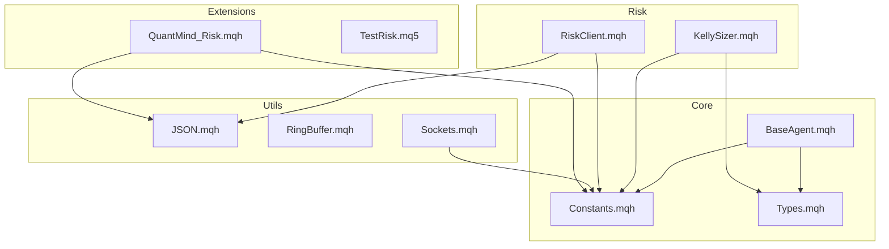
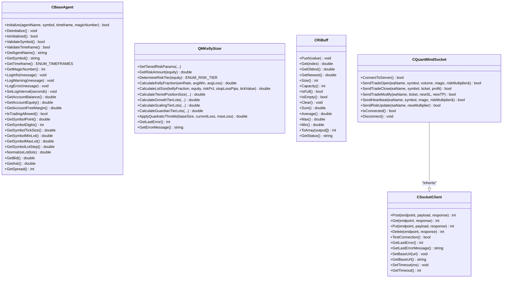
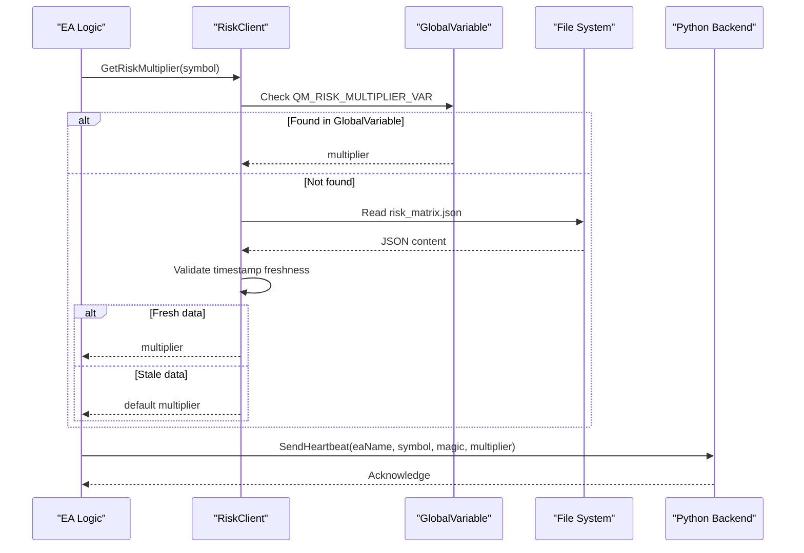
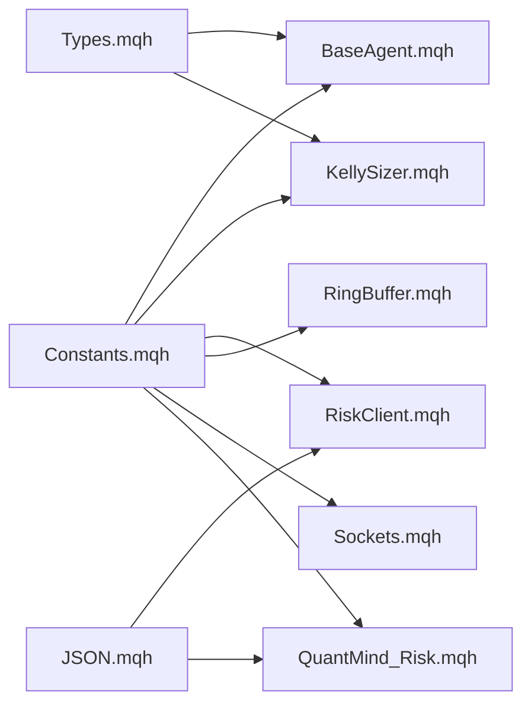

# MQL5 Programming Fundamentals

<cite>
**Referenced Files in This Document**
- [extensions/mql5_library/README.md](file://extensions/mql5_library/README.md)
- [extensions/mql5_library/Include/QuantMind/QuantMind_Risk.mqh](file://extensions/mql5_library/Include/QuantMind/QuantMind_Risk.mqh)
- [extensions/mql5_library/Experts/TestRisk.mq5](file://extensions/mql5_library/Experts/TestRisk.mq5)
- [src/mql5/Include/QuantMind/Core/BaseAgent.mqh](file://src/mql5/Include/QuantMind/Core/BaseAgent.mqh)
- [src/mql5/Include/QuantMind/Core/Constants.mqh](file://src/mql5/Include/QuantMind/Core/Constants.mqh)
- [src/mql5/Include/QuantMind/Core/Types.mqh](file://src/mql5/Include/QuantMind/Core/Types.mqh)
- [src/mql5/Include/QuantMind/Risk/KellySizer.mqh](file://src/mql5/Include/QuantMind/Risk/KellySizer.mqh)
- [src/mql5/Include/QuantMind/Risk/RiskClient.mqh](file://src/mql5/Include/QuantMind/Risk/RiskClient.mqh)
- [src/mql5/Include/QuantMind/Utils/JSON.mqh](file://src/mql5/Include/QuantMind/Utils/JSON.mqh)
- [src/mql5/Include/QuantMind/Utils/RingBuffer.mqh](file://src/mql5/Include/QuantMind/Utils/RingBuffer.mqh)
- [src/mql5/Include/QuantMind/Utils/Sockets.mqh](file://src/mql5/Include/QuantMind/Utils/Sockets.mqh)
- [src/mql5/Experts/TestCoreModules.mq5](file://src/mql5/Experts/TestCoreModules.mq5)
- [src/mql5/Experts/TestRiskModules.mq5](file://src/mql5/Experts/TestRiskModules.mq5)
</cite>

## Table of Contents
1. [Introduction](#introduction)
2. [Project Structure](#project-structure)
3. [Core Components](#core-components)
4. [Architecture Overview](#architecture-overview)
5. [Detailed Component Analysis](#detailed-component-analysis)
6. [Dependency Analysis](#dependency-analysis)
7. [Performance Considerations](#performance-considerations)
8. [Troubleshooting Guide](#troubleshooting-guide)
9. [Conclusion](#conclusion)

## Introduction
This document explains the MQL5 programming fundamentals of the QuantMind Standard Library (QSL). It focuses on the modular architecture built around reusable components, the CBaseAgent base class pattern, and the separation between Expert Advisor (EA) logic and specialized modules. It covers core programming patterns such as the strategy pattern (through module interfaces), component-based design, and the Python backend integration via heartbeat and risk synchronization. You will learn how to initialize modules, manage constants and types, implement risk-aware trading logic, and apply best practices for memory and performance.

## Project Structure
The QSL organizes MQL5 code into clearly separated modules under Include/QuantMind, grouped by domain:
- Core: foundational classes and shared types/constants
- Risk: position sizing, risk clients, and governance
- Utils: reusable utilities (JSON parsing, ring buffers, sockets)

The extensions/mql5_library provides a standalone, ready-to-use risk management library for Python-MQL5 synchronization, including a test EA and documentation.

**Diagram sources**
- [src/mql5/Include/QuantMind/Core/BaseAgent.mqh](file://src/mql5/Include/QuantMind/Core/BaseAgent.mqh#L27-L444)
- [src/mql5/Include/QuantMind/Core/Constants.mqh](file://src/mql5/Include/QuantMind/Core/Constants.mqh#L15-L270)
- [src/mql5/Include/QuantMind/Core/Types.mqh](file://src/mql5/Include/QuantMind/Core/Types.mqh#L15-L362)
- [src/mql5/Include/QuantMind/Risk/KellySizer.mqh](file://src/mql5/Include/QuantMind/Risk/KellySizer.mqh#L71-L533)
- [src/mql5/Include/QuantMind/Risk/RiskClient.mqh](file://src/mql5/Include/QuantMind/Risk/RiskClient.mqh#L61-L222)
- [src/mql5/Include/QuantMind/Utils/JSON.mqh](file://src/mql5/Include/QuantMind/Utils/JSON.mqh#L39-L179)
- [src/mql5/Include/QuantMind/Utils/RingBuffer.mqh](file://src/mql5/Include/QuantMind/Utils/RingBuffer.mqh#L35-L347)
- [src/mql5/Include/QuantMind/Utils/Sockets.mqh](file://src/mql5/Include/QuantMind/Utils/Sockets.mqh#L36-L750)
- [extensions/mql5_library/Include/QuantMind/QuantMind_Risk.mqh](file://extensions/mql5_library/Include/QuantMind/QuantMind_Risk.mqh#L54-L346)
- [extensions/mql5_library/Experts/TestRisk.mq5](file://extensions/mql5_library/Experts/TestRisk.mq5#L35-L340)

**Section sources**
- [src/mql5/Include/QuantMind/Core/BaseAgent.mqh](file://src/mql5/Include/QuantMind/Core/BaseAgent.mqh#L27-L444)
- [src/mql5/Include/QuantMind/Core/Constants.mqh](file://src/mql5/Include/QuantMind/Core/Constants.mqh#L15-L270)
- [src/mql5/Include/QuantMind/Core/Types.mqh](file://src/mql5/Include/QuantMind/Core/Types.mqh#L15-L362)
- [src/mql5/Include/QuantMind/Risk/KellySizer.mqh](file://src/mql5/Include/QuantMind/Risk/KellySizer.mqh#L71-L533)
- [src/mql5/Include/QuantMind/Risk/RiskClient.mqh](file://src/mql5/Include/QuantMind/Risk/RiskClient.mqh#L61-L222)
- [src/mql5/Include/QuantMind/Utils/JSON.mqh](file://src/mql5/Include/QuantMind/Utils/JSON.mqh#L39-L179)
- [src/mql5/Include/QuantMind/Utils/RingBuffer.mqh](file://src/mql5/Include/QuantMind/Utils/RingBuffer.mqh#L35-L347)
- [src/mql5/Include/QuantMind/Utils/Sockets.mqh](file://src/mql5/Include/QuantMind/Utils/Sockets.mqh#L36-L750)
- [extensions/mql5_library/Include/QuantMind/QuantMind_Risk.mqh](file://extensions/mql5_library/Include/QuantMind/QuantMind_Risk.mqh#L54-L346)
- [extensions/mql5_library/Experts/TestRisk.mq5](file://extensions/mql5_library/Experts/TestRisk.mq5#L35-L340)

## Core Components
This section introduces the foundational building blocks of QSL.

- CBaseAgent: central base class for EAs providing initialization, validation, logging, symbol/timeframe management, and common trading utilities. It encapsulates EA lifecycle and common operations, enabling reuse across strategies.
- Constants: centralized system-wide constants for risk limits, magic ranges, timeframes, communication, trading, and performance thresholds.
- Types: strongly typed structures and enums for trade proposals, account states, risk parameters, positions, orders, heartbeats, performance metrics, tasks, market conditions, news events, ring buffer elements, and JSON parse results. Also includes callback typedefs and conversion helpers.

Key responsibilities:
- BaseAgent: initialization/validation, logging, symbol/timeframe checks, account info access, lot normalization, and trading permission checks.
- Constants: define safe defaults, ranges, and thresholds used across modules.
- Types: enforce data contracts and provide helper functions for conversions and quality ratings.

Practical usage:
- Instantiate and initialize CBaseAgent in OnInit, then use its methods throughout OnTick and trading logic.
- Access QM_* constants and enums from Types to configure and validate behavior.
- Use structures like STradeProposal and SAccountState to pass around complex state.

**Section sources**
- [src/mql5/Include/QuantMind/Core/BaseAgent.mqh](file://src/mql5/Include/QuantMind/Core/BaseAgent.mqh#L27-L444)
- [src/mql5/Include/QuantMind/Core/Constants.mqh](file://src/mql5/Include/QuantMind/Core/Constants.mqh#L15-L270)
- [src/mql5/Include/QuantMind/Core/Types.mqh](file://src/mql5/Include/QuantMind/Core/Types.mqh#L15-L362)

## Architecture Overview
QSL follows a modular, layered architecture:
- Core layer: BaseAgent, Constants, Types
- Risk layer: RiskClient, KellySizer, PropManager (referenced in tests)
- Utilities: JSON, RingBuffer, Sockets
- Extensions: QuantMind_Risk library for Python-MQL5 synchronization

The design enforces separation of concerns:
- EA logic remains in Expert Advisors
- Risk and communication logic are encapsulated in dedicated modules
- Utilities provide reusable primitives for parsing, buffering, and networking

**Diagram sources**
- [src/mql5/Include/QuantMind/Core/BaseAgent.mqh](file://src/mql5/Include/QuantMind/Core/BaseAgent.mqh#L27-L444)
- [src/mql5/Include/QuantMind/Risk/KellySizer.mqh](file://src/mql5/Include/QuantMind/Risk/KellySizer.mqh#L71-L533)
- [src/mql5/Include/QuantMind/Utils/RingBuffer.mqh](file://src/mql5/Include/QuantMind/Utils/RingBuffer.mqh#L35-L347)
- [src/mql5/Include/QuantMind/Utils/Sockets.mqh](file://src/mql5/Include/QuantMind/Utils/Sockets.mqh#L36-L750)

## Detailed Component Analysis

### CBaseAgent: EA Foundation
CBaseAgent centralizes EA initialization, validation, logging, and common utilities. It ensures consistent behavior across EAs by:
- Capturing agent identity, symbol, timeframe, and magic number
- Validating symbol availability and trading mode
- Providing account and instrument metadata access
- Enforcing trading permission checks
- Normalizing lot sizes according to symbol constraints
- Rate-limiting informational logs

Best practices:
- Always call Initialize in OnInit with appropriate parameters
- Use IsInitialized to guard EA operations
- Leverage NormalizeLot for compliant order sizing
- Use LogInfo/LogWarning/LogError consistently for observability

**Section sources**
- [src/mql5/Include/QuantMind/Core/BaseAgent.mqh](file://src/mql5/Include/QuantMind/Core/BaseAgent.mqh#L27-L444)

### Risk Management: RiskClient and KellySizer
RiskClient retrieves risk multipliers via a fast path (GlobalVariable) and fallback path (JSON file), with freshness validation. It also supports heartbeat reporting to the Python backend.

KellySizer implements the Kelly criterion for optimal position sizing, with a tiered risk engine supporting:
- Growth tier: dynamic aggressive risk with a floor
- Scaling tier: standard Kelly percentage-based sizing
- Guardian tier: Kelly plus quadratic throttle for drawdown control

Integration patterns:
- Use GetRiskMultiplier to fetch the current multiplier per symbol
- Combine with KellySizer to compute position sizes respecting risk caps and drawdown
- Optionally send heartbeat to synchronize EA status with the backend

**Diagram sources**
- [src/mql5/Include/QuantMind/Risk/RiskClient.mqh](file://src/mql5/Include/QuantMind/Risk/RiskClient.mqh#L61-L222)
- [src/mql5/Include/QuantMind/Risk/KellySizer.mqh](file://src/mql5/Include/QuantMind/Risk/KellySizer.mqh#L71-L533)

**Section sources**
- [src/mql5/Include/QuantMind/Risk/RiskClient.mqh](file://src/mql5/Include/QuantMind/Risk/RiskClient.mqh#L61-L222)
- [src/mql5/Include/QuantMind/Risk/KellySizer.mqh](file://src/mql5/Include/QuantMind/Risk/KellySizer.mqh#L71-L533)

### Utilities: JSON Parsing, Ring Buffer, Sockets
- JSON.mqh: manual JSON parsing helpers to locate objects and extract numeric values, used by RiskClient and other modules.
- RingBuffer.mqh: O(1) circular buffer for efficient indicator computations and time-series storage.
- Sockets.mqh: HTTP/WebSocket client wrapper around MQL5’s WebRequest with error handling and convenience methods; includes a specialized CQuantMindSocket for sub-5ms latency messaging.

Usage tips:
- Use CRiBuff for moving averages, indicator smoothing, and recent history tracking
- Prefer CSocketClient/CQuantMindSocket for robust HTTP communication with clear error handling
- Use JSON helpers when native JSON support is insufficient

**Section sources**
- [src/mql5/Include/QuantMind/Utils/JSON.mqh](file://src/mql5/Include/QuantMind/Utils/JSON.mqh#L39-L179)
- [src/mql5/Include/QuantMind/Utils/RingBuffer.mqh](file://src/mql5/Include/QuantMind/Utils/RingBuffer.mqh#L35-L347)
- [src/mql5/Include/QuantMind/Utils/Sockets.mqh](file://src/mql5/Include/QuantMind/Utils/Sockets.mqh#L36-L750)

### Extensions: QuantMind Risk Library
The extensions/mql5_library provides a ready-to-use risk management library for Python-MQL5 synchronization:
- Fast path via GlobalVariable and fallback to JSON file
- Heartbeat reporting to the Python backend
- Test EA validating all paths and configurations

Installation and usage:
- Copy QuantMind_Risk.mqh to MQL5/Include/QuantMind/ and optionally TestRisk.mq5 to MQL5/Experts/
- Initialize with RiskInit in OnInit and deinitialize with RiskDeinit in OnDeinit
- Retrieve risk multipliers and send heartbeats in OnTick

**Section sources**
- [extensions/mql5_library/README.md](file://extensions/mql5_library/README.md#L1-L297)
- [extensions/mql5_library/Include/QuantMind/QuantMind_Risk.mqh](file://extensions/mql5_library/Include/QuantMind/QuantMind_Risk.mqh#L54-L346)
- [extensions/mql5_library/Experts/TestRisk.mq5](file://extensions/mql5_library/Experts/TestRisk.mq5#L35-L340)

### Practical Examples and Patterns
- Module initialization: Use TestCoreModules and TestRiskModules EAs to validate compilation and runtime behavior of Core and Risk modules respectively.
- Error handling: Utilize GetLastError and structured logging from CBaseAgent; CSocketClient surfaces WebRequest errors with actionable messages.
- Best practices: Cache GetRiskMultiplier per tick, validate inputs to KellySizer, and clamp values using provided macros.

**Section sources**
- [src/mql5/Experts/TestCoreModules.mq5](file://src/mql5/Experts/TestCoreModules.mq5#L35-L266)
- [src/mql5/Experts/TestRiskModules.mq5](file://src/mql5/Experts/TestRiskModules.mq5#L41-L303)
- [src/mql5/Include/QuantMind/Core/BaseAgent.mqh](file://src/mql5/Include/QuantMind/Core/BaseAgent.mqh#L216-L245)
- [src/mql5/Include/QuantMind/Utils/Sockets.mqh](file://src/mql5/Include/QuantMind/Utils/Sockets.mqh#L319-L340)

## Dependency Analysis
QSL modules exhibit clean dependency boundaries:
- Core depends on Constants and Types
- Risk depends on Core and Utils
- Utils depend on Constants
- Extensions depend on Utils and Core

**Diagram sources**
- [src/mql5/Include/QuantMind/Core/Constants.mqh](file://src/mql5/Include/QuantMind/Core/Constants.mqh#L15-L270)
- [src/mql5/Include/QuantMind/Core/BaseAgent.mqh](file://src/mql5/Include/QuantMind/Core/BaseAgent.mqh#L27-L444)
- [src/mql5/Include/QuantMind/Core/Types.mqh](file://src/mql5/Include/QuantMind/Core/Types.mqh#L15-L362)
- [src/mql5/Include/QuantMind/Risk/KellySizer.mqh](file://src/mql5/Include/QuantMind/Risk/KellySizer.mqh#L71-L533)
- [src/mql5/Include/QuantMind/Risk/RiskClient.mqh](file://src/mql5/Include/QuantMind/Risk/RiskClient.mqh#L61-L222)
- [src/mql5/Include/QuantMind/Utils/JSON.mqh](file://src/mql5/Include/QuantMind/Utils/JSON.mqh#L39-L179)
- [src/mql5/Include/QuantMind/Utils/RingBuffer.mqh](file://src/mql5/Include/QuantMind/Utils/RingBuffer.mqh#L35-L347)
- [src/mql5/Include/QuantMind/Utils/Sockets.mqh](file://src/mql5/Include/QuantMind/Utils/Sockets.mqh#L36-L750)
- [extensions/mql5_library/Include/QuantMind/QuantMind_Risk.mqh](file://extensions/mql5_library/Include/QuantMind/QuantMind_Risk.mqh#L54-L346)

**Section sources**
- [src/mql5/Include/QuantMind/Core/BaseAgent.mqh](file://src/mql5/Include/QuantMind/Core/BaseAgent.mqh#L27-L444)
- [src/mql5/Include/QuantMind/Risk/KellySizer.mqh](file://src/mql5/Include/QuantMind/Risk/KellySizer.mqh#L71-L533)
- [src/mql5/Include/QuantMind/Risk/RiskClient.mqh](file://src/mql5/Include/QuantMind/Risk/RiskClient.mqh#L61-L222)
- [src/mql5/Include/QuantMind/Utils/JSON.mqh](file://src/mql5/Include/QuantMind/Utils/JSON.mqh#L39-L179)
- [src/mql5/Include/QuantMind/Utils/RingBuffer.mqh](file://src/mql5/Include/QuantMind/Utils/RingBuffer.mqh#L35-L347)
- [src/mql5/Include/QuantMind/Utils/Sockets.mqh](file://src/mql5/Include/QuantMind/Utils/Sockets.mqh#L36-L750)
- [extensions/mql5_library/Include/QuantMind/QuantMind_Risk.mqh](file://extensions/mql5_library/Include/QuantMind/QuantMind_Risk.mqh#L54-L346)

## Performance Considerations
- Risk retrieval: Cache GetRiskMultiplier per tick to avoid repeated file reads or GlobalVariable checks.
- JSON parsing: Prefer GlobalVariable for real-time updates; use JSON fallback only when necessary.
- Networking: Use CSocketClient/CQuantMindSocket to centralize error handling and timeouts; batch or throttle heartbeats to reduce overhead.
- Indicators: Use CRiBuff for O(1) push/get operations to minimize loop overhead in indicator calculations.
- Memory: Avoid frequent allocations; reuse arrays and structures where possible; free resources in OnDeinit.

[No sources needed since this section provides general guidance]

## Troubleshooting Guide
Common issues and resolutions:
- WebRequest errors:
  - Error 4060: Add the target URL to Expert Advisors allowed list in MT5 options.
  - Function denied: Enable WebRequest in Expert Advisor settings.
- File not found:
  - Ensure risk_matrix.json is placed in MQL5/Files/ and readable.
- Stale data warnings:
  - Update timestamps in risk_matrix.json and ensure system time synchronization.
- Heartbeat failures:
  - Verify Python backend is running and reachable; check firewall and CORS settings.

**Section sources**
- [src/mql5/Include/QuantMind/Utils/Sockets.mqh](file://src/mql5/Include/QuantMind/Utils/Sockets.mqh#L319-L340)
- [src/mql5/Include/QuantMind/Risk/RiskClient.mqh](file://src/mql5/Include/QuantMind/Risk/RiskClient.mqh#L185-L216)
- [extensions/mql5_library/Experts/TestRisk.mq5](file://extensions/mql5_library/Experts/TestRisk.mq5#L264-L284)

## Conclusion
The QuantMind Standard Library establishes a robust, modular foundation for MQL5 development. By leveraging CBaseAgent for EA scaffolding, separating EA logic from specialized modules (risk, utilities), and integrating with a Python backend through heartbeat and risk synchronization, QSL promotes maintainability, performance, and scalability. Use the provided constants, types, and utilities to implement consistent, resilient trading systems.