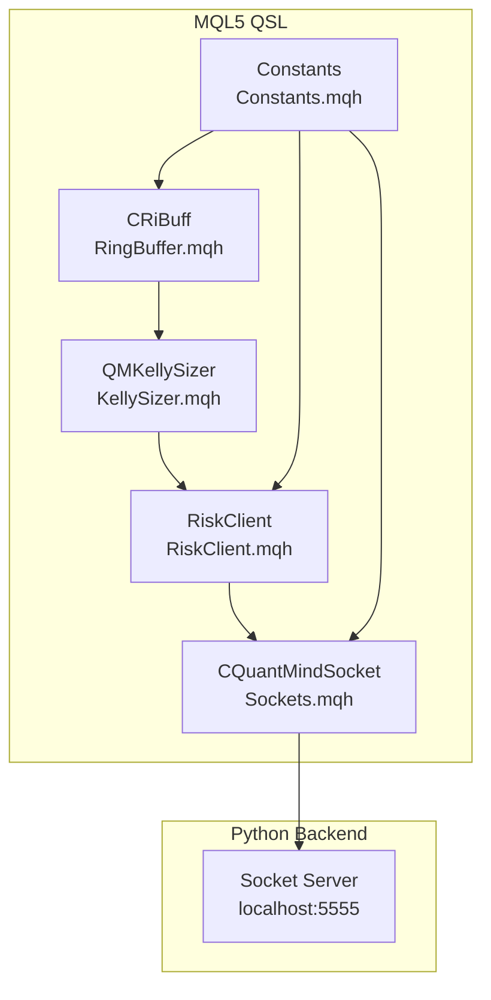
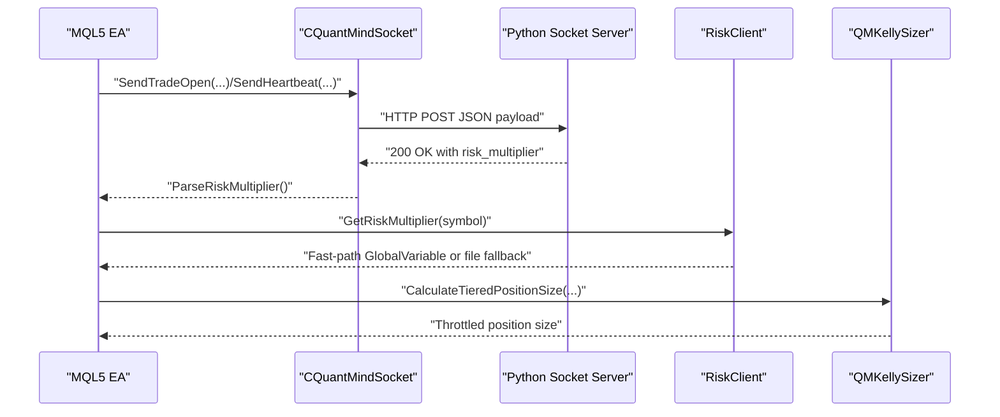
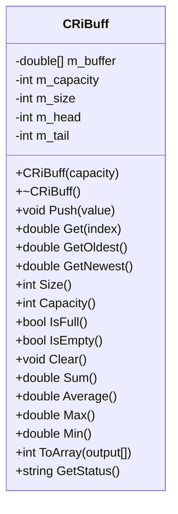
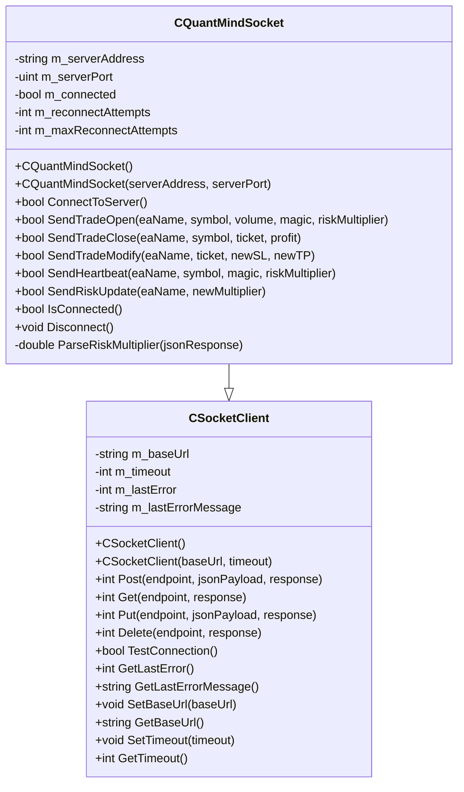
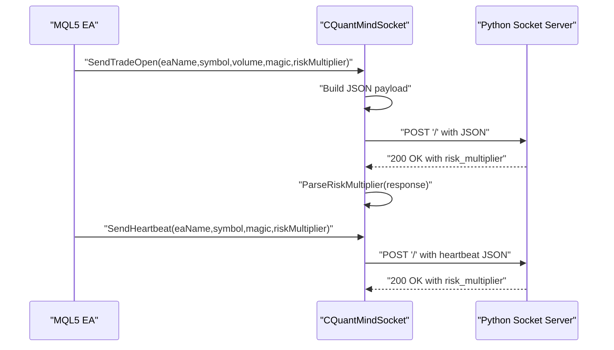
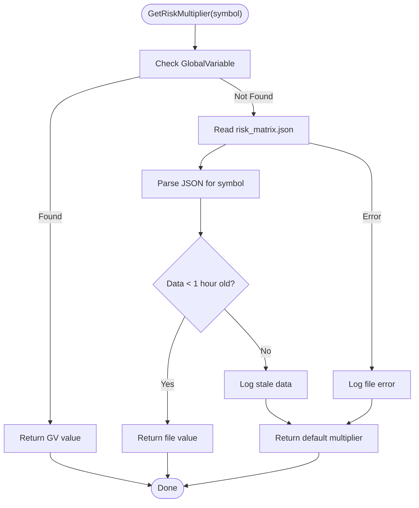
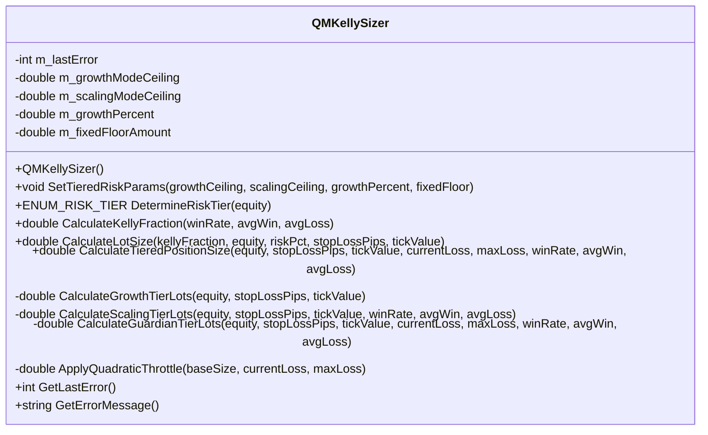
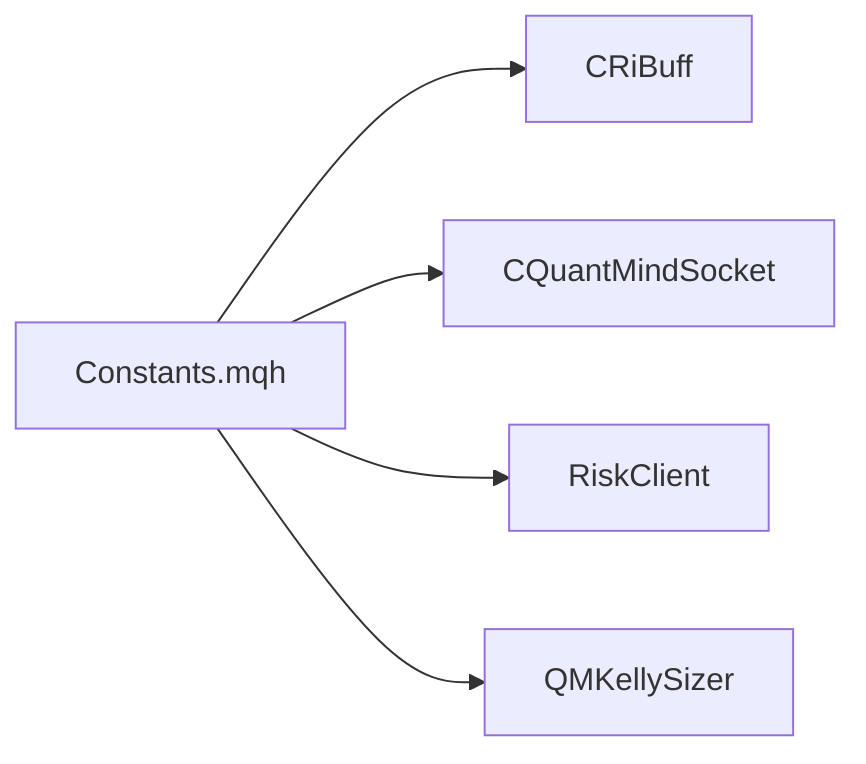

# Performance Optimization

<cite>
**Referenced Files in This Document**
- [RingBuffer.mqh](file://src/mql5/Include/QuantMind/Utils/RingBuffer.mqh)
- [Sockets.mqh](file://src/mql5/Include/QuantMind/Utils/Sockets.mqh)
- [Constants.mqh](file://src/mql5/Include/QuantMind/Core/Constants.mqh)
- [RiskClient.mqh](file://src/mql5/Include/QuantMind/Risk/RiskClient.mqh)
- [KellySizer.mqh](file://src/mql5/Include/QuantMind/Risk/KellySizer.mqh)
- [test_ringbuffer_properties.py](file://tests/mql5/test_ringbuffer_properties.py)
- [deployment_guide.md](file://docs/v8/deployment_guide.md)
- [advanced_memory_management_and_optimization_techniques_in_mql5.md](file://data/scraped_articles/trading/advanced_memory_management_and_optimization_techniques_in_mql5.md)
- [resample_timeframe.md](file://docs/skills/data_skills/resample_timeframe.md)
</cite>

## Table of Contents
1. [Introduction](#introduction)
2. [Project Structure](#project-structure)
3. [Core Components](#core-components)
4. [Architecture Overview](#architecture-overview)
5. [Detailed Component Analysis](#detailed-component-analysis)
6. [Dependency Analysis](#dependency-analysis)
7. [Performance Considerations](#performance-considerations)
8. [Troubleshooting Guide](#troubleshooting-guide)
9. [Conclusion](#conclusion)
10. [Appendices](#appendices)

## Introduction
This document presents a comprehensive guide to performance optimization in MQL5 trading applications within the QuantMindX ecosystem. It focuses on:
- O(1) ring buffer implementation for efficient time-series data management and indicator computations
- Low-latency communication patterns using the CQuantMindSocket class for sub-5ms event-driven communication with Python backend systems
- Memory management best practices, including dynamic allocation strategies, object lifecycle management, and garbage collection optimization
- Algorithmic optimization techniques for indicator calculations, market data processing, and real-time decision making
- Benchmarking methodologies, performance profiling tools, and optimization validation techniques
- Multi-timeframe analysis optimization, concurrent processing patterns, and resource utilization strategies
- Integration of performance optimizations with the physics-aware risk management system and chaos detection algorithms

## Project Structure
The performance-critical modules are organized under the QuantMind Standard Library (QSL) within the MQL5 include path. The primary components are:
- Utils: Ring buffer and socket communication abstractions
- Risk: Risk client and position sizing engines
- Core: System constants and performance thresholds

**Diagram sources**
- [RingBuffer.mqh](file://src/mql5/Include/QuantMind/Utils/RingBuffer.mqh#L35-L332)
- [Sockets.mqh](file://src/mql5/Include/QuantMind/Utils/Sockets.mqh#L427-L742)
- [RiskClient.mqh](file://src/mql5/Include/QuantMind/Risk/RiskClient.mqh#L61-L89)
- [KellySizer.mqh](file://src/mql5/Include/QuantMind/Risk/KellySizer.mqh#L71-L533)
- [Constants.mqh](file://src/mql5/Include/QuantMind/Core/Constants.mqh#L209-L221)

**Section sources**
- [RingBuffer.mqh](file://src/mql5/Include/QuantMind/Utils/RingBuffer.mqh#L1-L347)
- [Sockets.mqh](file://src/mql5/Include/QuantMind/Utils/Sockets.mqh#L1-L750)
- [Constants.mqh](file://src/mql5/Include/QuantMind/Core/Constants.mqh#L1-L270)

## Core Components
- CRiBuff (Ring Buffer): O(1) push/get operations with circular buffer semantics, enabling efficient moving average and indicator computations
- CQuantMindSocket: Persistent HTTP client optimized for sub-5ms event-driven communication with a Python ZMQ-backed socket server
- RiskClient: Fast-path risk multiplier retrieval via GlobalVariable with fallback to JSON file, ensuring minimal latency for risk-aware decisions
- QMKellySizer: Tiered risk engine with quadratic throttle for dynamic position sizing aligned with performance thresholds

**Section sources**
- [RingBuffer.mqh](file://src/mql5/Include/QuantMind/Utils/RingBuffer.mqh#L35-L332)
- [Sockets.mqh](file://src/mql5/Include/QuantMind/Utils/Sockets.mqh#L427-L742)
- [RiskClient.mqh](file://src/mql5/Include/QuantMind/Risk/RiskClient.mqh#L61-L89)
- [KellySizer.mqh](file://src/mql5/Include/QuantMind/Risk/KellySizer.mqh#L71-L533)

## Architecture Overview
The system integrates MQL5 EAs with a Python backend for near-real-time risk and decision-making. The EA sends trade events and heartbeats via CQuantMindSocket to the backend, which responds with risk multipliers. RiskClient retrieves these multipliers with a fast path and fallback mechanism. Indicator calculations leverage CRiBuff for O(1) time-series operations. Position sizing is performed by QMKellySizer using tiered risk logic and quadratic throttle.

**Diagram sources**
- [Sockets.mqh](file://src/mql5/Include/QuantMind/Utils/Sockets.mqh#L509-L642)
- [RiskClient.mqh](file://src/mql5/Include/QuantMind/Risk/RiskClient.mqh#L61-L89)
- [KellySizer.mqh](file://src/mql5/Include/QuantMind/Risk/KellySizer.mqh#L318-L436)

## Detailed Component Analysis

### CRiBuff: O(1) Ring Buffer
CRiBuff implements a circular buffer with:
- Push: O(1) amortized insertion; overwrites oldest element when full
- Get: O(1) indexed access; index 0 is most recent
- Additional operations: GetOldest, GetNewest, Sum, Average, Max, Min, ToArray, Clear, Size, Capacity, IsFull, IsEmpty

**Diagram sources**
- [RingBuffer.mqh](file://src/mql5/Include/QuantMind/Utils/RingBuffer.mqh#L35-L332)

Optimization highlights:
- Single allocation in constructor; no reallocation during Push
- Circular indexing ensures O(1) access and insertion
- Sum, Average, Max, Min are O(n) and should be used judiciously

Validation evidence:
- Property-based tests confirm O(1) behavior and memory allocation patterns

**Section sources**
- [RingBuffer.mqh](file://src/mql5/Include/QuantMind/Utils/RingBuffer.mqh#L35-L332)
- [test_ringbuffer_properties.py](file://tests/mql5/test_ringbuffer_properties.py#L1-L364)

### CQuantMindSocket: Sub-5ms Event-Driven Communication
CQuantMindSocket extends a generic CSocketClient to provide:
- Persistent connection pattern with reconnect attempts
- Optimized JSON payload construction and parsing
- Dedicated methods for trade events, heartbeats, and risk updates

**Diagram sources**
- [Sockets.mqh](file://src/mql5/Include/QuantMind/Utils/Sockets.mqh#L36-L340)
- [Sockets.mqh](file://src/mql5/Include/QuantMind/Utils/Sockets.mqh#L427-L742)

Communication flow for trade open and heartbeat:

**Diagram sources**
- [Sockets.mqh](file://src/mql5/Include/QuantMind/Utils/Sockets.mqh#L509-L642)

Integration steps:
- Include the socket module and instantiate a global client
- Connect to the backend server and send/receive events as needed

**Section sources**
- [Sockets.mqh](file://src/mql5/Include/QuantMind/Utils/Sockets.mqh#L427-L742)
- [deployment_guide.md](file://docs/v8/deployment_guide.md#L344-L409)

### RiskClient: Fast-Path Risk Multiplier Retrieval
RiskClient provides a two-tier lookup:
- Fast path: GlobalVariable set by Python agent
- Fallback path: risk_matrix.json file with freshness validation

**Diagram sources**
- [RiskClient.mqh](file://src/mql5/Include/QuantMind/Risk/RiskClient.mqh#L61-L89)

**Section sources**
- [RiskClient.mqh](file://src/mql5/Include/QuantMind/Risk/RiskClient.mqh#L61-L89)

### QMKellySizer: Tiered Risk Engine with Quadratic Throttle
QMKellySizer implements:
- Tiered risk tiers based on account equity
- Kelly criterion fraction calculation with caps
- Quadratic throttle for Guardian tier to reduce exposure under drawdown pressure

**Diagram sources**
- [KellySizer.mqh](file://src/mql5/Include/QuantMind/Risk/KellySizer.mqh#L71-L533)

**Section sources**
- [KellySizer.mqh](file://src/mql5/Include/QuantMind/Risk/KellySizer.mqh#L71-L533)

## Dependency Analysis
The performance-critical dependencies and thresholds are centralized in Constants.mqh, including:
- Performance thresholds for heartbeat, risk retrieval, and database queries
- Ring buffer sizes for small, medium, and large windows
- Communication timeouts and endpoints

**Diagram sources**
- [Constants.mqh](file://src/mql5/Include/QuantMind/Core/Constants.mqh#L209-L221)

**Section sources**
- [Constants.mqh](file://src/mql5/Include/QuantMind/Core/Constants.mqh#L209-L221)

## Performance Considerations
- Time-series operations
  - Use CRiBuff for O(1) push/get and avoid repeated array resizing
  - Prefer Sum, Average, Max, Min for bounded windows; cache results when possible
- Indicator calculations
  - Reuse buffers across indicators to minimize allocations
  - Compute only required bars per OnCalculate pass; avoid redundant recalculation
- Real-time decision making
  - Cache risk multipliers retrieved via RiskClient; refresh on schedule or event
  - Use CQuantMindSocket for persistent connections and batched events where feasible
- Memory management
  - Allocate buffers once in constructor; reuse via Clear or index-based updates
  - Avoid frequent ArrayResize in hot loops; pre-size based on Constants.mqh ring buffer sizes
  - Understand MQL5’s garbage collection characteristics and avoid premature deallocation patterns that increase GC pressure
- Multi-timeframe analysis
  - Align OHLC arrays across timeframes using resampling utilities
  - Use ring buffers per timeframe to maintain O(1) lookback windows
- Concurrent processing
  - Parallelize independent symbol/timeframe computations outside the EA event loop
  - Use thread-safe shared resources and avoid contention on shared sockets

[No sources needed since this section provides general guidance]

## Troubleshooting Guide
- Socket connectivity
  - Ensure the backend server is reachable and firewall rules allow inbound connections on the configured port
  - Verify allowed URLs in MetaTrader settings for WebRequest
- Risk multiplier retrieval
  - Confirm GlobalVariable is set by the Python agent or that risk_matrix.json exists and is fresh
  - Check JSON structure and keys expected by RiskClient
- Ring buffer behavior
  - Validate capacity sizing against indicator periods
  - Confirm O(1) assumptions by inspecting constructor and Push implementations
- Position sizing anomalies
  - Review tier determination and quadratic throttle logic under drawdown scenarios

**Section sources**
- [deployment_guide.md](file://docs/v8/deployment_guide.md#L381-L398)
- [RiskClient.mqh](file://src/mql5/Include/QuantMind/Risk/RiskClient.mqh#L160-L216)
- [RingBuffer.mqh](file://src/mql5/Include/QuantMind/Utils/RingBuffer.mqh#L50-L94)

## Conclusion
By combining O(1) ring buffers, low-latency socket communication, fast-path risk retrieval, and a tiered position sizing engine with quadratic throttle, MQL5 EAs can achieve sub-5ms event processing and robust risk-aware decision-making. Centralized performance thresholds and memory management best practices further ensure predictable performance across multi-symbol and multi-timeframe strategies.

[No sources needed since this section summarizes without analyzing specific files]

## Appendices

### Multi-Timeframe Analysis Optimization
- Resample higher timeframe bars from lower timeframe data
- Maintain separate ring buffers per timeframe for indicator windows
- Align timestamps across timeframes for synchronized decision making

**Section sources**
- [resample_timeframe.md](file://docs/skills/data_skills/resample_timeframe.md#L372-L488)

### Memory Management Best Practices
- Prefer stack allocation for short-lived locals; reserve heap for reusable buffers
- Pre-size arrays and avoid repeated resizing inside OnTick/OnCalculate
- Use Clear to reset buffer state without deallocating memory

**Section sources**
- [advanced_memory_management_and_optimization_techniques_in_mql5.md](file://data/scraped_articles/trading/advanced_memory_management_and_optimization_techniques_in_mql5.md#L79-L88)