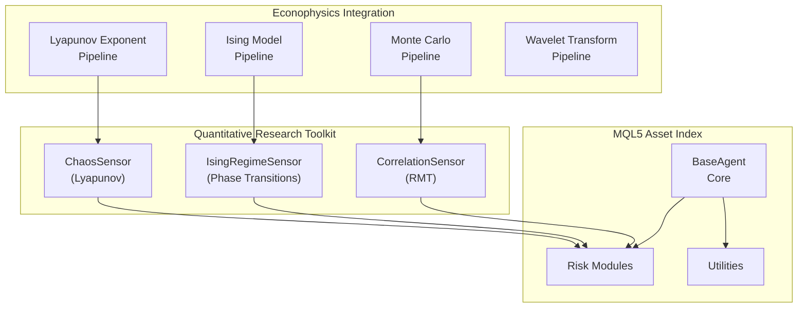
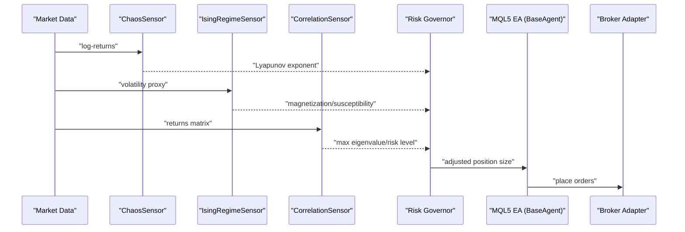
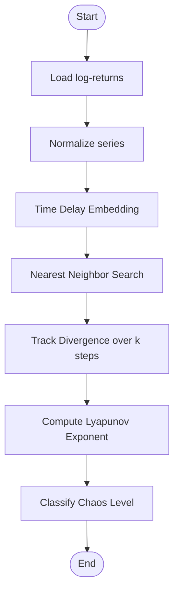
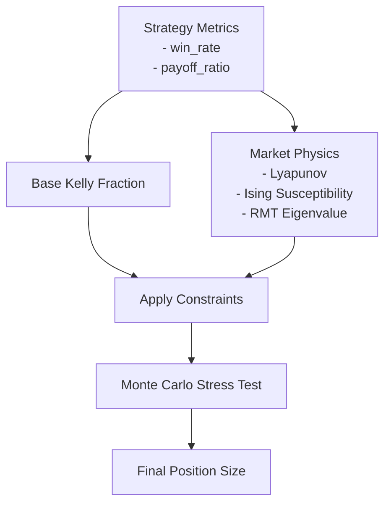
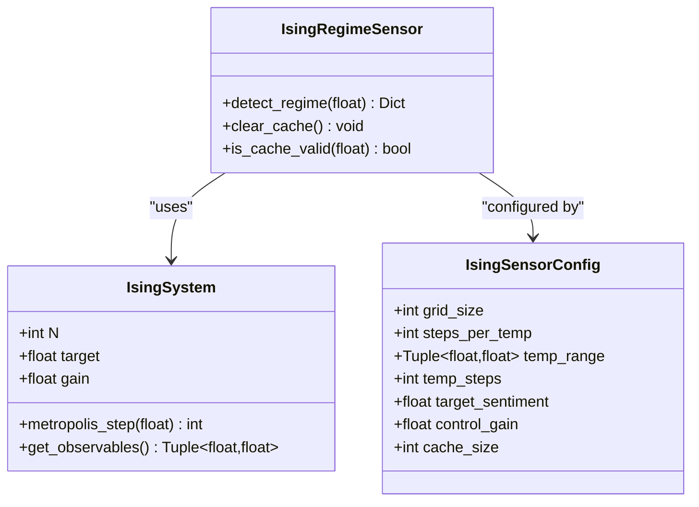
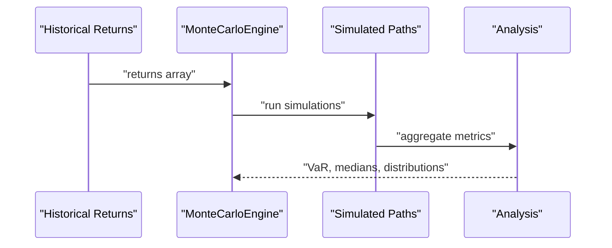
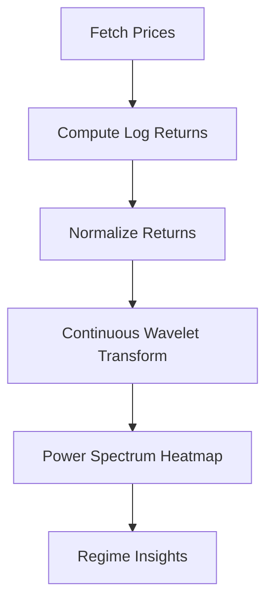
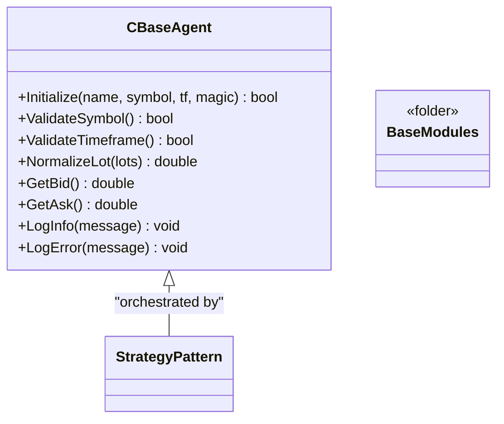
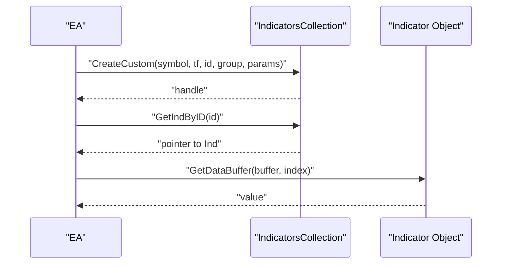
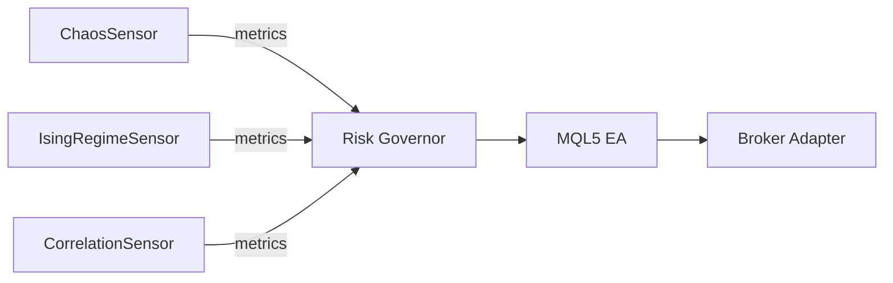

# Advanced Topics

<cite>
**Referenced Files in This Document**
- [ECONOPHYSICS_INTEGRATION.md](file://docs/ECONOPHYSICS_INTEGRATION.md)
- [mql5_asset_index.md](file://docs/knowledge/mql5_asset_index.md)
- [Lyapunov Pipeline.py](file://quant-traderr-lab/Lyapunov Exponent/Lyapunov Pipeline.py)
- [Ising Pipeline.py](file://quant-traderr-lab/Ising Model/Ising Pipeline.py)
- [Monte Carlo Pipeline.py](file://quant-traderr-lab/Monte Carlo/Monte Carlo Pipeline.py)
- [Wavelet_Pipeline.py](file://quant-traderr-lab/Wavelet Transform/Wavelet_Pipeline.py)
- [ising_sensor.py](file://src/risk/physics/ising_sensor.py)
- [chaos_sensor.py](file://src/risk/physics/chaos_sensor.py)
- [correlation_sensor.py](file://src/risk/physics/correlation_sensor.py)
- [BaseAgent.mqh](file://src/mql5/Include/QuantMind/Core/BaseAgent.mqh)
- [Lyapunov Exponent article](file://data/scraped_articles/trading_systems/chaos_theory_in_trading__part_1___introduction__application_in_financial_markets_and_lyapunov_exponen.md)
- [DoEasy Indicators Custom](file://data/scraped_articles/trading_systems/timeseries_in_doeasy_library__part_56___custom_indicator_object__get_data_from_indicator_objects_in.md)
</cite>

## Table of Contents
1. [Introduction](#introduction)
2. [Project Structure](#project-structure)
3. [Core Components](#core-components)
4. [Architecture Overview](#architecture-overview)
5. [Detailed Component Analysis](#detailed-component-analysis)
6. [Dependency Analysis](#dependency-analysis)
7. [Performance Considerations](#performance-considerations)
8. [Troubleshooting Guide](#troubleshooting-guide)
9. [Conclusion](#conclusion)
10. [Appendices](#appendices)

## Introduction
This document presents advanced quantitative techniques implemented and integrated within QUANTMIND-X, focusing on:
- Chaos theory applications: Lyapunov exponent calculation, phase space reconstruction, and market predictability analysis
- Econophysics integration: physics principles applied to financial markets, market dynamics modeling, and risk prediction methodologies
- Advanced quantitative research tools: wavelet transforms, Ising models, and Monte Carlo simulations
- MQL5 asset index system, advanced indicator development, and custom library creation
- Theoretical foundations, mathematical derivations, and practical implementation patterns for expert-level usage and optimization

## Project Structure
QUANTMIND-X organizes advanced analytics across three primary layers:
- Econophysics integration layer: Python-based pipelines and sensors feeding risk governance and position sizing
- Quantitative research toolkit: reusable modules for chaos detection, phase transitions, and stochastic modeling
- MQL5 asset index system: modular, production-ready library for building Expert Advisors with standardized components

**Diagram sources**
- [ECONOPHYSICS_INTEGRATION.md](file://docs/ECONOPHYSICS_INTEGRATION.md#L1-L557)
- [ising_sensor.py](file://src/risk/physics/ising_sensor.py#L1-L246)
- [chaos_sensor.py](file://src/risk/physics/chaos_sensor.py#L1-L253)
- [correlation_sensor.py](file://src/risk/physics/correlation_sensor.py#L1-L285)
- [BaseAgent.mqh](file://src/mql5/Include/QuantMind/Core/BaseAgent.mqh#L1-L444)

**Section sources**
- [ECONOPHYSICS_INTEGRATION.md](file://docs/ECONOPHYSICS_INTEGRATION.md#L1-L557)
- [mql5_asset_index.md](file://docs/knowledge/mql5_asset_index.md#L1-L800)

## Core Components
- ChaosSensor: computes Lyapunov exponent using phase space reconstruction and the method of analogues
- IsingRegimeSensor: simulates market dynamics via Metropolis-Hastings on a 3D lattice to detect phase transitions
- CorrelationSensor: applies Random Matrix Theory (RMT) to identify systemic risk via eigenvalue thresholding
- Econophysics-aware position sizing: integrates chaos, phase transitions, and correlation noise into dynamic risk adjustments
- MQL5 QSL: modular framework for building Expert Advisors with standardized risk, utilities, and base agent functionality

**Section sources**
- [chaos_sensor.py](file://src/risk/physics/chaos_sensor.py#L1-L253)
- [ising_sensor.py](file://src/risk/physics/ising_sensor.py#L1-L246)
- [correlation_sensor.py](file://src/risk/physics/correlation_sensor.py#L1-L285)
- [ECONOPHYSICS_INTEGRATION.md](file://docs/ECONOPHYSICS_INTEGRATION.md#L71-L155)
- [BaseAgent.mqh](file://src/mql5/Include/QuantMind/Core/BaseAgent.mqh#L1-L444)

## Architecture Overview
The system blends physics-inspired analytics with MQL5 execution:
- Python pipelines and sensors analyze market regimes and risks
- Results feed into risk governance and position sizing engines
- MQL5 modules orchestrate trading decisions with standardized logging, validation, and utilities

**Diagram sources**
- [chaos_sensor.py](file://src/risk/physics/chaos_sensor.py#L195-L241)
- [ising_sensor.py](file://src/risk/physics/ising_sensor.py#L140-L195)
- [correlation_sensor.py](file://src/risk/physics/correlation_sensor.py#L229-L281)
- [ECONOPHYSICS_INTEGRATION.md](file://docs/ECONOPHYSICS_INTEGRATION.md#L384-L411)
- [BaseAgent.mqh](file://src/mql5/Include/QuantMind/Core/BaseAgent.mqh#L303-L327)

## Detailed Component Analysis

### Chaos Theory: Lyapunov Exponent and Predictability
- Mathematical foundation: measures divergence rate of nearby trajectories in phase space to quantify chaos
- Implementation approach:
  - Phase space reconstruction via time delay embedding
  - Method of analogues: nearest neighbor search to find historically similar trajectories
  - Divergence tracking over k steps to compute Lyapunov exponent
- Practical usage:
  - High positive Lyapunov exponent signals chaotic, unpredictable regimes
  - Guides dynamic position sizing reductions and predictive horizon adjustments

**Diagram sources**
- [chaos_sensor.py](file://src/risk/physics/chaos_sensor.py#L67-L176)
- [Lyapunov Pipeline.py](file://quant-traderr-lab/Lyapunov Exponent/Lyapunov Pipeline.py#L119-L193)

**Section sources**
- [chaos_sensor.py](file://src/risk/physics/chaos_sensor.py#L1-L253)
- [Lyapunov Pipeline.py](file://quant-traderr-lab/Lyapunov Exponent/Lyapunov Pipeline.py#L1-L237)
- [Lyapunov Exponent article](file://data/scraped_articles/trading_systems/chaos_theory_in_trading__part_1___introduction__application_in_financial_markets_and_lyapunov_exponen.md#L75-L237)

### Econophysics Integration: Market Dynamics and Risk Prediction
- Physics-inspired metrics:
  - Lyapunov exponent (chaos)
  - Ising model magnetization/susceptibility (phase transitions)
  - Random Matrix Theory maximum eigenvalue (systemic risk)
- Position sizing integration:
  - Base Kelly fraction adjusted by chaos dampener, phase transition guard, and correlation penalty
  - Monte Carlo validation ensures risk of ruin constraints

**Diagram sources**
- [ECONOPHYSICS_INTEGRATION.md](file://docs/ECONOPHYSICS_INTEGRATION.md#L71-L155)

**Section sources**
- [ECONOPHYSICS_INTEGRATION.md](file://docs/ECONOPHYSICS_INTEGRATION.md#L25-L173)

### Ising Model: Phase Transition Detection
- Core concept: maps volatility to temperature; simulates spin dynamics to detect critical points
- Implementation:
  - 3D lattice with Metropolis-Hastings updates
  - Dynamic field bias aligns spins toward target sentiment
  - Observables: magnetization, susceptibility; classification: ordered/disordered/transition

**Diagram sources**
- [ising_sensor.py](file://src/risk/physics/ising_sensor.py#L31-L103)
- [ising_sensor.py](file://src/risk/physics/ising_sensor.py#L105-L246)

**Section sources**
- [Ising Pipeline.py](file://quant-traderr-lab/Ising Model/Ising Pipeline.py#L1-L291)
- [ising_sensor.py](file://src/risk/physics/ising_sensor.py#L1-L246)

### Monte Carlo: Stochastic Modeling and Risk Validation
- Method: bootstrap resampling from historical returns to simulate future paths
- Outputs: expected returns, value-at-risk, confidence intervals, and distribution summaries
- Integration: validates position sizing by ensuring risk of ruin remains acceptably low

**Diagram sources**
- [Monte Carlo Pipeline.py](file://quant-traderr-lab/Monte Carlo/Monte Carlo Pipeline.py#L105-L136)
- [Monte Carlo Pipeline.py](file://quant-traderr-lab/Monte Carlo/Monte Carlo Pipeline.py#L140-L229)

**Section sources**
- [Monte Carlo Pipeline.py](file://quant-traderr-lab/Monte Carlo/Monte Carlo Pipeline.py#L1-L233)
- [ECONOPHYSICS_INTEGRATION.md](file://docs/ECONOPHYSICS_INTEGRATION.md#L25-L65)

### Wavelet Transform: Multi-Frequency Market Regimes
- Method: continuous wavelet transform (Morlet) to localize volatility in time-frequency space
- Application: identifies clustering of volatility across scales for regime characterization

**Diagram sources**
- [Wavelet_Pipeline.py](file://quant-traderr-lab/Wavelet Transform/Wavelet_Pipeline.py#L88-L129)
- [Wavelet_Pipeline.py](file://quant-traderr-lab/Wavelet Transform/Wavelet_Pipeline.py#L137-L288)

**Section sources**
- [Wavelet_Pipeline.py](file://quant-traderr-lab/Wavelet Transform/Wavelet_Pipeline.py#L1-L352)

### MQL5 Asset Index System: Modular EA Architecture
- Core modules:
  - BaseAgent: initialization, validation, logging, symbol/timeframe management, lot normalization
  - Risk modules: prop firm risk management, risk multiplier retrieval, Kelly sizing
  - Utilities: JSON parsing, sockets, ring buffers
- Strategy pattern: EA logic separated into independent modules orchestrated by a strategy object

**Diagram sources**
- [BaseAgent.mqh](file://src/mql5/Include/QuantMind/Core/BaseAgent.mqh#L27-L440)

**Section sources**
- [mql5_asset_index.md](file://docs/knowledge/mql5_asset_index.md#L1-L800)
- [BaseAgent.mqh](file://src/mql5/Include/QuantMind/Core/BaseAgent.mqh#L1-L444)

### Advanced Indicator Development and Custom Libraries
- Custom indicator object support: create, manage, and retrieve indicators by ID
- Integration patterns: build indicator collections, set IDs, and access buffers for analytics
- Practical guidance: use ID-based lookup to coordinate multiple timeframes and groups

**Diagram sources**
- [DoEasy Indicators Custom](file://data/scraped_articles/trading_systems/timeseries_in_doeasy_library__part_56___custom_indicator_object__get_data_from_indicator_objects_in.md#L502-L936)

**Section sources**
- [DoEasy Indicators Custom](file://data/scraped_articles/trading_systems/timeseries_in_doeasy_library__part_56___custom_indicator_object__get_data_from_indicator_objects_in.md#L502-L1003)

## Dependency Analysis
- Internal dependencies:
  - ChaosSensor depends on scikit-learn for nearest neighbor search
  - IsingRegimeSensor uses NumPy for Monte Carlo sampling and thermodynamics
  - CorrelationSensor relies on SciPy for eigenvalue decomposition
  - MQL5 modules depend on standard library and broker adapters
- External integration:
  - Risk governor consumes physics metrics to adjust position sizing
  - MQL5 EA communicates with backend via sockets and risk matrix synchronization

**Diagram sources**
- [chaos_sensor.py](file://src/risk/physics/chaos_sensor.py#L195-L241)
- [ising_sensor.py](file://src/risk/physics/ising_sensor.py#L140-L195)
- [correlation_sensor.py](file://src/risk/physics/correlation_sensor.py#L229-L281)
- [ECONOPHYSICS_INTEGRATION.md](file://docs/ECONOPHYSICS_INTEGRATION.md#L384-L411)
- [BaseAgent.mqh](file://src/mql5/Include/QuantMind/Core/BaseAgent.mqh#L303-L327)

**Section sources**
- [ECONOPHYSICS_INTEGRATION.md](file://docs/ECONOPHYSICS_INTEGRATION.md#L1-L557)
- [correlation_sensor.py](file://src/risk/physics/correlation_sensor.py#L1-L285)

## Performance Considerations
- Chaos analysis:
  - Optimize embedding dimension and time delay for dataset length
  - Use KD-tree nearest neighbor search; consider approximate methods for large datasets
- Ising simulation:
  - Cache temperature results; reuse thermalized configurations when feasible
  - Limit grid size for real-time constraints; increase for accuracy
- RMT filtering:
  - Exploit symmetry of correlation matrices; use eigh for stability
  - Regularization prevents numerical instabilities; cache eigenvalue computations
- MQL5 execution:
  - Prefer O(1) operations (ring buffers) for indicator calculations
  - Minimize file I/O; leverage GlobalVariables for inter-language synchronization
  - Use rate-limited logging and batched updates to reduce overhead

[No sources needed since this section provides general guidance]

## Troubleshooting Guide
- ChaosSensor errors:
  - Insufficient data length for embedding or lookback windows
  - Zero or near-zero standard deviation causing normalization issues
- IsingRegimeSensor:
  - Temperature mapping anomalies; ensure volatility context is provided when needed
  - Cache invalidation; clear cache when parameters change
- CorrelationSensor:
  - Non-positive definite correlation matrices; apply regularization
  - NaN handling; replace with column means prior to covariance calculation
- MQL5 EA:
  - Validate symbol and timeframe before initialization
  - Check trading permissions and symbol availability
  - Normalize lot sizes according to symbol constraints

**Section sources**
- [chaos_sensor.py](file://src/risk/physics/chaos_sensor.py#L83-L128)
- [ising_sensor.py](file://src/risk/physics/ising_sensor.py#L140-L195)
- [correlation_sensor.py](file://src/risk/physics/correlation_sensor.py#L57-L80)
- [BaseAgent.mqh](file://src/mql5/Include/QuantMind/Core/BaseAgent.mqh#L127-L169)

## Conclusion
QUANTMIND-X integrates econophysics and advanced quantitative techniques to enhance market understanding and risk-aware trading. By combining chaos theory, phase transition detection, and stochastic modeling with a modular MQL5 framework, the system enables expert-level customization, robust validation, and optimized position sizing. The documented components and patterns provide a blueprint for extending and tailoring the platform to evolving market conditions.

[No sources needed since this section summarizes without analyzing specific files]

## Appendices
- Implementation references:
  - ChaosSensor and Lyapunov pipeline
  - IsingRegimeSensor and Ising pipeline
  - CorrelationSensor and RMT filtering
  - MQL5 QSL modules and BaseAgent
- Usage patterns:
  - ID-based indicator management
  - Physics-aware position sizing workflows
  - Monte Carlo stress testing for risk validation

[No sources needed since this section aggregates references without analyzing specific files]