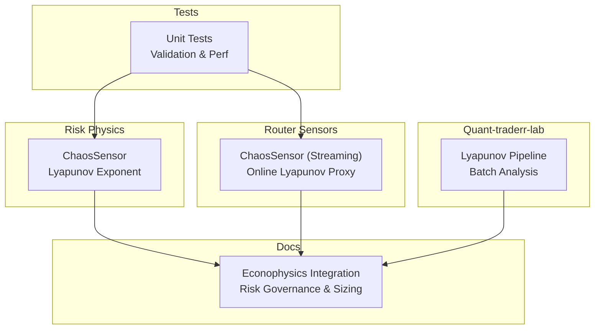
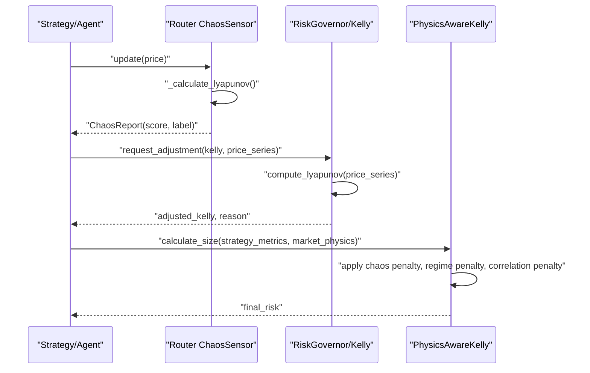
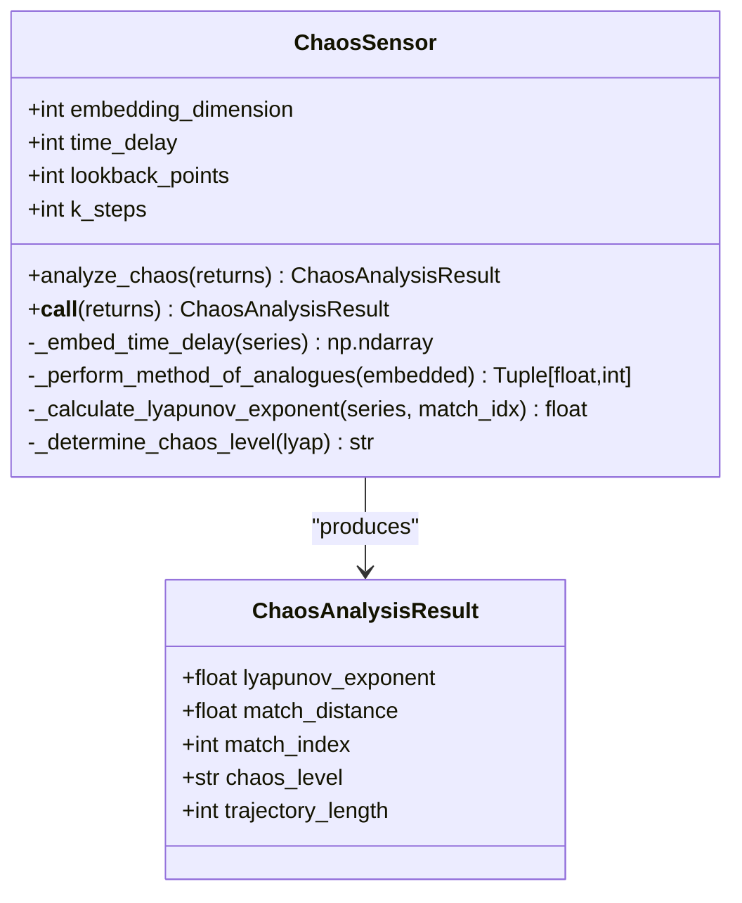
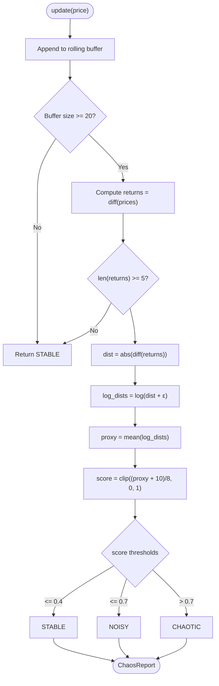
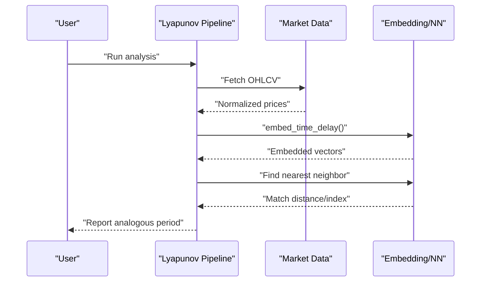
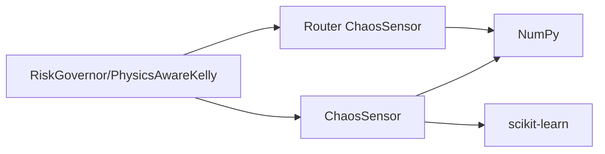

# Chaos Theory Applications

<cite>
**Referenced Files in This Document**
- [chaos_sensor.py](file://src/risk/physics/chaos_sensor.py)
- [chaos.py](file://src/router/sensors/chaos.py)
- [test_chaos_sensor.py](file://tests/risk/physics/test_chaos_sensor.py)
- [Lyapunov Pipeline.py](file://quant-traderr-lab/Lyapunov Exponent/Lyapunov Pipeline.py)
- [ECONOPHYSICS_INTEGRATION.md](file://docs/ECONOPHYSICS_INTEGRATION.md)
- [chaos_theory_in_trading__part_1___introduction__application_in_financial_markets_and_lyapunov_expone.md](file://data/scraped_articles/trading_systems/chaos_theory_in_trading__part_1___introduction__application_in_financial_markets_and_lyapunov_expone.md)
- [chaos_theory_in_trading__part_2___diving_deeper.md](file://data/scraped_articles/trading_systems/chaos_theory_in_trading__part_2___diving_deeper.md)
</cite>

## Table of Contents
1. [Introduction](#introduction)
2. [Project Structure](#project-structure)
3. [Core Components](#core-components)
4. [Architecture Overview](#architecture-overview)
5. [Detailed Component Analysis](#detailed-component-analysis)
6. [Dependency Analysis](#dependency-analysis)
7. [Performance Considerations](#performance-considerations)
8. [Troubleshooting Guide](#troubleshooting-guide)
9. [Conclusion](#conclusion)
10. [Appendices](#appendices)

## Introduction
This document explains how chaos theory is applied in quantitative finance, focusing on the Lyapunov exponent as a measure of sensitivity to initial conditions and deterministic chaos. It documents phase space reconstruction via time delay embedding, the method of analogues for nearest neighbor search, and divergence tracking algorithms. It also describes the ChaosSensor class implementation, including parameter tuning for embedding dimension, time delay, and lookback periods, and provides practical examples for market regime detection, volatility clustering analysis, and predictability assessment. Finally, it interprets chaos levels (stable, moderate, chaotic) and their implications for trading strategy selection and risk management.

## Project Structure
The chaos theory implementation spans multiple modules:
- Risk physics: core ChaosSensor class with Lyapunov exponent calculation and chaos level classification
- Router sensors: lightweight online ChaosSensor for streaming price updates
- Quant-traderr-lab: standalone Lyapunov pipeline for batch analysis and educational reference
- Tests: unit tests validating the ChaosSensor behavior and performance targets
- Documentation: econophysics integration guide mapping chaos into risk governance and position sizing

**Diagram sources**
- [chaos_sensor.py](file://src/risk/physics/chaos_sensor.py#L31-L253)
- [chaos.py](file://src/router/sensors/chaos.py#L14-L57)
- [Lyapunov Pipeline.py](file://quant-traderr-lab/Lyapunov Exponent/Lyapunov Pipeline.py#L1-L237)
- [test_chaos_sensor.py](file://tests/risk/physics/test_chaos_sensor.py#L1-L140)
- [ECONOPHYSICS_INTEGRATION.md](file://docs/ECONOPHYSICS_INTEGRATION.md#L384-L411)

**Section sources**
- [chaos_sensor.py](file://src/risk/physics/chaos_sensor.py#L1-L253)
- [chaos.py](file://src/router/sensors/chaos.py#L1-L57)
- [Lyapunov Pipeline.py](file://quant-traderr-lab/Lyapunov Exponent/Lyapunov Pipeline.py#L1-L237)
- [test_chaos_sensor.py](file://tests/risk/physics/test_chaos_sensor.py#L1-L140)
- [ECONOPHYSICS_INTEGRATION.md](file://docs/ECONOPHYSICS_INTEGRATION.md#L372-L411)

## Core Components
- ChaosSensor (risk/physics): Implements phase space reconstruction, method of analogues, divergence tracking, and chaos level classification. It accepts parameters for embedding dimension, time delay, lookback points, and steps to track divergence.
- ChaosSensor (router): Lightweight online variant that computes a proxy Lyapunov score from recent returns and labels the regime as STABLE, NOISY, or CHAOTIC.
- Lyapunov Pipeline (quant-traderr-lab): Educational batch pipeline demonstrating time delay embedding, nearest neighbor search, and reporting analogous periods.
- Tests: Validate correctness, error handling, and performance targets for ChaosSensor.

Key implementation references:
- Phase space reconstruction and method of analogues: [chaos_sensor.py](file://src/risk/physics/chaos_sensor.py#L67-L140)
- Divergence tracking and Lyapunov exponent: [chaos_sensor.py](file://src/risk/physics/chaos_sensor.py#L142-L176)
- Chaos level determination: [chaos_sensor.py](file://src/risk/physics/chaos_sensor.py#L178-L194)
- Online proxy (streaming): [chaos.py](file://src/router/sensors/chaos.py#L26-L56)
- Batch pipeline example: [Lyapunov Pipeline.py](file://quant-traderr-lab/Lyapunov Exponent/Lyapunov Pipeline.py#L119-L193)

**Section sources**
- [chaos_sensor.py](file://src/risk/physics/chaos_sensor.py#L31-L253)
- [chaos.py](file://src/router/sensors/chaos.py#L14-L57)
- [Lyapunov Pipeline.py](file://quant-traderr-lab/Lyapunov Exponent/Lyapunov Pipeline.py#L119-L193)
- [test_chaos_sensor.py](file://tests/risk/physics/test_chaos_sensor.py#L16-L140)

## Architecture Overview
The chaos analysis architecture integrates offline and online computation:
- Offline: ChaosSensor computes the Lyapunov exponent from normalized returns using time delay embedding and divergence tracking.
- Online: Router ChaosSensor maintains a rolling window of prices and derives a simplified proxy score.
- Integration: Econophysics integration maps chaos metrics into risk governance and position sizing adjustments.

**Diagram sources**
- [chaos.py](file://src/router/sensors/chaos.py#L19-L56)
- [ECONOPHYSICS_INTEGRATION.md](file://docs/ECONOPHYSICS_INTEGRATION.md#L384-L411)
- [ECONOPHYSICS_INTEGRATION.md](file://docs/ECONOPHYSICS_INTEGRATION.md#L72-L154)

## Detailed Component Analysis

### ChaosSensor (Lyapunov Exponent)
The ChaosSensor class encapsulates:
- Phase space reconstruction via time delay embedding
- Method of analogues to find nearest neighbors
- Divergence tracking over k-steps to compute Lyapunov exponent
- Chaos level classification based on thresholds

**Diagram sources**
- [chaos_sensor.py](file://src/risk/physics/chaos_sensor.py#L31-L253)

Key methods and responsibilities:
- Parameter tuning: embedding_dimension, time_delay, lookback_points, k_steps
- Input validation and normalization
- Phase space reconstruction using time delay embedding
- Nearest neighbor search using KD-tree
- Divergence tracking and Lyapunov exponent computation
- Chaos level mapping

Practical examples:
- Market regime detection: use chaos levels to switch between trend-following and mean-reversion strategies
- Volatility clustering analysis: correlate positive Lyapunov values with increased realized volatility windows
- Predictability assessment: shorter forecast horizons under positive Lyapunov regimes

Interpretation of chaos levels:
- STABLE: negative or near-zero Lyapunov; relatively predictable behavior
- MODERATE: small positive Lyapunov; mild sensitivity to initial conditions
- CHAOTIC: larger positive Lyapunov; high sensitivity, reduced predictability

Integration implications:
- Risk management: reduce position size in CHAOTIC regimes
- Strategy selection: favor trend-following in STABLE, mean-reversion in MODERATE, avoid directional bias in CHAOTIC

**Section sources**
- [chaos_sensor.py](file://src/risk/physics/chaos_sensor.py#L31-L253)
- [test_chaos_sensor.py](file://tests/risk/physics/test_chaos_sensor.py#L16-L140)
- [ECONOPHYSICS_INTEGRATION.md](file://docs/ECONOPHYSICS_INTEGRATION.md#L384-L411)

### Router ChaosSensor (Streaming Proxy)
The router’s ChaosSensor maintains a rolling buffer of prices and computes a simplified proxy Lyapunov score based on the rate of return divergence. It maps the proxy to a categorical label for quick regime inference.

**Diagram sources**
- [chaos.py](file://src/router/sensors/chaos.py#L19-L56)

**Section sources**
- [chaos.py](file://src/router/sensors/chaos.py#L14-L57)

### Lyapunov Pipeline (Educational Batch Example)
The quant-traderr-lab Lyapunov Pipeline demonstrates:
- Data acquisition and normalization
- Time delay embedding
- Nearest neighbor search using KD-tree
- Reporting analogous historical periods

**Diagram sources**
- [Lyapunov Pipeline.py](file://quant-traderr-lab/Lyapunov Exponent/Lyapunov Pipeline.py#L67-L193)

**Section sources**
- [Lyapunov Pipeline.py](file://quant-traderr-lab/Lyapunov Exponent/Lyapunov Pipeline.py#L1-L237)

### Mathematical Foundations and Implementation Notes
- Sensitive dependence on initial conditions: Lyapunov exponent quantifies exponential divergence of nearby trajectories in phase space.
- Deterministic chaos: Despite deterministic dynamics, long-term prediction remains limited due to exponential divergence.
- Phase space reconstruction: Using Takens’ theorem, a scalar time series is lifted into a higher-dimensional space via delayed coordinates.
- Method of analogues: Finds historically similar patterns by nearest neighbor search in the reconstructed space.
- Divergence tracking: Computes average logarithmic divergence over k-steps to estimate the largest Lyapunov exponent.

References for parameter selection and methodology:
- Time delay and embedding dimension selection: [chaos_theory_in_trading__part_2___diving_deeper.md](file://data/scraped_articles/trading_systems/chaos_theory_in_trading__part_2___diving_deeper.md#L519-L728)
- Practical volatility forecasting via phase space: [chaos_theory_in_trading__part_2___diving_deeper.md](file://data/scraped_articles/trading_systems/chaos_theory_in_trading__part_2___diving_deeper.md#L351-L416)

**Section sources**
- [chaos_theory_in_trading__part_1___introduction__application_in_financial_markets_and_lyapunov_expone.md](file://data/scraped_articles/trading_systems/chaos_theory_in_trading__part_1___introduction__application_in_financial_markets_and_lyapunov_expone.md#L75-L86)
- [chaos_theory_in_trading__part_2___diving_deeper.md](file://data/scraped_articles/trading_systems/chaos_theory_in_trading__part_2___diving_deeper.md#L351-L416)
- [chaos_theory_in_trading__part_2___diving_deeper.md](file://data/scraped_articles/trading_systems/chaos_theory_in_trading__part_2___diving_deeper.md#L519-L728)

## Dependency Analysis
- ChaosSensor depends on NumPy for numerical operations and scikit-learn’s NearestNeighbors for efficient nearest neighbor search.
- Router ChaosSensor depends on NumPy for rolling computations.
- Econophysics integration ties chaos metrics into risk governance and position sizing.

**Diagram sources**
- [chaos_sensor.py](file://src/risk/physics/chaos_sensor.py#L14-L20)
- [chaos.py](file://src/router/sensors/chaos.py#L6-L7)
- [ECONOPHYSICS_INTEGRATION.md](file://docs/ECONOPHYSICS_INTEGRATION.md#L384-L411)

**Section sources**
- [chaos_sensor.py](file://src/risk/physics/chaos_sensor.py#L14-L20)
- [chaos.py](file://src/router/sensors/chaos.py#L6-L7)
- [ECONOPHYSICS_INTEGRATION.md](file://docs/ECONOPHYSICS_INTEGRATION.md#L384-L411)

## Performance Considerations
- Complexity: Time delay embedding creates O(N·D) vectors; nearest neighbor search scales with dataset size. For large datasets, consider approximate nearest neighbor libraries or periodic recalibration.
- Rolling window: Router ChaosSensor maintains bounded memory and recomputes proxy quickly; suitable for live feeds.
- Validation target: Unit tests enforce sub-100 ms analysis time for typical inputs, ensuring responsiveness in production.

[No sources needed since this section provides general guidance]

## Troubleshooting Guide
Common issues and resolutions:
- Insufficient data length: Ensure input arrays meet minimum length requirements for embedding and method of analogues. The analyzer raises explicit errors when data is too short.
- Parameter mismatch: Verify embedding_dimension and time_delay produce a feasible number of embedded vectors; otherwise, a ValueError is raised.
- Near-zero divergence: Avoid taking logarithm of zero; small noise floors are added in proxy calculations.
- Streaming edge cases: If the rolling buffer is too small, the streaming sensor defaults to stable behavior.

**Section sources**
- [chaos_sensor.py](file://src/risk/physics/chaos_sensor.py#L83-L88)
- [chaos_sensor.py](file://src/risk/physics/chaos_sensor.py#L112-L128)
- [chaos.py](file://src/router/sensors/chaos.py#L27-L34)

## Conclusion
Chaos theory provides actionable insights for financial markets by measuring sensitivity to initial conditions and characterizing regime behavior. The ChaosSensor enables robust offline analysis, while the router variant supports real-time regime inference. Combined with econophysics integration, chaos metrics inform risk management and position sizing, guiding strategy selection across stable, moderate, and chaotic regimes.

[No sources needed since this section summarizes without analyzing specific files]

## Appendices

### Parameter Tuning Guidelines
- Embedding dimension (D): Choose based on signal dimensionality and noise; start with values derived from false nearest neighbors analysis.
- Time delay (τ): Use mutual information or autocorrelation to select independence-based delays.
- Lookback points: Balance responsiveness with statistical reliability; longer windows improve stability at the cost of latency.
- k-steps: Reflects the averaging window for divergence; increase for smoother estimates, decrease for faster adaptation.

**Section sources**
- [chaos_theory_in_trading__part_2___diving_deeper.md](file://data/scraped_articles/trading_systems/chaos_theory_in_trading__part_2___diving_deeper.md#L519-L728)
- [chaos_sensor.py](file://src/risk/physics/chaos_sensor.py#L48-L65)

### Practical Examples
- Market regime detection: Switch to mean-reversion in MODERATE and avoid directional strategies in CHAOTIC regimes.
- Volatility clustering analysis: Track realized volatility during positive Lyapunov windows to calibrate risk models.
- Predictability assessment: Shorten forecast windows under positive Lyapunov regimes; use regime labels to gate model updates.

**Section sources**
- [ECONOPHYSICS_INTEGRATION.md](file://docs/ECONOPHYSICS_INTEGRATION.md#L384-L411)
- [chaos_theory_in_trading__part_1___introduction__application_in_financial_markets_and_lyapunov_expone.md](file://data/scraped_articles/trading_systems/chaos_theory_in_trading__part_1___introduction__application_in_financial_markets_and_lyapunov_expone.md#L231-L257)