# Econophysics Integration

<cite>
**Referenced Files in This Document**
- [ECONOPHYSICS_INTEGRATION.md](file://docs/ECONOPHYSICS_INTEGRATION.md)
- [Monte Carlo Pipeline.py](file://quant-traderr-lab/Monte Carlo/Monte Carlo Pipeline.py)
- [RMT_Pipeline.py](file://quant-traderr-lab/RMT_Correlation_Filter/RMT_Pipeline.py)
- [Fisher pipeline.py](file://quant-traderr-lab/Fisher Transfrom/Fisher pipeline.py)
- [Ising Pipeline.py](file://quant-traderr-lab/Ising Model/Ising Pipeline.py)
- [Lyapunov Pipeline.py](file://quant-traderr-lab/Lyapunov Exponent/Lyapunov Pipeline.py)
- [Wavelet_Pipeline.py](file://quant-traderr-lab/Wavelet Transform/Wavelet_Pipeline.py)
- [MST pipeline.py](file://quant-traderr-lab/MST/MST pipeline.py)
- [Sandpile Pipeline.py](file://quant-traderr-lab/Sandpile Model/Sandpile Pipeline.py)
- [README.md](file://README.md)
- [market_physics.py](file://src/risk/models/market_physics.py)
- [kelly_engine.py](file://src/risk/sizing/kelly_engine.py)
- [monte_carlo_validator.py](file://src/risk/sizing/monte_carlo_validator.py)
- [chaos_sensor.py](file://src/risk/physics/chaos_sensor.py)
- [ising_sensor.py](file://src/risk/physics/ising_sensor.py)
- [correlation_sensor.py](file://src/risk/physics/correlation_sensor.py)
- [sentinel.py](file://src/router/sentinel.py)
- [governor.py](file://src/router/governor.py)
- [commander.py](file://src/router/commander.py)
- [engine.py](file://src/router/engine.py)
- [state.py](file://src/router/state.py)
- [enhanced_kelly_user_guide.md](file://docs/user_guides/enhanced_kelly_user_guide.md)
</cite>

## Table of Contents
1. [Introduction](#introduction)
2. [Project Structure](#project-structure)
3. [Core Components](#core-components)
4. [Architecture Overview](#architecture-overview)
5. [Detailed Component Analysis](#detailed-component-analysis)
6. [Dependency Analysis](#dependency-analysis)
7. [Performance Considerations](#performance-considerations)
8. [Troubleshooting Guide](#troubleshooting-guide)
9. [Conclusion](#conclusion)

## Introduction
This document presents a comprehensive econophysics integration framework for financial modeling within the QuantMind-X ecosystem. It maps advanced quantitative research tools—rooted in physics—to practical trading operations, enabling market regime detection, volatility modeling, and systemic risk assessment. The approach leverages:
- Statistical mechanics analogies (Ising model for phase transitions)
- Thermodynamic-inspired measures (Lyapunov exponents for chaos)
- Complex systems theory (MST for network structure, sandpile model for avalanches)
- Signal processing (Fisher and Hilbert transforms)
- Multi-scale analysis (wavelet transforms)
- Noise reduction (RMT correlation filtering)
- Risk assessment (Monte Carlo simulations)

These modules are integrated across the Intelligence Hub (research and strategy lifecycle) and the Strategy Router (real-time risk governance and execution), with position sizing informed by a physics-aware Enhanced Kelly framework.

## Project Structure
The econophysics integration spans three primary areas:
- Research pipelines (quant-traderr-lab): standalone modules for signal processing, network analysis, and criticality detection
- Risk and position sizing (src/risk): physics sensors and sizing engines that inform real-time risk management
- Strategy Router (src/router): real-time monitoring, governance, and dispatch aligned with econophysical signals

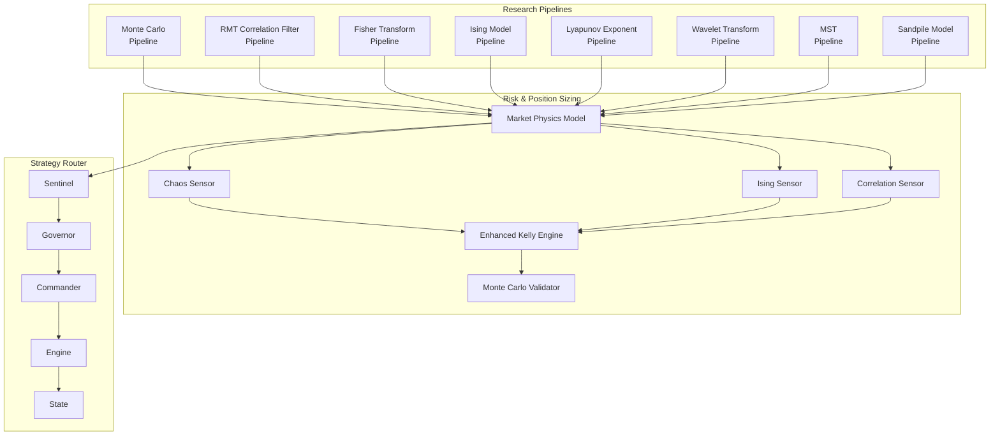

**Diagram sources**
- [ECONOPHYSICS_INTEGRATION.md](file://docs/ECONOPHYSICS_INTEGRATION.md#L10-L557)
- [market_physics.py](file://src/risk/models/market_physics.py)
- [kelly_engine.py](file://src/risk/sizing/kelly_engine.py)
- [monte_carlo_validator.py](file://src/risk/sizing/monte_carlo_validator.py)
- [chaos_sensor.py](file://src/risk/physics/chaos_sensor.py)
- [ising_sensor.py](file://src/risk/physics/ising_sensor.py)
- [correlation_sensor.py](file://src/risk/physics/correlation_sensor.py)
- [sentinel.py](file://src/router/sentinel.py)
- [governor.py](file://src/router/governor.py)
- [commander.py](file://src/router/commander.py)
- [engine.py](file://src/router/engine.py)
- [state.py](file://src/router/state.py)

**Section sources**
- [README.md](file://README.md#L1-L80)
- [ECONOPHYSICS_INTEGRATION.md](file://docs/ECONOPHYSICS_INTEGRATION.md#L10-L557)

## Core Components
This section outlines the econophysical modules and their integration points:

- Monte Carlo
  - Purpose: simulate price paths using bootstrap resampling to estimate Value at Risk and validate strategy robustness
  - Integration: Backtest Engine validation and Enhanced Kelly Monte Carlo stress testing
  - Implementation: [Monte Carlo Pipeline.py](file://quant-traderr-lab/Monte Carlo/Monte Carlo Pipeline.py#L105-L136)

- RMT (Random Matrix Theory)
  - Purpose: filter noise from correlation matrices to extract true signals and improve portfolio diversification
  - Integration: Strategy Router correlation filtering and portfolio allocation
  - Implementation: [RMT_Pipeline.py](file://quant-traderr-lab/RMT_Correlation_Filter/RMT_Pipeline.py#L118-L157)

- Fisher Transform
  - Purpose: normalize price to Gaussian-like distribution for clearer overbought/oversold signals and momentum shifts
  - Integration: Strategy Router regime-aware signals and EA signal generation
  - Implementation: [Fisher pipeline.py](file://quant-traderr-lab/Fisher Transfrom/Fisher pipeline.py#L115-L147)

- Ising Model
  - Purpose: detect phase transitions by mapping volatility to temperature and measuring susceptibility
  - Integration: Strategy Router enhanced regime detection
  - Implementation: [Ising Pipeline.py](file://quant-traderr-lab/Ising Model/Ising Pipeline.py#L179-L237)

- Lyapunov Exponent
  - Purpose: quantify chaos/instability in time series to adjust position sizing dynamically
  - Integration: Risk Governor chaos adjustments and Enhanced Kelly damping
  - Implementation: [Lyapunov Pipeline.py](file://quant-traderr-lab/Lyapunov Exponent/Lyapunov Pipeline.py#L140-L193)

- Wavelet Transform
  - Purpose: multi-resolution decomposition to identify volatility regimes across time horizons
  - Integration: Strategy Router multi-timeframe analysis
  - Implementation: [Wavelet_Pipeline.py](file://quant-traderr-lab/Wavelet Transform/Wavelet_Pipeline.py#L121-L126)

- MST (Minimum Spanning Tree)
  - Purpose: network analysis of asset correlations to identify clusters and systemic risk
  - Integration: Strategy Router risk management and position sizing constraints
  - Implementation: [MST pipeline.py](file://quant-traderr-lab/MST/MST pipeline.py#L210-L227)

- Sandpile Model
  - Purpose: model self-organized criticality to anticipate market avalanches and stress-induced cascades
  - Integration: Reference/documentation for future early warning systems
  - Implementation: [Sandpile Pipeline.py](file://quant-traderr-lab/Sandpile Model/Sandpile Pipeline.py#L177-L230)

**Section sources**
- [ECONOPHYSICS_INTEGRATION.md](file://docs/ECONOPHYSICS_INTEGRATION.md#L25-L557)
- [Monte Carlo Pipeline.py](file://quant-traderr-lab/Monte Carlo/Monte Carlo Pipeline.py#L105-L136)
- [RMT_Pipeline.py](file://quant-traderr-lab/RMT_Correlation_Filter/RMT_Pipeline.py#L118-L157)
- [Fisher pipeline.py](file://quant-traderr-lab/Fisher Transfrom/Fisher pipeline.py#L115-L147)
- [Ising Pipeline.py](file://quant-traderr-lab/Ising Model/Ising Pipeline.py#L179-L237)
- [Lyapunov Pipeline.py](file://quant-traderr-lab/Lyapunov Exponent/Lyapunov Pipeline.py#L140-L193)
- [Wavelet_Pipeline.py](file://quant-traderr-lab/Wavelet Transform/Wavelet_Pipeline.py#L121-L126)
- [MST pipeline.py](file://quant-traderr-lab/MST/MST pipeline.py#L210-L227)
- [Sandpile Pipeline.py](file://quant-traderr-lab/Sandpile Model/Sandpile Pipeline.py#L177-L230)

## Architecture Overview
The econophysics-enabled trading system couples research-grade analysis with operational risk controls:

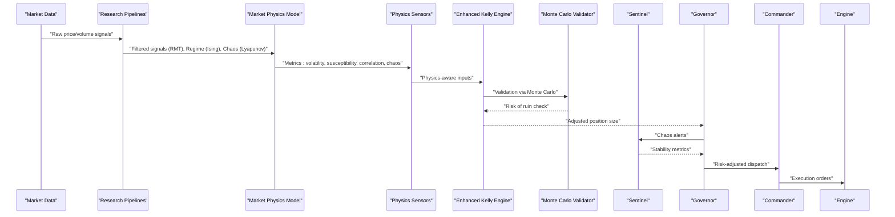

**Diagram sources**
- [ECONOPHYSICS_INTEGRATION.md](file://docs/ECONOPHYSICS_INTEGRATION.md#L71-L155)
- [market_physics.py](file://src/risk/models/market_physics.py)
- [kelly_engine.py](file://src/risk/sizing/kelly_engine.py)
- [monte_carlo_validator.py](file://src/risk/sizing/monte_carlo_validator.py)
- [chaos_sensor.py](file://src/risk/physics/chaos_sensor.py)
- [ising_sensor.py](file://src/risk/physics/ising_sensor.py)
- [correlation_sensor.py](file://src/risk/physics/correlation_sensor.py)
- [sentinel.py](file://src/router/sentinel.py)
- [governor.py](file://src/router/governor.py)
- [commander.py](file://src/router/commander.py)
- [engine.py](file://src/router/engine.py)

## Detailed Component Analysis

### Monte Carlo Validation
Monte Carlo simulations provide a robust method to assess strategy performance robustness and estimate tail risks. The pipeline performs bootstrap resampling from historical returns to project synthetic equity curves and compute percentiles.

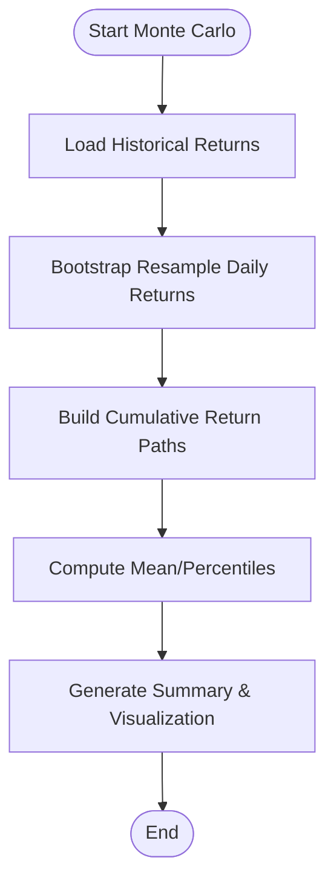

**Diagram sources**
- [Monte Carlo Pipeline.py](file://quant-traderr-lab/Monte Carlo/Monte Carlo Pipeline.py#L105-L136)

**Section sources**
- [Monte Carlo Pipeline.py](file://quant-traderr-lab/Monte Carlo/Monte Carlo Pipeline.py#L105-L136)
- [ECONOPHYSICS_INTEGRATION.md](file://docs/ECONOPHYSICS_INTEGRATION.md#L37-L65)

### RMT Correlation Filtering
Random Matrix Theory separates signal from noise in correlation matrices by filtering eigenvalues above the Marchenko–Pastur bound. This improves portfolio diversification and reduces spurious co-movement effects.

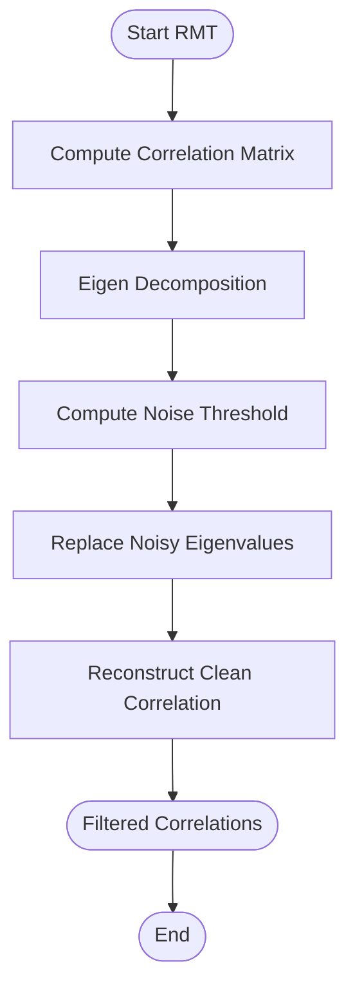

**Diagram sources**
- [RMT_Pipeline.py](file://quant-traderr-lab/RMT_Correlation_Filter/RMT_Pipeline.py#L118-L157)

**Section sources**
- [RMT_Pipeline.py](file://quant-traderr-lab/RMT_Correlation_Filter/RMT_Pipeline.py#L118-L157)
- [ECONOPHYSICS_INTEGRATION.md](file://docs/ECONOPHYSICS_INTEGRATION.md#L187-L220)

### Fisher Transform for Signal Processing
The Fisher Transform normalizes price over a rolling window and applies a hyperbolic logarithmic transformation to produce a bounded signal suitable for momentum and regime detection.

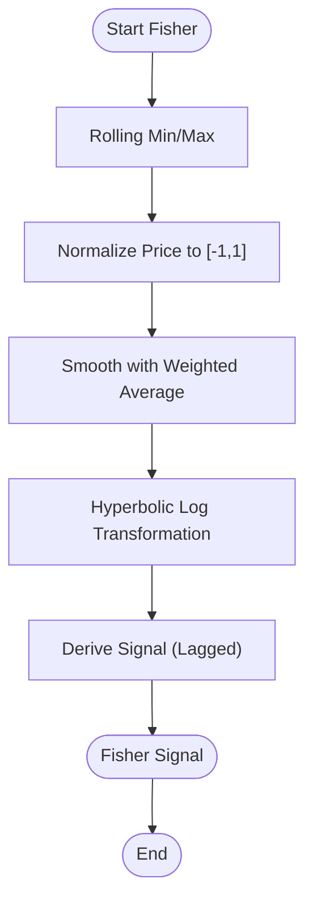

**Diagram sources**
- [Fisher pipeline.py](file://quant-traderr-lab/Fisher Transfrom/Fisher pipeline.py#L115-L147)

**Section sources**
- [Fisher pipeline.py](file://quant-traderr-lab/Fisher Transfrom/Fisher pipeline.py#L115-L147)
- [ECONOPHYSICS_INTEGRATION.md](file://docs/ECONOPHYSICS_INTEGRATION.md#L235-L294)

### Ising Model for Market Regime Detection
The Ising model simulates social sentiment dynamics on a 3D lattice, mapping volatility to temperature and tracking susceptibility to detect critical transitions indicative of regime changes.

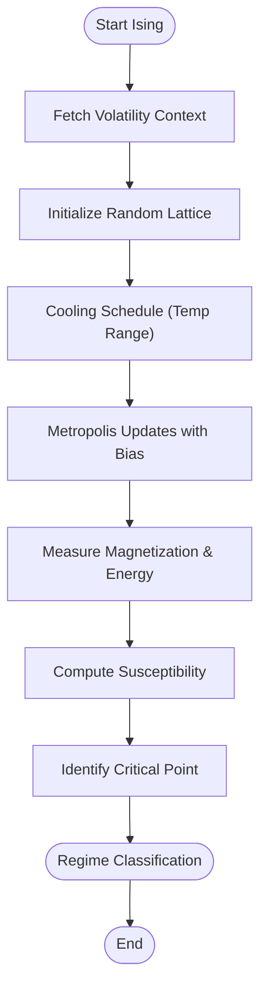

**Diagram sources**
- [Ising Pipeline.py](file://quant-traderr-lab/Ising Model/Ising Pipeline.py#L179-L237)

**Section sources**
- [Ising Pipeline.py](file://quant-traderr-lab/Ising Model/Ising Pipeline.py#L179-L237)
- [ECONOPHYSICS_INTEGRATION.md](file://docs/ECONOPHYSICS_INTEGRATION.md#L331-L368)

### Lyapunov Exponent for Chaos Measurement
The Lyapunov exponent quantifies sensitivity to initial conditions using time-delay embedding and nearest neighbor searches, providing a proxy for market predictability collapse.

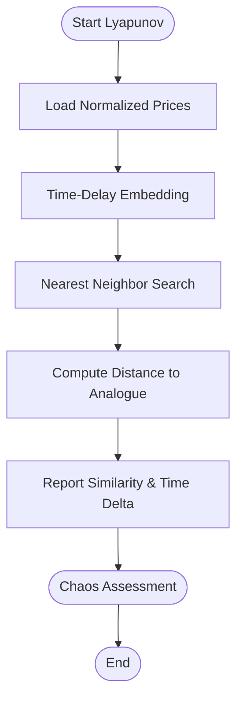

**Diagram sources**
- [Lyapunov Pipeline.py](file://quant-traderr-lab/Lyapunov Exponent/Lyapunov Pipeline.py#L140-L193)

**Section sources**
- [Lyapunov Pipeline.py](file://quant-traderr-lab/Lyapunov Exponent/Lyapunov Pipeline.py#L140-L193)
- [ECONOPHYSICS_INTEGRATION.md](file://docs/ECONOPHYSICS_INTEGRATION.md#L383-L411)

### Wavelet Transform for Multi-Scale Volatility
Continuous Wavelet Transform decomposes log returns into time-frequency space, revealing volatility regimes across multiple horizons.

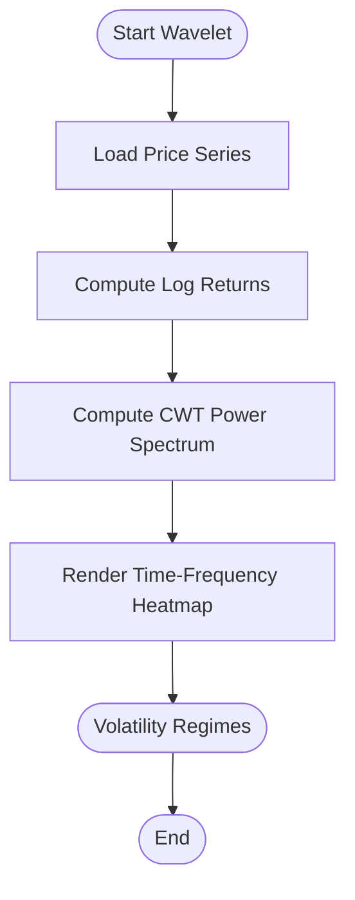

**Diagram sources**
- [Wavelet_Pipeline.py](file://quant-traderr-lab/Wavelet Transform/Wavelet_Pipeline.py#L121-L126)

**Section sources**
- [Wavelet_Pipeline.py](file://quant-traderr-lab/Wavelet Transform/Wavelet_Pipeline.py#L121-L126)
- [ECONOPHYSICS_INTEGRATION.md](file://docs/ECONOPHYSICS_INTEGRATION.md#L427-L449)

### MST for Network Structure and Systemic Risk
Minimum Spanning Tree analysis of correlation distances reveals market skeleton, hubs, and sector clustering, informing diversification and systemic risk metrics.

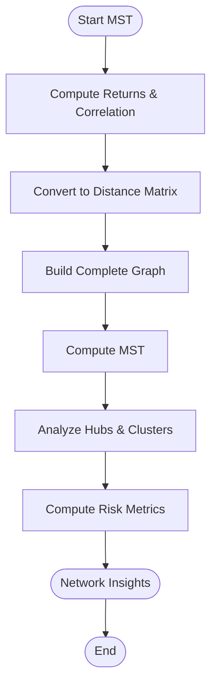

**Diagram sources**
- [MST pipeline.py](file://quant-traderr-lab/MST/MST pipeline.py#L210-L227)

**Section sources**
- [MST pipeline.py](file://quant-traderr-lab/MST/MST pipeline.py#L210-L227)
- [ECONOPHYSICS_INTEGRATION.md](file://docs/ECONOPHYSICS_INTEGRATION.md#L465-L505)

### Sandpile Model for Avalanche Risk
The sandpile model simulates stress accumulation and toppling thresholds to identify critical avalanche sizes, useful for anticipating cascades in stressed markets.

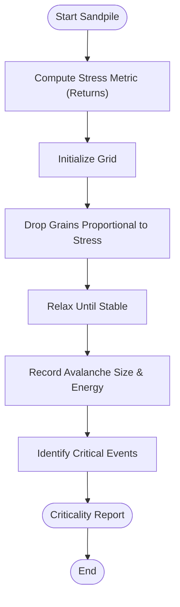

**Diagram sources**
- [Sandpile Pipeline.py](file://quant-traderr-lab/Sandpile Model/Sandpile Pipeline.py#L177-L230)

**Section sources**
- [Sandpile Pipeline.py](file://quant-traderr-lab/Sandpile Model/Sandpile Pipeline.py#L177-L230)
- [ECONOPHYSICS_INTEGRATION.md](file://docs/ECONOPHYSICS_INTEGRATION.md#L509-L524)

### Physics-Aware Position Sizing (Enhanced Kelly)
The Enhanced Kelly engine integrates econophysical signals to dynamically adjust position size:
- Chaos dampener from Lyapunov metrics
- Phase transition guard from Ising susceptibility
- Correlation penalty from RMT eigenvalues
- Monte Carlo validation to cap ruin probability

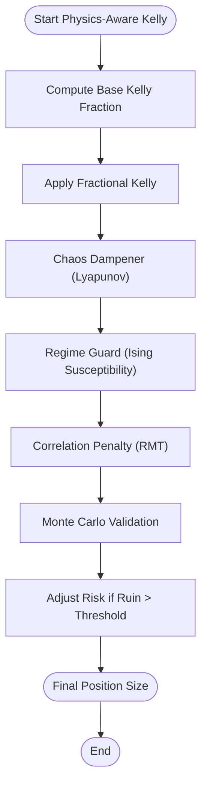

**Diagram sources**
- [ECONOPHYSICS_INTEGRATION.md](file://docs/ECONOPHYSICS_INTEGRATION.md#L71-L155)

**Section sources**
- [ECONOPHYSICS_INTEGRATION.md](file://docs/ECONOPHYSICS_INTEGRATION.md#L71-L155)
- [enhanced_kelly_user_guide.md](file://docs/user_guides/enhanced_kelly_user_guide.md#L1-L318)

## Dependency Analysis
The econophysics modules depend on standard scientific computing libraries and are orchestrated by the Strategy Router’s risk sensors and governance:

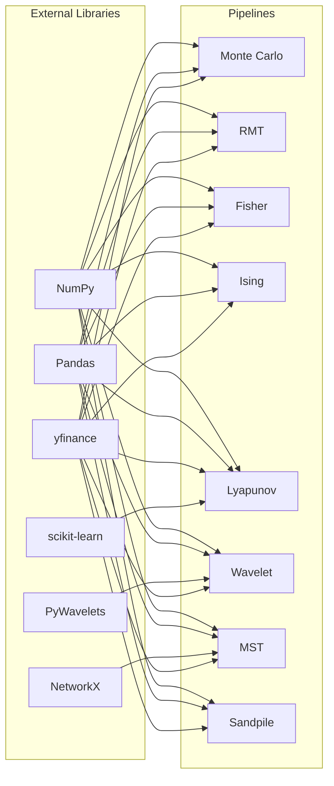

**Diagram sources**
- [Monte Carlo Pipeline.py](file://quant-traderr-lab/Monte Carlo/Monte Carlo Pipeline.py#L24-L35)
- [RMT_Pipeline.py](file://quant-traderr-lab/RMT_Correlation_Filter/RMT_Pipeline.py#L18-L26)
- [Fisher pipeline.py](file://quant-traderr-lab/Fisher Transfrom/Fisher pipeline.py#L20-L25)
- [Ising Pipeline.py](file://quant-traderr-lab/Ising Model/Ising Pipeline.py#L25-L27)
- [Lyapunov Pipeline.py](file://quant-traderr-lab/Lyapunov Exponent/Lyapunov Pipeline.py#L23-L25)
- [Wavelet_Pipeline.py](file://quant-traderr-lab/Wavelet Transform/Wavelet_Pipeline.py#L19-L21)
- [MST pipeline.py](file://quant-traderr-lab/MST/MST pipeline.py#L49-L51)
- [Sandpile Pipeline.py](file://quant-traderr-lab/Sandpile Model/Sandpile Pipeline.py#L30-L32)

**Section sources**
- [Monte Carlo Pipeline.py](file://quant-traderr-lab/Monte Carlo/Monte Carlo Pipeline.py#L24-L35)
- [RMT_Pipeline.py](file://quant-traderr-lab/RMT_Correlation_Filter/RMT_Pipeline.py#L18-L26)
- [Fisher pipeline.py](file://quant-traderr-lab/Fisher Transfrom/Fisher pipeline.py#L20-L25)
- [Ising Pipeline.py](file://quant-traderr-lab/Ising Model/Ising Pipeline.py#L25-L27)
- [Lyapunov Pipeline.py](file://quant-traderr-lab/Lyapunov Exponent/Lyapunov Pipeline.py#L23-L25)
- [Wavelet_Pipeline.py](file://quant-traderr-lab/Wavelet Transform/Wavelet_Pipeline.py#L19-L21)
- [MST pipeline.py](file://quant-traderr-lab/MST/MST pipeline.py#L49-L51)
- [Sandpile Pipeline.py](file://quant-traderr-lab/Sandpile Model/Sandpile Pipeline.py#L30-L32)

## Performance Considerations
- Vectorization and bootstrapping in Monte Carlo reduce overhead for large ensembles
- Efficient eigenvalue filtering in RMT avoids costly matrix inversions
- KD-tree nearest neighbor search in Lyapunov analysis scales with logarithmic complexity
- Wavelet transforms leverage optimized libraries for real-time frequency analysis
- MST computations use efficient graph algorithms; consider windowed approaches for live trading to avoid lookahead bias
- Fisher transform uses rolling window computations with minimal memory footprint

[No sources needed since this section provides general guidance]

## Troubleshooting Guide
Common issues and resolutions:
- Data availability: Ensure yfinance downloads succeed; fallback to dummy data for connectivity checks
- Convergence in Ising/Lyapunov: Increase steps or adjust temperature/time delays; validate with synthetic data
- Numerical stability: Clip correlation matrices and normalize inputs; verify eigenvalue bounds
- Performance bottlenecks: Use multiprocessing for rendering and parallelize pipeline stages where feasible
- Lookahead bias in MST: Use expanding/rolling windows for correlation computation in live contexts

**Section sources**
- [Monte Carlo Pipeline.py](file://quant-traderr-lab/Monte Carlo/Monte Carlo Pipeline.py#L75-L101)
- [Ising Pipeline.py](file://quant-traderr-lab/Ising Model/Ising Pipeline.py#L67-L97)
- [Lyapunov Pipeline.py](file://quant-traderr-lab/Lyapunov Exponent/Lyapunov Pipeline.py#L67-L115)
- [MST pipeline.py](file://quant-traderr-lab/MST/MST pipeline.py#L145-L185)

## Conclusion
The econophysics integration in QuantMind-X provides a robust, physics-informed framework for financial modeling. By combining statistical mechanics, thermodynamics-inspired measures, and complex systems theory with operational risk controls, the system achieves:
- Enhanced market regime detection via Ising susceptibility and Fisher signals
- Robust risk assessment through Monte Carlo validation and Lyapunov chaos sensors
- Improved diversification and systemic risk awareness via RMT and MST analyses
- Adaptive position sizing guided by physics-aware Kelly principles

This integration enables both research-driven insights and real-time operational excellence, aligning trading decisions with the underlying dynamics of financial systems.