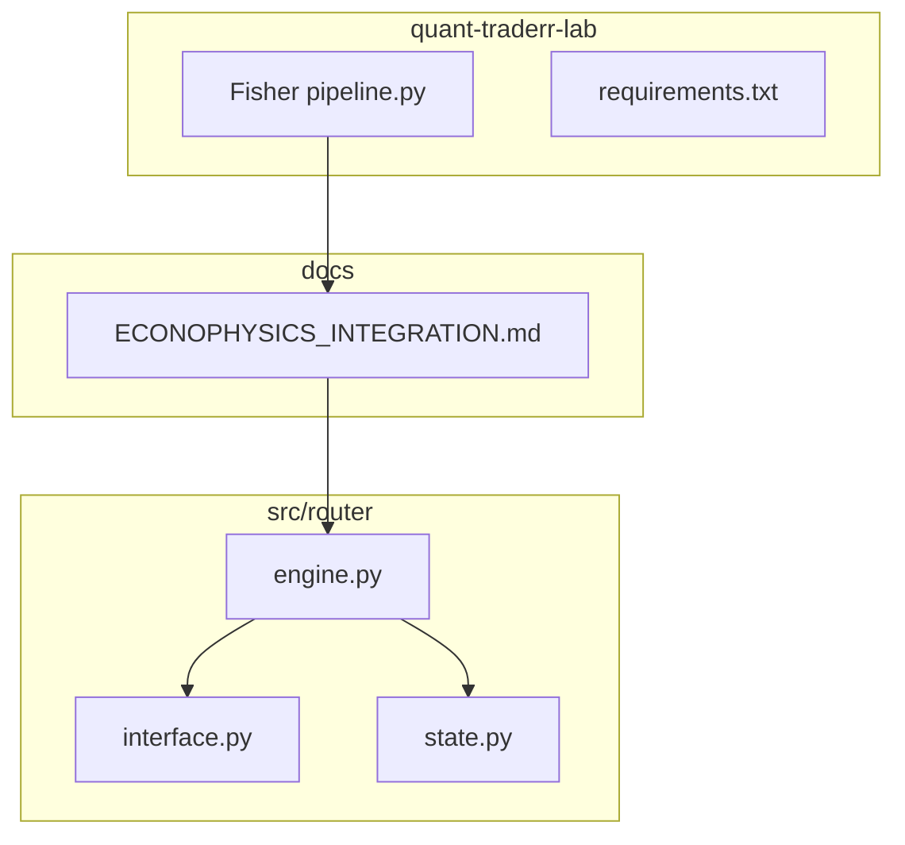
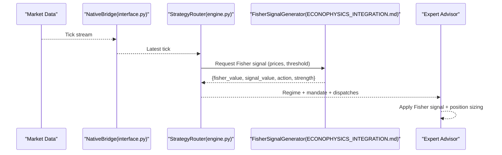
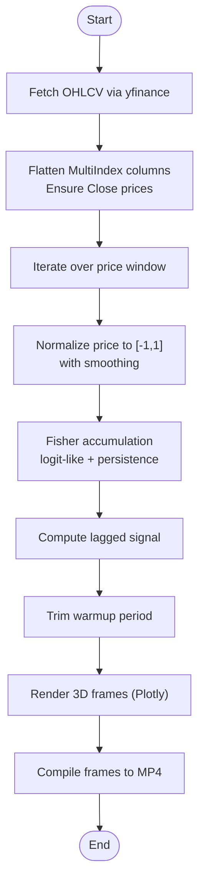
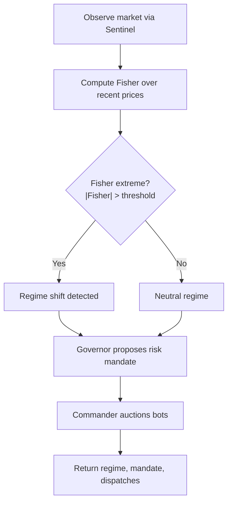
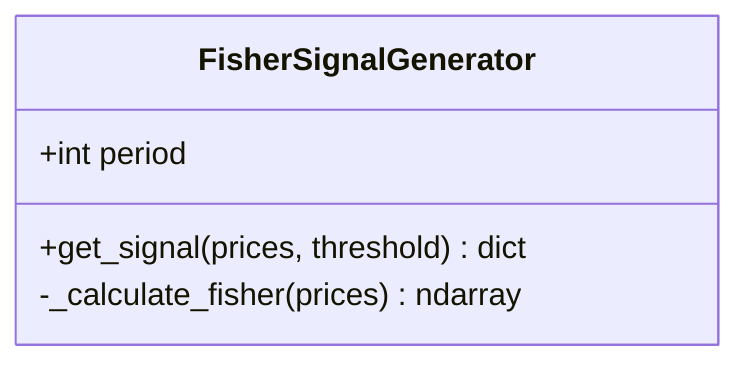
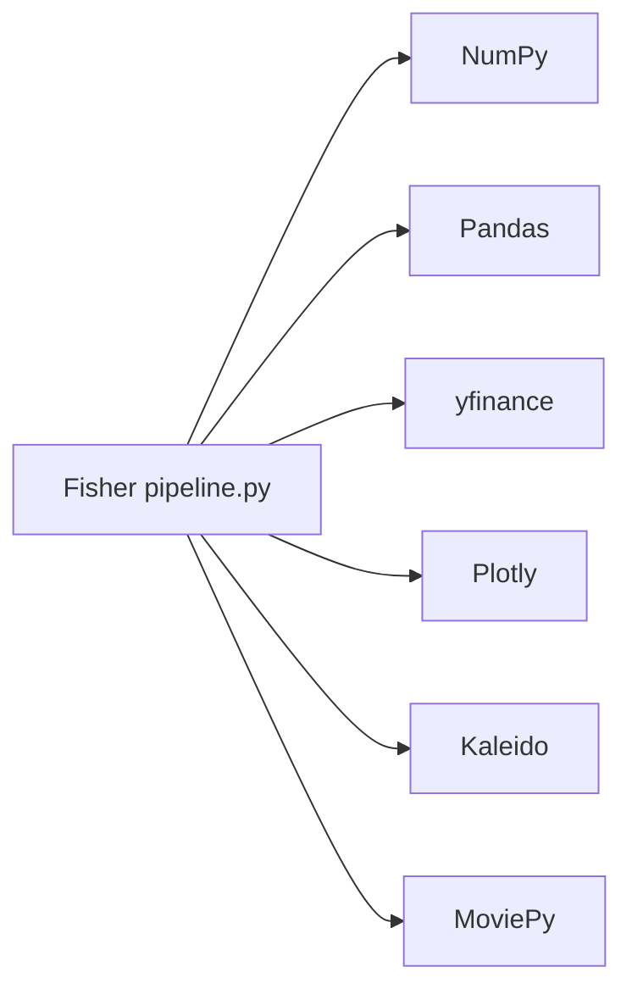

# Fisher Transform Signals

<cite>
**Referenced Files in This Document**
- [Fisher pipeline.py](file://quant-traderr-lab/Fisher%20Transfrom/Fisher%20pipeline.py)
- [requirements.txt](file://quant-traderr-lab/Fisher%20Transfrom/requirements.txt)
- [ECONOPHYSICS_INTEGRATION.md](file://docs/ECONOPHYSICS_INTEGRATION.md)
- [applying_the_fisher_transform_and_inverse_fisher_transform_to_markets_analysis_in_metatrader_5.md](file://data/scraped_articles/trading/applying_the_fisher_transform_and_inverse_fisher_transform_to_markets_analysis_in_metatrader_5.md)
- [engine.py](file://src/router/engine.py)
- [interface.py](file://src/router/interface.py)
- [state.py](file://src/router/state.py)
</cite>

## Table of Contents
1. [Introduction](#introduction)
2. [Project Structure](#project-structure)
3. [Core Components](#core-components)
4. [Architecture Overview](#architecture-overview)
5. [Detailed Component Analysis](#detailed-component-analysis)
6. [Dependency Analysis](#dependency-analysis)
7. [Performance Considerations](#performance-considerations)
8. [Troubleshooting Guide](#troubleshooting-guide)
9. [Conclusion](#conclusion)
10. [Appendices](#appendices)

## Introduction
This document explains how the Fisher Transform is implemented and integrated for signal generation and automated trading. It covers:
- Mathematical normalization to approximate a Gaussian distribution and improved overbought/oversold detection with reduced lag
- Integration with the Strategy Router for regime-aware allocation decisions
- Integration with Expert Advisors (EAs) for entry/exit signals
- Practical logic for thresholds, signal strength, and momentum shift detection
- Parameter tuning, lagged crossover analysis, and examples for extreme value interpretation

## Project Structure
The Fisher Transform capability spans two primary areas:
- A standalone pipeline for transforming price series and visualizing the result as a 3D ribbon
- An API-compatible signal generator intended for Expert Advisors and Strategy Router integration

**Diagram sources**
- [Fisher pipeline.py](file://quant-traderr-lab/Fisher%20Transfrom/Fisher%20pipeline.py#L1-L390)
- [requirements.txt](file://quant-traderr-lab/Fisher%20Transfrom/requirements.txt#L1-L7)
- [ECONOPHYSICS_INTEGRATION.md](file://docs/ECONOPHYSICS_INTEGRATION.md#L224-L314)
- [engine.py](file://src/router/engine.py#L1-L68)
- [interface.py](file://src/router/interface.py#L1-L80)
- [state.py](file://src/router/state.py#L1-L33)

**Section sources**
- [Fisher pipeline.py](file://quant-traderr-lab/Fisher%20Transfrom/Fisher%20pipeline.py#L1-L390)
- [ECONOPHYSICS_INTEGRATION.md](file://docs/ECONOPHYSICS_INTEGRATION.md#L224-L314)
- [engine.py](file://src/router/engine.py#L1-L68)

## Core Components
- Fisher Transform pipeline: computes normalized price values and the cumulative Fisher transform, generates lagged signal for crossovers, and produces a 3D visualization
- Strategy Router integration: uses Fisher-derived regime signals to inform allocation decisions
- EA Signal Generator: exposes a simple API for EAs to obtain Fisher-based entry/exit signals with strength and lagged confirmation

Key capabilities:
- Normalization to [-1, +1] over a rolling window
- Fisher transform via logit-like accumulation
- Lagged signal for crossover detection
- Threshold-based actions and strength scaling

**Section sources**
- [Fisher pipeline.py](file://quant-traderr-lab/Fisher%20Transfrom/Fisher%20pipeline.py#L115-L147)
- [ECONOPHYSICS_INTEGRATION.md](file://docs/ECONOPHYSICS_INTEGRATION.md#L235-L253)
- [ECONOPHYSICS_INTEGRATION.md](file://docs/ECONOPHYSICS_INTEGRATION.md#L258-L314)

## Architecture Overview
The Fisher Transform integrates into the broader QuantMindX system as follows:
- Strategy Router observes market regimes and consults econophysical signals (including Fisher)
- The Router proposes risk mandates and dispatches bots accordingly
- Expert Advisors consume Fisher signals via a dedicated generator API

**Diagram sources**
- [interface.py](file://src/router/interface.py#L58-L72)
- [engine.py](file://src/router/engine.py#L29-L60)
- [ECONOPHYSICS_INTEGRATION.md](file://docs/ECONOPHYSICS_INTEGRATION.md#L258-L314)

## Detailed Component Analysis

### Fisher Transform Pipeline (quant-traderr-lab)
The pipeline performs:
- Data acquisition and preprocessing
- Rolling normalization to [-1, +1]
- Fisher transform accumulation
- Lagged signal for crossovers
- 3D visualization with cinematic camera reveal

**Diagram sources**
- [Fisher pipeline.py](file://quant-traderr-lab/Fisher%20Transfrom/Fisher%20pipeline.py#L86-L147)
- [Fisher pipeline.py](file://quant-traderr-lab/Fisher%20Transfrom/Fisher%20pipeline.py#L190-L324)
- [Fisher pipeline.py](file://quant-traderr-lab/Fisher%20Transfrom/Fisher%20pipeline.py#L329-L369)

Implementation highlights:
- Rolling normalization prevents division-by-zero and clips extreme values to maintain numerical stability
- Fisher accumulation uses a logit-like transformation combined with a persistence term
- Lagged signal enables crossover detection against the current Fisher value
- Rendering supports parallel frame generation and a “reveal” camera transition

**Section sources**
- [Fisher pipeline.py](file://quant-traderr-lab/Fisher%20Transfrom/Fisher%20pipeline.py#L86-L147)
- [Fisher pipeline.py](file://quant-traderr-lab/Fisher%20Transfrom/Fisher%20pipeline.py#L151-L189)
- [Fisher pipeline.py](file://quant-traderr-lab/Fisher%20Transfrom/Fisher%20pipeline.py#L190-L324)
- [Fisher pipeline.py](file://quant-traderr-lab/Fisher%20Transfrom/Fisher%20pipeline.py#L329-L369)

### Strategy Router Integration
The Strategy Router can incorporate Fisher-based regime signals:
- Use Fisher extremes to flag overbought/oversold conditions
- Treat zero-crossings as momentum shifts
- Adjust allocation based on regime inferred from Fisher values

**Diagram sources**
- [engine.py](file://src/router/engine.py#L29-L60)
- [ECONOPHYSICS_INTEGRATION.md](file://docs/ECONOPHYSICS_INTEGRATION.md#L235-L253)

**Section sources**
- [ECONOPHYSICS_INTEGRATION.md](file://docs/ECONOPHYSICS_INTEGRATION.md#L235-L253)
- [engine.py](file://src/router/engine.py#L29-L60)

### Expert Advisor Signal Generator
The FisherSignalGenerator provides a simple API for EAs:
- Accepts a price series and optional period/threshold
- Returns Fisher value, lagged signal, action, and strength
- Uses lagged crossover to confirm entries and scales strength by absolute Fisher value

**Diagram sources**
- [ECONOPHYSICS_INTEGRATION.md](file://docs/ECONOPHYSICS_INTEGRATION.md#L258-L314)

**Section sources**
- [ECONOPHYSICS_INTEGRATION.md](file://docs/ECONOPHYSICS_INTEGRATION.md#L258-L314)

### Mathematical Transformation and Interpretation
- Normalization maps price within a rolling window to [-1, +1], reducing sensitivity to absolute levels
- Fisher transform approximates a Gaussian-like distribution, amplifying tails and emphasizing extremes
- Inverse Fisher transforms are commonly used to sharpen oscillator signals
- Extreme Fisher values indicate potential trend exhaustion; zero crossings suggest momentum shifts

Practical usage:
- Use thresholds to define overbought/oversold regions
- Confirm entries with lagged crossovers
- Scale entry strength by proximity to extremes

**Section sources**
- [applying_the_fisher_transform_and_inverse_fisher_transform_to_markets_analysis_in_metatrader_5.md](file://data/scraped_articles/trading/applying_the_fisher_transform_and_inverse_fisher_transform_to_markets_analysis_in_metatrader_5.md#L83-L98)
- [applying_the_fisher_transform_and_inverse_fisher_transform_to_markets_analysis_in_metatrader_5.md](file://data/scraped_articles/trading/applying_the_fisher_transform_and_inverse_fisher_transform_to_markets_analysis_in_metatrader_5.md#L214-L221)
- [applying_the_fisher_transform_and_inverse_fisher_transform_to_markets_analysis_in_metatrader_5.md](file://data/scraped_articles/trading/applying_the_fisher_transform_and_inverse_fisher_transform_to_markets_analysis_in_metatrader_5.md#L498-L516)

## Dependency Analysis
External libraries used by the Fisher pipeline:
- Numerical: NumPy, Pandas
- Market data: yfinance
- Visualization: Plotly, Kaleido
- Video editing: MoviePy (v1 or v2 compatible)

**Diagram sources**
- [requirements.txt](file://quant-traderr-lab/Fisher%20Transfrom/requirements.txt#L1-L7)
- [Fisher pipeline.py](file://quant-traderr-lab/Fisher%20Transfrom/Fisher%20pipeline.py#L37-L44)

**Section sources**
- [requirements.txt](file://quant-traderr-lab/Fisher%20Transfrom/requirements.txt#L1-L7)

## Performance Considerations
- Vectorization: The pipeline uses NumPy arrays and loops over price windows; ensure the window length is tuned to available history and desired responsiveness
- Parallel rendering: The renderer uses multiprocessing to accelerate frame generation; monitor CPU utilization and adjust core count
- Memory footprint: Large histories and high-resolution renders increase memory usage; consider trimming or subsampling for long series
- Numerical stability: Clipping and small-range padding prevent infinite or undefined transformations

[No sources needed since this section provides general guidance]

## Troubleshooting Guide
Common issues and resolutions:
- Empty or malformed data: Verify yfinance downloads and flatten MultiIndex columns
- Division by zero or overflow: The pipeline adds a small epsilon and clips normalized values
- Rendering failures: Ensure Plotly and Kaleido are installed; confirm MoviePy compatibility
- Video assembly errors: Check that all frames were written and the output directory is writable

**Section sources**
- [Fisher pipeline.py](file://quant-traderr-lab/Fisher%20Transfrom/Fisher%20pipeline.py#L93-L106)
- [Fisher pipeline.py](file://quant-traderr-lab/Fisher%20Transfrom/Fisher%20pipeline.py#L127-L132)
- [Fisher pipeline.py](file://quant-traderr-lab/Fisher%20Transfrom/Fisher%20pipeline.py#L345-L368)

## Conclusion
The Fisher Transform offers a powerful framework for normalizing price series into a distribution more amenable to overbought/oversold detection and momentum shift identification. Its integration with the Strategy Router enables regime-aware allocation, while the FisherSignalGenerator provides a straightforward API for Expert Advisors. Proper parameter tuning, threshold selection, and lagged crossover confirmation yield robust signals suitable for automated trading.

[No sources needed since this section summarizes without analyzing specific files]

## Appendices

### Practical Examples and Patterns
- Generating Fisher signals:
  - Obtain a recent price series
  - Call the FisherSignalGenerator to compute Fisher value and lagged signal
  - Determine action via crossover against the lagged value and threshold
- Interpreting extreme values:
  - High absolute Fisher values imply potential trend exhaustion; reduce trend-following exposure
  - Use zero-crossings as momentum shift triggers
- Lagged Fisher crossovers:
  - Confirm entries when the current Fisher crosses the lagged signal in the direction of the trade
  - Scale entry strength by the magnitude of the Fisher value (bounded to 0–1)

**Section sources**
- [ECONOPHYSICS_INTEGRATION.md](file://docs/ECONOPHYSICS_INTEGRATION.md#L258-L314)
- [ECONOPHYSICS_INTEGRATION.md](file://docs/ECONOPHYSICS_INTEGRATION.md#L235-L253)