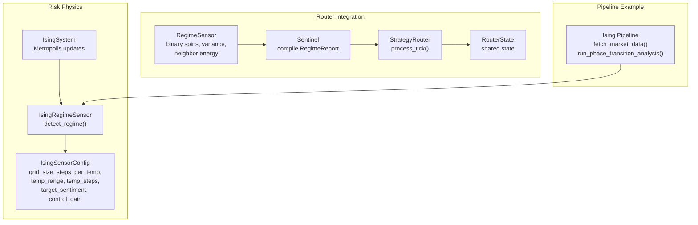
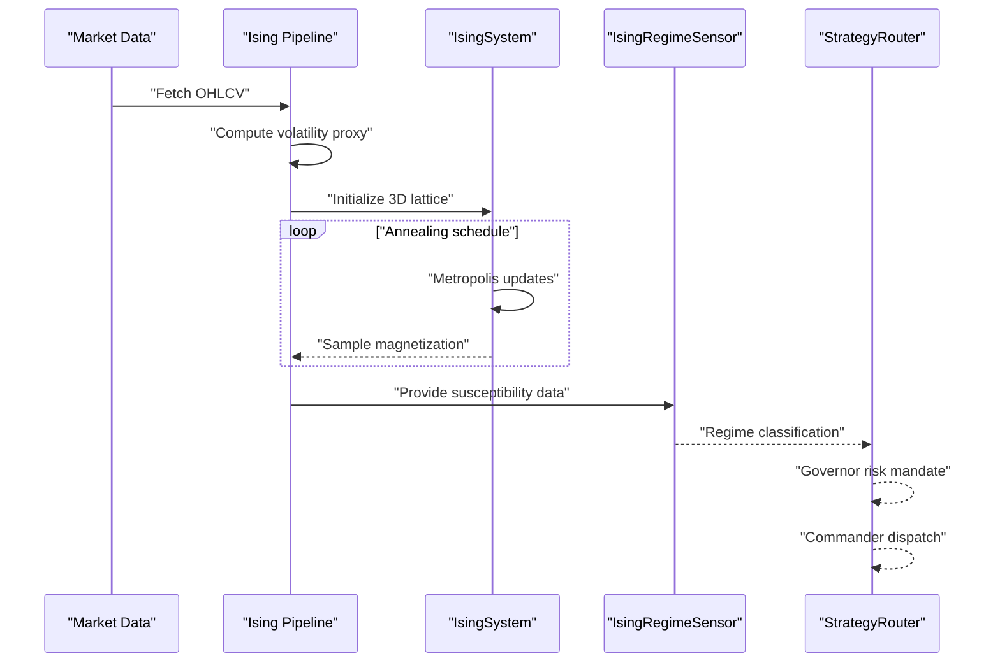
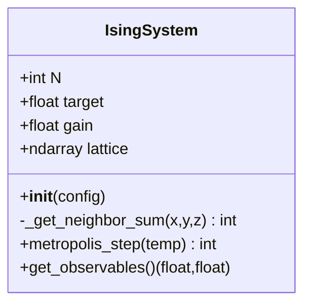
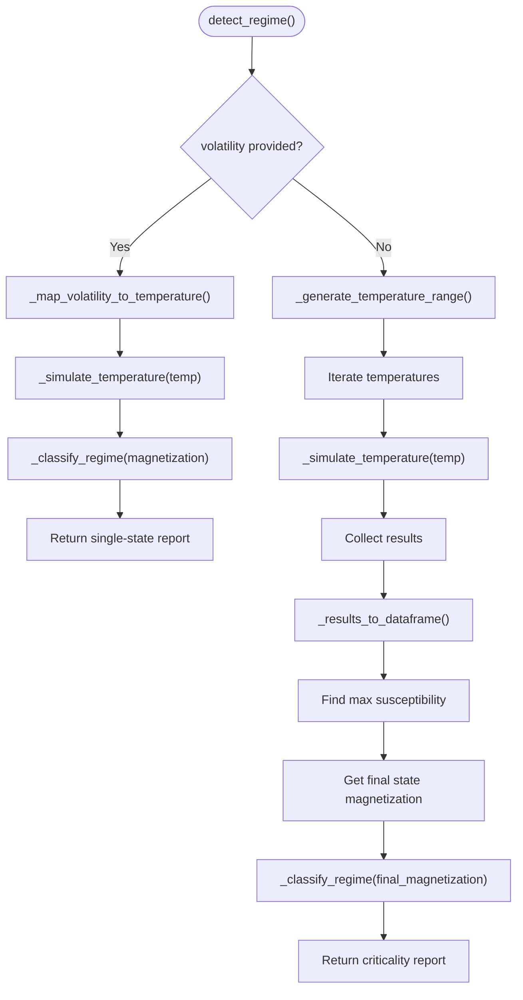
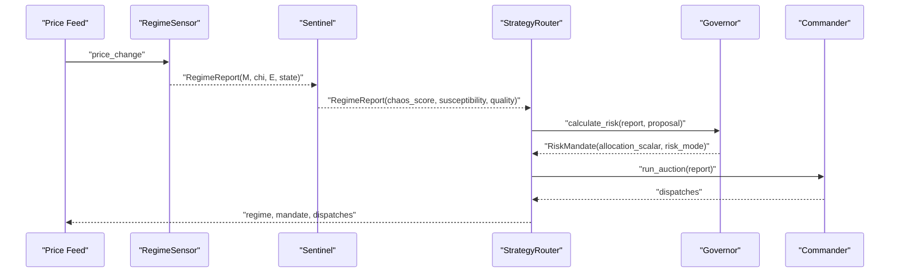
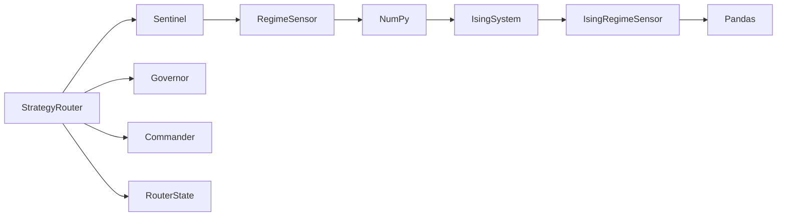

# Ising Model Regime Detection

<cite>
**Referenced Files in This Document**
- [ising_sensor.py](file://src/risk/physics/ising_sensor.py)
- [Ising Pipeline.py](file://quant-traderr-lab/Ising Model/Ising Pipeline.py)
- [regime.py](file://src/router/sensors/regime.py)
- [sentinel.py](file://src/router/sentinel.py)
- [engine.py](file://src/router/engine.py)
- [state.py](file://src/router/state.py)
- [test_ising_sensor.py](file://tests/risk/physics/test_ising_sensor.py)
- [test_physics_sensors.py](file://tests/risk/physics/test_physics_sensors.py)
- [__init__.py](file://src/risk/physics/__init__.py)
</cite>

## Table of Contents
1. [Introduction](#introduction)
2. [Project Structure](#project-structure)
3. [Core Components](#core-components)
4. [Architecture Overview](#architecture-overview)
5. [Detailed Component Analysis](#detailed-component-analysis)
6. [Dependency Analysis](#dependency-analysis)
7. [Performance Considerations](#performance-considerations)
8. [Troubleshooting Guide](#troubleshooting-guide)
9. [Conclusion](#conclusion)

## Introduction
This document explains the Ising Model-based market regime detection system implemented in the repository. It maps market volatility to temperature in a three-dimensional Ising spin system, simulates phase transitions via Metropolis-Hastings dynamics, and detects critical states using susceptibility. The system supports both offline analysis and online integration with the Strategy Router for real-time routing of trading strategies according to detected market phases.

Key capabilities:
- Volatility-to-temperature mapping for Ising model initialization
- Monte Carlo simulation with Metropolis-Hastings updates
- Magnetization-based trend classification and susceptibility-based criticality detection
- Production-ready caching and performance optimizations
- Integration with the Strategy Router for dynamic strategy allocation

## Project Structure
The Ising-based regime detection spans two primary areas:
- Physics simulation and analytics in the risk/physics module
- Strategy Router integration in the router module
- A standalone pipeline example in quant-traderr-lab

**Diagram sources**
- [ising_sensor.py](file://src/risk/physics/ising_sensor.py#L43-L245)
- [regime.py](file://src/router/sensors/regime.py#L16-L54)
- [sentinel.py](file://src/router/sentinel.py#L27-L84)
- [engine.py](file://src/router/engine.py#L16-L67)
- [state.py](file://src/router/state.py#L8-L33)
- [Ising Pipeline.py](file://quant-traderr-lab/Ising Model/Ising Pipeline.py#L101-L237)

**Section sources**
- [ising_sensor.py](file://src/risk/physics/ising_sensor.py#L1-L246)
- [regime.py](file://src/router/sensors/regime.py#L1-L55)
- [sentinel.py](file://src/router/sentinel.py#L1-L85)
- [engine.py](file://src/router/engine.py#L1-L68)
- [state.py](file://src/router/state.py#L1-L34)
- [Ising Pipeline.py](file://quant-traderr-lab/Ising Model/Ising Pipeline.py#L1-L291)

## Core Components
- IsingSystem: Implements the 3D Ising model with periodic boundary conditions, Metropolis-Hastings updates, and observable calculations (magnetization, energy).
- IsingRegimeSensor: Provides volatility-to-temperature mapping, annealing simulations, susceptibility computation, and regime classification.
- RegimeSensor (Router): Computes binary spin magnetization, variance (susceptibility), and neighbor energy from price changes for quick online classification.
- Sentinel and StrategyRouter: Orchestrate intelligence, governance, and dispatch based on regime reports.
- RouterState: Shared state container for current regime and active bots.

**Section sources**
- [ising_sensor.py](file://src/risk/physics/ising_sensor.py#L43-L245)
- [regime.py](file://src/router/sensors/regime.py#L16-L54)
- [sentinel.py](file://src/router/sentinel.py#L27-L84)
- [engine.py](file://src/router/engine.py#L16-L67)
- [state.py](file://src/router/state.py#L8-L33)

## Architecture Overview
The system operates in two modes:
- Offline/analysis mode: Uses the Ising Pipeline to compute volatility proxy, simulate annealing, and report critical points.
- Online/integration mode: Uses the RegimeSensor within the Sentinel to continuously classify market regimes and feed StrategyRouter for dynamic dispatch.

**Diagram sources**
- [Ising Pipeline.py](file://quant-traderr-lab/Ising Model/Ising Pipeline.py#L67-L237)
- [ising_sensor.py](file://src/risk/physics/ising_sensor.py#L113-L195)

## Detailed Component Analysis

### IsingSystem: 3D Spin Dynamics
Implements the Ising model with:
- 3D lattice with periodic boundaries
- Metropolis-Hastings updates with dynamic bias aligned to target sentiment
- Observable extraction: magnetization (mean spin) and energy (interaction sum)

**Diagram sources**
- [ising_sensor.py](file://src/risk/physics/ising_sensor.py#L43-L102)

**Section sources**
- [ising_sensor.py](file://src/risk/physics/ising_sensor.py#L43-L102)

### IsingRegimeSensor: Regime Detection and Classification
Core responsibilities:
- Volatility-to-temperature mapping
- Annealing simulation with thermalization and sampling
- Susceptibility computation and critical point detection
- Regime classification based on magnetization thresholds
- Caching and performance optimizations

**Diagram sources**
- [ising_sensor.py](file://src/risk/physics/ising_sensor.py#L140-L195)
- [ising_sensor.py](file://src/risk/physics/ising_sensor.py#L225-L245)

**Section sources**
- [ising_sensor.py](file://src/risk/physics/ising_sensor.py#L105-L245)

### Volatility Mapping and Susceptibility Thresholds
- Volatility-to-temperature mapping:
  - Low volatility (<0.5%) → Low temperature (0.1)
  - Medium volatility (0.5–2%) → Medium temperature (2.0–5.0)
  - High volatility (>2%) → High temperature (10.0)
- Susceptibility:
  - Variance of sampled magnetization divided by temperature
  - Peaks indicate critical points (phase transitions)
- Regime classification:
  - |M| ≥ 0.8: CHAOTIC (high volatility, no clear trend)
  - 0.3 ≤ |M| < 0.8: TRANSITIONAL (medium volatility, developing trend)
  - |M| < 0.3: ORDERED (low volatility, strong trend)

Practical examples:
- Detecting critical points: locate the temperature with maximum susceptibility; use this as a leading indicator of regime shifts.
- Trending vs. ranging: if |M| < 0.3, treat as trending; if |M| ≥ 0.8, treat as ranging/choppy.
- Adjusting allocations: use susceptibility as a proxy for systemic risk; higher susceptibility suggests increased caution.

**Section sources**
- [ising_sensor.py](file://src/risk/physics/ising_sensor.py#L201-L237)
- [Ising Pipeline.py](file://quant-traderr-lab/Ising Model/Ising Pipeline.py#L239-L267)

### Router Integration: Real-Time Strategy Routing
- RegimeSensor computes binary spins from price changes, then calculates magnetization, susceptibility, and energy to classify ORDERED, CRITICAL, or DISORDERED.
- Sentinel aggregates sensor reports into a unified RegimeReport and applies classification heuristics.
- StrategyRouter coordinates:
  - Intelligence (Sentinel)
  - Compliance (Governor) with chaos-based throttling
  - Execution (Commander) with bot auctions
- RouterState stores current regime and active bots for cross-component visibility.

**Diagram sources**
- [regime.py](file://src/router/sensors/regime.py#L16-L54)
- [sentinel.py](file://src/router/sentinel.py#L27-L84)
- [engine.py](file://src/router/engine.py#L29-L60)
- [governor.py](file://src/router/governor.py#L24-L54)
- [commander.py](file://src/router/commander.py#L19-L49)

**Section sources**
- [regime.py](file://src/router/sensors/regime.py#L16-L54)
- [sentinel.py](file://src/router/sentinel.py#L27-L84)
- [engine.py](file://src/router/engine.py#L29-L60)
- [governor.py](file://src/router/governor.py#L24-L54)
- [commander.py](file://src/router/commander.py#L19-L49)
- [state.py](file://src/router/state.py#L22-L26)

### Theoretical Physics Foundations
- Ising model: Spins on a lattice with nearest-neighbor ferromagnetic interactions; energy functional includes local fields.
- Metropolis-Hastings: Accepts or rejects spin flips based on energy change and temperature; introduces thermal fluctuations.
- Order parameter: Magnetization (mean spin) measures global alignment.
- Criticality: Susceptibility (variance of magnetization) diverges at critical temperature; here computed as variance/temperature.
- Mapping: Market volatility proxies temperature; lower volatility corresponds to lower temperature (more ordered), and vice versa.

[No sources needed since this section provides general guidance]

## Dependency Analysis
- IsingSystem depends on NumPy for lattice operations and random number generation.
- IsingRegimeSensor composes IsingSystem, uses caching and pandas for data handling.
- Router sensors depend on NumPy for statistical computations.
- StrategyRouter orchestrates sensors, governor, and commander; shares state via RouterState.

**Diagram sources**
- [ising_sensor.py](file://src/risk/physics/ising_sensor.py#L20-L26)
- [regime.py](file://src/router/sensors/regime.py#L6-L8)
- [sentinel.py](file://src/router/sentinel.py#L10-L13)
- [engine.py](file://src/router/engine.py#L10-L12)
- [state.py](file://src/router/state.py#L6-L7)

**Section sources**
- [__init__.py](file://src/risk/physics/__init__.py#L12-L20)

## Performance Considerations
- Lattice size: 12³ provides a balance between speed and representativeness; larger grids increase computational cost.
- Steps per temperature: Controls equilibration and sampling; insufficient steps may yield noisy estimates.
- Annealing schedule: Finer granularity increases accuracy but costs more CPU.
- Caching: LRU cache on temperature simulations reduces repeated work; cache invalidation ensures freshness.
- Vectorization: While neighbor updates are inherently serial, loops over N³ sites are acceptable for small lattices.
- Real-time constraints: Prefer the router’s lightweight RegimeSensor for tick-based updates; reserve full Ising simulation for periodic analysis.

[No sources needed since this section provides general guidance]

## Troubleshooting Guide
Common issues and remedies:
- Empty or invalid market data: Ensure data fetch succeeds and returns valid series; handle empty results gracefully.
- Unexpected regime labels: Verify volatility thresholds and magnetization classification boundaries; adjust sensitivity if needed.
- Poor cache hit rates: Confirm consistent configuration and avoid frequent parameter churn; clear cache when recalibrating.
- Slow simulations: Reduce grid size or steps per temperature for real-time scenarios; leverage caching and batch processing.
- Numerical instability: Check temperature bounds and susceptibility normalization; guard against division by zero.

Validation references:
- Unit tests cover initialization, Metropolis updates, susceptibility and activity calculations, and cache behavior.
- Additional tests validate volatility mapping, regime classification, and annealing behavior under different configurations.

**Section sources**
- [test_ising_sensor.py](file://tests/risk/physics/test_ising_sensor.py#L16-L151)
- [test_physics_sensors.py](file://tests/risk/physics/test_physics_sensors.py#L46-L80)

## Conclusion
The Ising Model-based regime detection system provides a robust, physics-inspired framework for identifying market phase transitions. By mapping volatility to temperature, simulating spin dynamics, and tracking susceptibility, it enables early detection of critical states and supports informed strategy routing. The integration with the Strategy Router allows dynamic, real-time adaptation of trading activities to evolving market conditions, while the included pipeline demonstrates practical analysis workflows suitable for research and production environments.