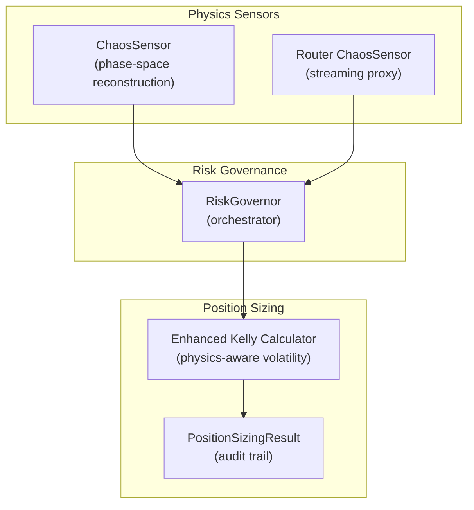
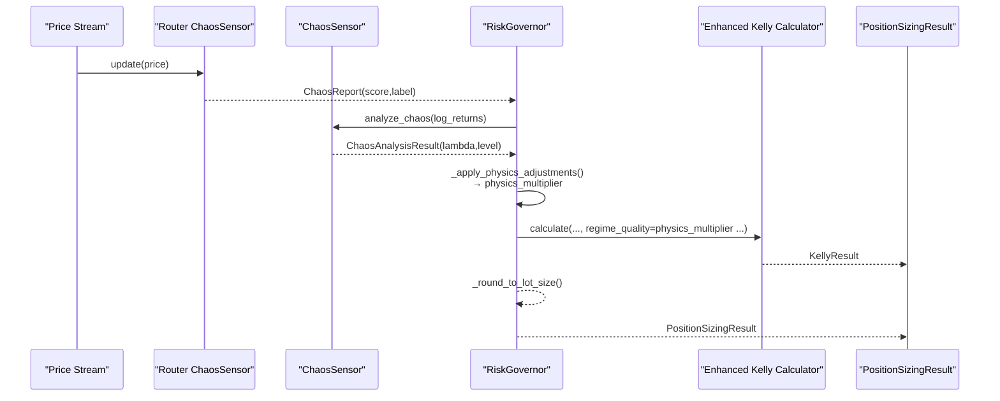
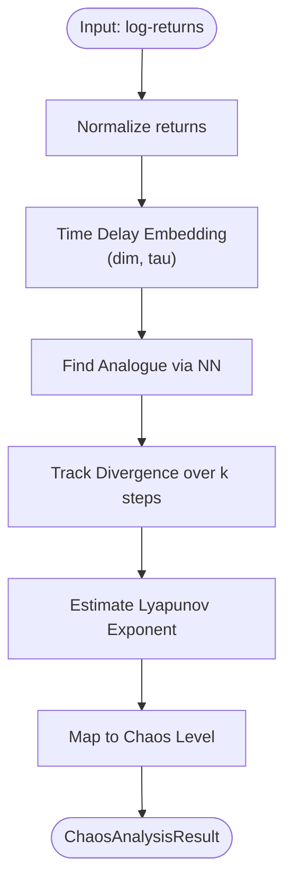
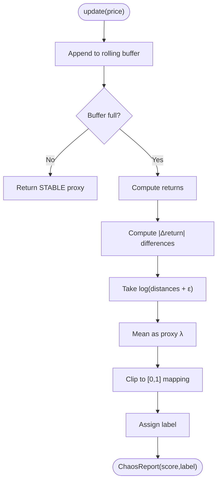
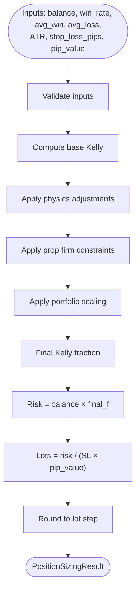
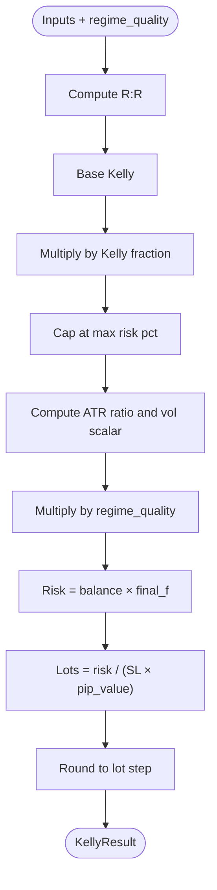
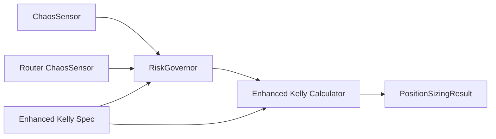

# Lyapunov Exponent Chaos Detection

<cite>
**Referenced Files in This Document**
- [chaos_sensor.py](file://src/risk/physics/chaos_sensor.py)
- [chaos.py](file://src/router/sensors/chaos.py)
- [governor.py](file://src/risk/governor.py)
- [enhanced_kelly.py](file://src/position_sizing/enhanced_kelly.py)
- [position_sizing_result.py](file://src/risk/models/position_sizing_result.py)
- [test_chaos_sensor.py](file://tests/risk/physics/test_chaos_sensor.py)
- [test_physics_sensors.py](file://tests/risk/physics/test_physics_sensors.py)
- [Lyapunov Pipeline.py](file://quant-traderr-lab/Lyapunov Exponent/Lyapunov Pipeline.py)
- [enhanced_kelly_position_sizing_v1.md](file://docs/trds/enhanced_kelly_position_sizing_v1.md)
</cite>

## Table of Contents
1. [Introduction](#introduction)
2. [Project Structure](#project-structure)
3. [Core Components](#core-components)
4. [Architecture Overview](#architecture-overview)
5. [Detailed Component Analysis](#detailed-component-analysis)
6. [Dependency Analysis](#dependency-analysis)
7. [Performance Considerations](#performance-considerations)
8. [Troubleshooting Guide](#troubleshooting-guide)
9. [Conclusion](#conclusion)
10. [Appendices](#appendices)

## Introduction
This document explains how Lyapunov Exponent-based chaos detection integrates with Risk Governor and Enhanced Kelly position sizing to deliver chaos-adjusted risk management. Positive Lyapunov exponents indicate exponential divergence of nearby trajectories in phase space, signaling unpredictability and instability in financial time series. The system translates chaos signals into dynamic position sizing multipliers, reducing exposure as chaos increases. The integration spans real-time chaos sensors, physics-aware volatility adjustments, and a governance layer that combines multiple econophysical signals with portfolio scaling and prop firm constraints.

## Project Structure
The chaos detection and risk management ecosystem is organized around three pillars:
- Physics sensors: Chaos detection via Lyapunov exponent and proxy measures
- Position sizing: Enhanced Kelly with physics-aware volatility scaling
- Risk governance: Orchestration of sensors, constraints, and portfolio scaling

**Diagram sources**
- [chaos_sensor.py](file://src/risk/physics/chaos_sensor.py#L31-L253)
- [chaos.py](file://src/router/sensors/chaos.py#L14-L57)
- [governor.py](file://src/risk/governor.py#L42-L447)
- [enhanced_kelly.py](file://src/position_sizing/enhanced_kelly.py#L128-L418)
- [position_sizing_result.py](file://src/risk/models/position_sizing_result.py#L16-L246)

**Section sources**
- [chaos_sensor.py](file://src/risk/physics/chaos_sensor.py#L1-L253)
- [chaos.py](file://src/router/sensors/chaos.py#L1-L57)
- [governor.py](file://src/risk/governor.py#L1-L447)
- [enhanced_kelly.py](file://src/position_sizing/enhanced_kelly.py#L1-L418)
- [position_sizing_result.py](file://src/risk/models/position_sizing_result.py#L1-L246)

## Core Components
- ChaosSensor (production-grade): Computes Lyapunov exponent using time delay embedding and method of analogues, returning a numeric exponent and a coarse chaos level.
- Router ChaosSensor (real-time proxy): Lightweight rolling proxy that estimates chaos from recent price differences, designed for streaming updates.
- RiskGovernor: Orchestrates physics sensors, applies penalties, enforces prop firm limits, scales across portfolios, and computes final position size.
- Enhanced Kelly Calculator: Applies physics-aware volatility scaling and layered risk controls to compute a final position size.
- PositionSizingResult: Pydantic model capturing the full calculation trace and derived metrics.

**Section sources**
- [chaos_sensor.py](file://src/risk/physics/chaos_sensor.py#L31-L253)
- [chaos.py](file://src/router/sensors/chaos.py#L14-L57)
- [governor.py](file://src/risk/governor.py#L105-L224)
- [enhanced_kelly.py](file://src/position_sizing/enhanced_kelly.py#L128-L377)
- [position_sizing_result.py](file://src/risk/models/position_sizing_result.py#L16-L246)

## Architecture Overview
The system computes chaos from price/log-return streams, translates it into a physics multiplier, and adjusts position sizing accordingly. The RiskGovernor coordinates:
- Physics multipliers from ChaosSensor and other sensors
- Prop firm constraints
- Portfolio scaling
- Final rounding and execution-ready lot size

**Diagram sources**
- [chaos.py](file://src/router/sensors/chaos.py#L19-L56)
- [chaos_sensor.py](file://src/risk/physics/chaos_sensor.py#L195-L241)
- [governor.py](file://src/risk/governor.py#L262-L297)
- [enhanced_kelly.py](file://src/position_sizing/enhanced_kelly.py#L190-L377)
- [position_sizing_result.py](file://src/risk/models/position_sizing_result.py#L146-L185)

## Detailed Component Analysis

### ChaosSensor (Lyapunov Exponent)
- Phase space reconstruction: Embeds normalized log-returns into R^d using time delay τ.
- Method of analogues: Finds nearest neighbor (analogue) in embedded space to anchor divergence tracking.
- Divergence tracking: Computes mean logarithmic divergence over k steps to estimate the largest Lyapunov exponent.
- Chaos level mapping: Threshold-based categorization into STABLE, MODERATE, CHAOTIC.

**Diagram sources**
- [chaos_sensor.py](file://src/risk/physics/chaos_sensor.py#L67-L176)
- [chaos_sensor.py](file://src/risk/physics/chaos_sensor.py#L178-L193)
- [chaos_sensor.py](file://src/risk/physics/chaos_sensor.py#L195-L241)

**Section sources**
- [chaos_sensor.py](file://src/risk/physics/chaos_sensor.py#L31-L253)
- [test_chaos_sensor.py](file://tests/risk/physics/test_chaos_sensor.py#L102-L140)

### Router ChaosSensor (Real-Time Proxy)
- Maintains a fixed-size rolling window of prices.
- Computes a simplified proxy λ by measuring log-growth of return differences.
- Normalizes the proxy to a 0–1 score and labels regimes (STABLE, NOISY, CHAOTIC).

**Diagram sources**
- [chaos.py](file://src/router/sensors/chaos.py#L19-L56)

**Section sources**
- [chaos.py](file://src/router/sensors/chaos.py#L1-L57)

### RiskGovernor (Physics-Aware Position Sizing Orchestration)
- Validates inputs and computes base Kelly fraction.
- Applies physics multipliers from ChaosSensor and other sensors, capped between 0.25 and 1.0.
- Enforces prop firm constraints and portfolio scaling.
- Rounds to broker lot step and records a full audit trail.

**Diagram sources**
- [governor.py](file://src/risk/governor.py#L105-L224)
- [governor.py](file://src/risk/governor.py#L262-L297)
- [position_sizing_result.py](file://src/risk/models/position_sizing_result.py#L146-L185)

**Section sources**
- [governor.py](file://src/risk/governor.py#L105-L224)
- [position_sizing_result.py](file://src/risk/models/position_sizing_result.py#L16-L246)

### Enhanced Kelly Calculator (Physics-Aware Volatility Scaling)
- Computes base Kelly from win rate and payoff ratio.
- Applies Half-Kelly safety and hard caps.
- Incorporates physics scalar (regime_quality) and volatility scalar (inverse ATR ratio) to adjust position size.
- Rounds to broker precision and returns a detailed audit trail.

**Diagram sources**
- [enhanced_kelly.py](file://src/position_sizing/enhanced_kelly.py#L190-L377)

**Section sources**
- [enhanced_kelly.py](file://src/position_sizing/enhanced_kelly.py#L128-L418)

### Practical Examples and Interpretation
- Measuring market chaos:
  - Use ChaosSensor.analyze_chaos on normalized log-returns to obtain λ and chaos level.
  - Use Router ChaosSensor.update for streaming proxies during live trading.
- Applying chaos multipliers:
  - Use RiskGovernor._apply_physics_adjustments to derive a multiplier in [0.25, 1.0].
  - Pass regime_quality to Enhanced Kelly Calculator to apply physics-aware volatility scaling.
- Interpreting Lyapunov values:
  - λ ≤ 0: Stable (minimal penalty).
  - 0 < λ < 0.2: Low chaos (small penalty).
  - λ ≥ 0.5: High chaos (strong penalty or near-zero sizing).

**Section sources**
- [chaos_sensor.py](file://src/risk/physics/chaos_sensor.py#L178-L193)
- [chaos.py](file://src/router/sensors/chaos.py#L50-L56)
- [governor.py](file://src/risk/governor.py#L262-L297)
- [enhanced_kelly.py](file://src/position_sizing/enhanced_kelly.py#L301-L331)

### Mathematical Foundations and Threshold-Based Logic
- Chaos theory foundation:
  - Positive Lyapunov exponents imply exponential divergence of nearby trajectories, indicating sensitive dependence on initial conditions and predictability horizon limitations.
- Threshold-based risk adjustment:
  - ChaosSensor maps λ to coarse categories (STABLE/MODERATE/CHAOTIC).
  - RiskGovernor computes penalties from sensor readings and caps at 0.25 multiplier.
  - Enhanced Kelly uses regime_quality (proxy for λ) and ATR ratio to scale position size.

**Section sources**
- [enhanced_kelly_position_sizing_v1.md](file://docs/trds/enhanced_kelly_position_sizing_v1.md#L14-L48)
- [chaos_sensor.py](file://src/risk/physics/chaos_sensor.py#L178-L193)
- [governor.py](file://src/risk/governor.py#L274-L281)

### Integration with Existing Risk Management Frameworks
- RiskGovernor integrates with:
  - Prop firm presets and max risk caps
  - Portfolio scaling to prevent over-concentration
  - Broker lot step rounding
- PositionSizingResult provides:
  - Full calculation steps for audit
  - Risk percentage and margin-related helpers

**Section sources**
- [governor.py](file://src/risk/governor.py#L334-L347)
- [position_sizing_result.py](file://src/risk/models/position_sizing_result.py#L146-L246)

## Dependency Analysis

**Diagram sources**
- [chaos_sensor.py](file://src/risk/physics/chaos_sensor.py#L31-L253)
- [chaos.py](file://src/router/sensors/chaos.py#L14-L57)
- [governor.py](file://src/risk/governor.py#L42-L447)
- [enhanced_kelly.py](file://src/position_sizing/enhanced_kelly.py#L128-L418)
- [position_sizing_result.py](file://src/risk/models/position_sizing_result.py#L16-L246)
- [enhanced_kelly_position_sizing_v1.md](file://docs/trds/enhanced_kelly_position_sizing_v1.md#L1-L234)

**Section sources**
- [governor.py](file://src/risk/governor.py#L24-L90)
- [enhanced_kelly.py](file://src/position_sizing/enhanced_kelly.py#L33-L35)
- [enhanced_kelly_position_sizing_v1.md](file://docs/trds/enhanced_kelly_position_sizing_v1.md#L116-L186)

## Performance Considerations
- Real-time proxy:
  - Router ChaosSensor performs O(n) diff and log operations over a bounded window, suitable for streaming updates.
- Production chaos sensor:
  - Uses KD-tree nearest neighbor search; complexity depends on data length and embedding dimension.
  - Includes performance target tests ensuring completion under 100 ms for typical inputs.
- Caching:
  - RiskGovernor caches physics multipliers to reduce repeated computation.
- Computational efficiency:
  - Prefer Router ChaosSensor for frequent updates; use ChaosSensor for deeper analysis and backtesting.
  - Tune embedding dimension and time delay for the asset/timeframe to balance sensitivity and stability.

**Section sources**
- [chaos.py](file://src/router/sensors/chaos.py#L26-L56)
- [test_chaos_sensor.py](file://tests/risk/physics/test_chaos_sensor.py#L118-L128)
- [governor.py](file://src/risk/governor.py#L349-L357)

## Troubleshooting Guide
- Input validation failures:
  - Ensure log-returns meet minimum length and are 1D arrays for ChaosSensor.analyze_chaos.
  - Validate account balance, win rate, average win/loss, stop loss, and ATR are positive for RiskGovernor and Enhanced Kelly.
- Insufficient data:
  - ChaosSensor requires at least 300 points; Router ChaosSensor needs at least 20 prices.
- Unexpected zero position:
  - Negative expectancy in Enhanced Kelly yields zero position; verify win rate and payoff ratio.
- Cache staleness:
  - RiskGovernor caches physics multipliers; confirm TTL and recalculation triggers.
- Real-time drift:
  - Router ChaosSensor uses a rolling window; ensure window size aligns with expected regime turnover.

**Section sources**
- [chaos_sensor.py](file://src/risk/physics/chaos_sensor.py#L208-L221)
- [governor.py](file://src/risk/governor.py#L225-L247)
- [enhanced_kelly.py](file://src/position_sizing/enhanced_kelly.py#L267-L287)
- [chaos.py](file://src/router/sensors/chaos.py#L27-L28)

## Conclusion
By combining Lyapunov exponent-based chaos detection with physics-aware volatility scaling and governance-level constraints, the system adapts position sizing to market unpredictability. ChaosSensor and Router ChaosSensor provide complementary insights—production-grade analysis and lightweight streaming—while RiskGovernor and Enhanced Kelly translate chaos signals into conservative, execution-ready sizing. This framework supports real-time risk management, integrates with prop firm constraints, and maintains transparency through detailed audit trails.

## Appendices

### Appendix A: Chaos Measurement Algorithms
- Phase space reconstruction and method of analogues:
  - Embed returns into R^d using τ and find the nearest historical pattern.
- Divergence tracking:
  - Compute log(current distance / previous distance) along the matched trajectory over k steps.
- Proxy estimation:
  - Router ChaosSensor approximates λ via mean log(|Δreturn|) over a rolling window.

**Section sources**
- [chaos_sensor.py](file://src/risk/physics/chaos_sensor.py#L67-L176)
- [chaos.py](file://src/router/sensors/chaos.py#L30-L45)

### Appendix B: Threshold-Based Risk Adjustment Logic
- ChaosSensor:
  - Maps λ thresholds to coarse categories for downstream use.
- RiskGovernor:
  - Aggregates penalties from multiple sensors and caps at 0.25 multiplier.
- Enhanced Kelly:
  - Uses regime_quality (physics scalar) and ATR ratio (volatility scalar) to adjust final Kelly fraction.

**Section sources**
- [chaos_sensor.py](file://src/risk/physics/chaos_sensor.py#L178-L193)
- [governor.py](file://src/risk/governor.py#L274-L281)
- [enhanced_kelly.py](file://src/position_sizing/enhanced_kelly.py#L301-L331)

### Appendix C: Practical Integration Notes
- Backtesting:
  - Use ChaosPipeline for batch analysis and benchmarking against market regimes.
- Live trading:
  - Use Router ChaosSensor for frequent updates; periodically re-run ChaosSensor for deeper diagnostics.
- Monitoring:
  - Inspect PositionSizingResult.calculation_steps for transparency and compliance.

**Section sources**
- [Lyapunov Pipeline.py](file://quant-traderr-lab/Lyapunov Exponent/Lyapunov Pipeline.py#L1-L237)
- [position_sizing_result.py](file://src/risk/models/position_sizing_result.py#L155-L185)