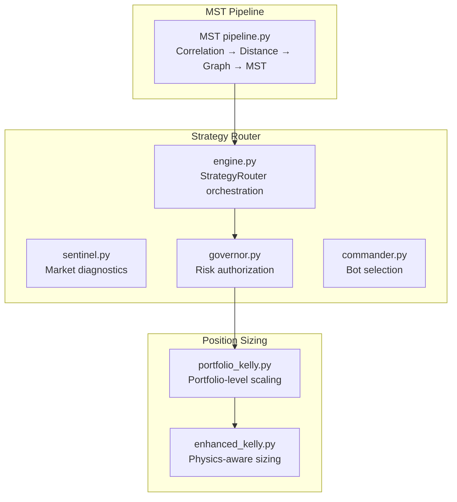
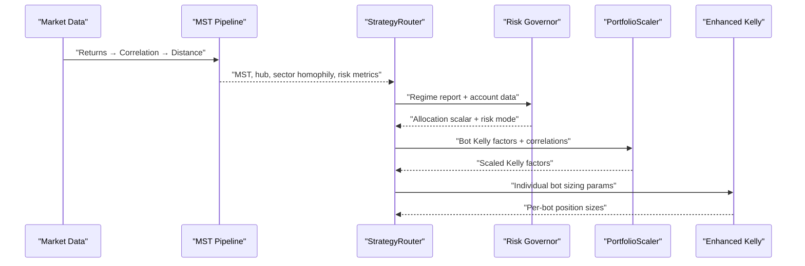
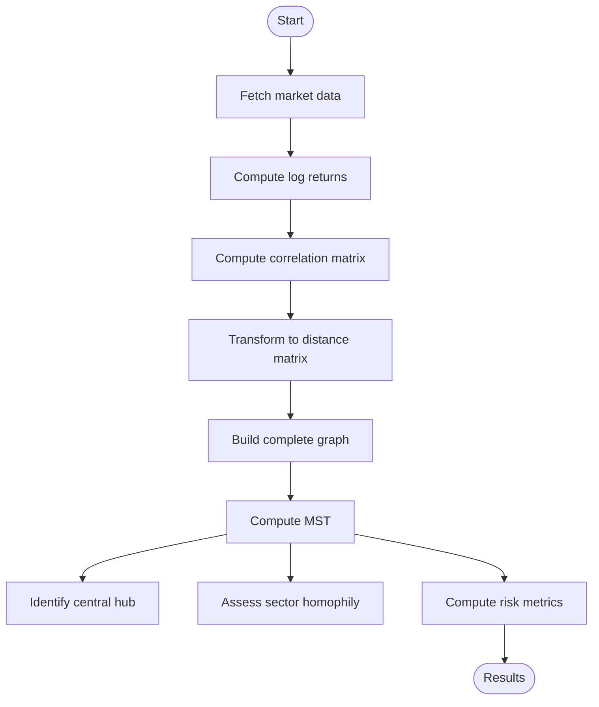
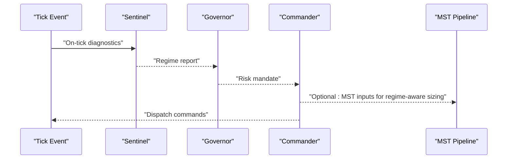
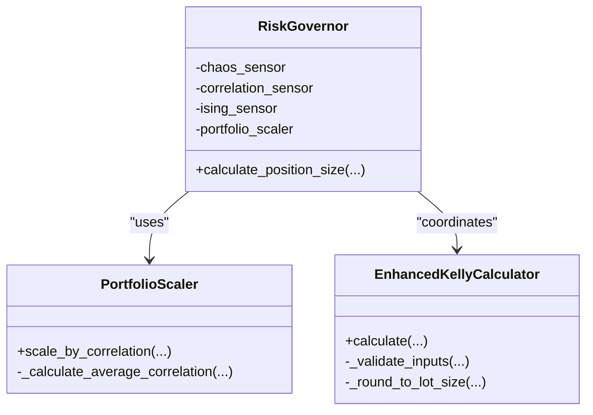
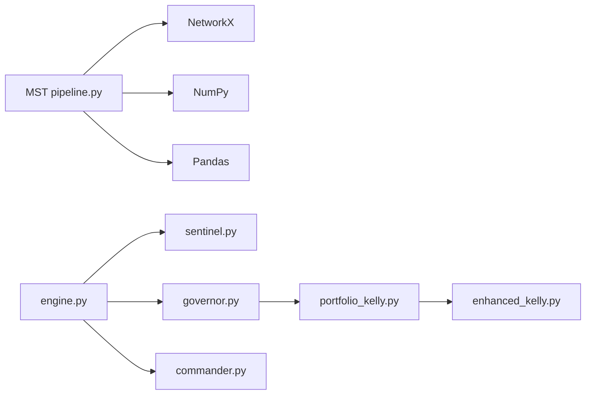

# MST Network Clustering

<cite>
**Referenced Files in This Document**
- [MST pipeline.py](file://quant-traderr-lab/MST/MST pipeline.py)
- [strategy_router_v1.md](file://docs/trds/strategy_router_v1.md)
- [engine.py](file://src/router/engine.py)
- [correlation.py](file://src/router/sensors/correlation.py)
- [governor.py](file://src/risk/governor.py)
- [portfolio_kelly.py](file://src/position_sizing/portfolio_kelly.py)
- [enhanced_kelly.py](file://src/position_sizing/enhanced_kelly.py)
</cite>

## Table of Contents
1. [Introduction](#introduction)
2. [Project Structure](#project-structure)
3. [Core Components](#core-components)
4. [Architecture Overview](#architecture-overview)
5. [Detailed Component Analysis](#detailed-component-analysis)
6. [Dependency Analysis](#dependency-analysis)
7. [Performance Considerations](#performance-considerations)
8. [Troubleshooting Guide](#troubleshooting-guide)
9. [Conclusion](#conclusion)
10. [Appendices](#appendices)

## Introduction
This document describes the integration of Minimum Spanning Tree (MST) network clustering into a portfolio construction and risk management framework. The MST pipeline analyzes correlation networks to identify clusters of highly correlated assets and central hub assets, enabling systematic risk assessment and diversification optimization. It integrates with the Strategy Router’s intelligence and compliance layers, and with Position Sizing to inform risk-managed strategy allocation.

Key outcomes:
- Correlation-to-distance conversion and MST construction
- Cluster identification and hub asset detection
- Sector homophily and systemic risk metrics
- Practical examples for building correlation networks, sector clustering, and optimizing diversification scores
- Computational efficiency considerations for large universes
- Integration pathways into portfolio optimization and risk governance

## Project Structure
The MST pipeline is implemented as a standalone script that can be invoked programmatically and integrated into broader systems. The Strategy Router orchestrates market intelligence, risk governance, and dispatch decisions. Position Sizing components provide risk-aware sizing aligned with physics and portfolio correlation.

**Diagram sources**
- [MST pipeline.py](file://quant-traderr-lab/MST/MST pipeline.py#L145-L185)
- [engine.py](file://src/router/engine.py#L16-L68)
- [governor.py](file://src/risk/governor.py#L42-L119)
- [portfolio_kelly.py](file://src/position_sizing/portfolio_kelly.py#L81-L113)
- [enhanced_kelly.py](file://src/position_sizing/enhanced_kelly.py#L128-L378)

**Section sources**
- [MST pipeline.py](file://quant-traderr-lab/MST/MST pipeline.py#L1-L100)
- [strategy_router_v1.md](file://docs/trds/strategy_router_v1.md#L1-L236)
- [engine.py](file://src/router/engine.py#L1-L68)
- [portfolio_kelly.py](file://src/position_sizing/portfolio_kelly.py#L81-L113)
- [enhanced_kelly.py](file://src/position_sizing/enhanced_kelly.py#L128-L378)

## Core Components
- MST pipeline: Computes correlation and distance matrices, constructs a complete graph, extracts the MST, and performs structural and risk analyses.
- Strategy Router: Observes market conditions, authorizes risk, selects strategies, and dispatches commands.
- Risk Governor: Applies portfolio-level risk scaling and constraints informed by market physics and systemic risk.
- Position Sizing: Provides both portfolio-level correlation scaling and individual strategy sizing with physics-aware adjustments.

Key capabilities:
- Correlation-to-distance conversion using a standard metric derived from Pearson correlation
- MST construction via NetworkX
- Hub detection via node degree
- Sector homophily analysis
- Systemic risk interpretation via MST length and average edge weight
- Integration hooks for Strategy Router and Position Sizing

**Section sources**
- [MST pipeline.py](file://quant-traderr-lab/MST/MST pipeline.py#L145-L185)
- [MST pipeline.py](file://quant-traderr-lab/MST/MST pipeline.py#L189-L227)
- [MST pipeline.py](file://quant-traderr-lab/MST/MST pipeline.py#L231-L333)
- [strategy_router_v1.md](file://docs/trds/strategy_router_v1.md#L1-L236)
- [governor.py](file://src/risk/governor.py#L42-L119)
- [portfolio_kelly.py](file://src/position_sizing/portfolio_kelly.py#L81-L113)
- [enhanced_kelly.py](file://src/position_sizing/enhanced_kelly.py#L128-L378)

## Architecture Overview
The MST pipeline feeds structural and risk insights into the Strategy Router. The Router’s Governor applies portfolio-level risk scaling and constraints. Position Sizing scales individual strategy allocations accordingly.

**Diagram sources**
- [MST pipeline.py](file://quant-traderr-lab/MST/MST pipeline.py#L337-L378)
- [engine.py](file://src/router/engine.py#L29-L60)
- [governor.py](file://src/risk/governor.py#L105-L119)
- [portfolio_kelly.py](file://src/position_sizing/portfolio_kelly.py#L81-L113)
- [enhanced_kelly.py](file://src/position_sizing/enhanced_kelly.py#L190-L377)

## Detailed Component Analysis

### MST Pipeline: Correlation Networks and Clustering
- Correlation-to-distance conversion: Transforms correlation coefficients into distances suitable for MST construction.
- Graph construction: Builds a complete weighted graph from the distance matrix.
- MST computation: Extracts the minimum spanning tree using efficient algorithms.
- Structural analysis: Identifies the central hub (highest degree), average degree, and sector homophily.
- Risk metrics: Interprets systemic risk from MST length and average edge weight.

**Diagram sources**
- [MST pipeline.py](file://quant-traderr-lab/MST/MST pipeline.py#L111-L185)
- [MST pipeline.py](file://quant-traderr-lab/MST/MST pipeline.py#L189-L227)
- [MST pipeline.py](file://quant-traderr-lab/MST/MST pipeline.py#L231-L333)

**Section sources**
- [MST pipeline.py](file://quant-traderr-lab/MST/MST pipeline.py#L145-L185)
- [MST pipeline.py](file://quant-traderr-lab/MST/MST pipeline.py#L189-L227)
- [MST pipeline.py](file://quant-traderr-lab/MST/MST pipeline.py#L231-L333)

### Strategy Router Integration
- Intelligence layer (Sentinel): Provides regime classification and market state signals.
- Compliance layer (Governor): Applies risk scalars and constraints based on market physics and systemic risk.
- Decision layer (Commander): Selects and dispatches strategies according to the regime.
- The Router’s orchestration ties together the MST-derived insights with risk governance and dispatch protocols.

**Diagram sources**
- [strategy_router_v1.md](file://docs/trds/strategy_router_v1.md#L13-L19)
- [engine.py](file://src/router/engine.py#L29-L60)

**Section sources**
- [strategy_router_v1.md](file://docs/trds/strategy_router_v1.md#L1-L236)
- [engine.py](file://src/router/engine.py#L16-L68)

### Risk Management and Position Sizing
- Portfolio-level scaling: Adjusts total portfolio risk based on average correlation among constituent strategies.
- Individual strategy sizing: Physics-aware Kelly sizing incorporating regime quality and volatility.
- Risk Governor: Coordinates physics sensors, portfolio scaling, and prop firm constraints.

**Diagram sources**
- [governor.py](file://src/risk/governor.py#L42-L119)
- [portfolio_kelly.py](file://src/position_sizing/portfolio_kelly.py#L81-L113)
- [enhanced_kelly.py](file://src/position_sizing/enhanced_kelly.py#L128-L378)

**Section sources**
- [governor.py](file://src/risk/governor.py#L42-L119)
- [portfolio_kelly.py](file://src/position_sizing/portfolio_kelly.py#L81-L113)
- [enhanced_kelly.py](file://src/position_sizing/enhanced_kelly.py#L128-L378)

### Practical Examples and Use Cases
- Building asset correlation networks: Compute returns, correlation matrix, and distance matrix; construct the complete graph and MST.
- Identifying sector clusters: Use sector membership to count intra- and inter-sector edges; derive homophily ratio.
- Limiting cluster exposure: Use MST edges to guide diversification; avoid placing excessive weight on hub assets or dense clusters.
- Optimizing diversification scores: Combine MST-derived metrics (hub degree, sector homophily, MST length) with portfolio correlation scaling to maximize diversification while respecting risk caps.

[No sources needed since this section synthesizes usage patterns without quoting specific code]

## Dependency Analysis
The MST pipeline is modular and depends on standard scientific libraries for numerical computations and graph algorithms. The Strategy Router composes multiple components (Sentinel, Governor, Commander) and integrates with Position Sizing.

**Diagram sources**
- [MST pipeline.py](file://quant-traderr-lab/MST/MST pipeline.py#L53-L62)
- [engine.py](file://src/router/engine.py#L10-L12)
- [governor.py](file://src/risk/governor.py#L84-L90)
- [portfolio_kelly.py](file://src/position_sizing/portfolio_kelly.py#L81-L96)
- [enhanced_kelly.py](file://src/position_sizing/enhanced_kelly.py#L128-L177)

**Section sources**
- [MST pipeline.py](file://quant-traderr-lab/MST/MST pipeline.py#L53-L62)
- [engine.py](file://src/router/engine.py#L10-L12)
- [governor.py](file://src/risk/governor.py#L84-L90)
- [portfolio_kelly.py](file://src/position_sizing/portfolio_kelly.py#L81-L96)
- [enhanced_kelly.py](file://src/position_sizing/enhanced_kelly.py#L128-L177)

## Performance Considerations
- Correlation and distance computation: O(N^2) per pair; feasible for moderate universes; consider block-wise or sparse methods for larger sets.
- Graph construction: O(N^2) edges for complete graphs; consider thresholding or nearest-neighbor graphs to reduce density.
- MST computation: Efficient implementations exist; ensure edge weights are precomputed and stored appropriately.
- Structural analysis: Degree and sector edge counting are linear in the number of edges; keep sector mappings compact.
- Risk metrics: Summation over MST edges is O(N) for N nodes; efficient for large universes.
- Integration: Batch updates and caching of MST results can reduce recomputation overhead in live systems.

[No sources needed since this section provides general guidance]

## Troubleshooting Guide
Common issues and remedies:
- Empty or insufficient data: Ensure sufficient history and clean series; handle missing values before computing returns and correlations.
- Lookahead bias: For trading/backtesting, use expanding or rolling windows to compute correlations up to time t only.
- Large universes: Reduce graph density via thresholds or nearest-neighbor graphs; consider hierarchical clustering prior to MST.
- Sector mapping mismatches: Validate sector labels and align with ticker lists to avoid missing entries.
- Performance bottlenecks: Precompute and cache distance matrices; reuse MST across rebalancing periods when appropriate.

**Section sources**
- [MST pipeline.py](file://quant-traderr-lab/MST/MST pipeline.py#L155-L170)
- [MST pipeline.py](file://quant-traderr-lab/MST/MST pipeline.py#L111-L142)

## Conclusion
The MST pipeline provides a robust foundation for understanding correlation-driven network structure, identifying central hubs, and assessing systemic risk. Integrated with the Strategy Router and Position Sizing, it enables risk-managed portfolio construction that accounts for both macro regime conditions and micro diversification dynamics. By combining MST-derived insights with portfolio correlation scaling and physics-aware sizing, traders can optimize diversification while adhering to disciplined risk controls.

[No sources needed since this section summarizes without analyzing specific files]

## Appendices

### Integration Playbook
- Data ingestion: Feed periodic returns to the MST pipeline; maintain aligned timestamps.
- Correlation windowing: Use expanding or rolling windows for live/backtesting contexts.
- MST execution: Run periodically (e.g., daily) or on regime changes; cache results for downstream use.
- Router integration: Pass hub, sector homophily, and risk metrics to the Governor for risk scalar computation.
- Position sizing: Use portfolio correlation scaling to adjust total risk; apply physics-aware Kelly sizing per bot.

[No sources needed since this section provides general guidance]