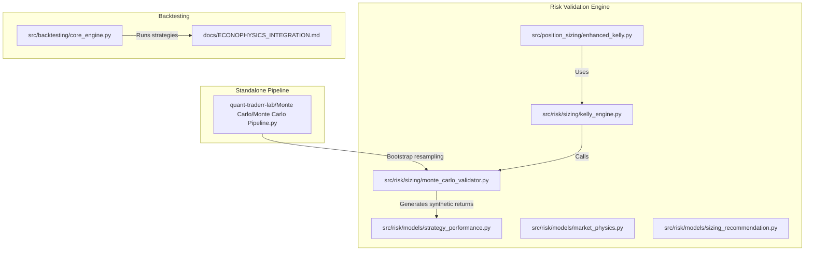
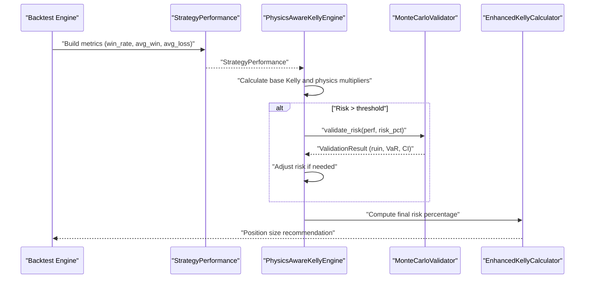
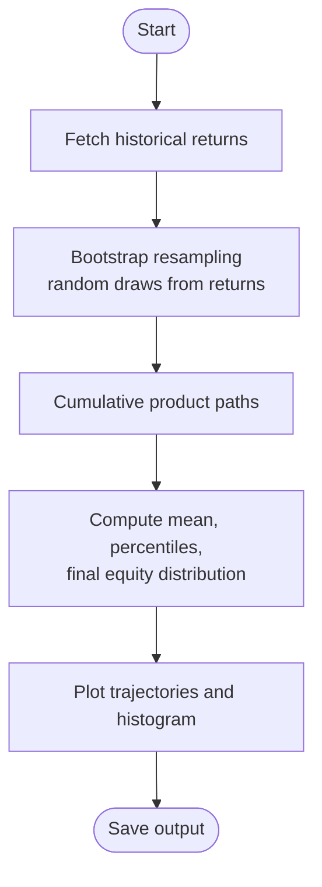
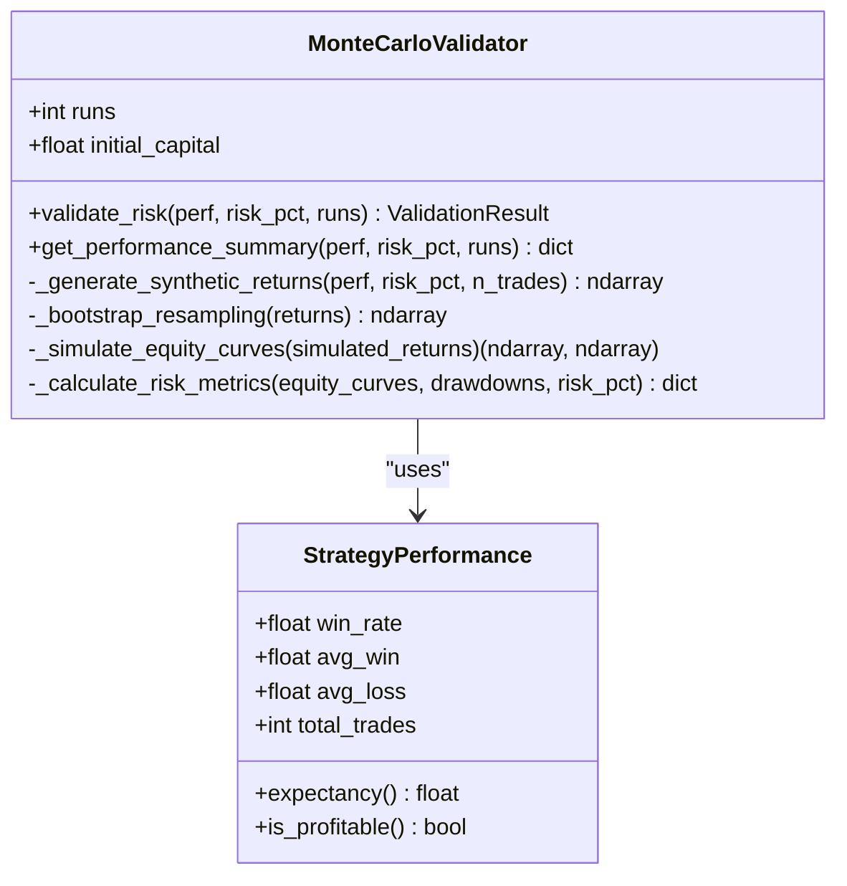
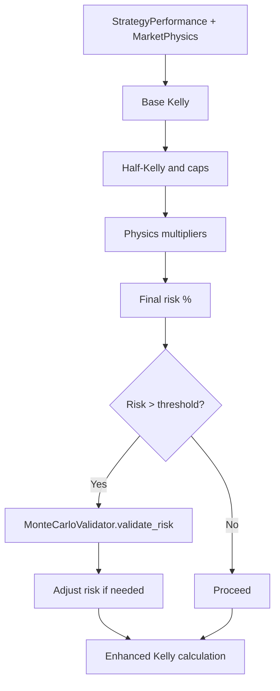
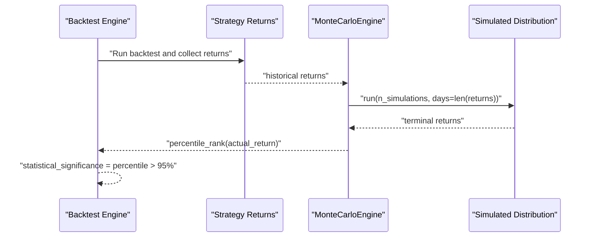
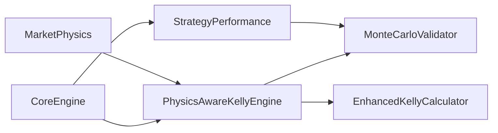

# Monte Carlo Integration

<cite>
**Referenced Files in This Document**
- [Monte Carlo Pipeline.py](file://quant-traderr-lab/Monte Carlo/Monte Carlo Pipeline.py)
- [monte_carlo_validator.py](file://src/risk/sizing/monte_carlo_validator.py)
- [test_monte_carlo_validator.py](file://tests/risk/sizing/test_monte_carlo_validator.py)
- [enhanced_kelly.py](file://src/position_sizing/enhanced_kelly.py)
- [kelly_engine.py](file://src/risk/sizing/kelly_engine.py)
- [strategy_performance.py](file://src/risk/models/strategy_performance.py)
- [market_physics.py](file://src/risk/models/market_physics.py)
- [sizing_recommendation.py](file://src/risk/models/sizing_recommendation.py)
- [core_engine.py](file://src/backtesting/core_engine.py)
- [ECONOPHYSICS_INTEGRATION.md](file://docs/ECONOPHYSICS_INTEGRATION.md)
- [enhanced_kelly_position_sizing_v1.md](file://docs/trds/enhanced_kelly_position_sizing_v1.md)
</cite>

## Table of Contents
1. [Introduction](#introduction)
2. [Project Structure](#project-structure)
3. [Core Components](#core-components)
4. [Architecture Overview](#architecture-overview)
5. [Detailed Component Analysis](#detailed-component-analysis)
6. [Dependency Analysis](#dependency-analysis)
7. [Performance Considerations](#performance-considerations)
8. [Troubleshooting Guide](#troubleshooting-guide)
9. [Conclusion](#conclusion)
10. [Appendices](#appendices)

## Introduction
This document explains Monte Carlo integration in QuantMindX, focusing on:
- Geometric Brownian motion–inspired price simulation and bootstrap resampling from historical returns
- Value at Risk (VaR) and related risk metrics computed from synthetic paths
- Monte Carlo validation complementing backtesting by assessing whether observed performance is statistically significant
- Integration with the Enhanced Kelly position sizing system to stress-test position sizes under varying market regimes

The goal is to help both technical and non-technical readers understand how QuantMindX uses stochastic simulation to quantify risk, validate strategy performance, and inform safe, physics-aware position sizing.

## Project Structure
Monte Carlo functionality spans two primary areas:
- A standalone pipeline for asset price simulation and visualization
- A risk validation engine integrated into the Enhanced Kelly position sizing workflow

**Diagram sources**
- [Monte Carlo Pipeline.py](file://quant-traderr-lab/Monte Carlo/Monte Carlo Pipeline.py#L105-L136)
- [monte_carlo_validator.py](file://src/risk/sizing/monte_carlo_validator.py#L58-L316)
- [strategy_performance.py](file://src/risk/models/strategy_performance.py#L16-L182)
- [market_physics.py](file://src/risk/models/market_physics.py#L27-L247)
- [sizing_recommendation.py](file://src/risk/models/sizing_recommendation.py#L15-L229)
- [kelly_engine.py](file://src/risk/sizing/kelly_engine.py#L25-L282)
- [enhanced_kelly.py](file://src/position_sizing/enhanced_kelly.py#L128-L377)
- [core_engine.py](file://src/backtesting/core_engine.py#L13-L83)
- [ECONOPHYSICS_INTEGRATION.md](file://docs/ECONOPHYSICS_INTEGRATION.md#L35-L70)

**Section sources**
- [Monte Carlo Pipeline.py](file://quant-traderr-lab/Monte Carlo/Monte Carlo Pipeline.py#L1-L233)
- [monte_carlo_validator.py](file://src/risk/sizing/monte_carlo_validator.py#L1-L376)
- [kelly_engine.py](file://src/risk/sizing/kelly_engine.py#L1-L368)
- [enhanced_kelly.py](file://src/position_sizing/enhanced_kelly.py#L1-L418)
- [core_engine.py](file://src/backtesting/core_engine.py#L1-L83)
- [ECONOPHYSICS_INTEGRATION.md](file://docs/ECONOPHYSICS_INTEGRATION.md#L35-L70)

## Core Components
- Monte Carlo Engine (standalone pipeline): Bootstraps historical returns to simulate thousands of price paths, computes VaR and confidence intervals, and produces static visualizations.
- Monte Carlo Validator (risk engine): Synthesizes trade-level returns from StrategyPerformance metrics, runs vectorized bootstrap resampling, simulates equity curves and drawdowns, and returns risk metrics including risk of ruin, VaR, and 95% confidence intervals.
- Enhanced Kelly Position Sizing: Combines traditional Kelly with econophysics multipliers and optional Monte Carlo validation to compute a final risk percentage and position size.
- Backtest Engine: Provides a framework to run strategies and extract performance for downstream Monte Carlo validation.

Key implementation references:
- Standalone pipeline: [Monte Carlo Pipeline.py](file://quant-traderr-lab/Monte Carlo/Monte Carlo Pipeline.py#L105-L233)
- Risk engine: [monte_carlo_validator.py](file://src/risk/sizing/monte_carlo_validator.py#L58-L316)
- StrategyPerformance model: [strategy_performance.py](file://src/risk/models/strategy_performance.py#L16-L182)
- Physics-aware engine: [kelly_engine.py](file://src/risk/sizing/kelly_engine.py#L25-L282)
- Enhanced Kelly: [enhanced_kelly.py](file://src/position_sizing/enhanced_kelly.py#L128-L377)
- Backtest integration: [ECONOPHYSICS_INTEGRATION.md](file://docs/ECONOPHYSICS_INTEGRATION.md#L35-L70)

**Section sources**
- [Monte Carlo Pipeline.py](file://quant-traderr-lab/Monte Carlo/Monte Carlo Pipeline.py#L105-L233)
- [monte_carlo_validator.py](file://src/risk/sizing/monte_carlo_validator.py#L58-L316)
- [strategy_performance.py](file://src/risk/models/strategy_performance.py#L16-L182)
- [kelly_engine.py](file://src/risk/sizing/kelly_engine.py#L25-L282)
- [enhanced_kelly.py](file://src/position_sizing/enhanced_kelly.py#L128-L377)
- [ECONOPHYSICS_INTEGRATION.md](file://docs/ECONOPHYSICS_INTEGRATION.md#L35-L70)

## Architecture Overview
The Monte Carlo stack integrates across three layers:
- Data and Simulation: Historical returns are bootstrapped to form synthetic paths; equity curves and drawdowns are computed.
- Risk Metrics: Risk of ruin, VaR, expected drawdown, and confidence intervals are derived from final equity distributions.
- Position Sizing: The Enhanced Kelly engine applies econophysics multipliers and optionally runs Monte Carlo validation to decide whether to accept or reduce the proposed risk.

**Diagram sources**
- [core_engine.py](file://src/backtesting/core_engine.py#L13-L83)
- [strategy_performance.py](file://src/risk/models/strategy_performance.py#L16-L182)
- [kelly_engine.py](file://src/risk/sizing/kelly_engine.py#L89-L282)
- [monte_carlo_validator.py](file://src/risk/sizing/monte_carlo_validator.py#L216-L316)
- [enhanced_kelly.py](file://src/position_sizing/enhanced_kelly.py#L128-L377)

**Section sources**
- [kelly_engine.py](file://src/risk/sizing/kelly_engine.py#L89-L282)
- [monte_carlo_validator.py](file://src/risk/sizing/monte_carlo_validator.py#L216-L316)
- [enhanced_kelly.py](file://src/position_sizing/enhanced_kelly.py#L128-L377)
- [core_engine.py](file://src/backtesting/core_engine.py#L13-L83)

## Detailed Component Analysis

### Standalone Monte Carlo Pipeline (Asset Price Simulation)
This pipeline demonstrates bootstrap resampling to simulate price paths and compute VaR-like metrics:
- Data acquisition: Downloads historical returns for a given ticker.
- Simulation: Draws random samples from historical returns to project forward, forming cumulative product paths.
- Analysis: Computes mean, 95th percentile (best-case), 5th percentile (worst-case), and histograms.
- Visualization: Produces a static image summarizing trajectories and final distribution.

**Diagram sources**
- [Monte Carlo Pipeline.py](file://quant-traderr-lab/Monte Carlo/Monte Carlo Pipeline.py#L75-L233)

**Section sources**
- [Monte Carlo Pipeline.py](file://quant-traderr-lab/Monte Carlo/Monte Carlo Pipeline.py#L75-L233)

### Monte Carlo Validator (Risk Metrics from Trade Returns)
The validator synthesizes trade-level returns from StrategyPerformance and runs vectorized bootstrap resampling:
- Synthetic returns: Generated from win_rate, avg_win, avg_loss, and risk_pct.
- Bootstrap resampling: Efficiently samples historical/synthetic returns with replacement.
- Equity curves and drawdowns: Cumulative products yield equity curves; drawdowns computed relative to running peaks.
- Risk metrics: Risk of ruin (threshold-based), VaR (percentile), expected drawdown, and 95% confidence interval.

**Diagram sources**
- [monte_carlo_validator.py](file://src/risk/sizing/monte_carlo_validator.py#L58-L316)
- [strategy_performance.py](file://src/risk/models/strategy_performance.py#L16-L182)

**Section sources**
- [monte_carlo_validator.py](file://src/risk/sizing/monte_carlo_validator.py#L58-L316)
- [strategy_performance.py](file://src/risk/models/strategy_performance.py#L16-L182)

### Enhanced Kelly Position Sizing with Monte Carlo Validation
The Enhanced Kelly engine:
- Computes base Kelly from StrategyPerformance.
- Applies half-Kelly and hard risk caps.
- Incorporates econophysics multipliers (Lyapunov, Ising, Random Matrix Theory).
- Optionally triggers Monte Carlo validation when risk exceeds a threshold, adjusting risk downward if needed.

**Diagram sources**
- [kelly_engine.py](file://src/risk/sizing/kelly_engine.py#L89-L282)
- [monte_carlo_validator.py](file://src/risk/sizing/monte_carlo_validator.py#L216-L316)
- [enhanced_kelly.py](file://src/position_sizing/enhanced_kelly.py#L128-L377)

**Section sources**
- [kelly_engine.py](file://src/risk/sizing/kelly_engine.py#L89-L282)
- [monte_carlo_validator.py](file://src/risk/sizing/monte_carlo_validator.py#L216-L316)
- [enhanced_kelly.py](file://src/position_sizing/enhanced_kelly.py#L128-L377)

### Backtesting Integration and Statistical Significance
After running a strategy backtest, the system can validate whether the observed performance is likely due to skill or luck by comparing it to a distribution of outcomes from bootstrap-resampled returns. The integration defines:
- Extract strategy returns from backtest results.
- Bootstrap resample to create synthetic terminal returns.
- Compute percentile rank of actual return.
- Decide statistical significance threshold (e.g., top 5%).

**Diagram sources**
- [ECONOPHYSICS_INTEGRATION.md](file://docs/ECONOPHYSICS_INTEGRATION.md#L35-L70)
- [core_engine.py](file://src/backtesting/core_engine.py#L13-L83)

**Section sources**
- [ECONOPHYSICS_INTEGRATION.md](file://docs/ECONOPHYSICS_INTEGRATION.md#L35-L70)
- [core_engine.py](file://src/backtesting/core_engine.py#L13-L83)

## Dependency Analysis
- Monte Carlo Validator depends on StrategyPerformance for trade-level metrics and uses numpy for vectorized operations.
- PhysicsAwareKellyEngine orchestrates Enhanced Kelly, applies econophysics multipliers, and conditionally invokes Monte Carlo validation.
- Enhanced Kelly calculator computes position size from risk percentage, ATR, and broker-specific lot increments.
- Backtest Engine provides the execution harness for strategies and can feed returns into Monte Carlo validation.

**Diagram sources**
- [strategy_performance.py](file://src/risk/models/strategy_performance.py#L16-L182)
- [monte_carlo_validator.py](file://src/risk/sizing/monte_carlo_validator.py#L58-L316)
- [market_physics.py](file://src/risk/models/market_physics.py#L27-L247)
- [kelly_engine.py](file://src/risk/sizing/kelly_engine.py#L25-L282)
- [enhanced_kelly.py](file://src/position_sizing/enhanced_kelly.py#L128-L377)
- [core_engine.py](file://src/backtesting/core_engine.py#L13-L83)

**Section sources**
- [strategy_performance.py](file://src/risk/models/strategy_performance.py#L16-L182)
- [monte_carlo_validator.py](file://src/risk/sizing/monte_carlo_validator.py#L58-L316)
- [market_physics.py](file://src/risk/models/market_physics.py#L27-L247)
- [kelly_engine.py](file://src/risk/sizing/kelly_engine.py#L25-L282)
- [enhanced_kelly.py](file://src/position_sizing/enhanced_kelly.py#L128-L377)
- [core_engine.py](file://src/backtesting/core_engine.py#L13-L83)

## Performance Considerations
- Vectorization: Bootstrap resampling and cumulative products are implemented with vectorized numpy operations to achieve sub-second runtime for typical run counts.
- Benchmark target: The risk engine targets completion under 500 ms for 2000 runs.
- Visualization overhead: The standalone pipeline includes static visualization; disable or reduce for batch runs.
- Memory footprint: Limit plotted trajectory subsets for large run counts to avoid matplotlib memory pressure.

Practical guidance:
- Use fewer runs for rapid iterations; increase for detailed analysis.
- Prefer synthetic returns generation over real-time market data fetching when validating sizing.
- Cache StrategyPerformance metrics to minimize repeated computation.

**Section sources**
- [monte_carlo_validator.py](file://src/risk/sizing/monte_carlo_validator.py#L65-L67)
- [test_monte_carlo_validator.py](file://tests/risk/sizing/test_monte_carlo_validator.py#L217-L231)
- [Monte Carlo Pipeline.py](file://quant-traderr-lab/Monte Carlo/Monte Carlo Pipeline.py#L182-L187)

## Troubleshooting Guide
Common issues and resolutions:
- Invalid inputs:
  - StrategyPerformance enforces strict bounds for win_rate, avg_win, avg_loss, and total_trades.
  - Monte Carlo Validator validates risk_pct range and perf type.
- Negative expectancy:
  - StrategyPerformance marks negative expectancy; Enhanced Kelly engine returns zero position.
- Monte Carlo validation disabled:
  - PhysicsAwareKellyEngine skips validation if validator is not provided or risk below threshold.
- Stale market physics:
  - MarketPhysics provides freshness checks; mark stale and recalculate if needed.

Relevant validations and logs:
- StrategyPerformance validation and expectancy: [strategy_performance.py](file://src/risk/models/strategy_performance.py#L75-L101)
- Monte Carlo input validation and warnings: [monte_carlo_validator.py](file://src/risk/sizing/monte_carlo_validator.py#L252-L265)
- Physics-aware engine validation and fallbacks: [kelly_engine.py](file://src/risk/sizing/kelly_engine.py#L138-L157)

**Section sources**
- [strategy_performance.py](file://src/risk/models/strategy_performance.py#L75-L101)
- [monte_carlo_validator.py](file://src/risk/sizing/monte_carlo_validator.py#L252-L265)
- [kelly_engine.py](file://src/risk/sizing/kelly_engine.py#L138-L157)

## Conclusion
QuantMindX’s Monte Carlo integration provides a robust foundation for:
- Stress-testing position sizes under realistic market uncertainty
- Complementing backtesting with statistical significance checks
- Incorporating econophysics insights to adapt risk dynamically

By combining bootstrap resampling, VaR-like metrics, and physics-aware sizing, the system offers both quantitative rigor and adaptive risk controls essential for disciplined trading.

## Appendices

### Practical Examples and Interpretation
- Running Monte Carlo simulations:
  - Use the risk engine to validate a proposed risk percentage against StrategyPerformance metrics.
  - Retrieve risk_of_ruin, VaR, and confidence intervals from the ValidationResult.
- Interpreting percentile rankings:
  - Compare actual terminal return to simulated distribution; a high percentile indicates strong outperformance relative to chance.
- Statistical significance thresholds:
  - Treat results as significant if the observed return ranks above a chosen percentile (e.g., top 5%).

Integration patterns:
- Backtesting-first workflow: Run strategy, then bootstrap-validate performance.
- Sizing-first workflow: Compute Enhanced Kelly risk, validate with Monte Carlo, then convert risk to position size.

**Section sources**
- [monte_carlo_validator.py](file://src/risk/sizing/monte_carlo_validator.py#L216-L316)
- [ECONOPHYSICS_INTEGRATION.md](file://docs/ECONOPHYSICS_INTEGRATION.md#L35-L70)
- [enhanced_kelly_position_sizing_v1.md](file://docs/trds/enhanced_kelly_position_sizing_v1.md#L190-L226)