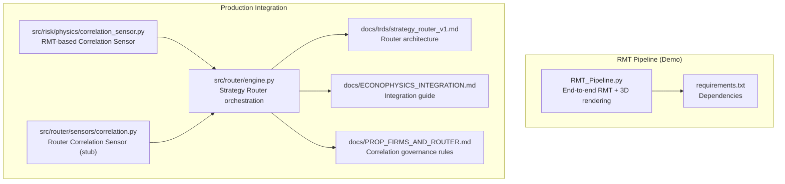
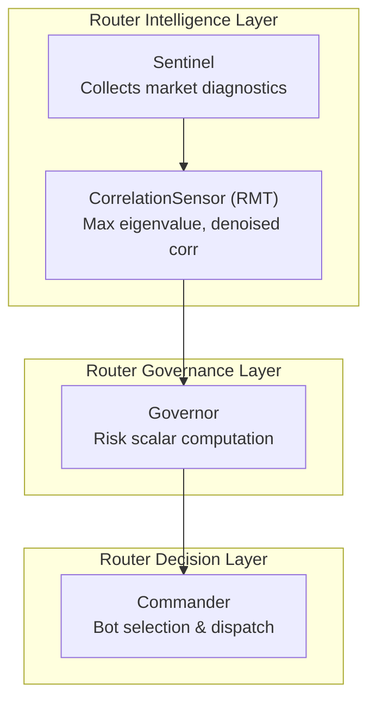
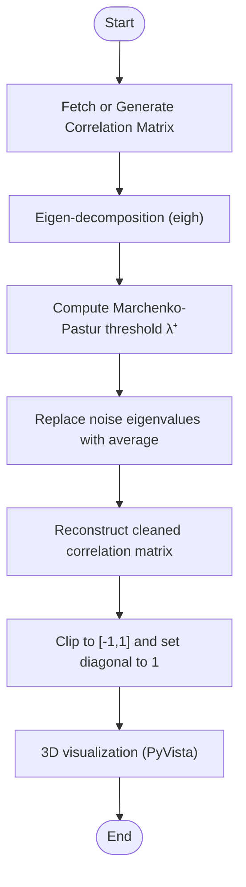
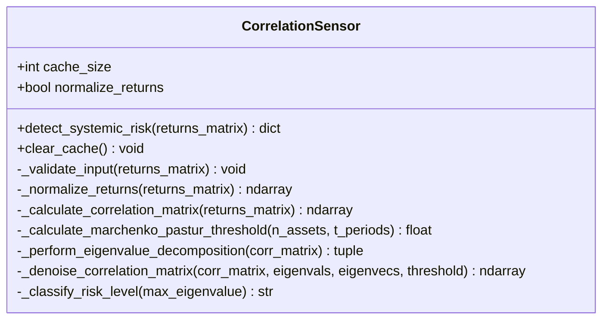
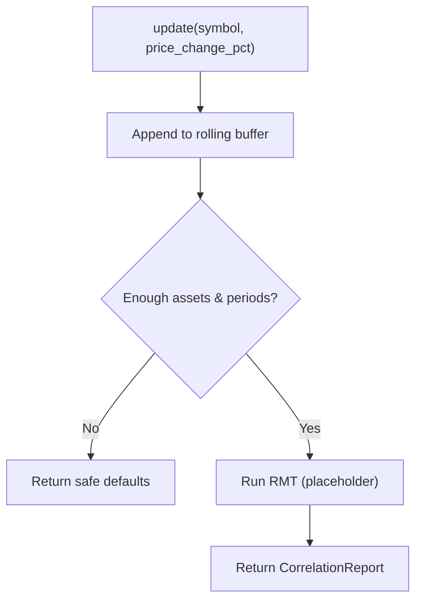
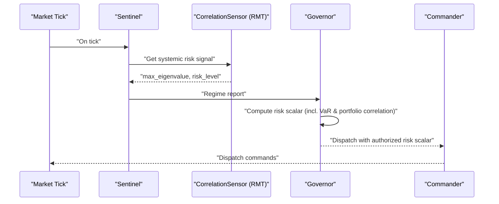
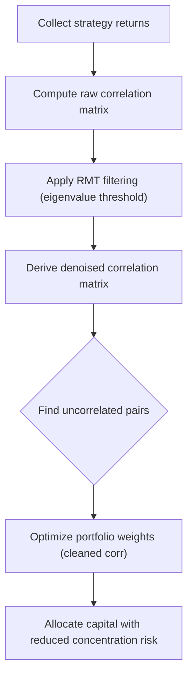
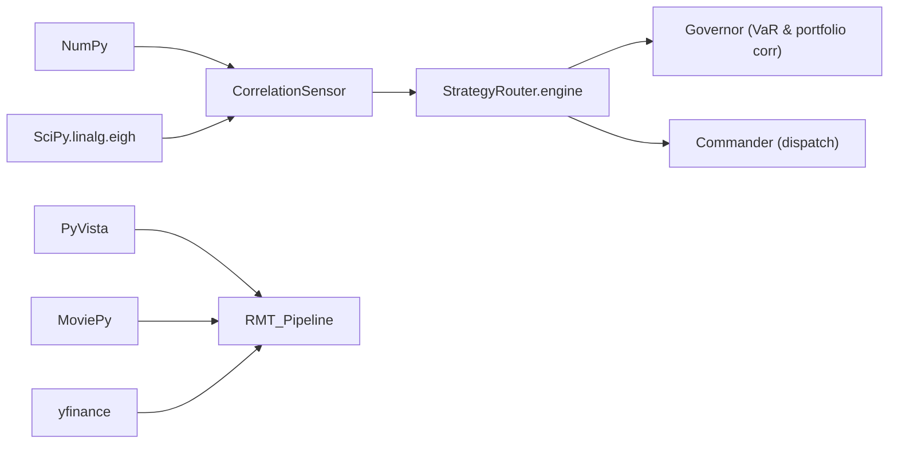

# RMT Correlation Filter

<cite>
**Referenced Files in This Document**
- [RMT_Pipeline.py](file://quant-traderr-lab/RMT_Correlation_Filter/RMT_Pipeline.py)
- [requirements.txt](file://quant-traderr-lab/RMT_Correlation_Filter/requirements.txt)
- [correlation_sensor.py](file://src/risk/physics/correlation_sensor.py)
- [correlation.py](file://src/router/sensors/correlation.py)
- [engine.py](file://src/router/engine.py)
- [strategy_router_v1.md](file://docs/trds/strategy_router_v1.md)
- [ECONOPHYSICS_INTEGRATION.md](file://docs/ECONOPHYSICS_INTEGRATION.md)
- [PROP_FIRMS_AND_ROUTER.md](file://docs/PROP_FIRMS_AND_ROUTER.md)
</cite>

## Table of Contents
1. [Introduction](#introduction)
2. [Project Structure](#project-structure)
3. [Core Components](#core-components)
4. [Architecture Overview](#architecture-overview)
5. [Detailed Component Analysis](#detailed-component-analysis)
6. [Dependency Analysis](#dependency-analysis)
7. [Performance Considerations](#performance-considerations)
8. [Troubleshooting Guide](#troubleshooting-guide)
9. [Conclusion](#conclusion)
10. [Appendices](#appendices)

## Introduction
This document explains the Random Matrix Theory (RMT) correlation filtering integration for multi-strategy portfolio management. It covers the Marchenko-Pastur eigenvalue filtering technique that separates true signals from sampling noise in correlation matrices, enabling cleaner portfolio allocations. It also documents how the RMT-derived systemic risk signal integrates with the Strategy Router to inform portfolio construction, diversification, and risk scaling. Practical examples demonstrate applying the filter to correlation matrices, identifying uncorrelated strategy pairs, and optimizing portfolio weights using cleaned correlation data.

## Project Structure
The RMT correlation filtering spans two primary areas:
- A standalone pipeline that demonstrates RMT signal extraction and visualization.
- The production-ready correlation sensor used by the Strategy Router for systemic risk detection and portfolio governance.

**Diagram sources**
- [RMT_Pipeline.py](file://quant-traderr-lab/RMT_Correlation_Filter/RMT_Pipeline.py#L1-L427)
- [requirements.txt](file://quant-traderr-lab/RMT_Correlation_Filter/requirements.txt#L1-L8)
- [correlation_sensor.py](file://src/risk/physics/correlation_sensor.py#L1-L285)
- [correlation.py](file://src/router/sensors/correlation.py#L1-L45)
- [engine.py](file://src/router/engine.py#L1-L68)
- [strategy_router_v1.md](file://docs/trds/strategy_router_v1.md#L1-L236)
- [ECONOPHYSICS_INTEGRATION.md](file://docs/ECONOPHYSICS_INTEGRATION.md#L176-L222)
- [PROP_FIRMS_AND_ROUTER.md](file://docs/PROP_FIRMS_AND_ROUTER.md#L141-L183)

**Section sources**
- [RMT_Pipeline.py](file://quant-traderr-lab/RMT_Correlation_Filter/RMT_Pipeline.py#L1-L427)
- [requirements.txt](file://quant-traderr-lab/RMT_Correlation_Filter/requirements.txt#L1-L8)
- [correlation_sensor.py](file://src/risk/physics/correlation_sensor.py#L1-L285)
- [correlation.py](file://src/router/sensors/correlation.py#L1-L45)
- [engine.py](file://src/router/engine.py#L1-L68)
- [strategy_router_v1.md](file://docs/trds/strategy_router_v1.md#L1-L236)
- [ECONOPHYSICS_INTEGRATION.md](file://docs/ECONOPHYSICS_INTEGRATION.md#L176-L222)
- [PROP_FIRMS_AND_ROUTER.md](file://docs/PROP_FIRMS_AND_ROUTER.md#L141-L183)

## Core Components
- RMT Pipeline (demo): Implements end-to-end RMT filtering, eigenvalue decomposition, Marchenko-Pastur thresholding, and 3D visualization of raw vs cleaned correlation matrices.
- Production Correlation Sensor: Performs RMT-based systemic risk detection from returns matrices, returning max eigenvalue, noise threshold, and denoised correlation matrix.
- Router Correlation Sensor (stub): Provides a lightweight interface for correlation diagnostics within the Router’s sensor array.
- Strategy Router: Orchestrates Sentinel, Governor, and Commander layers; uses RMT insights to constrain portfolio correlation and risk budgets.

Key integration points:
- The Router’s correlation sensor feeds the systemic risk signal (max eigenvalue) into the Governor’s risk scalar computation.
- The Router’s portfolio governance rules prevent excessive portfolio-wide correlation, complementing RMT-derived signals.

**Section sources**
- [RMT_Pipeline.py](file://quant-traderr-lab/RMT_Correlation_Filter/RMT_Pipeline.py#L118-L157)
- [correlation_sensor.py](file://src/risk/physics/correlation_sensor.py#L229-L281)
- [correlation.py](file://src/router/sensors/correlation.py#L15-L45)
- [engine.py](file://src/router/engine.py#L16-L68)
- [strategy_router_v1.md](file://docs/trds/strategy_router_v1.md#L50-L76)
- [ECONOPHYSICS_INTEGRATION.md](file://docs/ECONOPHYSICS_INTEGRATION.md#L185-L222)
- [PROP_FIRMS_AND_ROUTER.md](file://docs/PROP_FIRMS_AND_ROUTER.md#L141-L183)

## Architecture Overview
The RMT correlation filter sits within the Router’s intelligence layer and influences risk governance and dispatch decisions.

**Diagram sources**
- [strategy_router_v1.md](file://docs/trds/strategy_router_v1.md#L22-L76)
- [correlation_sensor.py](file://src/risk/physics/correlation_sensor.py#L229-L281)
- [engine.py](file://src/router/engine.py#L16-L68)

## Detailed Component Analysis

### RMT Pipeline (Visualization and Demo)
The pipeline demonstrates the full RMT workflow:
- Data acquisition (real or synthetic).
- Eigenvalue decomposition and Marchenko-Pastur thresholding.
- Reconstruction of a denoised correlation matrix.
- 3D visualization of raw vs cleaned matrices with animated scanning beam.

**Diagram sources**
- [RMT_Pipeline.py](file://quant-traderr-lab/RMT_Correlation_Filter/RMT_Pipeline.py#L118-L157)
- [RMT_Pipeline.py](file://quant-traderr-lab/RMT_Correlation_Filter/RMT_Pipeline.py#L245-L357)

**Section sources**
- [RMT_Pipeline.py](file://quant-traderr-lab/RMT_Correlation_Filter/RMT_Pipeline.py#L1-L427)
- [requirements.txt](file://quant-traderr-lab/RMT_Correlation_Filter/requirements.txt#L1-L8)

### Production Correlation Sensor (RMT-based)
The production sensor performs validated RMT analysis:
- Validates input dimensions and data quality.
- Normalizes returns optionally.
- Builds a correlation matrix, handling NaNs.
- Computes the Marchenko-Pastur threshold.
- Performs eigenvalue decomposition and denoises the matrix by replacing noise eigenvalues with their average.
- Returns max eigenvalue, threshold, denoised matrix, eigenvalues, and eigenvectors.

**Diagram sources**
- [correlation_sensor.py](file://src/risk/physics/correlation_sensor.py#L22-L285)

**Section sources**
- [correlation_sensor.py](file://src/risk/physics/correlation_sensor.py#L1-L285)

### Router Correlation Sensor (Stub)
The Router’s correlation sensor stub collects recent returns and provides a placeholder for RMT-based diagnostics. It ensures minimum data availability before emitting a report.

**Diagram sources**
- [correlation.py](file://src/router/sensors/correlation.py#L21-L44)

**Section sources**
- [correlation.py](file://src/router/sensors/correlation.py#L1-L45)

### Strategy Router Integration
The Router orchestrates the loop: observe, govern, command, and execute. The correlation sensor informs the Governor’s risk scalar, which scales allocations based on systemic risk derived from the correlation matrix.

**Diagram sources**
- [engine.py](file://src/router/engine.py#L29-L60)
- [strategy_router_v1.md](file://docs/trds/strategy_router_v1.md#L84-L102)
- [correlation_sensor.py](file://src/risk/physics/correlation_sensor.py#L229-L281)

**Section sources**
- [engine.py](file://src/router/engine.py#L1-L68)
- [strategy_router_v1.md](file://docs/trds/strategy_router_v1.md#L1-L236)
- [ECONOPHYSICS_INTEGRATION.md](file://docs/ECONOPHYSICS_INTEGRATION.md#L185-L222)

### Portfolio Allocation Using Filtered Correlations
The Router can leverage cleaned correlations to improve diversification and reduce portfolio concentration risk. The integration guide outlines:
- Computing filtered correlations from strategy returns.
- Identifying truly uncorrelated strategy pairs.
- Optimizing weights using the cleaned correlation matrix.

**Diagram sources**
- [ECONOPHYSICS_INTEGRATION.md](file://docs/ECONOPHYSICS_INTEGRATION.md#L185-L222)

**Section sources**
- [ECONOPHYSICS_INTEGRATION.md](file://docs/ECONOPHYSICS_INTEGRATION.md#L176-L222)
- [PROP_FIRMS_AND_ROUTER.md](file://docs/PROP_FIRMS_AND_ROUTER.md#L141-L183)

## Dependency Analysis
- The RMT pipeline depends on scientific computing libraries for numerical linear algebra and visualization.
- The production correlation sensor depends on NumPy and SciPy for eigenvalue decomposition and matrix operations.
- The Router integrates the correlation sensor into its tri-layer control hierarchy.

**Diagram sources**
- [correlation_sensor.py](file://src/risk/physics/correlation_sensor.py#L16-L18)
- [RMT_Pipeline.py](file://quant-traderr-lab/RMT_Correlation_Filter/RMT_Pipeline.py#L36-L46)
- [engine.py](file://src/router/engine.py#L1-L68)

**Section sources**
- [requirements.txt](file://quant-traderr-lab/RMT_Correlation_Filter/requirements.txt#L1-L8)
- [correlation_sensor.py](file://src/risk/physics/correlation_sensor.py#L1-L285)
- [RMT_Pipeline.py](file://quant-traderr-lab/RMT_Correlation_Filter/RMT_Pipeline.py#L1-L427)
- [engine.py](file://src/router/engine.py#L1-L68)

## Performance Considerations
- Numerical stability: The production sensor clips correlation values to [-1, 1] and sets the diagonal to 1 after reconstruction.
- Caching: The production sensor caches results to avoid repeated computations for identical inputs.
- Data hygiene: NaN handling replaces missing values with column means prior to correlation calculation.
- Complexity: Eigenvalue decomposition of an N×N correlation matrix is O(N³); caching and limiting asset count improves throughput.
- Visualization pipeline: Rendering uses GPU-accelerated plotting and frame interpolation; suitable for offline post-processing rather than live latency.

[No sources needed since this section provides general guidance]

## Troubleshooting Guide
Common issues and resolutions:
- Insufficient data: Ensure at least 2 assets and 20 periods; otherwise, input validation raises errors.
- Constant returns: Standard deviation normalization avoids division by zero; constant series are handled gracefully.
- NaN values: The sensor replaces NaN entries with column means before computing the covariance and correlation matrices.
- Cache misses: If results vary unexpectedly, clear the cache to force recomputation.
- Portfolio correlation limits: Use governance rules to cap portfolio-wide correlation and prevent over-concentration.

**Section sources**
- [correlation_sensor.py](file://src/risk/physics/correlation_sensor.py#L57-L80)
- [correlation_sensor.py](file://src/risk/physics/correlation_sensor.py#L113-L135)
- [correlation_sensor.py](file://src/risk/physics/correlation_sensor.py#L283-L285)
- [PROP_FIRMS_AND_ROUTER.md](file://docs/PROP_FIRMS_AND_ROUTER.md#L141-L183)

## Conclusion
The RMT correlation filter provides a robust method for distinguishing true signals from sampling noise in correlation matrices. By integrating the max eigenvalue and denoised correlation matrix into the Strategy Router, the system can better manage diversification, reduce portfolio concentration risk, and scale allocations according to systemic risk conditions. The production sensor offers validated, numerically stable RMT analysis, while the integration guide and governance rules ensure practical deployment across multi-strategy portfolios.

[No sources needed since this section summarizes without analyzing specific files]

## Appendices

### Mathematical Foundations of Eigenvalue Filtering
- Eigenvalue decomposition separates the correlation matrix into signal and noise subspaces.
- The Marchenko-Pastur distribution defines the theoretical upper bound for bulk eigenvalues under random matrix assumptions.
- Noise eigenvalues below the threshold are replaced with the average of noise eigenvalues, stabilizing the correlation matrix and reducing spurious relationships.

**Section sources**
- [correlation_sensor.py](file://src/risk/physics/correlation_sensor.py#L137-L154)
- [correlation_sensor.py](file://src/risk/physics/correlation_sensor.py#L176-L210)

### Practical Examples
- Applying RMT filtering to correlation matrices: Use the production sensor to compute the denoised correlation matrix and derive systemic risk metrics.
- Identifying uncorrelated strategy pairs: Threshold absolute correlations from the cleaned matrix to select pairs with low dependence.
- Optimizing portfolio weights: Use the cleaned correlation matrix in a quadratic optimizer to maximize diversification and minimize concentration risk.

**Section sources**
- [ECONOPHYSICS_INTEGRATION.md](file://docs/ECONOPHYSICS_INTEGRATION.md#L185-L222)
- [PROP_FIRMS_AND_ROUTER.md](file://docs/PROP_FIRMS_AND_ROUTER.md#L141-L183)