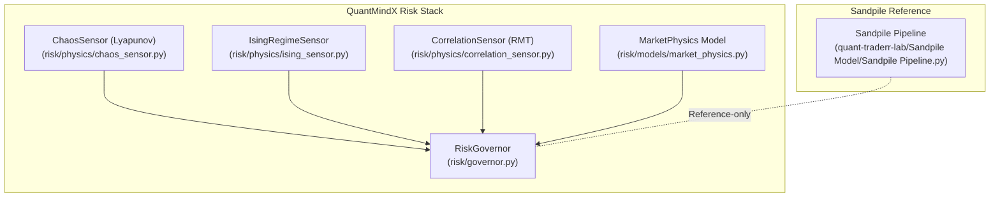
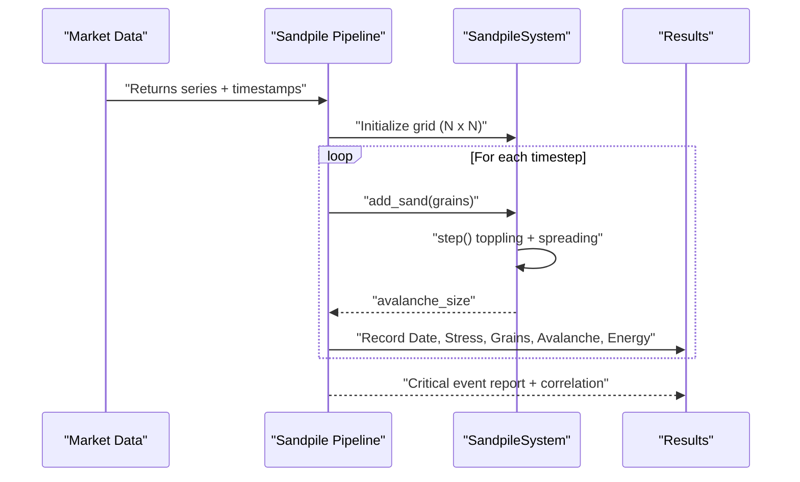
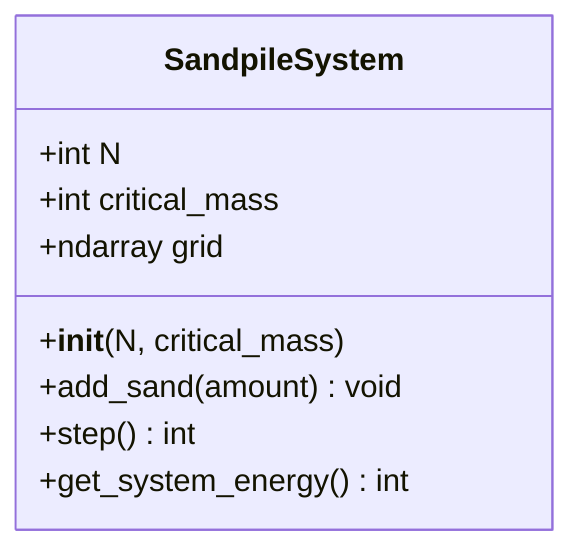
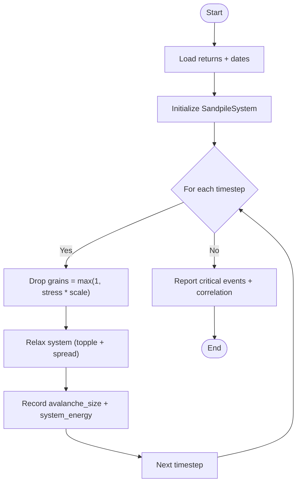
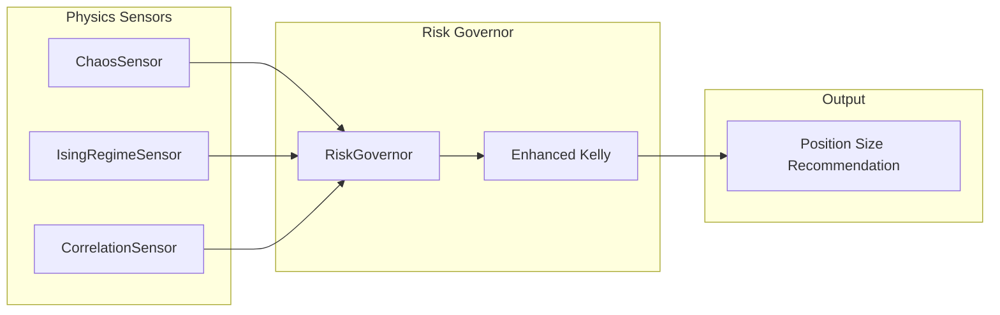
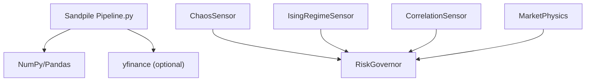

# Sandpile Model Reference

<cite>
**Referenced Files in This Document**
- [Sandpile Pipeline.py](file://quant-traderr-lab/Sandpile Model/Sandpile Pipeline.py)
- [ECONOPHYSICS_INTEGRATION.md](file://docs/ECONOPHYSICS_INTEGRATION.md)
- [market_physics.py](file://src/risk/models/market_physics.py)
- [governor.py](file://src/risk/governor.py)
- [ising_sensor.py](file://src/risk/physics/ising_sensor.py)
- [chaos_sensor.py](file://src/risk/physics/chaos_sensor.py)
- [correlation_sensor.py](file://src/risk/physics/correlation_sensor.py)
</cite>

## Table of Contents
1. [Introduction](#introduction)
2. [Project Structure](#project-structure)
3. [Core Components](#core-components)
4. [Architecture Overview](#architecture-overview)
5. [Detailed Component Analysis](#detailed-component-analysis)
6. [Dependency Analysis](#dependency-analysis)
7. [Performance Considerations](#performance-considerations)
8. [Troubleshooting Guide](#troubleshooting-guide)
9. [Conclusion](#conclusion)
10. [Appendices](#appendices)

## Introduction
This document provides reference documentation for the Sandpile Model integration in QuantMindX. The Sandpile Model, rooted in the Bak–Tang–Wiesenfeld (BTW) cellular automaton, serves as a theoretical framework for understanding self-organized criticality (SOC) in financial markets. It posits that markets naturally evolve toward a critical state where small perturbations can trigger large cascades—mirroring the “avalanche” dynamics of sandpile collapse. In QuantMindX, the Sandpile Model is documented as a reference-only implementation and is not currently integrated into production risk management or position sizing workflows. However, it outlines potential future applications such as crash probability estimation, stress detection for systemic risk events, and early warning systems for flash crashes.

The current integration landscape in QuantMindX centers on three validated econophysics sensors: Lyapunov Exponent (chaos detection), Ising Model (phase transitions), and Random Matrix Theory (systemic risk). These components feed into the Risk Governor, which dynamically adjusts position sizing based on physics-derived risk multipliers. The Sandpile Model complements these sensors by offering a complementary lens on critical-state behavior and cascade dynamics.

## Project Structure
The Sandpile Model reference implementation resides in the quant-traderr-lab sandbox and is mapped for documentation in the project’s econophysics integration guide. The following diagram shows how the Sandpile Pipeline relates to the broader QuantMindX risk stack.

**Diagram sources**
- [Sandpile Pipeline.py](file://quant-traderr-lab/Sandpile Model/Sandpile Pipeline.py#L1-L285)
- [ECONOPHYSICS_INTEGRATION.md](file://docs/ECONOPHYSICS_INTEGRATION.md#L509-L524)
- [market_physics.py](file://src/risk/models/market_physics.py#L1-L247)
- [governor.py](file://src/risk/governor.py#L1-L447)
- [ising_sensor.py](file://src/risk/physics/ising_sensor.py#L1-L246)
- [chaos_sensor.py](file://src/risk/physics/chaos_sensor.py#L1-L253)
- [correlation_sensor.py](file://src/risk/physics/correlation_sensor.py#L1-L285)

**Section sources**
- [ECONOPHYSICS_INTEGRATION.md](file://docs/ECONOPHYSICS_INTEGRATION.md#L509-L524)
- [Sandpile Pipeline.py](file://quant-traderr-lab/Sandpile Model/Sandpile Pipeline.py#L1-L32)

## Core Components
- SandpileSystem: Implements the BTW cellular automaton on a 2D grid with open boundaries, critical mass threshold, and vectorized toppling dynamics.
- Stress-to-grains mapping: Converts absolute returns into “grains” dropped randomly onto the grid at each timestep.
- Avalanche tracking: Counts topples during relaxation to quantify avalanche size and monitors system energy (total grains).
- Reporting: Identifies critical events by thresholding avalanche size and correlates input stress with avalanche occurrence.

Current status: Reference-only implementation. Not integrated into production risk management.

**Section sources**
- [Sandpile Pipeline.py](file://quant-traderr-lab/Sandpile Model/Sandpile Pipeline.py#L109-L174)
- [Sandpile Pipeline.py](file://quant-traderr-lab/Sandpile Model/Sandpile Pipeline.py#L177-L230)
- [Sandpile Pipeline.py](file://quant-traderr-lab/Sandpile Model/Sandpile Pipeline.py#L232-L265)
- [ECONOPHYSICS_INTEGRATION.md](file://docs/ECONOPHYSICS_INTEGRATION.md#L509-L524)

## Architecture Overview
The Sandpile Pipeline operates as a standalone analysis module that transforms market stress into a cellular automaton and records critical events. In contrast, QuantMindX’s production risk management relies on the Risk Governor, which orchestrates three validated physics sensors and applies their outputs as risk multipliers to position sizing.

**Diagram sources**
- [Sandpile Pipeline.py](file://quant-traderr-lab/Sandpile Model/Sandpile Pipeline.py#L69-L106)
- [Sandpile Pipeline.py](file://quant-traderr-lab/Sandpile Model/Sandpile Pipeline.py#L109-L174)
- [Sandpile Pipeline.py](file://quant-traderr-lab/Sandpile Model/Sandpile Pipeline.py#L177-L230)
- [Sandpile Pipeline.py](file://quant-traderr-lab/Sandpile Model/Sandpile Pipeline.py#L232-L265)

## Detailed Component Analysis

### SandpileSystem Class
SandpileSystem encapsulates the BTW dynamics:
- Grid initialization and critical mass threshold define the critical state.
- add_sand distributes “grains” randomly across the grid proportional to stress magnitude.
- step evolves the system until stability, counting topples as avalanche size and distributing grains to orthogonal neighbors with open boundaries.
- get_system_energy computes total stored energy (sum of grains).

**Diagram sources**
- [Sandpile Pipeline.py](file://quant-traderr-lab/Sandpile Model/Sandpile Pipeline.py#L109-L174)

**Section sources**
- [Sandpile Pipeline.py](file://quant-traderr-lab/Sandpile Model/Sandpile Pipeline.py#L109-L174)

### Stress-to-Avalanche Workflow
The pipeline converts market stress (absolute returns) into grains, drops them onto the grid, relaxes the system, and records avalanche size and system energy. Critical events are flagged when avalanche size exceeds a configurable threshold.

**Diagram sources**
- [Sandpile Pipeline.py](file://quant-traderr-lab/Sandpile Model/Sandpile Pipeline.py#L177-L230)
- [Sandpile Pipeline.py](file://quant-traderr-lab/Sandpile Model/Sandpile Pipeline.py#L232-L265)

**Section sources**
- [Sandpile Pipeline.py](file://quant-traderr-lab/Sandpile Model/Sandpile Pipeline.py#L177-L230)
- [Sandpile Pipeline.py](file://quant-traderr-lab/Sandpile Model/Sandpile Pipeline.py#L232-L265)

### Integration with Risk Governor and MarketPhysics
While the Sandpile Pipeline is reference-only, its conceptual outputs align with the Risk Governor’s physics-driven risk multipliers. The Risk Governor consumes:
- ChaosSensor (Lyapunov exponent) for chaos damping
- IsingRegimeSensor for phase transition warnings
- CorrelationSensor (RMT) for systemic risk signals

These are combined into a physics multiplier that scales the base Kelly fraction for position sizing.

**Diagram sources**
- [chaos_sensor.py](file://src/risk/physics/chaos_sensor.py#L1-L253)
- [ising_sensor.py](file://src/risk/physics/ising_sensor.py#L1-L246)
- [correlation_sensor.py](file://src/risk/physics/correlation_sensor.py#L1-L285)
- [governor.py](file://src/risk/governor.py#L1-L447)
- [market_physics.py](file://src/risk/models/market_physics.py#L1-L247)

**Section sources**
- [governor.py](file://src/risk/governor.py#L262-L297)
- [market_physics.py](file://src/risk/models/market_physics.py#L131-L177)

## Dependency Analysis
- Sandpile Pipeline depends on NumPy and Pandas for numerical operations and data handling, and optionally yfinance for market data acquisition.
- Production risk management depends on:
  - ChaosSensor (Lyapunov)
  - IsingRegimeSensor
  - CorrelationSensor (RMT)
  - MarketPhysics model for risk classification and multipliers
  - RiskGovernor orchestration

**Diagram sources**
- [Sandpile Pipeline.py](file://quant-traderr-lab/Sandpile Model/Sandpile Pipeline.py#L34-L38)
- [chaos_sensor.py](file://src/risk/physics/chaos_sensor.py#L1-L253)
- [ising_sensor.py](file://src/risk/physics/ising_sensor.py#L1-L246)
- [correlation_sensor.py](file://src/risk/physics/correlation_sensor.py#L1-L285)
- [market_physics.py](file://src/risk/models/market_physics.py#L1-L247)
- [governor.py](file://src/risk/governor.py#L1-L447)

**Section sources**
- [Sandpile Pipeline.py](file://quant-traderr-lab/Sandpile Model/Sandpile Pipeline.py#L34-L38)
- [governor.py](file://src/risk/governor.py#L262-L297)

## Performance Considerations
- SandpileSystem uses vectorized NumPy operations for toppling and spreading, which scales with grid size and number of timesteps. Open boundaries naturally prevent edge artifacts.
- For high-frequency data, consider reducing grid size or critical mass to maintain responsiveness while preserving SOC behavior.
- The Risk Governor caches physics sensor outputs to minimize repeated computation and improve throughput.

[No sources needed since this section provides general guidance]

## Troubleshooting Guide
Common issues and mitigations:
- Empty or invalid market data: The pipeline validates non-empty datasets and raises explicit errors; ensure the data provider returns valid series.
- Extremely large grids or critical masses: May slow relaxation; tune CONFIG parameters for desired balance between sensitivity and speed.
- Low correlation between stress and avalanche size: Indicates endogenous instability (SOC) dominates external shocks; interpret results cautiously under regime shifts.

**Section sources**
- [Sandpile Pipeline.py](file://quant-traderr-lab/Sandpile Model/Sandpile Pipeline.py#L80-L105)
- [Sandpile Pipeline.py](file://quant-traderr-lab/Sandpile Model/Sandpile Pipeline.py#L133-L169)
- [Sandpile Pipeline.py](file://quant-traderr-lab/Sandpile Model/Sandpile Pipeline.py#L256-L264)

## Conclusion
The Sandpile Model offers a valuable theoretical framework for studying self-organized criticality and cascade dynamics in financial markets. In QuantMindX, it is documented as a reference-only implementation, distinct from the production risk management stack that currently integrates Chaos (Lyapunov), Ising (phase transitions), and RMT (systemic risk) sensors via the Risk Governor. While not yet integrated, the Sandpile Model’s avalanche-size tracking and critical-event identification align with potential use cases such as crash probability estimation and early warning systems. Future integration pathways could involve mapping stress to grains within the Risk Governor’s orchestration layer, complementing existing physics multipliers to enhance proactive market condition assessment.

[No sources needed since this section summarizes without analyzing specific files]

## Appendices

### Mathematical Foundations and Computational Modeling
- Bak–Tang–Wiesenfeld Sandpile:
  - Cellular automaton on a 2D grid with open boundaries.
  - Critical mass threshold defines critical state; toppling redistributes mass to orthogonal neighbors.
  - Power-law avalanche-size distributions emerge in the infinite-system thermodynamic limit.
- Stress Mapping:
  - Absolute returns scaled to integer “grains” dropped at random locations.
- Critical State Identification:
  - Threshold-based identification of critical avalanches.
- Avalanche Probability:
  - Empirical frequency of critical events; power-law scaling requires large-scale simulations and long time series.

[No sources needed since this section provides general guidance]

### Potential Integration Scenarios and Research Directions
- Mapping Sandpile outputs into Risk Governor:
  - Use avalanche-size frequency as a proxy for crash probability.
  - Combine with existing physics multipliers to compute a composite risk adjustment.
- Early Warning Systems:
  - Flag critical events and issue alerts when avalanche-size distribution deviates from baseline.
- Research Directions:
  - Validate power-law scaling with high-frequency data.
  - Explore multiscalar sandpile lattices for multi-timeframe analysis.
  - Integrate with order book dynamics to refine stress mapping.

**Section sources**
- [ECONOPHYSICS_INTEGRATION.md](file://docs/ECONOPHYSICS_INTEGRATION.md#L520-L523)
- [Sandpile Pipeline.py](file://quant-traderr-lab/Sandpile Model/Sandpile Pipeline.py#L177-L230)