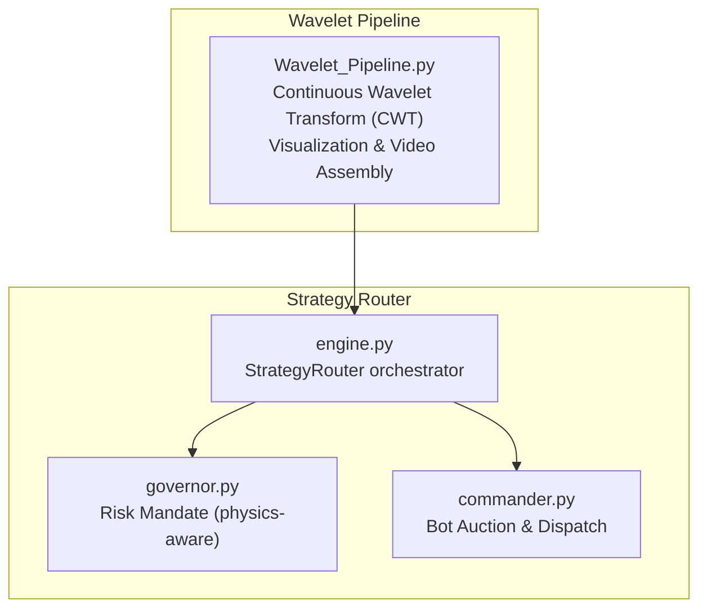
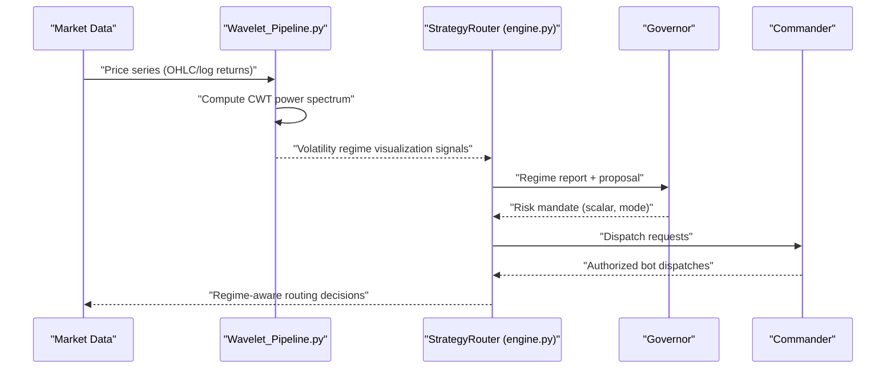
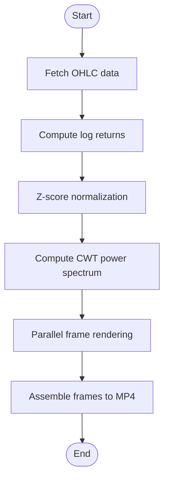
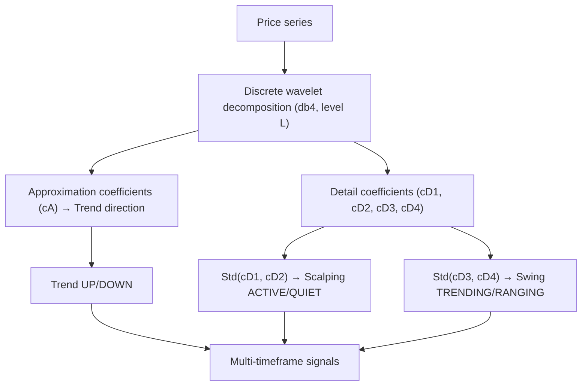
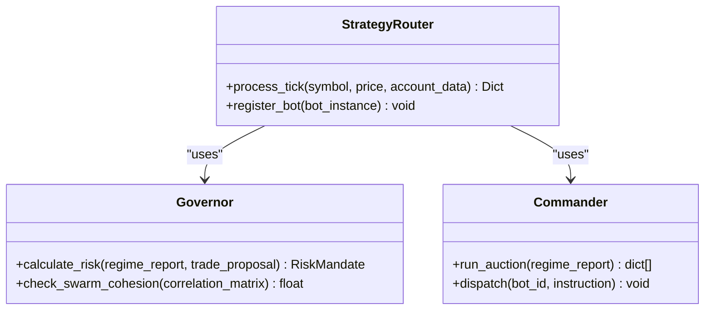
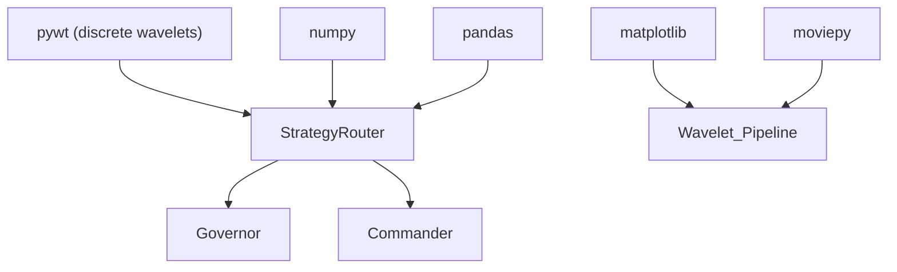

# Wavelet Multi-Timeframe Analysis

<cite>
**Referenced Files in This Document**
- [Wavelet_Pipeline.py](file://quant-traderr-lab/Wavelet Transform/Wavelet_Pipeline.py)
- [ECONOPHYSICS_INTEGRATION.md](file://docs/ECONOPHYSICS_INTEGRATION.md)
- [engine.py](file://src/router/engine.py)
- [governor.py](file://src/router/governor.py)
- [commander.py](file://src/router/commander.py)
</cite>

## Table of Contents
1. [Introduction](#introduction)
2. [Project Structure](#project-structure)
3. [Core Components](#core-components)
4. [Architecture Overview](#architecture-overview)
5. [Detailed Component Analysis](#detailed-component-analysis)
6. [Dependency Analysis](#dependency-analysis)
7. [Performance Considerations](#performance-considerations)
8. [Troubleshooting Guide](#troubleshooting-guide)
9. [Conclusion](#conclusion)
10. [Appendices](#appendices)

## Introduction
This document explains how Wavelet Transform integrates with the Strategy Router to enable multi-timeframe analysis for automated trading. It covers how discrete wavelet decomposition separates a price series into distinct frequency bands—short-term noise, medium-term swings, and long-term trends—enabling simultaneous regime detection across timeframes. The guide details the db4 discrete wavelet transform usage, coefficient interpretation, automated regime classification via wavelet variance, and operational considerations for production systems.

## Project Structure
Wavelet multi-timeframe analysis spans two primary areas:
- A reusable wavelet pipeline for continuous wavelet transforms and volatility regime visualization
- Strategy Router integration points for multi-timeframe signal generation and regime-aware dispatch

**Diagram sources**
- [Wavelet_Pipeline.py](file://quant-traderr-lab/Wavelet Transform/Wavelet_Pipeline.py#L1-L352)
- [engine.py](file://src/router/engine.py#L1-L68)
- [governor.py](file://src/router/governor.py#L1-L62)
- [commander.py](file://src/router/commander.py#L1-L56)

**Section sources**
- [Wavelet_Pipeline.py](file://quant-traderr-lab/Wavelet Transform/Wavelet_Pipeline.py#L1-L352)
- [engine.py](file://src/router/engine.py#L1-L68)
- [governor.py](file://src/router/governor.py#L1-L62)
- [commander.py](file://src/router/commander.py#L1-L56)

## Core Components
- Wavelet Pipeline: Implements Continuous Wavelet Transform (CWT) using the Morlet wavelet to compute a time-frequency power spectrum, visualizes volatility regimes, and compiles animated videos.
- Strategy Router: Coordinates observation, governance, and dispatch; can incorporate multi-timeframe insights from wavelet analysis to inform regime classification and bot allocation.

Key integration points:
- Discrete wavelet decomposition for multi-timeframe analysis
- Trend direction inference from approximation coefficients
- Scalping and swing regime classification via wavelet variance thresholds
- Production-grade rendering and compilation pipeline

**Section sources**
- [Wavelet_Pipeline.py](file://quant-traderr-lab/Wavelet Transform/Wavelet_Pipeline.py#L88-L134)
- [engine.py](file://src/router/engine.py#L16-L68)
- [ECONOPHYSICS_INTEGRATION.md](file://docs/ECONOPHYSICS_INTEGRATION.md#L424-L449)

## Architecture Overview
The wavelet-based multi-timeframe analysis feeds the Strategy Router with coherent regime signals. The Router’s Sentinel observes market physics, the Governor applies risk mandates, and the Commander dispatches bots accordingly.

**Diagram sources**
- [Wavelet_Pipeline.py](file://quant-traderr-lab/Wavelet Transform/Wavelet_Pipeline.py#L88-L134)
- [engine.py](file://src/router/engine.py#L29-L60)
- [governor.py](file://src/router/governor.py#L24-L54)
- [commander.py](file://src/router/commander.py#L19-L38)

## Detailed Component Analysis

### Wavelet Pipeline: Continuous Wavelet Transform (CWT)
The pipeline computes the Continuous Wavelet Transform of log returns using the complex Morlet wavelet, producing a power spectrum that highlights volatility clustering across time and frequency. It supports:
- Data acquisition and preprocessing
- CWT computation and power normalization
- Parallelized frame rendering with a Bloomberg-style theme
- Video assembly with a final frame hold

**Diagram sources**
- [Wavelet_Pipeline.py](file://quant-traderr-lab/Wavelet Transform/Wavelet_Pipeline.py#L88-L134)
- [Wavelet_Pipeline.py](file://quant-traderr-lab/Wavelet Transform/Wavelet_Pipeline.py#L137-L288)
- [Wavelet_Pipeline.py](file://quant-traderr-lab/Wavelet Transform/Wavelet_Pipeline.py#L293-L331)

Implementation highlights:
- Uses complex Morlet wavelets for time-frequency localization
- Applies dynamic axis scaling and consistent colormap for visualization
- Supports parallel rendering and graceful fallback to serial processing

Practical usage:
- Visualize volatility regimes over extended horizons
- Identify clustering of high-variance periods across multiple frequencies

**Section sources**
- [Wavelet_Pipeline.py](file://quant-traderr-lab/Wavelet Transform/Wavelet_Pipeline.py#L88-L134)
- [Wavelet_Pipeline.py](file://quant-traderr-lab/Wavelet Transform/Wavelet_Pipeline.py#L137-L288)
- [Wavelet_Pipeline.py](file://quant-traderr-lab/Wavelet Transform/Wavelet_Pipeline.py#L293-L331)

### Strategy Router Integration: Multi-Timeframe Signal Generation
The Strategy Router can leverage discrete wavelet decomposition to classify regimes across multiple timeframes:
- Approximation coefficients capture long-term trend
- Detail coefficients capture mid- and short-term components
- Variance thresholds classify scalping and swing regimes

**Diagram sources**
- [ECONOPHYSICS_INTEGRATION.md](file://docs/ECONOPHYSICS_INTEGRATION.md#L427-L449)

Integration specifics:
- Trend direction inferred from recent approximation coefficients
- Scalping regime determined by high variance in the highest detail band
- Swing regime determined by variance in the penultimate detail bands
- Thresholds are configurable and can be tuned per market or instrument

**Section sources**
- [ECONOPHYSICS_INTEGRATION.md](file://docs/ECONOPHYSICS_INTEGRATION.md#L424-L449)

### Strategy Router Orchestration and Dispatch
The Router coordinates observations, risk governance, and bot dispatch. While wavelet analysis informs regime classification, the Router’s Governor and Commander apply risk constraints and select eligible bots.

**Diagram sources**
- [engine.py](file://src/router/engine.py#L16-L68)
- [governor.py](file://src/router/governor.py#L16-L62)
- [commander.py](file://src/router/commander.py#L11-L56)

Operational behavior:
- The Router aggregates signals (including wavelet-derived regimes) and computes a risk mandate
- Bots are selected for dispatch based on regime eligibility and performance ranking
- Risk mode and allocation scalar are applied to constrain exposure during volatile or systemic conditions

**Section sources**
- [engine.py](file://src/router/engine.py#L29-L60)
- [governor.py](file://src/router/governor.py#L24-L54)
- [commander.py](file://src/router/commander.py#L19-L38)

## Dependency Analysis
Wavelet multi-timeframe analysis relies on:
- Numerical libraries for signal processing and visualization
- Rendering and video composition for output generation
- Router orchestration for production deployment

**Diagram sources**
- [Wavelet_Pipeline.py](file://quant-traderr-lab/Wavelet Transform/Wavelet_Pipeline.py#L33-L46)
- [engine.py](file://src/router/engine.py#L10-L14)

**Section sources**
- [Wavelet_Pipeline.py](file://quant-traderr-lab/Wavelet Transform/Wavelet_Pipeline.py#L33-L46)
- [engine.py](file://src/router/engine.py#L10-L14)

## Performance Considerations
- Computational complexity:
  - Continuous wavelet transform scales with the number of time points and scales; choose width ranges appropriate to the dataset length
  - Discrete wavelet packet or stationary transform can reduce boundary effects for multi-timeframe analysis
- Memory and I/O:
  - Batch processing and chunked rendering improve throughput for long histories
  - Parallel rendering reduces wall-clock time; fallback to serial avoids resource contention
- Real-time processing:
  - Maintain rolling buffers for incoming ticks and incremental updates to wavelet statistics
  - Use efficient downsampling for visualization frames while preserving key volatility clusters
- Parameter selection:
  - Wavelet basis: db4 offers good balance of smoothness and vanishing moments for financial signals
  - Decomposition level: choose depth to align with target timeframes (e.g., level 4 captures multiple swing scales)
  - Variance thresholds: calibrate per instrument and market regime using historical backtests

[No sources needed since this section provides general guidance]

## Troubleshooting Guide
Common issues and remedies:
- Empty or insufficient data:
  - Ensure sufficient history for CWT width range and rolling windows
  - Validate data alignment between price and transformed domains
- Rendering failures:
  - Verify temporary directory permissions and disk space
  - Confirm MoviePy compatibility and handle fallbacks gracefully
- Inconsistent regime signals:
  - Tune variance thresholds for scalping/swing regimes
  - Validate decomposition level and wavelet choice for the instrument
- Router throttling:
  - Review chaos and systemic risk triggers; adjust thresholds in the Governor
  - Confirm bot eligibility under high-churn regimes

**Section sources**
- [Wavelet_Pipeline.py](file://quant-traderr-lab/Wavelet Transform/Wavelet_Pipeline.py#L131-L134)
- [Wavelet_Pipeline.py](file://quant-traderr-lab/Wavelet Transform/Wavelet_Pipeline.py#L272-L286)
- [governor.py](file://src/router/governor.py#L37-L52)

## Conclusion
Wavelet multi-timeframe analysis provides a robust foundation for understanding market regimes across scales. By combining continuous wavelet transforms for volatility visualization and discrete wavelet decomposition for regime classification, the Strategy Router can make informed, physics-aware decisions. Proper parameter tuning, real-time processing strategies, and disciplined risk governance ensure reliable operation in production trading environments.

[No sources needed since this section summarizes without analyzing specific files]

## Appendices

### Practical Examples
- Decompose price series into approximation and detail coefficients to infer trend direction and detect volatility spikes
- Classify scalping regimes by measuring variance in the highest detail band; classify swing regimes via variance in coarser detail bands
- Combine wavelet insights with other econophysical signals (e.g., chaos, systemic risk) for enhanced dispatch decisions

[No sources needed since this section provides general guidance]