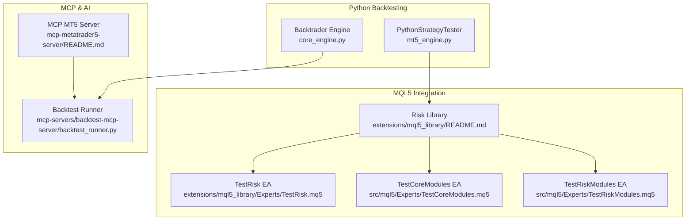
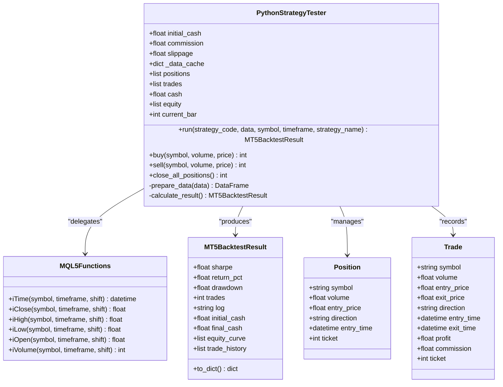
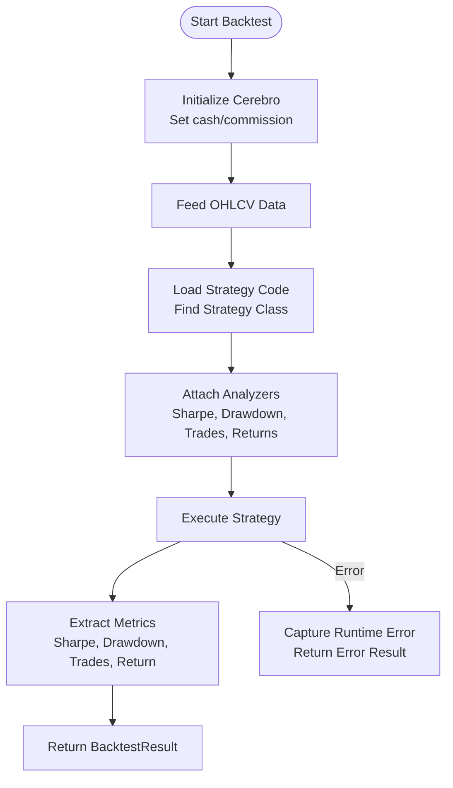
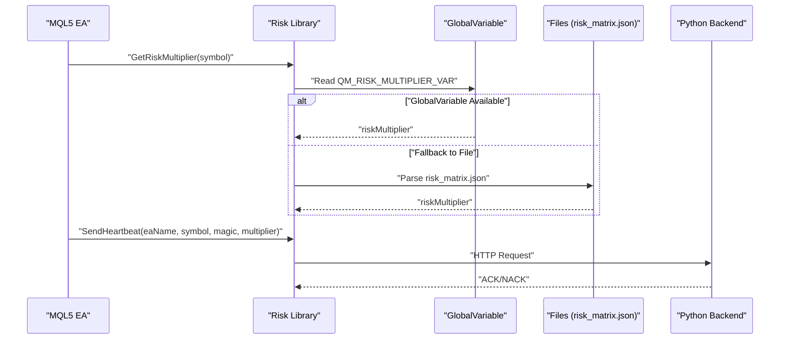
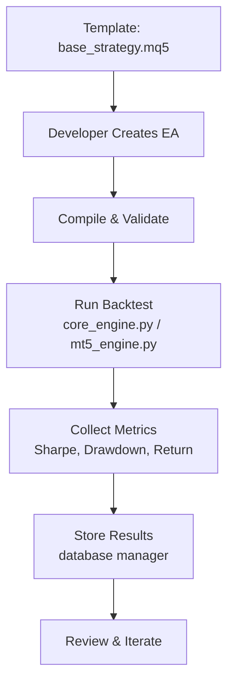
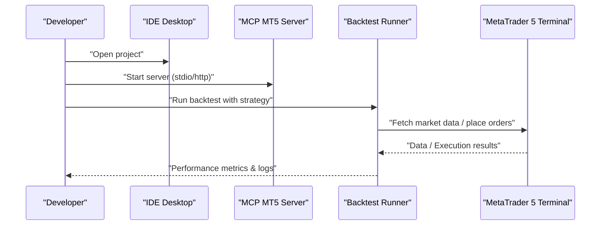
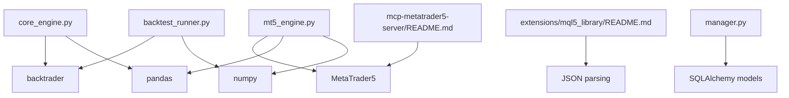

# Backtesting and Development

<cite>
**Referenced Files in This Document**
- [core_engine.py](file://src/backtesting/core_engine.py)
- [mt5_engine.py](file://src/backtesting/mt5_engine.py)
- [README.md](file://extensions/mql5_library/README.md)
- [README.md](file://mcp-metatrader5-server/README.md)
- [README.md](file://quantmind-ide-desktop/README.md)
- [base_strategy.mq5](file://data/assets/templates/base_strategy.mq5)
- [coding_standards.md](file://data/assets/coding_standards.md)
- [TestCoreModules.mq5](file://src/mql5/Experts/TestCoreModules.mq5)
- [TestRiskModules.mq5](file://src/mql5/Experts/TestRiskModules.mq5)
- [TestRisk.mq5](file://extensions/mql5_library/Experts/TestRisk.mq5)
- [run_backtest.yaml](file://data/assets/skills/run_backtest.yaml)
- [backtest_runner.py](file://mcp-servers/backtest-mcp-server/backtest_runner.py)
- [test_backtest_execution.py](file://mcp-servers/backtest-mcp-server/tests/test_backtest_execution.py)
- [test_mt5_engine.py](file://tests/backtesting/test_mt5_engine.py)
- [manager.py](file://src/database/manager.py)
- [test_new_models.py](file://tests/database/test_new_models.py)
- [test_risk_models.py](file://tests/test_risk_models.py)
</cite>

## Table of Contents
1. [Introduction](#introduction)
2. [Project Structure](#project-structure)
3. [Core Components](#core-components)
4. [Architecture Overview](#architecture-overview)
5. [Detailed Component Analysis](#detailed-component-analysis)
6. [Dependency Analysis](#dependency-analysis)
7. [Performance Considerations](#performance-considerations)
8. [Troubleshooting Guide](#troubleshooting-guide)
9. [Conclusion](#conclusion)
10. [Appendices](#appendices)

## Introduction
This document covers the Backtesting and Development capabilities of the QuantMindX system with a focus on:
- MT5-compatible backtesting engine supporting MQL5 built-in function overloads and Python-based strategy testing
- Strategy repository system with templates, code generation, and version control integration
- Development tools including the IDE desktop application, scripting utilities, and testing frameworks
- MQL5 library integration for expert advisor development and risk management
- Development environment setup, debugging tools, and quality assurance processes
- Practical examples of strategy development, testing procedures, and deployment workflows

## Project Structure
The repository organizes backtesting and development assets across multiple modules:
- Backtesting engines (Python-based and MT5-compatible)
- MQL5 library and test EAs for risk management and core modules
- Strategy templates and coding standards
- MCP servers for MetaTrader 5 integration and AI-assisted development
- IDE desktop application for local development
- Tests validating performance metrics and engine behavior

```mermaid
graph TB
subgraph "Backtesting Engines"
CE["core_engine.py"]
MT5["mt5_engine.py"]
end
subgraph "MQL5 Library & EAs"
LIB["extensions/mql5_library/README.md"]
TR["extensions/mql5_library/Experts/TestRisk.mq5"]
TCORE["src/mql5/Experts/TestCoreModules.mq5"]
TRISK["src/mql5/Experts/TestRiskModules.mq5"]
end
subgraph "Strategy Assets"
TPL["data/assets/templates/base_strategy.mq5"]
CS["data/assets/coding_standards.md"]
RB["data/assets/skills/run_backtest.yaml"]
end
subgraph "MCP Servers"
MCP["mcp-metatrader5-server/README.md"]
BTR["mcp-servers/backtest-mcp-server/backtest_runner.py"]
end
subgraph "IDE"
IDE["quantmind-ide-desktop/README.md"]
end
CE --> MT5
MT5 --> LIB
LIB --> TR
LIB --> TCORE
LIB --> TRISK
TPL --> CS
RB --> BTR
MCP --> BTR
IDE --> MCP
```

**Diagram sources**
- [core_engine.py](file://src/backtesting/core_engine.py#L1-L83)
- [mt5_engine.py](file://src/backtesting/mt5_engine.py#L1-L991)
- [README.md](file://extensions/mql5_library/README.md#L1-L297)
- [TestRisk.mq5](file://extensions/mql5_library/Experts/TestRisk.mq5#L1-L340)
- [TestCoreModules.mq5](file://src/mql5/Experts/TestCoreModules.mq5#L1-L266)
- [TestRiskModules.mq5](file://src/mql5/Experts/TestRiskModules.mq5#L1-L303)
- [base_strategy.mq5](file://data/assets/templates/base_strategy.mq5#L1-L45)
- [coding_standards.md](file://data/assets/coding_standards.md#L1-L16)
- [run_backtest.yaml](file://data/assets/skills/run_backtest.yaml#L1-L18)
- [README.md](file://mcp-metatrader5-server/README.md#L1-L311)
- [backtest_runner.py](file://mcp-servers/backtest-mcp-server/backtest_runner.py#L347-L466)
- [README.md](file://quantmind-ide-desktop/README.md#L1-L8)

**Section sources**
- [core_engine.py](file://src/backtesting/core_engine.py#L1-L83)
- [mt5_engine.py](file://src/backtesting/mt5_engine.py#L1-L991)
- [README.md](file://extensions/mql5_library/README.md#L1-L297)
- [README.md](file://mcp-metatrader5-server/README.md#L1-L311)
- [README.md](file://quantmind-ide-desktop/README.md#L1-L8)
- [base_strategy.mq5](file://data/assets/templates/base_strategy.mq5#L1-L45)
- [coding_standards.md](file://data/assets/coding_standards.md#L1-L16)
- [run_backtest.yaml](file://data/assets/skills/run_backtest.yaml#L1-L18)
- [backtest_runner.py](file://mcp-servers/backtest-mcp-server/backtest_runner.py#L347-L466)

## Core Components
- Python Backtest Engine (Backtrader-based): Executes dynamic Python strategies, feeds OHLCV data, and computes performance metrics including Sharpe ratio, drawdown, total return, and trade counts. It captures strategy logs and handles runtime errors gracefully.
- MT5-Compatible Backtest Engine: Provides MQL5 built-in function overloads (iTime, iClose, iHigh, iLow, iOpen, iVolume), simulates trading operations (buy/sell/close_all), and calculates performance metrics. It integrates with the MetaTrader5 Python package for live data retrieval and supports configurable parameters (initial cash, commission, slippage).
- MQL5 Risk Management Library: Bridges Python risk governance with MQL5 Expert Advisors. Includes functions to retrieve risk multipliers from GlobalVariables or JSON files, send heartbeats, and validate data freshness.
- Strategy Templates and Coding Standards: Provides a base MQL5 template and coding guidelines ensuring strict compilation, risk management, and standardized input parameters.
- MCP MetaTrader 5 Server: Enables AI-assisted development by exposing MT5 connectivity and trading functions via MCP, with stdio and HTTP transports for integration with Claude Desktop and other clients.
- IDE Desktop Application: A Tauri + React + TypeScript application scaffolded for local development with recommended VS Code extensions.

**Section sources**
- [core_engine.py](file://src/backtesting/core_engine.py#L1-L83)
- [mt5_engine.py](file://src/backtesting/mt5_engine.py#L1-L991)
- [README.md](file://extensions/mql5_library/README.md#L1-L297)
- [base_strategy.mq5](file://data/assets/templates/base_strategy.mq5#L1-L45)
- [coding_standards.md](file://data/assets/coding_standards.md#L1-L16)
- [README.md](file://mcp-metatrader5-server/README.md#L1-L311)
- [README.md](file://quantmind-ide-desktop/README.md#L1-L8)

## Architecture Overview
The backtesting and development architecture combines Python-based engines with MQL5 libraries and MCP servers to support expert advisor development and testing.



**Diagram sources**
- [mt5_engine.py](file://src/backtesting/mt5_engine.py#L320-L782)
- [core_engine.py](file://src/backtesting/core_engine.py#L13-L83)
- [README.md](file://extensions/mql5_library/README.md#L1-L297)
- [TestRisk.mq5](file://extensions/mql5_library/Experts/TestRisk.mq5#L1-L340)
- [TestCoreModules.mq5](file://src/mql5/Experts/TestCoreModules.mq5#L1-L266)
- [TestRiskModules.mq5](file://src/mql5/Experts/TestRiskModules.mq5#L1-L303)
- [README.md](file://mcp-metatrader5-server/README.md#L1-L311)
- [backtest_runner.py](file://mcp-servers/backtest-mcp-server/backtest_runner.py#L347-L466)

## Detailed Component Analysis

### MT5-Compatible Backtesting Engine
The MT5 engine simulates an MQL5 environment in Python, enabling strategies written in MQL5-style logic to be executed locally. It provides:
- MQL5 built-in function overloads for historical data access
- Trading operations (buy/sell/close_all) with slippage and commission modeling
- Performance metrics calculation (Sharpe, drawdown, return)
- Optional live data retrieval via the MetaTrader5 Python package



**Diagram sources**
- [mt5_engine.py](file://src/backtesting/mt5_engine.py#L320-L782)
- [mt5_engine.py](file://src/backtesting/mt5_engine.py#L89-L148)

**Section sources**
- [mt5_engine.py](file://src/backtesting/mt5_engine.py#L320-L782)
- [mt5_engine.py](file://src/backtesting/mt5_engine.py#L89-L148)

### Python Backtest Engine (Backtrader)
The Python engine dynamically executes strategy code against OHLCV data, computes performance metrics, and captures logs. It ensures sandboxing considerations and graceful error handling.



**Diagram sources**
- [core_engine.py](file://src/backtesting/core_engine.py#L13-L83)

**Section sources**
- [core_engine.py](file://src/backtesting/core_engine.py#L13-L83)

### MQL5 Risk Management Library
The library synchronizes risk governance between Python agents and MQL5 EAs. It retrieves risk multipliers from GlobalVariables or JSON files, validates freshness, and sends heartbeats to the Python backend.



**Diagram sources**
- [README.md](file://extensions/mql5_library/README.md#L84-L178)
- [TestRisk.mq5](file://extensions/mql5_library/Experts/TestRisk.mq5#L118-L236)

**Section sources**
- [README.md](file://extensions/mql5_library/README.md#L84-L178)
- [TestRisk.mq5](file://extensions/mql5_library/Experts/TestRisk.mq5#L118-L236)

### Strategy Repository System
The repository includes:
- Template management: A base MQL5 strategy template with input parameters and basic structure
- Coding standards: Guidelines for MQL5 compilation, risk management, and Python backtesting
- Skill definition: A skill YAML describing how to run backtests with inputs and outputs



**Diagram sources**
- [base_strategy.mq5](file://data/assets/templates/base_strategy.mq5#L1-L45)
- [coding_standards.md](file://data/assets/coding_standards.md#L1-L16)
- [run_backtest.yaml](file://data/assets/skills/run_backtest.yaml#L1-L18)
- [manager.py](file://src/database/manager.py#L561-L599)

**Section sources**
- [base_strategy.mq5](file://data/assets/templates/base_strategy.mq5#L1-L45)
- [coding_standards.md](file://data/assets/coding_standards.md#L1-L16)
- [run_backtest.yaml](file://data/assets/skills/run_backtest.yaml#L1-L18)
- [manager.py](file://src/database/manager.py#L561-L599)

### Development Tools and Testing Framework
- MCP MetaTrader 5 Server: Provides stdio and HTTP transports, API reference for connection, market data, and trading functions, and example workflows for connecting, retrieving data, and placing trades.
- Backtest Runner (MCP server): Executes Python strategies, extracts metrics (Sharpe, drawdown, win rate, profit factor), and supports vectorized metric calculation.
- IDE Desktop: Scaffolded Tauri + React + TypeScript application with recommended VS Code extensions for Rust and Tauri development.



**Diagram sources**
- [README.md](file://mcp-metatrader5-server/README.md#L43-L232)
- [backtest_runner.py](file://mcp-servers/backtest-mcp-server/backtest_runner.py#L347-L466)
- [README.md](file://quantmind-ide-desktop/README.md#L1-L8)

**Section sources**
- [README.md](file://mcp-metatrader5-server/README.md#L43-L232)
- [backtest_runner.py](file://mcp-servers/backtest-mcp-server/backtest_runner.py#L347-L466)
- [README.md](file://quantmind-ide-desktop/README.md#L1-L8)

## Dependency Analysis
Key dependencies and relationships:
- Python backtesting engines depend on pandas, numpy, and backtrader for data processing and strategy execution
- MT5 engine depends on MetaTrader5 Python package for live data retrieval and optional terminal integration
- MQL5 library depends on MQL5 include paths and JSON file parsing for risk parameter distribution
- MCP servers provide abstractions for MT5 connectivity and backtest orchestration
- Database manager persists strategy performance metrics for later analysis



**Diagram sources**
- [core_engine.py](file://src/backtesting/core_engine.py#L1-L83)
- [mt5_engine.py](file://src/backtesting/mt5_engine.py#L17-L31)
- [README.md](file://extensions/mql5_library/README.md#L179-L201)
- [README.md](file://mcp-metatrader5-server/README.md#L1-L311)
- [backtest_runner.py](file://mcp-servers/backtest-mcp-server/backtest_runner.py#L347-L466)
- [manager.py](file://src/database/manager.py#L561-L599)

**Section sources**
- [core_engine.py](file://src/backtesting/core_engine.py#L1-L83)
- [mt5_engine.py](file://src/backtesting/mt5_engine.py#L17-L31)
- [README.md](file://extensions/mql5_library/README.md#L179-L201)
- [README.md](file://mcp-metatrader5-server/README.md#L1-L311)
- [backtest_runner.py](file://mcp-servers/backtest-mcp-server/backtest_runner.py#L347-L466)
- [manager.py](file://src/database/manager.py#L561-L599)

## Performance Considerations
- Vectorized metrics calculation: The backtest runner includes an optimized vectorized method for computing Sharpe ratios and trade statistics using NumPy arrays to improve performance on large datasets.
- Equity and drawdown tracking: The MT5 engine maintains equity curves and calculates maximum drawdown during simulation to mirror real-world risk assessment.
- Data preparation: Proper handling of datetime indices and frequency conversion ensures accurate time-series processing for both engines.

[No sources needed since this section provides general guidance]

## Troubleshooting Guide
Common issues and resolutions:
- MetaTrader5 package unavailable: The MT5 engine logs warnings when the MetaTrader5 package is not installed and disables live data features.
- Strategy compilation errors: Ensure MQL5 code compiles with zero warnings and includes required input parameters and risk management (stop-loss and take-profit).
- Risk data freshness: If risk multipliers appear stale, verify timestamps in the JSON file and ensure the Python backend writes fresh data.
- Heartbeat failures: Confirm the Python backend is running and the URL is whitelisted in MetaTrader 5 Expert Advisors settings.

**Section sources**
- [mt5_engine.py](file://src/backtesting/mt5_engine.py#L24-L31)
- [coding_standards.md](file://data/assets/coding_standards.md#L8-L12)
- [README.md](file://extensions/mql5_library/README.md#L264-L284)

## Conclusion
The QuantMindX system provides a comprehensive backtesting and development environment combining Python-based engines with MQL5 libraries and MCP servers. Developers can leverage MT5-compatible backtesting, risk management integration, and structured strategy templates to build, test, and deploy expert advisors efficiently. Quality assurance is supported by tests validating performance metrics and engine behavior, while the IDE and MCP server streamline development and AI-assisted workflows.

[No sources needed since this section summarizes without analyzing specific files]

## Appendices

### Practical Examples

- Strategy Development with MQL5 Template
  - Use the base strategy template to define inputs and entry logic, then compile and attach to a chart for testing.
  - Follow coding standards to ensure strict compilation and risk management.

- Running Backtests with Python Engines
  - Prepare OHLCV data as a pandas DataFrame with a datetime index.
  - Execute strategies using either the Backtrader-based engine or the MT5-compatible engine.
  - Collect and review performance metrics (Sharpe, drawdown, return) and logs.

- Expert Advisor Development Workflow
  - Develop logic in MQL5, integrate the risk management library for dynamic risk multipliers, and validate with dedicated test EAs.
  - Use MCP MT5 server to connect to the terminal, retrieve market data, and place trades programmatically.

- Deployment and Monitoring
  - Persist strategy performance metrics using the database manager.
  - Monitor EA health via heartbeats and adjust risk parameters dynamically.

**Section sources**
- [base_strategy.mq5](file://data/assets/templates/base_strategy.mq5#L1-L45)
- [coding_standards.md](file://data/assets/coding_standards.md#L8-L12)
- [README.md](file://extensions/mql5_library/README.md#L1-L297)
- [README.md](file://mcp-metatrader5-server/README.md#L185-L232)
- [manager.py](file://src/database/manager.py#L561-L599)