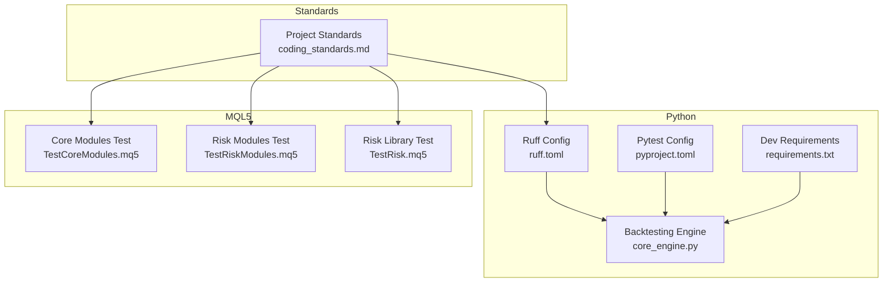
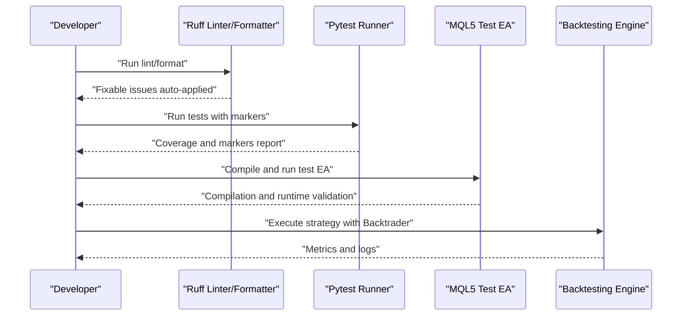
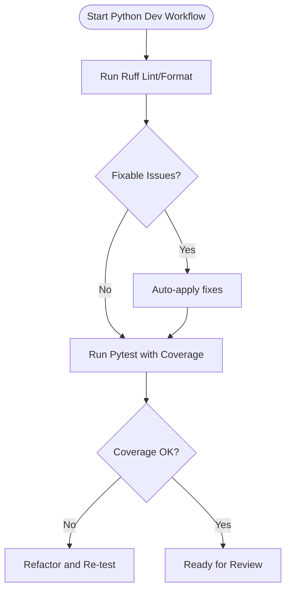
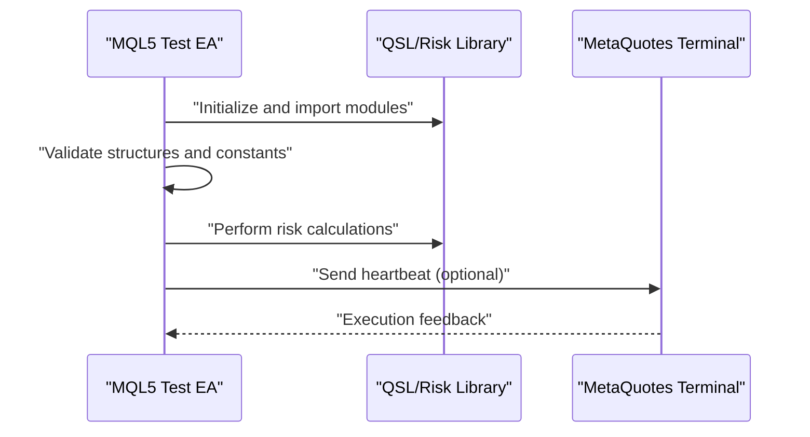
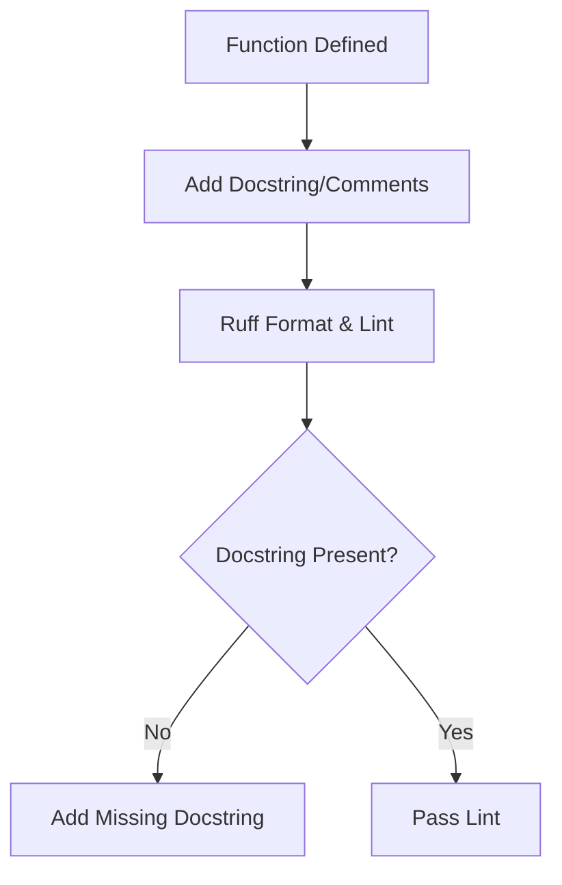
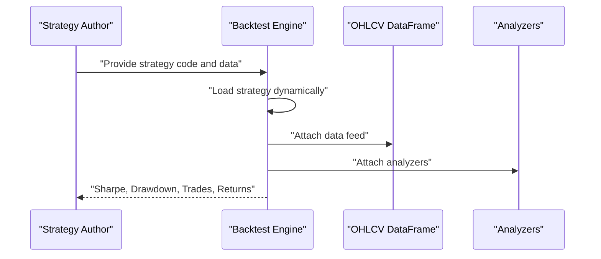
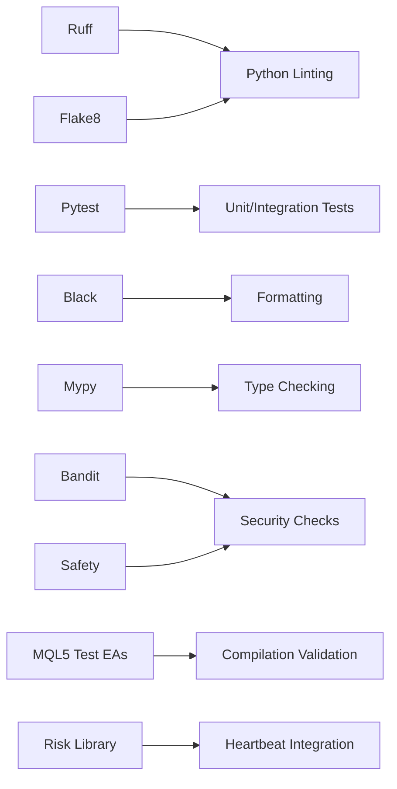

# Coding Standards

<cite>
**Referenced Files in This Document**
- [coding_standards.md](file://data/assets/coding_standards.md)
- [ruff.toml](file://mcp-metatrader5-server/ruff.toml)
- [pyproject.toml](file://mcp-metatrader5-server/pyproject.toml)
- [requirements.txt](file://docker/strategy-agent/requirements.txt)
- [TestCoreModules.mq5](file://src/mql5/Experts/TestCoreModules.mq5)
- [TestRiskModules.mq5](file://src/mql5/Experts/TestRiskModules.mq5)
- [TestRisk.mq5](file://extensions/mql5_library/Experts/TestRisk.mq5)
- [core_engine.py](file://src/backtesting/core_engine.py)
- [coding.py](file://src/agents/skills/coding.py)
- [test_json_parsing.py](file://tests/mql5/test_json_parsing.py)
</cite>

## Table of Contents
1. [Introduction](#introduction)
2. [Project Structure](#project-structure)
3. [Core Components](#core-components)
4. [Architecture Overview](#architecture-overview)
5. [Detailed Component Analysis](#detailed-component-analysis)
6. [Dependency Analysis](#dependency-analysis)
7. [Performance Considerations](#performance-considerations)
8. [Troubleshooting Guide](#troubleshooting-guide)
9. [Conclusion](#conclusion)
10. [Appendices](#appendices)

## Introduction
This document defines the official Coding Standards and Best Practices for the project, covering:
- Python coding standards aligned with PEP 8 and enforced via linters/formatters
- Import organization and naming conventions
- MQL5 coding standards for Expert Advisor development
- Documentation standards for docstrings, inline comments, and API documentation
- Code review guidelines, pull request workflows, and quality assurance processes
- Practical examples of proper formatting and structure patterns
- Anti-patterns to avoid
- Integration with development tools and automated linting

These standards apply across Python backtesting, MQL5 libraries and EAs, and supporting tooling.

## Project Structure
The repository includes dedicated standards and tooling for both Python and MQL5:
- Python standards and tooling are configured via Ruff and Pytest in the MCP MetaTrader 5 server package
- MQL5 standards are reflected in test EAs and library modules that enforce strict compilation and documented behavior
- Backtesting harness uses Backtrader and expects typed, documented Python code

**Diagram sources**
- [coding_standards.md](file://data/assets/coding_standards.md#L1-L16)
- [ruff.toml](file://mcp-metatrader5-server/ruff.toml#L1-L68)
- [pyproject.toml](file://mcp-metatrader5-server/pyproject.toml#L59-L76)
- [requirements.txt](file://docker/strategy-agent/requirements.txt#L26-L40)
- [core_engine.py](file://src/backtesting/core_engine.py#L1-L83)
- [TestCoreModules.mq5](file://src/mql5/Experts/TestCoreModules.mq5#L1-L266)
- [TestRiskModules.mq5](file://src/mql5/Experts/TestRiskModules.mq5#L1-L303)
- [TestRisk.mq5](file://extensions/mql5_library/Experts/TestRisk.mq5#L1-L340)

**Section sources**
- [coding_standards.md](file://data/assets/coding_standards.md#L1-L16)
- [ruff.toml](file://mcp-metatrader5-server/ruff.toml#L1-L68)
- [pyproject.toml](file://mcp-metatrader5-server/pyproject.toml#L59-L76)
- [requirements.txt](file://docker/strategy-agent/requirements.txt#L26-L40)
- [core_engine.py](file://src/backtesting/core_engine.py#L1-L83)
- [TestCoreModules.mq5](file://src/mql5/Experts/TestCoreModules.mq5#L1-L266)
- [TestRiskModules.mq5](file://src/mql5/Experts/TestRiskModules.mq5#L1-L303)
- [TestRisk.mq5](file://extensions/mql5_library/Experts/TestRisk.mq5#L1-L340)

## Core Components
- Python standards and enforcement:
  - Linting and formatting via Ruff with PEP 8–aligned rules, line length limits, and docstring formatting
  - Type hints required for all Python code
  - Docstrings mandatory for all functions
  - Pytest configuration with coverage and markers for unit/integration tests
  - Development dependencies for black, flake8, mypy, bandit, and safety included in requirements
- MQL5 standards and enforcement:
  - Strict compilation required (no warnings)
  - Risk management: every order must include stop-loss and take-profit
  - Strategy parameters must be declared as input variables
  - Comprehensive test EAs validate module compilation and runtime behavior
- Documentation standards:
  - Python: docstrings required; Ruff formats docstrings and enforces line lengths
  - MQL5: inline comments and structured documentation comments are validated by tests

**Section sources**
- [coding_standards.md](file://data/assets/coding_standards.md#L3-L16)
- [ruff.toml](file://mcp-metatrader5-server/ruff.toml#L24-L68)
- [pyproject.toml](file://mcp-metatrader5-server/pyproject.toml#L59-L76)
- [requirements.txt](file://docker/strategy-agent/requirements.txt#L26-L40)
- [TestCoreModules.mq5](file://src/mql5/Experts/TestCoreModules.mq5#L10-L13)
- [TestRiskModules.mq5](file://src/mql5/Experts/TestRiskModules.mq5#L10-L12)
- [TestRisk.mq5](file://extensions/mql5_library/Experts/TestRisk.mq5#L10-L12)
- [test_json_parsing.py](file://tests/mql5/test_json_parsing.py#L138-L147)

## Architecture Overview
The standards are integrated into the development lifecycle through:
- Pre-commit and CI checks using Ruff and Pytest
- MQL5 compilation and runtime validation via dedicated test EAs
- Backtesting harness enforcing typed, documented Python strategies

**Diagram sources**
- [ruff.toml](file://mcp-metatrader5-server/ruff.toml#L48-L50)
- [pyproject.toml](file://mcp-metatrader5-server/pyproject.toml#L59-L76)
- [TestCoreModules.mq5](file://src/mql5/Experts/TestCoreModules.mq5#L35-L186)
- [TestRiskModules.mq5](file://src/mql5/Experts/TestRiskModules.mq5#L41-L178)
- [core_engine.py](file://src/backtesting/core_engine.py#L18-L83)

## Detailed Component Analysis

### Python Coding Standards and Tooling
- PEP 8 alignment:
  - Line length 100; docstring formatting and line length enforcement
  - Imports sorted with isort; comprehensions and simplifications encouraged
- Type hints:
  - Required for all Python code as per project standards
- Docstrings:
  - Mandatory for all functions; Ruff formats docstrings consistently
- Linting and formatting:
  - Ruff selected rules include E/W/F/I/N/UP/B/C4/SIM/RUF; ignores select rules intentionally
  - Autofix enabled for all fixable rules
- Testing:
  - Pytest configured with coverage, markers for unit/integration tests, and strict markers
- Security and quality:
  - Development requirements include black, flake8, mypy, bandit, and safety

**Diagram sources**
- [ruff.toml](file://mcp-metatrader5-server/ruff.toml#L24-L50)
- [pyproject.toml](file://mcp-metatrader5-server/pyproject.toml#L59-L76)
- [requirements.txt](file://docker/strategy-agent/requirements.txt#L32-L40)

**Section sources**
- [coding_standards.md](file://data/assets/coding_standards.md#L5-L6)
- [ruff.toml](file://mcp-metatrader5-server/ruff.toml#L18-L68)
- [pyproject.toml](file://mcp-metatrader5-server/pyproject.toml#L59-L76)
- [requirements.txt](file://docker/strategy-agent/requirements.txt#L32-L40)

### MQL5 Coding Standards and Patterns
- Strict compilation:
  - Test EAs enable strict mode and validate compilation of core and risk modules
- Risk management:
  - Every order must include stop-loss and take-profit
- Parameterization:
  - Strategy parameters are declared as input variables
- Documentation and comments:
  - Inline comments and structured documentation comments are validated by tests
- Test-driven validation:
  - TestCoreModules validates module imports and structures
  - TestRiskModules validates risk calculations and status reporting
  - TestRisk validates fast-path, fallback path, and heartbeat integration

**Diagram sources**
- [TestCoreModules.mq5](file://src/mql5/Experts/TestCoreModules.mq5#L10-L13)
- [TestRiskModules.mq5](file://src/mql5/Experts/TestRiskModules.mq5#L10-L12)
- [TestRisk.mq5](file://extensions/mql5_library/Experts/TestRisk.mq5#L10-L12)

**Section sources**
- [coding_standards.md](file://data/assets/coding_standards.md#L8-L12)
- [TestCoreModules.mq5](file://src/mql5/Experts/TestCoreModules.mq5#L10-L13)
- [TestRiskModules.mq5](file://src/mql5/Experts/TestRiskModules.mq5#L10-L12)
- [TestRisk.mq5](file://extensions/mql5_library/Experts/TestRisk.mq5#L10-L12)
- [test_json_parsing.py](file://tests/mql5/test_json_parsing.py#L138-L147)

### Documentation Standards
- Python:
  - Docstrings required for all functions; Ruff enforces formatting and line length
- MQL5:
  - Inline comments and structured documentation comments are validated by tests
  - Tests assert presence of documentation comments and parameter/return documentation

**Diagram sources**
- [ruff.toml](file://mcp-metatrader5-server/ruff.toml#L65-L68)
- [test_json_parsing.py](file://tests/mql5/test_json_parsing.py#L138-L147)

**Section sources**
- [coding_standards.md](file://data/assets/coding_standards.md#L6-L6)
- [ruff.toml](file://mcp-metatrader5-server/ruff.toml#L65-L68)
- [test_json_parsing.py](file://tests/mql5/test_json_parsing.py#L138-L147)

### Backtesting and Strategy Logic
- Backtrader usage:
  - Strategies are dynamically loaded from code strings and executed against OHLCV data
- Requirements:
  - Strategies must inherit from the backtesting framework’s base strategy
  - Typed annotations recommended for clarity and maintainability
- Logging:
  - Strategy output captured for diagnostics and reproducibility

**Diagram sources**
- [core_engine.py](file://src/backtesting/core_engine.py#L18-L83)

**Section sources**
- [coding_standards.md](file://data/assets/coding_standards.md#L13-L15)
- [core_engine.py](file://src/backtesting/core_engine.py#L1-L83)

## Dependency Analysis
- Python toolchain:
  - Ruff for linting and formatting
  - Pytest for testing with coverage and markers
  - Development dependencies for code quality and security
- MQL5 toolchain:
  - Test EAs validate compilation and runtime behavior
  - Risk library integration supports fast-path, fallback, and heartbeat communication

**Diagram sources**
- [ruff.toml](file://mcp-metatrader5-server/ruff.toml#L24-L50)
- [pyproject.toml](file://mcp-metatrader5-server/pyproject.toml#L59-L76)
- [requirements.txt](file://docker/strategy-agent/requirements.txt#L32-L40)
- [TestCoreModules.mq5](file://src/mql5/Experts/TestCoreModules.mq5#L35-L186)
- [TestRiskModules.mq5](file://src/mql5/Experts/TestRiskModules.mq5#L41-L178)
- [TestRisk.mq5](file://extensions/mql5_library/Experts/TestRisk.mq5#L211-L236)

**Section sources**
- [ruff.toml](file://mcp-metatrader5-server/ruff.toml#L24-L50)
- [pyproject.toml](file://mcp-metatrader5-server/pyproject.toml#L59-L76)
- [requirements.txt](file://docker/strategy-agent/requirements.txt#L32-L40)
- [TestCoreModules.mq5](file://src/mql5/Experts/TestCoreModules.mq5#L35-L186)
- [TestRiskModules.mq5](file://src/mql5/Experts/TestRiskModules.mq5#L41-L178)
- [TestRisk.mq5](file://extensions/mql5_library/Experts/TestRisk.mq5#L211-L236)

## Performance Considerations
- Python:
  - Keep line length under configured limit to improve readability
  - Prefer list/dict/set comprehensions and simplify logic where appropriate
  - Use type hints to enable static analysis and catch issues early
- MQL5:
  - Minimize unnecessary logging and file I/O during live trading
  - Validate risk calculations and heartbeat calls to reduce overhead
- Backtesting:
  - Ensure strategies are efficient; avoid heavy computations in tight loops
  - Use analyzers judiciously to balance accuracy and performance

[No sources needed since this section provides general guidance]

## Troubleshooting Guide
- Python lint/format failures:
  - Run Ruff to auto-fix where possible; review remaining issues manually
  - Ensure docstrings are present and formatted correctly
- Test failures:
  - Pytest markers help isolate unit vs integration failures
  - Coverage reports highlight untested areas
- MQL5 compilation issues:
  - Strict mode enforces warnings-free compilation
  - Validate risk parameters and input declarations
- Documentation gaps:
  - Tests validate presence of documentation comments and parameter/return documentation

**Section sources**
- [ruff.toml](file://mcp-metatrader5-server/ruff.toml#L48-L50)
- [pyproject.toml](file://mcp-metatrader5-server/pyproject.toml#L59-L76)
- [test_json_parsing.py](file://tests/mql5/test_json_parsing.py#L138-L147)

## Conclusion
The project enforces strong coding standards across Python and MQL5:
- Python adheres to PEP 8–aligned rules with Ruff, requires type hints and docstrings, and uses Pytest for quality assurance
- MQL5 enforces strict compilation, risk management, and parameterization, validated by dedicated test EAs
- Backtesting harness supports dynamic strategy execution with analyzers and logging
Adhering to these standards ensures maintainability, safety, and reliability across the system.

[No sources needed since this section summarizes without analyzing specific files]

## Appendices

### Practical Examples and Anti-Patterns
- Python
  - Example pattern: Use type hints and docstrings for all public functions
  - Anti-pattern: Omitting docstrings or type hints
  - Anti-pattern: Ignoring autofixable lint issues
- MQL5
  - Example pattern: Declare all parameters as input variables; include SL/TP on orders
  - Anti-pattern: Missing documentation comments or inline explanations
  - Anti-pattern: Compiling with warnings (strict mode disallows warnings)
- Backtesting
  - Example pattern: Provide a strategy inheriting from the backtesting framework’s base class
  - Anti-pattern: Executing untrusted code without sandboxing

**Section sources**
- [coding_standards.md](file://data/assets/coding_standards.md#L5-L16)
- [ruff.toml](file://mcp-metatrader5-server/ruff.toml#L24-L50)
- [core_engine.py](file://src/backtesting/core_engine.py#L18-L83)
- [TestCoreModules.mq5](file://src/mql5/Experts/TestCoreModules.mq5#L10-L13)
- [TestRiskModules.mq5](file://src/mql5/Experts/TestRiskModules.mq5#L10-L12)
- [test_json_parsing.py](file://tests/mql5/test_json_parsing.py#L138-L147)