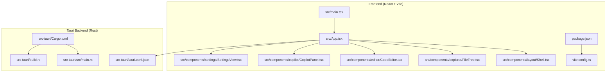
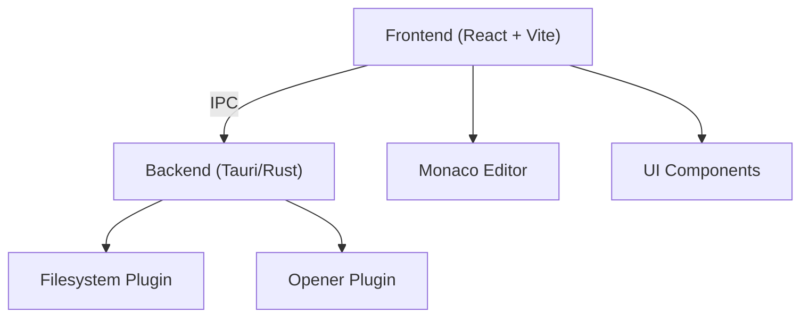
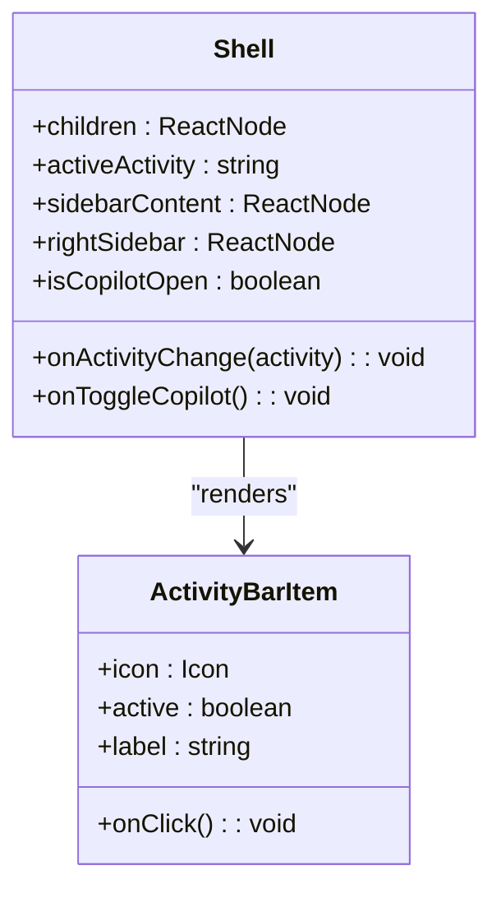
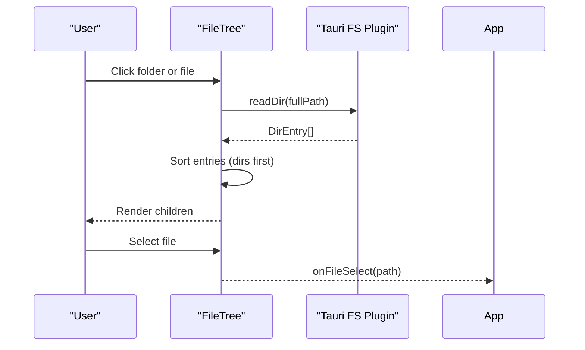
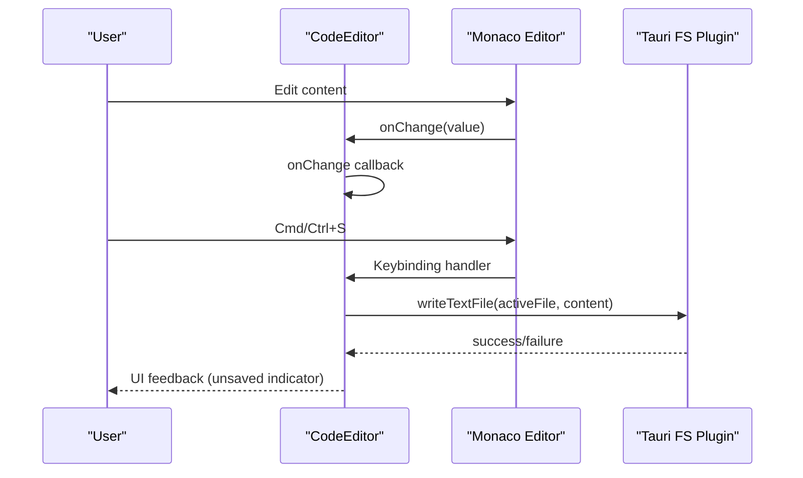
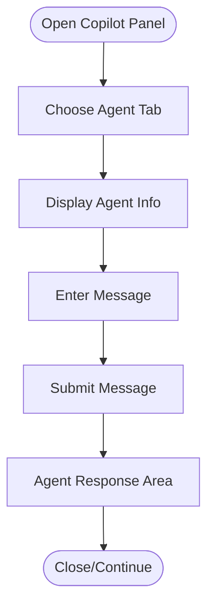
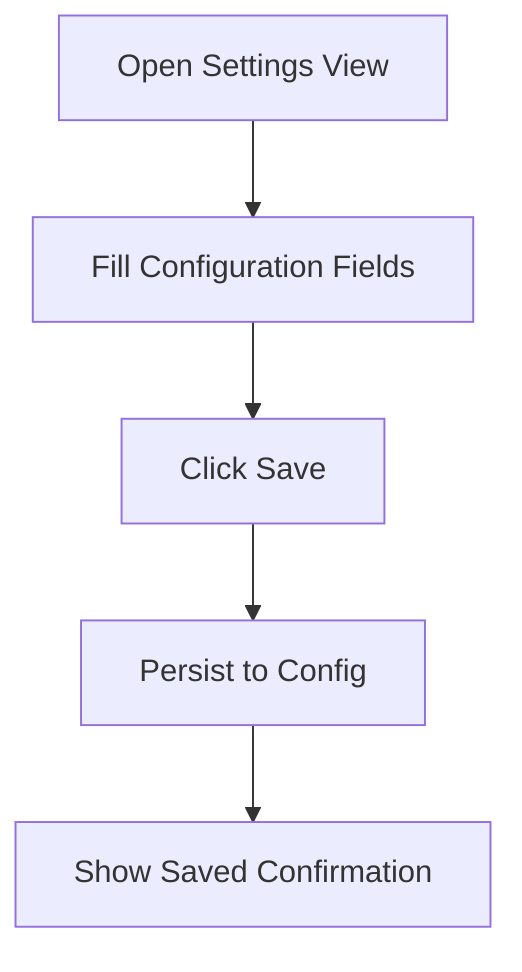
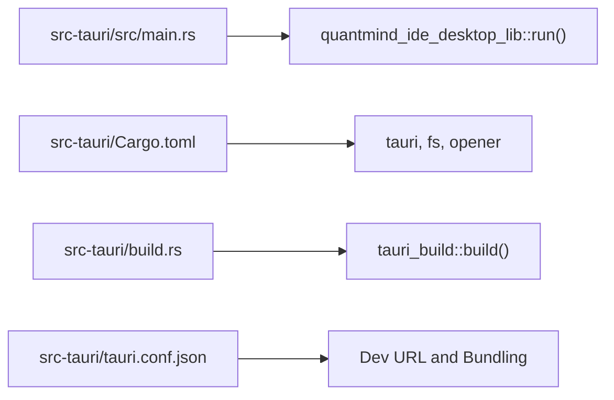
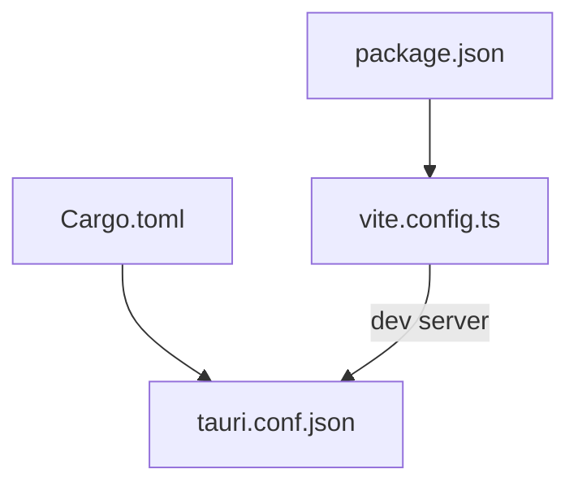

# Development Tools

<cite>
**Referenced Files in This Document**
- [quantmind-ide-desktop/README.md](file://quantmind-ide-desktop/README.md)
- [quantmind-ide-desktop/package.json](file://quantmind-ide-desktop/package.json)
- [quantmind-ide-desktop/vite.config.ts](file://quantmind-ide-desktop/vite.config.ts)
- [quantmind-ide-desktop/src-tauri/tauri.conf.json](file://quantmind-ide-desktop/src-tauri/tauri.conf.json)
- [quantmind-ide-desktop/src-tauri/Cargo.toml](file://quantmind-ide-desktop/src-tauri/Cargo.toml)
- [quantmind-ide-desktop/src/main.tsx](file://quantmind-ide-desktop/src/main.tsx)
- [quantmind-ide-desktop/src/App.tsx](file://quantmind-ide-desktop/src/App.tsx)
- [quantmind-ide-desktop/src-tauri/src/main.rs](file://quantmind-ide-desktop/src-tauri/src/main.rs)
- [quantmind-ide-desktop/src-tauri/build.rs](file://quantmind-ide-desktop/src-tauri/build.rs)
- [quantmind-ide-desktop/src/components/layout/Shell.tsx](file://quantmind-ide-desktop/src/components/layout/Shell.tsx)
- [quantmind-ide-desktop/src/components/explorer/FileTree.tsx](file://quantmind-ide-desktop/src/components/explorer/FileTree.tsx)
- [quantmind-ide-desktop/src/components/editor/CodeEditor.tsx](file://quantmind-ide-desktop/src/components/editor/CodeEditor.tsx)
- [quantmind-ide-desktop/src/components/copilot/CopilotPanel.tsx](file://quantmind-ide-desktop/src/components/copilot/CopilotPanel.tsx)
- [quantmind-ide-desktop/src/components/settings/SettingsView.tsx](file://quantmind-ide-desktop/src/components/settings/SettingsView.tsx)
- [data/assets/coding_standards.md](file://data/assets/coding_standards.md)
- [scripts/TEST_INSTRUCTIONS.md](file://scripts/TEST_INSTRUCTIONS.md)
- [pytest.ini](file://pytest.ini)
- [requirements.txt](file://requirements.txt)
- [docker-compose.yml](file://docker-compose.yml)
- [docker/strategy-agent/Dockerfile](file://docker/strategy-agent/Dockerfile)
- [docker/strategy-agent/run_tests.sh](file://docker/strategy-agent/run_tests.sh)
- [docs/testing/test_specification.md](file://docs/testing/test_specification.md)
- [docs/ui_discussion/ui_implementation_plan.md](file://docs/ui_discussion/ui_implementation_plan.md)
- [docs/specs/quantmind_ide_ui_spec.md](file://docs/specs/quantmind_ide_ui_spec.md)
</cite>

## Table of Contents
1. [Introduction](#introduction)
2. [Project Structure](#project-structure)
3. [Core Components](#core-components)
4. [Architecture Overview](#architecture-overview)
5. [Detailed Component Analysis](#detailed-component-analysis)
6. [Dependency Analysis](#dependency-analysis)
7. [Performance Considerations](#performance-considerations)
8. [Troubleshooting Guide](#troubleshooting-guide)
9. [Conclusion](#conclusion)
10. [Appendices](#appendices)

## Introduction
This document describes the Development Tools section of the QUANTMINDX project with a focus on the IDE desktop application built with Tauri, React, and TypeScript. It explains the desktop interface architecture, component layout, development workflow integration, scripting utilities for automation, testing framework for quality assurance, coding standards, environment setup, debugging tools, testing methodologies, component library integration, UI development patterns, cross-platform deployment considerations, best practices, performance optimization, and integration with the broader QUANTMINDX ecosystem.

## Project Structure
The IDE desktop application resides under the quantmind-ide-desktop directory and follows a clear separation between the frontend (React + Monaco Editor) and the Tauri backend (Rust). The frontend is configured via Vite and TailwindCSS, while Tauri manages bundling, platform-specific capabilities, and filesystem access.

**Diagram sources**
- [quantmind-ide-desktop/src/main.tsx](file://quantmind-ide-desktop/src/main.tsx#L1-L10)
- [quantmind-ide-desktop/src/App.tsx](file://quantmind-ide-desktop/src/App.tsx#L1-L179)
- [quantmind-ide-desktop/src/components/layout/Shell.tsx](file://quantmind-ide-desktop/src/components/layout/Shell.tsx#L1-L204)
- [quantmind-ide-desktop/src/components/explorer/FileTree.tsx](file://quantmind-ide-desktop/src/components/explorer/FileTree.tsx#L1-L114)
- [quantmind-ide-desktop/src/components/editor/CodeEditor.tsx](file://quantmind-ide-desktop/src/components/editor/CodeEditor.tsx#L1-L67)
- [quantmind-ide-desktop/src/components/copilot/CopilotPanel.tsx](file://quantmind-ide-desktop/src/components/copilot/CopilotPanel.tsx#L1-L84)
- [quantmind-ide-desktop/src/components/settings/SettingsView.tsx](file://quantmind-ide-desktop/src/components/settings/SettingsView.tsx#L1-L108)
- [quantmind-ide-desktop/package.json](file://quantmind-ide-desktop/package.json#L1-L39)
- [quantmind-ide-desktop/vite.config.ts](file://quantmind-ide-desktop/vite.config.ts#L1-L34)
- [quantmind-ide-desktop/src-tauri/tauri.conf.json](file://quantmind-ide-desktop/src-tauri/tauri.conf.json#L1-L36)
- [quantmind-ide-desktop/src-tauri/Cargo.toml](file://quantmind-ide-desktop/src-tauri/Cargo.toml#L1-L27)
- [quantmind-ide-desktop/src-tauri/src/main.rs](file://quantmind-ide-desktop/src-tauri/src/main.rs#L1-L7)
- [quantmind-ide-desktop/src-tauri/build.rs](file://quantmind-ide-desktop/src-tauri/build.rs#L1-L4)

**Section sources**
- [quantmind-ide-desktop/README.md](file://quantmind-ide-desktop/README.md#L1-L8)
- [quantmind-ide-desktop/package.json](file://quantmind-ide-desktop/package.json#L1-L39)
- [quantmind-ide-desktop/vite.config.ts](file://quantmind-ide-desktop/vite.config.ts#L1-L34)
- [quantmind-ide-desktop/src-tauri/tauri.conf.json](file://quantmind-ide-desktop/src-tauri/tauri.conf.json#L1-L36)
- [quantmind-ide-desktop/src-tauri/Cargo.toml](file://quantmind-ide-desktop/src-tauri/Cargo.toml#L1-L27)

## Core Components
- Application shell and activity bar: Provides navigation between Code Explorer, Knowledge Hub, Assets Hub, EA Manager, Backtests, NPRD Output, and Settings.
- File explorer: Recursively lists directories and files, supports sorting and lazy-loading of child entries.
- Code editor: Integrates Monaco Editor with language detection and save-on-Cmd/Ctrl+S.
- Copilot panel: Tabs for Copilot, Quant Agent, and Executor with a chat-like input area.
- Settings view: Centralized configuration for API credentials, remote MT5 bridge, model inference settings, and system prompts.
- Tauri backend: Bridges Rust-based capabilities (filesystem, opener) with the frontend, configured via tauri.conf.json and Cargo.toml.

**Section sources**
- [quantmind-ide-desktop/src/components/layout/Shell.tsx](file://quantmind-ide-desktop/src/components/layout/Shell.tsx#L32-L204)
- [quantmind-ide-desktop/src/components/explorer/FileTree.tsx](file://quantmind-ide-desktop/src/components/explorer/FileTree.tsx#L74-L114)
- [quantmind-ide-desktop/src/components/editor/CodeEditor.tsx](file://quantmind-ide-desktop/src/components/editor/CodeEditor.tsx#L21-L67)
- [quantmind-ide-desktop/src/components/copilot/CopilotPanel.tsx](file://quantmind-ide-desktop/src/components/copilot/CopilotPanel.tsx#L20-L84)
- [quantmind-ide-desktop/src/components/settings/SettingsView.tsx](file://quantmind-ide-desktop/src/components/settings/SettingsView.tsx#L23-L108)
- [quantmind-ide-desktop/src-tauri/tauri.conf.json](file://quantmind-ide-desktop/src-tauri/tauri.conf.json#L1-L36)
- [quantmind-ide-desktop/src-tauri/Cargo.toml](file://quantmind-ide-desktop/src-tauri/Cargo.toml#L20-L26)

## Architecture Overview
The desktop IDE uses a hybrid architecture:
- Frontend: React + Vite with hot module replacement during development, TailwindCSS for styling, and Monaco Editor for code editing.
- Backend: Tauri (Rust) provides native capabilities, secure IPC, and packaging for multiple platforms.
- Filesystem access: Tauri plugins for filesystem operations enable safe file read/write from the frontend.
- UI layout: A resizable panel system allows flexible workspace composition with collapsible sidebars and a terminal/output panel.

**Diagram sources**
- [quantmind-ide-desktop/src/App.tsx](file://quantmind-ide-desktop/src/App.tsx#L1-L179)
- [quantmind-ide-desktop/src/components/editor/CodeEditor.tsx](file://quantmind-ide-desktop/src/components/editor/CodeEditor.tsx#L1-L67)
- [quantmind-ide-desktop/src-tauri/Cargo.toml](file://quantmind-ide-desktop/src-tauri/Cargo.toml#L20-L26)
- [quantmind-ide-desktop/src-tauri/tauri.conf.json](file://quantmind-ide-desktop/src-tauri/tauri.conf.json#L1-L36)

## Detailed Component Analysis

### Application Shell and Navigation
The shell component defines the activity bar, header command bar, left/right sidebars, main content area, and bottom panel. It coordinates visibility and resizing of panels and toggles the Copilot panel.

**Diagram sources**
- [quantmind-ide-desktop/src/components/layout/Shell.tsx](file://quantmind-ide-desktop/src/components/layout/Shell.tsx#L32-L204)

**Section sources**
- [quantmind-ide-desktop/src/components/layout/Shell.tsx](file://quantmind-ide-desktop/src/components/layout/Shell.tsx#L32-L204)

### File Explorer and File Operations
The file tree component recursively loads directory entries, sorts directories before files, and triggers file selection. It integrates with Tauri filesystem APIs to read directories and files.

**Diagram sources**
- [quantmind-ide-desktop/src/components/explorer/FileTree.tsx](file://quantmind-ide-desktop/src/components/explorer/FileTree.tsx#L74-L114)

**Section sources**
- [quantmind-ide-desktop/src/components/explorer/FileTree.tsx](file://quantmind-ide-desktop/src/components/explorer/FileTree.tsx#L1-L114)

### Code Editor Integration
The code editor component detects language by file extension and binds a save command to Cmd/Ctrl+S. It renders Monaco Editor with a dark theme and custom options.

**Diagram sources**
- [quantmind-ide-desktop/src/components/editor/CodeEditor.tsx](file://quantmind-ide-desktop/src/components/editor/CodeEditor.tsx#L21-L67)
- [quantmind-ide-desktop/src/App.tsx](file://quantmind-ide-desktop/src/App.tsx#L49-L65)

**Section sources**
- [quantmind-ide-desktop/src/components/editor/CodeEditor.tsx](file://quantmind-ide-desktop/src/components/editor/CodeEditor.tsx#L1-L67)
- [quantmind-ide-desktop/src/App.tsx](file://quantmind-ide-desktop/src/App.tsx#L49-L65)

### Copilot Panel and Agent Tabs
The Copilot panel organizes three agent tabs (Copilot, Quant, Executor) and provides a simple input area for messages. It serves as a UI entry point for AI-assisted development.

**Diagram sources**
- [quantmind-ide-desktop/src/components/copilot/CopilotPanel.tsx](file://quantmind-ide-desktop/src/components/copilot/CopilotPanel.tsx#L20-L84)

**Section sources**
- [quantmind-ide-desktop/src/components/copilot/CopilotPanel.tsx](file://quantmind-ide-desktop/src/components/copilot/CopilotPanel.tsx#L1-L84)

### Settings and Configuration
The settings view groups configuration areas for API credentials, remote MT5 bridge, model inference, and system prompts. It includes a save action and visual feedback.

**Diagram sources**
- [quantmind-ide-desktop/src/components/settings/SettingsView.tsx](file://quantmind-ide-desktop/src/components/settings/SettingsView.tsx#L23-L108)

**Section sources**
- [quantmind-ide-desktop/src/components/settings/SettingsView.tsx](file://quantmind-ide-desktop/src/components/settings/SettingsView.tsx#L1-L108)

### Tauri Backend and Build Configuration
The Tauri backend initializes the Rust library and exposes native capabilities. The build configuration sets up the Rust crate types and plugin dependencies.

**Diagram sources**
- [quantmind-ide-desktop/src-tauri/src/main.rs](file://quantmind-ide-desktop/src-tauri/src/main.rs#L4-L6)
- [quantmind-ide-desktop/src-tauri/Cargo.toml](file://quantmind-ide-desktop/src-tauri/Cargo.toml#L10-L26)
- [quantmind-ide-desktop/src-tauri/build.rs](file://quantmind-ide-desktop/src-tauri/build.rs#L1-L4)
- [quantmind-ide-desktop/src-tauri/tauri.conf.json](file://quantmind-ide-desktop/src-tauri/tauri.conf.json#L6-L11)

**Section sources**
- [quantmind-ide-desktop/src-tauri/src/main.rs](file://quantmind-ide-desktop/src-tauri/src/main.rs#L1-L7)
- [quantmind-ide-desktop/src-tauri/Cargo.toml](file://quantmind-ide-desktop/src-tauri/Cargo.toml#L1-L27)
- [quantmind-ide-desktop/src-tauri/build.rs](file://quantmind-ide-desktop/src-tauri/build.rs#L1-L4)
- [quantmind-ide-desktop/src-tauri/tauri.conf.json](file://quantmind-ide-desktop/src-tauri/tauri.conf.json#L1-L36)

## Dependency Analysis
The frontend and backend dependencies are declared in package.json and Cargo.toml respectively. The Vite configuration enforces a fixed port for Tauri development and disables screen clearing to preserve Rust build logs.

**Diagram sources**
- [quantmind-ide-desktop/package.json](file://quantmind-ide-desktop/package.json#L6-L11)
- [quantmind-ide-desktop/vite.config.ts](file://quantmind-ide-desktop/vite.config.ts#L9-L33)
- [quantmind-ide-desktop/src-tauri/tauri.conf.json](file://quantmind-ide-desktop/src-tauri/tauri.conf.json#L6-L11)
- [quantmind-ide-desktop/src-tauri/Cargo.toml](file://quantmind-ide-desktop/src-tauri/Cargo.toml#L17-L26)

**Section sources**
- [quantmind-ide-desktop/package.json](file://quantmind-ide-desktop/package.json#L1-L39)
- [quantmind-ide-desktop/vite.config.ts](file://quantmind-ide-desktop/vite.config.ts#L1-L34)
- [quantmind-ide-desktop/src-tauri/Cargo.toml](file://quantmind-ide-desktop/src-tauri/Cargo.toml#L1-L27)
- [quantmind-ide-desktop/src-tauri/tauri.conf.json](file://quantmind-ide-desktop/src-tauri/tauri.conf.json#L1-L36)

## Performance Considerations
- Monaco Editor options: Minimap disabled, optimized font family, and automatic layout reduce rendering overhead.
- Lazy loading in FileTree: Children are loaded on demand to avoid heavy initial directory scans.
- Fixed dev port: Ensures stable HMR and reduces startup conflicts.
- Panel resizing: Uses lightweight resize handles and minimal reflows.

[No sources needed since this section provides general guidance]

## Troubleshooting Guide
Common issues and resolutions:
- File read/write failures: Verify filesystem permissions and paths; check error alerts and console logs.
- Dev server port conflicts: Ensure port 1420 is free; adjust Vite server.port if necessary.
- Tauri build errors: Confirm Rust toolchain and Tauri CLI installation; review Cargo.toml plugin versions.
- Copilot panel not visible: Toggle via header button; ensure right sidebar is enabled.
- Settings save feedback: After clicking save, a temporary success message appears; confirm persistence in configuration storage.

**Section sources**
- [quantmind-ide-desktop/src/App.tsx](file://quantmind-ide-desktop/src/App.tsx#L36-L65)
- [quantmind-ide-desktop/vite.config.ts](file://quantmind-ide-desktop/vite.config.ts#L17-L32)
- [quantmind-ide-desktop/src-tauri/Cargo.toml](file://quantmind-ide-desktop/src-tauri/Cargo.toml#L20-L26)
- [quantmind-ide-desktop/src/components/copilot/CopilotPanel.tsx](file://quantmind-ide-desktop/src/components/copilot/CopilotPanel.tsx#L116-L126)
- [quantmind-ide-desktop/src/components/settings/SettingsView.tsx](file://quantmind-ide-desktop/src/components/settings/SettingsView.tsx#L26-L30)

## Conclusion
The QUANTMINDX IDE desktop application combines a modern React-based UI with Tauri’s native capabilities to deliver a powerful development environment. Its modular component architecture, integrated file explorer and editor, AI copilot panel, and centralized settings support efficient development workflows. The project’s configuration and build setup enable cross-platform deployment and streamlined development iteration.

[No sources needed since this section summarizes without analyzing specific files]

## Appendices

### Development Environment Setup
- Recommended IDE: VS Code with Tauri and rust-analyzer extensions.
- Frontend dependencies: Managed via package.json; install with npm/yarn/pnpm.
- Backend dependencies: Managed via Cargo.toml; ensure Rust toolchain is installed.
- Development server: Run tauri dev to launch Vite and Tauri in tandem.

**Section sources**
- [quantmind-ide-desktop/README.md](file://quantmind-ide-desktop/README.md#L5-L8)
- [quantmind-ide-desktop/package.json](file://quantmind-ide-desktop/package.json#L12-L37)
- [quantmind-ide-desktop/src-tauri/Cargo.toml](file://quantmind-ide-desktop/src-tauri/Cargo.toml#L20-L26)

### Scripting Utilities and Automation
- Scripts directory contains automation helpers for knowledge base indexing, scraping, and KB hooks setup.
- Example scripts include category crawler, firecrawl scraper, and KB startup scripts.

**Section sources**
- [scripts/TEST_INSTRUCTIONS.md](file://scripts/TEST_INSTRUCTIONS.md)
- [scripts/category_crawler.py](file://scripts/category_crawler.py)
- [scripts/firecrawl_scraper.py](file://scripts/firecrawl_scraper.py)
- [scripts/kb-start.sh](file://scripts/kb-start.sh)
- [scripts/setup-kb-hooks.sh](file://scripts/setup-kb-hooks.sh)

### Testing Framework and Methodologies
- Test runner: PyTest with configuration in pytest.ini.
- Test coverage and specifications are documented in docs/testing and tests directories.
- Docker-based testing is supported via docker-compose and strategy-agent container.

**Section sources**
- [pytest.ini](file://pytest.ini)
- [docs/testing/test_specification.md](file://docs/testing/test_specification.md)
- [docker-compose.yml](file://docker-compose.yml)
- [docker/strategy-agent/Dockerfile](file://docker/strategy-agent/Dockerfile)
- [docker/strategy-agent/run_tests.sh](file://docker/strategy-agent/run_tests.sh)

### Coding Standards
- Coding standards are documented in data/assets/coding_standards.md for consistent development practices across the project.

**Section sources**
- [data/assets/coding_standards.md](file://data/assets/coding_standards.md)

### UI Development Patterns and Component Library Integration
- UI patterns and component library integration are discussed in docs/ui_discussion and UI specification docs.
- These resources guide consistent styling, layout, and component usage across the IDE.

**Section sources**
- [docs/ui_discussion/ui_implementation_plan.md](file://docs/ui_discussion/ui_implementation_plan.md)
- [docs/specs/quantmind_ide_ui_spec.md](file://docs/specs/quantmind_ide_ui_spec.md)

### Cross-Platform Deployment Considerations
- Tauri configuration supports bundling for multiple targets; icons and identifiers are defined for consistent branding across platforms.

**Section sources**
- [quantmind-ide-desktop/src-tauri/tauri.conf.json](file://quantmind-ide-desktop/src-tauri/tauri.conf.json#L24-L34)

### Practical Examples
- IDE usage: Launch tauri dev, open the shell, navigate activities, open files via FileTree, edit with Monaco Editor, and toggle Copilot panel.
- Script execution: Use scripts in the scripts/ directory for knowledge base operations and web scraping.
- Testing procedures: Run PyTest locally and via Docker containers for containerized environments.

**Section sources**
- [quantmind-ide-desktop/vite.config.ts](file://quantmind-ide-desktop/vite.config.ts#L7-L10)
- [quantmind-ide-desktop/src/App.tsx](file://quantmind-ide-desktop/src/App.tsx#L118-L175)
- [scripts/TEST_INSTRUCTIONS.md](file://scripts/TEST_INSTRUCTIONS.md)
- [pytest.ini](file://pytest.ini)
- [docker/strategy-agent/run_tests.sh](file://docker/strategy-agent/run_tests.sh)