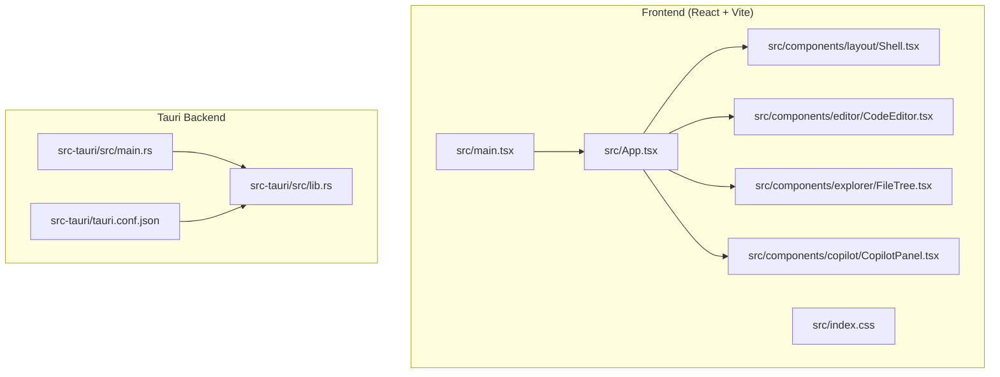
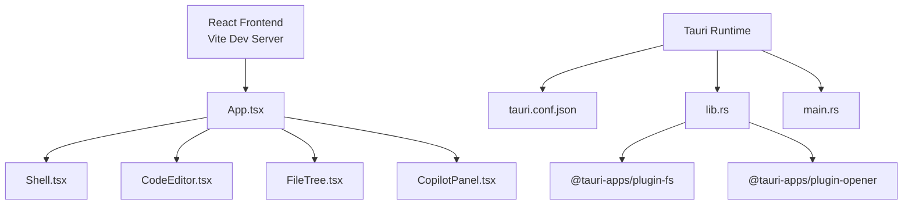
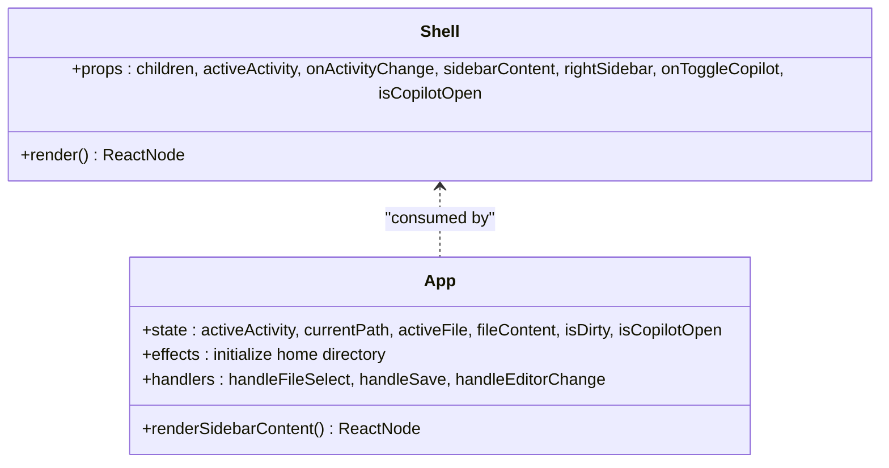
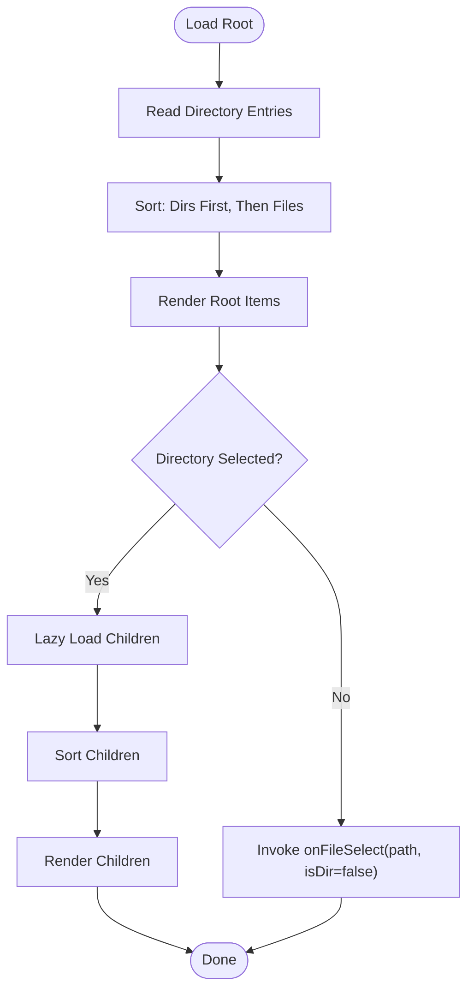
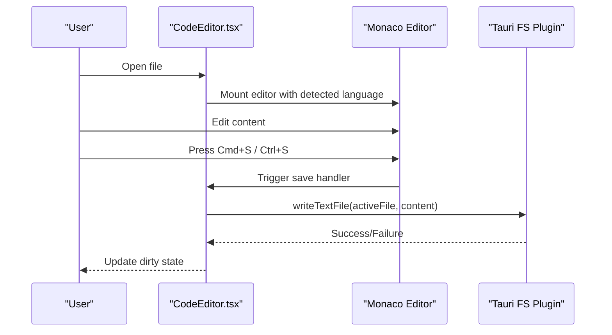
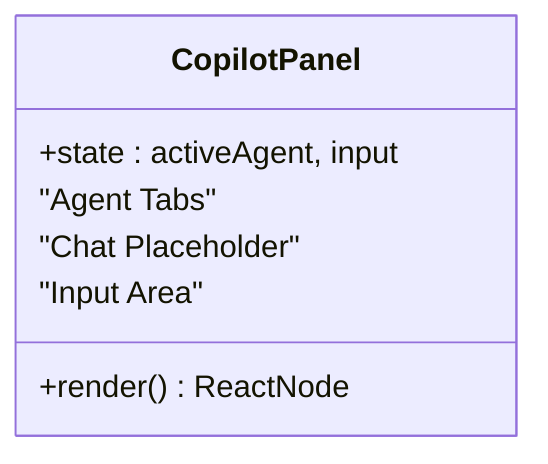
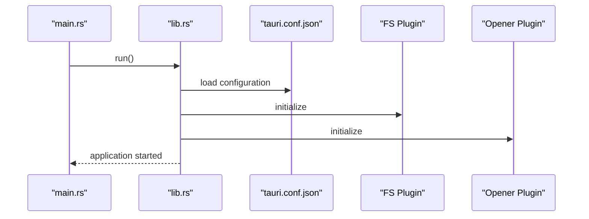
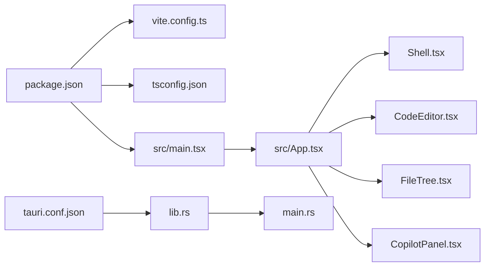

# IDE Desktop Application

<cite>
**Referenced Files in This Document**
- [package.json](file://quantmind-ide-desktop/package.json)
- [vite.config.ts](file://quantmind-ide-desktop/vite.config.ts)
- [tsconfig.json](file://quantmind-ide-desktop/tsconfig.json)
- [tsconfig.node.json](file://quantmind-ide-desktop/tsconfig.node.json)
- [src/main.tsx](file://quantmind-ide-desktop/src/main.tsx)
- [src/App.tsx](file://quantmind-ide-desktop/src/App.tsx)
- [src/index.css](file://quantmind-ide-desktop/src/index.css)
- [src/components/layout/Shell.tsx](file://quantmind-ide-desktop/src/components/layout/Shell.tsx)
- [src/components/editor/CodeEditor.tsx](file://quantmind-ide-desktop/src/components/editor/CodeEditor.tsx)
- [src/components/explorer/FileTree.tsx](file://quantmind-ide-desktop/src/components/explorer/FileTree.tsx)
- [src/components/copilot/CopilotPanel.tsx](file://quantmind-ide-desktop/src/components/copilot/CopilotPanel.tsx)
- [src-tauri/tauri.conf.json](file://quantmind-ide-desktop/src-tauri/tauri.conf.json)
- [src-tauri/src/main.rs](file://quantmind-ide-desktop/src-tauri/src/main.rs)
- [src-tauri/src/lib.rs](file://quantmind-ide-desktop/src-tauri/src/lib.rs)
</cite>

## Table of Contents
1. [Introduction](#introduction)
2. [Project Structure](#project-structure)
3. [Core Components](#core-components)
4. [Architecture Overview](#architecture-overview)
5. [Detailed Component Analysis](#detailed-component-analysis)
6. [Dependency Analysis](#dependency-analysis)
7. [Performance Considerations](#performance-considerations)
8. [Troubleshooting Guide](#troubleshooting-guide)
9. [Conclusion](#conclusion)
10. [Appendices](#appendices)

## Introduction
This document describes the IDE Desktop Application built with Tauri, React, and Monaco Editor. It explains the desktop interface architecture, React component structure, and Monaco Editor integration for code editing. It also covers the Vite build system, TypeScript configuration, and Tailwind CSS styling approach. The component library includes lightweight-charts for market visualization, lucide-react icons, and framer-motion animations. Tauri plugin integration is documented for filesystem access, URL opening, and cross-platform deployment. Practical usage examples, component development patterns, and integration with the QUANTMINDX development workflow are included, along with build processes, development server setup, and production deployment considerations.

## Project Structure
The IDE is organized into a frontend React application and a Tauri backend wrapper. The frontend is configured with Vite and Tailwind CSS, while Tauri manages native capabilities and packaging.

**Diagram sources**
- [src/main.tsx](file://quantmind-ide-desktop/src/main.tsx#L1-L10)
- [src/App.tsx](file://quantmind-ide-desktop/src/App.tsx#L1-L179)
- [src/index.css](file://quantmind-ide-desktop/src/index.css#L1-L74)
- [src/components/layout/Shell.tsx](file://quantmind-ide-desktop/src/components/layout/Shell.tsx#L1-L204)
- [src/components/editor/CodeEditor.tsx](file://quantmind-ide-desktop/src/components/editor/CodeEditor.tsx#L1-L67)
- [src/components/explorer/FileTree.tsx](file://quantmind-ide-desktop/src/components/explorer/FileTree.tsx#L1-L114)
- [src/components/copilot/CopilotPanel.tsx](file://quantmind-ide-desktop/src/components/copilot/CopilotPanel.tsx#L1-L84)
- [src-tauri/src/main.rs](file://quantmind-ide-desktop/src-tauri/src/main.rs#L1-L7)
- [src-tauri/src/lib.rs](file://quantmind-ide-desktop/src-tauri/src/lib.rs#L1-L16)
- [src-tauri/tauri.conf.json](file://quantmind-ide-desktop/src-tauri/tauri.conf.json#L1-L36)

**Section sources**
- [package.json](file://quantmind-ide-desktop/package.json#L1-L39)
- [vite.config.ts](file://quantmind-ide-desktop/vite.config.ts#L1-L34)
- [tsconfig.json](file://quantmind-ide-desktop/tsconfig.json#L1-L26)
- [src-tauri/tauri.conf.json](file://quantmind-ide-desktop/src-tauri/tauri.conf.json#L1-L36)

## Core Components
- App shell and routing: Orchestrates activity bar, sidebar content, main editor area, and bottom panel.
- File explorer: Recursively lists directories and files, supports selection and sorting.
- Code editor: Integrates Monaco Editor with language detection, custom save command, and editor options.
- Copilot panel: Provides tabs for different agents and a chat-like input area.
- Tauri integration: Initializes plugins for filesystem and URL opening, exposes commands, and manages bundling.

Key responsibilities:
- App.tsx: Manages active activity, current path, active file, dirty state, and file read/write via Tauri plugins.
- Shell.tsx: Implements resizable panels, activity bar, header/command bar, and status bar.
- FileTree.tsx: Loads directory entries and handles recursive expansion with loading states.
- CodeEditor.tsx: Mounts Monaco Editor, detects language by file extension, and binds save shortcut.
- CopilotPanel.tsx: Hosts agent tabs and message area.

**Section sources**
- [src/App.tsx](file://quantmind-ide-desktop/src/App.tsx#L1-L179)
- [src/components/layout/Shell.tsx](file://quantmind-ide-desktop/src/components/layout/Shell.tsx#L1-L204)
- [src/components/explorer/FileTree.tsx](file://quantmind-ide-desktop/src/components/explorer/FileTree.tsx#L1-L114)
- [src/components/editor/CodeEditor.tsx](file://quantmind-ide-desktop/src/components/editor/CodeEditor.tsx#L1-L67)
- [src/components/copilot/CopilotPanel.tsx](file://quantmind-ide-desktop/src/components/copilot/CopilotPanel.tsx#L1-L84)

## Architecture Overview
The application uses a React frontend with Tauri runtime for native capabilities. Vite serves the React app during development and builds it for production. Tauri’s configuration defines the dev URL, build steps, and bundling targets. The frontend communicates with Tauri plugins for filesystem operations and URL opening.

**Diagram sources**
- [src/App.tsx](file://quantmind-ide-desktop/src/App.tsx#L1-L179)
- [src/components/layout/Shell.tsx](file://quantmind-ide-desktop/src/components/layout/Shell.tsx#L1-L204)
- [src/components/editor/CodeEditor.tsx](file://quantmind-ide-desktop/src/components/editor/CodeEditor.tsx#L1-L67)
- [src/components/explorer/FileTree.tsx](file://quantmind-ide-desktop/src/components/explorer/FileTree.tsx#L1-L114)
- [src/components/copilot/CopilotPanel.tsx](file://quantmind-ide-desktop/src/components/copilot/CopilotPanel.tsx#L1-L84)
- [src-tauri/tauri.conf.json](file://quantmind-ide-desktop/src-tauri/tauri.conf.json#L1-L36)
- [src-tauri/src/lib.rs](file://quantmind-ide-desktop/src-tauri/src/lib.rs#L1-L16)
- [src-tauri/src/main.rs](file://quantmind-ide-desktop/src-tauri/src/main.rs#L1-L7)

## Detailed Component Analysis

### App Shell and Layout
The shell provides a responsive layout with:
- Left activity bar with navigation icons.
- Collapsible left sidebar for explorer content.
- Main editor panel with optional bottom terminal/output panel.
- Right sidebar for the Copilot panel.
- Status bar with system indicators.

**Diagram sources**
- [src/components/layout/Shell.tsx](file://quantmind-ide-desktop/src/components/layout/Shell.tsx#L32-L204)
- [src/App.tsx](file://quantmind-ide-desktop/src/App.tsx#L11-L179)

**Section sources**
- [src/components/layout/Shell.tsx](file://quantmind-ide-desktop/src/components/layout/Shell.tsx#L1-L204)
- [src/App.tsx](file://quantmind-ide-desktop/src/App.tsx#L1-L179)

### File Explorer
The file tree component recursively loads directory entries, sorts directories before files, and supports lazy loading of children. Clicking a file triggers selection; clicking a directory toggles expansion.

**Diagram sources**
- [src/components/explorer/FileTree.tsx](file://quantmind-ide-desktop/src/components/explorer/FileTree.tsx#L74-L114)

**Section sources**
- [src/components/explorer/FileTree.tsx](file://quantmind-ide-desktop/src/components/explorer/FileTree.tsx#L1-L114)

### Code Editor Integration
Monaco Editor is integrated with:
- Language detection based on file extension.
- Custom save command bound to Cmd+S/Ctrl+S.
- Editor options for theme, fonts, minimap, and layout.

**Diagram sources**
- [src/components/editor/CodeEditor.tsx](file://quantmind-ide-desktop/src/components/editor/CodeEditor.tsx#L21-L67)
- [src/App.tsx](file://quantmind-ide-desktop/src/App.tsx#L49-L65)

**Section sources**
- [src/components/editor/CodeEditor.tsx](file://quantmind-ide-desktop/src/components/editor/CodeEditor.tsx#L1-L67)
- [src/App.tsx](file://quantmind-ide-desktop/src/App.tsx#L36-L65)

### Copilot Panel
The Copilot panel hosts agent tabs and a simple input area. It supports switching between Copilot, Quant, and Executor agents.

**Diagram sources**
- [src/components/copilot/CopilotPanel.tsx](file://quantmind-ide-desktop/src/components/copilot/CopilotPanel.tsx#L20-L84)

**Section sources**
- [src/components/copilot/CopilotPanel.tsx](file://quantmind-ide-desktop/src/components/copilot/CopilotPanel.tsx#L1-L84)

### Tauri Backend and Plugins
Tauri initializes plugins for filesystem and URL opening, registers a greeting command, and runs the application. The configuration defines the dev URL, build steps, and bundle targets.

**Diagram sources**
- [src-tauri/src/main.rs](file://quantmind-ide-desktop/src-tauri/src/main.rs#L1-L7)
- [src-tauri/src/lib.rs](file://quantmind-ide-desktop/src-tauri/src/lib.rs#L1-L16)
- [src-tauri/tauri.conf.json](file://quantmind-ide-desktop/src-tauri/tauri.conf.json#L1-L36)

**Section sources**
- [src-tauri/src/lib.rs](file://quantmind-ide-desktop/src-tauri/src/lib.rs#L1-L16)
- [src-tauri/tauri.conf.json](file://quantmind-ide-desktop/src-tauri/tauri.conf.json#L1-L36)

## Dependency Analysis
Frontend dependencies include React, Monaco Editor, Tailwind CSS, lucide-react, framer-motion, and Tauri APIs. Build-time dependencies include Vite, TypeScript, and Tauri CLI. Tauri plugins provide filesystem and opener capabilities.

**Diagram sources**
- [package.json](file://quantmind-ide-desktop/package.json#L1-L39)
- [vite.config.ts](file://quantmind-ide-desktop/vite.config.ts#L1-L34)
- [tsconfig.json](file://quantmind-ide-desktop/tsconfig.json#L1-L26)
- [src/main.tsx](file://quantmind-ide-desktop/src/main.tsx#L1-L10)
- [src/App.tsx](file://quantmind-ide-desktop/src/App.tsx#L1-L179)
- [src/components/layout/Shell.tsx](file://quantmind-ide-desktop/src/components/layout/Shell.tsx#L1-L204)
- [src/components/editor/CodeEditor.tsx](file://quantmind-ide-desktop/src/components/editor/CodeEditor.tsx#L1-L67)
- [src/components/explorer/FileTree.tsx](file://quantmind-ide-desktop/src/components/explorer/FileTree.tsx#L1-L114)
- [src/components/copilot/CopilotPanel.tsx](file://quantmind-ide-desktop/src/components/copilot/CopilotPanel.tsx#L1-L84)
- [src-tauri/tauri.conf.json](file://quantmind-ide-desktop/src-tauri/tauri.conf.json#L1-L36)
- [src-tauri/src/lib.rs](file://quantmind-ide-desktop/src-tauri/src/lib.rs#L1-L16)
- [src-tauri/src/main.rs](file://quantmind-ide-desktop/src-tauri/src/main.rs#L1-L7)

**Section sources**
- [package.json](file://quantmind-ide-desktop/package.json#L1-L39)
- [vite.config.ts](file://quantmind-ide-desktop/vite.config.ts#L1-L34)
- [tsconfig.json](file://quantmind-ide-desktop/tsconfig.json#L1-L26)
- [src-tauri/tauri.conf.json](file://quantmind-ide-desktop/src-tauri/tauri.conf.json#L1-L36)

## Performance Considerations
- Monaco Editor performance: Disable minimap and optimize font family and size as configured. Prefer lazy-loading large files and avoid frequent re-mounts.
- FileTree rendering: Memoize child rendering and limit depth for very large directories. Debounce expand actions.
- Panel resizing: Use minimal reflows by avoiding unnecessary re-renders in Shell and relying on PanelGroup internals.
- Tailwind CSS: Use utilities sparingly to reduce CSS bloat; leverage theme tokens for consistent styles.
- Tauri IPC: Batch filesystem operations and avoid synchronous heavy work on the UI thread.

## Troubleshooting Guide
Common issues and resolutions:
- File read/write failures: Verify filesystem permissions and path correctness. Handle errors gracefully and show user-friendly alerts.
- Monaco save shortcut not working: Ensure editor mount callback is invoked and command registration occurs after editor initialization.
- Dev server port conflicts: Tauri dev expects a fixed port; ensure port 1420 is free or adjust configuration accordingly.
- Hot module replacement on remote host: Configure TAURI_DEV_HOST to enable HMR over network if needed.
- Bundle errors: Confirm beforeDevCommand and beforeBuildCommand match existing scripts and that frontendDist points to the built output.

**Section sources**
- [src/App.tsx](file://quantmind-ide-desktop/src/App.tsx#L36-L65)
- [src/components/editor/CodeEditor.tsx](file://quantmind-ide-desktop/src/components/editor/CodeEditor.tsx#L24-L32)
- [vite.config.ts](file://quantmind-ide-desktop/vite.config.ts#L17-L32)
- [src-tauri/tauri.conf.json](file://quantmind-ide-desktop/src-tauri/tauri.conf.json#L6-L11)

## Conclusion
The IDE Desktop Application combines a modern React/Tauri stack with Monaco Editor for a powerful code editing experience. The layout is modular and extensible, with clear separation between UI components and Tauri-native capabilities. The build system leverages Vite and TypeScript, while Tailwind CSS provides a cohesive design language. Plugins for filesystem and URL opening enable seamless integration with the operating system. The architecture supports future enhancements such as lightweight-charts for market visualization and expanded agent integrations.

## Appendices

### Build Processes and Scripts
- Development: Starts Vite dev server and Tauri dev with a fixed port and optional HMR over network.
- Production build: Compiles TypeScript and bundles the frontend for Tauri to package.
- Preview: Serves the built frontend locally for testing.

**Section sources**
- [package.json](file://quantmind-ide-desktop/package.json#L6-L11)
- [vite.config.ts](file://quantmind-ide-desktop/vite.config.ts#L9-L33)
- [src-tauri/tauri.conf.json](file://quantmind-ide-desktop/src-tauri/tauri.conf.json#L6-L11)

### Development Server Setup
- Port: Fixed to 1420 with strict port enforcement.
- HMR: Enabled when TAURI_DEV_HOST is set; uses a separate WebSocket port.
- Watcher: Ignores Tauri source directories to prevent unnecessary reloads.

**Section sources**
- [vite.config.ts](file://quantmind-ide-desktop/vite.config.ts#L17-L32)

### Production Deployment Considerations
- Bundle targets: All platforms enabled by default; customize per project needs.
- Icons: Provide platform-specific icons as configured.
- Security: CSP is disabled; evaluate and harden as needed for production.
- Packaging: Ensure frontendDist points to the built output directory.

**Section sources**
- [src-tauri/tauri.conf.json](file://quantmind-ide-desktop/src-tauri/tauri.conf.json#L24-L34)

### Styling Approach with Tailwind CSS
- Dark theme tokens: Background, surfaces, borders, primary/secondary colors, and typography are defined in CSS variables.
- Utility classes: Used for layout, glassmorphism effects, and custom scrollbar styling.
- Editor overrides: Transparent backgrounds for Monaco Editor to blend with theme.

**Section sources**
- [src/index.css](file://quantmind-ide-desktop/src/index.css#L1-L74)

### Component Library Highlights
- lucide-react: Icons for activity bar, file types, and UI affordances.
- framer-motion: Animations and transitions for interactive elements.
- lightweight-charts: Ready for market visualization panels.

Note: lightweight-charts and framer-motion are declared as dependencies; integrate them into visualization panels and animations as needed.

**Section sources**
- [package.json](file://quantmind-ide-desktop/package.json#L12-L29)

### IDE Usage Examples and Patterns
- Opening a file: Select a file in the explorer; the editor displays content with language-specific syntax highlighting.
- Saving changes: Use Cmd+S/Ctrl+S or trigger save programmatically; the app writes to disk and clears the dirty indicator.
- Switching activities: Use the left activity bar to navigate between code, knowledge hub, assets, EA manager, backtests, NPRD, and settings.
- Copilot interaction: Toggle the right Copilot panel and switch between agent tabs to interact with different agents.

**Section sources**
- [src/App.tsx](file://quantmind-ide-desktop/src/App.tsx#L68-L116)
- [src/components/editor/CodeEditor.tsx](file://quantmind-ide-desktop/src/components/editor/CodeEditor.tsx#L24-L32)
- [src/components/layout/Shell.tsx](file://quantmind-ide-desktop/src/components/layout/Shell.tsx#L62-L106)
- [src/components/copilot/CopilotPanel.tsx](file://quantmind-ide-desktop/src/components/copilot/CopilotPanel.tsx#L20-L84)

### Integration with QUANTMINDX Workflow
- Assets Hub: Connect and manage strategies and indicators from the assets activity.
- EA Management: Access and configure Expert Advisors from the EA Manager activity.
- Knowledge Base: Explore curated knowledge resources from the knowledge hub activity.
- Backtests: Track historical backtest runs from the backtests activity.
- NPRD: View reports and insights from the NPRD activity.

**Section sources**
- [src/App.tsx](file://quantmind-ide-desktop/src/App.tsx#L74-L112)