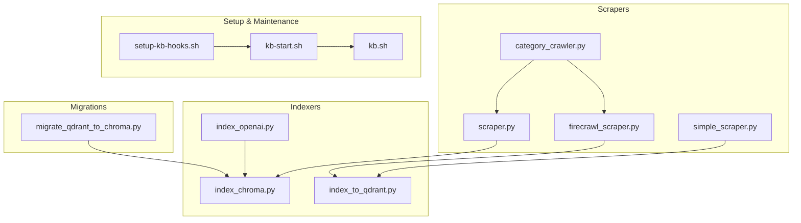
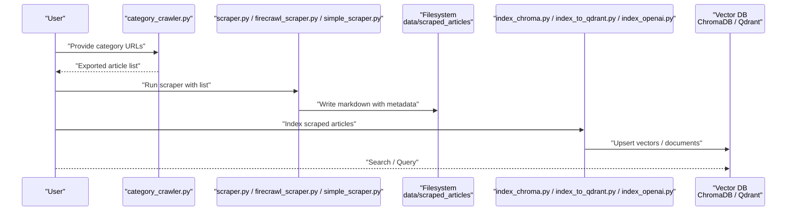
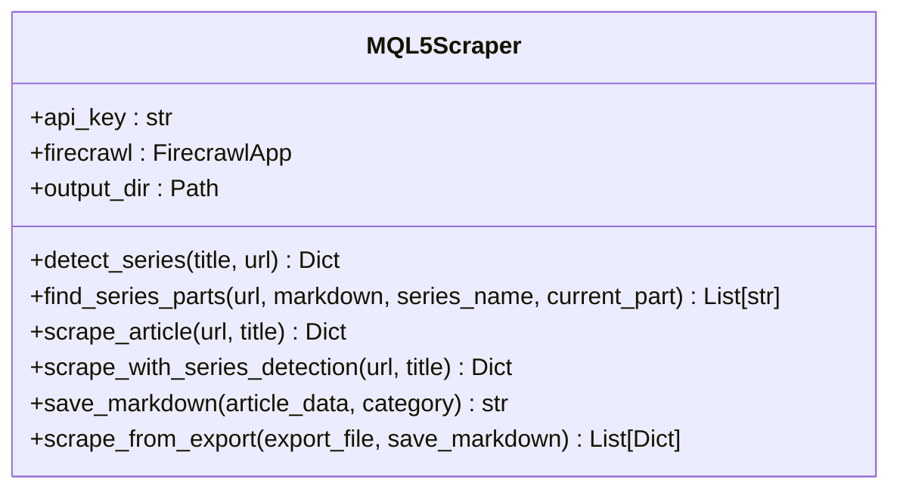
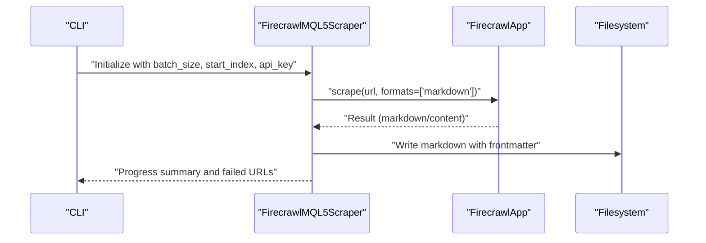
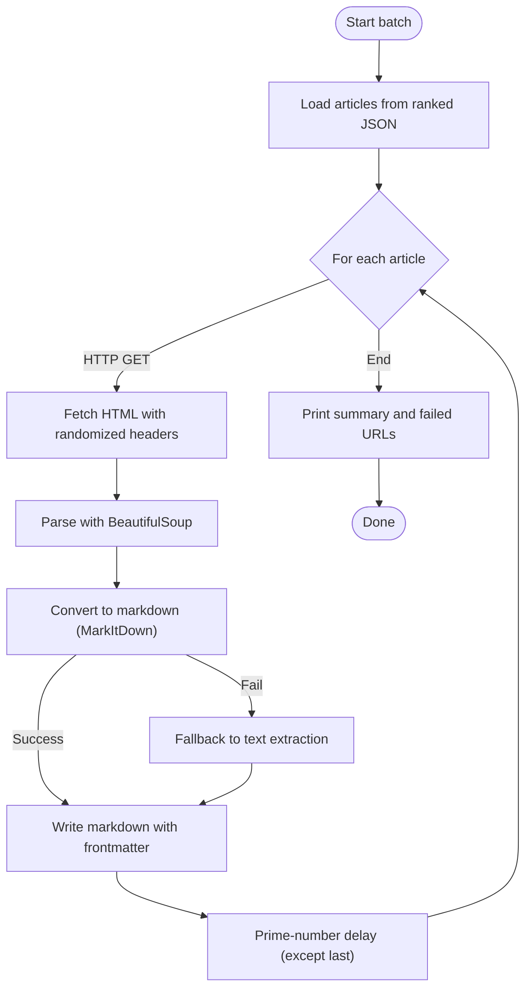
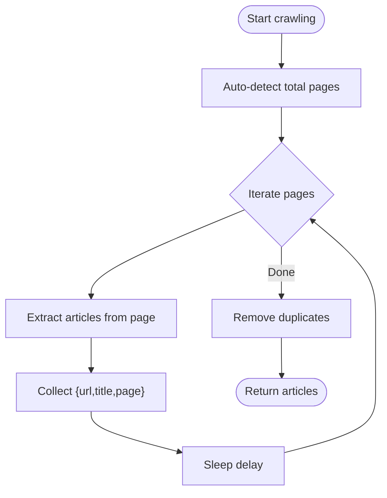
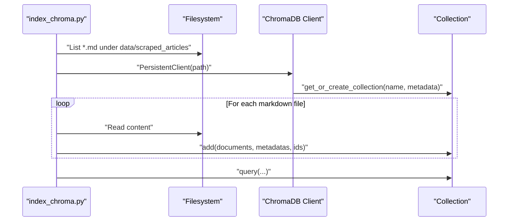
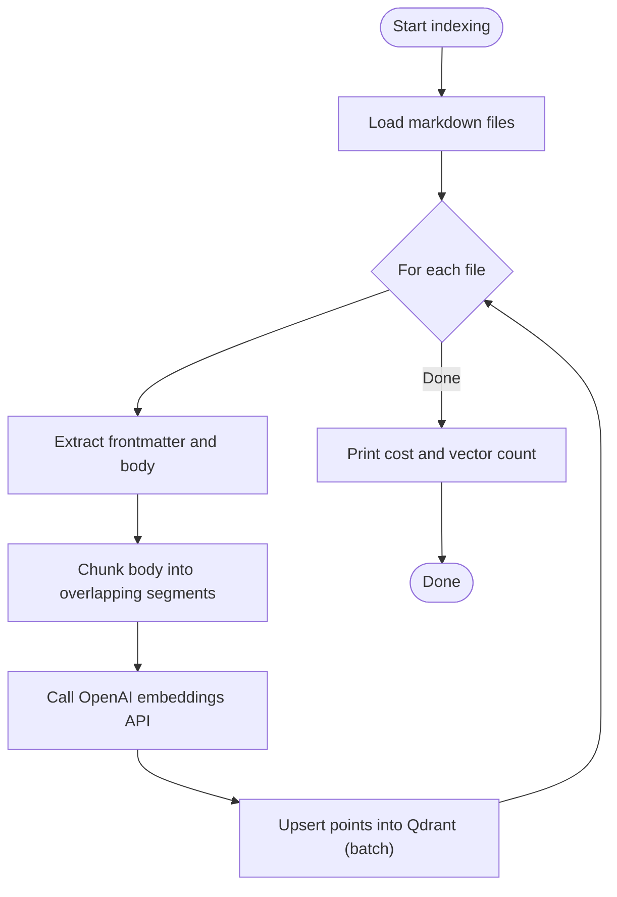
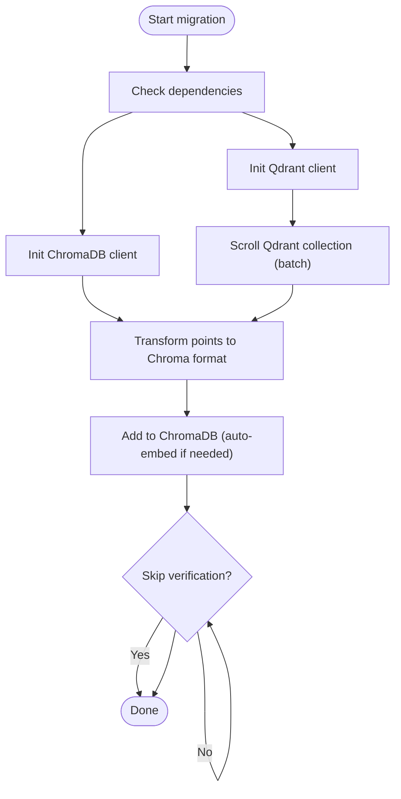
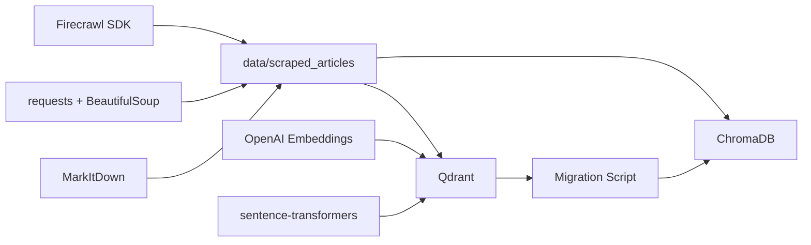

# Scripting Utilities

<cite>
**Referenced Files in This Document**
- [scraper.py](file://scripts/scraper.py)
- [firecrawl_scraper.py](file://scripts/firecrawl_scraper.py)
- [category_crawler.py](file://scripts/category_crawler.py)
- [index_chroma.py](file://scripts/index_chroma.py)
- [index_openai.py](file://scripts/index_openai.py)
- [migrate_qdrant_to_chroma.py](file://scripts/migrate_qdrant_to_chroma.py)
- [setup-kb-hooks.sh](file://scripts/setup-kb-hooks.sh)
- [kb-start.sh](file://scripts/kb-start.sh)
- [kb.sh](file://scripts/kb.sh)
- [index_to_qdrant.py](file://scripts/index_to_qdrant.py)
- [simple_scraper.py](file://scripts/simple_scraper.py)
- [SCRAPER_USAGE.md](file://scripts/SCRAPER_USAGE.md)
- [FIRECRAWL_USAGE.md](file://scripts/FIRECRAWL_USAGE.md)
- [CATEGORY_CRAWLER_USAGE.md](file://scripts/CATEGORY_CRAWLER_USAGE.md)
</cite>

## Table of Contents
1. [Introduction](#introduction)
2. [Project Structure](#project-structure)
3. [Core Components](#core-components)
4. [Architecture Overview](#architecture-overview)
5. [Detailed Component Analysis](#detailed-component-analysis)
6. [Dependency Analysis](#dependency-analysis)
7. [Performance Considerations](#performance-considerations)
8. [Troubleshooting Guide](#troubleshooting-guide)
9. [Conclusion](#conclusion)
10. [Appendices](#appendices)

## Introduction
This document describes the Scripting Utilities suite used to automate knowledge acquisition and indexing for the QuantMindX project. It covers:
- Web scraping automation scripts for collecting MQL5 articles via Firecrawl and general HTTP-based approaches
- Content discovery via systematic category crawling
- Knowledge base indexing utilities for ChromaDB and OpenAI-backed Qdrant
- Migration utilities to convert from Qdrant to ChromaDB
- Setup and maintenance scripts for knowledge base hooks and server lifecycle
- Practical execution examples, CLI usage, configuration, and error handling strategies

## Project Structure
The Scripting Utilities live under the scripts/ directory and are organized by functional area:
- Scrapers: general-purpose and AI-powered crawlers
- Indexers: ChromaDB and OpenAI/Qdrant integrations
- Migrations: data conversion between vector stores
- Setup and maintenance: shell scripts for hooks and server management
- Usage guides: markdown documents for each major script

**Diagram sources**
- [scraper.py](file://scripts/scraper.py#L1-L272)
- [firecrawl_scraper.py](file://scripts/firecrawl_scraper.py#L1-L286)
- [simple_scraper.py](file://scripts/simple_scraper.py#L1-L256)
- [category_crawler.py](file://scripts/category_crawler.py#L1-L229)
- [index_chroma.py](file://scripts/index_chroma.py#L1-L79)
- [index_openai.py](file://scripts/index_openai.py#L1-L149)
- [index_to_qdrant.py](file://scripts/index_to_qdrant.py#L1-L182)
- [migrate_qdrant_to_chroma.py](file://scripts/migrate_qdrant_to_chroma.py#L1-L303)
- [setup-kb-hooks.sh](file://scripts/setup-kb-hooks.sh#L1-L49)
- [kb-start.sh](file://scripts/kb-start.sh#L1-L27)
- [kb.sh](file://scripts/kb.sh#L1-L95)

**Section sources**
- [scraper.py](file://scripts/scraper.py#L1-L272)
- [firecrawl_scraper.py](file://scripts/firecrawl_scraper.py#L1-L286)
- [category_crawler.py](file://scripts/category_crawler.py#L1-L229)
- [index_chroma.py](file://scripts/index_chroma.py#L1-L79)
- [index_openai.py](file://scripts/index_openai.py#L1-L149)
- [index_to_qdrant.py](file://scripts/index_to_qdrant.py#L1-L182)
- [migrate_qdrant_to_chroma.py](file://scripts/migrate_qdrant_to_chroma.py#L1-L303)
- [setup-kb-hooks.sh](file://scripts/setup-kb-hooks.sh#L1-L49)
- [kb-start.sh](file://scripts/kb-start.sh#L1-L27)
- [kb.sh](file://scripts/kb.sh#L1-L95)

## Core Components
- General-purpose scraper: extracts MQL5 articles with series detection and saves structured markdown
- Firecrawl-powered scraper: batch-scrapes ranked articles with rate-limit handling and resume capability
- Category crawler: discovers article links from category pages for systematic coverage
- ChromaDB indexer: lightweight vector storage with cosine similarity
- OpenAI/Qdrant indexer: chunking and embedding for semantic search
- Migration utility: converts Qdrant data to ChromaDB format
- Setup and maintenance: shell scripts for directory hooks and MCP server lifecycle

**Section sources**
- [scraper.py](file://scripts/scraper.py#L18-L243)
- [firecrawl_scraper.py](file://scripts/firecrawl_scraper.py#L35-L242)
- [category_crawler.py](file://scripts/category_crawler.py#L14-L205)
- [index_chroma.py](file://scripts/index_chroma.py#L18-L76)
- [index_openai.py](file://scripts/index_openai.py#L27-L144)
- [index_to_qdrant.py](file://scripts/index_to_qdrant.py#L32-L179)
- [migrate_qdrant_to_chroma.py](file://scripts/migrate_qdrant_to_chroma.py#L40-L298)
- [setup-kb-hooks.sh](file://scripts/setup-kb-hooks.sh#L7-L48)
- [kb-start.sh](file://scripts/kb-start.sh#L8-L26)
- [kb.sh](file://scripts/kb.sh#L22-L94)

## Architecture Overview
The system follows a pipeline: discovery → scraping → indexing → querying. Discovery can be via category crawling or exported lists. Scraping uses either Firecrawl or HTTP-based methods. Indexing targets ChromaDB or Qdrant/OpenAI embeddings. Migration supports moving from Qdrant to ChromaDB.

**Diagram sources**
- [category_crawler.py](file://scripts/category_crawler.py#L128-L205)
- [scraper.py](file://scripts/scraper.py#L217-L243)
- [firecrawl_scraper.py](file://scripts/firecrawl_scraper.py#L196-L242)
- [simple_scraper.py](file://scripts/simple_scraper.py#L187-L234)
- [index_chroma.py](file://scripts/index_chroma.py#L27-L64)
- [index_to_qdrant.py](file://scripts/index_to_qdrant.py#L79-L162)
- [index_openai.py](file://scripts/index_openai.py#L87-L144)

## Detailed Component Analysis

### Web Scraping Automation Scripts

#### General Content Extraction: scraper.py
- Purpose: Scrape MQL5 articles using Firecrawl, detect multi-part series, and save structured markdown with metadata
- Key features:
  - Series detection via regex patterns for “Part N”, “Chapter N”, etc.
  - Related parts discovery by scanning article content for links
  - Safe filename generation and category-based directory layout
  - Batch processing from exported JSON
- Error handling: returns structured result with success flag and error messages; logs failures
- Output: markdown files under data/markdown/{category}/ with frontmatter containing URL, series info, and related parts

**Diagram sources**
- [scraper.py](file://scripts/scraper.py#L18-L243)

**Section sources**
- [scraper.py](file://scripts/scraper.py#L18-L243)
- [SCRAPER_USAGE.md](file://scripts/SCRAPER_USAGE.md#L1-L87)

#### AI-Powered Crawling: firecrawl_scraper.py
- Purpose: Batch scrape ranked MQL5 articles using Firecrawl SDK with rate-limit handling and resume support
- Key features:
  - CLI arguments for batch size, start index, and optional API key
  - Automatic rate-limit retry with wait time extraction from error messages
  - Resume capability by skipping already scraped files
  - Structured markdown output with YAML frontmatter
  - Logging of failed URLs to data/logs
- Execution model: runs a fixed-size batch from a ranked list, sleeping between requests to avoid throttling

**Diagram sources**
- [firecrawl_scraper.py](file://scripts/firecrawl_scraper.py#L38-L242)

**Section sources**
- [firecrawl_scraper.py](file://scripts/firecrawl_scraper.py#L35-L242)
- [FIRECRAWL_USAGE.md](file://scripts/FIRECRAWL_USAGE.md#L1-L183)

#### HTTP-Based Lightweight Scraper: simple_scraper.py
- Purpose: Lightweight scraping using requests + BeautifulSoup + MarkItDown for robust markdown conversion
- Key features:
  - Prime-number delays and rotating user agents to reduce bot detection
  - Fallback to text extraction if markdown conversion fails
  - Structured markdown with YAML frontmatter
  - Batch processing with progress and failure logging

**Diagram sources**
- [simple_scraper.py](file://scripts/simple_scraper.py#L83-L234)

**Section sources**
- [simple_scraper.py](file://scripts/simple_scraper.py#L59-L234)

#### Content Discovery: category_crawler.py
- Purpose: Discover article links systematically from MQL5 category pages
- Key features:
  - Extracts article links from category pages with multiple selector strategies
  - Auto-detects total pages via pagination or page number links
  - Builds paginated URLs and collects articles with page metadata
  - Supports single-category and multi-category crawling
- Output: list of {url, title, page} suitable for feeding scrapers

**Diagram sources**
- [category_crawler.py](file://scripts/category_crawler.py#L128-L205)

**Section sources**
- [category_crawler.py](file://scripts/category_crawler.py#L14-L205)
- [CATEGORY_CRAWLER_USAGE.md](file://scripts/CATEGORY_CRAWLER_USAGE.md#L1-L114)

### Knowledge Base Indexing Utilities

#### ChromaDB Integration: index_chroma.py
- Purpose: Lightweight indexing into ChromaDB without heavy ML dependencies
- Features:
  - Persistent client with cosine similarity space
  - Adds documents with metadata (title, file_path, categories)
  - Includes a small search test at the end
- Typical workflow: run after scraping to populate ChromaDB

**Diagram sources**
- [index_chroma.py](file://scripts/index_chroma.py#L23-L76)

**Section sources**
- [index_chroma.py](file://scripts/index_chroma.py#L18-L76)

#### OpenAI Embeddings with Qdrant: index_openai.py
- Purpose: Generate embeddings via OpenAI and upsert into Qdrant for semantic search
- Features:
  - Frontmatter parsing and text chunking with overlap
  - UUID-based IDs derived from text hashes
  - Batch upserts with configurable batch size
  - Cost estimation based on token counts
- Typical workflow: run after scraping to create OpenAI-backed Qdrant collection

**Diagram sources**
- [index_openai.py](file://scripts/index_openai.py#L72-L146)

**Section sources**
- [index_openai.py](file://scripts/index_openai.py#L27-L146)

#### Legacy Qdrant Indexer: index_to_qdrant.py
- Purpose: Sentence-transformers-based indexing into Qdrant for semantic search
- Features:
  - SentenceTransformer model loading
  - Overlapping chunking for improved recall
  - UUID-based IDs and batched upserts
  - Post-indexing search test

**Section sources**
- [index_to_qdrant.py](file://scripts/index_to_qdrant.py#L32-L179)

#### Migration: Qdrant to ChromaDB
- Purpose: Convert existing Qdrant mql5_knowledge collection to ChromaDB
- Features:
  - Validates dependencies (qdrant-client, chromadb)
  - Scrolls Qdrant collection in batches
  - Transforms payload to ChromaDB-compatible format
  - Optional dry-run and post-migration verification
  - Lets ChromaDB auto-generate embeddings if vectors are missing

**Diagram sources**
- [migrate_qdrant_to_chroma.py](file://scripts/migrate_qdrant_to_chroma.py#L231-L298)

**Section sources**
- [migrate_qdrant_to_chroma.py](file://scripts/migrate_qdrant_to_chroma.py#L40-L298)

### Setup and Maintenance Scripts

#### Directory Hooks: setup-kb-hooks.sh
- Purpose: Install shell hooks to auto-start the knowledge base when entering the project directory
- Behavior:
  - Detects zsh or bash
  - Appends sourcing of .env.sh to shell config if not present
  - Provides next steps and verification command

**Section sources**
- [setup-kb-hooks.sh](file://scripts/setup-kb-hooks.sh#L7-L48)

#### MCP Server Startup: kb-start.sh
- Purpose: Start the MCP server process when the directory hook triggers
- Behavior:
  - Validates it is run from the correct project directory
  - Checks if server is already running
  - Starts server in background and logs to data/logs

**Section sources**
- [kb-start.sh](file://scripts/kb-start.sh#L8-L26)

#### Knowledge Base Manager: kb.sh
- Purpose: Command-line manager for knowledge base operations
- Commands:
  - index: run the Qdrant indexer
  - start: start the MCP server
  - status: list collections and point counts
  - search: semantic search using sentence-transformers and Qdrant
  - help: usage guide

**Section sources**
- [kb.sh](file://scripts/kb.sh#L22-L94)

## Dependency Analysis
- External SDKs and libraries:
  - Firecrawl SDK for AI-powered scraping
  - Requests + BeautifulSoup for lightweight scraping
  - ChromaDB for persistent vector storage
  - Qdrant client and sentence-transformers or OpenAI embeddings
  - MarkItDown for HTML-to-markdown conversion
- Internal dependencies:
  - Scraper outputs are consumed by indexers
  - Indexers feed vector databases
  - Migration consumes Qdrant and produces ChromaDB artifacts
  - Shell scripts orchestrate lifecycle and environment

**Diagram sources**
- [firecrawl_scraper.py](file://scripts/firecrawl_scraper.py#L14-L14)
- [simple_scraper.py](file://scripts/simple_scraper.py#L16-L16)
- [index_chroma.py](file://scripts/index_chroma.py#L12-L16)
- [index_to_qdrant.py](file://scripts/index_to_qdrant.py#L18-L30)
- [index_openai.py](file://scripts/index_openai.py#L15-L25)
- [migrate_qdrant_to_chroma.py](file://scripts/migrate_qdrant_to_chroma.py#L24-L37)

**Section sources**
- [firecrawl_scraper.py](file://scripts/firecrawl_scraper.py#L14-L14)
- [simple_scraper.py](file://scripts/simple_scraper.py#L16-L16)
- [index_chroma.py](file://scripts/index_chroma.py#L12-L16)
- [index_to_qdrant.py](file://scripts/index_to_qdrant.py#L18-L30)
- [index_openai.py](file://scripts/index_openai.py#L15-L25)
- [migrate_qdrant_to_chroma.py](file://scripts/migrate_qdrant_to_chroma.py#L24-L37)

## Performance Considerations
- Rate limiting:
  - Firecrawl scraper includes automatic retry with wait time extraction and bounded retries
  - Simple scraper uses prime-number delays and randomized user agents to reduce detection
- Batch sizes:
  - Firecrawl free tier caps monthly pages; batch accordingly
  - Qdrant and ChromaDB upserts are batched to reduce overhead
- Embedding costs:
  - OpenAI embeddings cost depends on token counts; consider chunk size tuning
- Disk I/O:
  - Prefer category crawling to reduce manual work and improve coverage
  - Use resume capability to avoid rework on partial failures

[No sources needed since this section provides general guidance]

## Troubleshooting Guide
- Missing dependencies:
  - Install required packages as indicated by import checks in indexers and setup-kb-hooks.sh
- API keys:
  - Firecrawl key required for AI-powered scraping; ensure environment variable or CLI argument is provided
  - OpenAI key required for OpenAI indexer
- Permission errors:
  - Ensure write permissions to data/scraped_articles and data/logs
- Rate limits:
  - Firecrawl scraper handles rate limits automatically; monitor logs for retry messages
  - Simple scraper applies prime-number delays; adjust batch size if throttled
- Migration safety:
  - Use dry-run mode to preview migration; confirm overwrite behavior for existing ChromaDB collections

**Section sources**
- [index_chroma.py](file://scripts/index_chroma.py#L12-L16)
- [index_openai.py](file://scripts/index_openai.py#L14-L25)
- [firecrawl_scraper.py](file://scripts/firecrawl_scraper.py#L58-L60)
- [simple_scraper.py](file://scripts/simple_scraper.py#L178-L185)
- [migrate_qdrant_to_chroma.py](file://scripts/migrate_qdrant_to_chroma.py#L243-L251)

## Conclusion
The Scripting Utilities provide a complete pipeline for acquiring, organizing, and indexing MQL5 knowledge. They offer flexible scraping strategies, robust indexing into modern vector databases, and operational scripts for lifecycle management. By combining category crawling, AI-powered scraping, and migration tools, teams can maintain a scalable and searchable knowledge base tailored to trading and expert advisor development.

[No sources needed since this section summarizes without analyzing specific files]

## Appendices

### Practical Execution Examples and Workflows
- General scraping workflow:
  - Crawl categories or export article lists
  - Run scraper to produce markdown with metadata
  - Index into ChromaDB or Qdrant/OpenAI
- Firecrawl batch strategy:
  - Split large ranked lists into batches respecting free-tier limits
  - Use resume capability to handle interruptions
- Migration:
  - Dry-run to preview changes
  - Verify post-migration counts and search results

**Section sources**
- [SCRAPER_USAGE.md](file://scripts/SCRAPER_USAGE.md#L21-L87)
- [FIRECRAWL_USAGE.md](file://scripts/FIRECRAWL_USAGE.md#L45-L183)
- [CATEGORY_CRAWLER_USAGE.md](file://scripts/CATEGORY_CRAWLER_USAGE.md#L7-L114)
- [migrate_qdrant_to_chroma.py](file://scripts/migrate_qdrant_to_chroma.py#L231-L298)