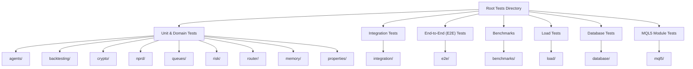
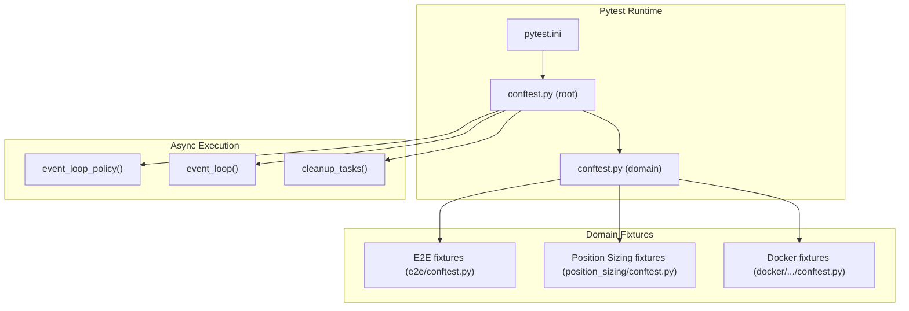
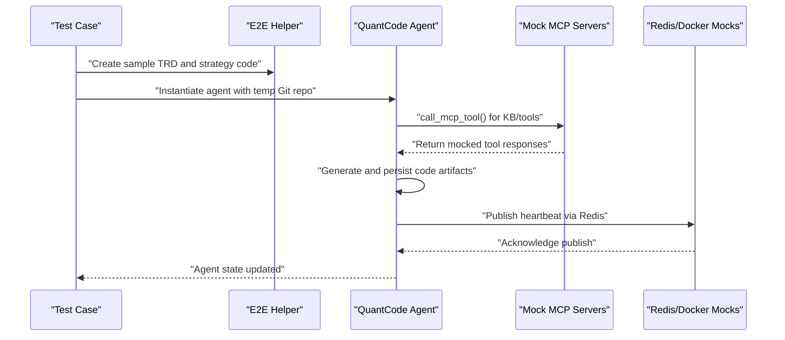
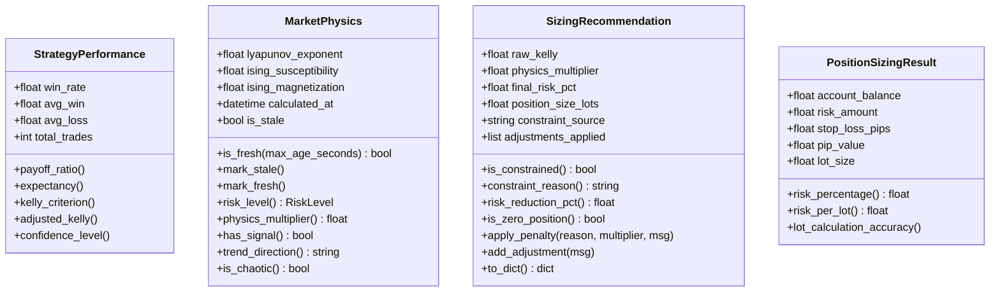
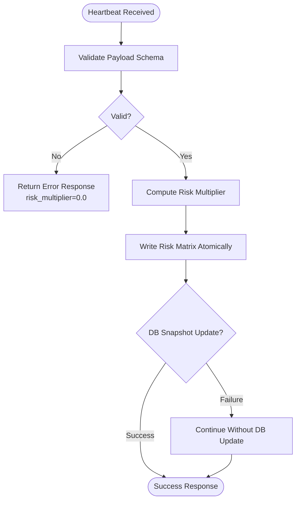
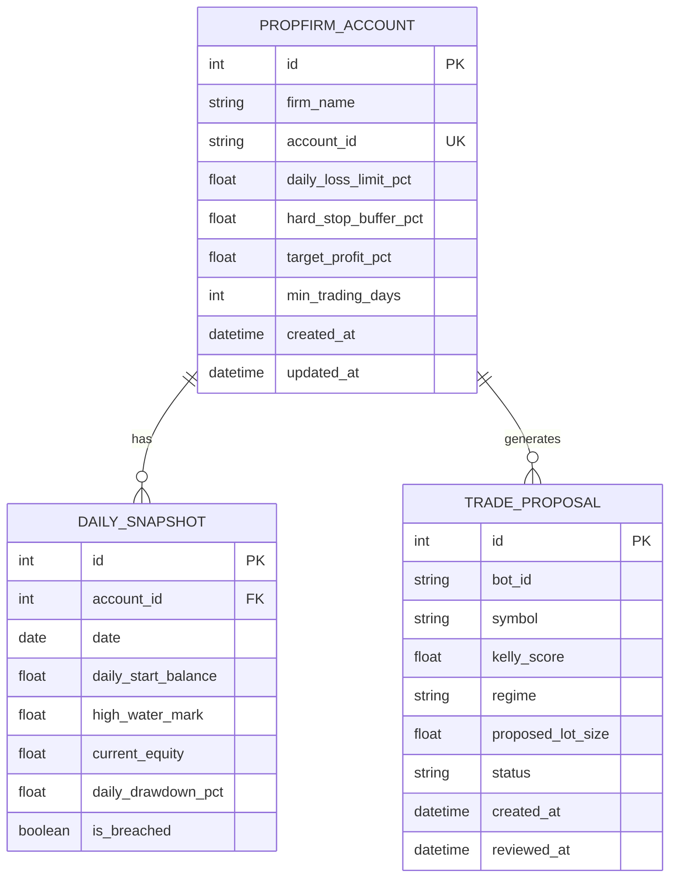
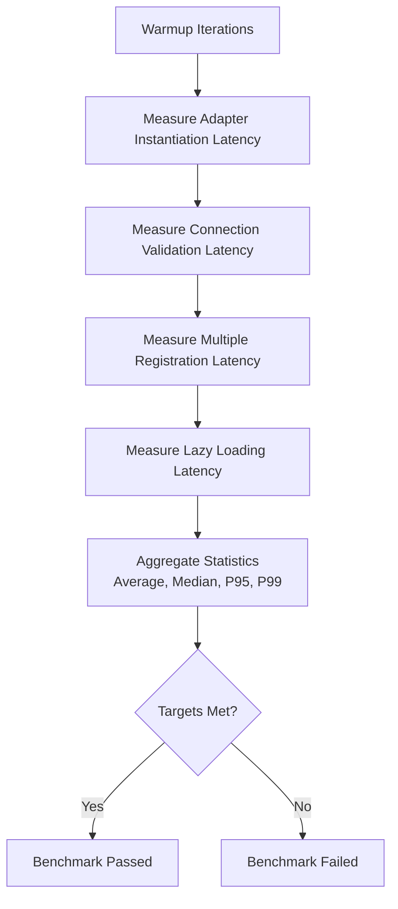

# Testing Framework

<cite>
**Referenced Files in This Document**
- [pytest.ini](file://pytest.ini)
- [conftest.py](file://conftest.py)
- [tests/conftest.py](file://tests/conftest.py)
- [tests/e2e/conftest.py](file://tests/e2e/conftest.py)
- [tests/position_sizing/conftest.py](file://tests/position_sizing/conftest.py)
- [tests/test_risk_models.py](file://tests/test_risk_models.py)
- [tests/benchmarks/test_broker_registry_benchmark.py](file://tests/benchmarks/test_broker_registry_benchmark.py)
- [tests/load/test_multi_broker_concurrent.py](file://tests/load/test_multi_broker_concurrent.py)
- [tests/integration/test_mql5_python_bridge.py](file://tests/integration/test_mql5_python_bridge.py)
- [tests/database/test_sqlite_models.py](file://tests/database/test_sqlite_models.py)
- [tests/mql5/test_kellysizer.py](file://tests/mql5/test_kellysizer.py)
- [docker/strategy-agent/tests/conftest.py](file://docker/strategy-agent/tests/conftest.py)
- [docker/strategy-agent/src/agent/main.py](file://docker/strategy-agent/src/agent/main.py)
</cite>

## Table of Contents
1. [Introduction](#introduction)
2. [Project Structure](#project-structure)
3. [Core Components](#core-components)
4. [Architecture Overview](#architecture-overview)
5. [Detailed Component Analysis](#detailed-component-analysis)
6. [Dependency Analysis](#dependency-analysis)
7. [Performance Considerations](#performance-considerations)
8. [Troubleshooting Guide](#troubleshooting-guide)
9. [Conclusion](#conclusion)
10. [Appendices](#appendices)

## Introduction
This document describes the Testing Framework for the QuantMindX project. It covers pytest configuration, test organization, shared fixtures, test categories (unit, integration, end-to-end), specialized modules (risk models, MQL5 integration, database, performance), execution strategies, coverage reporting, CI setup, and practical guidance for writing, running, and interpreting tests. It also includes mocking strategies, test data management, and debugging techniques for test failures.

## Project Structure
The repository organizes tests by functional domain under a top-level tests directory. Each domain may include its own conftest.py for shared fixtures and markers. There are also specialized suites such as benchmarks, load tests, and end-to-end tests.

**Diagram sources**
- [tests/](file://tests/)
- [tests/integration/](file://tests/integration/)
- [tests/e2e/](file://tests/e2e/)
- [tests/benchmarks/](file://tests/benchmarks/)
- [tests/load/](file://tests/load/)
- [tests/database/](file://tests/database/)
- [tests/mql5/](file://tests/mql5/)

**Section sources**
- [tests/](file://tests/)

## Core Components
- pytest configuration and markers are centralized in pytest.ini and global conftest.py.
- Shared fixtures and markers are defined at the root and domain levels.
- Specialized suites include benchmarks, load tests, and E2E tests with dedicated fixtures.

Key configuration highlights:
- Discovery patterns: test_* files/classes/functions.
- Asyncio mode: auto.
- Markers: slow, integration, load, property, asyncio.
- Coverage: source/src, omit tests and caches.
- Console output: progress style, verbose, short traceback, strict markers, disable warnings.

Global fixtures and behaviors:
- Event loop policy and session-scoped event loop for async tests.
- Cleanup of pending asyncio tasks after each test.
- Suppression of specific deprecation and resource warnings.
- Automatic slow marker assignment for load and e2e tests.

**Section sources**
- [pytest.ini](file://pytest.ini#L1-L53)
- [conftest.py](file://conftest.py#L1-L75)
- [tests/conftest.py](file://tests/conftest.py#L1-L8)

## Architecture Overview
The testing architecture integrates pytest plugins, shared fixtures, and domain-specific fixtures. Async tests leverage pytest-asyncio with consistent event loops. E2E tests orchestrate external systems (Git, Redis, Docker) via mocks and temporary directories. Benchmarks and load tests validate performance and concurrency characteristics.

**Diagram sources**
- [pytest.ini](file://pytest.ini#L1-L53)
- [conftest.py](file://conftest.py#L31-L75)
- [tests/e2e/conftest.py](file://tests/e2e/conftest.py#L1-L462)
- [tests/position_sizing/conftest.py](file://tests/position_sizing/conftest.py#L1-L254)
- [docker/strategy-agent/tests/conftest.py](file://docker/strategy-agent/tests/conftest.py#L1-L67)

## Detailed Component Analysis

### Pytest Configuration and Global Conftest
- Centralizes markers and output behavior.
- Registers asyncio support and adds slow markers for load/e2e tests.
- Sets up warnings filtering and event loop policies.

Practical usage:
- Run with verbose output and short tracebacks.
- Use markers to deselect slow tests or select integration tests.

**Section sources**
- [pytest.ini](file://pytest.ini#L1-L53)
- [conftest.py](file://conftest.py#L11-L75)

### Domain-Level Conftests
- Root tests/conftest.py registers router, slow, and benchmark markers.
- E2E conftest.py provides helpers for TRD generation, strategy code, backtest results, deployment configs, Git repos, Redis and Docker mocks, MCP server mocks, and agent state fixtures.
- Position Sizing conftest.py provides benchmark stub, configuration fixtures, trade history fixtures, market state fixtures, calculator/analyzer instances, and marker registration for kelly, analyzer, portfolio, edge_case, performance, integration.

**Section sources**
- [tests/conftest.py](file://tests/conftest.py#L1-L8)
- [tests/e2e/conftest.py](file://tests/e2e/conftest.py#L1-L462)
- [tests/position_sizing/conftest.py](file://tests/position_sizing/conftest.py#L1-L254)

### Test Categories and Organization

#### Unit Tests
- Focus on isolated components and models.
- Examples:
  - Risk models validation and calculations: [tests/test_risk_models.py](file://tests/test_risk_models.py#L1-L901)
  - Database SQLAlchemy models and relationships: [tests/database/test_sqlite_models.py](file://tests/database/test_sqlite_models.py#L1-L351)
  - MQL5 Kelly criterion and lot sizing logic: [tests/mql5/test_kellysizer.py](file://tests/mql5/test_kellysizer.py#L1-L380)

Execution tips:
- Use domain-specific fixtures to minimize setup overhead.
- Validate edge cases and boundary conditions.

**Section sources**
- [tests/test_risk_models.py](file://tests/test_risk_models.py#L1-L901)
- [tests/database/test_sqlite_models.py](file://tests/database/test_sqlite_models.py#L1-L351)
- [tests/mql5/test_kellysizer.py](file://tests/mql5/test_kellysizer.py#L1-L380)

#### Integration Tests
- Validate cross-module interactions and real-world workflows.
- Examples:
  - MQL5-Python bridge end-to-end heartbeat processing, atomic file writes, error handling, and global variable updates: [tests/integration/test_mql5_python_bridge.py](file://tests/integration/test_mql5_python_bridge.py#L1-L328)

Execution tips:
- Mock external dependencies (MT5, databases) to isolate integration points.
- Verify graceful degradation and fallback mechanisms.

**Section sources**
- [tests/integration/test_mql5_python_bridge.py](file://tests/integration/test_mql5_python_bridge.py#L1-L328)

#### End-to-End (E2E) Tests
- Orchestrate full workflows across subsystems.
- E2E fixtures include TRD generation, strategy code, backtest result mocks, deployment configs, temporary Git repos, Redis/Docker mocks, MCP server mocks, and agent state fixtures.
- Example workflow: TRD ingestion -> code generation -> backtest -> deployment -> monitoring.

**Diagram sources**
- [tests/e2e/conftest.py](file://tests/e2e/conftest.py#L151-L444)

**Section sources**
- [tests/e2e/conftest.py](file://tests/e2e/conftest.py#L1-L462)

### Specialized Test Modules

#### Risk Model Testing
- Pydantic models validation and derived computations:
  - StrategyPerformance: win rate bounds, payoff ratio, expectancy, Kelly criterion, confidence levels.
  - MarketPhysics: Lyapunov exponent, Ising magnetization/susceptibility, freshness checks, risk level computation, signal detection.
  - SizingRecommendation: constraint tracking, risk reduction percentage, penalty application, serialization.
  - PositionSizingResult: risk percentage, risk per lot, lot calculation accuracy, margin validations.

**Diagram sources**
- [tests/test_risk_models.py](file://tests/test_risk_models.py#L17-L23)

**Section sources**
- [tests/test_risk_models.py](file://tests/test_risk_models.py#L1-L901)

#### MQL5 Integration Tests
- Validate end-to-end heartbeat workflow, atomic file writes, error handling, circuit breaker behavior, global variable updates, and file watcher integration.

**Diagram sources**
- [tests/integration/test_mql5_python_bridge.py](file://tests/integration/test_mql5_python_bridge.py#L44-L128)

**Section sources**
- [tests/integration/test_mql5_python_bridge.py](file://tests/integration/test_mql5_python_bridge.py#L1-L328)

#### Database Connectivity Tests
- SQLAlchemy models validation, unique constraints, foreign keys, cascading deletes, and session lifecycle.

**Diagram sources**
- [tests/database/test_sqlite_models.py](file://tests/database/test_sqlite_models.py#L20-L21)

**Section sources**
- [tests/database/test_sqlite_models.py](file://tests/database/test_sqlite_models.py#L1-L351)

#### Performance Benchmarking
- Broker registry adapter instantiation and connection validation benchmarks with warmup, iteration counts, and percentile statistics.
- Targets: <100ms average latency for instantiation/validation; P95 < 200ms.

**Diagram sources**
- [tests/benchmarks/test_broker_registry_benchmark.py](file://tests/benchmarks/test_broker_registry_benchmark.py#L84-L275)

**Section sources**
- [tests/benchmarks/test_broker_registry_benchmark.py](file://tests/benchmarks/test_broker_registry_benchmark.py#L1-L712)

#### Load Testing
- Multi-broker concurrent trading scenarios, connection pooling, resource management, adapter consistency, and mixed operation throughput.
- Targets: high throughput with >95% success rate and bounded latency.

**Section sources**
- [tests/load/test_multi_broker_concurrent.py](file://tests/load/test_multi_broker_concurrent.py#L1-L747)

#### Docker and Security Tests
- Docker availability checks, container cleanup, and security-related markers.
- Example agent main module included for container runtime verification.

**Section sources**
- [docker/strategy-agent/tests/conftest.py](file://docker/strategy-agent/tests/conftest.py#L1-L67)
- [docker/strategy-agent/src/agent/main.py](file://docker/strategy-agent/src/agent/main.py#L1-L16)

## Dependency Analysis
- Global conftest.py depends on pytest-asyncio and registers markers and event loop policies.
- Domain conftests depend on project modules and provide fixtures for their domains.
- E2E conftest.py orchestrates external systems via mocks and temporary directories.
- Benchmarks and load tests depend on performance-sensitive modules and require careful resource management.

```mermaid
graph TB
RootConf["conftest.py (root)"] --> Plugins["pytest-asyncio"]
RootConf --> Markers["Markers: slow, integration, load, property"]
RootConf --> Loop["Event Loop Policy & Session Loop"]
RootConf --> Cleanup["Cleanup Pending Tasks"]
E2EConf["e2e/conftest.py"] --> Helpers["E2E Helper Utilities"]
E2EConf --> Mocks["Redis/Docker/MCP Mocks"]
E2EConf --> AgentFix["Agent State Fixtures"]
PSConf["position_sizing/conftest.py"] --> BenchStub["Benchmark Stub"]
PSConf --> Configs["Enhanced Kelly Configs"]
PSConf --> Hist["Trade History Fixtures"]
PSConf --> States["Market State Fixtures"]
PSConf --> Calc["Calculator/Analyzer Instances"]
```

**Diagram sources**
- [conftest.py](file://conftest.py#L11-L75)
- [tests/e2e/conftest.py](file://tests/e2e/conftest.py#L151-L462)
- [tests/position_sizing/conftest.py](file://tests/position_sizing/conftest.py#L26-L254)

**Section sources**
- [conftest.py](file://conftest.py#L11-L75)
- [tests/e2e/conftest.py](file://tests/e2e/conftest.py#L151-L462)
- [tests/position_sizing/conftest.py](file://tests/position_sizing/conftest.py#L26-L254)

## Performance Considerations
- Use pytest.ini markers to exclude slow tests during regular runs.
- Leverage domain-specific fixtures to reduce setup time.
- For benchmarks and load tests, configure warmup iterations and appropriate iteration counts.
- Monitor latency percentiles (P95/P99) to detect regressions.
- Ensure atomic file writes and proper resource cleanup to avoid contention.

[No sources needed since this section provides general guidance]

## Troubleshooting Guide
Common issues and resolutions:
- Freezing tests: pytest.ini supports timeout overrides; ensure timeouts are configured appropriately.
- Async test failures: verify event loop policy and session loop fixtures; cancel pending tasks after tests.
- Docker-dependent tests: skip when Docker is unavailable; clean up test containers post-run.
- Database constraint errors: review unique constraints and foreign keys; use transaction rollback on errors.
- MQL5 bridge failures: circuit breaker prevents cascading failures; fallback mechanisms continue operation.

Practical steps:
- Run with verbose output (-v) and short tracebacks (--tb=short).
- Selectively run subsets using markers: -m "integration" or -m "not slow".
- Use domain-specific fixtures to reproduce minimal failing scenarios.
- Inspect coverage reports and adjust omit patterns to include/exclude modules as needed.

**Section sources**
- [pytest.ini](file://pytest.ini#L12-L31)
- [conftest.py](file://conftest.py#L31-L75)
- [docker/strategy-agent/tests/conftest.py](file://docker/strategy-agent/tests/conftest.py#L36-L67)
- [tests/database/test_sqlite_models.py](file://tests/database/test_sqlite_models.py#L283-L321)
- [tests/integration/test_mql5_python_bridge.py](file://tests/integration/test_mql5_python_bridge.py#L148-L173)

## Conclusion
The QuantMindX Testing Framework leverages pytest’s extensibility to organize tests by domain, enforce markers and async behavior, and provide robust fixtures for E2E, integration, unit, benchmark, and load testing. By combining shared and domain-specific fixtures, the framework ensures reliable, reproducible, and performant validation across components, with clear strategies for mocking, test data management, and debugging.

[No sources needed since this section summarizes without analyzing specific files]

## Appendices

### Practical Examples

- Writing a new unit test for risk models:
  - Import the model under test.
  - Create fixtures for valid/invalid inputs.
  - Assert validation errors and computed properties.
  - Reference: [tests/test_risk_models.py](file://tests/test_risk_models.py#L26-L232)

- Writing a new integration test for MQL5 bridge:
  - Use HeartbeatHandler and DiskSyncer fixtures.
  - Mock external dependencies (DatabaseManager, MT5).
  - Validate atomic writes and error handling.
  - Reference: [tests/integration/test_mql5_python_bridge.py](file://tests/integration/test_mql5_python_bridge.py#L20-L128)

- Writing a new E2E test:
  - Use e2e_helper fixtures for TRD and strategy code.
  - Mock Redis/Docker/MCP servers.
  - Verify end-to-end workflow completion.
  - Reference: [tests/e2e/conftest.py](file://tests/e2e/conftest.py#L151-L444)

- Running test suites:
  - Run all tests: pytest
  - Run with verbose output: pytest -v
  - Select integration tests: pytest -m integration
  - Exclude slow tests: pytest -m "not slow"
  - Run benchmarks: pytest tests/benchmarks/ -v
  - Run load tests: pytest tests/load/ -m slow -v

- Interpreting results:
  - Short tracebacks (--tb=short) highlight failures quickly.
  - Coverage report excludes tests and caches; adjust omit patterns if needed.
  - For benchmarks, focus on average and P95 latencies.

**Section sources**
- [pytest.ini](file://pytest.ini#L24-L31)
- [tests/test_risk_models.py](file://tests/test_risk_models.py#L26-L232)
- [tests/integration/test_mql5_python_bridge.py](file://tests/integration/test_mql5_python_bridge.py#L20-L128)
- [tests/e2e/conftest.py](file://tests/e2e/conftest.py#L151-L444)