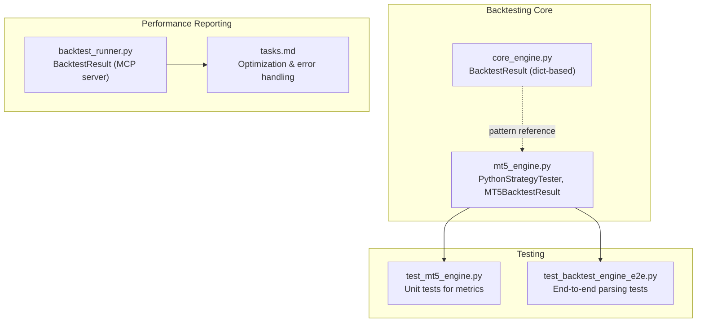
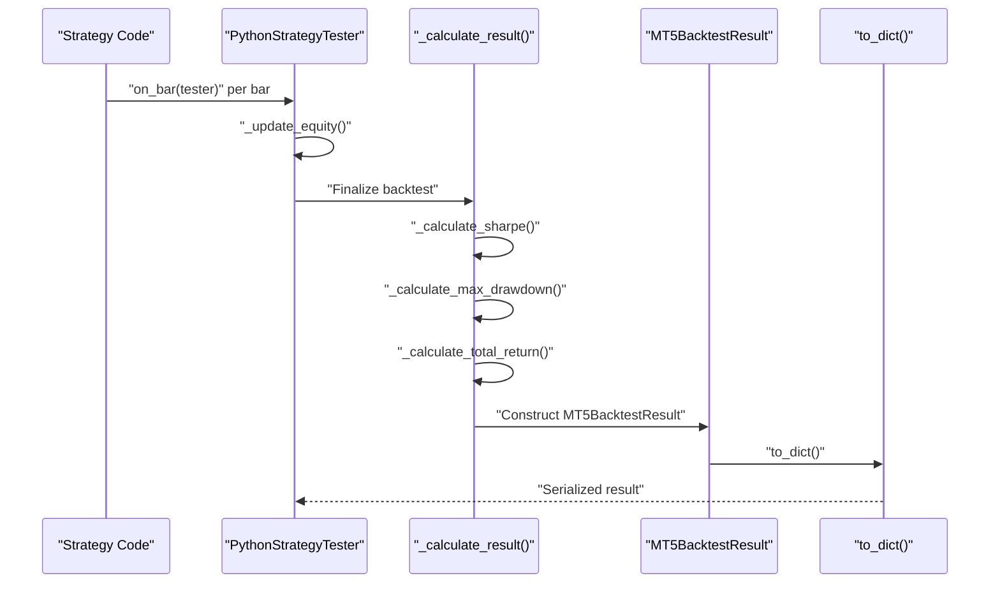
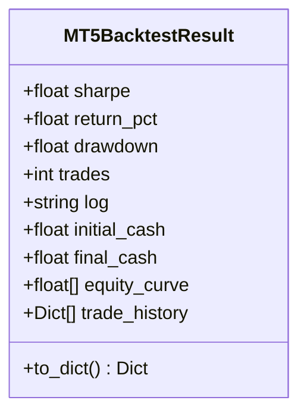
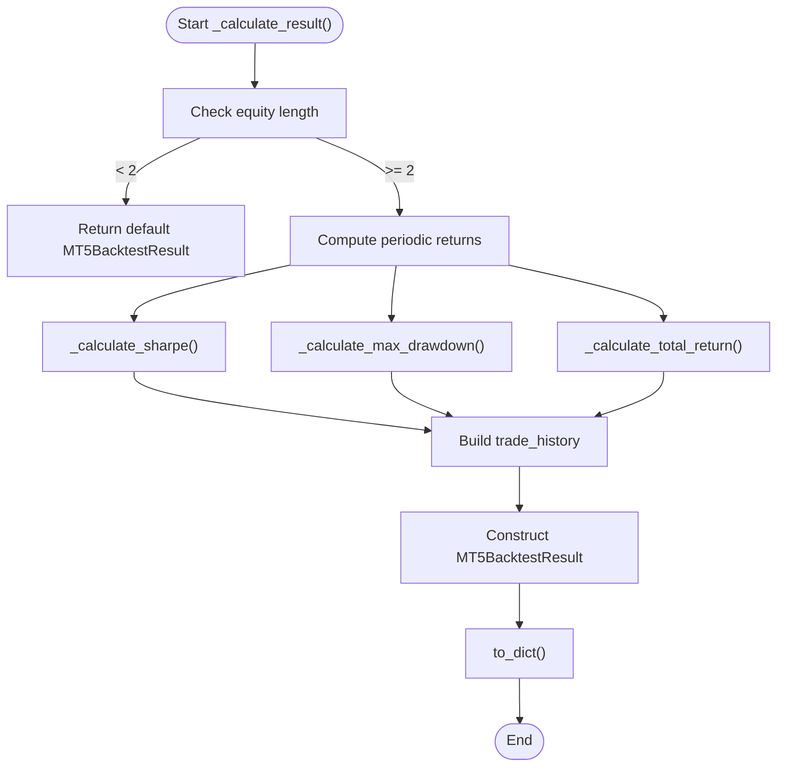
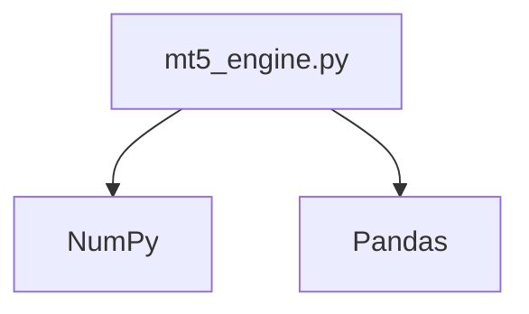

# Backtest Result Structure

<cite>
**Referenced Files in This Document**
- [mt5_engine.py](file://src/backtesting/mt5_engine.py)
- [core_engine.py](file://src/backtesting/core_engine.py)
- [test_mt5_engine.py](file://tests/backtesting/test_mt5_engine.py)
- [backtest_runner.py](file://mcp-servers/backtest-mcp-server/backtest_runner.py)
- [tasks.md](file://mcp-servers/backtest-mcp-server/tasks.md)
- [test_backtest_engine_e2e.py](file://tests/e2e/test_backtest_engine_e2e.py)
</cite>

## Table of Contents
1. [Introduction](#introduction)
2. [Project Structure](#project-structure)
3. [Core Components](#core-components)
4. [Architecture Overview](#architecture-overview)
5. [Detailed Component Analysis](#detailed-component-analysis)
6. [Dependency Analysis](#dependency-analysis)
7. [Performance Considerations](#performance-considerations)
8. [Troubleshooting Guide](#troubleshooting-guide)
9. [Conclusion](#conclusion)

## Introduction
This document focuses on the MT5BacktestResult dataclass that encapsulates comprehensive backtest performance metrics for the MetaTrader 5-based Python strategy tester. It explains the structure, serialization, metric calculation workflows, and integration with performance reporting systems. It also covers error handling, best practices for result analysis and comparison, and the relationship between raw data and computed metrics.

## Project Structure
The backtesting subsystem consists of:
- A Python-based strategy tester with MQL5 built-in function overloading
- A dataclass for structured backtest results
- Metric calculation helpers for Sharpe ratio, maximum drawdown, and total return
- Tests validating the result structure and metric computations
- An MCP server module that demonstrates integration with broader performance reporting

**Diagram sources**
- [mt5_engine.py](file://src/backtesting/mt5_engine.py#L89-L117)
- [core_engine.py](file://src/backtesting/core_engine.py#L8-L12)
- [test_mt5_engine.py](file://tests/backtesting/test_mt5_engine.py#L232-L279)
- [backtest_runner.py](file://mcp-servers/backtest-mcp-server/backtest_runner.py#L47-L57)
- [tasks.md](file://mcp-servers/backtest-mcp-server/tasks.md#L45-L67)

**Section sources**
- [mt5_engine.py](file://src/backtesting/mt5_engine.py#L89-L117)
- [core_engine.py](file://src/backtesting/core_engine.py#L8-L12)

## Core Components
- MT5BacktestResult: A dataclass that holds the final backtest outcome with fields for Sharpe ratio, return percentage, maximum drawdown, total trades, logs, initial and final cash balances, equity curve, and trade history.
- MT5BacktestResult.to_dict(): Serializes the result into a dictionary suitable for downstream consumption and reporting.
- Metric calculation helpers:
  - Sharpe ratio: Annualized excess return per unit of volatility
  - Maximum drawdown: Peak-to-trough decline as a percentage
  - Total return: Percentage change from initial to final equity

These components form the backbone of the result structure and enable structured performance analysis.

**Section sources**
- [mt5_engine.py](file://src/backtesting/mt5_engine.py#L89-L117)
- [mt5_engine.py](file://src/backtesting/mt5_engine.py#L907-L971)

## Architecture Overview
The backtesting pipeline produces MT5BacktestResult instances containing both raw and computed metrics. The result is serialized via to_dict() for integration with performance reporting systems.

**Diagram sources**
- [mt5_engine.py](file://src/backtesting/mt5_engine.py#L762-L781)
- [mt5_engine.py](file://src/backtesting/mt5_engine.py#L865-L905)
- [mt5_engine.py](file://src/backtesting/mt5_engine.py#L105-L117)

## Detailed Component Analysis

### MT5BacktestResult Dataclass
MT5BacktestResult is a compact, structured representation of a backtest run’s outcomes. It includes:
- sharpe: Annualized Sharpe ratio
- return_pct: Total return percentage
- drawdown: Maximum drawdown percentage
- trades: Total number of trades executed
- log: Aggregated log messages
- initial_cash: Starting cash balance
- final_cash: Ending cash balance
- equity_curve: Sequence of equity values over time
- trade_history: List of trade records

Serialization via to_dict() exposes a normalized dictionary shape for downstream consumers.

**Diagram sources**
- [mt5_engine.py](file://src/backtesting/mt5_engine.py#L89-L117)

**Section sources**
- [mt5_engine.py](file://src/backtesting/mt5_engine.py#L89-L117)

### Metric Calculation Workflows
The backtest result computation aggregates raw data and calculates performance metrics:

- Sharpe ratio:
  - Computes periodic returns from the equity curve
  - Removes NaN values and handles zero standard deviation
  - Annualizes the ratio assuming hourly data and a fixed scale
- Maximum drawdown:
  - Computes running peaks over the equity curve
  - Calculates drawdown percentages and returns the most negative value
- Total return:
  - Computes percentage change from initial to final equity

**Diagram sources**
- [mt5_engine.py](file://src/backtesting/mt5_engine.py#L865-L905)
- [mt5_engine.py](file://src/backtesting/mt5_engine.py#L907-L971)

**Section sources**
- [mt5_engine.py](file://src/backtesting/mt5_engine.py#L865-L905)
- [mt5_engine.py](file://src/backtesting/mt5_engine.py#L907-L971)

### Serialization and Integration
MT5BacktestResult.to_dict() provides a standardized dictionary for downstream systems:
- Keys include sharpe_ratio, return_pct, max_drawdown, total_trades, initial_cash, final_cash, log, equity_curve, and trade_history
- This structure enables consistent reporting and comparison across backtests

Integration examples:
- Unit tests demonstrate metric correctness and serialization behavior
- End-to-end tests validate that performance metrics are parsed and validated by higher-level systems

**Section sources**
- [mt5_engine.py](file://src/backtesting/mt5_engine.py#L105-L117)
- [test_mt5_engine.py](file://tests/backtesting/test_mt5_engine.py#L232-L279)
- [test_backtest_engine_e2e.py](file://tests/e2e/test_backtest_engine_e2e.py#L143-L161)

### Relationship Between Raw Data and Calculated Metrics
- Raw data: OHLCV bars and timestamps
- Intermediate state: equity curve built during backtest execution
- Computed metrics: Sharpe, drawdown, total return derived from the equity curve
- Trade history: Records of entries, exits, and realized PnL

This relationship ensures that metrics reflect the actual trading activity and market conditions embedded in the dataset.

**Section sources**
- [mt5_engine.py](file://src/backtesting/mt5_engine.py#L762-L781)
- [mt5_engine.py](file://src/backtesting/mt5_engine.py#L865-L905)

### Error Handling in Result Computation
- Graceful fallbacks:
  - If insufficient equity data is present, default MT5BacktestResult is returned with zeros and minimal fields
  - Strategy compilation or runtime errors are captured and logged
- Logging:
  - Internal logs capture errors and warnings during strategy execution and metric computation
- Integration-level error handling:
  - The MCP server wraps execution in try/catch blocks and returns structured error results with status and logs

**Section sources**
- [mt5_engine.py](file://src/backtesting/mt5_engine.py#L724-L760)
- [mt5_engine.py](file://src/backtesting/mt5_engine.py#L774-L776)
- [backtest_runner.py](file://mcp-servers/backtest-mcp-server/backtest_runner.py#L169-L206)

### Best Practices for Result Analysis and Comparison
- Normalize metric names and units across systems (e.g., use sharpe_ratio, max_drawdown, total_return consistently)
- Compare equity curves and trade histories for qualitative insights alongside quantitative metrics
- Validate initial and final cash balances to ensure no data leakage or incorrect assumptions
- Use Sharpe ratios for risk-adjusted performance comparisons; pair with drawdown to assess downside risk
- Track execution time and logs for reproducibility and debugging

**Section sources**
- [mt5_engine.py](file://src/backtesting/mt5_engine.py#L105-L117)
- [test_backtest_engine_e2e.py](file://tests/e2e/test_backtest_engine_e2e.py#L143-L161)

## Dependency Analysis
MT5BacktestResult depends on:
- PythonStrategyTester’s internal state (equity curve, trades, logs)
- NumPy for vectorized metric computations
- Pandas for data preparation and time handling

**Diagram sources**
- [mt5_engine.py](file://src/backtesting/mt5_engine.py#L17-L22)
- [mt5_engine.py](file://src/backtesting/mt5_engine.py#L783-L800)

**Section sources**
- [mt5_engine.py](file://src/backtesting/mt5_engine.py#L17-L22)
- [mt5_engine.py](file://src/backtesting/mt5_engine.py#L783-L800)

## Performance Considerations
- Vectorized metrics calculation:
  - The MCP server demonstrates vectorized extraction of Sharpe, drawdown, and other metrics using NumPy for improved performance
- Caching:
  - Data caching reduces repeated data generation overhead, accelerating backtest execution
- Logging and timeouts:
  - Execution timeouts and structured logs help manage long-running backtests and diagnose failures

**Section sources**
- [backtest_runner.py](file://mcp-servers/backtest-mcp-server/backtest_runner.py#L466-L499)
- [tasks.md](file://mcp-servers/backtest-mcp-server/tasks.md#L45-L67)
- [backtest_runner.py](file://mcp-servers/backtest-mcp-server/backtest_runner.py#L159-L170)

## Troubleshooting Guide
Common issues and resolutions:
- Insufficient data:
  - If equity curve has fewer than two points, default zero metrics are returned; ensure sufficient bars for meaningful metrics
- Strategy errors:
  - Compilation or runtime errors are captured and logged; review the log field for actionable messages
- Metric anomalies:
  - Zero or extreme Sharpe values often indicate constant returns or zero variance; verify data quality and drift
- Serialization mismatches:
  - Ensure downstream systems expect the keys produced by to_dict()

Validation references:
- Unit tests confirm Sharpe, drawdown, and total return calculations under controlled scenarios
- End-to-end tests validate that performance metrics are parsed and validated by higher-level systems

**Section sources**
- [mt5_engine.py](file://src/backtesting/mt5_engine.py#L871-L882)
- [mt5_engine.py](file://src/backtesting/mt5_engine.py#L753-L760)
- [test_mt5_engine.py](file://tests/backtesting/test_mt5_engine.py#L232-L279)
- [test_backtest_engine_e2e.py](file://tests/e2e/test_backtest_engine_e2e.py#L143-L161)

## Conclusion
MT5BacktestResult provides a robust, structured representation of backtest outcomes with clear serialization and comprehensive metric coverage. Its design supports reliable performance analysis, integration with reporting systems, and scalable execution through vectorized computations and caching. By following best practices and leveraging the included error handling and logging, teams can confidently compare strategies and derive actionable insights from backtest results.