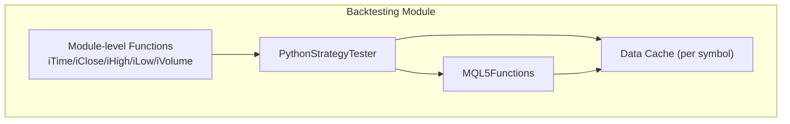
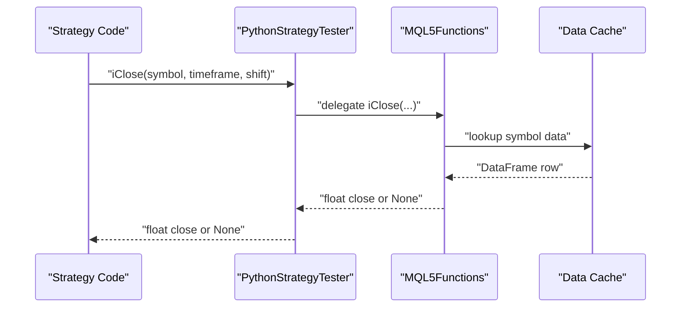
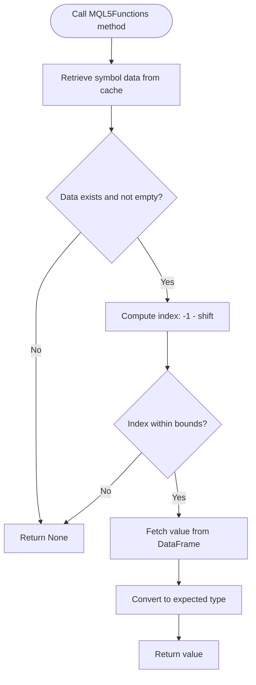
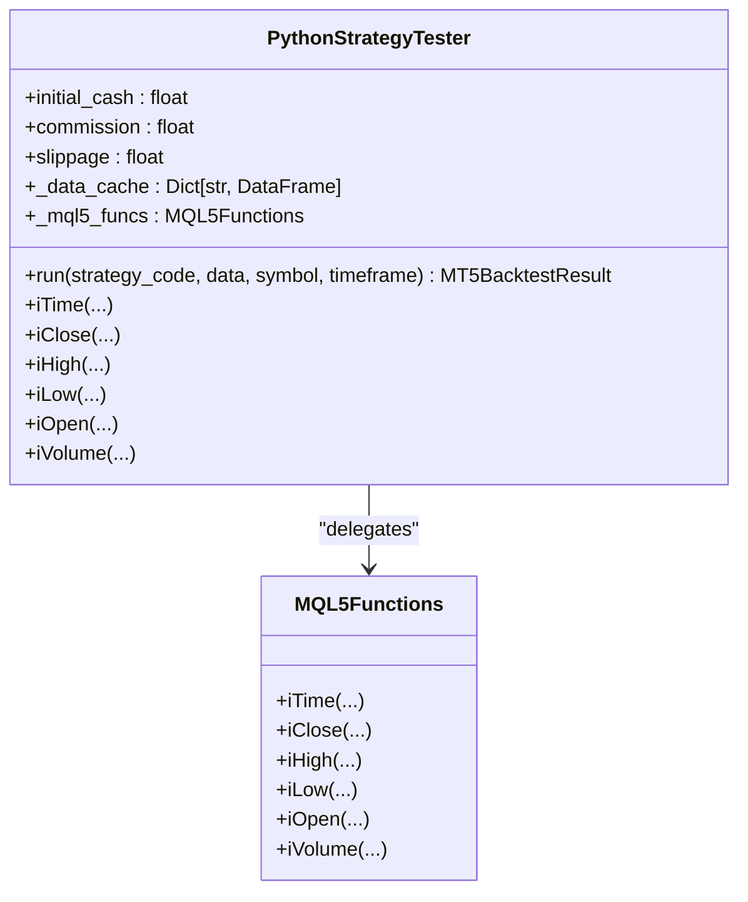
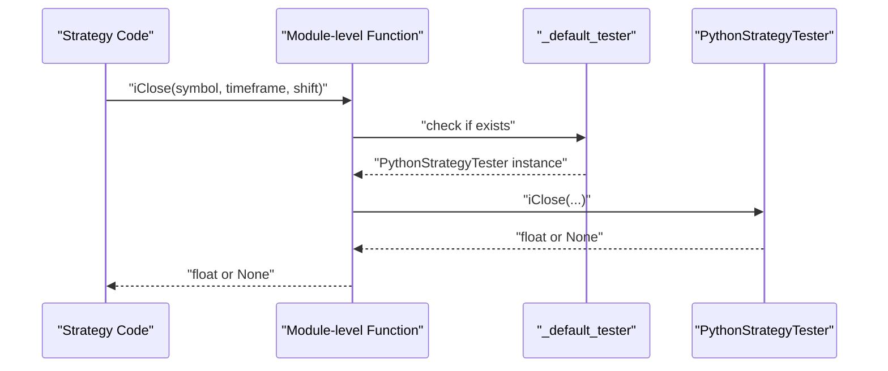
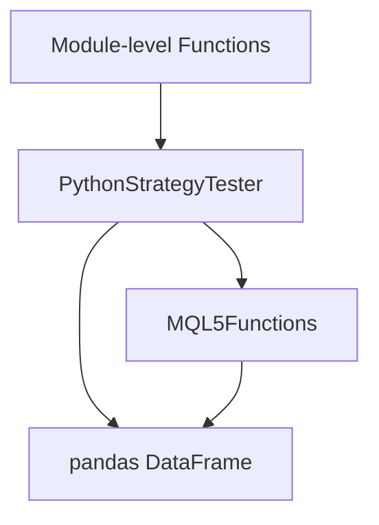

# MQL5 Function Overloading

<cite>
**Referenced Files in This Document**
- [mt5_engine.py](file://src/backtesting/mt5_engine.py)
- [test_mt5_engine.py](file://tests/backtesting/test_mt5_engine.py)
</cite>

## Table of Contents
1. [Introduction](#introduction)
2. [Project Structure](#project-structure)
3. [Core Components](#core-components)
4. [Architecture Overview](#architecture-overview)
5. [Detailed Component Analysis](#detailed-component-analysis)
6. [Dependency Analysis](#dependency-analysis)
7. [Performance Considerations](#performance-considerations)
8. [Troubleshooting Guide](#troubleshooting-guide)
9. [Conclusion](#conclusion)
10. [Appendices](#appendices)

## Introduction
This document explains the MQL5 Function Overloading system implemented in the project, focusing on the MQL5Functions class and the PythonStrategyTester that provides Python equivalents for core MQL5 built-in functions. It covers function signatures, parameter handling, shift-based indexing conventions, data type conversions, error handling for invalid indices, integration with the data cache system, and practical usage patterns for strategy development. It also documents the module-level convenience functions and the global tester reference system that enables MQL5-style access to data functions.

## Project Structure
The MQL5 Function Overloading system resides in the backtesting module and integrates with the broader strategy testing framework. The key elements are:
- MQL5Functions: Implements Python equivalents of MQL5 functions (iTime, iClose, iHigh, iLow, iOpen, iVolume).
- PythonStrategyTester: Orchestrates strategy execution, manages a data cache, delegates MQL5 function calls to MQL5Functions, and exposes module-level convenience functions.
- Module-level functions: iTime, iClose, iHigh, iLow, iVolume provide global access via a default tester reference.

**Diagram sources**
- [mt5_engine.py](file://src/backtesting/mt5_engine.py#L154-L284)
- [mt5_engine.py](file://src/backtesting/mt5_engine.py#L320-L563)
- [mt5_engine.py](file://src/backtesting/mt5_engine.py#L286-L314)

**Section sources**
- [mt5_engine.py](file://src/backtesting/mt5_engine.py#L1-L100)

## Core Components
- MQL5Functions: Provides Python equivalents for MQL5 series functions with shift-based indexing and safe error handling.
- PythonStrategyTester: Manages strategy execution, maintains a data cache, delegates MQL5 function calls, and exposes module-level convenience functions.
- Module-level convenience functions: iTime, iClose, iHigh, iLow, iVolume serve as global shortcuts backed by a default tester reference.

Key responsibilities:
- Indexing: Uses negative shift indexing compatible with MQL5 conventions.
- Data access: Reads OHLCV and time data from the data cache.
- Type conversion: Returns appropriate types (datetime, float, int) and gracefully handles missing data.
- Error handling: Returns None for invalid indices or missing symbols.

**Section sources**
- [mt5_engine.py](file://src/backtesting/mt5_engine.py#L154-L284)
- [mt5_engine.py](file://src/backtesting/mt5_engine.py#L286-L314)
- [mt5_engine.py](file://src/backtesting/mt5_engine.py#L320-L563)

## Architecture Overview
The system simulates an MQL5-like environment in Python. Strategies execute within PythonStrategyTester, which:
- Prepares and normalizes OHLCV data (ensuring time column, timezone-aware timestamps, required columns).
- Stores data in a per-symbol cache.
- Delegates MQL5 function calls to MQL5Functions.
- Exposes module-level functions that delegate to the default tester.

**Diagram sources**
- [mt5_engine.py](file://src/backtesting/mt5_engine.py#L545-L547)
- [mt5_engine.py](file://src/backtesting/mt5_engine.py#L192-L214)
- [mt5_engine.py](file://src/backtesting/mt5_engine.py#L380-L383)

## Detailed Component Analysis

### MQL5Functions: Python Equivalents for MQL5 Series Functions
MQL5Functions encapsulates the logic for accessing historical OHLCV data using shift-based indexing. It reads from the tester’s data cache and returns values with appropriate types.

- Function signatures and parameters:
  - iTime(symbol: str, timeframe: int, shift: int = 0) -> Optional[datetime]
  - iClose(symbol: str, timeframe: int, shift: int = 0) -> Optional[float]
  - iHigh(symbol: str, timeframe: int, shift: int = 0) -> Optional[float]
  - iLow(symbol: str, timeframe: int, shift: int = 0) -> Optional[float]
  - iOpen(symbol: str, timeframe: int, shift: int = 0) -> Optional[float]
  - iVolume(symbol: str, timeframe: int, shift: int = 0) -> Optional[int]

- Shift-based indexing:
  - Uses negative indexing (-1 - shift) to align with MQL5 semantics where shift=0 refers to the most recent bar.
  - Validates bounds to avoid IndexError and KeyError.

- Data type conversions:
  - iTime returns datetime.
  - iClose, iHigh, iLow, iOpen return float.
  - iVolume returns int.

- Error handling:
  - Returns None when the symbol is not cached, the cache is empty, or the index is out of bounds.
  - Catches IndexError and KeyError during data access.

- Integration with data cache:
  - Retrieves DataFrame rows from the tester’s _data_cache keyed by symbol.
  - Uses iloc with computed index to fetch values.

**Diagram sources**
- [mt5_engine.py](file://src/backtesting/mt5_engine.py#L163-L190)
- [mt5_engine.py](file://src/backtesting/mt5_engine.py#L192-L214)
- [mt5_engine.py](file://src/backtesting/mt5_engine.py#L216-L229)
- [mt5_engine.py](file://src/backtesting/mt5_engine.py#L231-L244)
- [mt5_engine.py](file://src/backtesting/mt5_engine.py#L246-L259)
- [mt5_engine.py](file://src/backtesting/mt5_engine.py#L261-L283)

**Section sources**
- [mt5_engine.py](file://src/backtesting/mt5_engine.py#L154-L284)

### PythonStrategyTester: Strategy Execution and MQL5 Function Delegation
PythonStrategyTester orchestrates strategy execution and delegates MQL5 function calls to MQL5Functions. It also prepares data, manages state, and exposes module-level convenience functions.

- Initialization and configuration:
  - Accepts initial_cash, commission, slippage, and optional MT5 credentials.
  - Creates MQL5Functions instance and sets itself as the default tester for module-level functions.

- Data preparation:
  - Ensures DataFrame has a time column and timezone-aware timestamps.
  - Adds required columns (open, high, low, close, tick_volume) with sensible defaults if missing.

- MQL5 function delegation:
  - Wraps MQL5Functions methods to expose them via PythonStrategyTester.

- Module-level functions:
  - iTime, iClose, iHigh, iLow, iVolume delegate to the default tester (_default_tester).

- Equity and performance:
  - Updates equity curve during backtest execution.
  - Calculates Sharpe ratio, maximum drawdown, and total return.

**Diagram sources**
- [mt5_engine.py](file://src/backtesting/mt5_engine.py#L320-L563)
- [mt5_engine.py](file://src/backtesting/mt5_engine.py#L154-L158)

**Section sources**
- [mt5_engine.py](file://src/backtesting/mt5_engine.py#L320-L563)
- [mt5_engine.py](file://src/backtesting/mt5_engine.py#L783-L820)
- [mt5_engine.py](file://src/backtesting/mt5_engine.py#L822-L833)

### Module-level Convenience Functions and Global Tester Reference
Module-level functions mirror MQL5 function names and delegate to a global default tester. This enables MQL5-style access without requiring explicit tester instances in strategy code.

- Global reference:
  - _default_tester holds the currently active tester instance.
  - PythonStrategyTester sets _default_tester upon initialization.

- Function behavior:
  - iTime, iClose, iHigh, iLow, iVolume call the corresponding methods on the default tester.
  - Return None when no default tester is set.

**Diagram sources**
- [mt5_engine.py](file://src/backtesting/mt5_engine.py#L286-L314)
- [mt5_engine.py](file://src/backtesting/mt5_engine.py#L312-L404)

**Section sources**
- [mt5_engine.py](file://src/backtesting/mt5_engine.py#L286-L314)
- [mt5_engine.py](file://src/backtesting/mt5_engine.py#L312-L404)

## Dependency Analysis
- Internal dependencies:
  - PythonStrategyTester depends on MQL5Functions for data access.
  - Module-level functions depend on PythonStrategyTester via the global _default_tester reference.
  - Data preparation depends on pandas for DataFrame manipulation.

- External dependencies:
  - Optional MetaTrader5 integration for live data retrieval and tick access.

**Diagram sources**
- [mt5_engine.py](file://src/backtesting/mt5_engine.py#L320-L563)
- [mt5_engine.py](file://src/backtesting/mt5_engine.py#L286-L314)

**Section sources**
- [mt5_engine.py](file://src/backtesting/mt5_engine.py#L17-L32)
- [mt5_engine.py](file://src/backtesting/mt5_engine.py#L442-L517)

## Performance Considerations
- Data access patterns:
  - Using iloc with precomputed negative indices avoids repeated slicing and reduces overhead.
  - Ensure the DataFrame is properly indexed and normalized to minimize type conversions.

- Memory and caching:
  - Keep per-symbol DataFrames in the cache to avoid repeated data loading.
  - Normalize data once during preparation to avoid repeated checks.

- Timeframe handling:
  - When integrating with MT5, map MQL5 timeframes to MT5 constants to avoid mismatches.

- Equity updates:
  - Updating equity per bar is O(n) in the number of bars; keep strategy logic efficient to maintain linear scalability.

[No sources needed since this section provides general guidance]

## Troubleshooting Guide
Common issues and resolutions:
- Invalid shift or missing symbol:
  - Symptoms: Functions return None.
  - Cause: Index out of bounds or symbol not in cache.
  - Resolution: Verify shift values and ensure data is loaded into the cache before use.

- Missing time column or timezone-naive timestamps:
  - Symptoms: Unexpected time handling or errors.
  - Cause: DataFrame lacks a time column or timezone info.
  - Resolution: Use the data preparation routine to ensure time column and UTC timezone.

- MT5 integration failures:
  - Symptoms: Connection warnings or None when retrieving live data.
  - Cause: MT5 package unavailable or connection errors.
  - Resolution: Confirm MT5 installation and connectivity; handle MT5_AVAILABLE guardrails.

- Type mismatches:
  - Symptoms: Type errors when using returned values.
  - Cause: Expecting float/int/datetime but receiving None.
  - Resolution: Guard against None and ensure proper type checks in strategy logic.

**Section sources**
- [mt5_engine.py](file://src/backtesting/mt5_engine.py#L174-L190)
- [mt5_engine.py](file://src/backtesting/mt5_engine.py#L203-L214)
- [mt5_engine.py](file://src/backtesting/mt5_engine.py#L218-L229)
- [mt5_engine.py](file://src/backtesting/mt5_engine.py#L233-L244)
- [mt5_engine.py](file://src/backtesting/mt5_engine.py#L248-L259)
- [mt5_engine.py](file://src/backtesting/mt5_engine.py#L272-L283)
- [mt5_engine.py](file://src/backtesting/mt5_engine.py#L783-L820)
- [mt5_engine.py](file://src/backtesting/mt5_engine.py#L410-L440)

## Conclusion
The MQL5 Function Overloading system provides a seamless bridge between MQL5-style data access and Python-based backtesting. MQL5Functions implements robust, MQL5-compatible indexing and type-safe access to OHLCV data, while PythonStrategyTester coordinates strategy execution, data preparation, and performance metrics. Module-level convenience functions enable MQL5-style usage without explicit tester instances, and the global tester reference simplifies integration. Together, these components support efficient, reliable strategy development and testing in Python environments.

[No sources needed since this section summarizes without analyzing specific files]

## Appendices

### Practical Usage Examples
- Basic data access in strategies:
  - Access current close: iClose(symbol, timeframe, 0)
  - Access previous close: iClose(symbol, timeframe, 1)
  - Access high/low/time/volume similarly using respective functions.

- Strategy development patterns:
  - Use iTime to synchronize events with bar times.
  - Combine iClose, iHigh, iLow for condition checks aligned with MQL5 semantics.
  - Use module-level functions for concise access when a default tester is set.

- Performance tips:
  - Pre-normalize data to ensure consistent column presence and timezone-aware timestamps.
  - Keep strategy loops efficient; avoid redundant data lookups.

**Section sources**
- [test_mt5_engine.py](file://tests/backtesting/test_mt5_engine.py#L41-L111)
- [test_mt5_engine.py](file://tests/backtesting/test_mt5_engine.py#L169-L230)
- [mt5_engine.py](file://src/backtesting/mt5_engine.py#L783-L820)