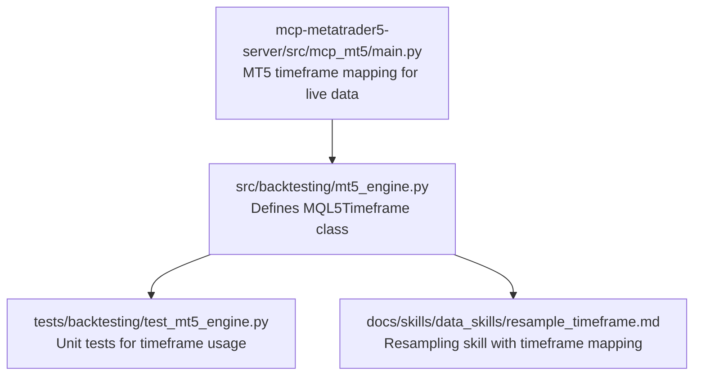
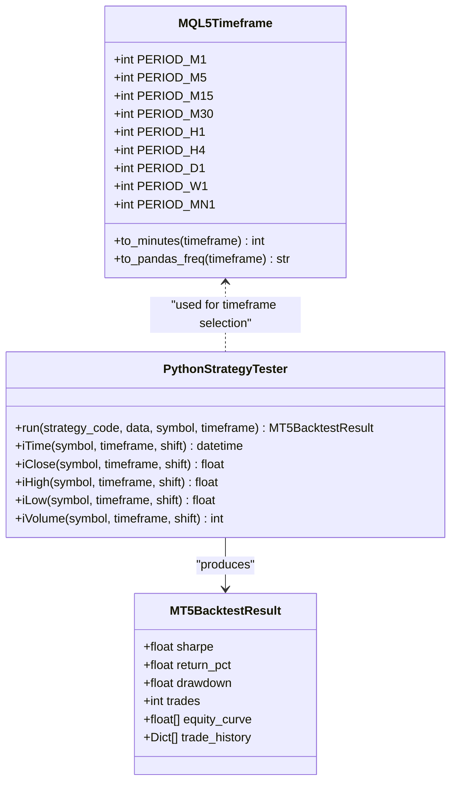
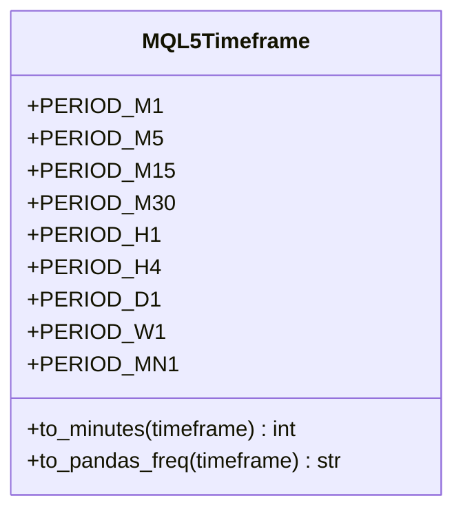
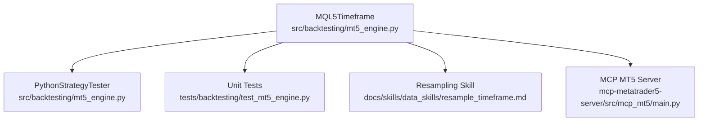

# MQL5 Timeframe Constants

<cite>
**Referenced Files in This Document**
- [mt5_engine.py](file://src/backtesting/mt5_engine.py)
- [test_mt5_engine.py](file://tests/backtesting/test_mt5_engine.py)
- [resample_timeframe.md](file://docs/skills/data_skills/resample_timeframe.md)
- [main.py](file://mcp-metatrader5-server/src/mcp_mt5/main.py)
</cite>

## Table of Contents
1. [Introduction](#introduction)
2. [Project Structure](#project-structure)
3. [Core Components](#core-components)
4. [Architecture Overview](#architecture-overview)
5. [Detailed Component Analysis](#detailed-component-analysis)
6. [Dependency Analysis](#dependency-analysis)
7. [Performance Considerations](#performance-considerations)
8. [Troubleshooting Guide](#troubleshooting-guide)
9. [Conclusion](#conclusion)
10. [Appendices](#appendices)

## Introduction
This document provides comprehensive coverage of the MQL5 Timeframe Constants feature implemented in the repository. It focuses on the MQL5Timeframe class that encapsulates MQL5-compatible timeframe constants and provides utility methods for converting between timeframe identifiers and pandas frequency strings. The documentation explains the class design, mapping logic, and practical usage patterns in strategy development, data preparation workflows, and pandas integration.

## Project Structure
The MQL5 timeframe functionality is primarily implemented in the backtesting module and integrated with tests and documentation across the repository.

**Diagram sources**
- [mt5_engine.py](file://src/backtesting/mt5_engine.py#L39-L82)
- [test_mt5_engine.py](file://tests/backtesting/test_mt5_engine.py#L25-L34)
- [resample_timeframe.md](file://docs/skills/data_skills/resample_timeframe.md#L88-L238)
- [main.py](file://mcp-metatrader5-server/src/mcp_mt5/main.py#L363-L399)

**Section sources**
- [mt5_engine.py](file://src/backtesting/mt5_engine.py#L39-L82)
- [test_mt5_engine.py](file://tests/backtesting/test_mt5_engine.py#L25-L34)

## Core Components
- MQL5Timeframe: A class that defines MQL5-compatible timeframe constants and provides conversion utilities.
- to_minutes(): Converts a timeframe constant to its equivalent duration in minutes.
- to_pandas_freq(): Converts a timeframe constant to a pandas frequency string suitable for resampling and plotting.

Key timeframe constants included:
- PERIOD_M1 (1-minute)
- PERIOD_M5 (5-minute)
- PERIOD_M15 (15-minute)
- PERIOD_M30 (30-minute)
- PERIOD_H1 (1-hour)
- PERIOD_H4 (4-hour)
- PERIOD_D1 (daily)
- PERIOD_W1 (weekly)
- PERIOD_MN1 (monthly)

These constants are designed to align with MetaTrader 5’s timeframe constants and enable seamless integration with both backtesting and live trading contexts.

**Section sources**
- [mt5_engine.py](file://src/backtesting/mt5_engine.py#L39-L82)

## Architecture Overview
The MQL5 timeframe system integrates with the Python Strategy Tester and pandas-based data workflows. The class acts as a bridge between MQL5-style constants and Python-native representations.

**Diagram sources**
- [mt5_engine.py](file://src/backtesting/mt5_engine.py#L39-L82)
- [mt5_engine.py](file://src/backtesting/mt5_engine.py#L320-L405)
- [mt5_engine.py](file://src/backtesting/mt5_engine.py#L89-L117)

## Detailed Component Analysis

### MQL5Timeframe Class
The MQL5Timeframe class centralizes timeframe constants and conversion utilities. It ensures consistency across the system by providing:
- Explicit constants for standard MQL5 timeframes
- Conversion to minutes for arithmetic and scheduling
- Conversion to pandas frequency strings for resampling and plotting

Implementation highlights:
- Constants are defined as class attributes with explicit values aligned to MQL5.
- to_minutes() returns the number of minutes represented by a given timeframe constant.
- to_pandas_freq() returns a pandas frequency string compatible with resampling operations.

**Diagram sources**
- [mt5_engine.py](file://src/backtesting/mt5_engine.py#L39-L82)

**Section sources**
- [mt5_engine.py](file://src/backtesting/mt5_engine.py#L39-L82)

### Conversion Methods: to_minutes() and to_pandas_freq()
- to_minutes(timeframe): Maps each MQL5 timeframe constant to its minute representation. This enables calculations such as rolling windows, lookback periods, and resampling ratios.
- to_pandas_freq(timeframe): Maps each MQL5 timeframe constant to a pandas frequency string. This is essential for resampling OHLCV data and aligning multi-timeframe signals.

Practical mapping examples:
- PERIOD_M1 → 1 minute
- PERIOD_M5 → 5 minutes
- PERIOD_M15 → 15 minutes
- PERIOD_M30 → 30 minutes
- PERIOD_H1 → 60 minutes
- PERIOD_H4 → 240 minutes
- PERIOD_D1 → 1440 minutes
- PERIOD_W1 → 10080 minutes
- PERIOD_MN1 → 43200 minutes

Pandas frequency equivalents:
- PERIOD_M1 → "1min"
- PERIOD_M5 → "5min"
- PERIOD_M15 → "15min"
- PERIOD_M30 → "30min"
- PERIOD_H1 → "1h"
- PERIOD_H4 → "4h"
- PERIOD_D1 → "1D"
- PERIOD_W1 → "1W"
- PERIOD_MN1 → "1ME"

**Section sources**
- [mt5_engine.py](file://src/backtesting/mt5_engine.py#L52-L82)

### Integration with Python Strategy Tester
The MQL5Timeframe class is used extensively in the Python Strategy Tester to:
- Select the appropriate timeframe for data retrieval and strategy execution
- Ensure consistent behavior across backtesting and live trading contexts
- Enable pandas-based data preparation and analysis

Usage patterns validated by tests:
- Passing MQL5Timeframe.PERIOD_H1 to tester.run(...) to execute strategies on hourly data
- Using timeframe constants in indicator calculations and signal generation

**Section sources**
- [test_mt5_engine.py](file://tests/backtesting/test_mt5_engine.py#L189-L191)
- [test_mt5_engine.py](file://tests/backtesting/test_mt5_engine.py#L224-L226)

### Practical Examples

#### Strategy Development
- Define a strategy function that accepts a timeframe constant (e.g., MQL5Timeframe.PERIOD_H1) and executes logic based on the selected timeframe.
- Use timeframe constants to select appropriate indicator parameters and entry/exit conditions.

#### Data Preparation Workflows
- Convert raw M1 data to higher timeframes (e.g., H1, D1) using pandas resampling with frequencies derived from to_pandas_freq().
- Align multi-timeframe datasets by timestamp for composite signal generation.

#### Pandas DataFrame Operations
- Use to_pandas_freq() to resample OHLCV data for analysis and visualization.
- Combine multiple timeframes into a single DataFrame for multi-timeframe analysis.

**Section sources**
- [resample_timeframe.md](file://docs/skills/data_skills/resample_timeframe.md#L88-L238)
- [resample_timeframe.md](file://docs/skills/data_skills/resample_timeframe.md#L448-L464)

### Compatibility with MetaTrader5 Timeframe Constants
The MQL5Timeframe class constants are aligned with MetaTrader 5’s timeframe constants. This alignment ensures:
- Consistent behavior across backtesting and live trading environments
- Seamless integration with MT5 data retrieval and strategy execution

Additional mapping for live data retrieval is provided in the MCP MT5 server module, which demonstrates how minute-based timeframe integers map to MT5 constants.

**Section sources**
- [mt5_engine.py](file://src/backtesting/mt5_engine.py#L518-L535)
- [main.py](file://mcp-metatrader5-server/src/mcp_mt5/main.py#L363-L399)

## Dependency Analysis
The MQL5 timeframe system interacts with several components across the repository:

**Diagram sources**
- [mt5_engine.py](file://src/backtesting/mt5_engine.py#L39-L82)
- [test_mt5_engine.py](file://tests/backtesting/test_mt5_engine.py#L25-L34)
- [resample_timeframe.md](file://docs/skills/data_skills/resample_timeframe.md#L88-L238)
- [main.py](file://mcp-metatrader5-server/src/mcp_mt5/main.py#L363-L399)

**Section sources**
- [mt5_engine.py](file://src/backtesting/mt5_engine.py#L39-L82)
- [test_mt5_engine.py](file://tests/backtesting/test_mt5_engine.py#L25-L34)
- [resample_timeframe.md](file://docs/skills/data_skills/resample_timeframe.md#L88-L238)
- [main.py](file://mcp-metatrader5-server/src/mcp_mt5/main.py#L363-L399)

## Performance Considerations
- Constant lookup: Both to_minutes() and to_pandas_freq() use dictionary lookups, resulting in O(1) time complexity for conversions.
- Memory footprint: The class maintains small constant mappings, minimizing memory overhead.
- Integration impact: Using timeframe constants consistently reduces branching logic and improves readability and maintainability.

## Troubleshooting Guide
Common issues and resolutions:
- Unexpected default values: If an unsupported timeframe is passed to to_minutes() or to_pandas_freq(), the methods return fallback values ("1h" for pandas frequency and 60 minutes for to_minutes()). Validate inputs or extend mappings as needed.
- Inconsistent frequencies: Ensure that the timeframe constant used for data preparation matches the one used for strategy execution to avoid misalignment.
- Live vs. backtesting: Verify that timeframe constants align with MT5 constants in live environments to prevent discrepancies.

**Section sources**
- [mt5_engine.py](file://src/backtesting/mt5_engine.py#L66-L66)
- [mt5_engine.py](file://src/backtesting/mt5_engine.py#L81-L81)

## Conclusion
The MQL5Timeframe class provides a clean abstraction for timeframe handling across the system. By offering explicit constants and conversion utilities, it simplifies strategy development, data preparation, and pandas integration while maintaining compatibility with MetaTrader 5’s timeframe standards.

## Appendices

### Timeframe Mapping Reference
- PERIOD_M1 → 1 minute → "1min"
- PERIOD_M5 → 5 minutes → "5min"
- PERIOD_M15 → 15 minutes → "15min"
- PERIOD_M30 → 30 minutes → "30min"
- PERIOD_H1 → 60 minutes → "1h"
- PERIOD_H4 → 240 minutes → "4h"
- PERIOD_D1 → 1440 minutes → "1D"
- PERIOD_W1 → 10080 minutes → "1W"
- PERIOD_MN1 → 43200 minutes → "1ME"

**Section sources**
- [mt5_engine.py](file://src/backtesting/mt5_engine.py#L52-L82)