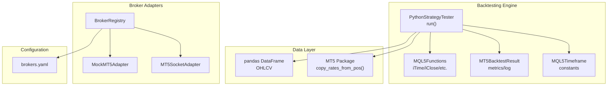
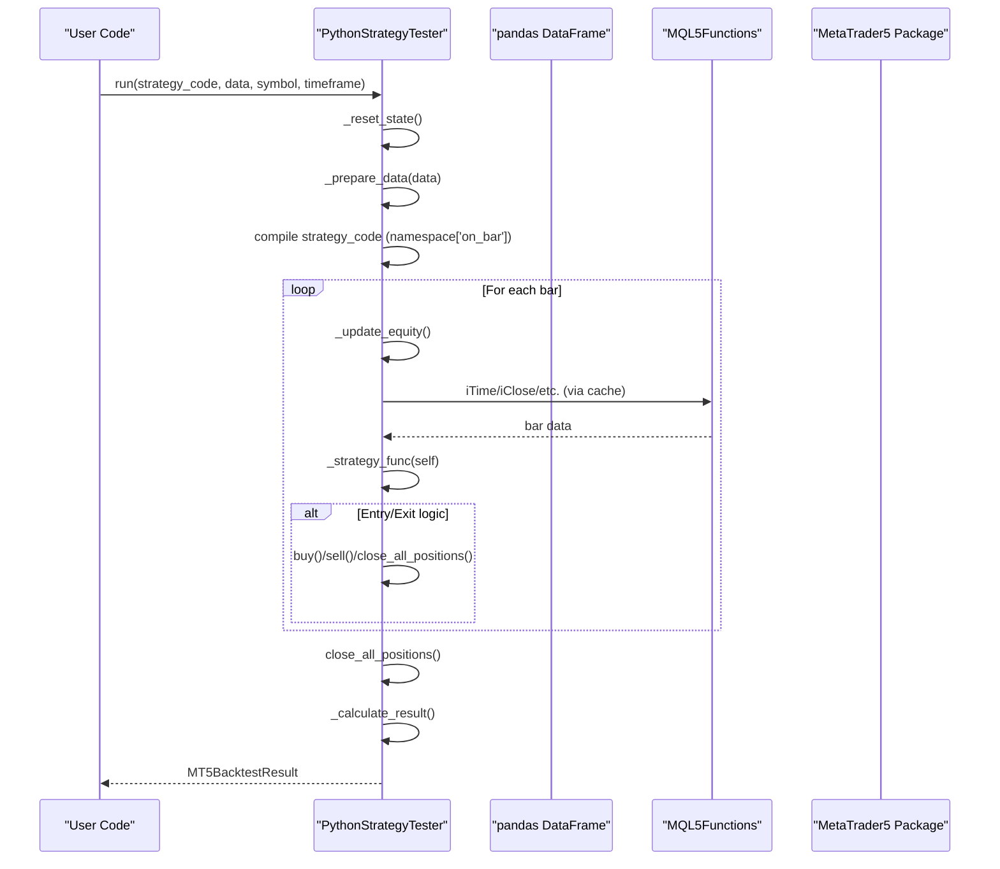
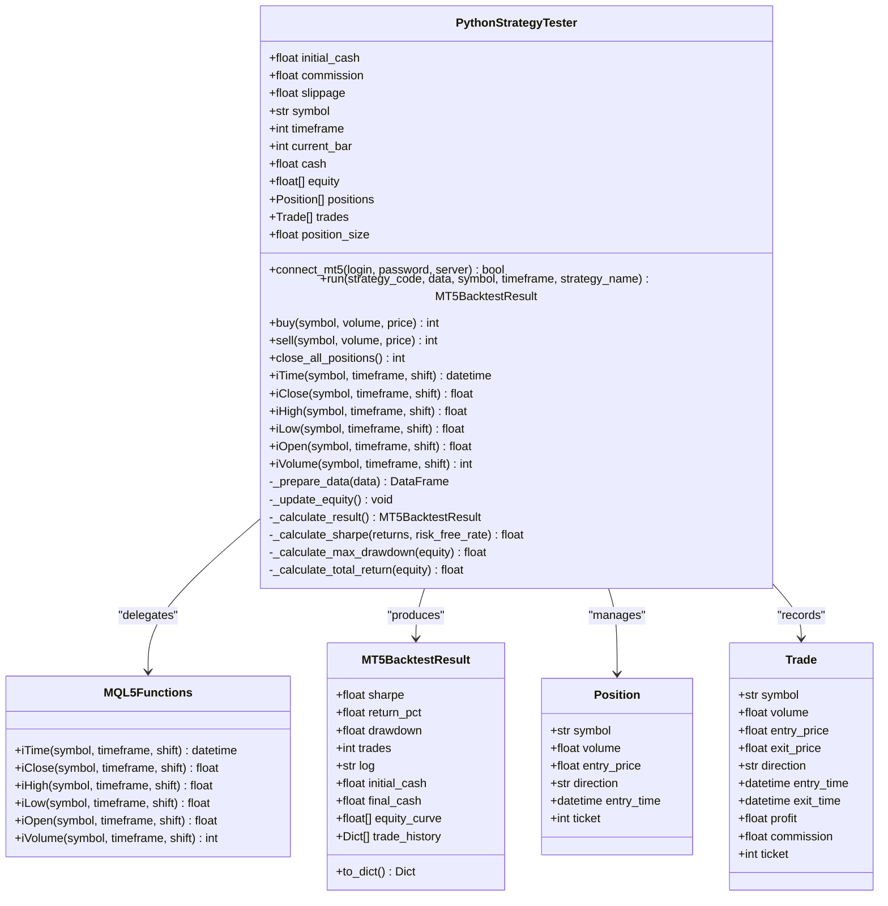
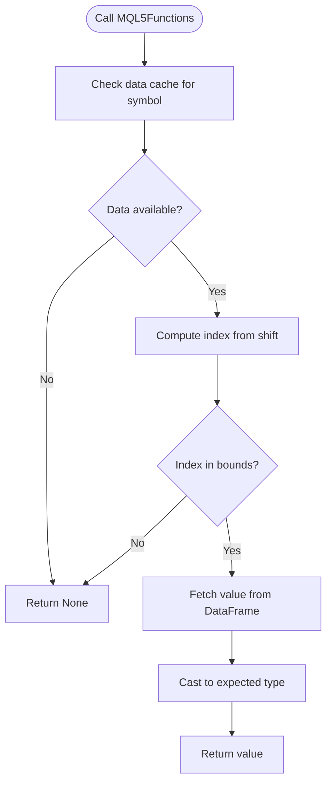
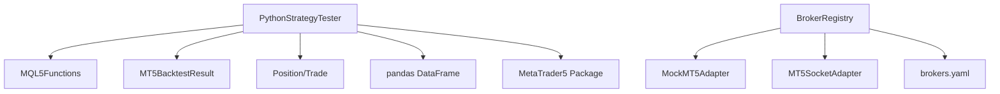

# MT5 Backtesting Engine

<cite>
**Referenced Files in This Document**
- [mt5_engine.py](file://src/backtesting/mt5_engine.py)
- [core_engine.py](file://src/backtesting/core_engine.py)
- [test_mt5_engine.py](file://tests/backtesting/test_mt5_engine.py)
- [test_backend_bridge_integration.py](file://tests/integration/test_backend_bridge_integration.py)
- [mt5_socket_adapter.py](file://src/data/brokers/mt5_socket_adapter.py)
- [mock_mt5_adapter.py](file://src/data/brokers/mock_mt5_adapter.py)
- [registry.py](file://src/data/brokers/registry.py)
- [brokers.yaml](file://config/brokers.yaml)
- [base_strategy.mq5](file://data/assets/templates/base_strategy.mq5)
</cite>

## Table of Contents
1. [Introduction](#introduction)
2. [Project Structure](#project-structure)
3. [Core Components](#core-components)
4. [Architecture Overview](#architecture-overview)
5. [Detailed Component Analysis](#detailed-component-analysis)
6. [Dependency Analysis](#dependency-analysis)
7. [Performance Considerations](#performance-considerations)
8. [Troubleshooting Guide](#troubleshooting-guide)
9. [Conclusion](#conclusion)
10. [Appendices](#appendices)

## Introduction
This document describes the MT5 Backtesting Engine, a Python-based strategy tester that simulates an MQL5 environment for backtesting trading strategies. It provides built-in function overloading for MQL5-style data access (iTime, iClose, iHigh, iLow, iVolume), integrates with the MetaTrader5 Python package for live data retrieval, and calculates performance metrics such as Sharpe ratio, drawdown, and return percentage. The engine supports pandas DataFrame integration with datetime indexing, configurable parameters (initial cash, commission, slippage), and position/trade tracking systems. It also demonstrates practical examples of strategy development, execution workflows, and performance analysis, along with configuration options, debugging techniques, and best practices for strategy testing.

## Project Structure
The MT5 Backtesting Engine resides in the backtesting module and integrates with broker adapters and configuration files for broader system connectivity.

**Diagram sources**
- [mt5_engine.py](file://src/backtesting/mt5_engine.py#L320-L991)
- [mt5_socket_adapter.py](file://src/data/brokers/mt5_socket_adapter.py#L29-L397)
- [mock_mt5_adapter.py](file://src/data/brokers/mock_mt5_adapter.py#L21-L354)
- [registry.py](file://src/data/brokers/registry.py#L22-L356)
- [brokers.yaml](file://config/brokers.yaml#L1-L116)

**Section sources**
- [mt5_engine.py](file://src/backtesting/mt5_engine.py#L1-L15)
- [mt5_engine.py](file://src/backtesting/mt5_engine.py#L39-L83)
- [mt5_engine.py](file://src/backtesting/mt5_engine.py#L89-L118)
- [mt5_engine.py](file://src/backtesting/mt5_engine.py#L124-L148)
- [mt5_engine.py](file://src/backtesting/mt5_engine.py#L154-L314)
- [mt5_engine.py](file://src/backtesting/mt5_engine.py#L320-L405)
- [mt5_engine.py](file://src/backtesting/mt5_engine.py#L410-L536)
- [mt5_engine.py](file://src/backtesting/mt5_engine.py#L569-L690)
- [mt5_engine.py](file://src/backtesting/mt5_engine.py#L695-L782)
- [mt5_engine.py](file://src/backtesting/mt5_engine.py#L783-L821)
- [mt5_engine.py](file://src/backtesting/mt5_engine.py#L822-L845)
- [mt5_engine.py](file://src/backtesting/mt5_engine.py#L865-L972)
- [mt5_engine.py](file://src/backtesting/mt5_engine.py#L978-L991)

## Core Components
- PythonStrategyTester: Orchestrates backtesting, executes strategy code, manages state, and computes performance metrics.
- MQL5Functions: Provides MQL5-style built-in functions (iTime, iClose, iHigh, iLow, iVolume) for accessing OHLCV data.
- MT5BacktestResult: Structured result container holding metrics (Sharpe ratio, drawdown, return%), logs, equity curve, and trade history.
- Position and Trade: Data models representing open positions and executed trades with associated metadata.
- MQL5Timeframe: Enum-like class mapping MQL5 timeframe constants to minutes and pandas frequency strings.

Key capabilities:
- MQL5 built-in function overloading for Python environments
- MetaTrader5 package integration for data retrieval
- Strategy execution via dynamic code compilation
- Equity curve and performance metrics computation
- pandas DataFrame integration with datetime indexing
- Configurable parameters for cash, commission, and slippage

**Section sources**
- [mt5_engine.py](file://src/backtesting/mt5_engine.py#L39-L83)
- [mt5_engine.py](file://src/backtesting/mt5_engine.py#L89-L118)
- [mt5_engine.py](file://src/backtesting/mt5_engine.py#L124-L148)
- [mt5_engine.py](file://src/backtesting/mt5_engine.py#L154-L314)
- [mt5_engine.py](file://src/backtesting/mt5_engine.py#L320-L405)
- [mt5_engine.py](file://src/backtesting/mt5_engine.py#L410-L536)
- [mt5_engine.py](file://src/backtesting/mt5_engine.py#L569-L690)
- [mt5_engine.py](file://src/backtesting/mt5_engine.py#L695-L782)
- [mt5_engine.py](file://src/backtesting/mt5_engine.py#L783-L821)
- [mt5_engine.py](file://src/backtesting/mt5_engine.py#L822-L845)
- [mt5_engine.py](file://src/backtesting/mt5_engine.py#L865-L972)

## Architecture Overview
The engine operates by preparing OHLCV data into a pandas DataFrame, executing a strategy function per bar, maintaining position and trade state, and computing performance metrics at the end of the backtest.

**Diagram sources**
- [mt5_engine.py](file://src/backtesting/mt5_engine.py#L695-L782)
- [mt5_engine.py](file://src/backtesting/mt5_engine.py#L822-L845)
- [mt5_engine.py](file://src/backtesting/mt5_engine.py#L865-L972)

## Detailed Component Analysis

### PythonStrategyTester
Responsibilities:
- Initialize with configurable parameters (initial cash, commission, slippage)
- Connect to MT5 terminal (optional) and retrieve historical data
- Prepare OHLCV data for backtesting
- Execute strategy code per bar and manage state (cash, positions, trades)
- Compute performance metrics and produce structured results

Execution flow highlights:
- run(): Validates inputs, prepares data, compiles strategy, iterates bars, updates equity, executes strategy, closes positions, and calculates results
- buy()/sell(): Open/close positions with slippage and commission handling
- _prepare_data(): Ensures DataFrame has required columns and timezone-aware timestamps
- _update_equity(): Computes unrealized P&L and maintains equity curve
- _calculate_result(): Computes Sharpe, drawdown, and return percentage

**Diagram sources**
- [mt5_engine.py](file://src/backtesting/mt5_engine.py#L320-L405)
- [mt5_engine.py](file://src/backtesting/mt5_engine.py#L410-L536)
- [mt5_engine.py](file://src/backtesting/mt5_engine.py#L569-L690)
- [mt5_engine.py](file://src/backtesting/mt5_engine.py#L695-L782)
- [mt5_engine.py](file://src/backtesting/mt5_engine.py#L783-L821)
- [mt5_engine.py](file://src/backtesting/mt5_engine.py#L822-L845)
- [mt5_engine.py](file://src/backtesting/mt5_engine.py#L865-L972)
- [mt5_engine.py](file://src/backtesting/mt5_engine.py#L89-L118)
- [mt5_engine.py](file://src/backtesting/mt5_engine.py#L124-L148)

**Section sources**
- [mt5_engine.py](file://src/backtesting/mt5_engine.py#L320-L405)
- [mt5_engine.py](file://src/backtesting/mt5_engine.py#L410-L536)
- [mt5_engine.py](file://src/backtesting/mt5_engine.py#L569-L690)
- [mt5_engine.py](file://src/backtesting/mt5_engine.py#L695-L782)
- [mt5_engine.py](file://src/backtesting/mt5_engine.py#L783-L821)
- [mt5_engine.py](file://src/backtesting/mt5_engine.py#L822-L845)
- [mt5_engine.py](file://src/backtesting/mt5_engine.py#L865-L972)

### MQL5 Built-in Function Overloading
The MQL5Functions class provides Python equivalents for MQL5 functions, enabling strategies written in MQL5 style to run in Python. It accesses OHLCV data from the tester’s internal cache and returns appropriate types.

Key behaviors:
- iTime: Returns bar opening time for a given shift
- iClose/iHigh/iLow/iOpen: Return corresponding price values
- iVolume: Returns tick volume for a given shift
- Graceful handling of invalid shifts (returns None)

**Diagram sources**
- [mt5_engine.py](file://src/backtesting/mt5_engine.py#L154-L314)

**Section sources**
- [mt5_engine.py](file://src/backtesting/mt5_engine.py#L154-L314)

### MQL5 Timeframe Constants
The MQL5Timeframe class defines constants for common MQL5 timeframes and provides conversions to minutes and pandas frequency strings. This ensures compatibility between MQL5-style strategies and pandas-based data preparation.

Supported mappings:
- PERIOD_M1, PERIOD_M5, PERIOD_M15, PERIOD_M30, PERIOD_H1, PERIOD_H4, PERIOD_D1, PERIOD_W1, PERIOD_MN1
- Conversion helpers: to_minutes(), to_pandas_freq()

**Section sources**
- [mt5_engine.py](file://src/backtesting/mt5_engine.py#L39-L83)

### Backtest Result Structure and Metrics
MT5BacktestResult encapsulates:
- sharpe: Annualized Sharpe ratio
- return_pct: Total return percentage
- drawdown: Maximum drawdown percentage
- trades: Number of trades executed
- log: Execution log
- initial_cash/final_cash: Starting and ending account balances
- equity_curve: Array of equity values over time
- trade_history: List of executed trades

Metrics computation:
- Sharpe ratio: Assumes hourly data and annualizes using sqrt(252*4)
- Maximum drawdown: Percentage drawdown relative to running peak
- Total return: Percentage change from initial to final equity

**Section sources**
- [mt5_engine.py](file://src/backtesting/mt5_engine.py#L89-L118)
- [mt5_engine.py](file://src/backtesting/mt5_engine.py#L865-L972)
- [mt5_engine.py](file://src/backtesting/mt5_engine.py#L907-L951)

### Position and Trade Tracking Systems
Position tracks open positions with symbol, volume, entry price, direction, and entry time. Trade records completed executions with entry/exit details, profit, and commission. The system supports:
- Opening buy positions with slippage-applied entry price
- Closing positions with realized profit/loss and commission deduction
- Maintaining total position size and cash balance
- Generating trade history for post-backtest analysis

**Section sources**
- [mt5_engine.py](file://src/backtesting/mt5_engine.py#L124-L148)
- [mt5_engine.py](file://src/backtesting/mt5_engine.py#L569-L690)

### Trading Operations: Buy/Sell and Slippage/Commission
- buy(): Opens a buy position, applies slippage to entry price, deducts cost from cash, increments ticket counter
- sell(): Closes matching buy positions, computes profit/loss, applies commission, adds proceeds minus commission to cash, decrements position size
- close_all_positions(): Iterates open positions and closes them at current close prices

Slippage and commission:
- Slippage adjusts entry/exit prices upward/downward respectively
- Commission is computed as a fraction of notional value and deducted upon trade execution

**Section sources**
- [mt5_engine.py](file://src/backtesting/mt5_engine.py#L569-L690)

### Data Preparation for pandas DataFrame Integration
The engine normalizes input data to ensure:
- A timezone-aware datetime column named "time"
- Required OHLCV columns ("open", "high", "low", "close", "tick_volume")
- Reasonable defaults for missing columns
- Support for both DatetimeIndex and explicit "time" column

This enables seamless integration with pandas-based strategies and plotting libraries.

**Section sources**
- [mt5_engine.py](file://src/backtesting/mt5_engine.py#L783-L821)

### Equity Curve Calculations
Equity is updated per bar by summing cash plus unrealized P&L from open positions. The equity curve is stored and later used to compute:
- Sharpe ratio
- Maximum drawdown
- Total return percentage

**Section sources**
- [mt5_engine.py](file://src/backtesting/mt5_engine.py#L822-L845)
- [mt5_engine.py](file://src/backtesting/mt5_engine.py#L865-L972)

### Practical Examples of Strategy Development and Execution
Example workflows validated by tests:
- Simple buy-and-hold strategy: Buys on the first bar and holds until the end
- Entry/exit logic: Uses moving average crossover to enter and exit positions
- Integration with MQL5-style functions: Accesses iClose, iOpen, and iVolume within the strategy

These examples demonstrate how strategies written in MQL5 style can be executed in Python using the tester’s built-in functions and state management.

**Section sources**
- [test_mt5_engine.py](file://tests/backtesting/test_mt5_engine.py#L169-L196)
- [test_mt5_engine.py](file://tests/backtesting/test_mt5_engine.py#L197-L230)
- [test_backend_bridge_integration.py](file://tests/integration/test_backend_bridge_integration.py#L229-L251)

### MT5 Package Integration, Connection Handling, and Data Retrieval
Optional integration with the MetaTrader5 Python package:
- connect_mt5(): Initializes connection to MT5 terminal with optional credentials
- _copy_rates_from_pos(): Retrieves OHLCV data using mt5.copy_rates_from_pos() and converts to DataFrame
- _get_tick(): Retrieves current tick data (bid/ask/last/volume)
- _get_mt5_timeframe(): Maps MQL5 timeframe constants to MT5 package constants

Note: When the MT5 package is unavailable, the tester continues operating in offline mode with cached/pandas-provided data.

**Section sources**
- [mt5_engine.py](file://src/backtesting/mt5_engine.py#L410-L536)

### Configuration Options and Best Practices
Configuration and parameters:
- Initial cash: Starting account balance
- Commission: Fractional commission per trade
- Slippage: Price impact in points for entry/exit
- Timeframe constants: Use MQL5Timeframe for consistency

Best practices:
- Sandbox strategy execution in production environments
- Validate data integrity (required columns, timezone-aware timestamps)
- Use realistic slippage and commission assumptions
- Monitor logs for runtime errors and warnings
- Prefer MQL5Timeframe constants for timeframe consistency

**Section sources**
- [mt5_engine.py](file://src/backtesting/mt5_engine.py#L352-L405)
- [mt5_engine.py](file://src/backtesting/mt5_engine.py#L39-L83)
- [mt5_engine.py](file://src/backtesting/mt5_engine.py#L783-L821)

## Dependency Analysis
The backtesting engine interacts with broker adapters and configuration files for broader system integration.

**Diagram sources**
- [mt5_engine.py](file://src/backtesting/mt5_engine.py#L320-L991)
- [registry.py](file://src/data/brokers/registry.py#L22-L356)
- [mock_mt5_adapter.py](file://src/data/brokers/mock_mt5_adapter.py#L21-L354)
- [mt5_socket_adapter.py](file://src/data/brokers/mt5_socket_adapter.py#L29-L397)
- [brokers.yaml](file://config/brokers.yaml#L1-L116)

**Section sources**
- [mt5_engine.py](file://src/backtesting/mt5_engine.py#L320-L991)
- [registry.py](file://src/data/brokers/registry.py#L22-L356)
- [mock_mt5_adapter.py](file://src/data/brokers/mock_mt5_adapter.py#L21-L354)
- [mt5_socket_adapter.py](file://src/data/brokers/mt5_socket_adapter.py#L29-L397)
- [brokers.yaml](file://config/brokers.yaml#L1-L116)

## Performance Considerations
- Sharpe ratio annualization assumes hourly data; ensure input frequency aligns with this assumption
- Large datasets may increase memory usage; consider downsampling or chunking for very long backtests
- Slippage and commission significantly impact realized P&L; calibrate these parameters to broker spreads and fees
- Equity curve computation is O(N) per bar; keep strategy logic efficient to maintain reasonable runtimes

## Troubleshooting Guide
Common issues and resolutions:
- Missing required columns in DataFrame: Ensure "open", "high", "low", "close", "tick_volume" are present; the engine provides defaults but explicit columns are recommended
- Invalid shift indices: MQL5Functions gracefully returns None for out-of-bounds shifts; verify strategy logic handles None returns
- MT5 package not available: The tester continues in offline mode; install MetaTrader5 package for live data retrieval
- Strategy compilation errors: Ensure strategy code defines an "on_bar(tester)" function; check logs for detailed error messages
- Broker configuration problems: Validate brokers.yaml entries and environment variable substitution; use BrokerRegistry to register and validate connections

Debugging techniques:
- Inspect logs captured during strategy execution
- Use small test datasets to isolate logic errors
- Compare equity curves visually to validate P&L calculations
- Verify timeframe constants and data frequency alignment

**Section sources**
- [mt5_engine.py](file://src/backtesting/mt5_engine.py#L783-L821)
- [mt5_engine.py](file://src/backtesting/mt5_engine.py#L737-L761)
- [mt5_engine.py](file://src/backtesting/mt5_engine.py#L410-L440)
- [test_mt5_engine.py](file://tests/backtesting/test_mt5_engine.py#L1-L420)

## Conclusion
The MT5 Backtesting Engine provides a robust, MQL5-compatible framework for backtesting trading strategies in Python. It offers built-in function overloading, MetaTrader5 integration, comprehensive performance metrics, and seamless pandas DataFrame support. By leveraging configurable parameters, position/trade tracking, and equity curve calculations, users can develop, test, and refine strategies efficiently. Proper configuration, debugging, and best practices ensure reliable and reproducible backtesting outcomes.

## Appendices

### Appendix A: Example Strategy Template
A minimal MQL5-style strategy template is available for reference and adaptation.

**Section sources**
- [base_strategy.mq5](file://data/assets/templates/base_strategy.mq5#L1-L45)

### Appendix B: Related Backtesting Reference
For comparison, a separate backtesting engine using Backtrader is provided.

**Section sources**
- [core_engine.py](file://src/backtesting/core_engine.py#L1-L83)