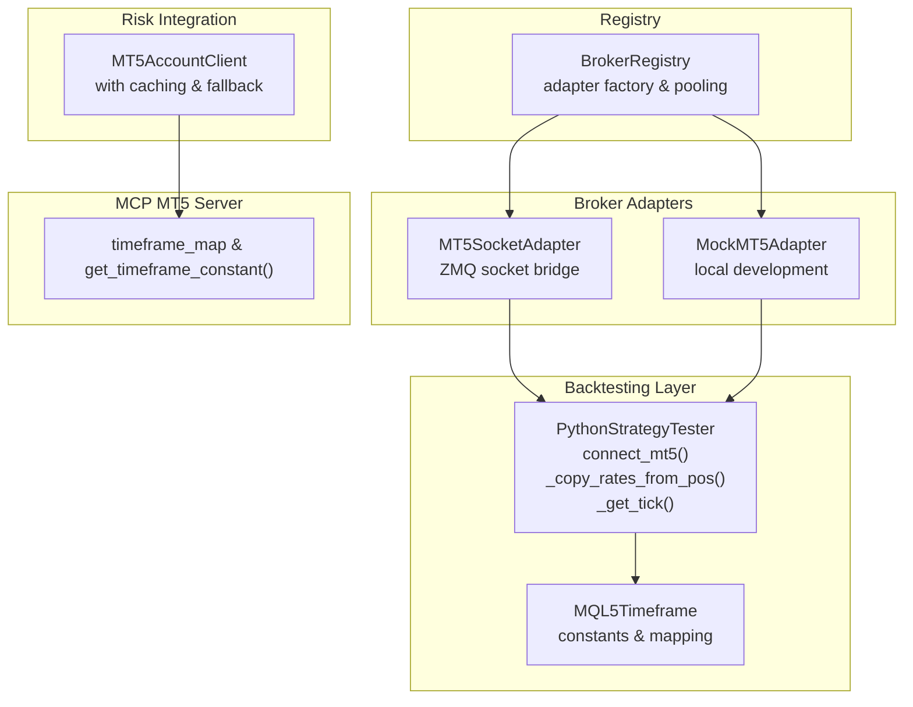
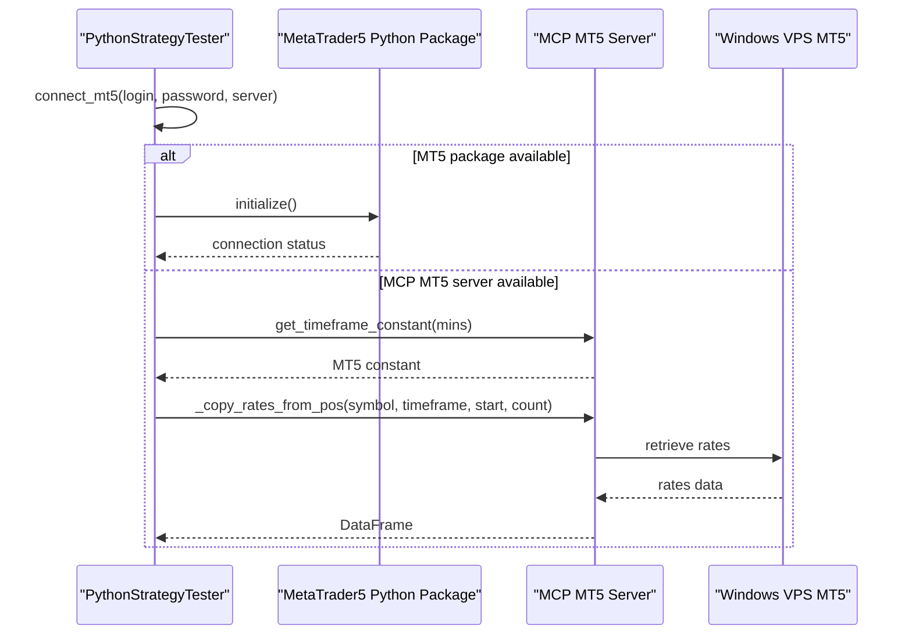
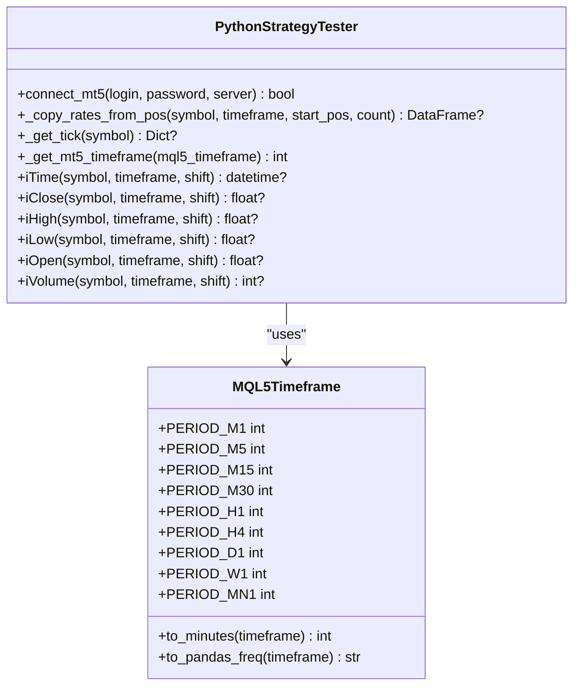
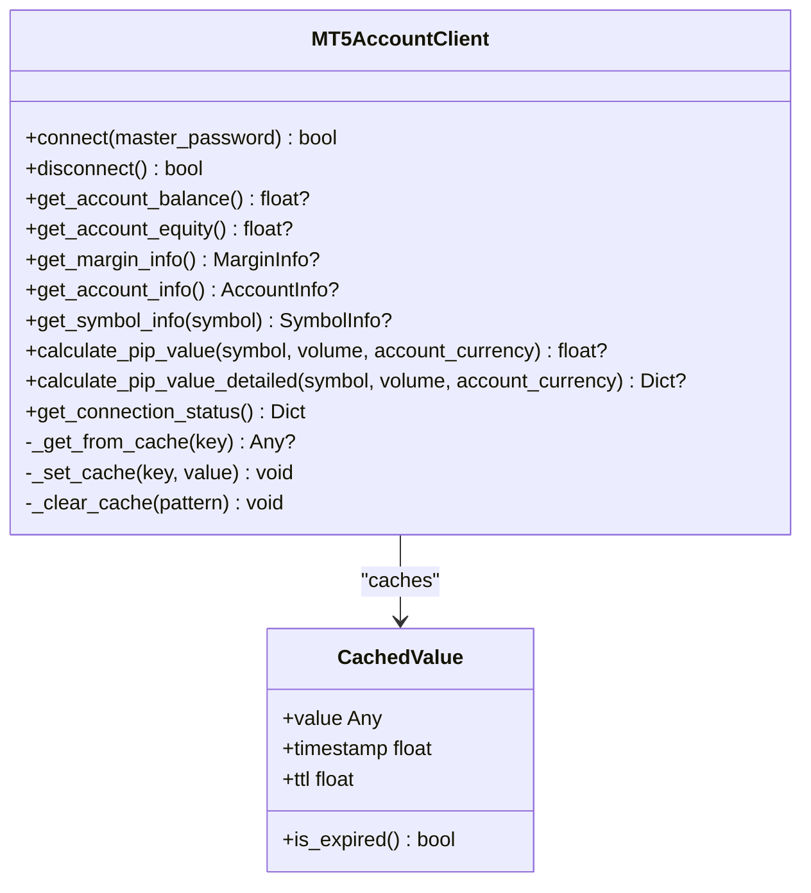
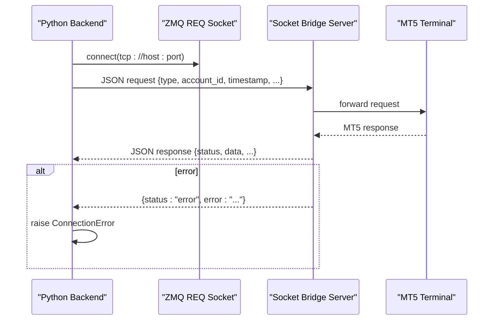
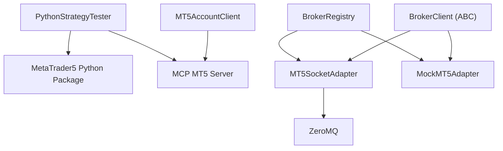

# MT5 Package Integration

<cite>
**Referenced Files in This Document**
- [mt5_engine.py](file://src/backtesting/mt5_engine.py)
- [mt5_client.py](file://src/risk/integrations/mt5_client.py)
- [mt5_socket_adapter.py](file://src/data/brokers/mt5_socket_adapter.py)
- [mock_mt5_adapter.py](file://src/data/brokers/mock_mt5_adapter.py)
- [registry.py](file://src/data/brokers/registry.py)
- [broker_client.py](file://src/integrations/crypto/broker_client.py)
- [test_mt5_engine.py](file://tests/backtesting/test_mt5_engine.py)
- [main.py](file://mcp-metatrader5-server/src/mcp_mt5/main.py)
</cite>

## Table of Contents
1. [Introduction](#introduction)
2. [Project Structure](#project-structure)
3. [Core Components](#core-components)
4. [Architecture Overview](#architecture-overview)
5. [Detailed Component Analysis](#detailed-component-analysis)
6. [Dependency Analysis](#dependency-analysis)
7. [Performance Considerations](#performance-considerations)
8. [Troubleshooting Guide](#troubleshooting-guide)
9. [Conclusion](#conclusion)

## Introduction
This document provides comprehensive guidance for integrating MetaTrader 5 (MT5) within the QuantMindX platform. It focuses on establishing connectivity, retrieving historical and real-time market data, mapping MQL5 timeframes to MT5 package constants, and handling errors gracefully. It also covers practical examples for live data integration, historical data loading, connection management, timeframe mapping, timestamp handling, data validation, security considerations, connection limits, and best practices for reliable MT5 integration.

## Project Structure
The MT5 integration spans several modules:
- Backtesting engine with MQL5 function overloading and MT5 package integration
- Risk integration client with graceful degradation and caching
- Broker adapters for socket-based remote MT5 access and mock MT5 for local development
- Unified broker registry for adapter selection and connection pooling
- MCP MT5 server for advanced MT5 operations and timeframe mapping

**Diagram sources**
- [mt5_engine.py](file://src/backtesting/mt5_engine.py#L410-L536)
- [mt5_client.py](file://src/risk/integrations/mt5_client.py#L268-L304)
- [mt5_socket_adapter.py](file://src/data/brokers/mt5_socket_adapter.py#L29-L72)
- [mock_mt5_adapter.py](file://src/data/brokers/mock_mt5_adapter.py#L21-L62)
- [registry.py](file://src/data/brokers/registry.py#L63-L91)
- [main.py](file://mcp-metatrader5-server/src/mcp_mt5/main.py#L363-L409)

**Section sources**
- [mt5_engine.py](file://src/backtesting/mt5_engine.py#L1-L100)
- [mt5_client.py](file://src/risk/integrations/mt5_client.py#L1-L50)
- [mt5_socket_adapter.py](file://src/data/brokers/mt5_socket_adapter.py#L1-L40)
- [mock_mt5_adapter.py](file://src/data/brokers/mock_mt5_adapter.py#L1-L40)
- [registry.py](file://src/data/brokers/registry.py#L1-L40)
- [main.py](file://mcp-metatrader5-server/src/mcp_mt5/main.py#L360-L420)

## Core Components
- PythonStrategyTester: Provides MQL5-style functions (iTime, iClose, iHigh, iLow, iVolume), connects to MT5 terminal, retrieves historical OHLCV data, and fetches real-time tick data. It includes timeframe mapping and timestamp handling.
- MT5AccountClient: Wraps the MCP MT5 AccountManager with caching, graceful degradation, and simulated data fallback. Includes pip value calculations and margin/account information retrieval.
- MT5SocketAdapter: Implements asynchronous socket-based communication with a remote MT5 server via ZeroMQ, enabling Python backends on Linux to access MT5 on Windows VPS.
- MockMT5Adapter: Provides a local mock implementation for development and testing without requiring an MT5 terminal.
- BrokerRegistry: Factory and registry for managing multiple broker adapters, automatic selection, connection pooling, and status caching.
- MCP MT5 Server: Provides timeframe mapping utilities and MT5 terminal operations.

**Section sources**
- [mt5_engine.py](file://src/backtesting/mt5_engine.py#L410-L536)
- [mt5_client.py](file://src/risk/integrations/mt5_client.py#L268-L304)
- [mt5_socket_adapter.py](file://src/data/brokers/mt5_socket_adapter.py#L29-L72)
- [mock_mt5_adapter.py](file://src/data/brokers/mock_mt5_adapter.py#L21-L62)
- [registry.py](file://src/data/brokers/registry.py#L22-L62)
- [main.py](file://mcp-metatrader5-server/src/mcp_mt5/main.py#L363-L409)

## Architecture Overview
The MT5 integration supports two primary modes:
- Local MT5 terminal access via the Python MT5 package within the backtesting engine.
- Remote MT5 access via a socket bridge to a Windows VPS running MT5, using the MCP MT5 server.

**Diagram sources**
- [mt5_engine.py](file://src/backtesting/mt5_engine.py#L410-L536)
- [main.py](file://mcp-metatrader5-server/src/mcp_mt5/main.py#L391-L409)

## Detailed Component Analysis

### PythonStrategyTester: MT5 Connectivity and Data Retrieval
Key methods and responsibilities:
- connect_mt5(): Initializes the MetaTrader5 Python package with optional credentials and server parameters. Handles availability checks and logs connection status.
- _copy_rates_from_pos(): Retrieves historical OHLCV data using mt5.copy_rates_from_pos(), converts timestamps to UTC, and returns a structured DataFrame.
- _get_tick(): Fetches real-time tick data (bid, ask, last, volume) and returns a normalized dictionary with timezone-aware timestamps.
- MQL5Timeframe: Defines MQL5 timeframe constants and provides conversions to minutes and pandas frequency strings.
- _get_mt5_timeframe(): Maps MQL5 timeframe constants to MT5 package constants, with fallback support.

**Diagram sources**
- [mt5_engine.py](file://src/backtesting/mt5_engine.py#L410-L536)
- [mt5_engine.py](file://src/backtesting/mt5_engine.py#L39-L82)

**Section sources**
- [mt5_engine.py](file://src/backtesting/mt5_engine.py#L410-L536)
- [mt5_engine.py](file://src/backtesting/mt5_engine.py#L39-L82)

### MT5AccountClient: Risk Integration with Caching and Fallback
Highlights:
- Graceful degradation when MT5 is unavailable by falling back to simulated account and symbol data.
- 10-second TTL cache for account and symbol data to minimize repeated calls.
- Enhanced pip value calculations tailored to different symbol types (forex pairs, gold, indices).
- Comprehensive error handling with custom exceptions and detailed logging.

**Diagram sources**
- [mt5_client.py](file://src/risk/integrations/mt5_client.py#L156-L355)
- [mt5_client.py](file://src/risk/integrations/mt5_client.py#L31-L41)

**Section sources**
- [mt5_client.py](file://src/risk/integrations/mt5_client.py#L156-L355)

### MT5SocketAdapter: Remote MT5 Access via Socket Bridge
Capabilities:
- Asynchronous REQ/REP socket communication using ZeroMQ.
- Automatic connection management with retry logic and timeout configuration.
- Request/response envelope with account_id and timestamp injection.
- Comprehensive error handling for timeouts, communication failures, and server-side errors.

**Diagram sources**
- [mt5_socket_adapter.py](file://src/data/brokers/mt5_socket_adapter.py#L82-L146)

**Section sources**
- [mt5_socket_adapter.py](file://src/data/brokers/mt5_socket_adapter.py#L29-L72)
- [mt5_socket_adapter.py](file://src/data/brokers/mt5_socket_adapter.py#L82-L146)

### MockMT5Adapter: Local Development and Testing
Features:
- Simulates MT5 API behavior without requiring an MT5 terminal installation.
- Provides mock balances, positions, orders, and order books.
- Useful for unit testing and integration testing without external dependencies.

**Section sources**
- [mock_mt5_adapter.py](file://src/data/brokers/mock_mt5_adapter.py#L21-L62)

### BrokerRegistry: Adapter Selection and Connection Pooling
Responsibilities:
- Dynamically registers adapters (MT5SocketAdapter, MockMT5Adapter, Binance adapters).
- Loads YAML configuration, substitutes environment variables, and validates broker configs.
- Maintains connection status cache and supports lazy-loading of adapters.
- Provides unified interface for broker operations across different adapters.

**Section sources**
- [registry.py](file://src/data/brokers/registry.py#L22-L62)
- [registry.py](file://src/data/brokers/registry.py#L92-L171)
- [registry.py](file://src/data/brokers/registry.py#L222-L252)

### MCP MT5 Server: Timeframe Mapping and Utilities
Capabilities:
- Comprehensive timeframe mapping from user-friendly minute-based values to MT5 constants.
- Validation and error reporting for unsupported timeframes.
- Additional MT5 operations (initialize, login, account info, terminal info, version).

**Section sources**
- [main.py](file://mcp-metatrader5-server/src/mcp_mt5/main.py#L363-L409)
- [main.py](file://mcp-metatrader5-server/src/mcp_mt5/main.py#L412-L454)

## Dependency Analysis
The MT5 integration exhibits layered dependencies:
- Backtesting engine depends on the MetaTrader5 Python package and MCP MT5 server utilities.
- Risk integration client depends on MCP MT5 server AccountManager and includes fallback logic.
- Broker adapters depend on the BrokerClient interface and are managed by the BrokerRegistry.
- Socket adapter depends on ZeroMQ for asynchronous communication.

**Diagram sources**
- [mt5_engine.py](file://src/backtesting/mt5_engine.py#L24-L30)
- [mt5_client.py](file://src/risk/integrations/mt5_client.py#L292-L299)
- [registry.py](file://src/data/brokers/registry.py#L63-L91)
- [mt5_socket_adapter.py](file://src/data/brokers/mt5_socket_adapter.py#L10-L23)
- [broker_client.py](file://src/integrations/crypto/broker_client.py#L14-L30)

**Section sources**
- [mt5_engine.py](file://src/backtesting/mt5_engine.py#L24-L30)
- [mt5_client.py](file://src/risk/integrations/mt5_client.py#L292-L299)
- [registry.py](file://src/data/brokers/registry.py#L63-L91)
- [mt5_socket_adapter.py](file://src/data/brokers/mt5_socket_adapter.py#L10-L23)
- [broker_client.py](file://src/integrations/crypto/broker_client.py#L14-L30)

## Performance Considerations
- Caching: MT5AccountClient uses a 10-second TTL cache to reduce repeated MT5 calls and improve responsiveness.
- Asynchronous Communication: MT5SocketAdapter leverages ZeroMQ REQ/REP sockets for efficient, low-latency communication.
- Data Preparation: PythonStrategyTester ensures timezone-aware timestamps and minimal column requirements for backtesting data.
- Timeframe Mapping: Efficient mapping functions prevent redundant conversions and support pandas frequency strings for resampling.

[No sources needed since this section provides general guidance]

## Troubleshooting Guide
Common issues and resolutions:
- MT5 package not available: The backtesting engine gracefully handles missing MetaTrader5 package by setting availability flags and logging warnings.
- Connection failures: connect_mt5() logs detailed error messages via mt5.last_error(). Use this to diagnose initialization and login problems.
- Data retrieval errors: _copy_rates_from_pos() and _get_tick() return None on failure and log mt5.last_error(). Validate symbol availability and timeframe correctness.
- Socket communication errors: MT5SocketAdapter raises ConnectionError on timeouts or server-side errors and resets connection state.
- Timeframe mapping errors: Use MCP MT5 server's get_timeframe_constant() to validate and convert minute-based timeframes to MT5 constants.

Practical checks:
- Verify MT5 terminal is running and accessible.
- Confirm credentials and server configuration for connect_mt5().
- Ensure socket bridge is running and reachable for MT5SocketAdapter.
- Validate timeframe values using MCP MT5 server utilities.

**Section sources**
- [mt5_engine.py](file://src/backtesting/mt5_engine.py#L421-L440)
- [mt5_engine.py](file://src/backtesting/mt5_engine.py#L467-L487)
- [mt5_engine.py](file://src/backtesting/mt5_engine.py#L514-L516)
- [mt5_socket_adapter.py](file://src/data/brokers/mt5_socket_adapter.py#L98-L146)
- [main.py](file://mcp-metatrader5-server/src/mcp_mt5/main.py#L391-L409)

## Conclusion
The MT5 integration in QuantMindX provides flexible, robust mechanisms for accessing market data and account information across local and remote environments. The backtesting engine offers MQL5 compatibility and seamless historical data retrieval, while the risk integration client ensures resilience through caching and simulated fallbacks. Socket-based adapters enable scalable deployment on Linux systems, and the MCP MT5 server supplies essential utilities like timeframe mapping. By following the documented practices for connection management, error handling, and data validation, teams can achieve reliable and secure MT5 integration.