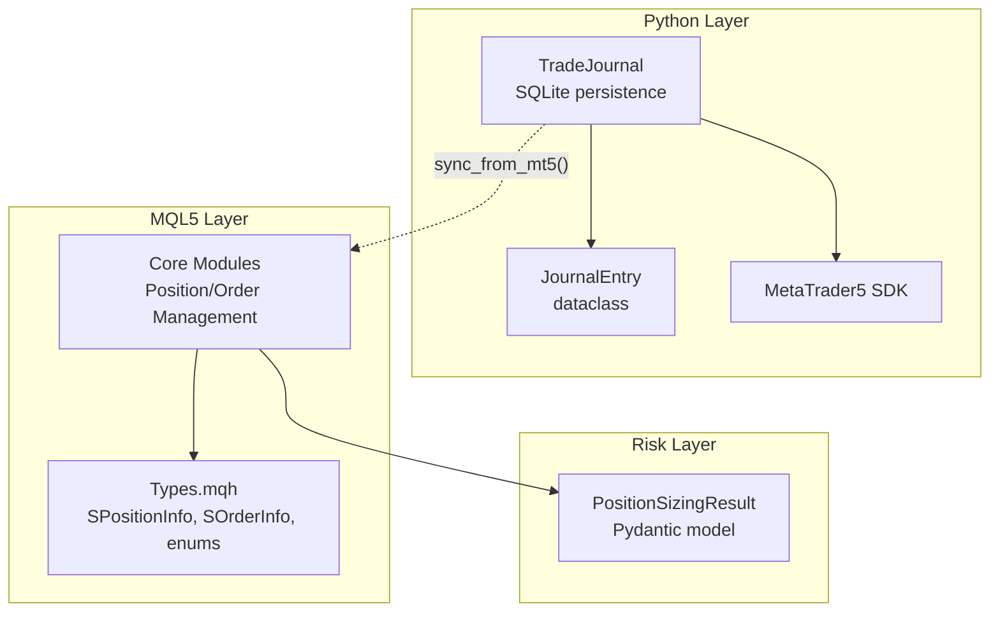
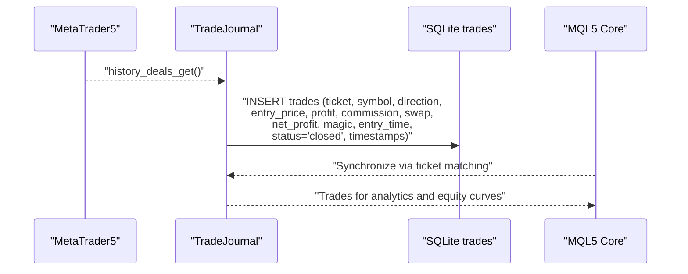
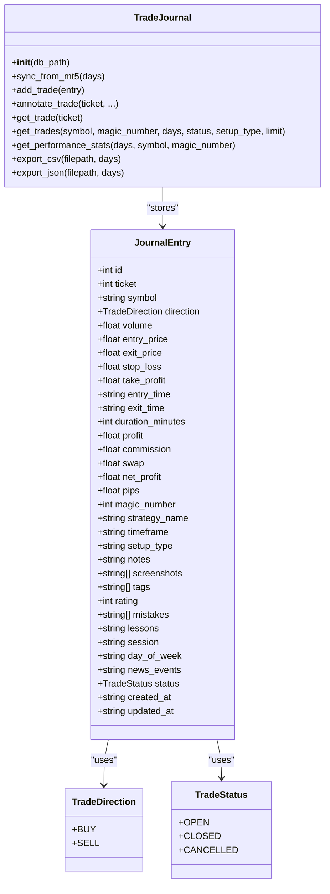
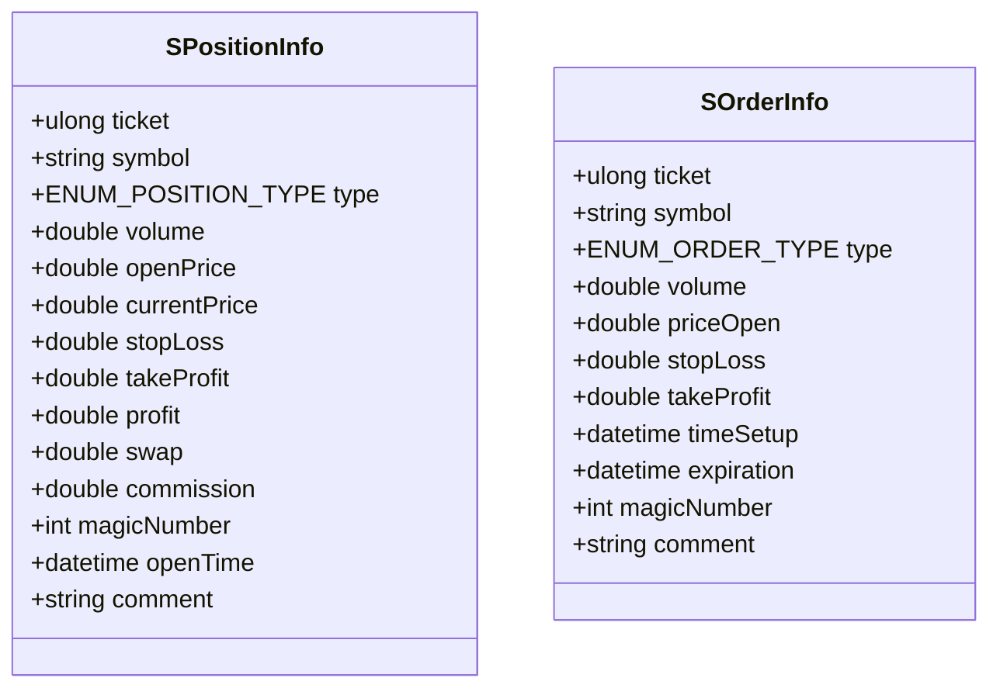
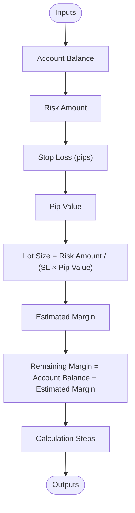
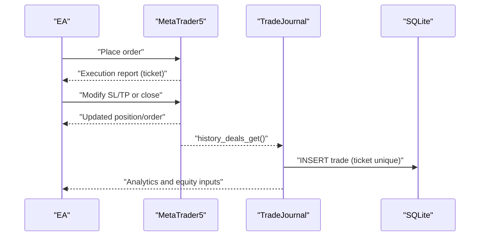
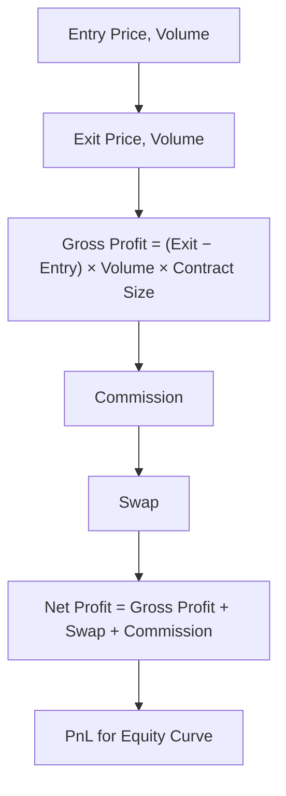
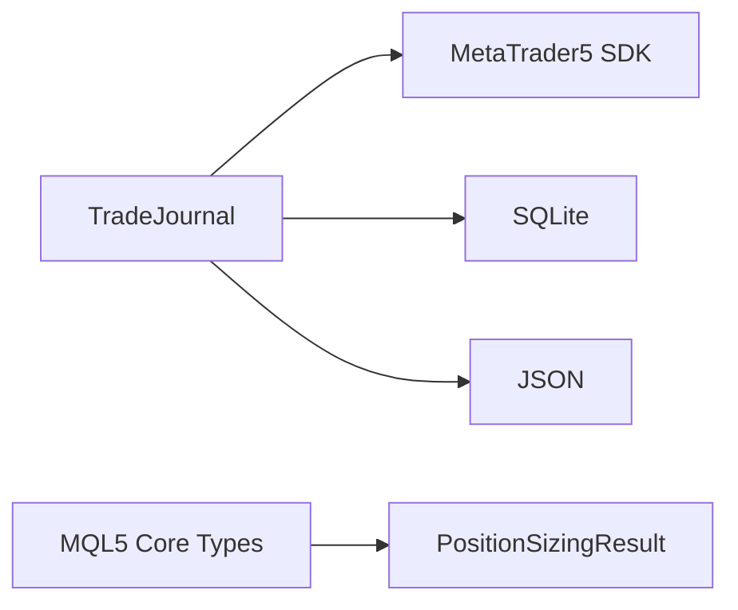

# Position and Trade Tracking

<cite>
**Referenced Files in This Document**
- [journal.py](file://mcp-metatrader5-server/src/mcp_mt5/journal.py)
- [Types.mqh](file://src/mql5/Include/QuantMind/Core/Types.mqh)
- [position_sizing_result.py](file://src/risk/models/position_sizing_result.py)
- [api_reference.md](file://mcp-metatrader5-server/docs/api_reference.md)
- [enhanced_kelly_position_sizing_v1.md](file://docs/trds/enhanced_kelly_position_sizing_v1.md)
</cite>

## Table of Contents
1. [Introduction](#introduction)
2. [Project Structure](#project-structure)
3. [Core Components](#core-components)
4. [Architecture Overview](#architecture-overview)
5. [Detailed Component Analysis](#detailed-component-analysis)
6. [Dependency Analysis](#dependency-analysis)
7. [Performance Considerations](#performance-considerations)
8. [Troubleshooting Guide](#troubleshooting-guide)
9. [Conclusion](#conclusion)
10. [Appendices](#appendices)

## Introduction
This document describes the Position and Trade Tracking system across the Python-based MCP-MetaTrader5 server and the MQL5-based QuantMind Core. It documents:
- Position and Trade data models
- Position lifecycle and trade execution logic
- Profit/loss calculations including slippage and commission adjustments
- Position size tracking and integration with position sizing
- Ticket numbering and matching algorithms
- Practical examples and integration with equity curve calculations

## Project Structure
The Position and Trade Tracking system spans:
- Python Trade Journal service for persistent trade logging, synchronization from MT5, and analytics
- MQL5 Core Types for position/order structures and enums
- Position sizing models for risk-aware position sizing

**Diagram sources**
- [journal.py](file://mcp-metatrader5-server/src/mcp_mt5/journal.py#L105-L598)
- [Types.mqh](file://src/mql5/Include/QuantMind/Core/Types.mqh#L140-L173)
- [position_sizing_result.py](file://src/risk/models/position_sizing_result.py#L16-L246)

**Section sources**
- [journal.py](file://mcp-metatrader5-server/src/mcp_mt5/journal.py#L1-L598)
- [Types.mqh](file://src/mql5/Include/QuantMind/Core/Types.mqh#L1-L362)
- [position_sizing_result.py](file://src/risk/models/position_sizing_result.py#L1-L246)

## Core Components
- TradeJournal: Persistent storage and retrieval of trades with SQLite, synchronization from MT5 history, annotations, and analytics.
- JournalEntry: Data model capturing trade metadata, pricing, timing, results, and annotations.
- SPositionInfo/SOrderInfo: MQL5 structures representing open positions and orders with tickets, volumes, prices, and timestamps.
- PositionSizingResult: Pydantic model for position sizing with risk parameters, lot size, margin, and audit trail.

Key responsibilities:
- Track open positions via tickets and synchronize closed trades from MT5 history
- Compute realized PnL, net profit, and performance metrics
- Provide position sizing inputs for risk-aware trade execution

**Section sources**
- [journal.py](file://mcp-metatrader5-server/src/mcp_mt5/journal.py#L48-L99)
- [journal.py](file://mcp-metatrader5-server/src/mcp_mt5/journal.py#L105-L223)
- [Types.mqh](file://src/mql5/Include/QuantMind/Core/Types.mqh#L140-L173)
- [position_sizing_result.py](file://src/risk/models/position_sizing_result.py#L16-L90)

## Architecture Overview
The system integrates Python and MQL5 layers:
- Python TradeJournal reads MT5 history and writes normalized trade records
- MQL5 Core emits position/order events and structures
- Position sizing feeds risk-aware lot sizes into execution

**Diagram sources**
- [journal.py](file://mcp-metatrader5-server/src/mcp_mt5/journal.py#L224-L286)
- [api_reference.md](file://mcp-metatrader5-server/docs/api_reference.md#L391-L398)

## Detailed Component Analysis

### TradeJournal and JournalEntry
- JournalEntry captures core trade data (ticket, symbol, direction, volume), pricing (entry/exit, SL/TP), timing (entry/exit, duration), results (profit, commission, swap, net profit, pips), strategy metadata (magic number, strategy name, timeframe), annotations (setup type, notes, tags, rating, mistakes, lessons), market context (session, day of week, news events), and status with timestamps.
- TradeJournal initializes SQLite schema, indexes, and supports:
  - sync_from_mt5: Imports closed deals from MT5 history into the journal
  - add_trade: Manual insertion of trades
  - annotate_trade: Adds notes/tags/rating/etc. to existing trades
  - get_trades/get_trade: Query trades with filters and pagination
  - get_performance_stats: Computes win rate, profit factor, average win/loss, daily PnL distribution
  - export_csv/export_json: Export trade history

**Diagram sources**
- [journal.py](file://mcp-metatrader5-server/src/mcp_mt5/journal.py#L35-L99)
- [journal.py](file://mcp-metatrader5-server/src/mcp_mt5/journal.py#L105-L598)

**Section sources**
- [journal.py](file://mcp-metatrader5-server/src/mcp_mt5/journal.py#L48-L99)
- [journal.py](file://mcp-metatrader5-server/src/mcp_mt5/journal.py#L105-L223)
- [journal.py](file://mcp-metatrader5-server/src/mcp_mt5/journal.py#L224-L286)
- [journal.py](file://mcp-metatrader5-server/src/mcp_mt5/journal.py#L414-L472)
- [journal.py](file://mcp-metatrader5-server/src/mcp_mt5/journal.py#L474-L539)

### MQL5 Position and Order Structures
- SPositionInfo: Captures open position attributes including ticket, symbol, type (buy/sell), volume, open/close prices, SL/TP, current profit/loss, swap, commission, magic number, open time, and comment.
- SOrderInfo: Captures pending order attributes including ticket, symbol, type, volume, price, SL/TP, setup/expiry times, magic number, and comment.
- Enums for trade decisions, agent types, risk/account statuses, signal types, and strategy quality are defined for consistent cross-module communication.

**Diagram sources**
- [Types.mqh](file://src/mql5/Include/QuantMind/Core/Types.mqh#L140-L173)

**Section sources**
- [Types.mqh](file://src/mql5/Include/QuantMind/Core/Types.mqh#L140-L173)

### Position Sizing Integration
- PositionSizingResult encapsulates risk-aware sizing with:
  - Inputs: account balance, risk amount, stop-loss pips, pip value
  - Outputs: recommended lot size, estimated margin, remaining margin
  - Utilities: risk percentage, risk per lot, calculation steps, margin utilization, sufficiency checks, JSON-safe serialization
- References:
  - Enhanced Kelly position sizing specification for detailed methodology

**Diagram sources**
- [position_sizing_result.py](file://src/risk/models/position_sizing_result.py#L16-L90)
- [position_sizing_result.py](file://src/risk/models/position_sizing_result.py#L126-L144)
- [position_sizing_result.py](file://src/risk/models/position_sizing_result.py#L146-L185)

**Section sources**
- [position_sizing_result.py](file://src/risk/models/position_sizing_result.py#L16-L90)
- [position_sizing_result.py](file://src/risk/models/position_sizing_result.py#L126-L185)
- [enhanced_kelly_position_sizing_v1.md](file://docs/trds/enhanced_kelly_position_sizing_v1.md)

### Position Lifecycle and Trade Execution Logic
- Lifecycle stages:
  - Open position: Created via order execution; tracked by ticket with SPositionInfo
  - Modify/Update: Adjust SL/TP or volume; reflected in SPositionInfo updates
  - Close position: Converted to closed trade; captured by TradeJournal via sync_from_mt5
- Matching and ticketing:
  - Ticket numbers uniquely identify orders and positions
  - TradeJournal inserts trades keyed by ticket to avoid duplicates
  - Annotations enrich closed trades post-sync

**Diagram sources**
- [journal.py](file://mcp-metatrader5-server/src/mcp_mt5/journal.py#L224-L286)
- [Types.mqh](file://src/mql5/Include/QuantMind/Core/Types.mqh#L140-L173)

**Section sources**
- [journal.py](file://mcp-metatrader5-server/src/mcp_mt5/journal.py#L224-L286)
- [Types.mqh](file://src/mql5/Include/QuantMind/Core/Types.mqh#L140-L173)

### Profit/Loss Calculations with Slippage and Commission Adjustments
- Realized PnL:
  - profit: Broker-reported realized profit from deals
  - commission: Deducted from profit to compute net_profit
  - swap: Financing component included in net_profit
  - net_profit = profit + commission + swap
- Slippage modeling:
  - Entry/exit price differences are captured in entry_price and exit_price
  - PnL calculations use these prices and volume to derive realized outcomes
- TradeJournal aggregates performance metrics (win rate, profit factor, average win/loss, daily PnL) for equity curve analysis

**Diagram sources**
- [journal.py](file://mcp-metatrader5-server/src/mcp_mt5/journal.py#L474-L539)
- [journal.py](file://mcp-metatrader5-server/src/mcp_mt5/journal.py#L266-L279)

**Section sources**
- [journal.py](file://mcp-metatrader5-server/src/mcp_mt5/journal.py#L474-L539)
- [journal.py](file://mcp-metatrader5-server/src/mcp_mt5/journal.py#L266-L279)

### Position Size Tracking
- PositionSizingResult provides:
  - lot_size recommendation derived from risk parameters
  - estimated_margin and remaining_margin for margin availability checks
  - calculation_steps for auditability
- Integration:
  - Use PositionSizingResult lot_size as SPositionInfo.volume during order placement
  - Validate margin sufficiency before execution

**Section sources**
- [position_sizing_result.py](file://src/risk/models/position_sizing_result.py#L16-L90)
- [position_sizing_result.py](file://src/risk/models/position_sizing_result.py#L206-L236)
- [Types.mqh](file://src/mql5/Include/QuantMind/Core/Types.mqh#L140-L173)

### Practical Examples

- Position lifecycle management:
  - Place order via MQL5, receive ticket
  - Update SL/TP or reduce/increase position volume
  - Close position; confirm closed trade appears in history
  - Verify ticket uniqueness and status transitions

- Trade history analysis:
  - Use get_trades with filters (symbol, magic_number, days, status)
  - Compute performance stats with get_performance_stats
  - Export to CSV/JSON for external analytics

- Integration with equity curve calculations:
  - Use net_profit and daily PnL breakdown from get_performance_stats
  - Aggregate daily PnL for equity growth visualization

**Section sources**
- [journal.py](file://mcp-metatrader5-server/src/mcp_mt5/journal.py#L414-L472)
- [journal.py](file://mcp-metatrader5-server/src/mcp_mt5/journal.py#L474-L539)
- [journal.py](file://mcp-metatrader5-server/src/mcp_mt5/journal.py#L541-L568)

### Ticket Numbering System and Matching Algorithms
- Ticketing:
  - Tickets are unique identifiers for orders and positions
  - TradeJournal enforces uniqueness via database constraint and pre-checks
- Matching:
  - sync_from_mt5 matches deals to tickets and inserts closed trades
  - Annotations enrich trades post-insertion

**Section sources**
- [journal.py](file://mcp-metatrader5-server/src/mcp_mt5/journal.py#L254-L258)
- [journal.py](file://mcp-metatrader5-server/src/mcp_mt5/journal.py#L266-L279)

### Error Handling for Unmatched Positions
- Duplicate prevention:
  - Pre-check for existing ticket before insert
- Graceful handling:
  - Exceptions during sync are collected and returned as errors
- Operational guidance:
  - Log and inspect errors; reconcile missing trades manually if needed

**Section sources**
- [journal.py](file://mcp-metatrader5-server/src/mcp_mt5/journal.py#L254-L258)
- [journal.py](file://mcp-metatrader5-server/src/mcp_mt5/journal.py#L282-L286)

## Dependency Analysis
- TradeJournal depends on:
  - SQLite for persistence
  - MetaTrader5 SDK for history retrieval
  - JSON for serializing annotation lists
- MQL5 Core Types define structures consumed by execution agents and risk monitors
- PositionSizingResult provides inputs to execution agents for risk-aware sizing

**Diagram sources**
- [journal.py](file://mcp-metatrader5-server/src/mcp_mt5/journal.py#L15-L28)
- [Types.mqh](file://src/mql5/Include/QuantMind/Core/Types.mqh#L1-L362)
- [position_sizing_result.py](file://src/risk/models/position_sizing_result.py#L1-L246)

**Section sources**
- [journal.py](file://mcp-metatrader5-server/src/mcp_mt5/journal.py#L15-L28)
- [Types.mqh](file://src/mql5/Include/QuantMind/Core/Types.mqh#L1-L362)
- [position_sizing_result.py](file://src/risk/models/position_sizing_result.py#L1-L246)

## Performance Considerations
- Indexing: TradeJournal creates indexes on symbol, entry_time, magic_number, and status to optimize queries
- Batch sync: sync_from_mt5 processes deals in batches; tune days window for performance
- Serialization: JSON fields are stored compactly; consider compression for large exports
- Risk sizing: Use PositionSizingResult to avoid overexposure and reduce rebalancing frequency

[No sources needed since this section provides general guidance]

## Troubleshooting Guide
- No trades found:
  - Verify sync period and MT5 credentials
  - Check status filters and symbol selection
- Missing trades after sync:
  - Review errors returned by sync_from_mt5
  - Confirm ticket uniqueness and absence of duplicates
- Annotation not applied:
  - Ensure ticket exists and updates clause is not empty
- Equity curve anomalies:
  - Validate net_profit computation and daily aggregation logic

**Section sources**
- [journal.py](file://mcp-metatrader5-server/src/mcp_mt5/journal.py#L282-L286)
- [journal.py](file://mcp-metatrader5-server/src/mcp_mt5/journal.py#L395-L401)
- [journal.py](file://mcp-metatrader5-server/src/mcp_mt5/journal.py#L512-L521)

## Conclusion
The Position and Trade Tracking system combines a robust Python TradeJournal for persistent trade logging and analytics with MQL5 Core structures for position/order management and a risk-aware PositionSizingResult for sizing. Together they enable lifecycle tracking, accurate PnL computation, and integration with equity curve analysis while maintaining strong ticketing discipline and operational resilience.

[No sources needed since this section summarizes without analyzing specific files]

## Appendices

### Appendix A: Trade Actions Reference
- Trade actions supported by the MT5 integration include market orders, pending orders, SL/TP modification, order modification/removal, and close-by operations.

**Section sources**
- [api_reference.md](file://mcp-metatrader5-server/docs/api_reference.md#L391-L398)