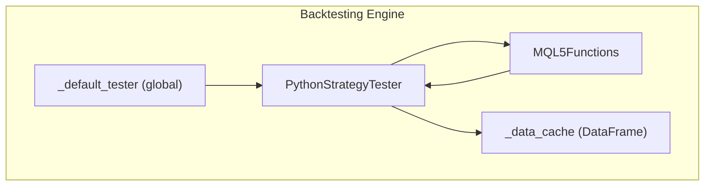
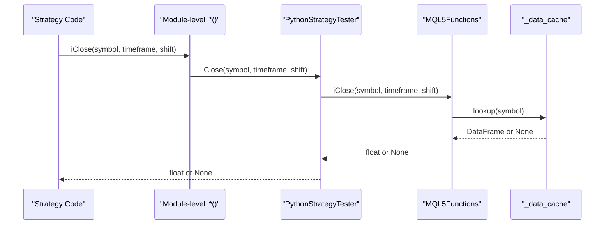
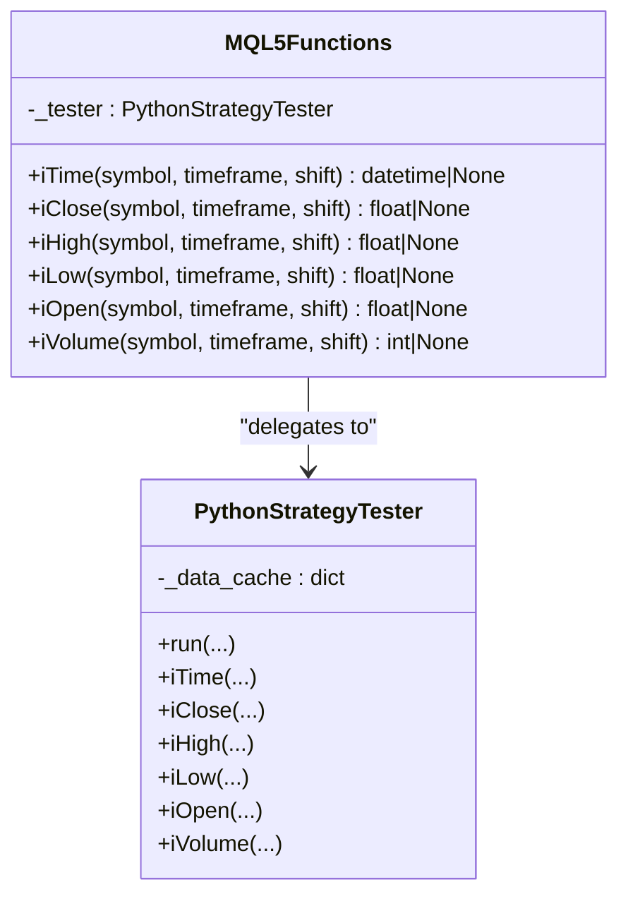
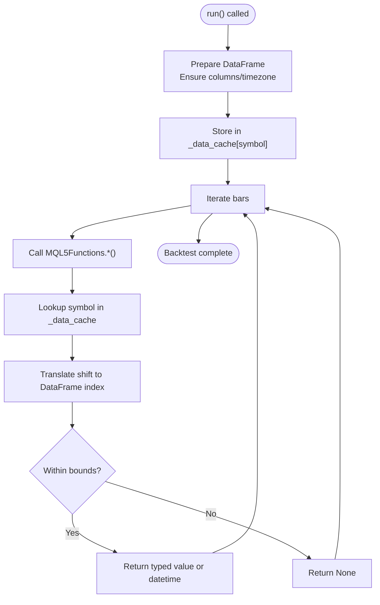
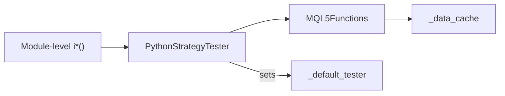

# MQL5 Built-in Function Overloading

<cite>
**Referenced Files in This Document**
- [mt5_engine.py](file://src/backtesting/mt5_engine.py)
</cite>

## Table of Contents
1. [Introduction](#introduction)
2. [Project Structure](#project-structure)
3. [Core Components](#core-components)
4. [Architecture Overview](#architecture-overview)
5. [Detailed Component Analysis](#detailed-component-analysis)
6. [Dependency Analysis](#dependency-analysis)
7. [Performance Considerations](#performance-considerations)
8. [Troubleshooting Guide](#troubleshooting-guide)
9. [Conclusion](#conclusion)
10. [Appendices](#appendices)

## Introduction
This document explains the MQL5 built-in function overloading system implemented in the Python backtesting engine. It focuses on the MQL5Functions class that provides Python equivalents for iTime, iClose, iHigh, iLow, iOpen, and iVolume. It documents function signatures, parameter handling, return value conversions, and the module-level convenience functions. It also covers the _default_tester global reference mechanism, data caching, error handling for invalid indices, and the negative shift indexing convention used in MQL5. Finally, it provides migration guidance for existing MQL5 code.

## Project Structure
The overloading system resides in the backtesting engine module responsible for simulating a MQL5-like environment in Python. The relevant components are:
- MQL5Functions: Implements Python equivalents of MQL5 series functions
- Module-level convenience functions: iTime, iClose, iHigh, iLow, iVolume
- _default_tester: Global reference enabling module-level usage
- PythonStrategyTester: Orchestrates strategy execution and delegates MQL5 function calls

**Diagram sources**
- [mt5_engine.py](file://src/backtesting/mt5_engine.py#L154-L284)
- [mt5_engine.py](file://src/backtesting/mt5_engine.py#L286-L314)
- [mt5_engine.py](file://src/backtesting/mt5_engine.py#L320-L405)

**Section sources**
- [mt5_engine.py](file://src/backtesting/mt5_engine.py#L1-L100)

## Core Components
- MQL5Functions: Provides Python-native implementations of iTime, iClose, iHigh, iLow, iOpen, and iVolume. It accepts symbol, timeframe, and shift parameters and returns appropriate types (datetime, float, or int) or None for invalid indices.
- Module-level convenience functions: iTime, iClose, iHigh, iLow, iVolume delegate to the currently active tester via _default_tester.
- _default_tester: A global reference set by PythonStrategyTester upon instantiation, enabling module-level usage without explicit tester injection.
- PythonStrategyTester: Manages data caching, strategy execution, and exposes both class methods and module-level functions for MQL5 compatibility.

Key behaviors:
- Negative shift indexing: Converts MQL5’s negative shift convention to DataFrame indexing.
- Return value conversions: Ensures datetime is timezone-aware and numeric values are cast appropriately.
- Error handling: Returns None for invalid indices or missing data.

**Section sources**
- [mt5_engine.py](file://src/backtesting/mt5_engine.py#L154-L284)
- [mt5_engine.py](file://src/backtesting/mt5_engine.py#L286-L314)
- [mt5_engine.py](file://src/backtesting/mt5_engine.py#L320-L405)

## Architecture Overview
The system bridges MQL5 semantics to Python by delegating series function calls to MQL5Functions, which operate on cached DataFrames. Module-level functions act as thin wrappers around the active tester.

**Diagram sources**
- [mt5_engine.py](file://src/backtesting/mt5_engine.py#L286-L314)
- [mt5_engine.py](file://src/backtesting/mt5_engine.py#L545-L563)
- [mt5_engine.py](file://src/backtesting/mt5_engine.py#L192-L214)

## Detailed Component Analysis

### MQL5Functions Class
MQL5Functions encapsulates the MQL5 series function equivalents. It expects:
- symbol: Trading pair identifier (e.g., "EURUSD")
- timeframe: MQL5 timeframe constant (e.g., MQL5Timeframe.PERIOD_H1)
- shift: Bar index with MQL5 negative shift convention (0=current, -1=previous, etc.)

Behavior highlights:
- Index translation: Converts shift to DataFrame index using -1 - shift
- Bounds checking: Ensures index is within [-len(data), len(data))
- Return conversions: Datetime is normalized to timezone-aware; numeric values are cast to float or int
- Error handling: Returns None for invalid indices or missing symbol data

**Diagram sources**
- [mt5_engine.py](file://src/backtesting/mt5_engine.py#L154-L284)
- [mt5_engine.py](file://src/backtesting/mt5_engine.py#L320-L563)

**Section sources**
- [mt5_engine.py](file://src/backtesting/mt5_engine.py#L154-L284)

### Module-level Convenience Functions
The module-level functions mirror class methods and rely on the global _default_tester:
- iTime(symbol, timeframe, shift)
- iClose(symbol, timeframe, shift)
- iHigh(symbol, timeframe, shift)
- iLow(symbol, timeframe, shift)
- iVolume(symbol, timeframe, shift)

Usage pattern:
- When a strategy runs, PythonStrategyTester sets _default_tester to itself
- Module-level functions call _default_tester’s methods, enabling MQL5-style usage without explicit tester references

**Section sources**
- [mt5_engine.py](file://src/backtesting/mt5_engine.py#L286-L314)
- [mt5_engine.py](file://src/backtesting/mt5_engine.py#L402-L405)

### Data Caching Mechanism
PythonStrategyTester maintains a _data_cache keyed by symbol. Each value is a DataFrame with OHLCV columns and a timezone-aware time column. The cache is populated during run() and used by MQL5Functions to resolve series values.

- Preparation: Ensures required columns exist and normalizes datetime handling
- Access: MQL5Functions retrieves rows by translated negative shift index

**Diagram sources**
- [mt5_engine.py](file://src/backtesting/mt5_engine.py#L783-L820)
- [mt5_engine.py](file://src/backtesting/mt5_engine.py#L174-L190)
- [mt5_engine.py](file://src/backtesting/mt5_engine.py#L192-L214)

**Section sources**
- [mt5_engine.py](file://src/backtesting/mt5_engine.py#L783-L820)
- [mt5_engine.py](file://src/backtesting/mt5_engine.py#L174-L283)

### Parameter Handling and Return Conversions
- Parameters:
  - symbol: String identifier
  - timeframe: Integer constant mapped to MT5 timeframe
  - shift: Integer with MQL5 convention (0=current bar)
- Return conversions:
  - iTime: datetime or None; ensures timezone-aware datetime
  - iClose/iHigh/iLow/iOpen: float or None
  - iVolume: int or None

**Section sources**
- [mt5_engine.py](file://src/backtesting/mt5_engine.py#L163-L190)
- [mt5_engine.py](file://src/backtesting/mt5_engine.py#L192-L214)
- [mt5_engine.py](file://src/backtesting/mt5_engine.py#L216-L244)
- [mt5_engine.py](file://src/backtesting/mt5_engine.py#L246-L259)
- [mt5_engine.py](file://src/backtesting/mt5_engine.py#L261-L283)

### Error Handling for Invalid Indices
- Missing symbol or empty cache: All functions return None
- Out-of-bounds shift: Caught by IndexError/KeyError and returns None
- Type mismatches: Numeric casts return None if conversion fails

**Section sources**
- [mt5_engine.py](file://src/backtesting/mt5_engine.py#L174-L190)
- [mt5_engine.py](file://src/backtesting/mt5_engine.py#L203-L214)
- [mt5_engine.py](file://src/backtesting/mt5_engine.py#L218-L229)
- [mt5_engine.py](file://src/backtesting/mt5_engine.py#L233-L244)
- [mt5_engine.py](file://src/backtesting/mt5_engine.py#L248-L259)
- [mt5_engine.py](file://src/backtesting/mt5_engine.py#L272-L283)

### Negative Shift Indexing Convention
MQL5 uses negative indices to access historical bars (shift=-1 is the previous bar). The implementation translates this to DataFrame indexing:
- idx = -1 - shift
- Bounds check: -len(data) <= idx < len(data)

This ensures consistent semantics with MQL5 while leveraging pandas’ efficient indexing.

**Section sources**
- [mt5_engine.py](file://src/backtesting/mt5_engine.py#L179-L181)
- [mt5_engine.py](file://src/backtesting/mt5_engine.py#L207-L209)
- [mt5_engine.py](file://src/backtesting/mt5_engine.py#L223-L225)
- [mt5_engine.py](file://src/backtesting/mt5_engine.py#L237-L239)
- [mt5_engine.py](file://src/backtesting/mt5_engine.py#L252-L255)
- [mt5_engine.py](file://src/backtesting/mt5_engine.py#L276-L279)

### Migration Guidance for Existing MQL5 Code
- Replace direct MT5 calls with MQL5Functions or module-level functions:
  - Use iClose(symbol, timeframe, shift) instead of iClose(symbol, timeframe, shift)
  - Use iTime, iHigh, iLow, iOpen, iVolume analogously
- Preserve negative shift semantics:
  - shift=-1 remains the previous bar
- Adapt return types:
  - iTime returns datetime; ensure downstream logic handles None
  - iClose/iHigh/iLow/iOpen return float; iVolume returns int
- Initialize a tester to populate _default_tester:
  - Instantiate PythonStrategyTester before importing module-level functions
- Data preparation:
  - Ensure OHLCV DataFrame includes required columns and timezone-aware time

**Section sources**
- [mt5_engine.py](file://src/backtesting/mt5_engine.py#L286-L314)
- [mt5_engine.py](file://src/backtesting/mt5_engine.py#L320-L405)
- [mt5_engine.py](file://src/backtesting/mt5_engine.py#L783-L820)

## Dependency Analysis
The overloading system exhibits clean separation of concerns:
- PythonStrategyTester orchestrates execution and holds the cache
- MQL5Functions performs lookups against the cache
- Module-level functions depend on _default_tester for delegation

**Diagram sources**
- [mt5_engine.py](file://src/backtesting/mt5_engine.py#L320-L405)
- [mt5_engine.py](file://src/backtesting/mt5_engine.py#L154-L284)
- [mt5_engine.py](file://src/backtesting/mt5_engine.py#L286-L314)

**Section sources**
- [mt5_engine.py](file://src/backtesting/mt5_engine.py#L320-L405)
- [mt5_engine.py](file://src/backtesting/mt5_engine.py#L154-L284)
- [mt5_engine.py](file://src/backtesting/mt5_engine.py#L286-L314)

## Performance Considerations
- DataFrame indexing is O(1) per lookup; ensure minimal DataFrame copies
- Timezone normalization occurs once per iTime call; consider caching if repeated calls are frequent
- Avoid excessive negative shift usage beyond available history to prevent repeated None returns
- For large datasets, precompute and reuse DataFrames to minimize overhead

## Troubleshooting Guide
Common issues and resolutions:
- Unexpected None returns:
  - Verify symbol exists in _data_cache and DataFrame is properly prepared
  - Confirm shift is within bounds using the negative shift convention
- Incorrect datetimes:
  - Ensure time column is timezone-aware; the implementation normalizes timestamps
- Type conversion errors:
  - iClose/iHigh/iLow/iOpen/iVolume return None if conversion fails; validate inputs

**Section sources**
- [mt5_engine.py](file://src/backtesting/mt5_engine.py#L783-L820)
- [mt5_engine.py](file://src/backtesting/mt5_engine.py#L174-L190)
- [mt5_engine.py](file://src/backtesting/mt5_engine.py#L203-L214)
- [mt5_engine.py](file://src/backtesting/mt5_engine.py#L218-L229)
- [mt5_engine.py](file://src/backtesting/mt5_engine.py#L233-L244)
- [mt5_engine.py](file://src/backtesting/mt5_engine.py#L248-L259)
- [mt5_engine.py](file://src/backtesting/mt5_engine.py#L272-L283)

## Conclusion
The MQL5 built-in function overloading system provides a seamless bridge between MQL5 semantics and Python. MQL5Functions offers accurate series function equivalents with strict parameter handling and return conversions. The module-level convenience functions and _default_tester mechanism enable drop-in usage for existing MQL5 strategies. Proper data preparation and adherence to negative shift conventions ensure reliable behavior.

## Appendices
- Exported symbols include PythonStrategyTester, MT5BacktestResult, MQL5Timeframe, MQL5Functions, and module-level i* functions.

**Section sources**
- [mt5_engine.py](file://src/backtesting/mt5_engine.py#L978-L991)