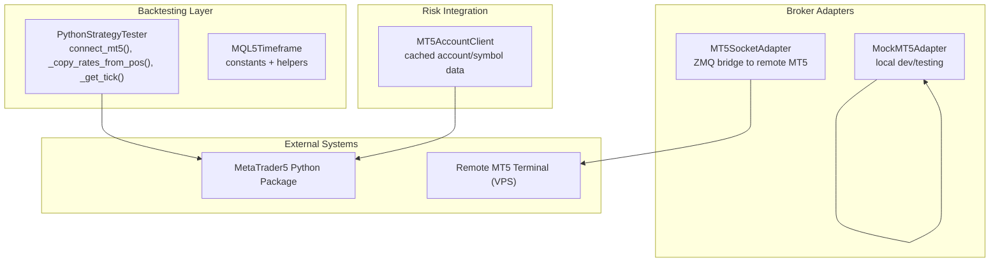
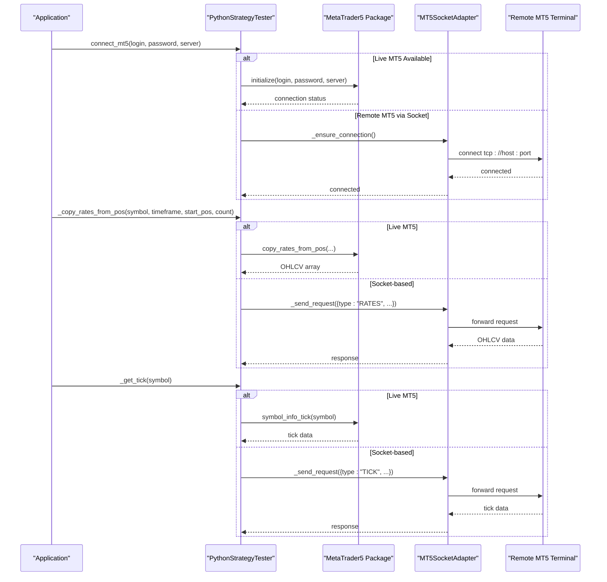
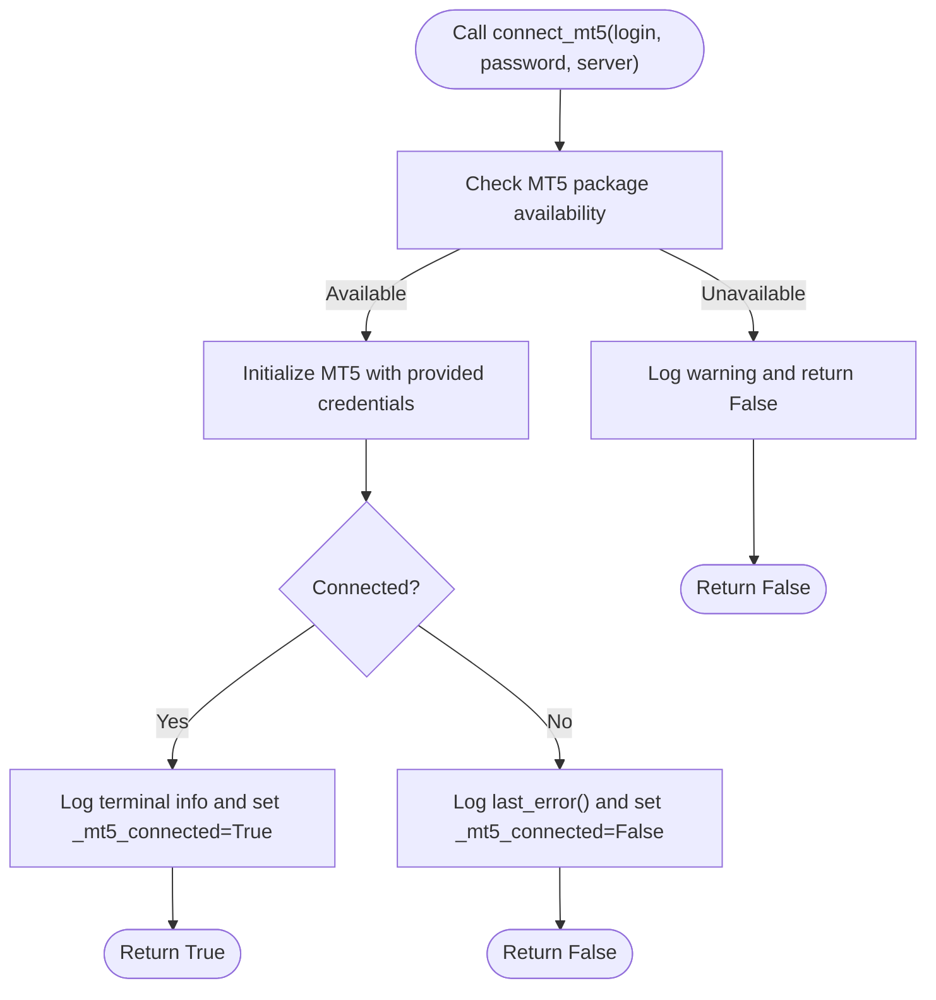
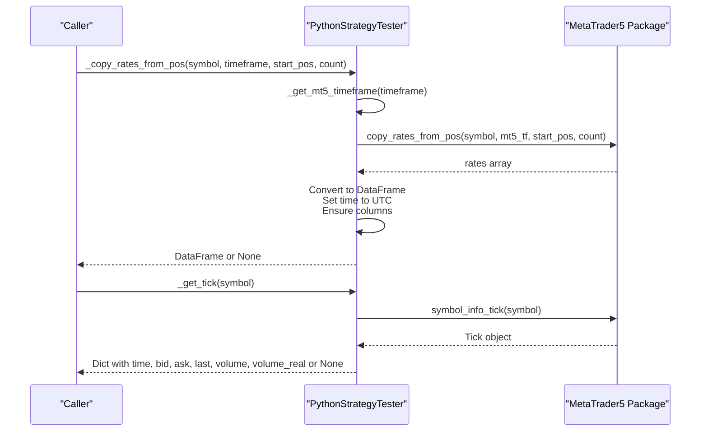
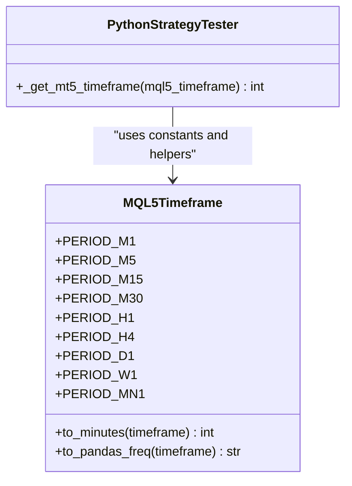
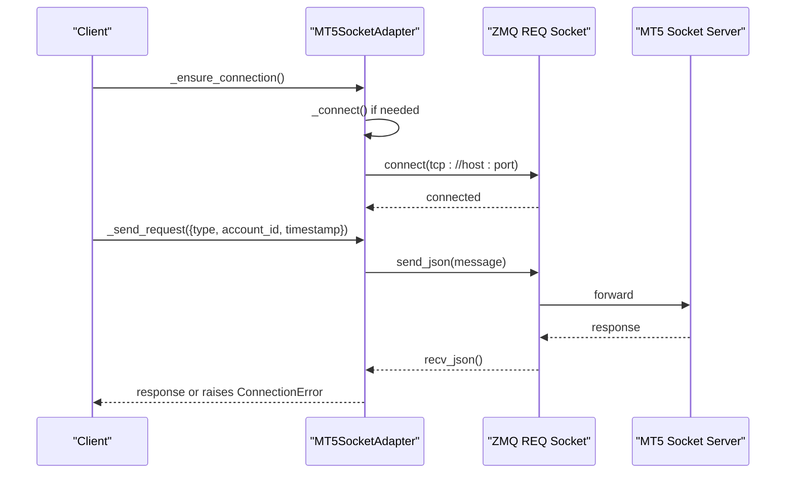
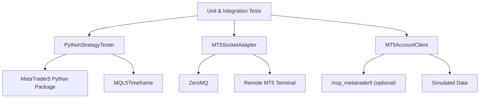

# MT5 Package Integration

<cite>
**Referenced Files in This Document**
- [mt5_engine.py](file://src/backtesting/mt5_engine.py)
- [mt5_client.py](file://src/risk/integrations/mt5_client.py)
- [mt5_socket_adapter.py](file://src/data/brokers/mt5_socket_adapter.py)
- [mock_mt5_adapter.py](file://src/data/brokers/mock_mt5_adapter.py)
- [test_mt5_engine.py](file://tests/backtesting/test_mt5_engine.py)
- [test_mql5_python_bridge.py](file://tests/integration/test_mql5_python_bridge.py)
- [read_mt5_data.md](file://docs/skills/system_skills/read_mt5_data.md)
</cite>

## Table of Contents
1. [Introduction](#introduction)
2. [Project Structure](#project-structure)
3. [Core Components](#core-components)
4. [Architecture Overview](#architecture-overview)
5. [Detailed Component Analysis](#detailed-component-analysis)
6. [Dependency Analysis](#dependency-analysis)
7. [Performance Considerations](#performance-considerations)
8. [Troubleshooting Guide](#troubleshooting-guide)
9. [Conclusion](#conclusion)

## Introduction
This document describes the MT5 package integration subsystem within the Quantmindx platform. It focuses on three primary areas:
- MT5 connection handling via the Python MetaTrader5 package, including the connect_mt5() method, login/password/server configuration, and error handling.
- Data retrieval mechanisms using _copy_rates_from_pos() for OHLCV historical data and _get_tick() for real-time tick data.
- Timeframe conversion utilities via _get_mt5_timeframe() and the MQL5Timeframe class constants.
Additionally, it covers practical initialization patterns, integration with external MT5 terminals, connection reliability strategies, error recovery, and performance considerations for high-frequency data access.

## Project Structure
The MT5 integration spans several modules:
- Backtesting engine with MQL5 function overloading and MT5 data retrieval
- Risk integration client with graceful degradation and caching
- Socket adapter for remote MT5 connectivity
- Mock adapter for local development and testing
- Integration tests validating end-to-end workflows and error handling

**Diagram sources**
- [mt5_engine.py](file://src/backtesting/mt5_engine.py#L320-L536)
- [mt5_client.py](file://src/risk/integrations/mt5_client.py#L156-L304)
- [mt5_socket_adapter.py](file://src/data/brokers/mt5_socket_adapter.py#L29-L72)

**Section sources**
- [mt5_engine.py](file://src/backtesting/mt5_engine.py#L1-L100)
- [mt5_client.py](file://src/risk/integrations/mt5_client.py#L1-L40)
- [mt5_socket_adapter.py](file://src/data/brokers/mt5_socket_adapter.py#L1-L40)

## Core Components
- PythonStrategyTester: Provides MQL5 function overloading (iTime, iClose, iHigh, iLow, iVolume), MT5 connection management, OHLCV retrieval via _copy_rates_from_pos(), real-time tick retrieval via _get_tick(), timeframe conversion via _get_mt5_timeframe(), and performance metrics calculation.
- MQL5Timeframe: Defines MQL5 timeframe constants and helper methods to convert to minutes and pandas frequency strings.
- MT5AccountClient: Risk integration client with caching, graceful degradation, and simulated data fallback when MT5 is unavailable.
- MT5SocketAdapter: Asynchronous adapter that communicates with a remote MT5 terminal via a ZMQ socket bridge.
- MockMT5Adapter: Local mock adapter for development and testing without requiring MT5.

**Section sources**
- [mt5_engine.py](file://src/backtesting/mt5_engine.py#L39-L83)
- [mt5_engine.py](file://src/backtesting/mt5_engine.py#L410-L536)
- [mt5_client.py](file://src/risk/integrations/mt5_client.py#L156-L304)
- [mt5_socket_adapter.py](file://src/data/brokers/mt5_socket_adapter.py#L29-L72)
- [mock_mt5_adapter.py](file://src/data/brokers/mock_mt5_adapter.py#L21-L62)

## Architecture Overview
The MT5 integration supports multiple operational modes:
- Live MT5 terminal access via the MetaTrader5 Python package
- Remote MT5 terminal access via a socket bridge (ZMQ REQ/REP)
- Local development/testing via a mock adapter

**Diagram sources**
- [mt5_engine.py](file://src/backtesting/mt5_engine.py#L410-L536)
- [mt5_socket_adapter.py](file://src/data/brokers/mt5_socket_adapter.py#L82-L147)

## Detailed Component Analysis

### MT5 Connection Handling
- connect_mt5(): Initializes the MetaTrader5 Python package with optional login, password, and server parameters. It sets internal connection state and logs success/failure. It gracefully handles missing packages and returns a boolean indicating availability.
- Error handling: Logs MT5 last_error() on failure and ensures _mt5_connected is reset to False on exceptions.

**Diagram sources**
- [mt5_engine.py](file://src/backtesting/mt5_engine.py#L410-L440)

**Section sources**
- [mt5_engine.py](file://src/backtesting/mt5_engine.py#L410-L440)

### Data Retrieval Mechanisms
- _copy_rates_from_pos(): Retrieves OHLCV bars from MT5 by position. Converts timestamps to UTC, ensures required columns, and returns a DataFrame. Uses _get_mt5_timeframe() to map MQL5 timeframe constants to MT5 package constants.
- _get_tick(): Retrieves the latest tick (bid/ask/last/volume) for a symbol from MT5. Returns a dictionary with timezone-aware timestamp and market data fields.

**Diagram sources**
- [mt5_engine.py](file://src/backtesting/mt5_engine.py#L442-L517)

**Section sources**
- [mt5_engine.py](file://src/backtesting/mt5_engine.py#L442-L517)

### Timeframe Conversion Utilities
- MQL5Timeframe: Provides constants for M1, M5, M15, M30, H1, H4, D1, W1, MN1 and helper methods:
  - to_minutes(): Maps timeframe constants to integer minutes.
  - to_pandas_freq(): Maps timeframe constants to pandas frequency strings.
- _get_mt5_timeframe(): Maps MQL5 timeframe constants to MT5 package constants, falling back to raw values if MT5 constants are not available.

**Diagram sources**
- [mt5_engine.py](file://src/backtesting/mt5_engine.py#L39-L83)
- [mt5_engine.py](file://src/backtesting/mt5_engine.py#L518-L536)

**Section sources**
- [mt5_engine.py](file://src/backtesting/mt5_engine.py#L39-L83)
- [mt5_engine.py](file://src/backtesting/mt5_engine.py#L518-L536)

### Practical Examples and Patterns
- MT5 Initialization:
  - Live terminal: connect_mt5(login, password, server) to initialize the MetaTrader5 package.
  - Socket-based: use MT5SocketAdapter to connect to a remote MT5 terminal via ZMQ.
- Data Fetching:
  - Historical OHLCV: _copy_rates_from_pos(symbol, timeframe, start_pos, count) returns a DataFrame.
  - Real-time tick: _get_tick(symbol) returns a dictionary with bid/ask/last and volumes.
- Integration with external MT5 terminals:
  - Configure MT5SocketAdapter with vps_host, vps_port, and account_id.
  - Use _send_request() to issue commands (e.g., GET_BALANCE, TRADE_OPEN, GET_QUOTES).

**Section sources**
- [mt5_engine.py](file://src/backtesting/mt5_engine.py#L410-L536)
- [mt5_socket_adapter.py](file://src/data/brokers/mt5_socket_adapter.py#L42-L147)

### Socket Adapter for Remote MT5
- MT5SocketAdapter:
  - Establishes REQ socket connection to a remote MT5 server.
  - Adds account_id and timestamp to requests.
  - Handles timeouts and errors, raising ConnectionError on failures.
  - Provides methods for balance, orders, quotes, positions, and order status.

**Diagram sources**
- [mt5_socket_adapter.py](file://src/data/brokers/mt5_socket_adapter.py#L73-L147)

**Section sources**
- [mt5_socket_adapter.py](file://src/data/brokers/mt5_socket_adapter.py#L29-L397)

### Mock Adapter for Development
- MockMT5Adapter:
  - Simulates MT5 behavior locally for development and testing.
  - Provides methods for balances, orders, positions, quotes, and order status.
  - Includes helpers to update mock prices and close positions.

**Section sources**
- [mock_mt5_adapter.py](file://src/data/brokers/mock_mt5_adapter.py#L21-L354)

### Risk Integration Client with Caching and Fallback
- MT5AccountClient:
  - Wraps an MT5 account manager with caching and graceful degradation.
  - Uses 10-second TTL cache for account and symbol data.
  - Falls back to simulated data when MT5 is unavailable.
  - Provides methods to get account info, margin info, symbol info, and calculate pip value.

**Section sources**
- [mt5_client.py](file://src/risk/integrations/mt5_client.py#L156-L926)

## Dependency Analysis
Key dependencies and relationships:
- PythonStrategyTester depends on the MetaTrader5 Python package for live data access and on MQL5Timeframe for timeframe constants.
- MT5SocketAdapter depends on ZeroMQ for asynchronous communication with a remote MT5 server.
- MT5AccountClient optionally depends on mcp_metatrader5 for live account access and falls back to simulated data.
- Tests validate MT5 function overloading, data retrieval, backtesting, and performance metrics.

**Diagram sources**
- [mt5_engine.py](file://src/backtesting/mt5_engine.py#L24-L30)
- [mt5_socket_adapter.py](file://src/data/brokers/mt5_socket_adapter.py#L10-L23)
- [mt5_client.py](file://src/risk/integrations/mt5_client.py#L292-L304)

**Section sources**
- [test_mt5_engine.py](file://tests/backtesting/test_mt5_engine.py#L1-L420)
- [test_mql5_python_bridge.py](file://tests/integration/test_mql5_python_bridge.py#L1-L328)

## Performance Considerations
- Connection reliability:
  - Use connect_mt5() with explicit credentials to avoid interactive prompts and ensure deterministic initialization.
  - For remote setups, configure MT5SocketAdapter with appropriate timeout and retry parameters to mitigate network latency.
- Data access patterns:
  - Prefer batched historical data retrieval via _copy_rates_from_pos() to minimize MT5 round trips.
  - Cache frequently accessed symbol and account data using MT5AccountClient’s TTL cache to reduce MT5 calls.
- Timeframe handling:
  - Use MQL5Timeframe helpers to ensure consistent mapping between MQL5 constants and pandas frequencies.
- Error handling:
  - Wrap MT5 calls in try-except blocks and implement fallbacks (e.g., MockMT5Adapter) during development.
  - Monitor MT5 last_error() for diagnostics and adjust strategies accordingly.

[No sources needed since this section provides general guidance]

## Troubleshooting Guide
Common issues and resolutions:
- MT5 package not available:
  - The system logs a warning and disables MT5-dependent features. Install the MetaTrader5 Python package or use MockMT5Adapter for development.
- Connection failures:
  - connect_mt5() logs MT5 last_error(); verify login, password, and server parameters. For remote connections, confirm VPS reachability and firewall settings.
- Socket communication errors:
  - MT5SocketAdapter raises ConnectionError on timeouts or VPS unresponsiveness. Validate vps_host, vps_port, and account_id; ensure the socket server is running.
- Data retrieval failures:
  - _copy_rates_from_pos() and _get_tick() return None on errors; check symbol availability and MT5 connection state.
- Risk client fallback:
  - MT5AccountClient falls back to simulated data when MT5 is unavailable; confirm fallback_to_simulated setting.

**Section sources**
- [mt5_engine.py](file://src/backtesting/mt5_engine.py#L421-L440)
- [mt5_socket_adapter.py](file://src/data/brokers/mt5_socket_adapter.py#L89-L146)
- [mt5_client.py](file://src/risk/integrations/mt5_client.py#L292-L304)

## Conclusion
The MT5 integration subsystem provides flexible, reliable access to market data and account information across live, remote, and mock environments. By leveraging MQL5Timeframe constants, PythonStrategyTester’s data retrieval methods, and MT5AccountClient’s caching and fallback mechanisms, applications can maintain robust performance and resilience. Proper configuration of connect_mt5(), careful error handling, and strategic use of caching and batching are essential for high-frequency data access and production-grade reliability.