# Performance Metrics and Result Calculation

<cite>
**Referenced Files in This Document**
- [mt5_engine.py](file://src/backtesting/mt5_engine.py)
- [core_engine.py](file://src/backtesting/core_engine.py)
- [strategy_performance.py](file://src/risk/models/strategy_performance.py)
- [test_mt5_engine.py](file://tests/backtesting/test_mt5_engine.py)
- [test_performance.py](file://tests/position_sizing/test_performance.py)
- [enhanced_kelly_position_sizing_v1.md](file://docs/trds/enhanced_kelly_position_sizing_v1.md)
- [log_trade_event.md](file://docs/skills/system_skills/log_trade_event.md)
- [alternative_risk_return_metrics_in_mql5.md](file://data/scraped_articles/expert_advisors/alternative_risk_return_metrics_in_mql5.md)
</cite>

## Table of Contents
1. [Introduction](#introduction)
2. [Project Structure](#project-structure)
3. [Core Components](#core-components)
4. [Architecture Overview](#architecture-overview)
5. [Detailed Component Analysis](#detailed-component-analysis)
6. [Dependency Analysis](#dependency-analysis)
7. [Performance Considerations](#performance-considerations)
8. [Troubleshooting Guide](#troubleshooting-guide)
9. [Conclusion](#conclusion)
10. [Appendices](#appendices)

## Introduction
This document explains the performance metrics calculation system used in the backtesting engines. It focuses on the MT5BacktestResult dataclass structure, the mathematical formulas for Sharpe ratio, return percentage, and maximum drawdown, and how the equity curve, trade history, and logs are generated and managed. It also covers risk-adjusted returns, statistical measures, interpretation guidelines, benchmark comparisons, and integration with external analysis tools. Edge cases, data quality considerations, and performance characteristics are addressed to support robust strategy evaluation.

## Project Structure
The performance metrics system spans two backtesting engines and supporting models:
- Python-based MT5 engine with MQL5 built-in function overloading and native metric computation
- Backtrader-based engine with analyzers for Sharpe, drawdown, and trade statistics
- Risk model for expectancy and Kelly-based sizing
- Trade logging and statistics utilities for post-processing and benchmarking

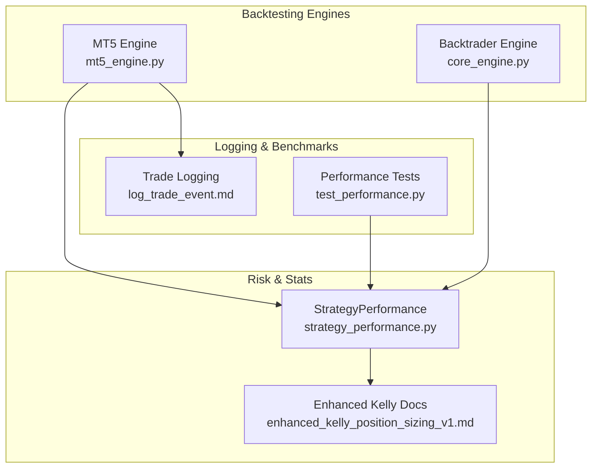

**Diagram sources**
- [mt5_engine.py](file://src/backtesting/mt5_engine.py#L89-L117)
- [core_engine.py](file://src/backtesting/core_engine.py#L8-L11)
- [strategy_performance.py](file://src/risk/models/strategy_performance.py#L16-L182)
- [enhanced_kelly_position_sizing_v1.md](file://docs/trds/enhanced_kelly_position_sizing_v1.md#L1-L234)
- [log_trade_event.md](file://docs/skills/system_skills/log_trade_event.md#L135-L458)
- [test_performance.py](file://tests/position_sizing/test_performance.py#L1-L416)

**Section sources**
- [mt5_engine.py](file://src/backtesting/mt5_engine.py#L89-L117)
- [core_engine.py](file://src/backtesting/core_engine.py#L8-L11)
- [strategy_performance.py](file://src/risk/models/strategy_performance.py#L16-L182)
- [test_performance.py](file://tests/position_sizing/test_performance.py#L25-L416)

## Core Components
- MT5BacktestResult: Structured result container with Sharpe, return percentage, maximum drawdown, total trades, initial/final cash, equity curve, trade history, and log. Includes a conversion method to dictionary for downstream consumption.
- PythonStrategyTester: Executes strategies bar-by-bar, tracks equity, positions, and trades, and computes metrics via dedicated functions.
- StrategyPerformance: Pydantic model for expectancy and Kelly-based sizing, validating inputs and computing derived metrics such as payoff ratio, expectancy, and adjusted Kelly fraction.
- BacktestResult (Backtrader engine): Lightweight structured result mirroring MT5BacktestResult fields for compatibility.

Key responsibilities:
- Equity curve generation: Maintained as a list of cumulative equity values during strategy execution.
- Trade history recording: Captures completed trades with symbol, volumes, prices, direction, timestamps, profit, and commission.
- Log management: Aggregates runtime logs and errors for traceability and debugging.

**Section sources**
- [mt5_engine.py](file://src/backtesting/mt5_engine.py#L89-L117)
- [mt5_engine.py](file://src/backtesting/mt5_engine.py#L320-L782)
- [mt5_engine.py](file://src/backtesting/mt5_engine.py#L865-L905)
- [strategy_performance.py](file://src/risk/models/strategy_performance.py#L16-L182)
- [core_engine.py](file://src/backtesting/core_engine.py#L8-L11)

## Architecture Overview
The system integrates strategy execution, metric computation, and result packaging. The MT5 engine simulates MQL5 environments, executes strategies, and computes metrics directly. The Backtrader engine leverages analyzers to compute Sharpe and drawdown. Both produce structured results suitable for downstream analytics and risk management.

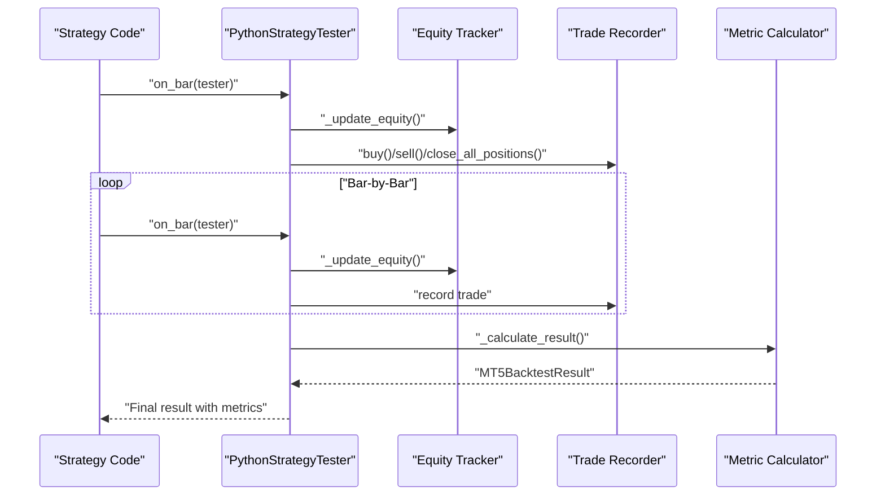

**Diagram sources**
- [mt5_engine.py](file://src/backtesting/mt5_engine.py#L695-L782)
- [mt5_engine.py](file://src/backtesting/mt5_engine.py#L865-L905)

## Detailed Component Analysis

### MT5BacktestResult Dataclass and Result Packaging
MT5BacktestResult encapsulates:
- sharpe: Annualized Sharpe ratio
- return_pct: Total return percentage computed from initial to final equity
- drawdown: Maximum drawdown as a negative percentage
- trades: Total number of recorded trades
- initial_cash, final_cash: Starting and ending account balances
- equity_curve: List of equity values over time
- trade_history: List of completed trade records
- log: Aggregated runtime logs

Conversion to dictionary exposes standardized keys for downstream consumers.

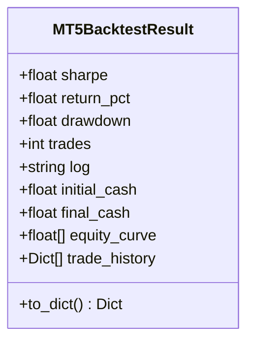

**Diagram sources**
- [mt5_engine.py](file://src/backtesting/mt5_engine.py#L89-L117)

**Section sources**
- [mt5_engine.py](file://src/backtesting/mt5_engine.py#L89-L117)
- [mt5_engine.py](file://src/backtesting/mt5_engine.py#L105-L117)

### Equity Curve Generation and Trade History Recording
- Equity curve: Updated bar-by-bar during strategy execution and finalized into MT5BacktestResult.
- Trade history: Captured upon closing positions, including symbol, volumes, entry/exit prices, direction, timestamps, profit, and commission.

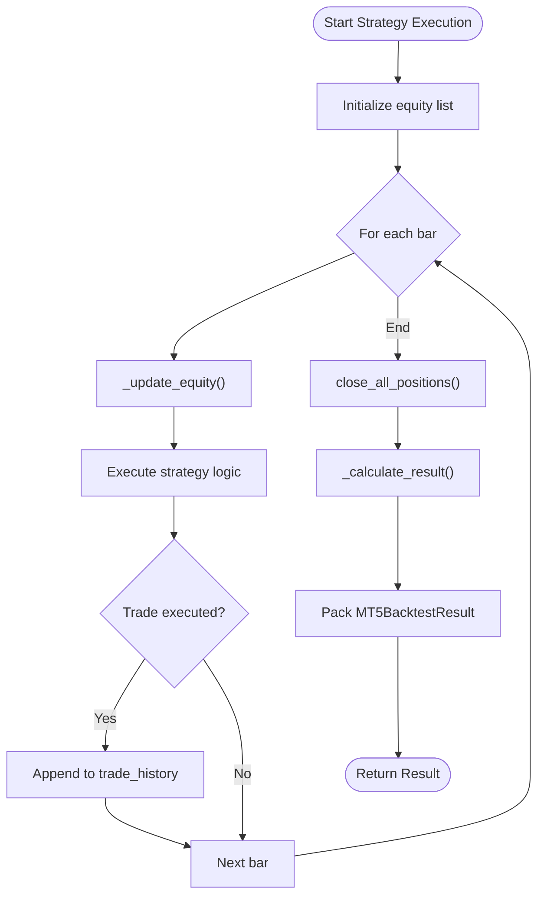

**Diagram sources**
- [mt5_engine.py](file://src/backtesting/mt5_engine.py#L695-L782)
- [mt5_engine.py](file://src/backtesting/mt5_engine.py#L865-L905)

**Section sources**
- [mt5_engine.py](file://src/backtesting/mt5_engine.py#L320-L782)
- [mt5_engine.py](file://src/backtesting/mt5_engine.py#L865-L905)

### Sharpe Ratio Calculation
The Sharpe ratio is computed from periodic returns:
- Excess returns: Mean return minus risk-free rate (annualized)
- Annualization: Multiplied by square root of 252 trading days × 4 observation periods per day (for hourly data)
- Edge cases: Returns NaN removal, zero standard deviation, and empty arrays return zero

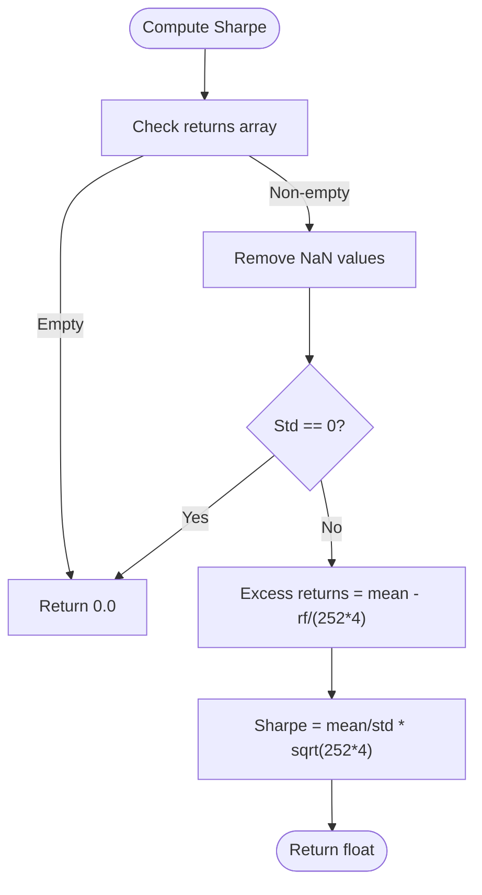

**Diagram sources**
- [mt5_engine.py](file://src/backtesting/mt5_engine.py#L907-L930)

**Section sources**
- [mt5_engine.py](file://src/backtesting/mt5_engine.py#L907-L930)

### Return Percentage Computation
Total return percentage is computed from the first and last equity values:
- Formula: (final − initial) / initial × 100
- Edge case: Initial equity equals zero returns zero

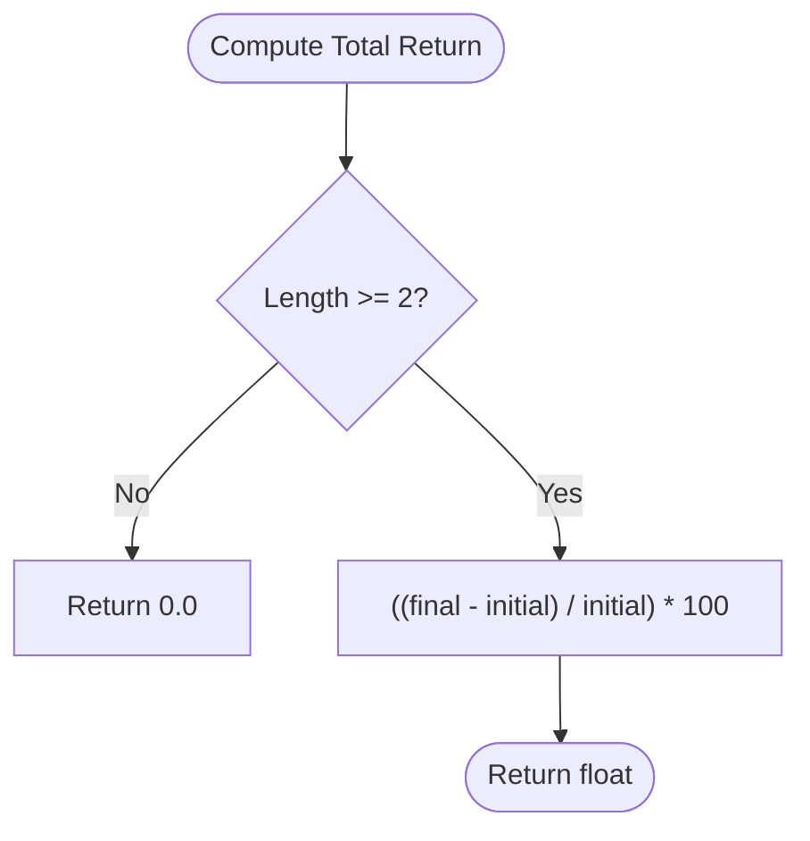

**Diagram sources**
- [mt5_engine.py](file://src/backtesting/mt5_engine.py#L953-L971)

**Section sources**
- [mt5_engine.py](file://src/backtesting/mt5_engine.py#L953-L971)

### Maximum Drawdown Analysis
Maximum drawdown as a percentage:
- Running maximum: Track cumulative peak
- Drawdown: (equity − running_max) / running_max × 100
- Minimum drawdown: Maximum loss relative to peak

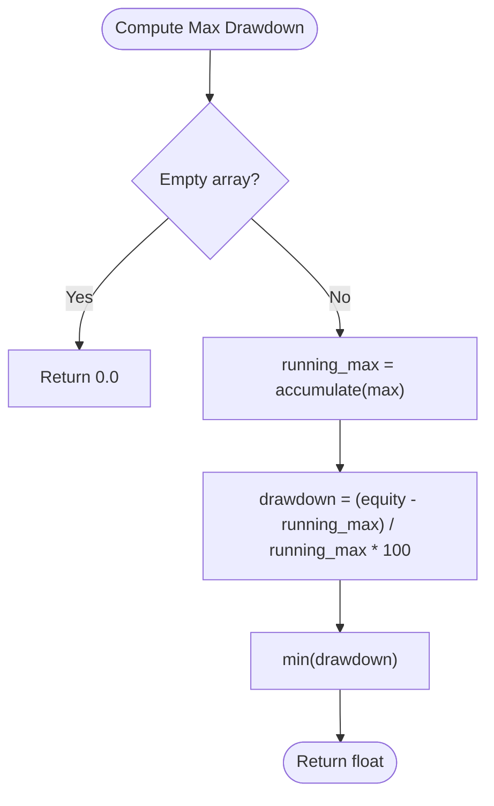

**Diagram sources**
- [mt5_engine.py](file://src/backtesting/mt5_engine.py#L932-L951)

**Section sources**
- [mt5_engine.py](file://src/backtesting/mt5_engine.py#L932-L951)

### Trade Statistics and Risk-Adjusted Metrics
- Trade statistics: Win rate, profit factor, average win/loss, and total trades are derived from recorded trade history.
- Alternative ratios: Articles reference NPMD and Burke ratios as alternatives to Sharpe, emphasizing non-parametric drawdown-based measures.

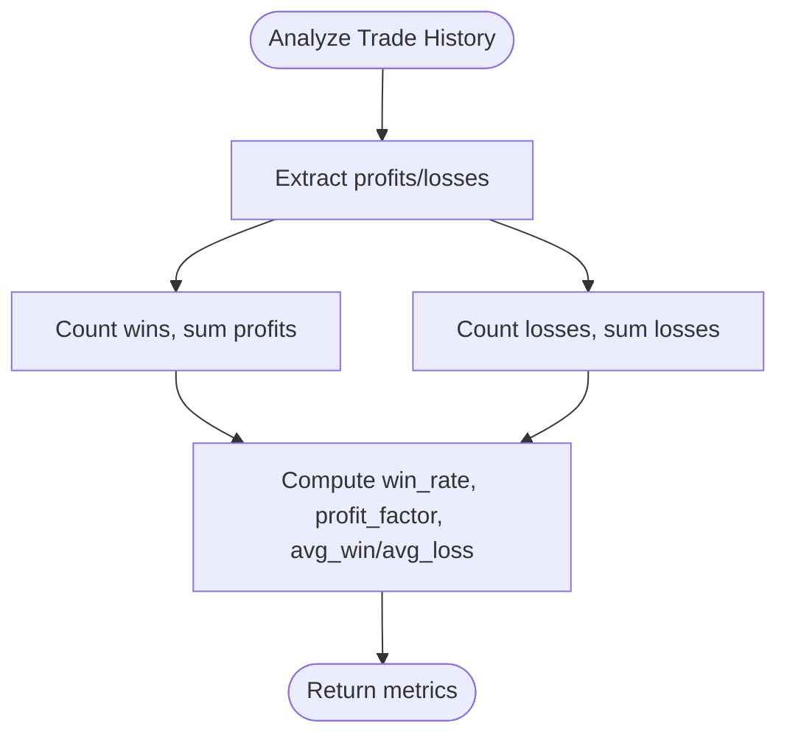

**Diagram sources**
- [alternative_risk_return_metrics_in_mql5.md](file://data/scraped_articles/expert_advisors/alternative_risk_return_metrics_in_mql5.md#L206-L234)

**Section sources**
- [alternative_risk_return_metrics_in_mql5.md](file://data/scraped_articles/expert_advisors/alternative_risk_return_metrics_in_mql5.md#L206-L234)

### Backtrader-Based Metrics (Compatibility)
The Backtrader engine adds analyzers for Sharpe, drawdown, trade analyzer, and returns, extracting metrics similarly packaged into a lightweight result structure.

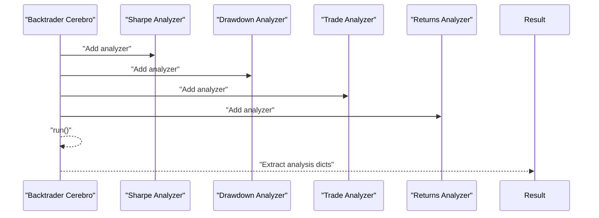

**Diagram sources**
- [core_engine.py](file://src/backtesting/core_engine.py#L51-L78)

**Section sources**
- [core_engine.py](file://src/backtesting/core_engine.py#L18-L82)

### StrategyPerformance Model and Kelly-Based Position Sizing
The StrategyPerformance model validates and computes:
- Payoff ratio (avg_win / avg_loss)
- Expectancy: (win_rate × avg_win) − ((1 − win_rate) × avg_loss)
- Kelly criterion: ((payoff_ratio + 1) × win_rate − 1) / payoff_ratio
- Adjusted Kelly: full_Kelly × k_fraction (clamped at 0)

These metrics enable risk-aware sizing and benchmarking against standard Kelly.

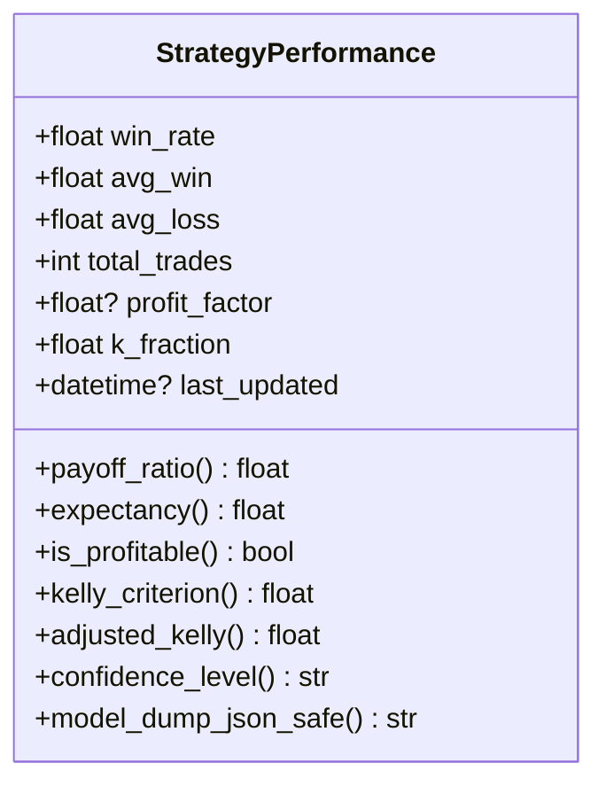

**Diagram sources**
- [strategy_performance.py](file://src/risk/models/strategy_performance.py#L16-L182)

**Section sources**
- [strategy_performance.py](file://src/risk/models/strategy_performance.py#L16-L182)
- [enhanced_kelly_position_sizing_v1.md](file://docs/trds/enhanced_kelly_position_sizing_v1.md#L19-L186)

### Log Management and Trade Journaling
- Runtime logs: Aggregated during strategy execution and included in results for debugging and audit trails.
- Trade journaling: Utilities support logging closed positions with rich metadata, enabling downstream statistics and reporting.

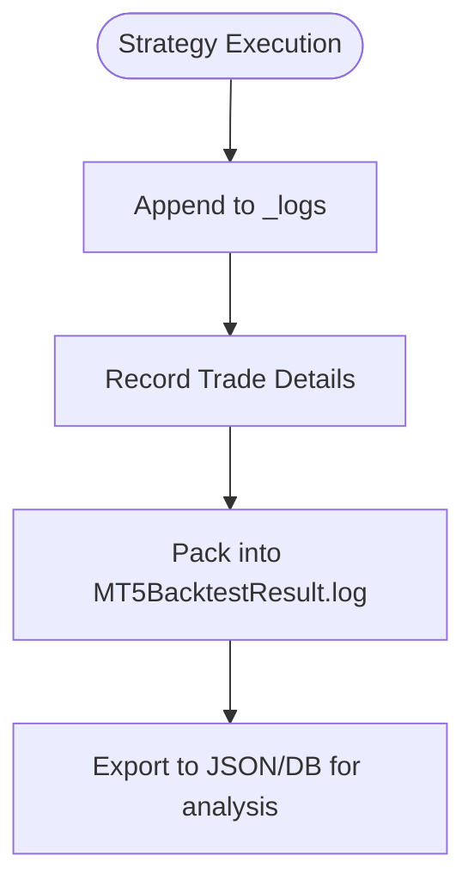

**Diagram sources**
- [mt5_engine.py](file://src/backtesting/mt5_engine.py#L396-L398)
- [mt5_engine.py](file://src/backtesting/mt5_engine.py#L865-L905)
- [log_trade_event.md](file://docs/skills/system_skills/log_trade_event.md#L135-L458)

**Section sources**
- [mt5_engine.py](file://src/backtesting/mt5_engine.py#L396-L398)
- [mt5_engine.py](file://src/backtesting/mt5_engine.py#L865-L905)
- [log_trade_event.md](file://docs/skills/system_skills/log_trade_event.md#L135-L458)

## Dependency Analysis
- MT5 engine depends on NumPy for numerical computations and Pandas for data handling.
- StrategyPerformance relies on Pydantic for validation and serialization.
- Backtrader engine integrates analyzers for Sharpe, drawdown, and trade statistics.
- Trade logging utilities provide persistence and querying for post-backtest analysis.

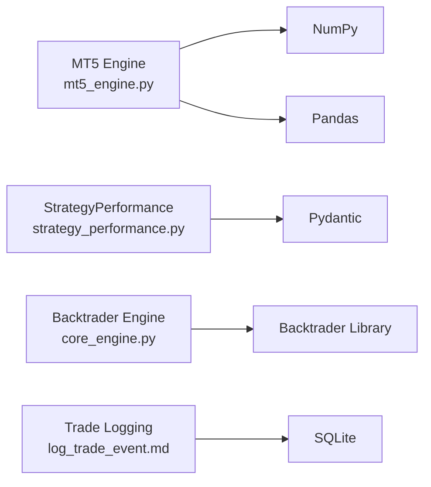

**Diagram sources**
- [mt5_engine.py](file://src/backtesting/mt5_engine.py#L17-L22)
- [strategy_performance.py](file://src/risk/models/strategy_performance.py#L13)
- [core_engine.py](file://src/backtesting/core_engine.py#L1-L6)
- [log_trade_event.md](file://docs/skills/system_skills/log_trade_event.md#L243-L318)

**Section sources**
- [mt5_engine.py](file://src/backtesting/mt5_engine.py#L17-L22)
- [strategy_performance.py](file://src/risk/models/strategy_performance.py#L13)
- [core_engine.py](file://src/backtesting/core_engine.py#L1-L6)
- [log_trade_event.md](file://docs/skills/system_skills/log_trade_event.md#L243-L318)

## Performance Considerations
- Latency targets: The repository defines performance targets for Kelly calculations, analyzer operations, and portfolio scaling to ensure responsive strategy evaluation.
- Memory usage: Benchmarks enforce peak memory thresholds for sustained operation.
- Batch processing: Rolling windows and batch calculations are optimized to meet throughput goals.

Practical guidance:
- Prefer vectorized operations for returns and equity computations.
- Cache frequently accessed data (e.g., OHLCV) to minimize overhead.
- Use incremental updates for equity and drawdown to avoid recomputation.

**Section sources**
- [test_performance.py](file://tests/position_sizing/test_performance.py#L25-L416)

## Troubleshooting Guide
Common issues and resolutions:
- Empty or insufficient equity: Metrics default to zero when fewer than two equity points are available.
- Zero standard deviation: Sharpe defaults to zero when returns are constant.
- Invalid shifts or missing data: MQL5 function overloads return None for out-of-bounds indices.
- Strategy compilation errors: The engine returns a structured error message in the log field.
- Trade history anomalies: Verify that positions are closed and trades are appended consistently.

Validation references:
- Unit tests confirm Sharpe positivity under positive drift, drawdown bounds, and total return correctness.
- MT5 engine tests validate MQL5 function overloads and configurable parameters.

**Section sources**
- [mt5_engine.py](file://src/backtesting/mt5_engine.py#L917-L924)
- [test_mt5_engine.py](file://tests/backtesting/test_mt5_engine.py#L236-L278)
- [test_mt5_engine.py](file://tests/backtesting/test_mt5_engine.py#L41-L110)

## Conclusion
The performance metrics system combines a native MT5 engine with Backtrader analyzers to deliver robust, interpretable results. MT5BacktestResult standardizes outputs, while Sharpe, return percentage, and maximum drawdown are computed with care for edge cases. StrategyPerformance enables risk-aware sizing and expectancy modeling. Trade logging and statistics utilities support post-backtest analysis and integration with external tools. Adhering to performance targets ensures timely evaluation for strategy refinement and benchmarking.

## Appendices

### Mathematical Formulas Summary
- Sharpe ratio (annualized): mean(excess_returns) / std(returns) × sqrt(252 × periods_per_day)
- Total return percentage: (final − initial) / initial × 100
- Maximum drawdown: min((equity − running_max) / running_max × 100)
- Expectancy: win_rate × avg_win − (1 − win_rate) × avg_loss
- Kelly criterion: ((payoff_ratio + 1) × win_rate − 1) / payoff_ratio
- Adjusted Kelly: max(0, kelly_criterion × k_fraction)

**Section sources**
- [mt5_engine.py](file://src/backtesting/mt5_engine.py#L907-L971)
- [strategy_performance.py](file://src/risk/models/strategy_performance.py#L113-L158)

### Examples of Result Interpretation and Benchmark Comparison
- Sharpe interpretation: Higher values indicate better risk-adjusted returns; values near zero suggest neutral or poor risk-adjustment.
- Return percentage: Reflects absolute performance over the test period; consider compounding effects for longer horizons.
- Maximum drawdown: Negative percentage indicating peak-to-trough decline; lower absolute values imply reduced downside risk.
- Benchmark comparison: Compare Sharpe and drawdown across strategies; use trade statistics (win rate, profit factor) to assess consistency and reward structure.

**Section sources**
- [alternative_risk_return_metrics_in_mql5.md](file://data/scraped_articles/expert_advisors/alternative_risk_return_metrics_in_mql5.md#L206-L234)

### Data Quality Considerations and Edge Cases
- Ensure OHLCV data has a monotonic time index and sufficient bars for meaningful metrics.
- Handle missing or invalid shifts gracefully; functions return None for out-of-range indices.
- Validate equity arrays for length and variability; default to zero for insufficient data.
- Commission and slippage impact realized returns; configure appropriately for realistic simulations.

**Section sources**
- [mt5_engine.py](file://src/backtesting/mt5_engine.py#L163-L190)
- [mt5_engine.py](file://src/backtesting/mt5_engine.py#L884-L890)

### Integration with External Analysis Tools
- Export MT5BacktestResult to dictionary for ingestion by dashboards and ML pipelines.
- Use trade logging utilities to persist closed positions for external analytics and reporting.
- Incorporate StrategyPerformance-derived metrics into risk management and position sizing workflows.

**Section sources**
- [mt5_engine.py](file://src/backtesting/mt5_engine.py#L105-L117)
- [log_trade_event.md](file://docs/skills/system_skills/log_trade_event.md#L135-L458)