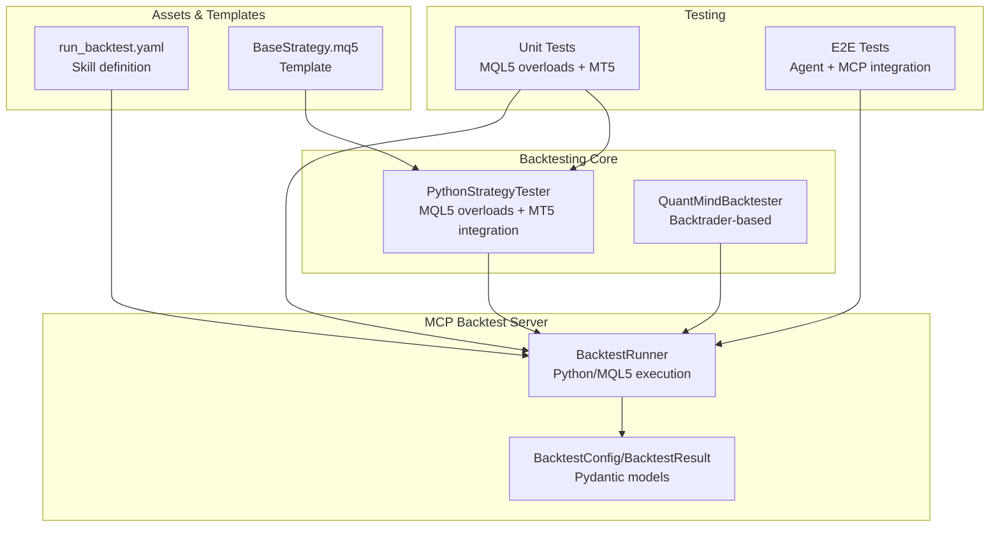
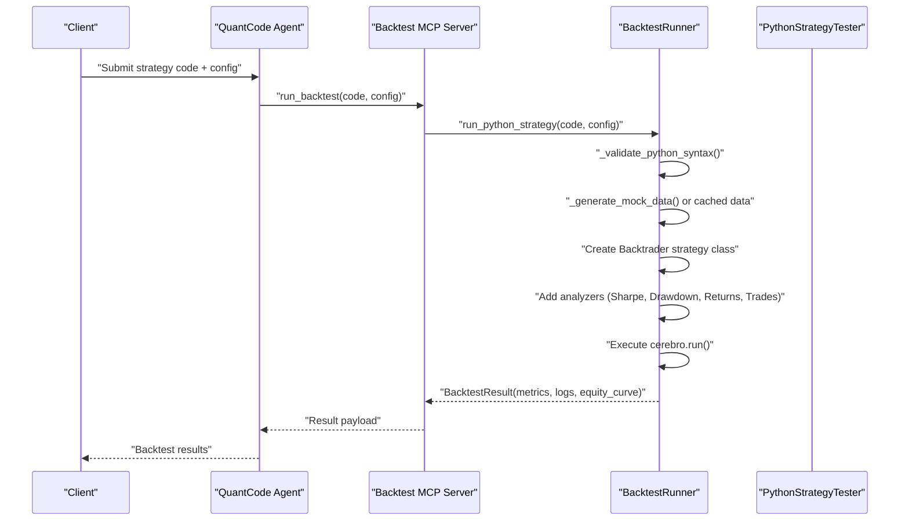
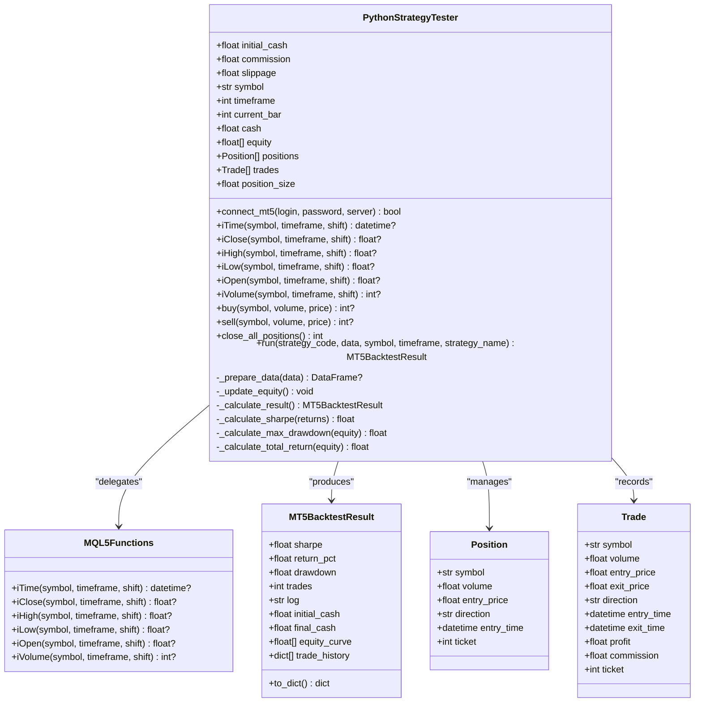
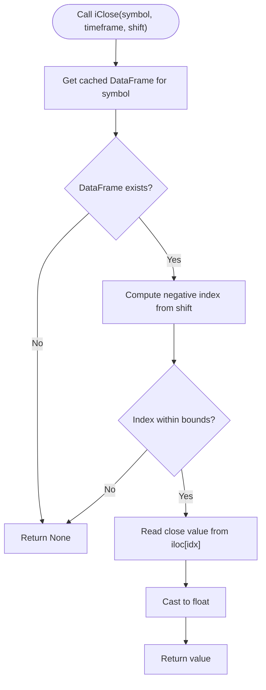
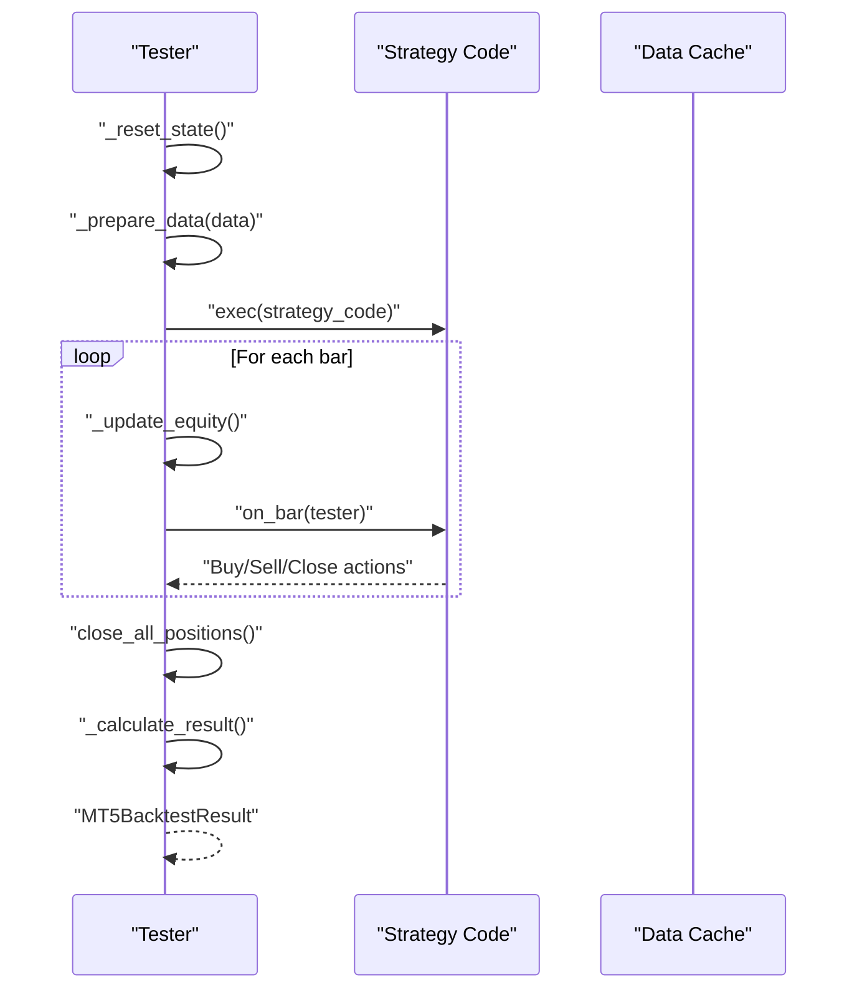
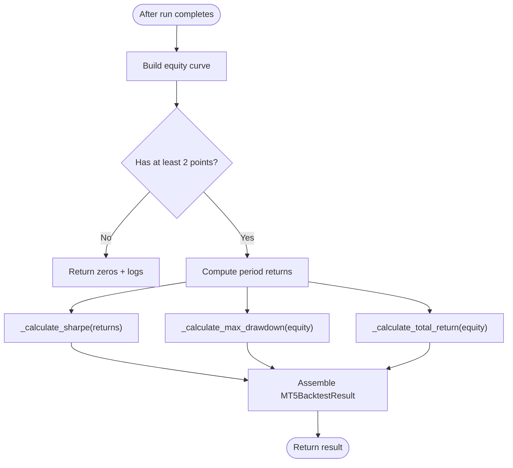
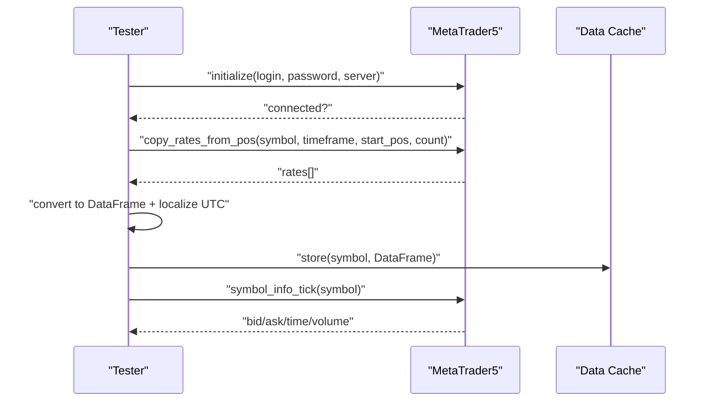
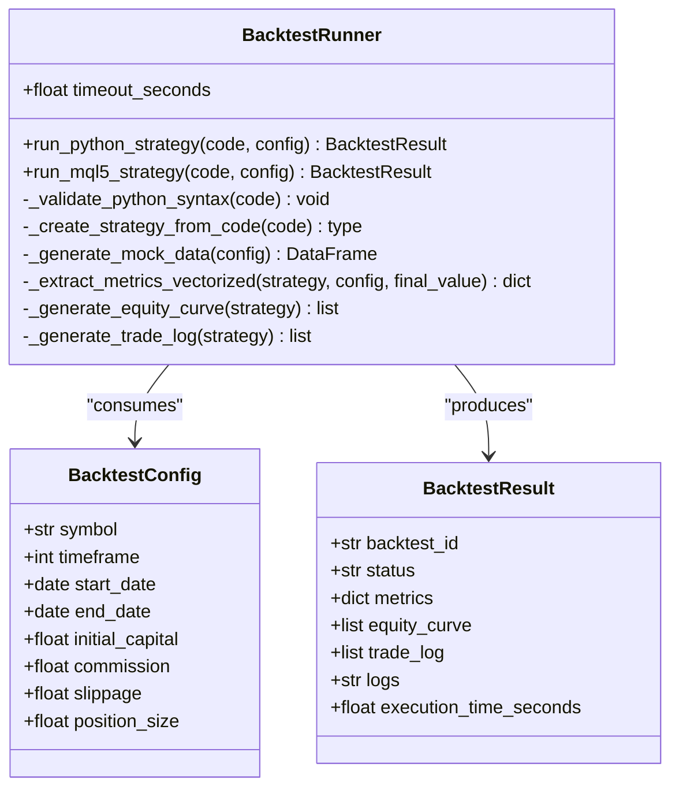
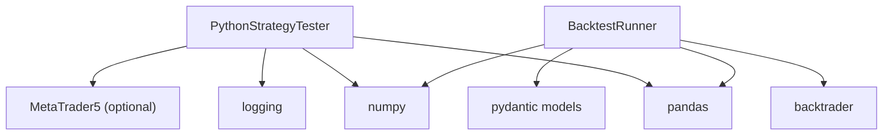

# Python Strategy Tester Core

<cite>
**Referenced Files in This Document**
- [mt5_engine.py](file://src/backtesting/mt5_engine.py)
- [core_engine.py](file://src/backtesting/core_engine.py)
- [test_mt5_engine.py](file://tests/backtesting/test_mt5_engine.py)
- [test_backtest_engine_e2e.py](file://tests/e2e/test_backtest_engine_e2e.py)
- [base_strategy.mq5](file://data/assets/templates/base_strategy.mq5)
- [run_backtest.yaml](file://data/assets/skills/run_backtest.yaml)
- [backtest_runner.py](file://mcp-servers/backtest-mcp-server/backtest_runner.py)
- [models.py](file://mcp-servers/backtest-mcp-server/models.py)
</cite>

## Table of Contents
1. [Introduction](#introduction)
2. [Project Structure](#project-structure)
3. [Core Components](#core-components)
4. [Architecture Overview](#architecture-overview)
5. [Detailed Component Analysis](#detailed-component-analysis)
6. [Dependency Analysis](#dependency-analysis)
7. [Performance Considerations](#performance-considerations)
8. [Troubleshooting Guide](#troubleshooting-guide)
9. [Conclusion](#conclusion)
10. [Appendices](#appendices)

## Introduction
This document describes the Python Strategy Tester Core system, focusing on the PythonStrategyTester class that powers the backtesting engine. It covers MQL5 function overloading, MT5 package integration, strategy execution, performance metrics calculation, and configurable parameters. It also explains initialization parameters (initial cash, commission, slippage), MT5 connection handling, data caching mechanisms, trading state management, logging, and the end-to-end workflow from strategy execution to result calculation. Practical examples, security considerations, error handling strategies, and best practices are included.

## Project Structure
The backtesting system is composed of:
- A Python-based strategy tester with MQL5-style function overloading and MT5 integration
- A pure Python backtester using Backtrader for comparison and baseline testing
- An MCP backtest server that orchestrates Python strategy execution and metrics extraction
- Tests validating MQL5 compatibility, MT5 integration, strategy execution, and metrics calculation
- Skill definitions and MQL5 templates for strategy authoring

**Diagram sources**
- [mt5_engine.py](file://src/backtesting/mt5_engine.py#L320-L991)
- [core_engine.py](file://src/backtesting/core_engine.py#L13-L83)
- [backtest_runner.py](file://mcp-servers/backtest-mcp-server/backtest_runner.py#L47-L603)
- [models.py](file://mcp-servers/backtest-mcp-server/models.py#L16-L273)
- [test_mt5_engine.py](file://tests/backtesting/test_mt5_engine.py#L1-L420)
- [test_backtest_engine_e2e.py](file://tests/e2e/test_backtest_engine_e2e.py#L1-L445)
- [run_backtest.yaml](file://data/assets/skills/run_backtest.yaml#L1-L18)
- [base_strategy.mq5](file://data/assets/templates/base_strategy.mq5#L1-L45)

**Section sources**
- [mt5_engine.py](file://src/backtesting/mt5_engine.py#L1-L15)
- [core_engine.py](file://src/backtesting/core_engine.py#L1-L12)
- [backtest_runner.py](file://mcp-servers/backtest-mcp-server/backtest_runner.py#L1-L10)

## Core Components
- PythonStrategyTester: The main backtesting engine that simulates MQL5 functions, manages trading state, executes strategies bar-by-bar, and calculates performance metrics.
- MQL5Functions: Provides MQL5-compatible wrappers for iTime, iClose, iHigh, iLow, iOpen, iVolume.
- MT5BacktestResult: Structured result container for metrics, logs, equity curve, and trade history.
- QuantMindBacktester: Alternative engine using Backtrader for Python strategies.
- BacktestRunner: MCP server component that executes Python strategies, extracts metrics, and handles errors.

Key capabilities:
- MQL5 function overloading for Python environments
- MT5 package integration for live data retrieval and connection
- Configurable parameters: initial cash, commission, slippage
- Bar-by-bar execution with equity curve updates
- Sharpe ratio, max drawdown, total return calculations
- Logging and trade history capture

**Section sources**
- [mt5_engine.py](file://src/backtesting/mt5_engine.py#L320-L991)
- [core_engine.py](file://src/backtesting/core_engine.py#L13-L83)
- [backtest_runner.py](file://mcp-servers/backtest-mcp-server/backtest_runner.py#L47-L603)

## Architecture Overview
The system supports two execution modes:
- Python strategies executed directly in-memory via Backtrader (core_engine.py)
- Python strategies executed in a simulated MQL5 environment with optional MT5 live data (mt5_engine.py)

**Diagram sources**
- [backtest_runner.py](file://mcp-servers/backtest-mcp-server/backtest_runner.py#L84-L223)
- [models.py](file://mcp-servers/backtest-mcp-server/models.py#L16-L127)

## Detailed Component Analysis

### PythonStrategyTester
The central class that simulates an MQL5 environment in Python, enabling strategies written in Python to use familiar MQL5-style functions while operating on pandas DataFrames.

- Initialization parameters:
  - initial_cash: Starting account balance
  - commission: Fractional commission per trade
  - slippage: Price slippage applied to entries/exits
  - mt5_login/password/server: Optional MT5 terminal credentials for live data

- MT5 integration:
  - connect_mt5(): Initializes MT5 connection if available
  - _copy_rates_from_pos(): Retrieves OHLCV bars from MT5 by position
  - _get_tick(): Fetches current bid/ask/timestamp from MT5
  - _get_mt5_timeframe(): Maps MQL5 timeframe constants to MT5 package constants

- MQL5 function overloading:
  - iTime/iClose/iHigh/iLow/iOpen/iVolume delegate to MQL5Functions
  - Module-level convenience functions (iTime/iClose/etc.) are exposed for compatibility

- Trading operations:
  - buy(): Opens a buy position, applies slippage, updates cash and position size
  - sell(): Closes matching buy positions, computes PnL and commission, updates cash
  - close_all_positions(): Closes all open positions at current close prices

- Strategy execution:
  - run(): Prepares data, compiles strategy code, iterates bars, updates equity, invokes on_bar(tester)
  - _prepare_data(): Normalizes DataFrame with time column/index, timezone-aware timestamps, and required columns
  - _update_equity(): Computes unrealized PnL and appends to equity curve
  - _calculate_result(): Computes Sharpe, max drawdown, total return, builds trade history and logs

- Performance metrics:
  - _calculate_sharpe(): Annualized Sharpe using hourly returns
  - _calculate_max_drawdown(): Peak-to-trough percentage drawdown
  - _calculate_total_return(): Percentage change from initial to final equity

**Diagram sources**
- [mt5_engine.py](file://src/backtesting/mt5_engine.py#L320-L991)

**Section sources**
- [mt5_engine.py](file://src/backtesting/mt5_engine.py#L352-L440)
- [mt5_engine.py](file://src/backtesting/mt5_engine.py#L442-L536)
- [mt5_engine.py](file://src/backtesting/mt5_engine.py#L541-L564)
- [mt5_engine.py](file://src/backtesting/mt5_engine.py#L569-L690)
- [mt5_engine.py](file://src/backtesting/mt5_engine.py#L695-L782)
- [mt5_engine.py](file://src/backtesting/mt5_engine.py#L783-L821)
- [mt5_engine.py](file://src/backtesting/mt5_engine.py#L822-L845)
- [mt5_engine.py](file://src/backtesting/mt5_engine.py#L865-L905)
- [mt5_engine.py](file://src/backtesting/mt5_engine.py#L907-L972)

### MQL5 Built-in Function Overloading
The MQL5Functions class provides Python equivalents for common MQL5 functions:
- iTime: Returns bar open time for a given shift
- iClose/iHigh/iLow/iOpen: Returns OHLC values for a given shift
- iVolume: Returns tick volume for a given shift

These functions operate on the tester’s internal data cache and handle invalid indices gracefully by returning None.

**Diagram sources**
- [mt5_engine.py](file://src/backtesting/mt5_engine.py#L192-L214)

**Section sources**
- [mt5_engine.py](file://src/backtesting/mt5_engine.py#L154-L314)

### Strategy Execution Workflow
The run method orchestrates strategy execution:
- Resets state and prepares data
- Compiles strategy code and locates on_bar(tester)
- Iterates over each bar, updating equity and invoking the strategy
- Closes remaining positions and calculates final metrics

**Diagram sources**
- [mt5_engine.py](file://src/backtesting/mt5_engine.py#L695-L782)

**Section sources**
- [mt5_engine.py](file://src/backtesting/mt5_engine.py#L695-L782)

### Performance Metrics Calculation
- Sharpe ratio: Annualized using hourly returns and a risk-free rate assumption
- Max drawdown: Peak-to-trough percentage drawdown over the equity curve
- Total return: Percentage change from initial to final equity

**Diagram sources**
- [mt5_engine.py](file://src/backtesting/mt5_engine.py#L865-L905)
- [mt5_engine.py](file://src/backtesting/mt5_engine.py#L907-L972)

**Section sources**
- [mt5_engine.py](file://src/backtesting/mt5_engine.py#L865-L972)

### MT5 Package Integration
When the MetaTrader5 package is available, the tester can:
- Connect to the MT5 terminal
- Copy historical rates by position
- Retrieve current tick data
- Map MQL5 timeframes to MT5 constants

**Diagram sources**
- [mt5_engine.py](file://src/backtesting/mt5_engine.py#L410-L536)

**Section sources**
- [mt5_engine.py](file://src/backtesting/mt5_engine.py#L410-L536)

### Backtrader-Based Engine (QuantMindBacktester)
For comparison and baseline testing, the core_engine.py provides a Backtrader-based backtester:
- Accepts strategy code as a string and a pandas DataFrame
- Dynamically compiles the strategy class
- Adds analyzers for Sharpe, drawdown, returns, and trades
- Returns a structured result with metrics and logs

**Section sources**
- [core_engine.py](file://src/backtesting/core_engine.py#L13-L83)

### MCP Backtest Server Integration
The MCP backtest server wraps execution and metrics extraction:
- Validates Python syntax
- Generates or caches mock market data
- Creates a Backtrader strategy from code
- Runs cerebro and extracts metrics using vectorized operations
- Emits structured results with logs and timing

**Diagram sources**
- [backtest_runner.py](file://mcp-servers/backtest-mcp-server/backtest_runner.py#L47-L603)
- [models.py](file://mcp-servers/backtest-mcp-server/models.py#L16-L127)

**Section sources**
- [backtest_runner.py](file://mcp-servers/backtest-mcp-server/backtest_runner.py#L84-L223)
- [models.py](file://mcp-servers/backtest-mcp-server/models.py#L16-L127)

## Dependency Analysis
- PythonStrategyTester depends on:
  - pandas/numpy for data handling and numerical computations
  - logging for diagnostics
  - MetaTrader5 package (optional) for live data retrieval
- BacktestRunner depends on:
  - Backtrader for strategy execution
  - Pydantic models for typed configuration and results
  - NumPy for vectorized metric calculations

**Diagram sources**
- [mt5_engine.py](file://src/backtesting/mt5_engine.py#L17-L32)
- [backtest_runner.py](file://mcp-servers/backtest-mcp-server/backtest_runner.py#L20-L22)
- [models.py](file://mcp-servers/backtest-mcp-server/models.py#L11-L13)

**Section sources**
- [mt5_engine.py](file://src/backtesting/mt5_engine.py#L17-L32)
- [backtest_runner.py](file://mcp-servers/backtest-mcp-server/backtest_runner.py#L20-L22)
- [models.py](file://mcp-servers/backtest-mcp-server/models.py#L11-L13)

## Performance Considerations
- Data preparation: Ensure DataFrame has a timezone-aware time column/index and required OHLCV columns; missing columns are filled with reasonable defaults.
- Equity curve: Computed incrementally during each bar to reflect unrealized PnL.
- Metrics calculation: Vectorized operations are used in the MCP server for speed; the tester computes metrics post-run using NumPy.
- Caching: The MCP server caches market data to avoid repeated generation; similar caching can be considered for large datasets in the tester.
- Slippage and commission: Applied at trade time to simulate realistic outcomes.

[No sources needed since this section provides general guidance]

## Troubleshooting Guide
Common issues and resolutions:
- Strategy compilation errors: Ensure the strategy code defines on_bar(tester) and uses valid Python syntax.
- Missing data: Provide a DataFrame with a time column/index and OHLCV columns; the tester normalizes inputs.
- MT5 connectivity: Confirm MetaTrader5 package is installed and the terminal is reachable; check logs for connection errors.
- Insufficient data points: The MCP server requires a minimum number of data points; synthetic data is generated if not cached.
- Timeout: Execution is bounded; adjust strategy complexity or reduce dataset size.

**Section sources**
- [test_mt5_engine.py](file://tests/backtesting/test_mt5_engine.py#L169-L230)
- [test_backtest_engine_e2e.py](file://tests/e2e/test_backtest_engine_e2e.py#L164-L215)
- [backtest_runner.py](file://mcp-servers/backtest-mcp-server/backtest_runner.py#L123-L127)

## Conclusion
The Python Strategy Tester Core provides a flexible, MQL5-compatible backtesting environment for Python strategies. It supports MT5 integration, realistic trading mechanics (slippage, commission), comprehensive performance metrics, and robust logging. The MCP server extends this capability with standardized execution, error handling, and result formatting. Together, these components enable reliable strategy development, testing, and validation.

[No sources needed since this section summarizes without analyzing specific files]

## Appendices

### Practical Examples and Patterns
- Simple buy-and-hold strategy: Enter on the first bar and hold until the end.
- Trend-following logic: Compare current and previous close prices to enter/exit.
- Using MQL5 functions: Access OHLC and volumes via iClose/iHigh/etc. with shift semantics.

**Section sources**
- [test_mt5_engine.py](file://tests/backtesting/test_mt5_engine.py#L169-L230)

### Security Considerations
- Arbitrary code execution: The tester executes strategy code dynamically. In production, enforce sandboxing, restrict imports, and validate inputs.
- MT5 connectivity: Limit exposure by restricting network access and credential storage.
- Logging: Avoid leaking sensitive information in logs.

**Section sources**
- [mt5_engine.py](file://src/backtesting/mt5_engine.py#L21-L21)
- [mt5_engine.py](file://src/backtesting/mt5_engine.py#L715-L716)

### Integration with External Data Sources
- MT5 live data: Use connect_mt5() and _copy_rates_from_pos() to pull OHLCV bars.
- Skill-based orchestration: The run_backtest skill accepts strategy code, symbol, and timeframe, aligning with MCP server expectations.

**Section sources**
- [mt5_engine.py](file://src/backtesting/mt5_engine.py#L410-L536)
- [run_backtest.yaml](file://data/assets/skills/run_backtest.yaml#L1-L18)

### Best Practices for Strategy Testing and Validation
- Validate strategy logic with small datasets first.
- Use realistic slippage and commission assumptions.
- Monitor logs for warnings and errors.
- Compare results across Python and MQL5 environments when applicable.
- Use the MCP server for scalable batch backtests and consistent metrics.

**Section sources**
- [test_mt5_engine.py](file://tests/backtesting/test_mt5_engine.py#L325-L402)
- [test_backtest_engine_e2e.py](file://tests/e2e/test_backtest_engine_e2e.py#L94-L161)