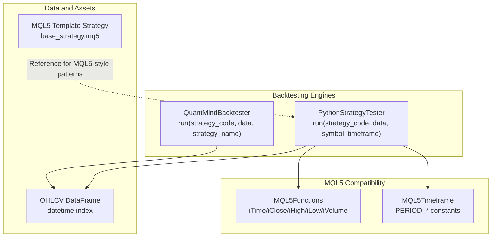
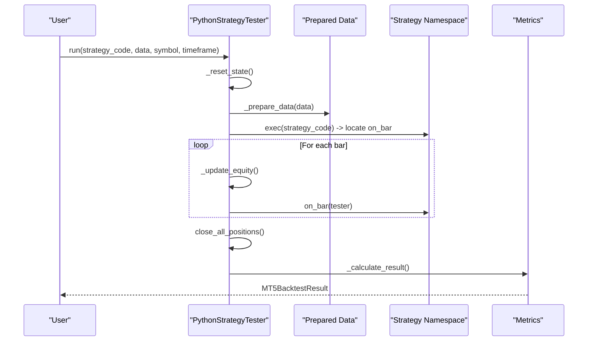
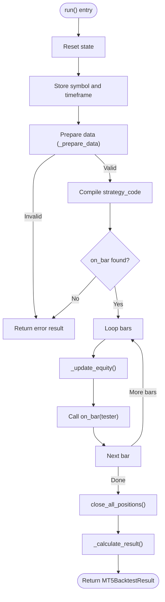
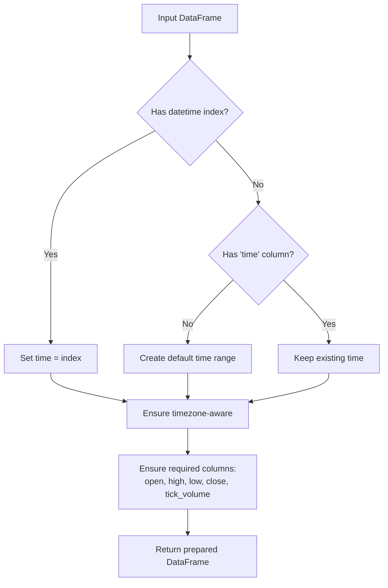
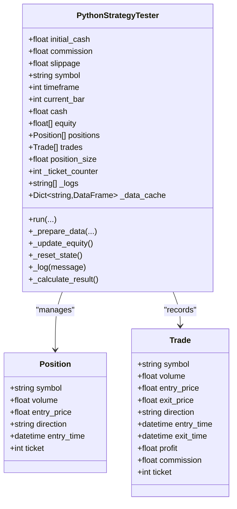
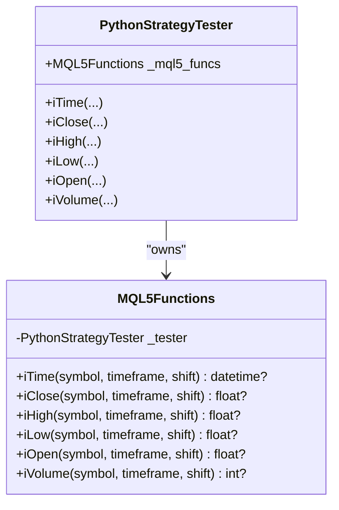
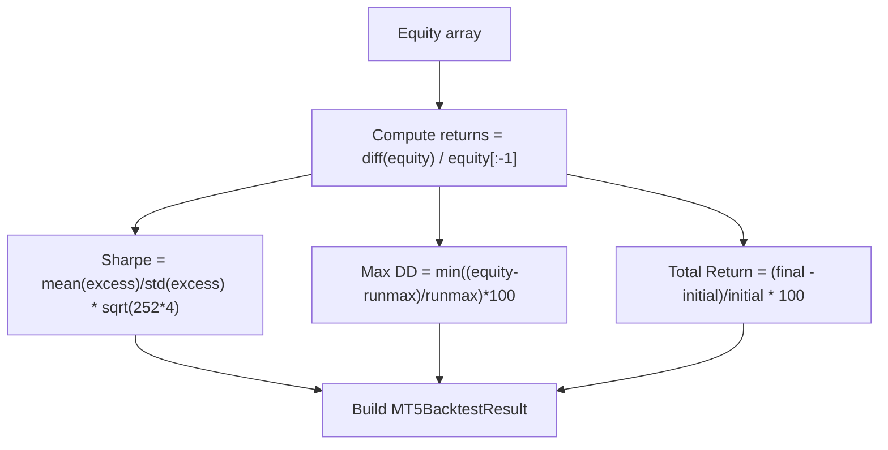
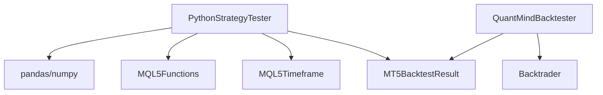

# Strategy Execution Engine

<cite>
**Referenced Files in This Document**
- [mt5_engine.py](file://src/backtesting/mt5_engine.py)
- [core_engine.py](file://src/backtesting/core_engine.py)
- [test_mt5_engine.py](file://tests/backtesting/test_mt5_engine.py)
- [test_backend_bridge_integration.py](file://tests/integration/test_backend_bridge_integration.py)
- [base_strategy.mq5](file://data/assets/templates/base_strategy.mq5)
- [PropManager.mqh](file://src/mql5/Include/QuantMind/Core/PropManager.mqh)
</cite>

## Table of Contents
1. [Introduction](#introduction)
2. [Project Structure](#project-structure)
3. [Core Components](#core-components)
4. [Architecture Overview](#architecture-overview)
5. [Detailed Component Analysis](#detailed-component-analysis)
6. [Dependency Analysis](#dependency-analysis)
7. [Performance Considerations](#performance-considerations)
8. [Troubleshooting Guide](#troubleshooting-guide)
9. [Conclusion](#conclusion)
10. [Appendices](#appendices)

## Introduction
This document describes the strategy execution engine that enables backtesting Python strategies written in an MQL5-style syntax. The engine simulates MQL5 built-in functions (e.g., iTime, iClose, iHigh, iLow, iVolume), executes strategies bar-by-bar, manages state, captures logs, and computes performance metrics such as Sharpe ratio, maximum drawdown, and total return. It supports both pure Python strategies via a dedicated tester and a hybrid approach compatible with existing MQL5 assets.

## Project Structure
The strategy execution engine spans two primary modules:
- Python backtesting engine with MQL5-style overloads
- A simpler engine leveraging the Backtrader framework for Python strategies

**Diagram sources**
- [mt5_engine.py](file://src/backtesting/mt5_engine.py#L319-L781)
- [core_engine.py](file://src/backtesting/core_engine.py#L13-L83)
- [base_strategy.mq5](file://data/assets/templates/base_strategy.mq5#L1-L45)

**Section sources**
- [mt5_engine.py](file://src/backtesting/mt5_engine.py#L1-L991)
- [core_engine.py](file://src/backtesting/core_engine.py#L1-L83)
- [base_strategy.mq5](file://data/assets/templates/base_strategy.mq5#L1-L45)

## Core Components
- PythonStrategyTester: Executes Python strategies with an on_bar(tester) function, simulating MQL5 built-ins and managing trading state.
- MQL5Functions: Provides MQL5-style functions (iTime, iClose, iHigh, iLow, iVolume) for accessing OHLCV data.
- MQL5Timeframe: Defines MQL5 timeframe constants and conversion helpers.
- MT5BacktestResult: Encapsulates backtest results including metrics and logs.
- QuantMindBacktester: Alternative engine that compiles and runs Python strategies using Backtrader.

Key responsibilities:
- Data preparation and validation
- Strategy compilation and on_bar() discovery
- Bar-by-bar execution loop
- Equity and state updates
- Metrics computation (Sharpe, drawdown, return)
- Logging and error reporting

**Section sources**
- [mt5_engine.py](file://src/backtesting/mt5_engine.py#L319-L991)
- [core_engine.py](file://src/backtesting/core_engine.py#L13-L83)

## Architecture Overview
The engine orchestrates strategy execution through a deterministic pipeline: reset state, prepare data, compile strategy, iterate bars, update state, compute final metrics.

**Diagram sources**
- [mt5_engine.py](file://src/backtesting/mt5_engine.py#L695-L781)

## Detailed Component Analysis

### PythonStrategyTester.run()
Workflow highlights:
- Resets internal state and stores symbol/timeframe.
- Prepares OHLCV data ensuring datetime handling and required columns.
- Compiles strategy_code and validates presence of on_bar().
- Iterates over bars, updating equity and invoking on_bar(tester).
- Closes remaining positions and computes final metrics.

**Diagram sources**
- [mt5_engine.py](file://src/backtesting/mt5_engine.py#L695-L781)

**Section sources**
- [mt5_engine.py](file://src/backtesting/mt5_engine.py#L695-L781)

### Data Preparation in _prepare_data()
Responsibilities:
- Accepts raw OHLCV DataFrame.
- Ensures a time column exists and is timezone-aware.
- Adds missing required columns with sensible defaults.
- Normalizes column names and types.

**Diagram sources**
- [mt5_engine.py](file://src/backtesting/mt5_engine.py#L783-L820)

**Section sources**
- [mt5_engine.py](file://src/backtesting/mt5_engine.py#L783-L820)

### State Management During Execution
State maintained per backtest:
- Symbol, timeframe, current_bar index
- Cash balance and equity curve
- Positions and trades
- Ticket counter and logs
- Data cache per symbol

Reset on each run to avoid cross-test contamination.

**Diagram sources**
- [mt5_engine.py](file://src/backtesting/mt5_engine.py#L320-L405)
- [mt5_engine.py](file://src/backtesting/mt5_engine.py#L124-L148)

**Section sources**
- [mt5_engine.py](file://src/backtesting/mt5_engine.py#L320-L405)
- [mt5_engine.py](file://src/backtesting/mt5_engine.py#L846-L860)

### MQL5 Built-in Function Overloading
MQL5Functions exposes iTime, iClose, iHigh, iLow, iOpen, iVolume mapped to DataFrame lookups. Module-level convenience functions delegate to a default tester instance.

**Diagram sources**
- [mt5_engine.py](file://src/backtesting/mt5_engine.py#L154-L314)
- [mt5_engine.py](file://src/backtesting/mt5_engine.py#L541-L563)

**Section sources**
- [mt5_engine.py](file://src/backtesting/mt5_engine.py#L154-L314)
- [mt5_engine.py](file://src/backtesting/mt5_engine.py#L541-L563)

### Result Calculation via _calculate_result()
Calculations:
- Returns vector from equity curve
- Sharpe ratio (annualized) using hourly assumption
- Maximum drawdown as percentage
- Total return percentage
- Aggregates logs, equity curve, and trade history

**Diagram sources**
- [mt5_engine.py](file://src/backtesting/mt5_engine.py#L865-L971)

**Section sources**
- [mt5_engine.py](file://src/backtesting/mt5_engine.py#L865-L971)

### Security Considerations for Arbitrary Code Execution
- Both engines execute arbitrary Python code:
  - PythonStrategyTester.run() uses exec(strategy_code, globals(), namespace)
  - QuantMindBacktester.run() uses exec(strategy_code)
- Production deployments must enforce sandboxing:
  - Resource limits (AS/Data/Stack)
  - IO redirection and stdin/stdout capture
  - Restricted built-ins and forbidden opcodes
  - Timeouts and memory caps
- Reference implementations demonstrate guardrails (reliability_guard, timeout, forbidden op checks) that should be integrated.

Security-related references:
- Sandbox guards and IO restrictions
- Forbidden operations and timeouts

**Section sources**
- [mt5_engine.py](file://src/backtesting/mt5_engine.py#L715-L716)
- [core_engine.py](file://src/backtesting/core_engine.py#L21-L22)

### Logging Mechanisms
- Internal logging via _log() appends messages to an internal list.
- Final result includes a combined log string for downstream reporting.
- Strategy errors are captured and logged per bar to aid debugging.

**Section sources**
- [mt5_engine.py](file://src/backtesting/mt5_engine.py#L857-L860)
- [mt5_engine.py](file://src/backtesting/mt5_engine.py#L771-L772)

### Examples of Strategy Development Patterns
- Minimal buy-on-first-bar pattern
- Trend-following logic using iClose and iOpen
- Entry/exit conditions based on price comparisons

Example references:
- Simple buy strategy
- Entry/exit logic with moving average-like condition
- Integration test invoking run()

**Section sources**
- [test_mt5_engine.py](file://tests/backtesting/test_mt5_engine.py#L169-L196)
- [test_mt5_engine.py](file://tests/backtesting/test_mt5_engine.py#L197-L230)
- [test_backend_bridge_integration.py](file://tests/integration/test_backend_bridge_integration.py#L397-L403)

### Common Pitfalls and Debugging Techniques
Common pitfalls:
- Missing on_bar function in strategy code
- Invalid or empty data passed to run()
- Out-of-bounds shifts to MQL5Functions
- Insufficient equity to open positions
- Incorrect timeframe mapping impacting data retrieval

Debugging tips:
- Inspect returned log for per-bar errors
- Validate data shape and time alignment
- Use module-level convenience functions for quick checks
- Confirm timeframe constants align with data frequency

**Section sources**
- [mt5_engine.py](file://src/backtesting/mt5_engine.py#L742-L749)
- [mt5_engine.py](file://src/backtesting/mt5_engine.py#L107-L110)
- [test_mt5_engine.py](file://tests/backtesting/test_mt5_engine.py#L101-L111)

## Dependency Analysis
Relationships:
- PythonStrategyTester depends on pandas/numpy for data handling and MQL5Functions for OHLCV access.
- MQL5Timeframe provides constants and conversions for timeframes.
- MT5BacktestResult aggregates metrics and logs.
- QuantMindBacktester integrates with Backtrader for analyzer-based metrics.

**Diagram sources**
- [mt5_engine.py](file://src/backtesting/mt5_engine.py#L17-L32)
- [core_engine.py](file://src/backtesting/core_engine.py#L1-L6)

**Section sources**
- [mt5_engine.py](file://src/backtesting/mt5_engine.py#L17-L32)
- [core_engine.py](file://src/backtesting/core_engine.py#L1-L6)

## Performance Considerations
- Data preparation: Prefer aligned, timezone-aware timestamps and pre-normalized columns to minimize overhead.
- Strategy loops: Keep on_bar() logic vectorized where possible; avoid repeated DataFrame slicing.
- Metrics computation: Equity updates and returns calculation are O(N); ensure N is bounded by dataset length.
- Memory management: Reuse lists and arrays; avoid frequent allocations inside tight loops.
- Scalability: For large datasets, consider chunked execution or parallelization of independent backtests.

[No sources needed since this section provides general guidance]

## Troubleshooting Guide
- Strategy fails to compile:
  - Ensure strategy_code defines on_bar(tester) and uses supported MQL5-style functions.
- No trades recorded:
  - Verify entry conditions and that iClose/iOpen return valid values for current_bar.
- Unexpected drawdown:
  - Check commission and slippage settings; confirm equity curve reflects realized PnL.
- MT5 integration issues:
  - Confirm MT5 availability and connection; verify timeframe mapping.

**Section sources**
- [mt5_engine.py](file://src/backtesting/mt5_engine.py#L738-L760)
- [test_mt5_engine.py](file://tests/backtesting/test_mt5_engine.py#L347-L376)

## Conclusion
The strategy execution engine provides a robust, MQL5-compatible pathway to backtest Python strategies. It offers deterministic bar-by-bar execution, comprehensive metrics, and flexible data handling. For production use, integrate strong sandboxing and monitoring to mitigate risks associated with arbitrary code execution.

[No sources needed since this section summarizes without analyzing specific files]

## Appendices

### API Summary: PythonStrategyTester
- run(strategy_code, data, symbol, timeframe) -> MT5BacktestResult
- iTime/iClose/iHigh/iLow/iOpen/iVolume
- buy/sell/close_all_positions
- _prepare_data, _update_equity, _calculate_result, _log

**Section sources**
- [mt5_engine.py](file://src/backtesting/mt5_engine.py#L695-L991)

### Related MQL5 Asset Reference
- Base template strategy demonstrates MQL5-style structure and lifecycle hooks.

**Section sources**
- [base_strategy.mq5](file://data/assets/templates/base_strategy.mq5#L1-L45)

### Additional Risk Metric Reference
- Daily drawdown calculation concept for equity monitoring.

**Section sources**
- [PropManager.mqh](file://src/mql5/Include/QuantMind/Core/PropManager.mqh#L83-L93)